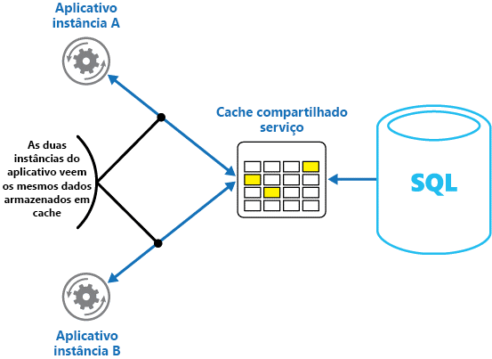

# <a name="caching"></a><span data-ttu-id="f3557-103">Cache</span><span class="sxs-lookup"><span data-stu-id="f3557-103">Caching</span></span>

<span data-ttu-id="f3557-104">O caching é uma técnica comum que tem o objetivo de melhorar o desempenho e a escalabilidade de um sistema.</span><span class="sxs-lookup"><span data-stu-id="f3557-104">Caching is a common technique that aims to improve the performance and scalability of a system.</span></span> <span data-ttu-id="f3557-105">Ele faz isso copiando temporariamente dados acessados com frequência para um armazenamento rápido localizado próximo ao aplicativo.</span><span class="sxs-lookup"><span data-stu-id="f3557-105">It does this by temporarily copying frequently accessed data to fast storage that's located close to the application.</span></span> <span data-ttu-id="f3557-106">Se esse armazenamento rápido de dados estiver mais próximo do aplicativo do que a fonte original, o caching poderá melhorar significativamente os tempos de resposta para aplicativos cliente ao fornecer dados com mais rapidez.</span><span class="sxs-lookup"><span data-stu-id="f3557-106">If this fast data storage is located closer to the application than the original source, then caching can significantly improve response times for client applications by serving data more quickly.</span></span>

<span data-ttu-id="f3557-107">O caching é mais eficaz quando uma instância do cliente lê repetidamente os mesmos dados, especialmente se todas as condições a seguir se aplicarem ao armazenamento de dados original:</span><span class="sxs-lookup"><span data-stu-id="f3557-107">Caching is most effective when a client instance repeatedly reads the same data, especially if all the following conditions apply to the original data store:</span></span>

- <span data-ttu-id="f3557-108">Ele permanece relativamente estático.</span><span class="sxs-lookup"><span data-stu-id="f3557-108">It remains relatively static.</span></span>
- <span data-ttu-id="f3557-109">É lento em comparação à velocidade do cache.</span><span class="sxs-lookup"><span data-stu-id="f3557-109">It's slow compared to the speed of the cache.</span></span>
- <span data-ttu-id="f3557-110">Está sujeito a um alto nível de contenção.</span><span class="sxs-lookup"><span data-stu-id="f3557-110">It's subject to a high level of contention.</span></span>
- <span data-ttu-id="f3557-111">Está bem distante quando a latência de rede pode causar a lentidão do acesso.</span><span class="sxs-lookup"><span data-stu-id="f3557-111">It's far away when network latency can cause access to be slow.</span></span>

## <a name="caching-in-distributed-applications"></a><span data-ttu-id="f3557-112">Caching em aplicativos distribuídos</span><span class="sxs-lookup"><span data-stu-id="f3557-112">Caching in distributed applications</span></span>

<span data-ttu-id="f3557-113">Aplicativos distribuídos normalmente implementam uma ou ambas as estratégias a seguir ao colocar dados em cache:</span><span class="sxs-lookup"><span data-stu-id="f3557-113">Distributed applications typically implement either or both of the following strategies when caching data:</span></span>

- <span data-ttu-id="f3557-114">Usando um cache privado, onde os dados são mantidos localmente no computador que executa uma instância de um aplicativo ou de um serviço.</span><span class="sxs-lookup"><span data-stu-id="f3557-114">Using a private cache, where data is held locally on the computer that's running an instance of an application or service.</span></span>
- <span data-ttu-id="f3557-115">Usando um cache compartilhado, servindo como uma fonte comum que pode ser acessada por vários processos e/ou computadores.</span><span class="sxs-lookup"><span data-stu-id="f3557-115">Using a shared cache, serving as a common source which can be accessed by multiple processes and/or machines.</span></span>

<span data-ttu-id="f3557-116">Em ambos os casos, o caching pode ser executado no lado do cliente e/ou do servidor.</span><span class="sxs-lookup"><span data-stu-id="f3557-116">In both cases, caching can be performed client-side and/or server-side.</span></span> <span data-ttu-id="f3557-117">O caching do lado do cliente é feito pelo processo que fornece a interface de usuário para um sistema, como um navegador da Web ou um aplicativo de área de trabalho.</span><span class="sxs-lookup"><span data-stu-id="f3557-117">Client-side caching is done by the process that provides the user interface for a system, such as a web browser or desktop application.</span></span> <span data-ttu-id="f3557-118">O caching do lado do servidor é feito pelo processo que fornece os serviços de negócios que estão sendo executados remotamente.</span><span class="sxs-lookup"><span data-stu-id="f3557-118">Server-side caching is done by the process that provides the business services that are running remotely.</span></span>

### <a name="private-caching"></a><span data-ttu-id="f3557-119">Caching particular</span><span class="sxs-lookup"><span data-stu-id="f3557-119">Private caching</span></span>

<span data-ttu-id="f3557-120">O tipo mais básico de cache é um repositório na memória.</span><span class="sxs-lookup"><span data-stu-id="f3557-120">The most basic type of cache is an in-memory store.</span></span> <span data-ttu-id="f3557-121">Ele é mantido no espaço de endereço de um único processo e acessado diretamente pelo código que é executado nesse processo.</span><span class="sxs-lookup"><span data-stu-id="f3557-121">It's held in the address space of a single process and accessed directly by the code that runs in that process.</span></span> <span data-ttu-id="f3557-122">O acesso a esse tipo de cache é muito rápido.</span><span class="sxs-lookup"><span data-stu-id="f3557-122">This type of cache is very quick to access.</span></span> <span data-ttu-id="f3557-123">Ele também pode fornecer um meio extremamente eficiente para armazenar quantidades modestas de dados estáticos, já que o tamanho de um cache normalmente é restrito pelo volume de memória disponível no computador que hospeda o processo.</span><span class="sxs-lookup"><span data-stu-id="f3557-123">It can also provide an extremely effective means for storing modest amounts of static data, since the size of a cache is typically constrained by the volume of memory that's available on the machine hosting the process.</span></span>

<span data-ttu-id="f3557-124">Se você precisar colocar em cache mais informações do que é possível armazenar fisicamente na memória, você pode gravar dados colocados em cache no sistema de arquivos local.</span><span class="sxs-lookup"><span data-stu-id="f3557-124">If you need to cache more information than is physically possible in memory, you can write cached data to the local file system.</span></span> <span data-ttu-id="f3557-125">O acesso a esses dados será mais lento do que acessar dados mantidos na memória, mas ainda deve ser mais rápido e confiável do que recuperar dados por uma rede.</span><span class="sxs-lookup"><span data-stu-id="f3557-125">This will be slower to access than data that's held in-memory, but should still be faster and more reliable than retrieving data across a network.</span></span>

<span data-ttu-id="f3557-126">Se você tiver várias instâncias de um aplicativo que usa esse modelo em execução simultânea, cada instância do aplicativo terá seu próprio cache independente com sua própria cópia dos dados.</span><span class="sxs-lookup"><span data-stu-id="f3557-126">If you have multiple instances of an application that uses this model running concurrently, each application instance has its own independent cache holding its own copy of the data.</span></span>

<span data-ttu-id="f3557-127">Pense em um cache como um instantâneo dos dados originais, em algum ponto no passado.</span><span class="sxs-lookup"><span data-stu-id="f3557-127">Think of a cache as a snapshot of the original data at some point in the past.</span></span> <span data-ttu-id="f3557-128">Se esses dados não forem estáticos, provavelmente as instâncias diferentes do aplicativo terão versões diferentes dos dados em seus caches.</span><span class="sxs-lookup"><span data-stu-id="f3557-128">If this data is not static, it is likely that different application instances hold different versions of the data in their caches.</span></span> <span data-ttu-id="f3557-129">Portanto, a mesma consulta executada por essas instâncias pode retornar resultados diferentes, como mostra a Figura 1.</span><span class="sxs-lookup"><span data-stu-id="f3557-129">Therefore, the same query performed by these instances can return different results, as shown in Figure 1.</span></span>


<span data-ttu-id="f3557-131">*Figura 1: Usando um cache em memória em diferentes instâncias de um aplicativo.*</span><span class="sxs-lookup"><span data-stu-id="f3557-131">*Figure 1: Using an in-memory cache in different instances of an application.*</span></span>

### <a name="shared-caching"></a><span data-ttu-id="f3557-132">Cache compartilhado</span><span class="sxs-lookup"><span data-stu-id="f3557-132">Shared caching</span></span>

<span data-ttu-id="f3557-133">Usar um cache compartilhado pode ajudar a aliviar a preocupação de que os dados podem apresentar diferenças em cada cache, o que pode ocorrer com o caching em memória.</span><span class="sxs-lookup"><span data-stu-id="f3557-133">Using a shared cache can help alleviate concerns that data might differ in each cache, which can occur with in-memory caching.</span></span> <span data-ttu-id="f3557-134">O cache compartilhado garante que diferentes instâncias de aplicativo vejam os mesmos dados armazenados em cache.</span><span class="sxs-lookup"><span data-stu-id="f3557-134">Shared caching ensures that different application instances see the same view of cached data.</span></span> <span data-ttu-id="f3557-135">Ele faz isso colocando o cache em um local separado, normalmente hospedado como parte de um serviço separado, como mostra a Figura 2.</span><span class="sxs-lookup"><span data-stu-id="f3557-135">It does this by locating the cache in a separate location, typically hosted as part of a separate service, as shown in Figure 2.</span></span>



<span data-ttu-id="f3557-137">*Figura 2: Como usar um cache compartilhado.*</span><span class="sxs-lookup"><span data-stu-id="f3557-137">*Figure 2: Using a shared cache.*</span></span>

<span data-ttu-id="f3557-138">Um benefício importante da abordagem de cache compartilhado é a escalabilidade que ele oferece.</span><span class="sxs-lookup"><span data-stu-id="f3557-138">An important benefit of the shared caching approach is the scalability it provides.</span></span> <span data-ttu-id="f3557-139">Muitos serviços de cache compartilhado são implementados usando um cluster de servidores e utilizam o software que distribui os dados pelo cluster de modo transparente.</span><span class="sxs-lookup"><span data-stu-id="f3557-139">Many shared cache services are implemented by using a cluster of servers, and utilize software that distributes the data across the cluster in a transparent manner.</span></span> <span data-ttu-id="f3557-140">Uma instância do aplicativo simplesmente envia uma solicitação para o serviço de cache.</span><span class="sxs-lookup"><span data-stu-id="f3557-140">An application instance simply sends a request to the cache service.</span></span> <span data-ttu-id="f3557-141">A infraestrutura subjacente é responsável por determinar o local dos dados armazenados em cache no cluster.</span><span class="sxs-lookup"><span data-stu-id="f3557-141">The underlying infrastructure is responsible for determining the location of the cached data in the cluster.</span></span> <span data-ttu-id="f3557-142">Você pode facilmente dimensionar o cache adicionando mais servidores.</span><span class="sxs-lookup"><span data-stu-id="f3557-142">You can easily scale the cache by adding more servers.</span></span>

<span data-ttu-id="f3557-143">Há duas desvantagens principais na abordagem de cache compartilhado:</span><span class="sxs-lookup"><span data-stu-id="f3557-143">There are two main disadvantages of the shared caching approach:</span></span>

- <span data-ttu-id="f3557-144">O acesso ao cache é mais lento, pois ele não é mais mantido localmente para cada instância do aplicativo.</span><span class="sxs-lookup"><span data-stu-id="f3557-144">The cache is slower to access because it is no longer held locally to each application instance.</span></span>
- <span data-ttu-id="f3557-145">A necessidade de implementar um serviço de cache separado pode adicionar complexidade à solução.</span><span class="sxs-lookup"><span data-stu-id="f3557-145">The requirement to implement a separate cache service might add complexity to the solution.</span></span>

## <a name="considerations-for-using-caching"></a><span data-ttu-id="f3557-146">Considerações para o uso de caching</span><span class="sxs-lookup"><span data-stu-id="f3557-146">Considerations for using caching</span></span>

<span data-ttu-id="f3557-147">As seções a seguir descrevem detalhadamente as considerações para a criação e uso de um cache.</span><span class="sxs-lookup"><span data-stu-id="f3557-147">The following sections describe in more detail the considerations for designing and using a cache.</span></span>

### <a name="decide-when-to-cache-data"></a><span data-ttu-id="f3557-148">Decidir quando armazenar dados em cache</span><span class="sxs-lookup"><span data-stu-id="f3557-148">Decide when to cache data</span></span>

<span data-ttu-id="f3557-149">Caching pode melhorar drasticamente o desempenho, a escalabilidade e a disponibilidade.</span><span class="sxs-lookup"><span data-stu-id="f3557-149">Caching can dramatically improve performance, scalability, and availability.</span></span> <span data-ttu-id="f3557-150">Quanto mais dados você tiver e quanto maior for o número de usuários que precisam acessar esses dados, maior serão as vantagens do caching.</span><span class="sxs-lookup"><span data-stu-id="f3557-150">The more data that you have and the larger the number of users that need to access this data, the greater the benefits of caching become.</span></span> <span data-ttu-id="f3557-151">Isso ocorre porque o caching reduz a latência e a contenção associadas à manipulação de grandes volumes de solicitações simultâneas no armazenamento de dados original.</span><span class="sxs-lookup"><span data-stu-id="f3557-151">That's because caching reduces the latency and contention that's associated with handling large volumes of concurrent requests in the original data store.</span></span>

<span data-ttu-id="f3557-152">Por exemplo, um banco de dados pode oferecer suporte a uma quantidade limitada de conexões simultâneas.</span><span class="sxs-lookup"><span data-stu-id="f3557-152">For example, a database might support a limited number of concurrent connections.</span></span> <span data-ttu-id="f3557-153">No entanto, recuperar dados de um cache compartilhado em vez de no banco de dados subjacente possibilita a um aplicativo cliente acessar esses dados, mesmo que o número de conexões disponíveis esteja esgotado no momento.</span><span class="sxs-lookup"><span data-stu-id="f3557-153">Retrieving data from a shared cache, however, rather than the underlying database, makes it possible for a client application to access this data even if the number of available connections is currently exhausted.</span></span> <span data-ttu-id="f3557-154">Além disso, se o banco de dados ficar indisponível, os aplicativos cliente poderão continuar usando os dados mantidos no cache.</span><span class="sxs-lookup"><span data-stu-id="f3557-154">Additionally, if the database becomes unavailable, client applications might be able to continue by using the data that's held in the cache.</span></span>

<span data-ttu-id="f3557-155">Uma opção é armazenar em cache os dados lidos com frequência, mas que não são modificados frequentemente (por exemplo, os dados com uma proporção maior de operações de leitura em relação às operações de gravação).</span><span class="sxs-lookup"><span data-stu-id="f3557-155">Consider caching data that is read frequently but modified infrequently (for example, data that has a higher proportion of read operations than write operations).</span></span> <span data-ttu-id="f3557-156">No entanto, não recomendamos o uso do cache como o repositório autoritativo de informações críticas.</span><span class="sxs-lookup"><span data-stu-id="f3557-156">However, we don't recommend that you use the cache as the authoritative store of critical information.</span></span> <span data-ttu-id="f3557-157">Em vez disso, certifique-se de que todas as alterações que seu aplicativo não pode perder sejam salvas sempre um armazenamento de dados persistente.</span><span class="sxs-lookup"><span data-stu-id="f3557-157">Instead, ensure that all changes that your application cannot afford to lose are always saved to a persistent data store.</span></span> <span data-ttu-id="f3557-158">Isso significa que se o cache ficar indisponível, o aplicativo ainda poderá continuar a operar usando o repositório de dados e você não perderá informações importantes.</span><span class="sxs-lookup"><span data-stu-id="f3557-158">This means that if the cache is unavailable, your application can still continue to operate by using the data store, and you won't lose important information.</span></span>

### <a name="determine-how-to-cache-data-effectively"></a><span data-ttu-id="f3557-159">Determinar como armazenar os dados em cache com eficiência</span><span class="sxs-lookup"><span data-stu-id="f3557-159">Determine how to cache data effectively</span></span>

<span data-ttu-id="f3557-160">A chave para uso eficiente de um cache reside em determinar os dados mais apropriados para ele e colocar esses dados em cache no momento apropriado.</span><span class="sxs-lookup"><span data-stu-id="f3557-160">The key to using a cache effectively lies in determining the most appropriate data to cache, and caching it at the appropriate time.</span></span> <span data-ttu-id="f3557-161">Os dados poderão ser adicionados ao cache sob demanda na primeira vez em que forem recuperados por um aplicativo.</span><span class="sxs-lookup"><span data-stu-id="f3557-161">The data can be added to the cache on demand the first time it is retrieved by an application.</span></span> <span data-ttu-id="f3557-162">Isso significa que o aplicativo precisa buscar os dados apenas uma vez no armazenamento de dados e o acesso subsequente pode ser atendido pelo uso do cache.</span><span class="sxs-lookup"><span data-stu-id="f3557-162">This means that the application needs to fetch the data only once from the data store, and that subsequent access can be satisfied by using the cache.</span></span>

<span data-ttu-id="f3557-163">Como alternativa, um cache pode ser parcial ou totalmente preenchido com dados com antecedência, normalmente quando o aplicativo é iniciado (um método conhecido como propagação).</span><span class="sxs-lookup"><span data-stu-id="f3557-163">Alternatively, a cache can be partially or fully populated with data in advance, typically when the application starts (an approach known as seeding).</span></span> <span data-ttu-id="f3557-164">No entanto, não é aconselhável implementar a propagação em um cache grande, pois essa abordagem pode impor uma carga elevada e repentina sobre o repositório de dados original quando o aplicativo começa a ser executado.</span><span class="sxs-lookup"><span data-stu-id="f3557-164">However, it might not be advisable to implement seeding for a large cache because this approach can impose a sudden, high load on the original data store when the application starts running.</span></span>

<span data-ttu-id="f3557-165">Geralmente, uma análise de padrões de uso pode ajudar você a decidir entre preencher com antecedência um cache de forma total ou parcial, e também a escolher os dados para o armazenamento em cache.</span><span class="sxs-lookup"><span data-stu-id="f3557-165">Often an analysis of usage patterns can help you decide whether to fully or partially prepopulate a cache, and to choose the data to cache.</span></span> <span data-ttu-id="f3557-166">Por exemplo, pode ser útil propagar o cache com os dados estáticos de perfil de usuário para os clientes que usam o aplicativo regularmente (talvez todos os dias), mas não para os clientes que usam o aplicativo apenas uma vez por semana.</span><span class="sxs-lookup"><span data-stu-id="f3557-166">For example, it can be useful to seed the cache with the static user profile data for customers who use the application regularly (perhaps every day), but not for customers who use the application only once a week.</span></span>

<span data-ttu-id="f3557-167">O caching geralmente funciona bem com dados imutáveis ou que mudam com pouca frequência.</span><span class="sxs-lookup"><span data-stu-id="f3557-167">Caching typically works well with data that is immutable or that changes infrequently.</span></span> <span data-ttu-id="f3557-168">Os exemplos incluem informações de referência como informações sobre preço e produto em um aplicativo de comércio eletrônico, ou recursos compartilhados estáticos que são caros de construir.</span><span class="sxs-lookup"><span data-stu-id="f3557-168">Examples include reference information such as product and pricing information in an e-commerce application, or shared static resources that are costly to construct.</span></span> <span data-ttu-id="f3557-169">Alguns ou todos esses dados podem ser colocados em cache na inicialização do aplicativo, para minimizar a demanda por recursos e melhorar o desempenho.</span><span class="sxs-lookup"><span data-stu-id="f3557-169">Some or all of this data can be loaded into the cache at application startup to minimize demand on resources and to improve performance.</span></span> <span data-ttu-id="f3557-170">Também pode ser apropriado ter um processo em segundo plano que atualize periodicamente os dados de referência em cache para assegurar que eles estejam atualizados, ou que atualize o cache quando os dados de referência mudarem.</span><span class="sxs-lookup"><span data-stu-id="f3557-170">It might also be appropriate to have a background process that periodically updates reference data in the cache to ensure it is up to date, or that refreshes the cache when reference data changes.</span></span>

<span data-ttu-id="f3557-171">O caching é menos útil para dados dinâmicos, embora haja algumas exceções a essa consideração (consulte a seção Cache de dados altamente dinâmicos posteriormente neste artigo para saber mais).</span><span class="sxs-lookup"><span data-stu-id="f3557-171">Caching is less useful for dynamic data, although there are some exceptions to this consideration (see the section Cache highly dynamic data later in this article for more information).</span></span> <span data-ttu-id="f3557-172">Quando os dados originais são alterados regularmente, as informações em cache tornam-se obsoletas muito rapidamente ou a sobrecarga de sincronizar o cache com o repositório de dados original reduz a eficácia do caching.</span><span class="sxs-lookup"><span data-stu-id="f3557-172">When the original data changes regularly, either the cached information becomes stale very quickly or the overhead of synchronizing the cache with the original data store reduces the effectiveness of caching.</span></span>

<span data-ttu-id="f3557-173">Observe que um cache não precisa incluir os dados completos para uma entidade.</span><span class="sxs-lookup"><span data-stu-id="f3557-173">Note that a cache does not have to include the complete data for an entity.</span></span> <span data-ttu-id="f3557-174">Por exemplo, se um item de dados representa um objeto com vários valores, como um cliente de banco com nome, endereço e saldo da conta bancária, alguns desses elementos podem permanecer estáticos (como o nome e o endereço), enquanto outros (como o saldo da conta) podem ser mais dinâmicos.</span><span class="sxs-lookup"><span data-stu-id="f3557-174">For example, if a data item represents a multivalued object such as a bank customer with a name, address, and account balance, some of these elements might remain static (such as the name and address), while others (such as the account balance) might be more dynamic.</span></span> <span data-ttu-id="f3557-175">Nessas situações, pode ser útil armazenar em cache as partes estáticas dos dados e recuperar (ou calcular) apenas as informações restantes quando for necessário.</span><span class="sxs-lookup"><span data-stu-id="f3557-175">In these situations, it can be useful to cache the static portions of the data and retrieve (or calculate) only the remaining information when it is required.</span></span>

<span data-ttu-id="f3557-176">Recomendamos a realização do teste de desempenho e da análise de uso para determinar se o pré-preenchimento ou o carregamento dos dados sob demanda do cache, ou ainda uma combinação dessas duas abordagens, é apropriado.</span><span class="sxs-lookup"><span data-stu-id="f3557-176">We recommend that you carry out performance testing and usage analysis to determine whether pre-population or on-demand loading of the cache, or a combination of both, is appropriate.</span></span> <span data-ttu-id="f3557-177">A decisão deve se basear na volatilidade e no padrão de uso dos dados.</span><span class="sxs-lookup"><span data-stu-id="f3557-177">The decision should be based on the volatility and usage pattern of the data.</span></span> <span data-ttu-id="f3557-178">A análise de desempenho e utilização do cache é especialmente importante em aplicativos que encontram cargas pesadas e devem ser altamente dimensionáveis.</span><span class="sxs-lookup"><span data-stu-id="f3557-178">Cache utilization and performance analysis is particularly important in applications that encounter heavy loads and must be highly scalable.</span></span> <span data-ttu-id="f3557-179">Por exemplo, em cenários altamente escalonáveis, talvez faça sentido propagar o cache para reduzir a carga no repositório de dados em horários de pico.</span><span class="sxs-lookup"><span data-stu-id="f3557-179">For example, in highly scalable scenarios it might make sense to seed the cache to reduce the load on the data store at peak times.</span></span>

<span data-ttu-id="f3557-180">O caching também pode ser usado para evitar a repetição de computações durante a execução do aplicativo.</span><span class="sxs-lookup"><span data-stu-id="f3557-180">Caching can also be used to avoid repeating computations while the application is running.</span></span> <span data-ttu-id="f3557-181">Se uma operação transforma dados ou executa um cálculo complicado, ele pode salvar os resultados da operação no cache.</span><span class="sxs-lookup"><span data-stu-id="f3557-181">If an operation transforms data or performs a complicated calculation, it can save the results of the operation in the cache.</span></span> <span data-ttu-id="f3557-182">Se o mesmo cálculo for exigido posteriormente, o aplicativo poderá simplesmente recuperar os resultados do cache.</span><span class="sxs-lookup"><span data-stu-id="f3557-182">If the same calculation is required afterward, the application can simply retrieve the results from the cache.</span></span>

<span data-ttu-id="f3557-183">Um aplicativo pode modificar os dados mantidos em um cache.</span><span class="sxs-lookup"><span data-stu-id="f3557-183">An application can modify data that's held in a cache.</span></span> <span data-ttu-id="f3557-184">No entanto, recomendamos que você pense no cache como um armazenamento de dados temporários que pode desaparecer a qualquer momento.</span><span class="sxs-lookup"><span data-stu-id="f3557-184">However, we recommend thinking of the cache as a transient data store that could disappear at any time.</span></span> <span data-ttu-id="f3557-185">Não armazene dados valiosos somente no cache; mantenha as informações no repositório de dados original também.</span><span class="sxs-lookup"><span data-stu-id="f3557-185">Do not store valuable data in the cache only; make sure that you maintain the information in the original data store as well.</span></span> <span data-ttu-id="f3557-186">Isso significa que se o cache ficar indisponível, a possibilidade de perda de dados será minimizada.</span><span class="sxs-lookup"><span data-stu-id="f3557-186">This means that if the cache becomes unavailable, you minimize the chance of losing data.</span></span>

### <a name="cache-highly-dynamic-data"></a><span data-ttu-id="f3557-187">Cache de dados altamente dinâmicos</span><span class="sxs-lookup"><span data-stu-id="f3557-187">Cache highly dynamic data</span></span>

<span data-ttu-id="f3557-188">Quando você armazenar informações que mudem rapidamente em um repositório de dados persistente, ele poderá impor uma sobrecarga ao sistema.</span><span class="sxs-lookup"><span data-stu-id="f3557-188">When you store rapidly-changing information in a persistent data store, it can impose an overhead on the system.</span></span> <span data-ttu-id="f3557-189">Por exemplo, considere um dispositivo que reporta continuamente o status ou alguma outra medida.</span><span class="sxs-lookup"><span data-stu-id="f3557-189">For example, consider a device that continually reports status or some other measurement.</span></span> <span data-ttu-id="f3557-190">Se um aplicativo decide não armazenar esses dados em cache tendo como motivo o fato de que as informações em cache quase sempre estariam desatualizadas, então a mesma consideração pode ser verdadeira ao armazenar e recuperar essas informações do repositório de dados.</span><span class="sxs-lookup"><span data-stu-id="f3557-190">If an application chooses not to cache this data on the basis that the cached information will nearly always be outdated, then the same consideration could be true when storing and retrieving this information from the data store.</span></span> <span data-ttu-id="f3557-191">Durante o tempo utilizado para salvar e coletar esses dados, eles poderão ter mudado.</span><span class="sxs-lookup"><span data-stu-id="f3557-191">In the time it takes to save and fetch this data, it might have changed.</span></span>

<span data-ttu-id="f3557-192">Em uma situação como essa, considere as vantagens de armazenar as informações dinâmicas diretamente no cache em vez de no repositório de dados persistente.</span><span class="sxs-lookup"><span data-stu-id="f3557-192">In a situation such as this, consider the benefits of storing the dynamic information directly in the cache instead of in the persistent data store.</span></span> <span data-ttu-id="f3557-193">Se os dados não forem de caráter crítico e não necessitarem de auditoria, não terá importância se a alteração ocasional for perdida.</span><span class="sxs-lookup"><span data-stu-id="f3557-193">If the data is non-critical and does not require auditing, then it doesn't matter if the occasional change is lost.</span></span>

### <a name="manage-data-expiration-in-a-cache"></a><span data-ttu-id="f3557-194">Gerenciar a expiração de dados em um cache</span><span class="sxs-lookup"><span data-stu-id="f3557-194">Manage data expiration in a cache</span></span>

<span data-ttu-id="f3557-195">Na maioria dos casos, os dados armazenados em um cache são uma cópia dos dados mantidos no repositório de dados original.</span><span class="sxs-lookup"><span data-stu-id="f3557-195">In most cases, data that's held in a cache is a copy of data that's held in the original data store.</span></span> <span data-ttu-id="f3557-196">Os dados no repositório de dados original podem mudar depois de terem sido armazenado em cache, fazendo com que os dados em cache tornem-se obsoletos.</span><span class="sxs-lookup"><span data-stu-id="f3557-196">The data in the original data store might change after it was cached, causing the cached data to become stale.</span></span> <span data-ttu-id="f3557-197">Muitos sistemas de armazenamento em cache permitem configurar o cache para expirar dados e reduzir o período pelo qual os dados podem permanecer desatualizados.</span><span class="sxs-lookup"><span data-stu-id="f3557-197">Many caching systems enable you to configure the cache to expire data and reduce the period for which data may be out of date.</span></span>

<span data-ttu-id="f3557-198">Quando os dados armazenados em cache expiram, são removidos do cache e o aplicativo deve recuperar os dados do repositório de dados original (ele pode colocar as informações recentemente coletadas novamente no cache).</span><span class="sxs-lookup"><span data-stu-id="f3557-198">When cached data expires, it's removed from the cache, and the application must retrieve the data from the original data store (it can put the newly-fetched information back into cache).</span></span> <span data-ttu-id="f3557-199">Você pode definir uma política de expiração padrão quando configura o cache.</span><span class="sxs-lookup"><span data-stu-id="f3557-199">You can set a default expiration policy when you configure the cache.</span></span> <span data-ttu-id="f3557-200">Em muitos serviços de cache, você também pode determinar o período de validade de objetos individuais ao armazená-los programaticamente no cache.</span><span class="sxs-lookup"><span data-stu-id="f3557-200">In many cache services, you can also stipulate the expiration period for individual objects when you store them programmatically in the cache.</span></span> <span data-ttu-id="f3557-201">Alguns caches permitem que você especifique o período de validade como um valor absoluto, ou como um valor deslizante, que faz com que o item seja removido do cache se não for acessado dentro do período especificado.</span><span class="sxs-lookup"><span data-stu-id="f3557-201">Some caches enable you to specify the expiration period as an absolute value, or as a sliding value that causes the item to be removed from the cache if it is not accessed within the specified time.</span></span> <span data-ttu-id="f3557-202">Essa configuração substitui qualquer política de expiração em todo o cache, mas somente para os objetos especificados.</span><span class="sxs-lookup"><span data-stu-id="f3557-202">This setting overrides any cache-wide expiration policy, but only for the specified objects.</span></span>

> [!NOTE]
> <span data-ttu-id="f3557-203">Considere cuidadosamente o período de validade para o cache e os objetos que ele contém.</span><span class="sxs-lookup"><span data-stu-id="f3557-203">Consider the expiration period for the cache and the objects that it contains carefully.</span></span> <span data-ttu-id="f3557-204">Se o período for definido com um valor excessivamente curto, os objetos expirarão rápido demais e isso reduzirá os benefícios de usar o cache.</span><span class="sxs-lookup"><span data-stu-id="f3557-204">If you make it too short, objects will expire too quickly and you will reduce the benefits of using the cache.</span></span> <span data-ttu-id="f3557-205">Se o período for definido com um valor excessivamente longo, você correrá o risco de os dados se tornarem obsoletos.</span><span class="sxs-lookup"><span data-stu-id="f3557-205">If you make the period too long, you risk the data becoming stale.</span></span>

<span data-ttu-id="f3557-206">Também é possível que o cache fique cheio, caso os dados possam permanecer armazenados ali por um longo tempo.</span><span class="sxs-lookup"><span data-stu-id="f3557-206">It's also possible that the cache might fill up if data is allowed to remain resident for a long time.</span></span> <span data-ttu-id="f3557-207">Nesse caso, todas as solicitações para adicionar novos itens no cache podem causar a retirada forçada de alguns itens, em um processo conhecido como remoção.</span><span class="sxs-lookup"><span data-stu-id="f3557-207">In this case, any requests to add new items to the cache might cause some items to be forcibly removed in a process known as eviction.</span></span> <span data-ttu-id="f3557-208">Os serviços de cache normalmente dão preferência à remoção de dados LRU (usados menos recentemente), mas geralmente você pode substituir essa política e impedir que determinados itens sejam removidos.</span><span class="sxs-lookup"><span data-stu-id="f3557-208">Cache services typically evict data on a least-recently-used (LRU) basis, but you can usually override this policy and prevent items from being evicted.</span></span> <span data-ttu-id="f3557-209">No entanto, se você adotar essa abordagem, correrá o risco de exceder a memória disponível no cache.</span><span class="sxs-lookup"><span data-stu-id="f3557-209">However, if you adopt this approach, you risk exceeding the memory that's available in the cache.</span></span> <span data-ttu-id="f3557-210">Um aplicativo que tenta adicionar um item ao cache falhará com uma exceção.</span><span class="sxs-lookup"><span data-stu-id="f3557-210">An application that attempts to add an item to the cache will fail with an exception.</span></span>

<span data-ttu-id="f3557-211">Algumas implementações de caching podem fornecer políticas de remoção adicionais.</span><span class="sxs-lookup"><span data-stu-id="f3557-211">Some caching implementations might provide additional eviction policies.</span></span> <span data-ttu-id="f3557-212">Há vários tipos de políticas de remoção.</span><span class="sxs-lookup"><span data-stu-id="f3557-212">There are several types of eviction policies.</span></span> <span data-ttu-id="f3557-213">Estão incluídos:</span><span class="sxs-lookup"><span data-stu-id="f3557-213">These include:</span></span>

- <span data-ttu-id="f3557-214">Uma política de mais utilizados recentemente (na expectativa de que os dados não serão exigidos novamente).</span><span class="sxs-lookup"><span data-stu-id="f3557-214">A most-recently-used policy (in the expectation that the data will not be required again).</span></span>
- <span data-ttu-id="f3557-215">Uma política de primeiro a entrar, primeiro a sair (os dados mais antigos são removidos primeiro).</span><span class="sxs-lookup"><span data-stu-id="f3557-215">A first-in-first-out policy (oldest data is evicted first).</span></span>
- <span data-ttu-id="f3557-216">Uma política de remoção explícita baseada em um evento disparado (como a modificação dos dados).</span><span class="sxs-lookup"><span data-stu-id="f3557-216">An explicit removal policy based on a triggered event (such as the data being modified).</span></span>

### <a name="invalidate-data-in-a-client-side-cache"></a><span data-ttu-id="f3557-217">Invalidar dados em um cache no lado do cliente</span><span class="sxs-lookup"><span data-stu-id="f3557-217">Invalidate data in a client-side cache</span></span>

<span data-ttu-id="f3557-218">Geralmente, os dados mantidos em um cache no lado do cliente são considerados fora da responsabilidade do serviço que fornece os dados ao cliente.</span><span class="sxs-lookup"><span data-stu-id="f3557-218">Data that's held in a client-side cache is generally considered to be outside the auspices of the service that provides the data to the client.</span></span> <span data-ttu-id="f3557-219">Um serviço não pode forçar diretamente um cliente a adicionar ou a remover informações de um cache do lado do cliente.</span><span class="sxs-lookup"><span data-stu-id="f3557-219">A service cannot directly force a client to add or remove information from a client-side cache.</span></span>

<span data-ttu-id="f3557-220">Isso significa que é possível que um cliente que use um cache mal configurado continue a usar informações desatualizadas.</span><span class="sxs-lookup"><span data-stu-id="f3557-220">This means that it's possible for a client that uses a poorly configured cache to continue using outdated information.</span></span> <span data-ttu-id="f3557-221">Por exemplo, se as políticas de expiração do cache não forem implementadas corretamente, um cliente poderá usar as informações desatualizadas armazenadas em cache localmente quando as informações na fonte de dados original forem alteradas.</span><span class="sxs-lookup"><span data-stu-id="f3557-221">For example, if the expiration policies of the cache aren't properly implemented, a client might use outdated information that's cached locally when the information in the original data source has changed.</span></span>

<span data-ttu-id="f3557-222">Se você estiver criando um aplicativo Web que sirva dados em uma conexão HTTP, poderá forçar implicitamente um cliente Web (como um navegador ou proxy Web) a coletar as informações mais recentes.</span><span class="sxs-lookup"><span data-stu-id="f3557-222">If you are building a web application that serves data over an HTTP connection, you can implicitly force a web client (such as a browser or web proxy) to fetch the most recent information.</span></span> <span data-ttu-id="f3557-223">Você poderá fazer isso se um recurso for atualizado por uma alteração no URI desse recurso.</span><span class="sxs-lookup"><span data-stu-id="f3557-223">You can do this if a resource is updated by a change in the URI of that resource.</span></span> <span data-ttu-id="f3557-224">Os clientes Web normalmente usam o URI de um recurso como a chave no cache do lado do cliente. Portanto, se o URI for alterado, o cliente Web ignorará quaisquer versões de um recurso previamente armazenadas em cache e, em vez disso, buscará a nova versão.</span><span class="sxs-lookup"><span data-stu-id="f3557-224">Web clients typically use the URI of a resource as the key in the client-side cache, so if the URI changes, the web client ignores any previously cached versions of a resource and fetches the new version instead.</span></span>

## <a name="managing-concurrency-in-a-cache"></a><span data-ttu-id="f3557-225">Gerenciando simultaneidade em um cache</span><span class="sxs-lookup"><span data-stu-id="f3557-225">Managing concurrency in a cache</span></span>

<span data-ttu-id="f3557-226">Caches são frequentemente projetados para serem compartilhados por várias instâncias de um aplicativo.</span><span class="sxs-lookup"><span data-stu-id="f3557-226">Caches are often designed to be shared by multiple instances of an application.</span></span> <span data-ttu-id="f3557-227">Cada instância do aplicativo pode ler e modificar dados no cache.</span><span class="sxs-lookup"><span data-stu-id="f3557-227">Each application instance can read and modify data in the cache.</span></span> <span data-ttu-id="f3557-228">Consequentemente, os mesmos problemas de simultaneidade que surgem com qualquer repositório de dados compartilhado também são aplicáveis a um cache.</span><span class="sxs-lookup"><span data-stu-id="f3557-228">Consequently, the same concurrency issues that arise with any shared data store also apply to a cache.</span></span> <span data-ttu-id="f3557-229">Em uma situação em que um aplicativo precisa modificar dados mantidos no cache, talvez você precise garantir que as atualizações feitas por uma instância do aplicativo não substitua as alterações feitas por outra instância.</span><span class="sxs-lookup"><span data-stu-id="f3557-229">In a situation where an application needs to modify data that's held in the cache, you might need to ensure that updates made by one instance of the application do not overwrite the changes made by another instance.</span></span>

<span data-ttu-id="f3557-230">Dependendo da natureza dos dados e da probabilidade de colisões, você pode adotar uma dessas duas abordagens para simultaneidade:</span><span class="sxs-lookup"><span data-stu-id="f3557-230">Depending on the nature of the data and the likelihood of collisions, you can adopt one of two approaches to concurrency:</span></span>

- <span data-ttu-id="f3557-231">**Otimista**.</span><span class="sxs-lookup"><span data-stu-id="f3557-231">**Optimistic**.</span></span> <span data-ttu-id="f3557-232"> O aplicativo verifica, imediatamente antes de atualizar os dados, se eles sofreram alterações no cache desde que foram recuperados.</span><span class="sxs-lookup"><span data-stu-id="f3557-232">Immediately prior to updating the data, the application checks to see whether the data in the cache has changed since it was retrieved.</span></span> <span data-ttu-id="f3557-233">Se os dados ainda são os mesmos, a alteração pode ser feita.</span><span class="sxs-lookup"><span data-stu-id="f3557-233">If the data is still the same, the change can be made.</span></span> <span data-ttu-id="f3557-234">Caso contrário, o aplicativo precisará decidir se quer atualizá-los.</span><span class="sxs-lookup"><span data-stu-id="f3557-234">Otherwise, the application has to decide whether to update it.</span></span> <span data-ttu-id="f3557-235">(A lógica de negócios que orienta essa decisão será específica do aplicativo). Essa abordagem é adequada para situações em que as atualizações são frequentes ou em que a ocorrência de colisões é improvável.</span><span class="sxs-lookup"><span data-stu-id="f3557-235">(The business logic that drives this decision will be application-specific.) This approach is suitable for situations where updates are infrequent, or where collisions are unlikely to occur.</span></span>
- <span data-ttu-id="f3557-236">**Pessimista**.</span><span class="sxs-lookup"><span data-stu-id="f3557-236">**Pessimistic**.</span></span> <span data-ttu-id="f3557-237"> Durante a recuperação dos dados, o aplicativo bloqueia o cache para impedir que outra instância altere esses dados.</span><span class="sxs-lookup"><span data-stu-id="f3557-237">When it retrieves the data, the application locks it in the cache to prevent another instance from changing it.</span></span> <span data-ttu-id="f3557-238">Esse processo garante que as colisões não ocorrerão, mas elas também poderão bloquear outras instâncias que precisem processar os mesmos dados.</span><span class="sxs-lookup"><span data-stu-id="f3557-238">This process ensures that collisions cannot occur, but they can also block other instances that need to process the same data.</span></span> <span data-ttu-id="f3557-239">A simultaneidade pessimista pode afetar a escalabilidade de uma solução e é recomendada apenas para operações de curta duração.</span><span class="sxs-lookup"><span data-stu-id="f3557-239">Pessimistic concurrency can affect the scalability of a solution and is recommended only for short-lived operations.</span></span> <span data-ttu-id="f3557-240">Essa abordagem pode ser apropriada para situações em que há maior probabilidade de colisões, especialmente se um aplicativo atualiza vários itens no cache e precisa garantir que essas alterações sejam aplicadas de modo consistente.</span><span class="sxs-lookup"><span data-stu-id="f3557-240">This approach might be appropriate for situations where collisions are more likely, especially if an application updates multiple items in the cache and must ensure that these changes are applied consistently.</span></span>

### <a name="implement-high-availability-and-scalability-and-improve-performance"></a><span data-ttu-id="f3557-241">Implementar a alta disponibilidade e a escalabilidade e melhorar o desempenho</span><span class="sxs-lookup"><span data-stu-id="f3557-241">Implement high availability and scalability, and improve performance</span></span>

<span data-ttu-id="f3557-242">Evite usar um cache como o repositório principal dos dados; essa é a função do repositório de dados original, por meio do qual o cache é preenchido.</span><span class="sxs-lookup"><span data-stu-id="f3557-242">Avoid using a cache as the primary repository of data; this is the role of the original data store from which the cache is populated.</span></span> <span data-ttu-id="f3557-243">O repositório de dados original é responsável por garantir a persistência dos dados.</span><span class="sxs-lookup"><span data-stu-id="f3557-243">The original data store is responsible for ensuring the persistence of the data.</span></span>

<span data-ttu-id="f3557-244">Tenha cuidado para não introduzir, em suas soluções, dependências críticas sobre a disponibilidade de um serviço de cache compartilhado.</span><span class="sxs-lookup"><span data-stu-id="f3557-244">Be careful not to introduce critical dependencies on the availability of a shared cache service into your solutions.</span></span> <span data-ttu-id="f3557-245">Um aplicativo deverá ser capaz de continuar funcionando se o serviço que fornece o cache compartilhado não estiver disponível.</span><span class="sxs-lookup"><span data-stu-id="f3557-245">An application should be able to continue functioning if the service that provides the shared cache is unavailable.</span></span> <span data-ttu-id="f3557-246">O aplicativo não deve travar ou falhar enquanto aguarda o serviço de cache continuar.</span><span class="sxs-lookup"><span data-stu-id="f3557-246">The application should not hang or fail while waiting for the cache service to resume.</span></span>

<span data-ttu-id="f3557-247">Portanto, o aplicativo deve estar preparado para detectar a disponibilidade do serviço de cache e voltar para o repositório de dados original se o cache estiver inacessível.</span><span class="sxs-lookup"><span data-stu-id="f3557-247">Therefore, the application must be prepared to detect the availability of the cache service and fall back to the original data store if the cache is inaccessible.</span></span> <span data-ttu-id="f3557-248">O [padrão Circuit-Breaker](../patterns/circuit-breaker.md) é útil para lidar com esse cenário.</span><span class="sxs-lookup"><span data-stu-id="f3557-248">The [Circuit-Breaker pattern](../patterns/circuit-breaker.md) is useful for handling this scenario.</span></span> <span data-ttu-id="f3557-249">O serviço que fornece o cache pode ser recuperado e, depois que ele se torna disponível, o cache pode ser populado novamente, já que os dados são lidos do armazenamento de dados original, seguindo uma estratégia como o [padrão Cache-aside](../patterns/cache-aside.md).</span><span class="sxs-lookup"><span data-stu-id="f3557-249">The service that provides the cache can be recovered, and once it becomes available, the cache can be repopulated as data is read from the original data store, following a strategy such as the [Cache-aside pattern](../patterns/cache-aside.md).</span></span>

<span data-ttu-id="f3557-250">No entanto, pode ocorrer um impacto de escalabilidade no sistema se o aplicativo realizar o fallback para o armazenamento de dados original quando o cache estiver temporariamente indisponível.</span><span class="sxs-lookup"><span data-stu-id="f3557-250">However, there might be a scalability impact on the system if the application falls back to the original data store when the cache is temporarily unavailable.</span></span> <span data-ttu-id="f3557-251">Durante a recuperação do armazenamento de dados, o armazenamento de dados original pode ser inundado com solicitações de dados, resultando em tempos limite e conexões com falha.</span><span class="sxs-lookup"><span data-stu-id="f3557-251">While the data store is being recovered, the original data store could be swamped with requests for data, resulting in timeouts and failed connections.</span></span>

<span data-ttu-id="f3557-252">Considere a implementação de um cache local e privado em cada instância de um aplicativo, junto com o cache compartilhado que todas as instâncias do aplicativo acessam.</span><span class="sxs-lookup"><span data-stu-id="f3557-252">Consider implementing a local, private cache in each instance of an application, together with the shared cache that all application instances access.</span></span> <span data-ttu-id="f3557-253">Quando o aplicativo recupera um item, ele pode verificar primeiro em seu cache local, em seguida no cache compartilhado e, por fim, no armazenamento de dados original.</span><span class="sxs-lookup"><span data-stu-id="f3557-253">When the application retrieves an item, it can check first in its local cache, then in the shared cache, and finally in the original data store.</span></span> <span data-ttu-id="f3557-254">O cache local pode ser preenchido usando os dados do cache compartilhado ou no banco de dados, se o cache compartilhado não estiver disponível.</span><span class="sxs-lookup"><span data-stu-id="f3557-254">The local cache can be populated using the data in either the shared cache, or in the database if the shared cache is unavailable.</span></span>

<span data-ttu-id="f3557-255">Essa abordagem requer configuração cuidadosa para impedir que o cache local se torne muito desatualizado em relação ao cache compartilhado.</span><span class="sxs-lookup"><span data-stu-id="f3557-255">This approach requires careful configuration to prevent the local cache from becoming too stale with respect to the shared cache.</span></span> <span data-ttu-id="f3557-256">No entanto, o cache local atua como um buffer se o cache compartilhado estiver inacessível.</span><span class="sxs-lookup"><span data-stu-id="f3557-256">However, the local cache acts as a buffer if the shared cache is unreachable.</span></span> <span data-ttu-id="f3557-257">A Figura 3 mostra essa estrutura.</span><span class="sxs-lookup"><span data-stu-id="f3557-257">Figure 3 shows this structure.</span></span>


<span data-ttu-id="f3557-259">*Figura 3: Usar um cache privado local com um cache compartilhado.*</span><span class="sxs-lookup"><span data-stu-id="f3557-259">*Figure 3: Using a local private cache with a shared cache.*</span></span>

<span data-ttu-id="f3557-260">Para dar suporte a caches grandes que mantêm dados de vida útil relativamente longa, alguns serviços de cache fornecem uma opção de alta disponibilidade, que implementa o failover automático se o cache fica indisponível.</span><span class="sxs-lookup"><span data-stu-id="f3557-260">To support large caches that hold relatively long-lived data, some cache services provide a high-availability option that implements automatic failover if the cache becomes unavailable.</span></span> <span data-ttu-id="f3557-261">Essa abordagem geralmente envolve a replicação dos dados em cache armazenados em um servidor de cache primário para um servidor de cache secundário, alternando para o servidor secundário se o servidor primário falha ou se a conectividade é perdida.</span><span class="sxs-lookup"><span data-stu-id="f3557-261">This approach typically involves replicating the cached data that's stored on a primary cache server to a secondary cache server, and switching to the secondary server if the primary server fails or connectivity is lost.</span></span>

<span data-ttu-id="f3557-262">Para reduzir a latência associada à gravação em múltiplos destinos, a replicação para o servidor secundário pode ocorrer de modo assíncrono quando os dados são gravados em cache no servidor primário.</span><span class="sxs-lookup"><span data-stu-id="f3557-262">To reduce the latency that's associated with writing to multiple destinations, the replication to the secondary server might occur asynchronously when data is written to the cache on the primary server.</span></span> <span data-ttu-id="f3557-263">Essa abordagem leva à possibilidade de algumas informações em cache serem perdidas em caso de falha, mas a proporção desses dados deve ser pequena em comparação com o tamanho geral do cache.</span><span class="sxs-lookup"><span data-stu-id="f3557-263">This approach leads to the possibility that some cached information might be lost in the event of a failure, but the proportion of this data shuld be small compared to the overall size of the cache.</span></span>

<span data-ttu-id="f3557-264">Se um cache compartilhado for grande, pode ser benéfico particionar os dados em cache em nós para reduzir as chances de contenção e melhorar a escalabilidade.</span><span class="sxs-lookup"><span data-stu-id="f3557-264">If a shared cache is large, it might be beneficial to partition the cached data across nodes to reduce the chances of contention and improve scalability.</span></span> <span data-ttu-id="f3557-265">Em vários caches compartilhados, há suporte para a capacidade de adicionar dinamicamente (e remover) nós e rebalancear os dados em partições.</span><span class="sxs-lookup"><span data-stu-id="f3557-265">Many shared caches support the ability to dynamically add (and remove) nodes and rebalance the data across partitions.</span></span> <span data-ttu-id="f3557-266">Essa abordagem pode envolver o clustering, em que a coleção de nós é apresentada a aplicativos cliente como um cache único e transparente.</span><span class="sxs-lookup"><span data-stu-id="f3557-266">This approach might involve clustering, in which the collection of nodes is presented to client applications as a seamless, single cache.</span></span> <span data-ttu-id="f3557-267">Internamente, no entanto, os dados ficam dispersos entre nós após uma estratégia de distribuição predefinida que equilibra a carga de maneira uniforme.</span><span class="sxs-lookup"><span data-stu-id="f3557-267">Internally, however, the data is dispersed between nodes following a predefined distribution strategy that balances the load evenly.</span></span> <span data-ttu-id="f3557-268">Para saber mais sobre estratégias de particionamento possíveis, confira [Orientação de particionamento de dados](https://msdn.microsoft.com/library/dn589795.aspx).</span><span class="sxs-lookup"><span data-stu-id="f3557-268">For more information about possible partitioning strategies, see [Data partitioning guidance](https://msdn.microsoft.com/library/dn589795.aspx).</span></span>

<span data-ttu-id="f3557-269">O clustering também pode aumentar a disponibilidade do cache.</span><span class="sxs-lookup"><span data-stu-id="f3557-269">Clustering can also increase the availability of the cache.</span></span> <span data-ttu-id="f3557-270">Se um nó falhar, o restante do cache ainda poderá ser acessado.</span><span class="sxs-lookup"><span data-stu-id="f3557-270">If a node fails, the remainder of the cache is still accessible.</span></span> <span data-ttu-id="f3557-271">O clustering é usado frequentemente em conjunto com a replicação e failover.</span><span class="sxs-lookup"><span data-stu-id="f3557-271">Clustering is frequently used in conjunction with replication and failover.</span></span> <span data-ttu-id="f3557-272">Cada nó pode ser replicado, e a réplica pode ser colocada online rapidamente se o nó falhar.</span><span class="sxs-lookup"><span data-stu-id="f3557-272">Each node can be replicated, and the replica can be quickly brought online if the node fails.</span></span>

<span data-ttu-id="f3557-273">Muitas operações de leitura e gravação provavelmente envolvem valores ou objetos únicos de dados.</span><span class="sxs-lookup"><span data-stu-id="f3557-273">Many read and write operations are likely to involve single data values or objects.</span></span> <span data-ttu-id="f3557-274">No entanto, às vezes pode ser necessário armazenar ou recuperar rapidamente grandes volumes de dados.</span><span class="sxs-lookup"><span data-stu-id="f3557-274">However, at times it might be necessary to store or retrieve large volumes of data quickly.</span></span> <span data-ttu-id="f3557-275">Por exemplo, a propagação de um cache pode envolver a gravação de centenas ou milhares de itens no cache.</span><span class="sxs-lookup"><span data-stu-id="f3557-275">For example, seeding a cache could involve writing hundreds or thousands of items to the cache.</span></span> <span data-ttu-id="f3557-276">Um aplicativo também pode precisar recuperar uma grande quantidade de itens relacionados do cache como parte da mesma solicitação.</span><span class="sxs-lookup"><span data-stu-id="f3557-276">An application might also need to retrieve a large number of related items from the cache as part of the same request.</span></span>

<span data-ttu-id="f3557-277">Muitos caches em larga escala oferecem operações em lote para esses fins.</span><span class="sxs-lookup"><span data-stu-id="f3557-277">Many large-scale caches provide batch operations for these purposes.</span></span> <span data-ttu-id="f3557-278">Isso permite que um aplicativo cliente empacote um grande volume de itens em uma única solicitação e reduza a sobrecarga associada à realização de uma grande quantidade de solicitações pequenas.</span><span class="sxs-lookup"><span data-stu-id="f3557-278">This enables a client application to package up a large volume of items into a single request and reduces the overhead that's associated with performing a large number of small requests.</span></span>

## <a name="caching-and-eventual-consistency"></a><span data-ttu-id="f3557-279">Caching e consistência eventual.</span><span class="sxs-lookup"><span data-stu-id="f3557-279">Caching and eventual consistency</span></span>

<span data-ttu-id="f3557-280">Para que o padrão cache-aside funcione, a instância do aplicativo que preenche o cache deve ter acesso à versão mais recente e consistente dos dados.</span><span class="sxs-lookup"><span data-stu-id="f3557-280">For the cache-aside pattern to work, the instance of the application that populates the cache must have access to the most recent and consistent version of the data.</span></span> <span data-ttu-id="f3557-281">Em um sistema que implementa a consistência eventual (como um repositório de dados replicados), esse pode não ser o caso.</span><span class="sxs-lookup"><span data-stu-id="f3557-281">In a system that implements eventual consistency (such as a replicated data store) this might not be the case.</span></span>

<span data-ttu-id="f3557-282">Uma instância de um aplicativo pode modificar um item de dados e invalidar a versão em cache desse item.</span><span class="sxs-lookup"><span data-stu-id="f3557-282">One instance of an application could modify a data item and invalidate the cached version of that item.</span></span> <span data-ttu-id="f3557-283">Outra instância do aplicativo pode tentar ler esse item no cache causando um erro de cache; por isso, ele lê os dados no repositório de dados e adiciona-os ao cache.</span><span class="sxs-lookup"><span data-stu-id="f3557-283">Another instance of the application might attempt to read this item from a cache, which causes a cache-miss, so it reads the data from the data store and adds it to the cache.</span></span> <span data-ttu-id="f3557-284">No entanto, se o repositório de dados não foi totalmente sincronizado com as outras réplicas, a instância do aplicativo pode ler e popular o cache com o valor antigo.</span><span class="sxs-lookup"><span data-stu-id="f3557-284">However, if the data store has not been fully synchronized with the other replicas, the application instance could read and populate the cache with the old value.</span></span>

<span data-ttu-id="f3557-285">Para saber mais sobre como lidar com consistência de dados, veja o [Data consistency primer](https://msdn.microsoft.com/library/dn589800.aspx) (Primer de consistência de dados).</span><span class="sxs-lookup"><span data-stu-id="f3557-285">For more information about handling data consistency, see the [Data consistency primer](https://msdn.microsoft.com/library/dn589800.aspx).</span></span>

### <a name="protect-cached-data"></a><span data-ttu-id="f3557-286">Proteger dados em cache</span><span class="sxs-lookup"><span data-stu-id="f3557-286">Protect cached data</span></span>

<span data-ttu-id="f3557-287">Independentemente do serviço de cache que você usar, pense em como proteger os dados mantidos no cache contra o acesso não autorizado.</span><span class="sxs-lookup"><span data-stu-id="f3557-287">Irrespective of the cache service you use, consider how to protect the data that's held in the cache from unauthorized access.</span></span> <span data-ttu-id="f3557-288">Há dois problemas principais:</span><span class="sxs-lookup"><span data-stu-id="f3557-288">There are two main concerns:</span></span>

- <span data-ttu-id="f3557-289">A privacidade dos dados no cache.</span><span class="sxs-lookup"><span data-stu-id="f3557-289">The privacy of the data in the cache.</span></span>
- <span data-ttu-id="f3557-290">A privacidade dos dados que fluem entre o cache e o aplicativo usando o cache.</span><span class="sxs-lookup"><span data-stu-id="f3557-290">The privacy of data as it flows between the cache and the application that's using the cache.</span></span>

<span data-ttu-id="f3557-291">Para proteger os dados no cache, o serviço de cache pode implementar um mecanismo de autenticação que exige que os aplicativos especifiquem o seguinte:</span><span class="sxs-lookup"><span data-stu-id="f3557-291">To protect data in the cache, the cache service might implement an authentication mechanism that requires that applications specify the following:</span></span>

- <span data-ttu-id="f3557-292">Quais identidades podem acessar os dados no cache.</span><span class="sxs-lookup"><span data-stu-id="f3557-292">Which identities can access data in the cache.</span></span>
- <span data-ttu-id="f3557-293">Quais operações (leitura e gravação) que essas identidades têm permissão para executar.</span><span class="sxs-lookup"><span data-stu-id="f3557-293">Which operations (read and write) that these identities are allowed to perform.</span></span>

<span data-ttu-id="f3557-294">Para reduzir os custos associados à leitura e à gravação de dados, uma identidade pode usar todos os dados no cache após ter recebido acesso de leitura e/ou gravação nesse cache.</span><span class="sxs-lookup"><span data-stu-id="f3557-294">To reduce overhead that's associated with reading and writing data, after an identity has been granted write and/or read access to the cache, that identity can use any data in the cache.</span></span>

<span data-ttu-id="f3557-295">Se for necessário restringir o acesso a subconjuntos dos dados armazenados em cache, você pode realizar um dos seguintes procedimentos:</span><span class="sxs-lookup"><span data-stu-id="f3557-295">If you need to restrict access to subsets of the cached data, you can do one of the following:</span></span>

- <span data-ttu-id="f3557-296">Dividir o cache em partições (usando servidores de cache diferentes) e conceder às identidades o acesso somente às partições que elas devem ter permissão para usar.</span><span class="sxs-lookup"><span data-stu-id="f3557-296">Split the cache into partitions (by using different cache servers) and only grant access to identities for the partitions that they should be allowed to use.</span></span>
- <span data-ttu-id="f3557-297">Criptografar os dados em cada subconjunto usando chaves diferentes e fornecer as chaves de criptografia apenas às identidades que devem ter acesso a cada subconjunto.</span><span class="sxs-lookup"><span data-stu-id="f3557-297">Encrypt the data in each subset by using different keys, and provide the encryption keys only to identities that should have access to each subset.</span></span> <span data-ttu-id="f3557-298">Um aplicativo cliente pode ainda ser capaz de recuperar todos os dados no cache, mas ele só poderá descriptografar os dados para os quais tem as chaves.</span><span class="sxs-lookup"><span data-stu-id="f3557-298">A client application might still be able to retrieve all of the data in the cache, but it will only be able to decrypt the data for which it has the keys.</span></span>

<span data-ttu-id="f3557-299">Você também deve proteger os dados conforme eles entram e saem do cache.</span><span class="sxs-lookup"><span data-stu-id="f3557-299">You must also protect the data as it flows in and out of the cache.</span></span> <span data-ttu-id="f3557-300">Para fazer isso, você depende dos recursos de segurança fornecidos pela infraestrutura de rede usada pelos aplicativos cliente para se conectarem ao cache.</span><span class="sxs-lookup"><span data-stu-id="f3557-300">To do this, you depend on the security features provided by the network infrastructure that client applications use to connect to the cache.</span></span> <span data-ttu-id="f3557-301">Se o cache for implementado usando um servidor local dentro da mesma organização que hospeda os aplicativos cliente, pode ser que o isolamento da rede em si não exija etapas adicionais.</span><span class="sxs-lookup"><span data-stu-id="f3557-301">If the cache is implemented using an on-site server within the same organization that hosts the client applications, then the isolation of the network itself might not require you to take additional steps.</span></span> <span data-ttu-id="f3557-302">Se o cache estiver localizado remotamente e exigir uma conexão TCP ou HTTP por uma rede pública (como a Internet), considere a possibilidade de implementar SSL.</span><span class="sxs-lookup"><span data-stu-id="f3557-302">If the cache is located remotely and requires a TCP or HTTP connection over a public network (such as the Internet), consider implementing SSL.</span></span>

## <a name="considerations-for-implementing-caching-in-azure"></a><span data-ttu-id="f3557-303">Considerações sobre como implementar o cache com no Azure</span><span class="sxs-lookup"><span data-stu-id="f3557-303">Considerations for implementing caching in Azure</span></span>

<span data-ttu-id="f3557-304">O [Cache Redis do Azure](/azure/redis-cache/) é uma implementação do cache Redis de código aberto que é executado como um serviço em um datacenter do Azure.</span><span class="sxs-lookup"><span data-stu-id="f3557-304">[Azure Redis Cache](/azure/redis-cache/) is an implementation of the open source Redis cache that runs as a service in an Azure datacenter.</span></span> <span data-ttu-id="f3557-305">Ele fornece um serviço de cache que pode ser acessado de qualquer aplicativo do Azure, seja o aplicativo implementado como um serviço de nuvem, um site, ou dentro de uma máquina virtual do Azure.</span><span class="sxs-lookup"><span data-stu-id="f3557-305">It provides a caching service that can be accessed from any Azure application, whether the application is implemented as a cloud service, a website, or inside an Azure virtual machine.</span></span> <span data-ttu-id="f3557-306">Os caches podem ser compartilhados por aplicativos cliente que têm a chave de acesso apropriada.</span><span class="sxs-lookup"><span data-stu-id="f3557-306">Caches can be shared by client applications that have the appropriate access key.</span></span>

<span data-ttu-id="f3557-307">O Cache Redis do Azure é uma solução de caching de alto desempenho que oferece disponibilidade, escalabilidade e segurança.</span><span class="sxs-lookup"><span data-stu-id="f3557-307">Azure Redis Cache is a high-performance caching solution that provides availability, scalability and security.</span></span> <span data-ttu-id="f3557-308">Normalmente, ele é executado como um serviço espalhado por um ou mais computadores dedicados.</span><span class="sxs-lookup"><span data-stu-id="f3557-308">It typically runs as a service spread across one or more dedicated machines.</span></span> <span data-ttu-id="f3557-309">Ele tenta armazenar tanta informação quanto possível na memória para garantir o acesso rápido.</span><span class="sxs-lookup"><span data-stu-id="f3557-309">It attempts to store as much information as it can in memory to ensure fast access.</span></span> <span data-ttu-id="f3557-310">Essa arquitetura destina-se a oferecer baixa latência e alta taxa de transferência, reduzindo a necessidade de executar operações de E/S lentas.</span><span class="sxs-lookup"><span data-stu-id="f3557-310">This architecture is intended to provide low latency and high throughput by reducing the need to perform slow I/O operations.</span></span>

<span data-ttu-id="f3557-311">O Cache Redis do Azure é compatível com muitas das várias APIs usadas por aplicativos cliente.</span><span class="sxs-lookup"><span data-stu-id="f3557-311">Azure Redis Cache is compatible with many of the various APIs that are used by client applications.</span></span> <span data-ttu-id="f3557-312">Se você tem aplicativos que já usam o Cache Redis do Azure em execução localmente, o Cache Redis do Azure oferece um caminho de migração rápido para o caching na nuvem.</span><span class="sxs-lookup"><span data-stu-id="f3557-312">If you have existing applications that already use Azure Redis Cache running on-premises, the Azure Redis Cache provides a quick migration path to caching in the cloud.</span></span>

### <a name="features-of-redis"></a><span data-ttu-id="f3557-313">Recursos do Redis</span><span class="sxs-lookup"><span data-stu-id="f3557-313">Features of Redis</span></span>

<span data-ttu-id="f3557-314">O Redis é mais do que um simples servidor de cache.</span><span class="sxs-lookup"><span data-stu-id="f3557-314">Redis is more than a simple cache server.</span></span> <span data-ttu-id="f3557-315">Ele fornece um banco de dados distribuído na memória com um conjunto abrangente de comandos que oferece suporte a vários cenários comuns.</span><span class="sxs-lookup"><span data-stu-id="f3557-315">It provides a distributed in-memory database with an extensive command set that supports many common scenarios.</span></span> <span data-ttu-id="f3557-316">Eles serão descritos posteriormente neste documento, na seção Como usar o caching Redis.</span><span class="sxs-lookup"><span data-stu-id="f3557-316">These are described later in this document, in the section Using Redis caching.</span></span> <span data-ttu-id="f3557-317">Essa seção resume alguns dos principais recursos oferecidos pelo Redis.</span><span class="sxs-lookup"><span data-stu-id="f3557-317">This section summarizes some of the key features that Redis provides.</span></span>

### <a name="redis-as-an-in-memory-database"></a><span data-ttu-id="f3557-318">Redis como um banco de dados na memória</span><span class="sxs-lookup"><span data-stu-id="f3557-318">Redis as an in-memory database</span></span>

<span data-ttu-id="f3557-319">O Redis oferece suporte tanto a operações de leitura quanto de gravação.</span><span class="sxs-lookup"><span data-stu-id="f3557-319">Redis supports both read and write operations.</span></span> <span data-ttu-id="f3557-320">No Redis, as gravações podem ser protegidas contra falhas do sistema, seja armazenando-as periodicamente em um arquivo de instantâneo local ou em um arquivo de log do tipo que apenas acrescenta.</span><span class="sxs-lookup"><span data-stu-id="f3557-320">In Redis, writes can be protected from system failure either by being stored periodically in a local snapshot file or in an append-only log file.</span></span> <span data-ttu-id="f3557-321">Esse não é o caso em muitos caches (que devem ser considerados repositórios de dados transitórios).</span><span class="sxs-lookup"><span data-stu-id="f3557-321">This is not the case in many caches (which should be considered transitory data stores).</span></span>

<span data-ttu-id="f3557-322">Todas as gravações são assíncronas e não bloqueiam a leitura e gravação de dados por clientes.</span><span class="sxs-lookup"><span data-stu-id="f3557-322">All writes are asynchronous and do not block clients from reading and writing data.</span></span> <span data-ttu-id="f3557-323">Quando o Redis começa a ser executado, ele lê os dados do arquivo de instantâneo ou de log e usa-os para construir o cache na memória.</span><span class="sxs-lookup"><span data-stu-id="f3557-323">When Redis starts running, it reads the data from the snapshot or log file and uses it to construct the in-memory cache.</span></span> <span data-ttu-id="f3557-324">Para saber mais, confira [Redis persistence](https://redis.io/topics/persistence) no site do Redis.</span><span class="sxs-lookup"><span data-stu-id="f3557-324">For more information, see [Redis persistence](https://redis.io/topics/persistence) on the Redis website.</span></span>

> [!NOTE]
> <span data-ttu-id="f3557-325">O Redis não garante que todas as gravações serão salvas no caso de uma falha catastrófica, mas no pior caso possível, você deverá perder apenas os dados equivalentes a alguns segundos.</span><span class="sxs-lookup"><span data-stu-id="f3557-325">Redis does not guarantee that all writes will be saved in the event of a catastrophic failure, but at worst you might lose only a few seconds worth of data.</span></span> <span data-ttu-id="f3557-326">Lembre-se de que um cache não se destina a agir como uma fonte de dados autoritativa, é responsabilidade dos aplicativos usando o cache garantir que os dados críticos sejam salvos com êxito em um repositório de dados apropriado.</span><span class="sxs-lookup"><span data-stu-id="f3557-326">Remember that a cache is not intended to act as an authoritative data source, and it is the responsibility of the applications using the cache to ensure that critical data is saved successfully to an appropriate data store.</span></span> <span data-ttu-id="f3557-327">Para saber mais, confira o [Padrão cache-aside](../patterns/cache-aside.md).</span><span class="sxs-lookup"><span data-stu-id="f3557-327">For more information, see the [Cache-aside pattern](../patterns/cache-aside.md).</span></span>

#### <a name="redis-data-types"></a><span data-ttu-id="f3557-328">Tipos de dados do Redis</span><span class="sxs-lookup"><span data-stu-id="f3557-328">Redis data types</span></span>

<span data-ttu-id="f3557-329">Redis é um repositório de chave-valor, onde os valores podem conter tipos simples ou estruturas de dados complexas como hashes, listas e conjuntos.</span><span class="sxs-lookup"><span data-stu-id="f3557-329">Redis is a key-value store, where values can contain simple types or complex data structures such as hashes, lists, and sets.</span></span> <span data-ttu-id="f3557-330">Ele oferece suporte a um conjunto de operações atômicas nesses tipos de dados.</span><span class="sxs-lookup"><span data-stu-id="f3557-330">It supports a set of atomic operations on these data types.</span></span> <span data-ttu-id="f3557-331">As chaves podem ser permanentes ou marcadas com um tempo limite de expiração, ponto em que a chave e seu valor correspondente são automaticamente removidos do cache.</span><span class="sxs-lookup"><span data-stu-id="f3557-331">Keys can be permanent or tagged with a limited time-to-live, at which point the key and its corresponding value are automatically removed from the cache.</span></span> <span data-ttu-id="f3557-332">Para saber mais sobre chaves e valores do Redis, visite a página [An introduction to Redis data types and abstractions](https://redis.io/topics/data-types-intro) (Uma introdução a abstrações e tipos de dados do Redis) no site do Redis.</span><span class="sxs-lookup"><span data-stu-id="f3557-332">For more information about Redis keys and values, visit the page [An introduction to Redis data types and abstractions](https://redis.io/topics/data-types-intro) on the Redis website.</span></span>

#### <a name="redis-replication-and-clustering"></a><span data-ttu-id="f3557-333">Replicação e clustering do Redis</span><span class="sxs-lookup"><span data-stu-id="f3557-333">Redis replication and clustering</span></span>

<span data-ttu-id="f3557-334">O Redis oferece suporte à replicação de mestre/subordinado para ajudar a garantir a disponibilidade e manter a produtividade.</span><span class="sxs-lookup"><span data-stu-id="f3557-334">Redis supports master/subordinate replication to help ensure availability and maintain throughput.</span></span> <span data-ttu-id="f3557-335">As operações de gravação em um nó mestre Redis são replicadas para um ou mais nós subordinados.</span><span class="sxs-lookup"><span data-stu-id="f3557-335">Write operations to a Redis master node are replicated to one or more subordinate nodes.</span></span> <span data-ttu-id="f3557-336">As operações de leitura podem ser realizadas pelo mestre ou por qualquer um dos subordinados.</span><span class="sxs-lookup"><span data-stu-id="f3557-336">Read operations can be served by the master or any of the subordinates.</span></span>

<span data-ttu-id="f3557-337">No caso de uma partição de rede, os subordinados podem continuar a fornecer dados e ressincronizar novamente com o mestre, de modo transparente, quando a conexão for restabelecida.</span><span class="sxs-lookup"><span data-stu-id="f3557-337">In the event of a network partition, subordinates can continue to serve data and then transparently resynchronize with the master when the connection is reestablished.</span></span> <span data-ttu-id="f3557-338">Para obter mais detalhes, visite a página [Replicação](https://redis.io/topics/replication) no site do Redis.</span><span class="sxs-lookup"><span data-stu-id="f3557-338">For further details, visit the [Replication](https://redis.io/topics/replication) page on the Redis website.</span></span>

<span data-ttu-id="f3557-339">O Redis também oferece clustering, o que permite que você distribua a carga e particione os dados em fragmentos entre servidores de modo transparente.</span><span class="sxs-lookup"><span data-stu-id="f3557-339">Redis also provides clustering, which enables you to transparently partition data into shards across servers and spread the load.</span></span> <span data-ttu-id="f3557-340">Esse recurso melhora a escalabilidade, pois os novos servidores do Redis podem ser adicionados e os dados reparticionados conforme o tamanho do cache aumenta.</span><span class="sxs-lookup"><span data-stu-id="f3557-340">This feature improves scalability, because new Redis servers can be added and the data repartitioned as the size of the cache increases.</span></span>

<span data-ttu-id="f3557-341">Além disso, cada servidor no cluster pode ser replicado por meio da replicação de mestre/subordinados.</span><span class="sxs-lookup"><span data-stu-id="f3557-341">Furthermore, each server in the cluster can be replicated by using master/subordinate replication.</span></span> <span data-ttu-id="f3557-342">Isso garante a disponibilidade em cada nó no cluster.</span><span class="sxs-lookup"><span data-stu-id="f3557-342">This ensures availability across each node in the cluster.</span></span> <span data-ttu-id="f3557-343">Para saber mais sobre clustering e fragmentação, visite a [página de tutorial do cluster Redis](https://redis.io/topics/cluster-tutorial) no site do Redis.</span><span class="sxs-lookup"><span data-stu-id="f3557-343">For more information about clustering and sharding, visit the [Redis cluster tutorial page](https://redis.io/topics/cluster-tutorial) on the Redis website.</span></span>

### <a name="redis-memory-use"></a><span data-ttu-id="f3557-344">Uso da memória no Redis</span><span class="sxs-lookup"><span data-stu-id="f3557-344">Redis memory use</span></span>

<span data-ttu-id="f3557-345">Um cache Redis tem um tamanho limitado, dependendo dos recursos disponíveis no computador do host.</span><span class="sxs-lookup"><span data-stu-id="f3557-345">A Redis cache has a finite size that depends on the resources available on the host computer.</span></span> <span data-ttu-id="f3557-346">Quando configura um servidor Redis, você pode especificar a quantidade máxima de memória que ele pode usar.</span><span class="sxs-lookup"><span data-stu-id="f3557-346">When you configure a Redis server, you can specify the maximum amount of memory it can use.</span></span> <span data-ttu-id="f3557-347">Também é possível configurar uma chave em um cache Redis para ter um tempo de validade, após o qual ele será removido do cache automaticamente.</span><span class="sxs-lookup"><span data-stu-id="f3557-347">You can also configure a key in a Redis cache to have an expiration time, after which it is automatically removed from the cache.</span></span> <span data-ttu-id="f3557-348">Esse recurso pode ajudar a impedir que o cache de memória seja preenchido com dados antigos ou obsoletos.</span><span class="sxs-lookup"><span data-stu-id="f3557-348">This feature can help prevent the in-memory cache from filling with old or stale data.</span></span>

<span data-ttu-id="f3557-349">Conforme a memória é preenchida, o Redis pode remover automaticamente as chaves e seus valores, seguindo uma série de políticas.</span><span class="sxs-lookup"><span data-stu-id="f3557-349">As memory fills up, Redis can automatically evict keys and their values by following a number of policies.</span></span> <span data-ttu-id="f3557-350">O padrão é LRU (menos utilizados recentemente), mas você também pode selecionar outras políticas como remover chaves aleatoriamente ou desativar completamente a remoção (nesse caso, as tentativas de adicionar itens ao cache falharão se o cache estiver cheio).</span><span class="sxs-lookup"><span data-stu-id="f3557-350">The default is LRU (least recently used), but you can also select other policies such as evicting keys at random or turning off eviction altogether (in which, case attempts to add items to the cache fail if it is full).</span></span> <span data-ttu-id="f3557-351">A página [Using Redis as an LRU cache](https://redis.io/topics/lru-cache) (Usar Redis como uma cache LRU) fornece mais informações a respeito.</span><span class="sxs-lookup"><span data-stu-id="f3557-351">The page [Using Redis as an LRU cache](https://redis.io/topics/lru-cache) provides more information.</span></span>

### <a name="redis-transactions-and-batches"></a><span data-ttu-id="f3557-352">Lotes e transações do Redis</span><span class="sxs-lookup"><span data-stu-id="f3557-352">Redis transactions and batches</span></span>

<span data-ttu-id="f3557-353">O Redis habilita um aplicativo cliente a enviar uma série de operações que leem e gravam dados em cache como uma transação atômica.</span><span class="sxs-lookup"><span data-stu-id="f3557-353">Redis enables a client application to submit a series of operations that read and write data in the cache as an atomic transaction.</span></span> <span data-ttu-id="f3557-354">Todos os comandos na transação têm garantia de serem executados em sequência, e nenhum comando emitido por outros clientes simultâneos será colocado entre eles.</span><span class="sxs-lookup"><span data-stu-id="f3557-354">All the commands in the transaction are guaranteed to run sequentially, and no commands issued by other concurrent clients will be interwoven between them.</span></span>

<span data-ttu-id="f3557-355">No entanto, esses não são transações verdadeiras, já que seriam executadas por um banco de dados relacional.</span><span class="sxs-lookup"><span data-stu-id="f3557-355">However, these are not true transactions as a relational database would perform them.</span></span> <span data-ttu-id="f3557-356">O processamento de transações é comporto por duas etapas: a primeira é quando os comandos estão em fila, e a segunda é quando os comandos são executados.</span><span class="sxs-lookup"><span data-stu-id="f3557-356">Transaction processing consists of two stages--the first is when the commands are queued, and the second is when the commands are run.</span></span> <span data-ttu-id="f3557-357">Durante o estágio de enfileiramento de comandos, os comandos que compõem a transação são enviados pelo cliente.</span><span class="sxs-lookup"><span data-stu-id="f3557-357">During the command queuing stage, the commands that comprise the transaction are submitted by the client.</span></span> <span data-ttu-id="f3557-358">Se ocorrer algum tipo de erro neste momento (por exemplo, um erro de sintaxe ou número errado de parâmetros), o Redis se recusará a processar a transação inteira e a descartará.</span><span class="sxs-lookup"><span data-stu-id="f3557-358">If some sort of error occurs at this point (such as a syntax error, or the wrong number of parameters) then Redis refuses to process the entire transaction and discards it.</span></span>

<span data-ttu-id="f3557-359">Durante a fase de execução, o Redis executa em sequência cada comando enfileirado.</span><span class="sxs-lookup"><span data-stu-id="f3557-359">During the run phase, Redis performs each queued command in sequence.</span></span> <span data-ttu-id="f3557-360">Se um comando falhar durante essa fase, o Redis continuará com o próximo comando na fila, e não reverterá os efeitos de quaisquer comandos já executados.</span><span class="sxs-lookup"><span data-stu-id="f3557-360">If a command fails during this phase, Redis continues with the next queued command and does not roll back the effects of any commands that have already been run.</span></span> <span data-ttu-id="f3557-361">Esse modo simplificado de transação ajuda a manter o desempenho e evitar problemas de desempenho causados por contenção.</span><span class="sxs-lookup"><span data-stu-id="f3557-361">This simplified form of transaction helps to maintain performance and avoid performance problems that are caused by contention.</span></span>

<span data-ttu-id="f3557-362">O Redis implementa um modo de bloqueio otimista para ajudar a manter a consistência.</span><span class="sxs-lookup"><span data-stu-id="f3557-362">Redis does implement a form of optimistic locking to assist in maintaining consistency.</span></span> <span data-ttu-id="f3557-363">Para obter informações detalhadas sobre as transações e bloqueio com o Redis, visite a [página Transações](https://redis.io/topics/transactions) no site do Redis.</span><span class="sxs-lookup"><span data-stu-id="f3557-363">For detailed information about transactions and locking with Redis, visit the [Transactions page](https://redis.io/topics/transactions) on the Redis website.</span></span>

<span data-ttu-id="f3557-364">O Redis também oferece suporte ao envio em lote não transacional de solicitações.</span><span class="sxs-lookup"><span data-stu-id="f3557-364">Redis also supports non-transactional batching of requests.</span></span> <span data-ttu-id="f3557-365">O protocolo Redis, que os clientes usam para enviar comandos para um servidor Redis, habilita um cliente a enviar uma série de operações como parte da mesma solicitação.</span><span class="sxs-lookup"><span data-stu-id="f3557-365">The Redis protocol that clients use to send commands to a Redis server enables a client to send a series of operations as part of the same request.</span></span> <span data-ttu-id="f3557-366">Isso pode ajudar a reduzir a fragmentação de pacotes na rede.</span><span class="sxs-lookup"><span data-stu-id="f3557-366">This can help to reduce packet fragmentation on the network.</span></span> <span data-ttu-id="f3557-367">Quando o lote é processado, cada comando é executado.</span><span class="sxs-lookup"><span data-stu-id="f3557-367">When the batch is processed, each command is performed.</span></span> <span data-ttu-id="f3557-368">Se qualquer um desses comandos for malformado, será rejeitado (o que não acontece com uma transação), mas os comandos restantes serão executados.</span><span class="sxs-lookup"><span data-stu-id="f3557-368">If any of these commands are malformed, they will be rejected (which doesn't happen with a transaction), but the remaining commands will be performed.</span></span> <span data-ttu-id="f3557-369">Além disso, não há nenhuma garantia quanto à ordem em que os comandos em lote serão processados.</span><span class="sxs-lookup"><span data-stu-id="f3557-369">There is also no guarantee about the order in which the commands in the batch will be processed.</span></span>

### <a name="redis-security"></a><span data-ttu-id="f3557-370">Segurança no Redis</span><span class="sxs-lookup"><span data-stu-id="f3557-370">Redis security</span></span>

<span data-ttu-id="f3557-371">O Redis concentra-se puramente no fornecimento de acesso rápido aos dados, e foi projetado para execução em um ambiente confiável que pode ser acessado somente por clientes confiáveis.</span><span class="sxs-lookup"><span data-stu-id="f3557-371">Redis is focused purely on providing fast access to data, and is designed to run inside a trusted environment that can be accessed only by trusted clients.</span></span> <span data-ttu-id="f3557-372">O Redis oferece suporte a um modelo de segurança limitada com base na autenticação da senha.</span><span class="sxs-lookup"><span data-stu-id="f3557-372">Redis supports a limited security model based on password authentication.</span></span> <span data-ttu-id="f3557-373">(É possível remover a autenticação completamente, embora isso não seja recomendável).</span><span class="sxs-lookup"><span data-stu-id="f3557-373">(It is possible to remove authentication completely, although we don't recommend this.)</span></span>

<span data-ttu-id="f3557-374">Todos os clientes autenticados compartilham a mesma senha global e têm acesso aos mesmos recursos.</span><span class="sxs-lookup"><span data-stu-id="f3557-374">All authenticated clients share the same global password and have access to the same resources.</span></span> <span data-ttu-id="f3557-375">Se precisar de segurança de logon mais abrangente, você deverá implementar sua própria camada de segurança na frente do servidor do Redis e todas as solicitações de cliente devem passar por essa camada adicional.</span><span class="sxs-lookup"><span data-stu-id="f3557-375">If you need more comprehensive sign-in security, you must implement your own security layer in front of the Redis server, and all client requests should pass through this additional layer.</span></span> <span data-ttu-id="f3557-376">O Redis não deve ser exposto diretamente a clientes não confiáveis ou não autenticados.</span><span class="sxs-lookup"><span data-stu-id="f3557-376">Redis should not be directly exposed to untrusted or unauthenticated clients.</span></span>

<span data-ttu-id="f3557-377">Você pode restringir o acesso aos comandos desabilitando-os ou renomeando-os (e fornecendo os novos nomes apenas a clientes privilegiados).</span><span class="sxs-lookup"><span data-stu-id="f3557-377">You can restrict access to commands by disabling them or renaming them (and by providing only privileged clients with the new names).</span></span>

<span data-ttu-id="f3557-378">O Redis não oferece suporte direto a nenhuma forma de criptografia de dados, portanto, toda codificação deve ser realizada por aplicativos cliente.</span><span class="sxs-lookup"><span data-stu-id="f3557-378">Redis does not directly support any form of data encryption, so all encoding must be performed by client applications.</span></span> <span data-ttu-id="f3557-379">Além disso, o Redis não fornece qualquer forma de segurança de transporte.</span><span class="sxs-lookup"><span data-stu-id="f3557-379">Additionally, Redis does not provide any form of transport security.</span></span> <span data-ttu-id="f3557-380">Se você precisar proteger os dados conforme eles fluem pela rede, recomendamos a implementação de um proxy SSL.</span><span class="sxs-lookup"><span data-stu-id="f3557-380">If you need to protect data as it flows across the network, we recommend implementing an SSL proxy.</span></span>

<span data-ttu-id="f3557-381">Para saber mais, visite a página [Redis security](https://redis.io/topics/security) (Segurança do Redis) no site do Redis.</span><span class="sxs-lookup"><span data-stu-id="f3557-381">For more information, visit the [Redis security](https://redis.io/topics/security) page on the Redis website.</span></span>

> [!NOTE]
> <span data-ttu-id="f3557-382">O Cache Redis do Azure fornece sua própria camada de segurança por meio da qual os clientes se conectam.</span><span class="sxs-lookup"><span data-stu-id="f3557-382">Azure Redis Cache provides its own security layer through which clients connect.</span></span> <span data-ttu-id="f3557-383">Os servidores Redis subjacentes não são expostos à rede pública.</span><span class="sxs-lookup"><span data-stu-id="f3557-383">The underlying Redis servers are not exposed to the public network.</span></span>

### <a name="azure-redis-cache"></a><span data-ttu-id="f3557-384">Cache Redis do Azure</span><span class="sxs-lookup"><span data-stu-id="f3557-384">Azure Redis cache</span></span>

<span data-ttu-id="f3557-385">O Cache Redis do Azure fornece acesso aos servidores Redis hospedados em um datacenter do Azure.</span><span class="sxs-lookup"><span data-stu-id="f3557-385">Azure Redis Cache provides access to Redis servers that are hosted at an Azure datacenter.</span></span> <span data-ttu-id="f3557-386">Ele atua como uma fachada que fornece controle de acesso e segurança.</span><span class="sxs-lookup"><span data-stu-id="f3557-386">It acts as a façade that provides access control and security.</span></span> <span data-ttu-id="f3557-387">Você pode provisionar um cache usando o Portal do Azure.</span><span class="sxs-lookup"><span data-stu-id="f3557-387">You can provision a cache by using the Azure portal.</span></span>

<span data-ttu-id="f3557-388">O portal fornece várias configurações predefinidas.</span><span class="sxs-lookup"><span data-stu-id="f3557-388">The portal provides a number of predefined configurations.</span></span> <span data-ttu-id="f3557-389">Essas configurações variam desde um cache de 53 GB em execução como um serviço dedicado, que oferece suporte a comunicações SSL (para privacidade) e replicação de mestre/subordinados com uma disponibilidade de SLA de 99,9%, até um cache de 250 MB sem replicação (nenhuma garantia de disponibilidade) em execução em hardware compartilhado.</span><span class="sxs-lookup"><span data-stu-id="f3557-389">These range from a 53 GB cache running as a dedicated service that supports SSL communications (for privacy) and master/subordinate replication with an SLA of 99.9% availability, down to a 250 MB cache without replication (no availability guarantees) running on shared hardware.</span></span>

<span data-ttu-id="f3557-390">Usando o Portal do Azure, você também pode configurar a política de remoção do cache, além de controlar o acesso ao cache adicionando usuários às funções fornecidas.</span><span class="sxs-lookup"><span data-stu-id="f3557-390">Using the Azure portal, you can also configure the eviction policy of the cache, and control access to the cache by adding users to the roles provided.</span></span> <span data-ttu-id="f3557-391">Essas funções, que definem as operações que os membros podem executar, incluem Proprietário, Colaborador e Leitor.</span><span class="sxs-lookup"><span data-stu-id="f3557-391">These roles, which define the operations that members can perform, include Owner, Contributor, and Reader.</span></span> <span data-ttu-id="f3557-392">Por exemplo, os membros da função Proprietário têm controle completo sobre o cache (incluindo segurança) e seu conteúdo; os membros da função Colaborador podem ler e gravar informações no cache, enquanto os membros da função Leitor só podem recuperar dados por meio do cache.</span><span class="sxs-lookup"><span data-stu-id="f3557-392">For example, members of the Owner role have complete control over the cache (including security) and its contents, members of the Contributor role can read and write information in the cache, and members of the Reader role can only retrieve data from the cache.</span></span>

<span data-ttu-id="f3557-393">A maioria das tarefas administrativas é executada no Portal do Azure.</span><span class="sxs-lookup"><span data-stu-id="f3557-393">Most administrative tasks are performed through the Azure portal.</span></span> <span data-ttu-id="f3557-394">Por esse motivo, muitos dos comandos administrativos disponíveis na versão padrão do Redis não estão disponíveis, incluindo a capacidade de modificar a configuração programaticamente, desligar o servidor Redis, configurar servidores subordinados adicionais ou salvar dados em disco de modo forçado.</span><span class="sxs-lookup"><span data-stu-id="f3557-394">For this reason, many of the administrative commands that are available in the standard version of Redis are not available, including the ability to modify the configuration programmatically, shut down the Redis server, configure additional subordinates, or forcibly save data to disk.</span></span>

<span data-ttu-id="f3557-395">O Portal do Azure inclui uma exibição gráfica prática, que permite a você monitorar o desempenho do cache.</span><span class="sxs-lookup"><span data-stu-id="f3557-395">The Azure portal includes a convenient graphical display that enables you to monitor the performance of the cache.</span></span> <span data-ttu-id="f3557-396">Por exemplo, você pode exibir o número de conexões que estão sendo feitas, o número de solicitações sendo realizadas, o volume de leituras e gravações e o número de ocorrências no cache versus perdas no cache.</span><span class="sxs-lookup"><span data-stu-id="f3557-396">For example, you can view the number of connections being made, the number of requests being performed, the volume of reads and writes, and the number of cache hits versus cache misses.</span></span> <span data-ttu-id="f3557-397">Usando essas informações você pode determinar a eficiência do cache e, se necessário, alternar para uma configuração diferente ou alterar a política de remoção.</span><span class="sxs-lookup"><span data-stu-id="f3557-397">Using this information, you can determine the effectiveness of the cache and if necessary, switch to a different configuration or change the eviction policy.</span></span>

<span data-ttu-id="f3557-398">Além disso, você pode criar alertas que enviam mensagens de email para um administrador se uma ou mais métricas de tipo crítico estiverem fora de um intervalo esperado.</span><span class="sxs-lookup"><span data-stu-id="f3557-398">Additionally, you can create alerts that send email messages to an administrator if one or more critical metrics fall outside of an expected range.</span></span> <span data-ttu-id="f3557-399">Por exemplo, convém alertar um administrador se o número de erros de cache exceder um valor especificado na última hora, pois isso significa que o cache pode ser muito pequeno ou os dados podem estar sendo removidos demasiadamente rápido.</span><span class="sxs-lookup"><span data-stu-id="f3557-399">For example, you might want to alert an administrator if the number of cache misses exceeds a specified value in the last hour, because it means the cache might be too small or data might be being evicted too quickly.</span></span>

<span data-ttu-id="f3557-400">Você também pode monitorar a CPU, memória e uso de rede para o cache.</span><span class="sxs-lookup"><span data-stu-id="f3557-400">You can also monitor the CPU, memory, and network usage for the cache.</span></span>

<span data-ttu-id="f3557-401">Para obter mais informações e exemplos que mostram como criar e configurar um Cache Redis do Azure, visite a página [Visão geral do Cache Redis do Azure](https://azure.microsoft.com/blog/2014/06/04/lap-around-azure-redis-cache-preview/) , no blog do Azure.</span><span class="sxs-lookup"><span data-stu-id="f3557-401">For further information and examples showing how to create and configure an Azure Redis Cache, visit the page [Lap around Azure Redis Cache](https://azure.microsoft.com/blog/2014/06/04/lap-around-azure-redis-cache-preview/) on the Azure blog.</span></span>

## <a name="caching-session-state-and-html-output"></a><span data-ttu-id="f3557-402">Caching de estado de sessão e saída HTML</span><span class="sxs-lookup"><span data-stu-id="f3557-402">Caching session state and HTML output</span></span>

<span data-ttu-id="f3557-403">Se você criar aplicativos Web ASP.NET que sejam executados usando funções Web do Azure, você pode salvar informações de estado de sessão e de saída HTML em um Cache Redis do Azure.</span><span class="sxs-lookup"><span data-stu-id="f3557-403">If you're building ASP.NET web applications that run by using Azure web roles, you can save session state information and HTML output in an Azure Redis Cache.</span></span> <span data-ttu-id="f3557-404">O provedor de estado de sessão de Cache Redis do Azure permite que você compartilhe informações de sessão entre diferentes instâncias de um aplicativo Web ASP .NET, e é muito útil em situações de Web farm em que a afinidade cliente-servidor não está disponível e o armazenamento de dados de sessão em cache na memória não seria apropriado.</span><span class="sxs-lookup"><span data-stu-id="f3557-404">The session state provider for Azure Redis Cache enables you to share session information between different instances of an ASP.NET web application, and is very useful in web farm situations where client-server affinity is not available and caching session data in-memory would not be appropriate.</span></span>

<span data-ttu-id="f3557-405">Usar o Provedor de Estado de Sessão com o Cache Redis do Azure oferece vários benefícios, incluindo:</span><span class="sxs-lookup"><span data-stu-id="f3557-405">Using the session state provider with Azure Redis Cache delivers several benefits, including:</span></span>

- <span data-ttu-id="f3557-406">O compartilhamento do estado de sessão com um grande número de instâncias de aplicativos Web ASP.NET.</span><span class="sxs-lookup"><span data-stu-id="f3557-406">Sharing session state with a large number of instances of ASP.NET web applications.</span></span>
- <span data-ttu-id="f3557-407">Maior escalabilidade.</span><span class="sxs-lookup"><span data-stu-id="f3557-407">Providing improved scalability.</span></span>
- <span data-ttu-id="f3557-408">Suporte ao acesso controlado e simultâneo aos mesmos dados de estado de sessão para múltiplos leitores e um único gravador.</span><span class="sxs-lookup"><span data-stu-id="f3557-408">Supporting controlled, concurrent access to the same session state data for multiple readers and a single writer.</span></span>
- <span data-ttu-id="f3557-409">Uso da compactação para economizar memória e melhorar o desempenho da rede.</span><span class="sxs-lookup"><span data-stu-id="f3557-409">Using compression to save memory and improve network performance.</span></span>

<span data-ttu-id="f3557-410">Para saber mais, veja [Provedor de estado de sessão do ASP.NET para Cache Redis do Azure](/azure/redis-cache/cache-aspnet-session-state-provider/).</span><span class="sxs-lookup"><span data-stu-id="f3557-410">For more information, see [ASP.NET session state provider for Azure Redis Cache](/azure/redis-cache/cache-aspnet-session-state-provider/).</span></span>

> [!NOTE]
> <span data-ttu-id="f3557-411">Não use o provedor de estado de sessão para o Cache Redis do Azure com aplicativos ASP.NET executados fora do ambiente do Azure.</span><span class="sxs-lookup"><span data-stu-id="f3557-411">Do not use the session state provider for Azure Redis Cache with ASP.NET applications that run outside of the Azure environment.</span></span> <span data-ttu-id="f3557-412">A latência de acessar o cache de fora do Azure pode eliminar os benefícios de desempenho obtidos pelo caching de dados.</span><span class="sxs-lookup"><span data-stu-id="f3557-412">The latency of accessing the cache from outside of Azure can eliminate the performance benefits of caching data.</span></span>

<span data-ttu-id="f3557-413">De modo similar, o Provedor de Cache de Saída para Cache Redis do Azure permite que você salve as respostas HTTP geradas por um aplicativo Web ASP .NET.</span><span class="sxs-lookup"><span data-stu-id="f3557-413">Similarly, the output cache provider for Azure Redis Cache enables you to save the HTTP responses generated by an ASP.NET web application.</span></span> <span data-ttu-id="f3557-414">O uso do provedor de cache de saída com o Cache Redis do Azure pode melhorar os tempos de resposta dos aplicativos que processam saídas HTML complexas.</span><span class="sxs-lookup"><span data-stu-id="f3557-414">Using the output cache provider with Azure Redis Cache can improve the response times of applications that render complex HTML output.</span></span> <span data-ttu-id="f3557-415">As instâncias de aplicativo que geram respostas semelhantes podem usar os fragmentos de saída compartilhados no cache, em vez de gerar essa saída HTML novamente.</span><span class="sxs-lookup"><span data-stu-id="f3557-415">Application instances that generate similar responses can make use of the shared output fragments in the cache rather than generating this HTML output afresh.</span></span> <span data-ttu-id="f3557-416">Para saber mais, veja [Provedor de cache de saída do ASP.NET para Cache Redis do Azure](/azure/redis-cache/cache-aspnet-output-cache-provider/).</span><span class="sxs-lookup"><span data-stu-id="f3557-416">For more information, see [ASP.NET output cache provider for Azure Redis Cache](/azure/redis-cache/cache-aspnet-output-cache-provider/).</span></span>

## <a name="building-a-custom-redis-cache"></a><span data-ttu-id="f3557-417">Criando um cache Redis personalizado</span><span class="sxs-lookup"><span data-stu-id="f3557-417">Building a custom Redis cache</span></span>

<span data-ttu-id="f3557-418">O Cache Redis do Azure atua como uma fachada para os servidores Redis subjacentes.</span><span class="sxs-lookup"><span data-stu-id="f3557-418">Azure Redis Cache acts as a façade to the underlying Redis servers.</span></span> <span data-ttu-id="f3557-419">Se você precisa de uma configuração avançada não contemplada pelo Cache Redis do Azure (como um cache maior que 53 GB), você pode criar e hospedar seus próprios servidores Redis usando máquinas virtuais do Azure.</span><span class="sxs-lookup"><span data-stu-id="f3557-419">If you require an advanced configuration that is not covered by the Azure Redis cache (such as a cache bigger than 53 GB) you can build and host your own Redis servers by using Azure virtual machines.</span></span>

<span data-ttu-id="f3557-420">Esse é um processo possivelmente complexo, pois pode ser necessário criar várias VMs para atuarem como nós mestres e subordinados, caso você queira implementar a replicação.</span><span class="sxs-lookup"><span data-stu-id="f3557-420">This is a potentially complex process because you might need to create several VMs to act as master and subordinate nodes if you want to implement replication.</span></span> <span data-ttu-id="f3557-421">Além disso, se você quiser criar um cluster, precisará de vários servidores mestres e subordinados.</span><span class="sxs-lookup"><span data-stu-id="f3557-421">Furthermore, if you wish to create a cluster, then you need multiple masters and subordinate servers.</span></span> <span data-ttu-id="f3557-422">Uma topologia de replicação mínima clusterizada, que oferece um alto grau de disponibilidade e escalabilidade, é composta de pelo menos seis VMs organizadas como três pares de servidores mestre/subordinado (um cluster deve conter pelo menos três nós mestres).</span><span class="sxs-lookup"><span data-stu-id="f3557-422">A minimal clustered replication topology that provides a high degree of availability and scalability comprises at least six VMs organized as three pairs of master/subordinate servers (a cluster must contain at least three master nodes).</span></span>

<span data-ttu-id="f3557-423">Cada par de mestre/subordinado deve estar próximo um do outro para minimizar a latência.</span><span class="sxs-lookup"><span data-stu-id="f3557-423">Each master/subordinate pair should be located close together to minimize latency.</span></span> <span data-ttu-id="f3557-424">No entanto, cada conjunto de pares pode ser executado em diferentes datacenters do Azure localizados em diferentes regiões, caso você deseje posicionar os dados armazenados em cache perto dos aplicativos que têm mais probabilidade de usá-los.</span><span class="sxs-lookup"><span data-stu-id="f3557-424">However, each set of pairs can be running in different Azure datacenters located in different regions, if you wish to locate cached data close to the applications that are most likely to use it.</span></span> <span data-ttu-id="f3557-425">Para obter um exemplo de criação e configuração de um nó Redis em execução como uma VM do Azure, veja [Execução do Redis em uma VM Linux CentOS no Azure](https://blogs.msdn.microsoft.com/tconte/2012/06/08/running-redis-on-a-centos-linux-vm-in-windows-azure/).</span><span class="sxs-lookup"><span data-stu-id="f3557-425">For an example of building and configuring a Redis node running as an Azure VM, see [Running Redis on a CentOS Linux VM in Azure](https://blogs.msdn.microsoft.com/tconte/2012/06/08/running-redis-on-a-centos-linux-vm-in-windows-azure/).</span></span>

> [!NOTE]
> <span data-ttu-id="f3557-426">Observe que, se implementar seu próprio cache Redis desse modo, você será responsável por monitorar, gerenciar e proteger o serviço.</span><span class="sxs-lookup"><span data-stu-id="f3557-426">Please note that if you implement your own Redis cache in this way, you are responsible for monitoring, managing, and securing the service.</span></span>

## <a name="partitioning-a-redis-cache"></a><span data-ttu-id="f3557-427">Particionando um cache Redis</span><span class="sxs-lookup"><span data-stu-id="f3557-427">Partitioning a Redis cache</span></span>

<span data-ttu-id="f3557-428">O particionamento de cache envolve dividir o cache por diversos computadores.</span><span class="sxs-lookup"><span data-stu-id="f3557-428">Partitioning the cache involves splitting the cache across multiple computers.</span></span> <span data-ttu-id="f3557-429">Essa estrutura oferece várias vantagens em relação ao uso de um único servidor de cache, incluindo:</span><span class="sxs-lookup"><span data-stu-id="f3557-429">This structure gives you several advantages over using a single cache server, including:</span></span>

- <span data-ttu-id="f3557-430">Criação de um cache muito maior do que o que é possível armazenar em um único servidor.</span><span class="sxs-lookup"><span data-stu-id="f3557-430">Creating a cache that is much bigger than can be stored on a single server.</span></span>
- <span data-ttu-id="f3557-431">Distribuição de dados entre servidores, melhorando a disponibilidade.</span><span class="sxs-lookup"><span data-stu-id="f3557-431">Distributing data across servers, improving availability.</span></span> <span data-ttu-id="f3557-432">Se um servidor falha ou fica inacessível, os dados que ele contém ficam indisponíveis; os dados nos servidores restantes ainda podem ser acessados.</span><span class="sxs-lookup"><span data-stu-id="f3557-432">If one server fails or becomes inaccessible, the data that it holds is unavailable, but the data on the remaining servers can still be accessed.</span></span> <span data-ttu-id="f3557-433">Para um cache, isso não é crucial porque os dados em cache são apenas uma cópia temporária dos dados que mantidos em um banco de dados.</span><span class="sxs-lookup"><span data-stu-id="f3557-433">For a cache, this is not crucial because the cached data is only a transient copy of the data that's held in a database.</span></span> <span data-ttu-id="f3557-434">Em vez disso, os dados armazenados em cache em um servidor que se torna inacessível podem ser armazenados em cache em um servidor diferente.</span><span class="sxs-lookup"><span data-stu-id="f3557-434">Cached data on a server that becomes inaccessible can be cached on a different server instead.</span></span>
- <span data-ttu-id="f3557-435">Distribuir a carga entre servidores, o que melhora o desempenho e escalabilidade.</span><span class="sxs-lookup"><span data-stu-id="f3557-435">Spreading the load across servers, thereby improving performance and scalability.</span></span>
- <span data-ttu-id="f3557-436">Mantenha os dados geograficamente próximos dos usuários que os acessam, reduzindo assim a latência.</span><span class="sxs-lookup"><span data-stu-id="f3557-436">Geolocating data close to the users that access it, thus reducing latency.</span></span>

<span data-ttu-id="f3557-437">Para um cache, o modo mais comum de particionamento é a fragmentação.</span><span class="sxs-lookup"><span data-stu-id="f3557-437">For a cache, the most common form of partitioning is sharding.</span></span> <span data-ttu-id="f3557-438">Nessa estratégia, cada partição (ou fragmento) é um cache Redis por si só.</span><span class="sxs-lookup"><span data-stu-id="f3557-438">In this strategy, each partition (or shard) is a Redis cache in its own right.</span></span> <span data-ttu-id="f3557-439">Os dados são direcionados para uma partição específica usando a lógica de fragmentação, que pode usar diversas abordagens para distribuir os dados.</span><span class="sxs-lookup"><span data-stu-id="f3557-439">Data is directed to a specific partition by using sharding logic, which can use a variety of approaches to distribute the data.</span></span> <span data-ttu-id="f3557-440">O [padrão de Fragmentação](../patterns/sharding.md) fornece mais informações sobre como implementar a fragmentação.</span><span class="sxs-lookup"><span data-stu-id="f3557-440">The [Sharding pattern](../patterns/sharding.md) provides more information about implementing sharding.</span></span>

<span data-ttu-id="f3557-441">Para implementar o particionamento em um cache Redis, você pode usar uma das abordagens a seguir:</span><span class="sxs-lookup"><span data-stu-id="f3557-441">To implement partitioning in a Redis cache, you can take one of the following approaches:</span></span>

- <span data-ttu-id="f3557-442">*Roteamento de consulta no lado do servidor.*</span><span class="sxs-lookup"><span data-stu-id="f3557-442">*Server-side query routing.*</span></span> <span data-ttu-id="f3557-443">Nessa técnica, um aplicativo cliente envia uma solicitação para qualquer um dos servidores Redis que compõem o cache (provavelmente o servidor mais próximo).</span><span class="sxs-lookup"><span data-stu-id="f3557-443">In this technique, a client application sends a request to any of the Redis servers that comprise the cache (probably the closest server).</span></span> <span data-ttu-id="f3557-444">Cada servidor Redis armazena metadados que descrevem a partição contida nele, além de conter informações sobre quais partições estão localizadas em outros servidores.</span><span class="sxs-lookup"><span data-stu-id="f3557-444">Each Redis server stores metadata that describes the partition that it holds, and also contains information about which partitions are located on other servers.</span></span> <span data-ttu-id="f3557-445">O servidor Redis examina a solicitação do cliente.</span><span class="sxs-lookup"><span data-stu-id="f3557-445">The Redis server examines the client request.</span></span> <span data-ttu-id="f3557-446">Se ela puder ser resolvida localmente, o servidor executará a operação solicitada.</span><span class="sxs-lookup"><span data-stu-id="f3557-446">If it can be resolved locally, it will perform the requested operation.</span></span> <span data-ttu-id="f3557-447">Caso contrário, ele encaminhará a solicitação para o servidor adequado.</span><span class="sxs-lookup"><span data-stu-id="f3557-447">Otherwise it will forward the request on to the appropriate server.</span></span> <span data-ttu-id="f3557-448">Esse modelo é implementado usando o clustering do Redis e é descrito mais detalhadamente na página [Tutorial de cluster do Redis](https://redis.io/topics/cluster-tutorial), no site do Redis.</span><span class="sxs-lookup"><span data-stu-id="f3557-448">This model is implemented by Redis clustering, and is described in more detail on the [Redis cluster tutorial](https://redis.io/topics/cluster-tutorial) page on the Redis website.</span></span> <span data-ttu-id="f3557-449">O clustering do Redis é transparente para os aplicativos cliente e outros servidores do Redis podem ser adicionados ao cluster (e os dados particionados novamente) sem a necessidade de reconfigurar os clientes.</span><span class="sxs-lookup"><span data-stu-id="f3557-449">Redis clustering is transparent to client applications, and additional Redis servers can be added to the cluster (and the data re-partitioned) without requiring that you reconfigure the clients.</span></span>
- <span data-ttu-id="f3557-450">*Particionamento no lado do cliente.*</span><span class="sxs-lookup"><span data-stu-id="f3557-450">*Client-side partitioning.*</span></span> <span data-ttu-id="f3557-451">Nesse modelo, o aplicativo cliente contém uma lógica (possivelmente na forma de uma biblioteca) que encaminha solicitações para o servidor Redis apropriado.</span><span class="sxs-lookup"><span data-stu-id="f3557-451">In this model, the client application contains logic (possibly in the form of a library) that routes requests to the appropriate Redis server.</span></span> <span data-ttu-id="f3557-452">Esta abordagem pode ser usada com o Cache Redis do Azure.</span><span class="sxs-lookup"><span data-stu-id="f3557-452">This approach can be used with Azure Redis Cache.</span></span> <span data-ttu-id="f3557-453">Crie vários Caches Redis do Azure (um para cada partição de dados) e implemente a lógica no lado do cliente que encaminha as solicitações para o cache correto.</span><span class="sxs-lookup"><span data-stu-id="f3557-453">Create multiple Azure Redis Caches (one for each data partition) and implement the client-side logic that routes the requests to the correct cache.</span></span> <span data-ttu-id="f3557-454">Se o esquema de particionamento for alterado (por exemplo, se outros Caches Redis do Azure forem criados), os aplicativos cliente precisarão ser reconfigurados.</span><span class="sxs-lookup"><span data-stu-id="f3557-454">If the partitioning scheme changes (if additional Azure Redis Caches are created, for example), client applications might need to be reconfigured.</span></span>
- <span data-ttu-id="f3557-455">*Particionamento assistido por proxy.*</span><span class="sxs-lookup"><span data-stu-id="f3557-455">*Proxy-assisted partitioning.*</span></span> <span data-ttu-id="f3557-456">Nesse esquema, aplicativos cliente enviam solicitações para um serviço de proxy intermediário que compreende como os dados são particionados e então encaminha a solicitação para o servidor Redis apropriado.</span><span class="sxs-lookup"><span data-stu-id="f3557-456">In this scheme, client applications send requests to an intermediary proxy service which understands how the data is partitioned and then routes the request to the appropriate Redis server.</span></span> <span data-ttu-id="f3557-457">Essa abordagem também pode ser usada com o Cache Redis do Azure; o serviço de proxy pode ser implementado como um serviço de nuvem do Azure.</span><span class="sxs-lookup"><span data-stu-id="f3557-457">This approach can also be used with Azure Redis Cache; the proxy service can be implemented as an Azure cloud service.</span></span> <span data-ttu-id="f3557-458">Essa abordagem exige um nível adicional de complexidade para implementar o serviço e as solicitações podem levar mais tempo do que o particionamento no lado do cliente.</span><span class="sxs-lookup"><span data-stu-id="f3557-458">This approach requires an additional level of complexity to implement the service, and requests might take longer to perform than using client-side partitioning.</span></span>

<span data-ttu-id="f3557-459">A página [Particionamento: como dividir dados entre várias instâncias do Redis](https://redis.io/topics/partitioning) no site do Redis fornece mais informações sobre a implementação do particionamento com o Redis.</span><span class="sxs-lookup"><span data-stu-id="f3557-459">The page [Partitioning: how to split data among multiple Redis instances](https://redis.io/topics/partitioning) on the Redis website provides further information about implementing partitioning with Redis.</span></span>

### <a name="implement-redis-cache-client-applications"></a><span data-ttu-id="f3557-460">Implementar aplicativos de cliente do Cache Redis</span><span class="sxs-lookup"><span data-stu-id="f3557-460">Implement Redis cache client applications</span></span>

<span data-ttu-id="f3557-461">O Redis oferece suporte a aplicativos cliente escritos em numerosas linguagens de programação.</span><span class="sxs-lookup"><span data-stu-id="f3557-461">Redis supports client applications written in numerous programming languages.</span></span> <span data-ttu-id="f3557-462">Se você está criando novos aplicativos usando o .NET Framework, a abordagem recomendada é usar a biblioteca de cliente Stackexchange.Redis.</span><span class="sxs-lookup"><span data-stu-id="f3557-462">If you are building new applications by using the .NET Framework, the recommended approach is to use the StackExchange.Redis client library.</span></span> <span data-ttu-id="f3557-463">Esta biblioteca fornece um modelo de objeto do .NET Framework que abstrai os detalhes para conectar-se a um servidor Redis, enviar comandos e receber respostas.</span><span class="sxs-lookup"><span data-stu-id="f3557-463">This library provides a .NET Framework object model that abstracts the details for connecting to a Redis server, sending commands, and receiving responses.</span></span> <span data-ttu-id="f3557-464">Ela está disponível no Visual Studio como um pacote NuGet.</span><span class="sxs-lookup"><span data-stu-id="f3557-464">It is available in Visual Studio as a NuGet package.</span></span> <span data-ttu-id="f3557-465">Você pode usar essa mesma biblioteca para se conectar a um cache Redis do Azure, ou a um cache Redis personalizado hospedado em uma máquina virtual.</span><span class="sxs-lookup"><span data-stu-id="f3557-465">You can use this same library to connect to an Azure Redis Cache, or a custom Redis cache hosted on a VM.</span></span>

<span data-ttu-id="f3557-466">Para se conectar a um servidor do Redis, você utiliza o método `Connect` estático da classe `ConnectionMultiplexer`.</span><span class="sxs-lookup"><span data-stu-id="f3557-466">To connect to a Redis server you use the static `Connect` method of the `ConnectionMultiplexer` class.</span></span> <span data-ttu-id="f3557-467">A conexão que cria esse método é projetada para ser usada durante a vida útil do aplicativo cliente e a mesma conexão pode ser usada por vários threads simultâneos.</span><span class="sxs-lookup"><span data-stu-id="f3557-467">The connection that this method creates is designed to be used throughout the lifetime of the client application, and the same connection can be used by multiple concurrent threads.</span></span> <span data-ttu-id="f3557-468">Não se reconecte e se desconecte sempre que executar uma operação do Redis, já que isso pode prejudicar o desempenho.</span><span class="sxs-lookup"><span data-stu-id="f3557-468">Do not reconnect and disconnect each time you perform a Redis operation because this can degrade performance.</span></span>

<span data-ttu-id="f3557-469">Você pode especificar os parâmetros de conexão, como o endereço do host Redis e a senha.</span><span class="sxs-lookup"><span data-stu-id="f3557-469">You can specify the connection parameters, such as the address of the Redis host and the password.</span></span> <span data-ttu-id="f3557-470">Se você estiver usando o Cache Redis do Azure, a senha será a chave primária ou a chave secundária gerada para o Cache Redis do Azure usando o Portal de Gerenciamento do Azure.</span><span class="sxs-lookup"><span data-stu-id="f3557-470">If you are using Azure Redis Cache, the password is either the primary or secondary key that is generated for Azure Redis Cache by using the Azure Management portal.</span></span>

<span data-ttu-id="f3557-471">Depois de conectar-se ao servidor Redis, você pode obter um identificador no banco de dados Redis que atua como o cache.</span><span class="sxs-lookup"><span data-stu-id="f3557-471">After you have connected to the Redis server, you can obtain a handle on the Redis database that acts as the cache.</span></span> <span data-ttu-id="f3557-472">A conexão Redis oferece o método `GetDatabase` para fazer isso.</span><span class="sxs-lookup"><span data-stu-id="f3557-472">The Redis connection provides the `GetDatabase` method to do this.</span></span> <span data-ttu-id="f3557-473">Você pode recuperar itens do cache e armazenar dados nele usando os métodos `StringGet` e `StringSet`.</span><span class="sxs-lookup"><span data-stu-id="f3557-473">You can then retrieve items from the cache and store data in the cache by using the `StringGet` and `StringSet` methods.</span></span> <span data-ttu-id="f3557-474">Esses métodos esperam uma chave como um parâmetro, e retornam o item no cache com um valor correspondente (`StringGet`) ou adicionam o item com essa chave (`StringSet`) ao cache.</span><span class="sxs-lookup"><span data-stu-id="f3557-474">These methods expect a key as a parameter, and return the item either in the cache that has a matching value (`StringGet`) or add the item to the cache with this key (`StringSet`).</span></span>

<span data-ttu-id="f3557-475">Dependendo do local do servidor Redis, muitas operações podem causar alguma latência enquanto uma solicitação é transmitida para o servidor e uma resposta é retornada ao cliente.</span><span class="sxs-lookup"><span data-stu-id="f3557-475">Depending on the location of the Redis server, many operations might incur some latency while a request is transmitted to the server and a response is returned to the client.</span></span> <span data-ttu-id="f3557-476">A biblioteca do StackExchange fornece versões assíncronas de muitos dos métodos que ela expõe para ajudar aplicativos cliente a permanecerem responsivos.</span><span class="sxs-lookup"><span data-stu-id="f3557-476">The StackExchange library provides asynchronous versions of many of the methods that it exposes to help client applications remain responsive.</span></span> <span data-ttu-id="f3557-477">Esses métodos oferecem suporte ao [Padrão Assíncrono baseado em Tarefa](/dotnet/standard/asynchronous-programming-patterns/task-based-asynchronous-pattern-tap) no .NET Framework.</span><span class="sxs-lookup"><span data-stu-id="f3557-477">These methods support the [Task-based Asynchronous pattern](/dotnet/standard/asynchronous-programming-patterns/task-based-asynchronous-pattern-tap) in the .NET Framework.</span></span>

<span data-ttu-id="f3557-478">O snippet de código a seguir mostra um método chamado `RetrieveItem`.</span><span class="sxs-lookup"><span data-stu-id="f3557-478">The following code snippet shows a method named `RetrieveItem`.</span></span> <span data-ttu-id="f3557-479">Ele ilustra um exemplo de uma implementação do padrão cache-aside com base em Redis e na biblioteca do StackExchange.</span><span class="sxs-lookup"><span data-stu-id="f3557-479">It illustrates an implementation of the cache-aside pattern based on Redis and the StackExchange library.</span></span> <span data-ttu-id="f3557-480">O método utiliza um valor de chave de cadeia de caracteres e tenta recuperar o item correspondente do cache do Redis, chamando o método `StringGetAsync` (a versão assíncrona do `StringGet`).</span><span class="sxs-lookup"><span data-stu-id="f3557-480">The method takes a string key value and attempts to retrieve the corresponding item from the Redis cache by calling the `StringGetAsync` method (the asynchronous version of `StringGet`).</span></span>

<span data-ttu-id="f3557-481">Se o item não for encontrado, ele será extraído da fonte de dados subjacente usando o método `GetItemFromDataSourceAsync` (que é um método local e não faz parte da biblioteca do StackExchange).</span><span class="sxs-lookup"><span data-stu-id="f3557-481">If the item is not found, it is fetched from the underlying data source using the `GetItemFromDataSourceAsync` method (which is a local method and not part of the StackExchange library).</span></span> <span data-ttu-id="f3557-482">Em seguida, ele é adicionado ao cache usando o método `StringSetAsync` para que, da próxima vez, esse item possa ser recuperado mais rapidamente.</span><span class="sxs-lookup"><span data-stu-id="f3557-482">It's then added to the cache by using the `StringSetAsync` method so it can be retrieved more quickly next time.</span></span>

```csharp
// Connect to the Azure Redis cache
ConfigurationOptions config = new ConfigurationOptions();
config.EndPoints.Add("<your DNS name>.redis.cache.windows.net");
config.Password = "<Redis cache key from management portal>";
ConnectionMultiplexer redisHostConnection = ConnectionMultiplexer.Connect(config);
IDatabase cache = redisHostConnection.GetDatabase();
...
private async Task<string> RetrieveItem(string itemKey)
{
    // Attempt to retrieve the item from the Redis cache
    string itemValue = await cache.StringGetAsync(itemKey);

    // If the value returned is null, the item was not found in the cache
    // So retrieve the item from the data source and add it to the cache
    if (itemValue == null)
    {
        itemValue = await GetItemFromDataSourceAsync(itemKey);
        await cache.StringSetAsync(itemKey, itemValue);
    }

    // Return the item
    return itemValue;
}
```

<span data-ttu-id="f3557-483">Os métodos `StringGet` e `StringSet` não são restritos à recuperação ou armazenamento de valores de cadeia de caracteres.</span><span class="sxs-lookup"><span data-stu-id="f3557-483">The `StringGet` and `StringSet` methods are not restricted to retrieving or storing string values.</span></span> <span data-ttu-id="f3557-484">Eles podem usar qualquer item serializado como uma matriz de bytes.</span><span class="sxs-lookup"><span data-stu-id="f3557-484">They can take any item that is serialized as an array of bytes.</span></span> <span data-ttu-id="f3557-485">Se você precisa salvar um objeto .NET, poderá serializá-lo como um fluxo de bytes e usar o método `StringSet` para gravá-lo no cache.</span><span class="sxs-lookup"><span data-stu-id="f3557-485">If you need to save a .NET object, you can serialize it as a byte stream and use the `StringSet` method to write it to the cache.</span></span>

<span data-ttu-id="f3557-486">De modo similar, você pode ler um objeto no cache usando o método `StringGet` e desserializá-lo como um objeto .NET.</span><span class="sxs-lookup"><span data-stu-id="f3557-486">Similarly, you can read an object from the cache by using the `StringGet` method and deserializing it as a .NET object.</span></span> <span data-ttu-id="f3557-487">O código a seguir mostra um conjunto de métodos de extensão para a interface IDatabase (o método `GetDatabase` de uma conexão Redis retorna um objeto `IDatabase`) e algum código de exemplo que usa esses métodos para ler e gravar um objeto `BlogPost` no cache:</span><span class="sxs-lookup"><span data-stu-id="f3557-487">The following code shows a set of extension methods for the IDatabase interface (the `GetDatabase` method of a Redis connection returns an `IDatabase` object),  and some sample code that uses these methods to read and write a `BlogPost` object to the cache:</span></span>

```csharp
public static class RedisCacheExtensions
{
    public static async Task<T> GetAsync<T>(this IDatabase cache, string key)
    {
        return Deserialize<T>(await cache.StringGetAsync(key));
    }

    public static async Task<object> GetAsync(this IDatabase cache, string key)
    {
        return Deserialize<object>(await cache.StringGetAsync(key));
    }

    public static async Task SetAsync(this IDatabase cache, string key, object value)
    {
        await cache.StringSetAsync(key, Serialize(value));
    }

    static byte[] Serialize(object o)
    {
        byte[] objectDataAsStream = null;

        if (o != null)
        {
            BinaryFormatter binaryFormatter = new BinaryFormatter();
            using (MemoryStream memoryStream = new MemoryStream())
            {
                binaryFormatter.Serialize(memoryStream, o);
                objectDataAsStream = memoryStream.ToArray();
            }
        }

        return objectDataAsStream;
    }

    static T Deserialize<T>(byte[] stream)
    {
        T result = default(T);

        if (stream != null)
        {
            BinaryFormatter binaryFormatter = new BinaryFormatter();
            using (MemoryStream memoryStream = new MemoryStream(stream))
            {
                result = (T)binaryFormatter.Deserialize(memoryStream);
            }
        }

        return result;
    }
}
```

<span data-ttu-id="f3557-488">O código a seguir ilustra um método chamado `RetrieveBlogPost` que usa esses métodos de extensão para ler e gravar um objeto serializável `BlogPost` no cache, seguindo o padrão cache-aside:</span><span class="sxs-lookup"><span data-stu-id="f3557-488">The following code illustrates a method named `RetrieveBlogPost` that uses these extension methods to read and write a serializable `BlogPost` object to the cache following the cache-aside pattern:</span></span>

```csharp
// The BlogPost type
[Serializable]
public class BlogPost
{
    private HashSet<string> tags;

    public BlogPost(int id, string title, int score, IEnumerable<string> tags)
    {
        this.Id = id;
        this.Title = title;
        this.Score = score;
        this.tags = new HashSet<string>(tags);
    }

    public int Id { get; set; }
    public string Title { get; set; }
    public int Score { get; set; }
    public ICollection<string> Tags => this.tags;
}
...
private async Task<BlogPost> RetrieveBlogPost(string blogPostKey)
{
    BlogPost blogPost = await cache.GetAsync<BlogPost>(blogPostKey);
    if (blogPost == null)
    {
        blogPost = await GetBlogPostFromDataSourceAsync(blogPostKey);
        await cache.SetAsync(blogPostKey, blogPost);
    }

    return blogPost;
}
```

<span data-ttu-id="f3557-489">O Redis oferece suporte ao pipelining de comandos, caso um aplicativo cliente envie múltiplas solicitações assíncronas.</span><span class="sxs-lookup"><span data-stu-id="f3557-489">Redis supports command pipelining if a client application sends multiple asynchronous requests.</span></span> <span data-ttu-id="f3557-490">O Redis pode multiplexar as solicitações usando a mesma conexão, em vez de receber os comandos e respondê-los em uma sequência estrita.</span><span class="sxs-lookup"><span data-stu-id="f3557-490">Redis can multiplex the requests using the same connection rather than receiving and responding to commands in a strict sequence.</span></span>

<span data-ttu-id="f3557-491">Essa abordagem ajuda a reduzir a latência, fazendo uso mais eficiente da rede.</span><span class="sxs-lookup"><span data-stu-id="f3557-491">This approach helps to reduce latency by making more efficient use of the network.</span></span> <span data-ttu-id="f3557-492">O snippet de código a seguir mostra um exemplo que obtém os detalhes de dois clientes simultaneamente.</span><span class="sxs-lookup"><span data-stu-id="f3557-492">The following code snippet shows an example that retrieves the details of two customers concurrently.</span></span> <span data-ttu-id="f3557-493">O código envia duas solicitações e, em seguida, executa algum outro processamento (não mostrado) antes de esperar para receber os resultados.</span><span class="sxs-lookup"><span data-stu-id="f3557-493">The code submits two requests and then performs some other processing (not shown) before waiting to receive the results.</span></span> <span data-ttu-id="f3557-494">O método `Wait` do objeto de cache é semelhante ao método `Task.Wait` do .NET Framework:</span><span class="sxs-lookup"><span data-stu-id="f3557-494">The `Wait` method of the cache object is similar to the .NET Framework `Task.Wait` method:</span></span>

```csharp
ConnectionMultiplexer redisHostConnection = ...;
IDatabase cache = redisHostConnection.GetDatabase();
...
var task1 = cache.StringGetAsync("customer:1");
var task2 = cache.StringGetAsync("customer:2");
...
var customer1 = cache.Wait(task1);
var customer2 = cache.Wait(task2);
```

<span data-ttu-id="f3557-495">Para obter informações adicionais sobre como escrever aplicativos cliente que possam acessar o Cache Redis do Azure, veja a [documentação do Cache Redis do Azure](/azure/azure-cache-for-redis/).</span><span class="sxs-lookup"><span data-stu-id="f3557-495">For additional information on writing client applications that can the Azure Redis Cache, see the [Azure Cache for Redis documentation](/azure/azure-cache-for-redis/).</span></span> <span data-ttu-id="f3557-496">Mais informações também estão disponíveis em [StackExchange.Redis](https://github.com/StackExchange/StackExchange.Redis/blob/master/Docs/Basics.md).</span><span class="sxs-lookup"><span data-stu-id="f3557-496">More information is also available at [StackExchange.Redis](https://github.com/StackExchange/StackExchange.Redis/blob/master/Docs/Basics.md).</span></span>

<span data-ttu-id="f3557-497">A página [Pipelines e multiplexadores](https://stackexchange.github.io/StackExchange.Redis/PipelinesMultiplexers) no mesmo site fornece mais informações sobre operações assíncronas e pipeline com Redis e a biblioteca do StackExchange.</span><span class="sxs-lookup"><span data-stu-id="f3557-497">The page [Pipelines and multiplexers](https://stackexchange.github.io/StackExchange.Redis/PipelinesMultiplexers) on the same website provides more information about asynchronous operations and pipelining with Redis and the StackExchange library.</span></span>

## <a name="using-redis-caching"></a><span data-ttu-id="f3557-498">Como usar o caching do Redis</span><span class="sxs-lookup"><span data-stu-id="f3557-498">Using Redis caching</span></span>

<span data-ttu-id="f3557-499">O uso mais simples de Redis para questões de armazenamento em cache é com pares chave/valor, nos quais o valor é uma cadeia de caracteres não interpretada de comprimento arbitrário, que pode conter quaisquer dados binários.</span><span class="sxs-lookup"><span data-stu-id="f3557-499">The simplest use of Redis for caching concerns is key-value pairs where the value is an uninterpreted string of arbitrary length that can contain any binary data.</span></span> <span data-ttu-id="f3557-500">(Essencialmente, é uma matriz de bytes que pode ser tratada como uma cadeia de caracteres).</span><span class="sxs-lookup"><span data-stu-id="f3557-500">(It is essentially an array of bytes that can be treated as a string).</span></span> <span data-ttu-id="f3557-501">Esse cenário foi ilustrado na seção Implementar aplicativos de cliente do Cache Redis, anteriormente neste artigo.</span><span class="sxs-lookup"><span data-stu-id="f3557-501">This scenario was illustrated in the section Implement Redis Cache client applications earlier in this article.</span></span>

<span data-ttu-id="f3557-502">Observe que as chaves também contêm dados não interpretados, assim você pode usar qualquer informação binária como chave.</span><span class="sxs-lookup"><span data-stu-id="f3557-502">Note that keys also contain uninterpreted data, so you can use any binary information as the key.</span></span> <span data-ttu-id="f3557-503">No entanto, quanto mais longa for a chave, mais espaço será necessário para armazenar e mais tempo levará para executar operações de pesquisa.</span><span class="sxs-lookup"><span data-stu-id="f3557-503">The longer the key is, however, the more space it will take to store, and the longer it will take to perform lookup operations.</span></span> <span data-ttu-id="f3557-504">Para facilidade de uso e de manutenção, projete seu keyspace com cuidado e use chaves significativas (mas não detalhadas).</span><span class="sxs-lookup"><span data-stu-id="f3557-504">For usability and ease of maintenance, design your keyspace carefully and use meaningful (but not verbose) keys.</span></span>

<span data-ttu-id="f3557-505">Por exemplo, use chaves estruturadas, como "cliente:100" para representar a chave para o cliente com ID 100, em vez de utilizar simplesmente "100".</span><span class="sxs-lookup"><span data-stu-id="f3557-505">For example, use structured keys such as "customer:100" to represent the key for the customer with ID 100 rather than simply "100".</span></span> <span data-ttu-id="f3557-506">Esse esquema permite distinguir facilmente entre valores que armazenam tipos de dados diferentes.</span><span class="sxs-lookup"><span data-stu-id="f3557-506">This scheme enables you to easily distinguish between values that store different data types.</span></span> <span data-ttu-id="f3557-507">Por exemplo, você também pode usar a chave "pedidos:100" para representar a chave para o pedido com ID 100.</span><span class="sxs-lookup"><span data-stu-id="f3557-507">For example, you could also use the key "orders:100" to represent the key for the order with ID 100.</span></span>

<span data-ttu-id="f3557-508">Além de cadeias de caracteres binárias unidimensionais, um valor em um par chave/valor do Redis também pode conter informações mais estruturadas, incluindo listas, conjuntos (classificados e não classificados) e hashes.</span><span class="sxs-lookup"><span data-stu-id="f3557-508">Apart from one-dimensional binary strings, a value in a Redis key-value pair can also hold more structured information, including lists, sets (sorted and unsorted), and hashes.</span></span> <span data-ttu-id="f3557-509">O Redis oferece um conjunto abrangente de comandos capazes de manipular esses tipos e muitos desses comandos estão disponíveis para aplicativos do .NET Framework, por meio de uma biblioteca de cliente como StackExchange.</span><span class="sxs-lookup"><span data-stu-id="f3557-509">Redis provides a comprehensive command set that can manipulate these types, and many of these commands are available to .NET Framework applications through a client library such as StackExchange.</span></span> <span data-ttu-id="f3557-510">A página [Uma introdução aos tipos de dados do Redis e abstrações](https://redis.io/topics/data-types-intro) no site do Redis fornece uma visão geral mais detalhada desses tipos e os comandos que você pode usar para manipulá-los.</span><span class="sxs-lookup"><span data-stu-id="f3557-510">The page [An introduction to Redis data types and abstractions](https://redis.io/topics/data-types-intro) on the Redis website provides a more detailed overview of these types and the commands that you can use to manipulate them.</span></span>

<span data-ttu-id="f3557-511">Esta seção resume alguns casos de uso comuns para esses comandos e tipos de dados.</span><span class="sxs-lookup"><span data-stu-id="f3557-511">This section summarizes some common use cases for these data types and commands.</span></span>

### <a name="perform-atomic-and-batch-operations"></a><span data-ttu-id="f3557-512">Executar operações atômicas e em lote</span><span class="sxs-lookup"><span data-stu-id="f3557-512">Perform atomic and batch operations</span></span>

<span data-ttu-id="f3557-513">O Redis oferece suporte a uma série de operações atômicas de obtenção e definição de valores de cadeia de caracteres.</span><span class="sxs-lookup"><span data-stu-id="f3557-513">Redis supports a series of atomic get-and-set operations on string values.</span></span> <span data-ttu-id="f3557-514">Essas operações removem os riscos de corrida possíveis que podem ocorrer ao usar comandos `GET` e `SET` separados.</span><span class="sxs-lookup"><span data-stu-id="f3557-514">These operations remove the possible race hazards that might occur when using separate `GET` and `SET` commands.</span></span> <span data-ttu-id="f3557-515">As operações disponíveis incluem:</span><span class="sxs-lookup"><span data-stu-id="f3557-515">The operations that are available include:</span></span>

- <span data-ttu-id="f3557-516">`INCR`, `INCRBY`, `DECR` e `DECRBY`, que executam operações atômicas de acréscimo e decréscimo em valores de dados numéricos inteiros.</span><span class="sxs-lookup"><span data-stu-id="f3557-516">`INCR`, `INCRBY`, `DECR`, and `DECRBY`, which perform atomic increment and decrement operations on integer numeric data values.</span></span> <span data-ttu-id="f3557-517">A biblioteca do StackExchange fornece versões sobrecarregadas dos métodos `IDatabase.StringIncrementAsync` e `IDatabase.StringDecrementAsync` para executar essas operações e retornam o valor resultante armazenado no cache.</span><span class="sxs-lookup"><span data-stu-id="f3557-517">The StackExchange library provides overloaded versions of the `IDatabase.StringIncrementAsync` and `IDatabase.StringDecrementAsync` methods to perform these operations and return the resulting value that is stored in the cache.</span></span> <span data-ttu-id="f3557-518">O snippet de código a seguir ilustra como usar estes métodos:</span><span class="sxs-lookup"><span data-stu-id="f3557-518">The following code snippet illustrates how to use these methods:</span></span>

  ```csharp
  ConnectionMultiplexer redisHostConnection = ...;
  IDatabase cache = redisHostConnection.GetDatabase();
  ...
  await cache.StringSetAsync("data:counter", 99);
  ...
  long oldValue = await cache.StringIncrementAsync("data:counter");
  // Increment by 1 (the default)
  // oldValue should be 100
  
  long newValue = await cache.StringDecrementAsync("data:counter", 50);
  // Decrement by 50
  // newValue should be 50
  ```

- <span data-ttu-id="f3557-519">`GETSET`que recupera o valor associado a uma chave e altera-o para um novo valor.</span><span class="sxs-lookup"><span data-stu-id="f3557-519">`GETSET`, which retrieves the value that's associated with a key and changes it to a new value.</span></span> <span data-ttu-id="f3557-520">A biblioteca do StackExchange disponibiliza essa operação por meio do método `IDatabase.StringGetSetAsync`.</span><span class="sxs-lookup"><span data-stu-id="f3557-520">The StackExchange library makes this operation available through the `IDatabase.StringGetSetAsync` method.</span></span> <span data-ttu-id="f3557-521">O snippet de código a seguir mostra um exemplo desse método.</span><span class="sxs-lookup"><span data-stu-id="f3557-521">The code snippet below shows an example of this method.</span></span> <span data-ttu-id="f3557-522">Esse código retorna o valor atual associado à chave "data:counter" do exemplo anterior.</span><span class="sxs-lookup"><span data-stu-id="f3557-522">This code returns the current value that's associated with the key "data:counter" from the previous example.</span></span> <span data-ttu-id="f3557-523">Em seguida, ele redefine o valor desta chave como zero, tudo como parte da mesma operação:</span><span class="sxs-lookup"><span data-stu-id="f3557-523">Then it resets the value for this key back to zero, all as part of the same operation:</span></span>

  ```csharp
  ConnectionMultiplexer redisHostConnection = ...;
  IDatabase cache = redisHostConnection.GetDatabase();
  ...
  string oldValue = await cache.StringGetSetAsync("data:counter", 0);
  ```

- <span data-ttu-id="f3557-524">`MGET` e `MSET`, que podem retornar ou alterar um conjunto de valores de cadeia de caracteres como uma única operação.</span><span class="sxs-lookup"><span data-stu-id="f3557-524">`MGET` and `MSET`, which can return or change a set of string values as a single operation.</span></span> <span data-ttu-id="f3557-525">Os métodos `IDatabase.StringGetAsync` e `IDatabase.StringSetAsync` são sobrecarregados para oferecerem suporte a essa funcionalidade, conforme mostrado no exemplo a seguir:</span><span class="sxs-lookup"><span data-stu-id="f3557-525">The `IDatabase.StringGetAsync` and `IDatabase.StringSetAsync` methods are overloaded to support this functionality, as shown in the following example:</span></span>

  ```csharp
  ConnectionMultiplexer redisHostConnection = ...;
  IDatabase cache = redisHostConnection.GetDatabase();
  ...
  // Create a list of key-value pairs
  var keysAndValues =
      new List<KeyValuePair<RedisKey, RedisValue>>()
      {
          new KeyValuePair<RedisKey, RedisValue>("data:key1", "value1"),
          new KeyValuePair<RedisKey, RedisValue>("data:key99", "value2"),
          new KeyValuePair<RedisKey, RedisValue>("data:key322", "value3")
      };
  
  // Store the list of key-value pairs in the cache
  cache.StringSet(keysAndValues.ToArray());
  ...
  // Find all values that match a list of keys
  RedisKey[] keys = { "data:key1", "data:key99", "data:key322"};
  // values should contain { "value1", "value2", "value3" }
  RedisValue[] values = cache.StringGet(keys);

  ```

<span data-ttu-id="f3557-526">Você também pode combinar várias operações em uma única transação Redis, conforme descrito na seção Transações e lotes do Redis, anteriormente neste artigo.</span><span class="sxs-lookup"><span data-stu-id="f3557-526">You can also combine multiple operations into a single Redis transaction as described in the Redis transactions and batches section earlier in this article.</span></span> <span data-ttu-id="f3557-527">A biblioteca do StackExchange fornece suporte para transações por meio da interface `ITransaction`.</span><span class="sxs-lookup"><span data-stu-id="f3557-527">The StackExchange library provides support for transactions through the `ITransaction` interface.</span></span>

<span data-ttu-id="f3557-528">Crie um objeto `ITransaction` usando o método `IDatabase.CreateTransaction`.</span><span class="sxs-lookup"><span data-stu-id="f3557-528">You create an `ITransaction` object by using the `IDatabase.CreateTransaction` method.</span></span> <span data-ttu-id="f3557-529">Invoque comandos para a transação usando os métodos fornecidos pelo objeto `ITransaction` .</span><span class="sxs-lookup"><span data-stu-id="f3557-529">You invoke commands to the transaction by using the methods provided by the `ITransaction` object.</span></span>

<span data-ttu-id="f3557-530">A interface `ITransaction` fornece acesso a um conjunto de métodos semelhantes àqueles acessados pela interface `IDatabase`, exceto pelo fato de que todos os métodos são assíncronos.</span><span class="sxs-lookup"><span data-stu-id="f3557-530">The `ITransaction` interface provides access to a set of methods that's similar to those accessed by the `IDatabase` interface, except that all the methods are asynchronous.</span></span> <span data-ttu-id="f3557-531">Isso significa que eles são executados apenas quando o método `ITransaction.Execute` é invocado.</span><span class="sxs-lookup"><span data-stu-id="f3557-531">This means that they are only performed when the `ITransaction.Execute` method is invoked.</span></span> <span data-ttu-id="f3557-532">O valor retornado pelo método `ITransaction.Execute` indica se a transação foi criada com êxito (true) ou se falhou (false).</span><span class="sxs-lookup"><span data-stu-id="f3557-532">The value that's returned by the `ITransaction.Execute` method indicates whether the transaction was created successfully (true) or if it failed (false).</span></span>

<span data-ttu-id="f3557-533">O snippet de código a seguir mostra um exemplo em que ocorre incremento e decremento a dois contadores como parte da mesma transação:</span><span class="sxs-lookup"><span data-stu-id="f3557-533">The following code snippet shows an example that increments and decrements two counters as part of the same transaction:</span></span>

```csharp
ConnectionMultiplexer redisHostConnection = ...;
IDatabase cache = redisHostConnection.GetDatabase();
...
ITransaction transaction = cache.CreateTransaction();
var tx1 = transaction.StringIncrementAsync("data:counter1");
var tx2 = transaction.StringDecrementAsync("data:counter2");
bool result = transaction.Execute();
Console.WriteLine("Transaction {0}", result ? "succeeded" : "failed");
Console.WriteLine("Result of increment: {0}", tx1.Result);
Console.WriteLine("Result of decrement: {0}", tx2.Result);
```

<span data-ttu-id="f3557-534">Lembre-se de que as transações de Redis são diferentes de transações em bancos de dados relacionais.</span><span class="sxs-lookup"><span data-stu-id="f3557-534">Remember that Redis transactions are unlike transactions in relational databases.</span></span> <span data-ttu-id="f3557-535">O método `Execute` simplesmente coloca em fila todos os comandos que compõem a transação que será executada e, se algum deles estiver malformado, a transação será interrompida.</span><span class="sxs-lookup"><span data-stu-id="f3557-535">The `Execute` method simply queues all the commands that comprise the transaction to be run, and if any of them is malformed then the transaction is stopped.</span></span> <span data-ttu-id="f3557-536">Se todos os comandos foram enfileirados com êxito, cada comando será executado de modo assíncrono.</span><span class="sxs-lookup"><span data-stu-id="f3557-536">If all the commands have been queued successfully, each command runs asynchronously.</span></span>

<span data-ttu-id="f3557-537">Se algum comando falhar, o processamento dos outros ainda continuará.</span><span class="sxs-lookup"><span data-stu-id="f3557-537">If any command fails, the others still continue processing.</span></span> <span data-ttu-id="f3557-538">Se você precisar verificar se um comando foi concluído com êxito, você deve buscar os resultados do comando usando a propriedade **Result** da tarefa correspondente, conforme mostrado no exemplo acima.</span><span class="sxs-lookup"><span data-stu-id="f3557-538">If you need to verify that a command has completed successfully, you must fetch the results of the command by using the **Result** property of the corresponding task, as shown in the example above.</span></span> <span data-ttu-id="f3557-539">A leitura da propriedade **Result** bloqueará o thread chamador até a conclusão da tarefa.</span><span class="sxs-lookup"><span data-stu-id="f3557-539">Reading the **Result** property will block the calling thread until the task has completed.</span></span>

<span data-ttu-id="f3557-540">Para saber mais, confira [Transações em Redis](https://stackexchange.github.io/StackExchange.Redis/Transactions).</span><span class="sxs-lookup"><span data-stu-id="f3557-540">For more information, see [Transactions in Redis](https://stackexchange.github.io/StackExchange.Redis/Transactions).</span></span>

<span data-ttu-id="f3557-541">Ao executar operações em lote, você pode usar a interface `IBatch` da biblioteca do StackExchange.</span><span class="sxs-lookup"><span data-stu-id="f3557-541">When performing batch operations, you can use the `IBatch` interface of the StackExchange library.</span></span> <span data-ttu-id="f3557-542">Essa interface fornece acesso a um conjunto de métodos semelhantes àqueles acessados pela interface `IDatabase` , exceto pelo fato de que todos os métodos são assíncronos.</span><span class="sxs-lookup"><span data-stu-id="f3557-542">This interface provides access to a set of methods similar to those accessed by the `IDatabase` interface, except that all the methods are asynchronous.</span></span>

<span data-ttu-id="f3557-543">Você cria um objeto `IBatch` usando o método `IDatabase.CreateBatch` e, em seguida, executa o lote usando o método `IBatch.Execute`, conforme mostra o exemplo a seguir.</span><span class="sxs-lookup"><span data-stu-id="f3557-543">You create an `IBatch` object by using the `IDatabase.CreateBatch` method, and then run the batch by using the `IBatch.Execute` method, as shown in the following example.</span></span> <span data-ttu-id="f3557-544">Esse código simplesmente define um valor de cadeia de caracteres, incrementa e decrementa os mesmos contadores usados no exemplo anterior e exibe os resultados:</span><span class="sxs-lookup"><span data-stu-id="f3557-544">This code simply sets a string value, increments and decrements the same counters used in the previous example, and displays the results:</span></span>

```csharp
ConnectionMultiplexer redisHostConnection = ...;
IDatabase cache = redisHostConnection.GetDatabase();
...
IBatch batch = cache.CreateBatch();
batch.StringSetAsync("data:key1", 11);
var t1 = batch.StringIncrementAsync("data:counter1");
var t2 = batch.StringDecrementAsync("data:counter2");
batch.Execute();
Console.WriteLine("{0}", t1.Result);
Console.WriteLine("{0}", t2.Result);
```

<span data-ttu-id="f3557-545">É importante entender que ao contrário de uma transação, se um comando em um lote falhar por estar malformado, outros comandos ainda podem ser executados.</span><span class="sxs-lookup"><span data-stu-id="f3557-545">It is important to understand that unlike a transaction, if a command in a batch fails because it is malformed, the other commands might still run.</span></span> <span data-ttu-id="f3557-546">O método `IBatch.Execute` não retorna qualquer indicação de sucesso ou falha.</span><span class="sxs-lookup"><span data-stu-id="f3557-546">The `IBatch.Execute` method does not return any indication of success or failure.</span></span>

### <a name="perform-fire-and-forget-cache-operations"></a><span data-ttu-id="f3557-547">Executar operações de cache do tipo disparar e esquecer</span><span class="sxs-lookup"><span data-stu-id="f3557-547">Perform fire and forget cache operations</span></span>

<span data-ttu-id="f3557-548">O Redis oferece suporte a operações do tipo disparar e esquecer usando sinalizadores de comando.</span><span class="sxs-lookup"><span data-stu-id="f3557-548">Redis supports fire and forget operations by using command flags.</span></span> <span data-ttu-id="f3557-549">Nessa situação, o cliente simplesmente inicia uma operação, mas não tem interesse no resultado e não espera até o comando ser concluído.</span><span class="sxs-lookup"><span data-stu-id="f3557-549">In this situation, the client simply initiates an operation but has no interest in the result and does not wait for the command to be completed.</span></span> <span data-ttu-id="f3557-550">O exemplo a seguir mostra como executar o comando INCR como uma operação de disparar e esquecer:</span><span class="sxs-lookup"><span data-stu-id="f3557-550">The example below shows how to perform the INCR command as a fire and forget operation:</span></span>

```csharp
ConnectionMultiplexer redisHostConnection = ...;
IDatabase cache = redisHostConnection.GetDatabase();
...
await cache.StringSetAsync("data:key1", 99);
...
cache.StringIncrement("data:key1", flags: CommandFlags.FireAndForget);
```

### <a name="specify-automatically-expiring-keys"></a><span data-ttu-id="f3557-551">Especificar chaves com validade automática</span><span class="sxs-lookup"><span data-stu-id="f3557-551">Specify automatically expiring keys</span></span>

<span data-ttu-id="f3557-552">Quando você armazena um item em um cache do Redis, você pode especificar um tempo limite após o qual o item será removido automaticamente do cache.</span><span class="sxs-lookup"><span data-stu-id="f3557-552">When you store an item in a Redis cache, you can specify a timeout after which the item will be automatically removed from the cache.</span></span> <span data-ttu-id="f3557-553">Você também pode consultar quanto tempo uma chave ainda tem antes de expirar usando o comando `TTL` .</span><span class="sxs-lookup"><span data-stu-id="f3557-553">You can also query how much more time a key has before it expires by using the `TTL` command.</span></span> <span data-ttu-id="f3557-554">Esse comando está disponível para aplicativos do StackExchange usando o método `IDatabase.KeyTimeToLive` .</span><span class="sxs-lookup"><span data-stu-id="f3557-554">This command is available to StackExchange applications by using the `IDatabase.KeyTimeToLive` method.</span></span>

<span data-ttu-id="f3557-555">O snippet de código a seguir mostra como configurar um tempo de expiração de 20 segundos em uma chave, e consulta do ciclo de vida restante da chave:</span><span class="sxs-lookup"><span data-stu-id="f3557-555">The following code snippet shows how to set an expiration time of 20 seconds on a key, and query the remaining lifetime of the key:</span></span>

```csharp
ConnectionMultiplexer redisHostConnection = ...;
IDatabase cache = redisHostConnection.GetDatabase();
...
// Add a key with an expiration time of 20 seconds
await cache.StringSetAsync("data:key1", 99, TimeSpan.FromSeconds(20));
...
// Query how much time a key has left to live
// If the key has already expired, the KeyTimeToLive function returns a null
TimeSpan? expiry = cache.KeyTimeToLive("data:key1");
```

<span data-ttu-id="f3557-556">Você também pode definir o horário de expiração para uma data e hora específicos usando o comando EXPIRE, disponível na biblioteca do StackExchange como o método `KeyExpireAsync` :</span><span class="sxs-lookup"><span data-stu-id="f3557-556">You can also set the expiration time to a specific date and time by using the EXPIRE command, which is available in the StackExchange library as the `KeyExpireAsync` method:</span></span>

```csharp
ConnectionMultiplexer redisHostConnection = ...;
IDatabase cache = redisHostConnection.GetDatabase();
...
// Add a key with an expiration date of midnight on 1st January 2015
await cache.StringSetAsync("data:key1", 99);
await cache.KeyExpireAsync("data:key1",
    new DateTime(2015, 1, 1, 0, 0, 0, DateTimeKind.Utc));
...
```

> [!TIP]
> <span data-ttu-id="f3557-557">Você pode remover manualmente um item do cache usando o comando DEL, que está disponível por meio da biblioteca do StackExchange como o método `IDatabase.KeyDeleteAsync`.</span><span class="sxs-lookup"><span data-stu-id="f3557-557">You can manually remove an item from the cache by using the DEL command, which is available through the StackExchange library as the `IDatabase.KeyDeleteAsync` method.</span></span>

### <a name="use-tags-to-cross-correlate-cached-items"></a><span data-ttu-id="f3557-558">Usar marcas para correlação cruzada entre itens em cache</span><span class="sxs-lookup"><span data-stu-id="f3557-558">Use tags to cross-correlate cached items</span></span>

<span data-ttu-id="f3557-559">Um conjunto do Redis é uma coleção de vários itens que compartilham uma única chave.</span><span class="sxs-lookup"><span data-stu-id="f3557-559">A Redis set is a collection of multiple items that share a single key.</span></span> <span data-ttu-id="f3557-560">Você pode criar um conjunto usando o comando SADD.</span><span class="sxs-lookup"><span data-stu-id="f3557-560">You can create a set by using the SADD command.</span></span> <span data-ttu-id="f3557-561">Você pode recuperar os itens em um conjunto usando o comando SMEMBERS.</span><span class="sxs-lookup"><span data-stu-id="f3557-561">You can retrieve the items in a set by using the SMEMBERS command.</span></span> <span data-ttu-id="f3557-562">A biblioteca do StackExchange implementa o comando SADD com o método `IDatabase.SetAddAsync`, e o comando SMEMBERS com o método `IDatabase.SetMembersAsync`.</span><span class="sxs-lookup"><span data-stu-id="f3557-562">The StackExchange library implements the SADD command with the `IDatabase.SetAddAsync` method, and the SMEMBERS command with the `IDatabase.SetMembersAsync` method.</span></span>

<span data-ttu-id="f3557-563">Você também pode combinar conjuntos existentes para criar novos conjuntos usando os comandos SUNION (união de conjunto), SINTER (interseção de conjunto) e SDIFF (diferença de conjunto).</span><span class="sxs-lookup"><span data-stu-id="f3557-563">You can also combine existing sets to create new sets by using the SDIFF (set difference), SINTER (set intersection), and SUNION (set union) commands.</span></span> <span data-ttu-id="f3557-564">A biblioteca do StackExchange unifica essas operações no método `IDatabase.SetCombineAsync` .</span><span class="sxs-lookup"><span data-stu-id="f3557-564">The StackExchange library unifies these operations in the `IDatabase.SetCombineAsync` method.</span></span> <span data-ttu-id="f3557-565">O primeiro parâmetro para esse método especifica a operação set a ser executada.</span><span class="sxs-lookup"><span data-stu-id="f3557-565">The first parameter to this method specifies the set operation to perform.</span></span>

<span data-ttu-id="f3557-566">Os snippets de código a seguir mostram como conjuntos podem ser úteis para armazenar e recuperar coleções de itens relacionados rapidamente.</span><span class="sxs-lookup"><span data-stu-id="f3557-566">The following code snippets show how sets can be useful for quickly storing and retrieving collections of related items.</span></span> <span data-ttu-id="f3557-567">Esse código usa o tipo `BlogPost` , que foi descrito na seção Implementar aplicativos de cliente do Cache Redis, anteriormente neste artigo.</span><span class="sxs-lookup"><span data-stu-id="f3557-567">This code uses the `BlogPost` type that was described in the section Implement Redis Cache Client Applications earlier in this article.</span></span>

<span data-ttu-id="f3557-568">Um objeto `BlogPost` contém quatro campos — uma ID, um título, uma pontuação de classificação e uma coleção de marcas.</span><span class="sxs-lookup"><span data-stu-id="f3557-568">A `BlogPost` object contains four fields—an ID, a title, a ranking score, and a collection of tags.</span></span> <span data-ttu-id="f3557-569">O primeiro snippet de código abaixo mostra os dados de exemplo usados para popular uma lista em C# com objetos `BlogPost` :</span><span class="sxs-lookup"><span data-stu-id="f3557-569">The first code snippet below shows the sample data that's used for populating a C# list of `BlogPost` objects:</span></span>

```csharp
List<string[]> tags = new List<string[]>
{
    new[] { "iot","csharp" },
    new[] { "iot","azure","csharp" },
    new[] { "csharp","git","big data" },
    new[] { "iot","git","database" },
    new[] { "database","git" },
    new[] { "csharp","database" },
    new[] { "iot" },
    new[] { "iot","database","git" },
    new[] { "azure","database","big data","git","csharp" },
    new[] { "azure" }
};

List<BlogPost> posts = new List<BlogPost>();
int blogKey = 1;
int numberOfPosts = 20;
Random random = new Random();
for (int i = 0; i < numberOfPosts; i++)
{
    blogKey++;
    posts.Add(new BlogPost(
        blogKey,                  // Blog post ID
        string.Format(CultureInfo.InvariantCulture, "Blog Post #{0}",
            blogKey),             // Blog post title
        random.Next(100, 10000),  // Ranking score
        tags[i % tags.Count]));   // Tags--assigned from a collection
                                  // in the tags list
}
```

<span data-ttu-id="f3557-570">Você pode armazenar as marcas para cada objeto `BlogPost` como um conjunto em um cache do Redis e associar cada conjunto à ID do `BlogPost`.</span><span class="sxs-lookup"><span data-stu-id="f3557-570">You can store the tags for each `BlogPost` object as a set in a Redis cache and associate each set with the ID of the `BlogPost`.</span></span> <span data-ttu-id="f3557-571">Isso permite que um aplicativo localize rapidamente todas as marcas que pertencem a uma postagem de blog específica.</span><span class="sxs-lookup"><span data-stu-id="f3557-571">This enables an application to quickly find all the tags that belong to a specific blog post.</span></span> <span data-ttu-id="f3557-572">Para habilitar a pesquisa na direção oposta e localizar todas as postagens de blog que compartilham uma marca específica, você pode criar outro conjunto contendo postagens de blog que fazem referência à ID de marca na chave:</span><span class="sxs-lookup"><span data-stu-id="f3557-572">To enable searching in the opposite direction and find all blog posts that share a specific tag, you can create another set that holds the blog posts referencing the tag ID in the key:</span></span>

```csharp
ConnectionMultiplexer redisHostConnection = ...;
IDatabase cache = redisHostConnection.GetDatabase();
...
// Tags are easily represented as Redis Sets
foreach (BlogPost post in posts)
{
    string redisKey = string.Format(CultureInfo.InvariantCulture,
        "blog:posts:{0}:tags", post.Id);
    // Add tags to the blog post in Redis
    await cache.SetAddAsync(
        redisKey, post.Tags.Select(s => (RedisValue)s).ToArray());

    // Now do the inverse so we can figure how which blog posts have a given tag
    foreach (var tag in post.Tags)
    {
        await cache.SetAddAsync(string.Format(CultureInfo.InvariantCulture,
            "tag:{0}:blog:posts", tag), post.Id);
    }
}
```

<span data-ttu-id="f3557-573">Essas estruturas permitem executar muitas consultas comuns de maneira muito eficiente.</span><span class="sxs-lookup"><span data-stu-id="f3557-573">These structures enable you to perform many common queries very efficiently.</span></span> <span data-ttu-id="f3557-574">Por exemplo, você pode encontrar e exibir todas as marcas para a postagem de blog 1 desse modo:</span><span class="sxs-lookup"><span data-stu-id="f3557-574">For example, you can find and display all of the tags for blog post 1 like this:</span></span>

```csharp
// Show the tags for blog post #1
foreach (var value in await cache.SetMembersAsync("blog:posts:1:tags"))
{
    Console.WriteLine(value);
}
```

<span data-ttu-id="f3557-575">Você pode encontrar todas as marcas que são comuns às postagens de blog 1 e 2 executando uma operação de interseção de conjunto, da seguinte maneira:</span><span class="sxs-lookup"><span data-stu-id="f3557-575">You can find all tags that are common to blog post 1 and blog post 2 by performing a set intersection operation, as follows:</span></span>

```csharp
// Show the tags in common for blog posts #1 and #2
foreach (var value in await cache.SetCombineAsync(SetOperation.Intersect, new RedisKey[]
    { "blog:posts:1:tags", "blog:posts:2:tags" }))
{
    Console.WriteLine(value);
}
```

<span data-ttu-id="f3557-576">E você pode encontrar todas as postagens de blog que contêm uma marca específica:</span><span class="sxs-lookup"><span data-stu-id="f3557-576">And you can find all blog posts that contain a specific tag:</span></span>

```csharp
// Show the ids of the blog posts that have the tag "iot".
foreach (var value in await cache.SetMembersAsync("tag:iot:blog:posts"))
{
    Console.WriteLine(value);
}
```

### <a name="find-recently-accessed-items"></a><span data-ttu-id="f3557-577">Localizar itens acessados recentemente</span><span class="sxs-lookup"><span data-stu-id="f3557-577">Find recently accessed items</span></span>

<span data-ttu-id="f3557-578">Uma tarefa comum exigida para muitos aplicativos é localizar os itens acessados mais recentemente.</span><span class="sxs-lookup"><span data-stu-id="f3557-578">A common task required of many applications is to find the most recently accessed items.</span></span> <span data-ttu-id="f3557-579">Por exemplo, um site de blog talvez queira exibir informações sobre as postagens de blog lidas mais recentemente.</span><span class="sxs-lookup"><span data-stu-id="f3557-579">For example, a blogging site might want to display information about the most recently read blog posts.</span></span>

<span data-ttu-id="f3557-580">Você pode implementar essa funcionalidade usando uma lista do Redis.</span><span class="sxs-lookup"><span data-stu-id="f3557-580">You can implement this functionality by using a Redis list.</span></span> <span data-ttu-id="f3557-581">Uma lista do Redis contém vários itens que compartilham a mesma chave.</span><span class="sxs-lookup"><span data-stu-id="f3557-581">A Redis list contains multiple items that share the same key.</span></span> <span data-ttu-id="f3557-582">A lista atua como uma fila com duas extremidades.</span><span class="sxs-lookup"><span data-stu-id="f3557-582">The list acts as a double-ended queue.</span></span> <span data-ttu-id="f3557-583">Usando os comandos LPUSH (deslocar para a esquerda) e RPUSH (deslocar para a direita), você pode enviar itens para ambas as extremidades da lista.</span><span class="sxs-lookup"><span data-stu-id="f3557-583">You can push items to either end of the list by using the LPUSH (left push) and RPUSH (right push) commands.</span></span> <span data-ttu-id="f3557-584">Você pode recuperar itens de qualquer das duas extremidades da lista usando os comandos LPOP e RPOP.</span><span class="sxs-lookup"><span data-stu-id="f3557-584">You can retrieve items from either end of the list by using the LPOP and RPOP commands.</span></span> <span data-ttu-id="f3557-585">Você também pode retornar um conjunto de elementos usando os comandos LRANGE e RRANGE.</span><span class="sxs-lookup"><span data-stu-id="f3557-585">You can also return a set of elements by using the LRANGE and RRANGE commands.</span></span>

<span data-ttu-id="f3557-586">Os snippets de código a seguir mostram como você pode executar essas operações usando a biblioteca do StackExchange.</span><span class="sxs-lookup"><span data-stu-id="f3557-586">The code snippets below show how you can perform these operations by using the StackExchange library.</span></span> <span data-ttu-id="f3557-587">Esse código usa o tipo `BlogPost` dos exemplos anteriores.</span><span class="sxs-lookup"><span data-stu-id="f3557-587">This code uses the `BlogPost` type from the previous examples.</span></span> <span data-ttu-id="f3557-588">Conforme uma postagem de blog é lida por um usuário, o método `IDatabase.ListLeftPushAsync` envia o título da postagem de blog para uma lista associada à chave "blog:recent_posts" no cache do Redis.</span><span class="sxs-lookup"><span data-stu-id="f3557-588">As a blog post is read by a user, the `IDatabase.ListLeftPushAsync` method pushes the title of the blog post onto a list that's associated with the key "blog:recent_posts" in the Redis cache.</span></span>

```csharp
ConnectionMultiplexer redisHostConnection = ...;
IDatabase cache = redisHostConnection.GetDatabase();
...
string redisKey = "blog:recent_posts";
BlogPost blogPost = ...; // Reference to the blog post that has just been read
await cache.ListLeftPushAsync(
    redisKey, blogPost.Title); // Push the blog post onto the list
```

<span data-ttu-id="f3557-589">Conforme mais postagens do blog são lidas, seus títulos são deslocados pela mesma lista.</span><span class="sxs-lookup"><span data-stu-id="f3557-589">As more blog posts are read, their titles are pushed onto the same list.</span></span> <span data-ttu-id="f3557-590">A lista é ordenada de acordo com a sequência na qual os títulos foram adicionados.</span><span class="sxs-lookup"><span data-stu-id="f3557-590">The list is ordered by the sequence in which the titles have been added.</span></span> <span data-ttu-id="f3557-591">As postagens de blog lidas mais recentemente ficam na direção da extremidade esquerda da lista.</span><span class="sxs-lookup"><span data-stu-id="f3557-591">The most recently read blog posts are towards the left end of the list.</span></span> <span data-ttu-id="f3557-592">(Se a mesma postagem de blog for lida mais de uma vez, ela terá várias entradas na lista).</span><span class="sxs-lookup"><span data-stu-id="f3557-592">(If the same blog post is read more than once, it will have multiple entries in the list.)</span></span>

<span data-ttu-id="f3557-593">Você pode exibir os títulos das postagens lidas mais recentemente usando o método `IDatabase.ListRange` .</span><span class="sxs-lookup"><span data-stu-id="f3557-593">You can display the titles of the most recently read posts by using the `IDatabase.ListRange` method.</span></span> <span data-ttu-id="f3557-594">Este método usa a chave que contém a lista, um ponto inicial e um ponto final.</span><span class="sxs-lookup"><span data-stu-id="f3557-594">This method takes the key that contains the list, a starting point, and an ending point.</span></span> <span data-ttu-id="f3557-595">O código a seguir recupera os títulos das 10 postagens de blog (itens de 0 a 9) posicionadas mais à esquerda na lista:</span><span class="sxs-lookup"><span data-stu-id="f3557-595">The following code retrieves the titles of the 10 blog posts (items from 0 to 9) at the left-most end of the list:</span></span>

```csharp
// Show latest ten posts
foreach (string postTitle in await cache.ListRangeAsync(redisKey, 0, 9))
{
    Console.WriteLine(postTitle);
}
```

<span data-ttu-id="f3557-596">Observe que o método `ListRangeAsync` não remove itens da lista.</span><span class="sxs-lookup"><span data-stu-id="f3557-596">Note that the `ListRangeAsync` method does not remove items from the list.</span></span> <span data-ttu-id="f3557-597">Para fazer isso, você pode usar os métodos `IDatabase.ListLeftPopAsync` e `IDatabase.ListRightPopAsync`.</span><span class="sxs-lookup"><span data-stu-id="f3557-597">To do this, you can use the `IDatabase.ListLeftPopAsync` and `IDatabase.ListRightPopAsync` methods.</span></span>

<span data-ttu-id="f3557-598">Para impedir que a lista aumente indefinidamente, você pode retirar itens periodicamente, encurtando a lista.</span><span class="sxs-lookup"><span data-stu-id="f3557-598">To prevent the list from growing indefinitely, you can periodically cull items by trimming the list.</span></span> <span data-ttu-id="f3557-599">O snippet de código a seguir mostra como remover todos os itens, com exceção dos cinco itens mais à esquerda na lista:</span><span class="sxs-lookup"><span data-stu-id="f3557-599">The code snippet below shows you how to remove all but the five left-most items from the list:</span></span>

```csharp
await cache.ListTrimAsync(redisKey, 0, 5);
```

### <a name="implement-a-leader-board"></a><span data-ttu-id="f3557-600">Implementar uma classificação</span><span class="sxs-lookup"><span data-stu-id="f3557-600">Implement a leader board</span></span>

<span data-ttu-id="f3557-601">Por padrão, os itens em um conjunto não são mantidos em nenhuma ordem específica.</span><span class="sxs-lookup"><span data-stu-id="f3557-601">By default, the items in a set are not held in any specific order.</span></span> <span data-ttu-id="f3557-602">Você pode criar um conjunto ordenado, usando o comando ZADD (o método `IDatabase.SortedSetAdd` na biblioteca do StackExchange).</span><span class="sxs-lookup"><span data-stu-id="f3557-602">You can create an ordered set by using the ZADD command (the `IDatabase.SortedSetAdd` method in the StackExchange library).</span></span> <span data-ttu-id="f3557-603">Os itens são ordenados por meio de um valor numérico chamado de pontuação, que é fornecido como um parâmetro para o comando.</span><span class="sxs-lookup"><span data-stu-id="f3557-603">The items are ordered by using a numeric value called a score, which is provided as a parameter to the command.</span></span>

<span data-ttu-id="f3557-604">O snippet de código a seguir adiciona o título de uma postagem de blog a uma lista ordenada.</span><span class="sxs-lookup"><span data-stu-id="f3557-604">The following code snippet adds the title of a blog post to an ordered list.</span></span> <span data-ttu-id="f3557-605">No exemplo, cada publicação de blog também tem um campo de pontuação que contém a classificação da postagem do blog.</span><span class="sxs-lookup"><span data-stu-id="f3557-605">In this example, each blog post also has a score field that contains the ranking of the blog post.</span></span>

```csharp
ConnectionMultiplexer redisHostConnection = ...;
IDatabase cache = redisHostConnection.GetDatabase();
...
string redisKey = "blog:post_rankings";
BlogPost blogPost = ...; // Reference to a blog post that has just been rated
await cache.SortedSetAddAsync(redisKey, blogPost.Title, blogPost.Score);
```

<span data-ttu-id="f3557-606">Você pode recuperar os títulos de postagens de blog em ordem crescente segundo a pontuação usando o método `IDatabase.SortedSetRangeByRankWithScores`:</span><span class="sxs-lookup"><span data-stu-id="f3557-606">You can retrieve the blog post titles and scores in ascending score order by using the `IDatabase.SortedSetRangeByRankWithScores` method:</span></span>

```csharp
foreach (var post in await cache.SortedSetRangeByRankWithScoresAsync(redisKey))
{
    Console.WriteLine(post);
}
```

> [!NOTE]
> <span data-ttu-id="f3557-607">A biblioteca do StackExchange também fornece o método `IDatabase.SortedSetRangeByRankAsync` que retorna os dados em ordem de pontuação, mas não retorna as pontuações.</span><span class="sxs-lookup"><span data-stu-id="f3557-607">The StackExchange library also provides the `IDatabase.SortedSetRangeByRankAsync` method, which returns the data in score order, but does not return the scores.</span></span>

<span data-ttu-id="f3557-608">Você também pode recuperar itens em ordem decrescente segundo suas pontuações e limitar o número de itens retornados, fornecendo parâmetros adicionais ao método `IDatabase.SortedSetRangeByRankWithScoresAsync`.</span><span class="sxs-lookup"><span data-stu-id="f3557-608">You can also retrieve items in descending order of scores, and limit the number of items that are returned by providing additional parameters to the `IDatabase.SortedSetRangeByRankWithScoresAsync` method.</span></span> <span data-ttu-id="f3557-609">O exemplo a seguir exibe os títulos e pontuações das 10 postagens de blog com melhor classificação:</span><span class="sxs-lookup"><span data-stu-id="f3557-609">The next example displays the titles and scores of the top 10 ranked blog posts:</span></span>

```csharp
foreach (var post in await cache.SortedSetRangeByRankWithScoresAsync(
                               redisKey, 0, 9, Order.Descending))
{
    Console.WriteLine(post);
}
```

<span data-ttu-id="f3557-610">O exemplo a seguir usa o método `IDatabase.SortedSetRangeByScoreWithScoresAsync` , que você pode usar para limitar os itens retornados àqueles cuja pontuação se encontra em um determinado intervalo:</span><span class="sxs-lookup"><span data-stu-id="f3557-610">The next example uses the `IDatabase.SortedSetRangeByScoreWithScoresAsync` method, which you can use to limit the items that are returned to those that fall within a given score range:</span></span>

```csharp
// Blog posts with scores between 5000 and 100000
foreach (var post in await cache.SortedSetRangeByScoreWithScoresAsync(
                               redisKey, 5000, 100000))
{
    Console.WriteLine(post);
}
```

### <a name="message-by-using-channels"></a><span data-ttu-id="f3557-611">Mensagem usando canais</span><span class="sxs-lookup"><span data-stu-id="f3557-611">Message by using channels</span></span>

<span data-ttu-id="f3557-612">Além de atuar como um cache de dados, um servidor Redis oferece envio de mensagens por meio de um mecanismo de editor/assinante de alto desempenho.</span><span class="sxs-lookup"><span data-stu-id="f3557-612">Apart from acting as a data cache, a Redis server provides messaging through a high-performance publisher/subscriber mechanism.</span></span> <span data-ttu-id="f3557-613">Aplicativos cliente podem se inscrever em um canal, enquanto outros aplicativos ou serviços podem publicar mensagens no canal.</span><span class="sxs-lookup"><span data-stu-id="f3557-613">Client applications can subscribe to a channel, and other applications or services can publish messages to the channel.</span></span> <span data-ttu-id="f3557-614">Aplicativos inscritos receberão então essas mensagens e poderão processá-las.</span><span class="sxs-lookup"><span data-stu-id="f3557-614">Subscribing applications will then receive these messages and can process them.</span></span>

<span data-ttu-id="f3557-615">O Redis fornece o comando SUBSCRIBE para aplicativos cliente usarem para se inscrever em canais.</span><span class="sxs-lookup"><span data-stu-id="f3557-615">Redis provides the SUBSCRIBE command for client applications to use to subscribe to channels.</span></span> <span data-ttu-id="f3557-616">Esse comando espera que o nome de um ou mais canais no qual o aplicativo aceitará mensagens.</span><span class="sxs-lookup"><span data-stu-id="f3557-616">This command expects the name of one or more channels on which the application will accept messages.</span></span> <span data-ttu-id="f3557-617">A biblioteca do StackExchange inclui a interface `ISubscription`, que habilita um aplicativo do .NET Framework a inscrever-se e publicar em canais.</span><span class="sxs-lookup"><span data-stu-id="f3557-617">The StackExchange library includes the `ISubscription` interface, which enables a .NET Framework application to subscribe and publish to channels.</span></span>

<span data-ttu-id="f3557-618">Crie um objeto `ISubscription` usando o método `GetSubscriber` da conexão com o servidor Redis.</span><span class="sxs-lookup"><span data-stu-id="f3557-618">You create an `ISubscription` object by using the `GetSubscriber` method of the connection to the Redis server.</span></span> <span data-ttu-id="f3557-619">Em seguida, escute as mensagens em um canal usando o método `SubscribeAsync` desse objeto.</span><span class="sxs-lookup"><span data-stu-id="f3557-619">Then you listen for messages on a channel by using the `SubscribeAsync` method of this object.</span></span> <span data-ttu-id="f3557-620">O exemplo de código a seguir mostra como assinar um canal denominado "messages:blogPosts":</span><span class="sxs-lookup"><span data-stu-id="f3557-620">The following code example shows how to subscribe to a channel named "messages:blogPosts":</span></span>

```csharp
ConnectionMultiplexer redisHostConnection = ...;
ISubscriber subscriber = redisHostConnection.GetSubscriber();
...
await subscriber.SubscribeAsync("messages:blogPosts", (channel, message) => Console.WriteLine("Title is: {0}", message));
```

<span data-ttu-id="f3557-621">O primeiro parâmetro para o método `Subscribe` é o nome do canal.</span><span class="sxs-lookup"><span data-stu-id="f3557-621">The first parameter to the `Subscribe` method is the name of the channel.</span></span> <span data-ttu-id="f3557-622">Esse nome segue as mesmas convenções usadas por chaves no cache.</span><span class="sxs-lookup"><span data-stu-id="f3557-622">This name follows the same conventions that are used by keys in the cache.</span></span> <span data-ttu-id="f3557-623">O nome pode conter quaisquer dados binários, embora seja recomendável usar cadeias de caracteres relativamente curtas e significativas para ajudar a garantir o bom desempenho e a capacidade de manutenção.</span><span class="sxs-lookup"><span data-stu-id="f3557-623">The name can contain any binary data, although it is advisable to use relatively short, meaningful strings to help ensure good performance and maintainability.</span></span>

<span data-ttu-id="f3557-624">Observe também que o namespace usado pelos canais é separado daquele usado por chaves.</span><span class="sxs-lookup"><span data-stu-id="f3557-624">Note also that the namespace used by channels is separate from that used by keys.</span></span> <span data-ttu-id="f3557-625">Isso significa que você pode ter canais e chaves com o mesmo nome, embora isso possa dificultar ainda mais a manutenção do código de seu aplicativo.</span><span class="sxs-lookup"><span data-stu-id="f3557-625">This means you can have channels and keys that have the same name, although this may make your application code more difficult to maintain.</span></span>

<span data-ttu-id="f3557-626">O segundo parâmetro é um delegado Action.</span><span class="sxs-lookup"><span data-stu-id="f3557-626">The second parameter is an Action delegate.</span></span> <span data-ttu-id="f3557-627">Esse delegado é executado assincronamente sempre que uma nova mensagem aparece no canal.</span><span class="sxs-lookup"><span data-stu-id="f3557-627">This delegate runs asynchronously whenever a new message appears on the channel.</span></span> <span data-ttu-id="f3557-628">Este exemplo simplesmente exibe a mensagem no console (a mensagem conterá o título de uma postagem de blog).</span><span class="sxs-lookup"><span data-stu-id="f3557-628">This example simply displays the message on the console (the message will contain the title of a blog post).</span></span>

<span data-ttu-id="f3557-629">Para publicar em um canal, um aplicativo pode usar o comando PUBLISH do Redis.</span><span class="sxs-lookup"><span data-stu-id="f3557-629">To publish to a channel, an application can use the Redis PUBLISH command.</span></span> <span data-ttu-id="f3557-630">A biblioteca do StackExchange fornece o método `IServer.PublishAsync` para executar essa operação.</span><span class="sxs-lookup"><span data-stu-id="f3557-630">The StackExchange library provides the `IServer.PublishAsync` method to perform this operation.</span></span> <span data-ttu-id="f3557-631">O próximo snippet de código mostra como publicar uma mensagem no canal "messages:blogPosts":</span><span class="sxs-lookup"><span data-stu-id="f3557-631">The next code snippet shows how to publish a message to the "messages:blogPosts" channel:</span></span>

```csharp
ConnectionMultiplexer redisHostConnection = ...;
ISubscriber subscriber = redisHostConnection.GetSubscriber();
...
BlogPost blogPost = ...;
subscriber.PublishAsync("messages:blogPosts", blogPost.Title);
```

<span data-ttu-id="f3557-632">Há vários pontos que você deve compreender sobre o mecanismo de publicação/assinatura:</span><span class="sxs-lookup"><span data-stu-id="f3557-632">There are several points you should understand about the publish/subscribe mechanism:</span></span>

- <span data-ttu-id="f3557-633">Vários assinantes podem se inscrever no mesmo canal, e todos eles receberão as mensagens publicadas nesse canal.</span><span class="sxs-lookup"><span data-stu-id="f3557-633">Multiple subscribers can subscribe to the same channel, and they will all receive the messages that are published to that channel.</span></span>
- <span data-ttu-id="f3557-634">Os assinantes só recebem mensagens que foram publicadas depois de sua inscrição.</span><span class="sxs-lookup"><span data-stu-id="f3557-634">Subscribers only receive messages that have been published after they have subscribed.</span></span> <span data-ttu-id="f3557-635">Os canais não são armazenados em buffer e, assim que uma mensagem é publicada, a infraestrutura de Redis envia a mensagem por push para cada assinante e depois a remove.</span><span class="sxs-lookup"><span data-stu-id="f3557-635">Channels are not buffered, and once a message is published, the Redis infrastructure pushes the message to each subscriber and then removes it.</span></span>
- <span data-ttu-id="f3557-636">Por padrão, as mensagens são recebidas pelos assinantes na ordem em que são enviadas.</span><span class="sxs-lookup"><span data-stu-id="f3557-636">By default, messages are received by subscribers in the order in which they are sent.</span></span> <span data-ttu-id="f3557-637">Em um sistema muito ativo com um grande número de mensagens e muitos editores e assinantes, entrega sequencial garantida de mensagens pode diminuir o desempenho do sistema.</span><span class="sxs-lookup"><span data-stu-id="f3557-637">In a highly active system with a large number of messages and many subscribers and publishers, guaranteed sequential delivery of messages can slow performance of the system.</span></span> <span data-ttu-id="f3557-638">Se cada mensagem for independente e a ordem for irrelevante, você poderá habilitar processamento simultâneo pelo sistema Redis, que pode ajudar a melhorar a capacidade de resposta.</span><span class="sxs-lookup"><span data-stu-id="f3557-638">If each message is independent and the order is unimportant, you can enable concurrent processing by the Redis system, which can help to improve responsiveness.</span></span> <span data-ttu-id="f3557-639">Você pode obter isso em um cliente StackExchange definindo a PreserveAsyncOrder da conexão usada pelo assinante como false:</span><span class="sxs-lookup"><span data-stu-id="f3557-639">You can achieve this in a StackExchange client by setting the PreserveAsyncOrder of the connection used by the subscriber to false:</span></span>

```csharp
ConnectionMultiplexer redisHostConnection = ...;
redisHostConnection.PreserveAsyncOrder = false;
ISubscriber subscriber = redisHostConnection.GetSubscriber();
```

### <a name="serialization-considerations"></a><span data-ttu-id="f3557-640">Considerações sobre serialização</span><span class="sxs-lookup"><span data-stu-id="f3557-640">Serialization considerations</span></span>

<span data-ttu-id="f3557-641">Quando você escolher um formato de serialização, considere o equilíbrio entre desempenho, interoperabilidade, controle de versão, compatibilidade com sistemas existentes, compactação de dados e sobrecarga de memória.</span><span class="sxs-lookup"><span data-stu-id="f3557-641">When you choose a serialization format, consider tradeoffs between performance, interoperability, versioning, compatibility with existing systems, data compression, and memory overhead.</span></span> <span data-ttu-id="f3557-642">Quando você estiver avaliando o desempenho, lembre-se de que os benchmarks são altamente dependentes do contexto.</span><span class="sxs-lookup"><span data-stu-id="f3557-642">When you are evaluating performance, remember that benchmarks are highly dependent on context.</span></span> <span data-ttu-id="f3557-643">Eles podem não refletir sua carga de trabalho real e podem não considerar as bibliotecas ou as versões mais recentes.</span><span class="sxs-lookup"><span data-stu-id="f3557-643">They may not reflect your actual workload, and may not consider newer libraries or versions.</span></span> <span data-ttu-id="f3557-644">Não há nenhum serializador "rápido" único para todos os cenários.</span><span class="sxs-lookup"><span data-stu-id="f3557-644">There is no single "fastest" serializer for all scenarios.</span></span>

<span data-ttu-id="f3557-645">Algumas opções a serem considerados incluem:</span><span class="sxs-lookup"><span data-stu-id="f3557-645">Some options to consider include:</span></span>

- <span data-ttu-id="f3557-646">[Buffers de Protocolo](https://github.com/google/protobuf) (também chamado de protobuf) é um formato de serialização desenvolvido pelo Google para serializar dados estruturados de forma eficiente.</span><span class="sxs-lookup"><span data-stu-id="f3557-646">[Protocol Buffers](https://github.com/google/protobuf) (also called protobuf) is a serialization format developed by Google for serializing structured data efficiently.</span></span> <span data-ttu-id="f3557-647">Ele usa arquivos de definição fortemente tipados para definir estruturas de mensagem.</span><span class="sxs-lookup"><span data-stu-id="f3557-647">It uses strongly-typed definition files to define message structures.</span></span> <span data-ttu-id="f3557-648">Esses arquivos de definição, em seguida, são compilados para código de linguagem específico para serialização e desserialização de mensagens.</span><span class="sxs-lookup"><span data-stu-id="f3557-648">These definition files are then compiled to language-specific code for serializing and deserializing messages.</span></span> <span data-ttu-id="f3557-649">O Protobuf pode ser usado em mecanismos existentes de RPC, ou pode gerar um serviço RPC.</span><span class="sxs-lookup"><span data-stu-id="f3557-649">Protobuf can be used over existing RPC mechanisms, or it can generate an RPC service.</span></span>

- <span data-ttu-id="f3557-650">O [Apache Thrift](https://thrift.apache.org/) usa uma abordagem semelhante, com arquivos de definição fortemente tipados e uma etapa de compilação para gerar o código de serialização e os serviços RPC.</span><span class="sxs-lookup"><span data-stu-id="f3557-650">[Apache Thrift](https://thrift.apache.org/) uses a similar approach, with strongly typed definition files and a compilation step to generate the serialization code and RPC services.</span></span>

- <span data-ttu-id="f3557-651">O [Apache Avro](https://avro.apache.org/) fornece funcionalidade semelhante à de Buffers de Protocolo e Thrift, mas não há nenhuma etapa de compilação.</span><span class="sxs-lookup"><span data-stu-id="f3557-651">[Apache Avro](https://avro.apache.org/) provides similar functionality to Protocol Buffers and Thrift, but there is no compilation step.</span></span> <span data-ttu-id="f3557-652">Em vez disso, os dados serializados sempre incluem um esquema que descreve a estrutura.</span><span class="sxs-lookup"><span data-stu-id="f3557-652">Instead, serialized data always includes a schema that describes the structure.</span></span>

- <span data-ttu-id="f3557-653">O [JSON](https://json.org/) é um padrão aberto que usa campos de texto legível.</span><span class="sxs-lookup"><span data-stu-id="f3557-653">[JSON](https://json.org/) is an open standard that uses human-readable text fields.</span></span> <span data-ttu-id="f3557-654">Ele tem amplo suporte de plataforma cruzada.</span><span class="sxs-lookup"><span data-stu-id="f3557-654">It has broad cross-platform support.</span></span> <span data-ttu-id="f3557-655">O JSON não usa os esquemas de mensagens.</span><span class="sxs-lookup"><span data-stu-id="f3557-655">JSON does not use message schemas.</span></span> <span data-ttu-id="f3557-656">Sendo um formato baseado em texto, não é muito eficiente eletronicamente.</span><span class="sxs-lookup"><span data-stu-id="f3557-656">Being a text-based format, it is not very efficient over the wire.</span></span> <span data-ttu-id="f3557-657">Em alguns casos, no entanto, você pode estar retornando itens em cache diretamente para um cliente por HTTP, caso no qual armazenar o JSON poderá economizar o custo de desserialização de outro formato e então serializar para JSON.</span><span class="sxs-lookup"><span data-stu-id="f3557-657">In some cases, however, you may be returning cached items directly to a client via HTTP, in which case storing JSON could save the cost of deserializing from another format and then serializing to JSON.</span></span>

- <span data-ttu-id="f3557-658">O [BSON](http://bsonspec.org/) é um formato de serialização binária que usa uma estrutura semelhante ao JSON.</span><span class="sxs-lookup"><span data-stu-id="f3557-658">[BSON](http://bsonspec.org/) is a binary serialization format that uses a structure similar to JSON.</span></span> <span data-ttu-id="f3557-659">O BSON foi projetado para ser leve, fácil de examinar e rápido para serializar e desserializar em relação ao JSON.</span><span class="sxs-lookup"><span data-stu-id="f3557-659">BSON was designed to be lightweight, easy to scan, and fast to serialize and deserialize, relative to JSON.</span></span> <span data-ttu-id="f3557-660">As cargas são semelhantes em tamanho às do JSON.</span><span class="sxs-lookup"><span data-stu-id="f3557-660">Payloads are comparable in size to JSON.</span></span> <span data-ttu-id="f3557-661">Dependendo dos dados, uma carga BSON pode ser menor ou maior do que uma carga JSON.</span><span class="sxs-lookup"><span data-stu-id="f3557-661">Depending on the data, a BSON payload may be smaller or larger than a JSON payload.</span></span> <span data-ttu-id="f3557-662">O BSON tem alguns tipos de dados adicionais que não estão disponíveis em JSON, especialmente BinData (para matrizes de bytes) e Date.</span><span class="sxs-lookup"><span data-stu-id="f3557-662">BSON has some additional data types that are not available in JSON, notably BinData (for byte arrays) and Date.</span></span>

- <span data-ttu-id="f3557-663">[MessagePack](https://msgpack.org/) é um formato de serialização binária projetado para ser compacto para transmissão eletrônica.</span><span class="sxs-lookup"><span data-stu-id="f3557-663">[MessagePack](https://msgpack.org/) is a binary serialization format that is designed to be compact for transmission over the wire.</span></span> <span data-ttu-id="f3557-664">Não existem esquemas de mensagens ou verificação de tipo de mensagem.</span><span class="sxs-lookup"><span data-stu-id="f3557-664">There are no message schemas or message type checking.</span></span>

- <span data-ttu-id="f3557-665">O [Bond](https://microsoft.github.io/bond/) é uma estrutura de plataforma cruzada para trabalhar com dados esquematizados.</span><span class="sxs-lookup"><span data-stu-id="f3557-665">[Bond](https://microsoft.github.io/bond/) is a cross-platform framework for working with schematized data.</span></span> <span data-ttu-id="f3557-666">Ele dá suporte à serialização e à desserialização entre linguagens.</span><span class="sxs-lookup"><span data-stu-id="f3557-666">It supports cross-language serialization and deserialization.</span></span> <span data-ttu-id="f3557-667">As diferenças perceptíveis de outros sistemas listados aqui são suporte a herança, aliases de tipo e genéricos.</span><span class="sxs-lookup"><span data-stu-id="f3557-667">Notable differences from other systems listed here are support for inheritance, type aliases, and generics.</span></span>

- <span data-ttu-id="f3557-668">O [gRPC](https://www.grpc.io/) é um sistema RPC de software livre desenvolvido pelo Google.</span><span class="sxs-lookup"><span data-stu-id="f3557-668">[gRPC](https://www.grpc.io/) is an open source RPC system developed by Google.</span></span> <span data-ttu-id="f3557-669">Por padrão, ele usa o Buffers de Protocolo como sua linguagem de definição e o formato de intercâmbio de mensagens subjacente.</span><span class="sxs-lookup"><span data-stu-id="f3557-669">By default, it uses Protocol Buffers as its definition language and underlying message interchange format.</span></span>

## <a name="related-patterns-and-guidance"></a><span data-ttu-id="f3557-670">Diretrizes e padrões relacionados</span><span class="sxs-lookup"><span data-stu-id="f3557-670">Related patterns and guidance</span></span>

<span data-ttu-id="f3557-671">Os padrões a seguir também podem ser relevantes para seu cenário ao implementar cache em seus aplicativos:</span><span class="sxs-lookup"><span data-stu-id="f3557-671">The following patterns might also be relevant to your scenario when you implement caching in your applications:</span></span>

- <span data-ttu-id="f3557-672">[Padrão cache-aside](../patterns/cache-aside.md): Esse padrão descreve como carregar dados em um cache sob demanda por meio de um repositório de dados.</span><span class="sxs-lookup"><span data-stu-id="f3557-672">[Cache-aside pattern](../patterns/cache-aside.md): This pattern describes how to load data on demand into a cache from a data store.</span></span> <span data-ttu-id="f3557-673">Esse padrão também ajuda a manter a consistência entre os dados armazenados no cache e os dados no repositório de dados original.</span><span class="sxs-lookup"><span data-stu-id="f3557-673">This pattern also helps to maintain consistency between data that's held in the cache and the data in the original data store.</span></span>

- <span data-ttu-id="f3557-674">O [padrão Sharding](../patterns/sharding.md) fornece informações sobre como implementar o particionamento horizontal, para ajudar a melhorar a escalabilidade ao armazenar e acessar grandes volumes de dados.</span><span class="sxs-lookup"><span data-stu-id="f3557-674">The [Sharding pattern](../patterns/sharding.md) provides information about implementing horizontal partitioning to help improve scalability when storing and accessing large volumes of data.</span></span>

## <a name="more-information"></a><span data-ttu-id="f3557-675">Mais informações</span><span class="sxs-lookup"><span data-stu-id="f3557-675">More information</span></span>

- [<span data-ttu-id="f3557-676">Documentação do Cache Redis do Azure</span><span class="sxs-lookup"><span data-stu-id="f3557-676">Azure Redis Cache documentation</span></span>](/azure/azure-cache-for-redis/)
- [<span data-ttu-id="f3557-677">Perguntas frequentes sobre Cache Redis do Azure</span><span class="sxs-lookup"><span data-stu-id="f3557-677">Azure Redis Cache FAQ</span></span>](/azure/redis-cache/cache-faq)
- [<span data-ttu-id="f3557-678">Padrão assíncrono baseado em tarefa</span><span class="sxs-lookup"><span data-stu-id="f3557-678">Task-based Asynchronous pattern</span></span>](/dotnet/standard/asynchronous-programming-patterns/task-based-asynchronous-pattern-tap)
- [<span data-ttu-id="f3557-679">Documentação de Redis</span><span class="sxs-lookup"><span data-stu-id="f3557-679">Redis documentation</span></span>](https://redis.io/documentation)
- [<span data-ttu-id="f3557-680">StackExchange.Redis</span><span class="sxs-lookup"><span data-stu-id="f3557-680">StackExchange.Redis</span></span>](https://stackexchange.github.io/StackExchange.Redis/)
- [<span data-ttu-id="f3557-681">Guia de particionamento de dados</span><span class="sxs-lookup"><span data-stu-id="f3557-681">Data partitioning guide</span></span>](https://msdn.microsoft.com/library/dn589795.aspx)
