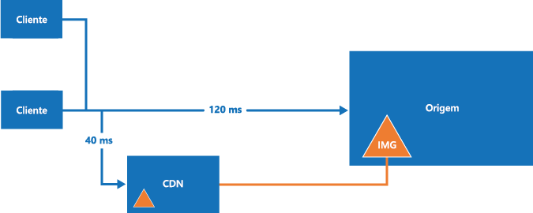

# Melhores práticas para uso das CDNs (redes de distribuição de conteúdo)Best practices for using content delivery networks (CDNs)

Uma CDN (rede de distribuição de conteúdo) é uma rede distribuída de servidores que pode fornecer conteúdo da Web para os usuários com eficiência.A content delivery network (CDN) is a distributed network of servers that can efficiently deliver web content to users. As CDNs armazenam conteúdo armazenado em cache em servidores de borda que estão próximos aos usuários finais, a fim de minimizar a latência.CDNs store cached content on edge servers that are close to end-users, to minimize latency. 

As CDNs normalmente são usadas para fornecimento de conteúdo estático, como imagens, folhas de estilo, documentos, scripts do lado do cliente e páginas HTML.CDNs are typically used to deliver static content such as images, style sheets, documents, client-side scripts, and HTML pages. As principais vantagens de usar uma CDN são latência mais baixa e fornecimento mais rápido de conteúdo aos usuários, independentemente de sua localização geográfica em relação ao datacenter no qual o aplicativo está hospedado.The major advantages of using a CDN are lower latency and faster delivery of content to users, regardless of their geographical location in relation to the datacenter where the application is hosted. As CDNs também podem ajudar a reduzir a carga em um aplicativo Web, porque o aplicativo não precisa atender a solicitações para o conteúdo que está hospedado na CDN.CDNs can also help to reduce load on a web application, because the application does not have to service requests for the content that is hosted in the CDN.
 

No Azure, a [Rede de Distribuição de Conteúdo do Azure](/azure/cdn/cdn-overview) é uma solução global de CDN de fornecimento de conteúdo de alta largura de banda hospedada no Azure ou em qualquer outro local.In Azure, the [Azure Content Delivery Network](/azure/cdn/cdn-overview) is a global CDN solution for delivering high-bandwidth content that is hosted in Azure or any other location. Usando a CDN do Azure, você pode armazenar em cache objetos disponíveis publicamente carregados de um armazenamento de blobs do Azure, um aplicativo Web, uma máquina virtual e qualquer servidor Web acessível publicamente.Using Azure CDN, you can cache publicly available objects loaded from Azure blob storage, a web application, virtual machine, any publicly accessible web server. 

Este tópico descreve algumas das melhores práticas gerais e considerações ao usar uma CDN.This topic describes some general best practices and considerations when using a CDN. Para saber mais sobre como usar a CDN do Azure, consulte [Documentação da CDN](/azure/cdn/).To learn more about using Azure CDN, see [CDN Documentation](/azure/cdn/).

## Como e por que a CDN é usadaHow and why a CDN is used

Entre os usos comuns para a CDN estão:Typical uses for a CDN include:  

* Fornecer recursos estáticos para aplicativos cliente, geralmente por meio de um site.Delivering static resources for client applications, often from a website. Esses recursos podem ser imagens, folhas de estilo, documentos, arquivos, scripts do lado do cliente, páginas HTML, fragmentos HTML ou qualquer outro conteúdo que o servidor não precise modificar para cada solicitação.These resources can be images, style sheets, documents, files, client-side scripts, HTML pages, HTML fragments, or any other content that the server does not need to modify for each request. O aplicativo pode criar itens em tempo de execução e disponibilizá-los para o CDN (por exemplo, ao criar uma lista atual de manchetes de notícias), mas ele não faz isso para cada solicitação.The application can create items at runtime and make them available to the CDN (for example, by creating a list of current news headlines), but it does not do so for each request.
* Fornecimento de conteúdo estático e compartilhado público para dispositivos como telefones móveis e tablet PCs.Delivering public static and shared content to devices such as mobile phones and tablet computers. O aplicativo em si é um serviço web que oferece uma API aos clientes que são executados em vários dispositivos.The application itself is a web service that offers an API to clients running on the various devices. O CDN também pode fornecer conjuntos de dados estáticos (por meio do serviço web) para os clientes usarem, talvez para gerar a interface do usuário do cliente.The CDN can also deliver static datasets (via the web service) for the clients to use, perhaps to generate the client UI. Por exemplo, o CDN pode ser usado para distribuir documentos XML ou JSON.For example, the CDN could be used to distribute JSON or XML documents.
* Servir sites inteiros que consistem em apenas conteúdo estático público para os clientes, sem a necessidade de quaisquer recursos de computação dedicados.Serving entire websites that consist of only public static content to clients, without requiring any dedicated compute resources.
* Fazer o streaming de arquivos de vídeo ao cliente sob demanda.Streaming video files to the client on demand. Os benefícios do vídeo de baixa latência e conectividade confiável disponível em datacenters globalmente localizados que oferecem conexões do CDN.Video benefits from the low latency and reliable connectivity available from the globally located datacenters that offer CDN connections. Os Serviços de Mídia do Microsoft Azure (AMS) integram-se com o Azure CDN para entregar conteúdo diretamente ao CDN para melhor distribuição.Microsoft Azure Media Services (AMS) integrates with Azure CDN to deliver content directly to the CDN for further distribution. Para saber mais, confira [Streaming endpoints overview](/azure/media-services/media-services-streaming-endpoints-overview) (Visão geral dos pontos de extremidade de streaming).For more information, see [Streaming endpoints overview](/azure/media-services/media-services-streaming-endpoints-overview).
* Geralmente aprimorar a experiência dos usuários, especialmente aqueles localizados longe o datacenter que hospeda o aplicativo.Generally improving the experience for users, especially those located far from the datacenter hosting the application. Esses usuários poderiam, de outra forma, sofrer latência mais alta.These users might otherwise suffer higher latency. Uma grande proporção do tamanho total do conteúdo em um aplicativo Web geralmente é estática e usar o CDN pode ajudar a manter o desempenho e a experiência geral do usuário eliminando a necessidade de implantar o aplicativo em vários datacenters.A large proportion of the total size of the content in a web application is often static, and using the CDN can help to maintain performance and overall user experience while eliminating the requirement to deploy the application to multiple data centers. Para ver uma lista de locais de nó da CDN do Azure, consulte [Locais POP da CDN do Azure](/azure/cdn/cdn-pop-locations/).For a list of Azure CDN node locations, see [Azure CDN POP Locations](/azure/cdn/cdn-pop-locations/).
* Dando suporte a soluções de IoT (Internet das Coisas).Supporting IoT (Internet of Things) solutions. O grande número de dispositivos e aplicativos envolvidos em uma solução de IoT pode sobrecarregar um aplicativo com facilidade, se ele precisasse distribuir atualizações de firmware diretamente para cada dispositivo.The huge numbers of devices and appliances involved in an IoT solution could easily overwhelm an application if it had to distribute firmware updates directly to each device.
* Lidar com picos e sobretensão de energia sob demanda sem exigir que o aplicativo dimensione, evitando o consequente aumento dos custos de execução.Coping with peaks and surges in demand without requiring the application to scale, avoiding the consequent increased running costs. Por exemplo, quando uma atualização para um sistema operacional é liberada, para um dispositivo de hardware, como um modelo específico do roteador ou para um dispositivo do consumidor, como uma smart TV, haverá um grande pico na demanda conforme ele é baixado por milhões de usuários e dispositivos em um curto período de tempo.For example, when an update to an operating system is released for a hardware device such as a specific model of router, or for a consumer device such as a smart TV, there will be a huge peak in demand as it is downloaded by millions of users and devices over a short period.

## DesafiosChallenges

Há vários desafios a serem considerados ao planejar o uso de uma CDN.There are several challenges to take into account when planning to use a CDN.  

* **Implantação**.**Deployment**. Decida a origem da qual a CDN busca o conteúdo e se é necessário implantar o conteúdo em mais de um sistema de armazenamento.Decide the origin from which the CDN fetches the content, and whether you need to deploy the content in more than one storage system. Leve em consideração o processo de implantação de recursos e conteúdo estático.Take into account the process for deploying static content and resources. Por exemplo, talvez seja necessário implementar uma etapa separada para carregar conteúdo no armazenamento de blobs do Azure.For example, you may need to implement a separate step to load content into Azure blob storage.
* **Controle de versão e controle de cache**.**Versioning and cache-control**. Leve em consideração como você atualizará o conteúdo estático e implantará novas versões.Consider how you will update static content and deploy new versions. Entenda como a CDN executa o cache e a TTL (vida útil).Understand how the CDN performs caching and time-to-live (TTL). Para a CDN do Azure, consulte [Como funciona o cache](/azure/cdn/cdn-how-caching-works).For Azure CDN, see [How caching works](/azure/cdn/cdn-how-caching-works).
* **Testando**.**Testing**. Pode ser difícil executar teste local de suas configurações de CDN ao desenvolver e testar um aplicativo localmente ou em um ambiente de preparo.It can be difficult to perform local testing of your CDN settings when developing and testing an application locally or in a staging environment.
* **SEO (otimização do mecanismo de pesquisa)**.**Search engine optimization (SEO)**. Conteúdo como imagens e documentos são atendidos de um domínio diferente quando você usa CDN.Content such as images and documents are served from a different domain when you use the CDN. Isso pode afetar a SEO para esse conteúdo.This can have an effect on SEO for this content.
* **Segurança de conteúdo**.**Content security**. Nem todas as CDNs oferecem uma forma de controle de acesso para o conteúdo.Not all CDNs offer any form of access control for the content. Alguns serviços da CDN, incluindo a CDN do Azure, dão suporte à autenticação baseada em token para proteger o conteúdo da CDN.Some CDN services, including Azure CDN, support token-based authentication to protect CDN content. Para obter mais informações, consulte [Protegendo ativos da Rede de Distribuição de Conteúdo do Azure com autenticação de token](/azure/cdn/cdn-token-auth).For more information, see [Securing Azure Content Delivery Network assets with token authentication](/azure/cdn/cdn-token-auth).
* **Segurança do cliente**.**Client security**. Os clientes podem se conectar por meio de um ambiente que não permita acesso a recursos no CDN.Clients might connect from an environment that does not allow access to resources on the CDN. Isso pode ser um ambiente restrito de segurança que limita o acesso a apenas um conjunto de fontes conhecidas ou que impede o carregamento de recursos por meio  de qualquer coisa que não seja a origem da página.This could be a security-constrained environment that limits access to only a set of known sources, or one that prevents loading of resources from anything other than the page origin. Uma implementação de fallback é necessária para lidar com esses casos.A fallback implementation is required to handle these cases.
* **Resiliência**.**Resilience**. O CDN é um ponto único de falha em potencial de um aplicativo.The CDN is a potential single point of failure for an application. 

Os cenários onde o CDN pode ser menos útil incluem:Scenarios where CDN may be less useful include:  

* Se o conteúdo tiver uma baixa taxa de ocorrências, ele pode ser acessado apenas algumas vezes enquanto for válido (determinado pela sua configuração de tempo de vida).If the content has a low hit rate, it might be accessed only few times while it is valid (determined by its time-to-live setting). 
* Se os dados forem particulares, como para empresas de grande porte ou ecossistemas de cadeia de suprimentos.If the data is private, such as for large enterprises or supply chain ecosystems.

## Diretrizes gerais e práticas recomendadasGeneral guidelines and good practices

O uso de uma CDN é uma boa maneira de minimizar a carga no aplicativo e maximizar a disponibilidade e o desempenho.Using a CDN is a good way to minimize the load on your application, and maximize availability and performance. Leve em consideração a adoção dessa estratégia para todos os recursos e conteúdos apropriados que o seu aplicativo usa.Consider adopting this strategy for all of the appropriate content and resources your application uses. Considere os pontos nas seções a seguir ao projetar sua estratégia para usar uma CDN.Consider the points in the following sections when designing your strategy to use a CDN.

### ImplantaçãoDeployment
O conteúdo estático pode precisar ser provisionado e implantado independentemente do aplicativo se você não incluí-lo no pacote ou processo de implantação do aplicativo.Static content may need to be provisioned and deployed independently from the application if you do not include it in the application deployment package or process. Considere como isso afetará a abordagem do controle de versão usada para gerenciar os componentes do aplicativo e o conteúdo de recursos estáticos.Consider how this will affect the versioning approach you use to manage both the application components and the static resource content.

Considere o uso de técnicas de agrupamento e minificação para reduzir os tempos de carregamento para clientes.Consider using bundling and minification techniques to reduce load times for clients. O agrupamento combina vários arquivos em um único arquivo.Bundling combines multiple files into a single file. A minificação remove caracteres desnecessários de scripts e arquivos CSS sem alterar a funcionalidade.Minification removes unnecessary characters from scripts and CSS files without altering functionality.

Se você precisar implantar o conteúdo em um local adicional, isso será uma etapa extra no processo de implantação.If you need to deploy the content to an additional location, this will be an extra step in the deployment process. Se o aplicativo atualizar o conteúdo para o CDN, talvez em intervalos regulares ou em resposta a um evento, ele deve armazenar o conteúdo atualizado em todos os locais adicionais, bem como o ponto de extremidade para o CDN.If the application updates the content for the CDN, perhaps at regular intervals or in response to an event, it must store the updated content in any additional locations as well as the endpoint for the CDN.

Considere como você manipulará o desenvolvimento e teste local quando um conteúdo estático precisar ser fornecido por meio de uma CDN.Consider how you will handle local development and testing when some static content is expected to be served from a CDN. Por exemplo, você pode pré-implantar o conteúdo na CDN como parte do script de build.For example, you could pre-deploy the content to the CDN as part of your build script. Como alternativa, use as diretivas de compilação ou sinalizadores para controlar como o aplicativo carrega os recursos.Alternatively, use compile directives or flags to control how the application loads the resources. Por exemplo, no modo de depuração, o aplicativo pôde carregar recursos estáticos de uma pasta local.For example, in debug mode, the application could load static resources from a local folder. No modo de versão, o aplicativo usará a CDN.In release mode, the application would use the CDN.

Considere as opções de compactação de arquivo, como gzip (GNU zip).Consider the options for file compression, such as gzip (GNU zip). A compactação pode ser executada no servidor de origem pelo aplicativo Web host ou diretamente nos servidores de borda pela CDN.Compression may be performed on the origin server by the web application hosting or directly on the edge servers by the CDN. Para obter mais informações, consulte [Melhorar o desempenho compactando arquivos na CDN do Azure](/azure/cdn/cdn-improve-performance).For more information, see [Improve performance by compressing files in Azure CDN](/azure/cdn/cdn-improve-performance).

### Roteamento e controle de versãoRouting and versioning
Você talvez precise usar diferentes instâncias do CDN em vários momentos.You may need to use different CDN instances at various times. Por exemplo, ao implantar uma nova versão do aplicativo, você pode querer usar um novo CDN e reter o CDN antigo (mantendo o conteúdo em um formato antigo) para versões anteriores.For example, when you deploy a new version of the application you may want to use a new CDN and retain the old CDN (holding content in an older format) for previous versions. Se você usar o armazenamento de blob do Azure como a origem de conteúdo, pode criar uma conta de armazenamento separada ou um contêiner separado e direcionar o ponto de extremidade da CDN a ele.If you use Azure blob storage as the content origin, you can create a separate storage account or a separate container and point the CDN endpoint to it. 

Não use a cadeia de caracteres de consulta para denotar versões diferentes do aplicativo nos links para recursos na CDN, pois, ao recuperar o conteúdo do armazenamento de blobs do Azure, a cadeia de caracteres de consulta faz parte do nome do recurso (o nome de blob).Do not use the query string to denote different versions of the application in links to resources on the CDN because, when retrieving content from Azure blob storage, the query string is part of the resource name (the blob name). Essa abordagem também pode afetar como o cliente armazena os recursos em cache.This approach can also affect how the client caches resources.

Implantar novas versões do conteúdo estático quando você atualiza um aplicativo pode ser um desafio se os recursos anteriores forem armazenados em cache no CDN.Deploying new versions of static content when you update an application can be a challenge if the previous resources are cached on the CDN. Para obter mais informações, consulte a seção sobre controle de cache abaixo.For more information, see the section on cache control, below.

Considere restringir o acesso ao conteúdo CDN por país.Consider restricting the CDN content access by country. O CDN do Azure permite filtrar solicitações com base no país de origem e restringir o conteúdo fornecido.Azure CDN allows you to filter requests based on the country of origin and restrict the content delivered. Para saber mais, veja [Restringir o acesso ao seu conteúdo por país](/azure/cdn/cdn-restrict-access-by-country/).For more information, see [Restrict access to your content by country](/azure/cdn/cdn-restrict-access-by-country/).

### controle de cacheCache control
Considere como gerenciar o caching dentro do sistema.Consider how to manage caching within the system. Por exemplo, na CDN do Azure, você pode definir regras de cache global e, em seguida, definir um cache personalizado para pontos de extremidade de origem específicos.For example, in Azure CDN, you can set global caching rules, and then set custom caching for particular origin endpoints. Você também pode controlar como o cache é executado em uma CDN pelo envio de cabeçalhos de diretiva de cache na origem.You can also control how caching is performed in a CDN by sending cache-directive headers at the origin. 

Para obter mais informações, consulte [Como funciona o cache](/azure/cdn/cdn-how-caching-works).For more information, see [How caching works](/azure/cdn/cdn-how-caching-works).

Para impedir que objetos estejam disponíveis na CDN, exclua-os da origem remova ou exclua o ponto de extremidade da CDN ou, no caso do armazenamento de blobs, torne o contêiner ou blob particular.To prevent objects from being available on the CDN, you can delete them from the origin, remove or delete the CDN endpoint, or in the case of blob storage, make the container or blob private. No entanto, os itens não são removidos até que a vida útil expire.However, items are not removed from the until the time-to-live expires. Também limpe manualmente um ponto de extremidade da CDN.You can also manually purge a CDN endpoint.

### SegurançaSecurity

A CDN pode entregar conteúdo pelo HTTPS (SSL) usando o certificado fornecido pela CDN, e também pelo HTTP padrão.The CDN can deliver content over HTTPS (SSL), by using the certificate provided by the CDN, as well as over standard HTTP. Para evitar avisos de navegador sobre o conteúdo misto, talvez seja necessário usar HTTPS para solicitar o conteúdo estático que é exibido nas páginas carregadas por meio de HTTPS.To avoid browser warnings about mixed content, you might need to use HTTPS to request static content that is displayed in pages loaded through HTTPS.

Se você entregar ativos estáticos (como arquivos de fonte) usando a CDN, talvez encontre problemas de política de mesma origem se usar uma chamada *XMLHttpRequest* para solicitar esses recursos de um domínio diferente.If you deliver static assets such as font files by using the CDN, you might encounter same-origin policy issues if you use an *XMLHttpRequest* call to request these resources from a different domain. Muitos navegadores da web impedem o compartilhamento de recursos de origens cruzadas (CORS), a menos que o servidor Web esteja configurado para definir os cabeçalhos de resposta apropriada.Many web browsers prevent cross-origin resource sharing (CORS) unless the web server is configured to set the appropriate response headers. É possível configurar a CDN para dar suporte ao CORS usando um dos seguintes métodos:You can configure the CDN to support CORS by using one of the following methods:

* Configure a CDN para adicionar cabeçalhos CORS às respostas.Configure the CDN to add CORS headers to the responses. Para obter mais informações, confira [Usando a CDN do Azure com o CORS](/azure/cdn/cdn-cors).For more information, see [Using Azure CDN with CORS](/azure/cdn/cdn-cors). 
* Se a origem é o armazenamento de blobs do Azure, adicione regras do CORS ao ponto de extremidade de armazenamento.If the origin is Azure blob storage, add CORS rules to the storage endpoint. Para obter mais informações, consulte [Suporte de Compartilhamento de Recursos de Origens Cruzadas (CORS) para os serviços de armazenamento do Azure](http://msdn.microsoft.com/library/azure/dn535601.aspx).For more information, see [Cross-Origin Resource Sharing (CORS) Support for the Azure Storage Services](http://msdn.microsoft.com/library/azure/dn535601.aspx).
* Configure o aplicativo para definir os cabeçalhos CORS.Configure the application to set the CORS headers. Por exemplo, confira [Habilitando as Solicitações Entre Origens (CORS)](/aspnet/core/security/cors) na documentação do ASP.NET Core.For example, see [Enabling Cross-Origin Requests (CORS)](/aspnet/core/security/cors) in the ASP.NET Core documentation.

### Fallback de CDNCDN fallback
Leve em consideração como seu aplicativo lidará com uma falha ou indisponibilidade temporária da CDN.Consider how your application will cope with a failure or temporary unavailability of the CDN. Os aplicativos cliente poderão usar cópias dos recursos que foram armazenados em cache localmente (no cliente) durante solicitações anteriores, ou eles podem incluir o código que detecta falhas e solicita, em vez disso, os recursos de origem (a pasta de aplicativo ou o contêiner de blob do Azure que contém os recursos) se o CDN não estiver disponível.Client applications may be able to use copies of the resources that were cached locally (on the client) during previous requests, or you can include code that detects failure and instead requests resources from the origin (the application folder or Azure blob container that holds the resources) if the CDN is unavailable.
