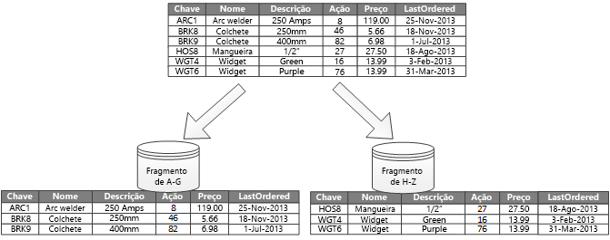
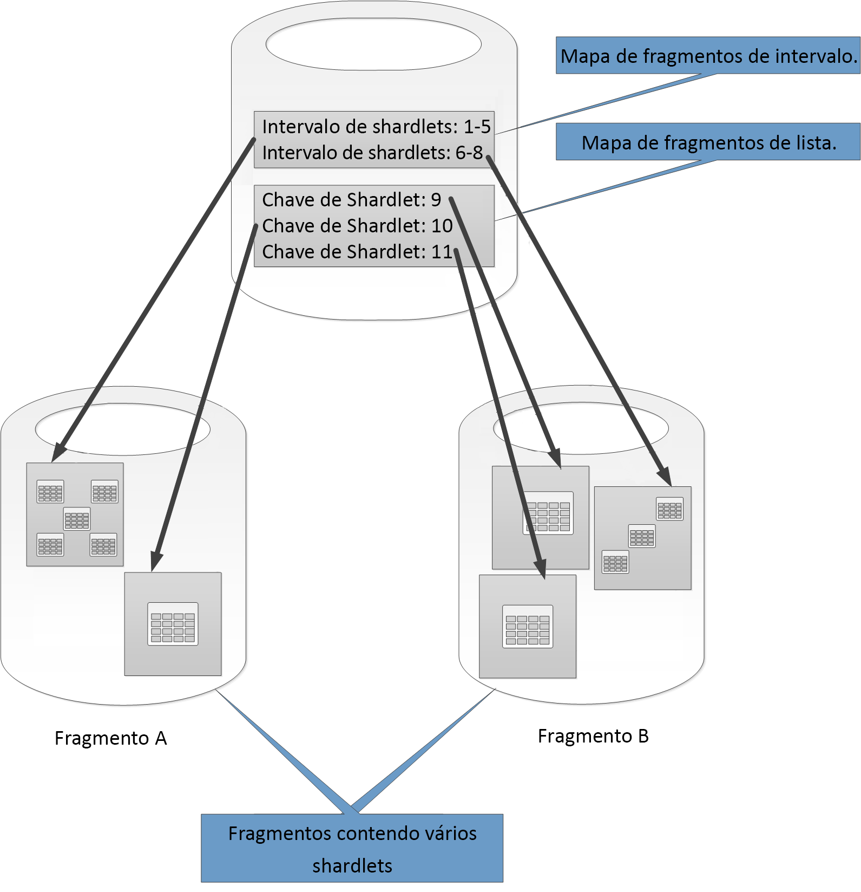

# Particionamento de dadosData partitioning

Em muitas soluções de grande escala, os dados são divididos em partições separadas que podem ser gerenciadas e acessadas separadamente.In many large-scale solutions, data is divided into separate partitions that can be managed and accessed separately. A estratégia de particionamento deve ser cuidadosamente escolhida para maximizar os benefícios, ao mesmo tempo que minimiza os efeitos adversos.The partitioning strategy must be chosen carefully to maximize the benefits while minimizing adverse effects. O particionamento pode ajudar a aprimorar o dimensionamento, a reduzir a contenção e a otimizar o desempenho.Partitioning can help improve scalability, reduce contention, and optimize performance. Outro benefício do particionamento é que ele pode fornecer um mecanismo para dividir dados pelo padrão de uso.Another benefit of partitioning is that it can provide a mechanism for dividing data by the pattern of use. Por exemplo, você pode arquivar dados antigos e menos ativos (passivos) em armazenamento de dados mais barato.For example, you can archive older, less active (cold) data in cheaper data storage.

## Por que particionar os dados?Why partition data?
A maioria dos serviços e aplicativos na nuvem armazena e recupera dados como parte de suas operações.Most cloud applications and services store and retrieve data as part of their operations. O design dos repositórios de dados usado por um aplicativo pode ter uma influência significativa sobre o desempenho, taxa de transferência e escalabilidade de um sistema.The design of the data stores that an application uses can have a significant bearing on the performance, throughput, and scalability of a system. Uma técnica normalmente aplicada em sistemas de grande escala é dividir os dados em partições separadas.One technique that is commonly applied in large-scale systems is to divide the data into separate partitions.

> Neste artigo, o termo *particionamento* significa o processo de dividir fisicamente os dados em armazenamentos de dados separados.In this article, the term *partitioning* means the process of physically dividing data into separate data stores. Não é igual ao particionamento de tabela do SQL Server.It is not the same as SQL Server table partitioning.

O particionamento de dados pode oferecer uma série de benefícios.Partitioning data can offer a number of benefits. Por exemplo, ele pode ser aplicado para:For example, it can be applied in order to:

* **Melhorar a escalabilidade**.**Improve scalability**. Quando você escala verticalmente um sistema de banco de dados individual, em algum momento ele atingirá um limite de hardware físico.When you scale up a single database system, it will eventually reach a physical hardware limit. Se você dividir dados entre várias partições, cada uma das quais hospedada em um servidor separado, será possível escalar o sistema de forma horizontal quase que indefinidamente.If you divide data across multiple partitions, each of which is hosted on a separate server, you can scale out the system almost indefinitely.
* **Melhorar o desempenho**.**Improve performance**. As operações de acesso a dados em cada partição ocorrem em um volume de dados menor.Data access operations on each partition take place over a smaller volume of data. Desde que os dados sejam particionados de maneira adequada, o particionamento poderá tornar seu sistema mais eficiente.Provided that the data is partitioned in a suitable way, partitioning can make your system more efficient. As operações que afetam mais de uma partição podem ser executadas paralelamente.Operations that affect more than one partition can run in parallel. Cada partição pode estar localizada próximo a um aplicativo que a usa para minimizar a latência de rede.Each partition can be located near the application that uses it to minimize network latency.
* **Melhorar a disponibilidade**.**Improve availability**. Separar dados em vários servidores evita um ponto único de falha.Separating data across multiple servers avoids a single point of failure. Se um servidor falhar, ou estiver passando por uma manutenção planejada, somente os dados nessa partição não estarão disponíveis.If a server fails, or is undergoing planned maintenance, only the data in that partition is unavailable. As operações em outras partições podem continuar.Operations on other partitions can continue. Aumentar o número de partições reduz o impacto relativo de uma falha de servidor único ao reduzir o percentual dos dados que não estarão disponíveis.Increasing the number of partitions reduces the relative impact of a single server failure by reducing the percentage of data that will be unavailable. Replicar cada partição pode reduzir ainda mais a probabilidade de uma falha de partição única afetar as operações.Replicating each partition can further reduce the chance of a single partition failure affecting operations. Isso também possibilita a separação de dados críticos que devem estar contínua e altamente disponíveis dos dados de valor baixo que tenham requisitos de disponibilidade mais baixos (arquivos de log, por exemplo).It also makes it possible to separate critical data that must be continually and highly available from low-value data that has lower availability requirements (log files, for example).
* **Melhorar a segurança**.**Improve security**. Dependendo da natureza dos dados e de como eles são particionados, é possível separar dados confidenciais e não confidenciais em partições diferentes e, portanto, em diferentes servidores ou repositórios de dados.Depending on the nature of the data and how it is partitioned, it might be possible to separate sensitive and non-sensitive data into different partitions, and therefore into different servers or data stores. Em seguida, a segurança pode ser especificamente otimizada para os dados confidenciais.Security can then be specifically optimized for the sensitive data.
* **Fornecer flexibilidade operacional**.**Provide operational flexibility**. O particionamento oferece várias oportunidades para o ajuste das operações, maximizando a eficiência administrativa e minimizando os custos.Partitioning offers many opportunities for fine tuning operations, maximizing administrative efficiency, and minimizing cost. Por exemplo, você pode definir diferentes estratégias para gerenciamento, monitoramento, backup, restauração e outras tarefas administrativas baseadas na importância dos dados em cada partição.For example, you can define different strategies for management, monitoring, backup and restore, and other administrative tasks based on the importance of the data in each partition.
* **Fazer a correspondência do repositório de dados ao padrão de uso**.**Match the data store to the pattern of use**. O particionamento permite que cada partição seja implantada em um tipo diferente de repositório de dados, com base no custo e nos recursos internos que o repositório de dados oferece.Partitioning allows each partition to be deployed on a different type of data store, based on cost and the built-in features that data store offers. Por exemplo, dados binários grandes podem ser armazenados em um repositório de dados de blob, enquanto dados mais estruturados podem ser mantidos em um banco de dados de documentos.For example, large binary data can be stored in a blob data store, while more structured data can be held in a document database. Para obter mais informações, consulte [Criando uma solução poliglota] no guia de padrões e práticas, e [Data Access for Highly-Scalable Solutions: Using SQL, NoSQL, and Polyglot Persistence] no site da Microsoft.For more information, see [Building a polyglot solution] in the patterns & practices guide and [Data access for highly-scalable solutions: Using SQL, NoSQL, and polyglot persistence] on the Microsoft website.

Alguns sistemas não implementam o particionamento, pois ele é considerado um custo em vez de uma vantagem.Some systems do not implement partitioning because it is considered a cost rather than an advantage. Entre alguns dos motivos comuns para essa lógica estão:Common reasons for this rationale include:

* Muitos sistemas de armazenamento de dados não dão suporte a junções entre partições e pode ser difícil manter a integridade referencial em um sistema particionado.Many data storage systems do not support joins across partitions, and it can be difficult to maintain referential integrity in a partitioned system. Frequentemente, é necessário implementar junções e verificações de integridade no código do aplicativo (na camada de particionamento), o que poderá resultar em E/S adicional e na complexidade do aplicativo.It is frequently necessary to implement joins and integrity checks in application code (in the partitioning layer), which can result in additional I/O and application complexity.
* Manter partições nem sempre é uma tarefa comum.Maintaining partitions is not always a trivial task. Em um sistema em que os dados são voláteis, talvez seja necessário rebalancear as partições periodicamente para reduzir a contenção e os pontos de acesso.In a system where the data is volatile, you might need to rebalance partitions periodically to reduce contention and hot spots.
* Obviamente, algumas ferramentas comuns não funcionam com dados particionados.Some common tools do not work naturally with partitioned data.

## Criando partiçõesDesigning partitions
Os dados podem ser particionados de diferentes maneiras: horizontal, vertical ou funcionalmente.Data can be partitioned in different ways: horizontally, vertically, or functionally. A estratégia escolhida depende do motivo para o particionamento dos dados e dos requisitos dos aplicativos e serviços que usarão os dados.The strategy you choose depends on the reason for partitioning the data, and the requirements of the applications and services that will use the data.

> [!NOTE]
> Os esquemas de particionamento descritos nestas diretrizes são explicados de forma independente da tecnologia subjacente de armazenamento de dados.The partitioning schemes described in this guidance are explained in a way that is independent of the underlying data storage technology. Eles podem ser aplicados a vários tipos de repositórios de dados, incluindo bancos de dados relacionais e NoSQL.They can be applied to many types of data stores, including relational and NoSQL databases.
>
>

### Estratégias de particionamentoPartitioning strategies
As três estratégias típicas para o particionamento dos dados são:The three typical strategies for partitioning data are:

* **Particionamento horizontal** (geralmente denominado *fragmentação*).**Horizontal partitioning** (often called *sharding*). Nessa estratégia, cada partição é um repositório de dados por si só, mas todas as partições têm o mesmo esquema.In this strategy, each partition is a data store in its own right, but all partitions have the same schema. Cada partição é conhecida como um *fragmento* e contém um subconjunto específico de dados, como todos os pedidos de um conjunto específico de clientes em um aplicativo de comércio eletrônico.Each partition is known as a *shard* and holds a specific subset of the data, such as all the orders for a specific set of customers in an e-commerce application.
* **Particionamento vertical**.**Vertical partitioning**. Nessa estratégia, cada partição contém um subconjunto dos campos de itens no repositório de dados.In this strategy, each partition holds a subset of the fields for items in the data store. Os campos são divididos de acordo com seu padrão de uso.The fields are divided according to their pattern of use. Por exemplo, os campos acessados com frequência podem ser colocados em uma partição vertical e os campos acessados com menos frequência em outra.For example, frequently accessed fields might be placed in one vertical partition and less frequently accessed fields in another.
* **Particionamento funcional**.**Functional partitioning**. Nessa estratégia, os dados são agregados de acordo com o modo como são usados por cada contexto vinculado no sistema.In this strategy, data is aggregated according to how it is used by each bounded context in the system. Por exemplo, um sistema de comércio eletrônico que implementa funções comerciais separadas para o faturamento e o gerenciamento do inventário de produtos pode armazenar dados de faturas em uma partição e dados do inventário de produtos em outra.For example, an e-commerce system that implements separate business functions for invoicing and managing product inventory might store invoice data in one partition and product inventory data in another.

É importante observar que as três estratégias descritas aqui podem ser combinadas.It’s important to note that the three strategies described here can be combined. Elas não são mutuamente exclusivas, e é recomendável considerá-las quando você projeta um esquema de particionamento.They are not mutually exclusive, and we recommend that you consider them all when you design a partitioning scheme. Por exemplo, você poderia dividir os dados em fragmentos e então usar o particionamento vertical para subdividir ainda mais os dados em cada fragmento.For example, you might divide data into shards and then use vertical partitioning to further subdivide the data in each shard. Da mesma forma, os dados em uma partição funcional podem ser divididos em fragmentos (que também podem ser verticalmente particionados).Similarly, the data in a functional partition can be split into shards (which can also be vertically partitioned).

No entanto, os diferentes requisitos de cada estratégia podem gerar uma série de problemas conflitantes.However, the differing requirements of each strategy can raise a number of conflicting issues. Você deve avaliar e balancear todos eles ao projetar um esquema de particionamento que atenda às metas gerais de desempenho de processamento de dados do seu sistema.You must evaluate and balance all of these when designing a partitioning scheme that meets the overall data processing performance targets for your system. As seções a seguir exploram cada uma das estratégias mais detalhadamente.The following sections explore each of the strategies in more detail.

### Particionamento horizontal (fragmentação)Horizontal partitioning (sharding)
A Figura 1 mostra uma visão geral do particionamento horizontal ou fragmentação.Figure 1 shows an overview of horizontal partitioning or sharding. Neste exemplo, os dados do inventário de produtos são divididos em fragmentos com base na chave do produto (Product Key).In this example, product inventory data is divided into shards based on the product key. Cada fragmento contém os dados para um intervalo contíguo de chaves de fragmento (A-G e H-Z), organizadas em ordem alfabética.Each shard holds the data for a contiguous range of shard keys (A-G and H-Z), organized alphabetically.

*Figura 1. Particionamento horizontal (fragmentação) de dados com base em uma chave de partição**Figure 1. Horizontally partitioning (sharding) data based on a partition key*

A fragmentação ajuda você a distribuir a carga em um número maior de computadores, o que reduz a contenção e melhora o desempenho.Sharding helps you spread the load over more computers, which reduces contention and improves performance. Você pode escalar o sistema horizontalmente acrescentando mais fragmentos que são executados em servidores adicionais.You can scale the system out by adding further shards that run on additional servers.

O fator mais importante ao implementar essa estratégia de particionamento é a opção de chave de fragmentação.The most important factor when implementing this partitioning strategy is the choice of sharding key. Pode ser difícil alterar a chave depois que o sistema estiver em operação.It can be difficult to change the key after the system is in operation. A chave deve garantir que os dados sejam particionados para que a carga de trabalho seja a mais uniforme possível entre os fragmentos.The key must ensure that data is partitioned so that the workload is as even as possible across the shards.

Observe que diferentes fragmentos não precisam conter volumes semelhantes de dados.Note that different shards do not have to contain similar volumes of data. Em vez disso, a consideração mais importante é equilibrar o número de solicitações.Rather, the more important consideration is to balance the number of requests. Alguns fragmentos podem ser muito grandes, mas cada item está sujeito a um número baixo de operações de acesso.Some shards might be very large, but each item is the subject of a low number of access operations. Outros fragmentos podem ser menores, mas cada item é acessado com muito mais frequência.Other shards might be smaller, but each item is accessed much more frequently. Também é importante garantir que um único fragmento não exceda os limites de escala (em termos de recursos de capacidade e processamento) do repositório de dados usado para hospedar esse fragmento.It is also important to ensure that a single shard does not exceed the scale limits (in terms of capacity and processing resources) of the data store that's being used to host that shard.

Se você usar um esquema de fragmentação, evite criar pontos de acesso (ou partições mais acessadas) que possam afetar o desempenho e a disponibilidade.If you use a sharding scheme, avoid creating hotspots (or hot partitions) that can affect performance and availability. Por exemplo, se você usar o hash de um identificador de cliente no lugar da primeira letra do nome do cliente, isso impedirá a distribuição desbalanceada resultante de letras iniciais comuns e menos comuns.For example, if you use a hash of a customer identifier instead of the first letter of a customer’s name, you prevent the unbalanced distribution that results from common and less common initial letters. Essa é uma técnica típica que ajuda a distribuir os dados mais uniformemente nas partições.This is a typical technique that helps distribute data more evenly across partitions.

Escolha uma chave de fragmentação que minimize os requisitos futuros de divisão de grandes fragmentos em partes menores, agrupe pequenos fragmentos em partições maiores ou altere o esquema que descreve os dados armazenados em um conjunto de partições.Choose a sharding key that minimizes any future requirements to split large shards into smaller pieces, coalesce small shards into larger partitions, or change the schema that describes the data stored in a set of partitions. Essas operações podem ser muito demoradas e podem exigir que você deixe um ou mais fragmentos offline enquanto elas são executadas.These operations can be very time consuming, and might require taking one or more shards offline while they are performed.

Se os fragmentos forem replicados, será possível manter algumas das réplicas online enquanto as outras são divididas, mescladas ou reconfiguradas.If shards are replicated, it might be possible to keep some of the replicas online while others are split, merged, or reconfigured. No entanto, talvez o sistema precise limitar as operações que podem ser realizadas nos dados nesses fragmentos enquanto a reconfiguração estiver em andamento.However, the system might need to limit the operations that can be performed on the data in these shards while the reconfiguration is taking place. Por exemplo, os dados nas réplicas podem ser marcados como somente leitura para limitar o escopo de inconsistências que podem ocorrer enquanto os fragmentos estiverem sendo reestruturados.For example, the data in the replicas can be marked as read-only to limit the scope of inconsistences that might occur while shards are being restructured.

> Para obter informações mais detalhadas e diretrizes sobre várias dessas considerações, além de técnicas de práticas recomendadas para a criação de repositórios de dados que implementam o particionamento horizontal, consulte [Sharding pattern](Padrão de fragmentação).For more detailed information and guidance about many of these considerations, and good practice techniques for designing data stores that implement horizontal partitioning, see [Sharding pattern].
>
>

### Particionamento verticalVertical partitioning
O uso mais comum do particionamento vertical é reduzir a E/S e os custos de desempenho associados à busca de itens que são acessados com mais frequência.The most common use for vertical partitioning is to reduce the I/O and performance costs associated with fetching the items that are accessed most frequently. A Figura 2 mostra um exemplo de particionamento vertical.Figure 2 shows an example of vertical partitioning. Neste exemplo, as diferentes propriedades de cada item de dados são mantidas em diferentes partições.In this example, different properties for each data item are held in different partitions. Uma partição mantém dados que são acessados mais frequentemente, incluindo o nome, a descrição e as informações de preço dos produtos.One partition holds data that is accessed more frequently, including the name, description, and price information for products. Outra mantém o volume em estoque e a data do último pedido.Another holds the volume in stock and the last ordered date.

*Figura 2. Particionamento vertical de dados por seu padrão de uso**Figure 2. Vertically partitioning data by its pattern of use*

Neste exemplo, o aplicativo regularmente consulta o nome, a descrição e o preço do produto ao exibir os detalhes do produto para os clientes.In this example, the application regularly queries the product name, description, and price when displaying the product details to customers. O nível de estoque e a data mais recente em que o produto foi encomendado do fabricante são mantidos em uma partição separada, já que esses dois itens são usados juntos.The stock level and date when the product was last ordered from the manufacturer are held in a separate partition because these two items are commonly used together.

Esse esquema de particionamento tem uma vantagem adicional de que os dados relativamente lentos (nome do produto, descrição e preço) são separados dos dados mais dinâmicos (nível de estoque e data do último pedido).This partitioning scheme has the added advantage that the relatively slow-moving data (product name, description, and price) is separated from the more dynamic data (stock level and last ordered date). Um aplicativo pode considerar útil armazenar em cache na memória os dados lentos se eles forem acessados com frequência.An application might find it beneficial to cache the slow-moving data in memory if it is frequently accessed.

Outro cenário típico dessa estratégia de particionamento é maximizar a segurança dos dados confidenciais.Another typical scenario for this partitioning strategy is to maximize the security of sensitive data. Por exemplo, você pode fazer isso armazenando números de cartão de crédito e números de verificação de segurança do cartão correspondentes em partições separadas.For example, you can do this by storing credit card numbers and the corresponding card security verification numbers in separate partitions.

O particionamento vertical também pode reduzir a quantidade de acesso simultâneo necessário aos dados.Vertical partitioning can also reduce the amount of concurrent access that's needed to the data.

> O particionamento vertical funciona no nível da entidade em um armazenamento de dados, parcialmente normalizando uma entidade para dividir um item *grande* em um conjunto de itens *pequenos*.Vertical partitioning operates at the entity level within a data store, partially normalizing an entity to break it down from a *wide* item to a set of *narrow* items. Ele é ideal para repositórios de dados orientados a colunas, como o HBase e Cassandra.It is ideally suited for column-oriented data stores such as HBase and Cassandra. Se for improvável que os dados em uma coleção de colunas serão alterados, você também poderá considerar o uso de repositórios de colunas no SQL Server.If the data in a collection of columns is unlikely to change, you can also consider using column stores in SQL Server.
>
>

### Particionamento funcionalFunctional partitioning
Para os sistemas em que seja possível identificar um contexto vinculado para cada área ou serviço comercial distinto no aplicativo, o particionamento funcional fornece uma técnica para a melhoria do isolamento e do desempenho de acesso a dados.For systems where it is possible to identify a bounded context for each distinct business area or service in the application, functional partitioning provides a technique for improving isolation and data access performance. Outro uso comum do particionamento funcional é separar dados de leitura/gravação de dados somente leitura usados para fins de relatório.Another common use of functional partitioning is to separate read-write data from read-only data that's used for reporting purposes. A Figura 3 mostra uma visão geral de particionamento funcional em que os dados do inventário são separados dos dados do cliente.Figure 3 shows an overview of functional partitioning where inventory data is separated from customer data.

*Figura 3. Particionamento funcional de dados por contexto ou subdomínio vinculado**Figure 3. Functionally partitioning data by bounded context or subdomain*

Essa estratégia de particionamento pode ajudar a reduzir a contenção do acesso a dados em diferentes partes de um sistema.This partitioning strategy can help reduce data access contention across different parts of a system.

## Criando partições para a escalabilidadeDesigning partitions for scalability
É fundamental considerar o tamanho e a carga de trabalho de cada partição e balanceá-los para que os dados sejam distribuídos para obtenção da máxima escalabilidade.It's vital to consider size and workload for each partition and balance them so that data is distributed to achieve maximum scalability. No entanto, você também deve particionar os dados para que eles não excedam os limites de dimensionamento de um único repositório de partição.However, you must also partition the data so that it does not exceed the scaling limits of a single partition store.

Siga estas etapas ao criar partições para escalabilidade:Follow these steps when designing partitions for scalability:

1. Analise o aplicativo para entender os padrões de acesso a dados, como o tamanho do conjunto de resultados retornado por cada consulta, a frequência de acesso, a latência inerente e os requisitos de processamento de computação do lado do servidor.Analyze the application to understand the data access patterns, such as the size of the result set returned by each query, the frequency of access, the inherent latency, and the server-side compute processing requirements. Em muitos casos, algumas entidades principais exigirão a maior parte dos recursos de processamento.In many cases, a few major entities will demand most of the processing resources.
2. Use essa análise para determinar as metas de escalabilidade atuais e futuras, como o tamanho dos dados e carga de trabalho.Use this analysis to determine the current and future scalability targets, such as data size and workload. Em seguida, distribua os dados nas partições para atender à meta de escalabilidade.Then distribute the data across the partitions to meet the scalability target. Na estratégia de particionamento horizontal, é importante escolher a chave de fragmento adequada para garantir que a distribuição seja uniforme.In the horizontal partitioning strategy, choosing the appropriate shard key is important to make sure distribution is even. Para obter mais informações, consulte [Sharding pattern](Padrão de fragmentação).For more information, see the [Sharding pattern].
3. Verifique se os recursos disponíveis para cada partição são suficientes para lidar com os requisitos de escalabilidade em termos de tamanho de dados e taxa de transferência.Make sure that the resources available to each partition are sufficient to handle the scalability requirements in terms of data size and throughput. Por exemplo, o nó que está hospedando uma partição pode impor um limite rígido na quantidade de espaço de armazenamento, na capacidade de processamento ou largura de banda da rede que ele fornece.For example, the node that's hosting a partition might impose a hard limit on the amount of storage space, processing power, or network bandwidth that it provides. Se os requisitos de armazenamento e processamento de dados tiverem a probabilidade de exceder esses limites, poderá ser necessário refinar sua estratégia de particionamento ou subdividir mais os dados.If the data storage and processing requirements are likely to exceed these limits, it might be necessary to refine your partitioning strategy or split data out further. Por exemplo, uma abordagem de escalabilidade pode ser separar os dados de log dos principais recursos do aplicativo.For example, one scalability approach might be to separate logging data from the core application features. Você pode fazer isso usando repositórios de dados separados para impedir que os requisitos de armazenamento total de dados exceda o limite de ajuste de escala do nó.You do this by using separate data stores to prevent the total data storage requirements from exceeding the scaling limit of the node. Se o número total de repositórios de dados exceder o limite do nó, pode ser necessário usar nós de armazenamento separados.If the total number of data stores exceeds the node limit, it might be necessary to use separate storage nodes.
4. Monitore o sistema em uso para verificar se os dados são distribuídos conforme esperado e se as partições podem manipular a carga imposta sobre elas.Monitor the system under use to verify that the data is distributed as expected and that the partitions can handle the load that is imposed on them. É possível que o uso não coincida com o uso previsto pela análise.It's possible that the usage does not match the usage that's anticipated by the analysis. Nesse caso, pode ser possível redistribuir as partições.In that case, it might be possible to rebalance the partitions. Se isso não funcionar, talvez seja preciso recriar algumas partes do sistema para ganhar o balanceamento necessário.Failing that, it might be necessary to redesign some parts of the system to gain the required balance.

Observe que alguns ambientes de nuvem alocam recursos em termos de limites de infraestrutura.Note that some cloud environments allocate resources in terms of infrastructure boundaries. Garanta que os limites de seu limite selecionado forneçam espaço suficiente para qualquer aumento previsto no volume de dados, em termos de armazenamento de dados, capacidade de processamento e largura de banda.Ensure that the limits of your selected boundary provide enough room for any anticipated growth in the volume of data, in terms of data storage, processing power, and bandwidth.

Por exemplo, se você usar o armazenamento de tabelas do Azure, um fragmento ocupado pode exigir mais recursos do que estão disponíveis para uma única partição tratar solicitações.For example, if you use Azure table storage, a busy shard might require more resources than are available to a single partition to handle requests. (Há um limite para o volume de solicitações que podem ser identificadas por uma única partição em um determinado período de tempo.(There is a limit to the volume of requests that can be handled by a single partition in a particular period of time. Consulte a página [Azure Storage Scalability and Performance Targets] no site da Microsoft para obter mais detalhes.)See the page [Azure storage scalability and performance targets] on the Microsoft website for more details.)

 Nesse caso, o fragmento pode precisar ser reparticionado para distribuir a carga.If this is the case, the shard might need to be repartitioned to spread the load. Se o tamanho total ou a taxa de transferência dessas tabelas exceder a capacidade de uma conta de armazenamento, pode ser necessário criar mais contas de armazenamento e distribuir as tabelas entre essas contas.If the total size or throughput of these tables exceeds the capacity of a storage account, it might be necessary to create additional storage accounts and spread the tables across these accounts. Se o número de contas de armazenamento exceder o número de contas disponíveis para uma assinatura, pode ser necessário usar várias assinaturas.If the number of storage accounts exceeds the number of accounts that are available to a subscription, then it might be necessary to use multiple subscriptions.

## Criando partições para o desempenho da consultaDesigning partitions for query performance
Muitas vezes, o desempenho da consulta pode ser impulsionado pelo uso de conjuntos de dados menores e pela execução de consultas paralelas.Query performance can often be boosted by using smaller data sets and by running parallel queries. Cada partição deve conter uma pequena proporção do conjunto de dados inteiro.Each partition should contain a small proportion of the entire data set. Essa redução no volume pode melhorar o desempenho das consultas.This reduction in volume can improve the performance of queries. No entanto, o particionamento não é uma alternativa para a criação e configuração adequadas de um banco de dados.However, partitioning is not an alternative for designing and configuring a database appropriately. Por exemplo, verifique se você implementou os índices necessários se estiver usando um banco de dados relacional.For example, make sure that you have the necessary indexes in place if you are using a relational database.

Siga estas etapas ao criar partições para desempenho de consulta:Follow these steps when designing partitions for query performance:

1. Examine os requisitos e o desempenho do aplicativo:Examine the application requirements and performance:
   * Use os requisitos de negócios para determinar as consultas críticas que devem sempre ser executadas rapidamente.Use the business requirements to determine the critical queries that must always perform quickly.
   * Monitore o sistema para identificar todas as consultas que são executadas lentamente.Monitor the system to identify any queries that perform slowly.
   * Estabeleça as consultas que são executadas com mais frequência.Establish which queries are performed most frequently. Uma única instância de cada consulta pode ter um custo mínimo, mas o consumo cumulativo de recursos pode ser significativo.A single instance of each query might have minimal cost, but the cumulative consumption of resources could be significant. Pode ser útil separar os dados recuperados por essas consultas em uma partição distinta ou até mesmo em um cache.It might be beneficial to separate the data that's retrieved by these queries into a distinct partition, or even a cache.
2. Particione os dados que estejam causando lentidão no desempenho:Partition the data that is causing slow performance:
   * Limitar o tamanho de cada partição para que o tempo de resposta da consulta esteja dentro da meta.Limit the size of each partition so that the query response time is within target.
   * Crie a chave de fragmento para que o aplicativo encontre facilmente a partição, se você estiver implementando o particionamento horizontal.Design the shard key so that the application can easily find the partition if you are implementing horizontal partitioning. Isso impede que a consulta tenha que verificar cada partição.This prevents the query from having to scan through every partition.
   * Considere o local de uma partição.Consider the location of a partition. Se possível, tente manter os dados nas partições que estão geograficamente próximas aos aplicativos e aos usuários que os acessam.If possible, try to keep data in partitions that are geographically close to the applications and users that access it.
3. Se uma entidade tiver requisitos de desempenho da consulta e de taxa de transferência, use o particionamento funcional com base nessa entidade.If an entity has throughput and query performance requirements, use functional partitioning based on that entity. Se isso ainda não atender aos requisitos, aplique também o particionamento horizontal.If this still doesn't satisfy the requirements, apply horizontal partitioning as well. Na maioria dos casos, uma única estratégia de particionamento será suficiente, mas em alguns casos, é mais eficiente combinar as duas estratégias.In most cases a single partitioning strategy will suffice, but in some cases it is more efficient to combine both strategies.
4. Considere usar consultas assíncronas que são executadas paralelamente nas partições para melhorar o desempenho.Consider using asynchronous queries that run in parallel across partitions to improve performance.

## Criando partições para a disponibilidadeDesigning partitions for availability
O particionamento de dados pode melhorar a disponibilidade de aplicativos, garantindo que todo o conjunto de dados não constitua um ponto único de falha e que subconjuntos individuais do conjunto de dados possam ser gerenciados independentemente.Partitioning data can improve the availability of applications by ensuring that the entire dataset does not constitute a single point of failure and that individual subsets of the dataset can be managed independently. Replicar partições que contêm dados críticos também pode aumentar a disponibilidade.Replicating partitions that contain critical data can also improve availability.

Ao criar e implementar partições, considere os seguintes fatores que afetam a disponibilidade:When designing and implementing partitions, consider the following factors that affect availability:

* **O quanto os dados são fundamentais para as operações de negócios**.**How critical the data is to business operations**. Alguns dados podem incluir informações comerciais críticas, como detalhes de faturas ou transações bancárias.Some data might include critical business information such as invoice details or bank transactions. Outros dados podem incluir dados operacionais menos críticos, como arquivos de log, rastreamentos de desempenho e assim por diante.Other data might include less critical operational data, such as log files, performance traces, and so on. Depois de identificar cada tipo de dados, considere:After identifying each type of data, consider:
  * Armazenar os dados críticos em partições altamente disponíveis com um plano de backup adequado.Storing critical data in highly-available partitions with an appropriate backup plan.
  * Estabelecer mecanismos ou procedimentos separados de gerenciamento e monitoramento para os diferentes níveis de importância de cada conjunto de dados.Establishing separate management and monitoring mechanisms or procedures for the different criticalities of each dataset. Colocar os dados com o mesmo nível de importância na mesma partição para que eles possam ser armazenados juntos em backup com uma frequência adequada.Place data that has the same level of criticality in the same partition so that it can be backed up together at an appropriate frequency. Por exemplo, as partições que contêm dados de transações bancárias podem precisar de backup com mais frequência do que as partições que contêm informações de rastreamento ou registro em log.For example, partitions that hold data for bank transactions might need to be backed up more frequently than partitions that hold logging or trace information.
* **Como as partições individuais podem ser gerenciadas**.**How individual partitions can be managed**. Criar partições para dar suporte ao gerenciamento e manutenção independentes oferece várias vantagens.Designing partitions to support independent management and maintenance provides several advantages. Por exemplo: For example:
  * Se uma partição falhar, ela pode ser recuperada independentemente sem afetar as instâncias de aplicativos que acessam dados em outras partições.If a partition fails, it can be recovered independently without affecting instances of applications that access data in other partitions.
  * O particionamento de dados por área geográfica permite que as tarefas de manutenção agendadas ocorram fora dos horários de pico de cada local.Partitioning data by geographical area allows scheduled maintenance tasks to occur at off-peak hours for each location. Verifique se as partições não são muito grandes para evitar a conclusão de qualquer manutenção planejada durante esse período.Ensure that partitions are not too big to prevent any planned maintenance from being completed during this period.
* **A possibilidade de replica dados críticos entre partições**.**Whether to replicate critical data across partitions**. Essa estratégia pode melhorar a disponibilidade e o desempenho, embora também possa apresentar problemas de consistência.This strategy can improve availability and performance, although it can also introduce consistency issues. As alterações feitas nos dados em uma partição demoram para serem sincronizadas com cada réplica.It takes time for changes made to data in a partition to be synchronized with every replica. Durante esse período, diferentes partições conterão valores de dados diferentes.During this period, different partitions will contain different data values.

## Noções básicas de como o particionamento afeta o design e o desenvolvimentoUnderstanding how partitioning affects design and development
Usar o particionamento acrescenta complexidade ao design e desenvolvimento do sistema.Using partitioning adds complexity to the design and development of your system. Considere o particionamento como uma parte fundamental do design do sistema, mesmo que inicialmente o sistema contenha apenas uma única partição.Consider partitioning as a fundamental part of system design even if the system initially only contains a single partition. Se você considerar o particionamento como uma ideia posterior, quando o sistema começar a sofrer problemas de desempenho e escalabilidade, a complexidade aumentará porque você já tem um sistema dinâmico para manter.If you address partitioning as an afterthought, when the system starts to suffer performance and scalability issues, the complexity increases because you already have a live system to maintain.

Se você atualizar o sistema para incorporar o particionamento nesse ambiente, será necessário modificar a lógica de acesso a dados.If you update the system to incorporate partitioning in this environment, it necessitates modifying the data access logic. Isso também pode envolver a migração de grandes quantidade de dados existentes para distribui-los entre partições, muitas vezes enquanto os usuários esperam poder continuar usando o sistema.It can also involve migrating large quantities of existing data to distribute it across partitions, often while users expect to be able to continue using the system.

Em alguns casos, o particionamento não é considerado importante, pois o conjunto de dados inicial é pequeno e pode ser facilmente manipulado por um único servidor.In some cases, partitioning is not considered important because the initial dataset is small and can be easily handled by a single server. Isso pode acontecer em um sistema cuja escala não deve passar do tamanho inicial, mas muitos sistemas comerciais precisam expandir conforme o número de usuários aumenta.This might be true in a system that is not expected to scale beyond its initial size, but many commercial systems need to expand as the number of users increases. Essa expansão normalmente é acompanhada por um crescimento no volume de dados.This expansion is typically accompanied by a growth in the volume of data.

Também é importante entender que o particionamento nem sempre é uma função de grandes repositórios de dados.It's also important to understand that partitioning is not always a function of large data stores. Por exemplo, um repositório de dados pequeno pode ser muito acessado por centenas de clientes simultâneos.For example, a small data store might be heavily accessed by hundreds of concurrent clients. Particionar os dados nessa situação pode ajudar a reduzir a contenção e melhorar a taxa de transferência.Partitioning the data in this situation can help to reduce contention and improve throughput.

Considere os seguintes pontos ao criar um esquema de particionamento de dados:Consider the following points when you design a data partitioning scheme:

* **Sempre que possível, mantenha os dados para as operações mais comuns do banco de dados juntos em cada partição para minimizar as operações de acesso a dados entre partições**.**Where possible, keep data for the most common database operations together in each partition to minimize cross-partition data access operations**. Consultar entre partições pode ser mais demorado do que consultar apenas em uma única partição; porém, otimizar as partições para um conjunto de consultas pode afetar outros conjuntos de consultas.Querying across partitions can be more time-consuming than querying only within a single partition, but optimizing partitions for one set of queries might adversely affect other sets of queries. Quando não for possível evitar a consulta entre partições, minimize o tempo de consulta executando consultas paralelas e agregando os resultados no aplicativo.When you can't avoid querying across partitions, minimize query time by running parallel queries and aggregating the results within the application. Talvez essa abordagem não seja possível em alguns casos, por exemplo, quando é necessário obter o resultado de uma consulta e usá-lo na próxima consulta.This approach might not be possible in some cases, such as when it's necessary to obtain a result from one query and use it in the next query.
* **Se as consultas usarem dados de referência relativamente estáticos, como tabelas de CEP ou listas de produtos, considere replicar esses dados em todas as partições para reduzir a necessidade de operações de pesquisa separadas em outras partições**.**If queries make use of relatively static reference data, such as postal code tables or product lists, consider replicating this data in all of the partitions to reduce the requirement for separate lookup operations in different partitions**. Essa abordagem também pode reduzir a probabilidade de que os dados de referência se tornem um conjunto de dados "mais acessado" sujeito a tráfego pesado de todo o sistema.This approach can also reduce the likelihood of the reference data becoming a "hot" dataset that is subject to heavy traffic from across the entire system. No entanto, há um custo adicional associado à sincronização das alterações que pode ocorrer nesses dados de referência.However,   there is an additional cost associated with synchronizing any changes that might occur to this reference data.
* **Sempre que possível, minimize os requisitos de integridade referencial entre partições verticais e funcionais**.**Where possible, minimize requirements for referential integrity across vertical and functional partitions**. Nesses esquemas, o próprio aplicativo é responsável por manter a integridade referencial entre partições quando os dados são atualizados e consumidos.In these schemes, the application itself is responsible for maintaining referential integrity across partitions when data is updated and consumed. As consultas que devem unir dados em várias partições são executadas mais lentamente do que as consultas que unem dados apenas na mesma partição, pois o aplicativo normalmente precisa executar consultas consecutivas com base em uma chave e em uma chave estrangeira.Queries that must join data across multiple partitions run more slowly than queries that join data only within the same partition because the application typically needs to perform consecutive queries based on a key and then on a foreign key. Em vez disso, considere replicar ou cancelar a normalização dos dados relevantes.Instead, consider replicating or de-normalizing the relevant data. Para minimizar o tempo de consulta onde são necessárias junções entre partições, execute consultas paralelas nas partições e reúna os dados no aplicativo.To minimize the query time where cross-partition joins are necessary, run parallel queries over the partitions and join the data within the application.
* **Considere o efeito que o esquema de particionamento pode ter sobre a consistência dos dados nas partições.****Consider the effect that the partitioning scheme might have on the data consistency across partitions.** Avalie se a coerência forte é realmente um requisito.Evaluate whether strong consistency is actually a requirement. Em vez disso, uma abordagem comum na nuvem é implementar a consistência eventual.Instead, a common approach in the cloud is to implement eventual consistency. Os dados em cada partição são atualizados separadamente, e a lógica de aplicativo garante que a atualizações sejam concluídas com êxito.The data in each partition is updated separately, and the application logic ensures that the updates are all completed successfully. Ela também trata das inconsistências que podem surgir da consulta de dados enquanto uma operação finalmente consistente está em execução.It also handles the inconsistencies that can arise from querying data while an eventually consistent operation is running. Para saber mais sobre como implementar a consistência eventual, confira [Data consistency primer].For more information about implementing eventual consistency, see the [Data consistency primer].
* **Considere como as consultas localizam a partição correta**.**Consider how queries locate the correct partition**. Se uma consulta precisar verificar todas as partições para localizar os dados necessários, haverá um impacto significativo no desempenho, mesmo quando várias consultas paralelas estiverem em execução.If a query must scan all partitions to locate the required data, there is a significant impact on performance, even when multiple parallel queries are running. As consultas que são usadas com as estratégias de particionamento vertical e funcional podem obviamente especificar as partições.Queries that are used with vertical and functional partitioning strategies can naturally specify the partitions. No entanto, o particionamento horizontal (fragmentação) pode dificultar a localização de um item, pois cada fragmento tem o mesmo esquema.However, horizontal partitioning (sharding) can make locating an item difficult because every shard has the same schema. Uma solução típica de fragmentação é manter um mapa que pode ser usado para procurar a localização do fragmento para itens específicos de dados.A typical solution for sharding is to maintain a map that can be used to look up the shard location for specific items of data. Esse mapa pode ser implementado na lógica de fragmentação do aplicativo ou mantido pelo repositório de dados se a fragmentação transparente for permitida.This map can be implemented in the sharding logic of the application, or maintained by the data store if it supports transparent sharding.
* **Ao usar uma estratégia de particionamento horizontal, considere o rebalanceamento periódico dos fragmentos**.**When using a horizontal partitioning strategy, consider periodically rebalancing the shards**. Isso ajuda a distribuir os dados uniformemente por tamanho e carga de trabalho para minimizar os pontos de acesso, maximizar o desempenho da consulta e contornar as limitações de armazenamento físico.This helps distribute the data evenly by size and by workload to minimize hotspots, maximize query performance, and work around physical storage limitations. No entanto, isso é uma tarefa complexa que geralmente requer o uso de uma ferramenta ou um processo personalizado.However, this is a complex task that often requires the use of a custom tool or process.
* **Se você replicar cada partição, ela fornecerá proteção adicional contra falhas**.**If you replicate each partition, it provides additional protection against failure**. Se uma única réplica falhar, as consultas podem ser direcionadas a uma cópia funcional.If a single replica fails, queries can be directed towards a working copy.
* **Se você atingir os limites físicos de uma estratégia de particionamento, talvez seja necessário estender a escalabilidade para um nível diferente**.**If you reach the physical limits of a partitioning strategy, you might need to extend the scalability to a different level**. Por exemplo, se o particionamento estiver no nível do banco de dados, você poderá precisar localizar ou replicar partições em vários bancos de dados.For example, if partitioning is at the database level, you might need to locate or replicate partitions in multiple databases. Se o particionamento já estiver no nível do banco de dados e as limitações físicas forem um problema, isso pode significar que você precisa localizar ou replicar partições em várias contas de hospedagem.If partitioning is already at the database level, and physical limitations are an issue, it might mean that you need to locate or replicate partitions in multiple hosting accounts.
* **Evite as transações que acessam os dados em várias partições**.**Avoid transactions that access data in multiple partitions**. Alguns repositórios de dados implementam consistência e integridade transacionais para operações que modificam dados, mas somente quando os dados estão localizados em uma única partição.Some data stores implement transactional consistency and integrity for operations that modify data, but only when the data is located in a single partition. Se precisar de suporte transacional em várias partições, você provavelmente precisará implementá-lo como parte da lógica do aplicativo, pois a maioria dos sistemas de particionamento não dão suporte nativo.If you need transactional support across multiple partitions, you will probably need to implement this as part of your application logic because most partitioning systems do not provide native support.

Todos os repositórios de dados exigem algumas atividades operacionais de gerenciamento e monitoramento.All data stores require some operational management and monitoring activity. As tarefas podem variar de carregamento de dados, backup e restauração de dados a reorganização de dados, além de garantir que o sistema esteja funcionando correta e eficientemente.The tasks can range from loading data, backing up and restoring data, reorganizing data, and ensuring that the system is performing correctly and efficiently.

Considere os seguintes fatores que afetam o gerenciamento operacional:Consider the following factors that affect operational management:

* **Como implementar tarefas apropriadas de gerenciamento e operacionais quando os dados são particionados**.**How to implement appropriate management and operational tasks when the data is partitioned**. Essas tarefas podem incluir backup e restauração, arquivamento de dados, monitoramento do sistema e outras tarefas administrativas.These tasks might include backup and restore, archiving data, monitoring the system, and other administrative tasks. Por exemplo, manter a consistência lógica durante as operações de backup e restauração pode ser um desafio.For example, maintaining logical consistency during backup and restore operations can be a challenge.
* **Como carregar os dados em várias partições e adicionar novos dados que estão chegando de outras fontes**.**How to load the data into multiple partitions and add new data that's arriving from other sources**. Alguns utilitários e ferramentas podem não permitir operações de dados fragmentadas, como carregamento de dados na partição correta.Some tools and utilities might not support sharded data operations such as loading data into the correct partition. Isso significa que talvez você tenha que criar ou obter novos utilitários e ferramentas.This means that you might have to create or obtain new tools and utilities.
* **Como arquivar e excluir os dados regularmente**.**How to archive and delete the data on a regular basis**. Para impedir o aumento excessivo de partições, você precisa arquivar e excluir dados regularmente (talvez mensalmente).To prevent the excessive growth of partitions, you need to archive and delete data on a regular basis (perhaps monthly). Pode ser necessário transformar os dados para correspondência com um esquema diferente de arquivamento.It might be necessary to transform the data to match a different archive schema.
* **Como localizar problemas de integridade de dados**.**How to locate data integrity issues**. Considere a execução de um processo periódico para localizar quaisquer problemas de integridade de dados, como dados em uma partição que fazem referência a informações ausentes em outra.Consider running a periodic process to locate any data integrity issues such as data in one partition that references missing information in another. O processo também pode tentar corrigir esses problemas automaticamente ou acionar um alerta para um operador para corrigir os problemas manualmente.The process can either attempt to fix these issues automatically or raise an alert to an operator to correct the problems manually. Por exemplo, em um aplicativo de comércio eletrônico, as informações de pedidos podem ser mantidas em uma única partição, mas os itens de linha que constituem cada pedido podem ser mantidos em outra.For example, in an e-commerce application, order information might be held in one partition but the line items that constitute each order might be held in another. O processo de fazer um pedido exige a adição de dados a outras partições.The process of placing an order needs to add data to other partitions. Se esse processo falhar, poderá haver itens de linha armazenados para os quais não há nenhum pedido correspondente.If this process fails, there might be line items stored for which there is no corresponding order.

Diferentes tecnologias de armazenamento de dados normalmente fornecem seus próprios recursos para dar suporte ao particionamento.Different data storage technologies typically provide their own features to support partitioning. As seções a seguir resumem as opções que são implementadas pelos repositórios de dados usados frequentemente pelos aplicativos do Azure.The following sections summarize the options that are implemented by data stores commonly used by Azure applications. Elas também descrevem considerações para criar aplicativos que podem aproveitar melhor esses recursos.They also describe considerations for designing applications that can best take advantage of these features.

## Estratégias de particionamento para o Banco de Dados SQL do AzurePartitioning strategies for Azure SQL Database
O Banco de Dados SQL do Azure é um banco de dados como serviço relacional executado na nuvem.Azure SQL Database is a relational database-as-a-service that runs in the cloud. Ele se baseia no Microsoft SQL Server.It is based on Microsoft SQL Server. Um banco de dados relacional divide as informações em tabelas e cada tabela contém informações sobre as entidades como uma série de linhas.A relational database divides information into tables, and each table holds information about entities as a series of rows. Cada linha contém colunas que contêm os dados dos campos individuais de uma entidade.Each row contains columns that hold the data for the individual fields of an entity. A página [O que é o Banco de Dados SQL do Azure?] no site da Microsoft fornece a documentação detalhada sobre como criar e usar bancos de dados SQL.The page [What is Azure SQL Database?] on the Microsoft website provides detailed documentation about creating and using SQL databases.

## Particionamento horizontal com Banco de Dados ElásticoHorizontal partitioning with Elastic Database
Um banco de dados SQL individual tem um limite para volume de dados que ele pode conter.A single SQL database has a limit to the volume of data that it can contain. A taxa de transferência é restrita por fatores de arquitetura e pelo número de conexões simultâneas que são permitidas.Throughput is constrained by architectural factors and the number of concurrent connections that it supports. O recurso Banco de Dados Elástico do Banco de Dados SQL dá suporte ao ajuste de escala horizontal para um banco de dados SQL.The Elastic Database feature of SQL Database supports horizontal scaling for a SQL database. Usando o Banco de Dados Elástico, você pode particionar os dados em fragmentos que são distribuídos ente vários bancos de dados SQL.Using Elastic Database, you can partition your data into shards that are spread across multiple SQL databases. Também é possível adicionar ou remover fragmentos à medida que o volume de dados com o qual você precisa lidar aumenta e diminui.You can also add or remove shards as the volume of data that you need to handle grows and shrinks. Usar o Banco de Dados Elástico também pode ajudar a reduzir a contenção pela distribuição da carga nos bancos de dados.Using Elastic Database can also help reduce contention by distributing the load across databases.

> [!NOTE]
> O Banco de Dados Elástico é uma substituição para o recurso Federações do Banco de Dados SQL do Azure.Elastic Database is a replacement for the Federations feature of Azure SQL Database. As instalações existentes da Federação do Banco de Dados SQL podem ser migradas para o Banco de Dados Elástico usando o utilitário de migração das Federações.Existing SQL Database Federation installations can be migrated to Elastic Database by using the Federations migration utility. Como alternativa, você pode implementar seu próprio mecanismo de fragmentação se o seu cenário não for naturalmente adequado para os recursos fornecidos pelo Banco de Dados Elástico.Alternatively, you can implement your own sharding mechanism if your scenario does not lend itself naturally to the features that are provided by Elastic Database.
>
>

Cada fragmento é implementado como um banco de dados SQL.Each shard is implemented as a SQL database. Um fragmento pode conter mais de um conjunto de dados (referido como *shardlet*).A shard can hold more than one dataset (referred to as a *shardlet*). Cada banco de dados mantém metadados que descrevem os shardlets que eles contêm.Each database maintains metadata that describes the shardlets that it contains. Um shardlet pode ser um único item de dados ou um grupo de itens que compartilham a mesma chave de shardlet.A shardlet can be a single data item, or it can be a group of items that share the same shardlet key. Por exemplo, se estiver fragmentando dados em um aplicativo multilocatário, a chave de shardlet poderá ser a ID do locatário e todos os dados de um determinado locatário serão mantidos como parte do mesmo shardlet.For example, if you are sharding data in a multitenant application, the shardlet key can be the tenant ID, and all data for a given tenant can be held as part of the same shardlet. Os dados de outros locatários seriam mantidos em shardlets diferentes.Data for other tenants would be held in different shardlets.

É responsabilidade do programador associar um conjunto de dados a uma chave de shardlet.It is the programmer's responsibility to associate a dataset with a shardlet key. Um banco de dados SQL separado age como um gerenciador global de mapa de fragmentos.A separate SQL database acts as a global shard map manager. Este banco de dados contém uma lista de todos os fragmentos e shardlets no sistema.This database contains a list of all the shards and shardlets in the system. Um aplicativo cliente que acessa dados se conecta primeiro ao banco de dados do gerenciador global de mapa de fragmentos para obter uma cópia do mapa de fragmentos (listando fragmentos e shardlets), que ele armazena em cache no local.A client application that accesses data connects first to the global shard map manager database to obtain a copy of the shard map (listing shards and shardlets), which it then caches locally.

Em seguida, o aplicativo usa essas informações para encaminhar solicitações de dados para o fragmento adequado.The application then uses this information to route data requests to the appropriate shard. Essa funcionalidade está oculta atrás de uma série de APIs contidas na Biblioteca de Cliente do Banco de Dados Elástico do Banco de Dados SQL do Azure, disponível como um pacote NuGet.This functionality is hidden behind a series of APIs that are contained in the Azure SQL Database Elastic Database Client Library, which is available as a NuGet package. A página [Visão geral dos recursos do Banco de Dados Elástico] no site da Microsoft fornece uma introdução mais abrangente ao Banco de Dados Elástico.The page [Elastic Database features overview] on the Microsoft website provides a more comprehensive introduction to Elastic Database.

> [!NOTE]
> Você pode replicar o banco de dados do gerenciador global de mapa de fragmentos para reduzir a latência e melhorar a disponibilidade.You can replicate the global shard map manager database to reduce latency and improve availability. Se implementar o banco de dados usando um dos tipos de preço Premium, você poderá configurar a replicação geográfica ativa para copiar os dados continuamente para os bancos de dados em diferentes regiões.If you implement the database by using one of the Premium pricing tiers, you can configure active geo-replication to continuously copy data to databases in different regions. Crie uma cópia do banco de dados em cada região em que os usuários se baseiam.Create a copy of the database in each region in which users are based. Em seguida, configure seu aplicativo para se conectar a essa cópia e obter o mapa de fragmentos.Then configure your application to connect to this copy to obtain the shard map.
>
> Uma abordagem alternativa é usar a Sincronização de Dados SQL do Azure ou um pipeline do Azure Data Factory para replicar o banco de dados do gerenciador de mapa de fragmentos nas regiões.An alternative approach is to use Azure SQL Data Sync or an Azure Data Factory pipeline to replicate the shard map manager database across regions. Essa forma de replicação é executada periodicamente e é mais adequada se o mapa de fragmentos não for alterado com frequência.This form of replication runs periodically and is more suitable if the shard map changes infrequently. Além disso, o banco de dados do gerenciador de mapa de fragmentos não precisa ser criado usando um tipo de preço Premium.Additionally, the shard map manager database does not have to be created by using a Premium pricing tier.
>
>

O Banco de Dados Elástico oferece dois esquemas para mapear dados para shardlets e armazená-los em fragmentos:Elastic Database provides two schemes for mapping data to shardlets and storing them in shards:

* Um **mapa de fragmentos da lista** descreve uma associação entre um shardlet e uma chave única.A **list shard map** describes an association between a single key and a shardlet. Por exemplo, em um sistema multilocatário, os dados de cada locatário podem ser associados a uma chave exclusiva e armazenados em seu próprio shardlet.For example, in a multitenant system, the data for each tenant can be associated with a unique key and stored in its own shardlet. Para garantir a privacidade e o isolamento (isto é, para evitar que um locatário esgote os recursos de armazenamento de dados disponíveis para outros locatários), cada shardlet pode ser mantido em seu próprio fragmento.To guarantee privacy and isolation (that is, to prevent one tenant from exhausting the data storage resources available to others), each shardlet can be held within its own shard.

*Figura 4. Usando um mapa de fragmentos da lista para armazenar dados de locatário em fragmentos separados**Figure 4. Using a list shard map to store tenant data in separate shards*

* Um **mapa de fragmentos do intervalo** descreve uma associação entre um conjunto de valores de chave contíguos e um shardlet.A **range shard map** describes an association between a set of contiguous key values and a shardlet. No exemplo de sistema multilocatário descrito anteriormente, como alternativa à implementação de shardlets dedicados, você pode agrupar os dados de um conjunto de locatários (cada um com sua própria chave) no mesmo shardlet.In the multitenant example described previously, as an alternative to implementing dedicated shardlets, you can group the data for a set of tenants (each with their own key) within the same shardlet. Esse esquema é mais barato do que o primeiro (porque os locatários compartilham os recursos de armazenamento de dados), mas ele também cria o risco de reduzir a privacidade e o isolamento dos dados.This scheme is less expensive than the first (because tenants share data storage resources), but it also creates a risk of reduced data privacy and isolation.

*Figura 5. Usando um mapa de fragmentos do intervalo para armazenar dados de um intervalo de locatários em um fragmento**Figure 5. Using a range shard map to store data for a range of tenants in a shard*

Observe que um único fragmento pode conter os dados de vários shardlets.Note that a single shard can contain the data for several shardlets. Por exemplo, você pode usar os shardlets da lista para armazenar dados de diferentes locatários não contíguos no mesmo fragmento.For example, you can use list shardlets to store data for different non-contiguous tenants in the same shard. Você também pode combinar shardlets do intervalo e shardlets da lista no mesmo fragmento, mesmo que eles sejam abordados por meio de diferentes mapas no banco de dados do gerenciador global de mapa de fragmentos.You can also mix range shardlets and list shardlets in the same shard, although they will be addressed through different maps in the global shard map manager database. (O banco de dados do gerenciador global de mapa de fragmentos pode conter vários mapas de fragmentos). A Figura 6 ilustra essa abordagem.(The global shard map manager database can contain multiple shard maps.) Figure 6 depicts this approach.

*Figura 6. Implementando vários mapas de fragmentos**Figure 6. Implementing multiple shard maps*

O esquema de particionamento que você implementa pode ter uma influência significativa no desempenho do sistema.The partitioning scheme that you implement can have a significant bearing on the performance of your system. Ele também pode afetar a taxa na qual os fragmentos devem ser adicionados ou removidos, ou a taxa em que os dados devem ser reparticionados entre fragmentos.It can also affect the rate at which shards have to be added or removed, or the rate at which data must be repartitioned across shards. Considere os seguintes pontos ao usar o Banco de Dados Elástico para particionar dados:Consider the following points when you use Elastic Database to partition data:

* Agrupe dados que são usados juntos no mesmo fragmento e evite operações que precisam acessar os dados mantidos em vários fragmentos.Group data that is used together in the same shard, and avoid operations that need to access data that's held in multiple shards. Lembre-se de que com o Banco de Dados Elástico, um fragmento é um banco de dados SQL por si só e o Banco de Dados SQL do Azure não dá suporte a junções entre bancos de dados (que devem ser realizadas no lado do cliente).Keep in mind that with Elastic Database, a shard is a SQL database in its own right, and Azure SQL Database does not support cross-database joins (which have to be performed on the client side). Não se esqueça de que no Banco de Dados SQL do Azure, restrições de integridade referencial, gatilhos e procedimentos armazenados em um banco de dados não podem fazer referência a objetos em outro.Remember also that in Azure SQL Database, referential integrity constraints, triggers, and stored procedures in one database cannot reference objects in another. Portanto, não crie um sistema que tenha dependências entre fragmentos.Therefore, don't design a system that has dependencies between shards. No entanto, um banco de dados SQL pode conter tabelas que mantêm cópias de dados de referência frequentemente usados por consultas e outras operações.A SQL database can, however, contain tables that hold copies of reference data frequently used by queries and other operations. Essas tabelas não precisam pertencer a algum shardlet específico.These tables do not have to belong to any specific shardlet. Replicar esses dados nos fragmentos pode ajudar a eliminar a necessidade de unir os dados que se espalham pelos bancos de dados.Replicating this data across shards can help remove the need to join data that spans databases. O ideal é que esses dados sejam estáticos ou lentos, para minimizar o esforço de replicação e reduzir a probabilidade de eles se tornarem obsoletos.Ideally, such data should be static or slow-moving to minimize the replication effort and reduce the chances of it becoming stale.

  > [!NOTE]
  > Embora o Banco de Dados SQL não dê suporte a junções entre bancos de dados, você pode realizar consultas entre fragmentos com a API do Banco de Dados Elástico.Although SQL Database does not support cross-database joins, you can perform cross-shard queries with the Elastic Database API. Essas consultas podem ser iteradas de modo transparente por meio dos dados mantidos em todos os shardlets que são referenciados por um mapa de fragmentos.These queries can transparently iterate through the data held in all the shardlets that are referenced by a shard map. A API do Banco de Dados Elástico divide as consultas entre fragmentos em uma série de consultas individuais (uma para cada banco de dados) e mescla os resultados.The Elastic Database API breaks cross-shard queries down into a series of individual queries (one for each database) and then merges the results. Para obter mais informações, visite a página [Consulta de vários fragmentos] no site da Microsoft.For more information, see the page [Multi-shard querying] on the Microsoft website.
  >
  >
* Os dados armazenados em shardlets que pertencem ao mesmo mapa de fragmentos devem ter o mesmo esquema.The data stored in shardlets that belong to the same shard map should have the same schema. Por exemplo, não crie um mapa de fragmentos da lista que aponte para alguns shardlets que contenham dados de locatários e para outros shardlets que contenham informações de produtos.For example, don't create a list shard map that points to some shardlets containing tenant data and other shardlets containing product information. Essa regra não é imposta pelo Banco de Dados Elástico, mas o gerenciamento de dados e a consulta se tornarão muito complexos se cada shardlet tiver um esquema diferente.This rule is not enforced by Elastic Database, but data management and querying becomes very complex if each shardlet has a different schema. No exemplo que acabou de ser citado, uma boa solução é criar dois mapas de fragmentos da lista: um que faça referência a dados locatários e outro que aponte para informações do produto.In the example just cited, a good solution is to create two list shard maps: one that references tenant data and another that points to product information. Lembre-se de que os dados pertencentes a diferentes shardlets podem ser armazenados no mesmo fragmento.Remember that the data belonging to different shardlets can be stored in the same shard.

  > [!NOTE]
  > A funcionalidade de consulta entre fragmentos da API do Banco de Dados Elástico depende de cada shardlet no mapa de fragmentos que contém o mesmo esquema.The cross-shard query functionality of the Elastic Database API depends on each shardlet in the shard map containing the same schema.
  >
  >
* As operações transacionais são permitidas apenas para dados que são mantidos no mesmo fragmento, e não entre fragmentos.Transactional operations are only supported for data that's held within the same shard, and not across shards. As transações podem abranger shardlets, desde que façam parte do mesmo fragmento.Transactions can span shardlets as long as they are part of the same shard. Portanto, se a sua lógica de negócios precisar executar transações, armazene os dados afetados no mesmo fragmento ou implemente a consistência eventual.Therefore, if your business logic needs to perform transactions, either store the affected data in the same shard or implement eventual consistency. Para obter mais informações, consulte [Data consistency primer](Prévia de consistência de dados).For more information, see the [Data consistency primer].
* Coloque os fragmentos próximos aos usuários que acessam os dados nesses fragmentos (em outras palavras, localize os fragmentos geograficamente).Place shards close to the users that access the data in those shards (in other words, geo-locate the shards). Essa estratégia ajuda a reduzir a latência.This strategy helps reduce latency.
* Evite ter uma combinação de fragmentos altamente ativos (pontos de acesso) e fragmentos relativamente inativos.Avoid having a mixture of highly active (hotspots) and relatively inactive shards. Tente distribuir a carga uniformemente entre os fragmentos.Try to spread the load evenly across shards. Isso pode exigir o hash das chaves de shardlet.This might require hashing the shardlet keys.
* Se estiver localizando os fragmentos geograficamente, verifique se as chaves em hash são mapeadas para os shardlets mantidos em fragmentos armazenados próximo aos usuários que acessam esses dados.If you are geo-locating shards, make sure that the hashed keys map to shardlets held in shards stored close to the users that access that data.
* Atualmente, apenas um conjunto limitado de tipos de dados SQL tem suporte como chaves shardlet: *int, bigint, varbinary* e *uniqueidentifier*.Currently, only a limited set of SQL data types are supported as shardlet keys; *int, bigint, varbinary,* and *uniqueidentifier*. Os tipos SQL *int* e *bigint* correspondem aos tipos de dados *int* e *long* no C# e têm os mesmos intervalos.The SQL *int* and *bigint* types correspond to the *int* and *long* data types in C#, and have the same ranges. O tipo SQL *varbinary* pode ser lidado usando uma matriz de *Bytes* no C# e o tipo SQL *uniqueidentier* corresponde à classe *Guid* no .NET Framework.The SQL *varbinary* type can be handled by using a *Byte* array in C#, and the SQL *uniqueidentier* type corresponds to the *Guid* class in the .NET Framework.

Como o nome indica, o Banco de Dados Elástico torna possível que um sistema adicione e remova fragmentos conforme o volume de dados é reduzido ou aumentado.As the name implies, Elastic Database makes it possible for a system to add and remove shards as the volume of data shrinks and grows. As APIs na biblioteca de cliente do Banco de Dados Elástico do Banco de Dados SQL do Azure permitem que um aplicativo crie e exclua fragmentos dinamicamente (e atualize de modo transparente o gerenciador de mapa de fragmentos).The APIs in the Azure SQL Database Elastic Database client library enable an application to create and delete shards dynamically (and transparently update the shard map manager). No entanto, a remoção de um fragmento é uma operação destrutiva que também requer a exclusão de todos os dados nesse fragmento.However, removing a shard is a destructive operation that also requires deleting all the data in that shard.

Se um aplicativo precisar dividir um fragmento em dois fragmentos separados ou combinar fragmentos, o Banco de Dados Elástico fornecerá um serviço separado de divisão/mesclagem.If an application needs to split a shard into two separate shards or combine shards, Elastic Database provides a separate split-merge service. Esse serviço é executado em um serviço hospedado em nuvem (que deve ser criado pelo desenvolvedor) e migra os dados com segurança entre os fragmentos.This service runs in a cloud-hosted service (which must be created by the developer) and migrates data safely between shards. Para obter mais informações, confira o tópico [Dimensionamento usando a ferramenta de divisão/mesclagem do Banco de Dados Elástico] no site da Microsoft.For more information, see the topic [Scaling using the Elastic Database split-merge tool] on the Microsoft website.

## Estratégias de particionamento para o Armazenamento do AzurePartitioning strategies for Azure Storage
O armazenamento do Azure fornece quatro abstrações para o gerenciamento de dados:Azure storage provides four abstractions for managing data:

* O Armazenamento de Blobs armazena dados de objeto não estruturados.Blob Storage stores unstructured object data. Um blob pode ser qualquer tipo de texto ou dados binários, como um documento, um arquivo de mídia ou um instalador do aplicativo.A blob can be any type of text or binary data, such as a document, media file, or application installer. O Armazenamento de Blobs também é chamado de armazenamento de Objeto.Blob storage is also referred to as Object storage.
* O Armazenamento de Tabelas armazena conjuntos de dados estruturados.Table Storage stores structured datasets. O Armazenamento de Tabela é um repositório de dados de atributo de chave NoSQL, que permite desenvolvimento rápido e acesso rápido a grandes quantidades de dados.Table storage is a NoSQL key-attribute data store, which allows for rapid development and fast access to large quantities of data.
* O Armazenamento de Filas fornece um sistema confiável de mensagens para processamento de fluxo de trabalho e para comunicação entre componentes dos serviços de nuvem.Queue Storage provides reliable messaging for workflow processing and for communication between components of cloud services.
* O Armazenamento de Arquivos oferece o armazenamento compartilhado para aplicativos herdados com o protocolo SMB Standard.File Storage offers shared storage for legacy applications using the standard SMB protocol. As máquinas virtuais e os serviços de nuvem do Azure podem compartilhar dados de arquivos entre componentes de aplicativos por meio de compartilhamentos montados, e os aplicativos locais podem acessar dados de arquivos em um compartilhamento por meio da API REST do serviço de Arquivo.Azure virtual machines and cloud services can share file data across application components via mounted shares, and on-premises applications can access file data in a share via the File service REST API.

Basicamente, o armazenamento de tabelas e o armazenamento de blobs são repositórios de chave-valor otimizados para armazenar dados estruturados e não estruturados, respectivamente.Table storage and blob storage are essentially key-value stores that are optimized to hold structured and unstructured data respectively. As filas de armazenamento fornecem um mecanismo para criar aplicativos flexíveis e escalonáveis.Storage queues provide a mechanism for building loosely coupled, scalable applications. O armazenamento de tabelas, o armazenamento de arquivos, o armazenamento de blobs e as filas de armazenamento são criados dentro do contexto de uma conta de armazenamento do Azure.Table storage, file storage, blob storage, and storage queues are created within the context of an Azure storage account. As contas de armazenamento permitem três formas de redundância:Storage accounts support three forms of redundancy:

* **Armazenamento com redundância local**, que mantém três cópias de dados em um único datacenter.**Locally redundant storage**, which maintains three copies of data within a single datacenter. Essa forma de redundância fornece proteção contra falhas de hardware, mas não contra um desastre que abrange todo o datacenter.This form of redundancy protects against hardware failure but not against a disaster that encompasses the entire datacenter.
* **Armazenamento com redundância de zona**, que mantém três cópias de dados distribuídas em diferentes datacenters na mesma região (ou em duas regiões geograficamente próximas).**Zone-redundant storage**, which maintains three copies of data spread across different datacenters within the same region (or across two geographically close regions). Essa forma de redundância pode fornecer proteção contra desastres que ocorrem em um único datacenter, mas não pode proteger contra desconexões de rede de grande escala que afetam uma região inteira.This form of redundancy can protect against disasters that occur within a single datacenter, but cannot protect against large-scale network disconnects that affect an entire region. Observe que o armazenamento com redundância de zona está disponível apenas para blobs de blocos.Note that zone-redundant storage is currently only available for block blobs.
* **Armazenamento com redundância geográfica**, que mantém seis cópias de dados: três cópias em uma região (sua região local) e as outras três cópias em uma região remota.**Geo-redundant storage**, which maintains six copies of data: three copies in one region (your local region), and another three copies in a remote region. Essa forma de redundância fornece o nível mais alto de proteção contra desastres.This form of redundancy provides the highest level of disaster protection.

A Microsoft publicou alvos de escalabilidade para Armazenamento do Azure.Microsoft has published scalability targets for Azure Storage. Para obter mais informações, visite a página [Azure Storage Scalability and Performance Targets] no site da Microsoft.For more information, see the page [Azure Storage scalability and performance targets] on the Microsoft website. Atualmente, a capacidade da conta de armazenamento total não pode exceder 500 TB.Currently, the total storage account capacity cannot exceed 500 TB. (Isso inclui o tamanho dos dados que são mantidos no armazenamento de tabelas, o armazenamento de arquivos e no armazenamento de blobs, bem como mensagens pendentes que são mantidas na fila de armazenamento).(This includes the size of data that's held in table storage, file storage and blob storage, as well as outstanding messages that are held in storage queue).

A taxa de solicitação máxima para uma conta de armazenamento (supondo um tamanho de entidade, blob ou mensagem de 1 KB) é de 20.000 solicitações por segundo.The maximum request rate for a storage account (assuming a 1-KB entity, blob, or message size) is 20,000 requests per second. Uma conta de armazenamento tem, no máximo, 1000 IOPS (8 KB de tamanho) por compartilhamento de arquivos.A storage account has a maximum of 1000 IOPS (8 KB in size) per file share. Se seu sistema provavelmente excede esses limites, considere o particionamento da carga entre várias contas de armazenamento.If your system is likely to exceed these limits, consider partitioning the load across multiple storage accounts. Uma única assinatura do Azure pode criar até 200 contas de armazenamento.A single Azure subscription can create up to 200 storage accounts. No entanto, observe que esses limites podem ser alterados com o tempo.However, note that these limits might change over time.

## Particionamento do armazenamento de tabela do AzurePartitioning Azure table storage
O armazenamento de tabelas do Azure é um repositório de chave/valor que foi desenvolvido em torno do particionamento.Azure table storage is a key-value store that's designed around partitioning. Todas as entidades são armazenadas em uma partição e as partições são gerenciadas internamente pelo armazenamento de tabela do Azure.All entities are stored in a partition, and partitions are managed internally by Azure table storage. Cada entidade armazenada em uma tabela deve fornecer uma chave de duas partes que inclui:Each entity that's stored in a table must provide a two-part key that includes:

* **A chave de partição**.**The partition key**. Esse é um valor de cadeia de caracteres que determina em qual partição o armazenamento de tabelas do Azure colocará a entidade.This is a string value that determines in which partition Azure table storage will place the entity. Todas as entidades com a mesma chave de partição serão armazenadas na mesma partição.All entities with the same partition key will be stored in the same partition.
* **A chave de linha**.**The row key**. Este é outro valor de cadeia de caracteres que identifica a entidade na partição.This is another string value that identifies the entity within the partition. Todas as entidades em uma partição são classificadas lexicalmente, em ordem crescente, por essa chave.All entities within a partition are sorted lexically, in ascending order, by this key. A combinação de chave de linha/chave de partição deve ser exclusiva para cada entidade e não pode exceder 1 KB.The partition key/row key combination must be unique for each entity and cannot exceed 1 KB in length.

O restante dos dados de uma entidade consiste em campos definidos pelo aplicativo.The remainder of the data for an entity consists of application-defined fields. Nenhum esquema específico é imposto e cada linha pode conter um conjunto diferente de campos definidos pelo aplicativo.No particular schemas are enforced, and each row can contain a different set of application-defined fields. A única limitação é que o tamanho máximo de uma entidade (incluindo as chaves de partição e de linha) atualmente é de 1 MB.The only limitation is that the maximum size of an entity (including the partition and row keys) is currently 1 MB. O tamanho máximo de uma tabela é de 200 TB, embora esses números possam ser alterados no futuro.The maximum size of a table is 200 TB, although these figures might change in the future. (Verifique a página [Azure Storage Scalability and Performance Targets] no site da Microsoft para obter as informações mais recentes sobre esses limites).(Check the page [Azure Storage scalability and performance targets] on the Microsoft website for the most recent information about these limits.)

Se você estiver tentando armazenar entidades que excedem essa capacidade, considere dividi-las em várias tabelas.If you are attempting to store entities that exceed this capacity, then consider splitting them into multiple tables. Use o particionamento vertical para dividir os campos nos grupos que têm mais probabilidade de serem acessados juntos.Use vertical partitioning to divide the fields into the groups that are most likely to be accessed together.

A Figura 7 mostra a estrutura lógica de um exemplo de conta de armazenamento (Dados da Contoso) para um aplicativo de comércio eletrônico fictício.Figure 7 shows the logical structure of an example storage account (Contoso Data) for a fictitious e-commerce application. A conta de armazenamento contém três tabelas: Informações de clientes, Informações de produtos e Informações de pedidos.The storage account contains three tables: Customer Info, Product Info, and Order Info. Cada tabela tem várias partições.Each table has multiple partitions.

Na tabela Informações de clientes, os dados são particionados de acordo com a cidade em que o cliente está localizado e a chave de linha contém a ID do cliente.In the Customer Info table, the data is partitioned according to the city in which the customer is located, and the row key contains the customer ID. Na tabela Informações de produtos, os produtos são particionados por categoria de produto e a chave de linha contém o número do produto.In the Product Info table, the products are partitioned by product category, and the row key contains the product number. Na tabela Informações de pedidos, os pedidos são particionados pela data de realização e a chave de linha especifica o horário em que o pedido foi recebido.In the Order Info table, the orders are partitioned by the date on which they were placed, and the row key specifies the time the order was received. Observe que todos os dados são ordenados pela chave de linha em cada partição.Note that all data is ordered by the row key in each partition.

*Figura 7. As tabelas e partições em um exemplo de conta de armazenamento**Figure 7. The tables and partitions in an example storage account*

> [!NOTE]
> O armazenamento de tabela do Azure também adiciona um campo de carimbo de data/hora a cada entidade.Azure table storage also adds a timestamp field to each entity. O campo de carimbo de data/hora é mantido pelo armazenamento de tabela e é atualizado sempre que a entidade é modificada e gravada de volta em uma partição.The timestamp field is maintained by table storage and is updated each time the entity is modified and written back to a partition. O serviço de armazenamento de tabelas usa esse campo para implementar a simultaneidade otimista.The table storage service uses this field to implement optimistic concurrency. (Cada vez que um aplicativo grava uma entidade volta no armazenamento de tabelas, o serviço de armazenamento de tabelas compara o valor do carimbo de data/hora na entidade que está sendo gravada com o valor que é mantido no armazenamento de tabelas.(Each time an application writes an entity back to table storage, the table storage service compares the value of the timestamp in the entity that's being written with the value that's held in table storage. Se os valores forem diferentes, isso significa que outro aplicativo deve ter modificado a entidade desde que ela foi recuperada pela última vez, e a operação de gravação falha.If the values are different, it means that another application must have modified the entity since it was last retrieved, and the write operation fails. Não modifique esse campo no seu próprio código e não especifique um valor para esse campo ao criar uma nova entidade.Don't modify this field in your own code, and don't specify a value for this field when you create a new entity.
>
>

O armazenamento de tabela do Azure usa a chave de partição para determinar como os dados são armazenados.Azure table storage uses the partition key to determine how to store the data. Se uma entidade for adicionada a uma tabela com uma chave de partição não usada anteriormente, o armazenamento de tabelas do Azure criará uma nova partição para esta entidade.If an entity is added to a table with a previously unused partition key, Azure table storage creates a new partition for this entity. Outras entidades com a mesma chave de partição serão armazenadas na mesma partição.Other entities with the same partition key will be stored in the same partition.

Esse mecanismo implementa de modo efetivo uma estratégia de escala horizontal automática.This mechanism effectively implements an automatic scale-out strategy. Cada partição é armazenada em um único servidor em um datacenter do Azure para ajudar a garantir que as consultas que recuperam dados de uma única partição sejam executadas rapidamente.Each partition is stored on a single server in an Azure datacenter to help ensure that queries that retrieve data from a single partition run quickly. No entanto, diferentes partições podem ser distribuídas entre vários servidores.However, different partitions can be distributed across multiple servers. Além disso, um único servidor pode hospedar várias partições se essas partições tiverem um tamanho limitado.Additionally, a single server can host multiple partitions if these partitions are limited in size.

Considere os seguintes pontos ao criar entidades para o armazenamento de tabelas do Azure:Consider the following points when you design your entities for Azure table storage:

* A seleção dos valores da chave de linha e da chave de partição deve ser orientada pela maneira como os dados são acessados.The selection of partition key and row key values should be driven by the way in which the data is accessed. Escolha uma combinação de chave de linha/chave de partição que seja compatível com a maioria de suas consultas.Choose a partition key/row key combination that supports the majority of your queries. As consultas mais eficientes recuperam dados especificando a chave de partição e a chave de linha.The most efficient queries retrieve data by specifying the partition key and the row key. As consultas que especificam uma chave de partição e um intervalo de chaves de linha podem ser concluídas por meio da verificação de uma única partição.Queries that specify a partition key and a range of row keys can be completed by scanning a single partition. Isso é relativamente rápido, pois os dados são mantidos na ordem da chave de linha.This is relatively fast because the data is held in row key order. Se as consultas não especificarem qual partição verificar, a chave de partição poderá exigir que o armazenamento de tabelas do Azure verifique cada partição dos seus dados.If queries don't specify which partition to scan, the partition key might require Azure table storage to scan every partition for your data.

  > [!TIP]
  > Se uma entidade tiver uma chave natural, use-a como a chave de partição e especifique uma cadeia de caracteres vazia como a chave de linha.If an entity has one natural key, then use it as the partition key and specify an empty string as the row key. Se uma entidade tiver uma chave composta que consiste em duas propriedades, selecione a propriedade com alteração mais lenta como a chave de partição e a outra como a chave de linha.If an entity has a composite key comprising two properties, select the slowest changing property as the partition key and the other as the row key. Se uma entidade tiver mais de duas propriedades de chave, use uma concatenação de propriedades para fornecer as chaves de partição e de linha.If an entity has more than two key properties, use a concatenation of properties to provide the partition and row keys.
  >
  >
* Se você executa regularmente consultas que pesquisam dados usando campos que não sejam as chaves de partição e de linha, considere a implementação do [Index Table Pattern].If you regularly perform queries that look up data by using fields other than the partition and row keys, consider implementing the [index table pattern].
* Se você gerar chaves de partição usando uma sequência monotônica crescente ou decrescente (como "0001", "0002", "0003" e assim por diante) e cada partição contiver apenas uma quantidade limitada de dados, o armazenamento de tabelas do Azure poderá agrupar fisicamente essas partições no mesmo servidor.If you generate partition keys by using a monotonic increasing or decreasing sequence (such as "0001", "0002", "0003", and so on) and each partition only contains a limited amount of data, then Azure table storage can physically group these partitions together on the same server. Esse mecanismo pressupõe que o aplicativo tem mais probabilidade de executar consultas em um intervalo contíguo de partições (consultas do intervalo) e é otimizado para esse caso.This mechanism assumes that the application is most likely to perform queries across a contiguous range of partitions (range queries) and is optimized for this case. No entanto, essa abordagem pode levar a pontos de acesso focados em um único servidor, pois todas as inserções das novas entidades provavelmente estão concentradas em uma ou na outra extremidade dos intervalos contíguos.However, this approach can lead to hotspots focused on a single server because all insertions of new entities are likely to be concentrated at one end or the other of the contiguous ranges. Ela também pode reduzir a escalabilidade.It can also reduce scalability. Para distribuir a carga mais uniformemente entre os servidores, considere o hash da partição para tornar a sequência mais aleatória.To spread the load more evenly across servers, consider hashing the partition key to make the sequence more random.
* O armazenamento de tabela do Azure dá suporte a operações transacionais para entidades que pertencem à mesma partição.Azure table storage supports transactional operations for entities that belong to the same partition. Isso significa que um aplicativo pode executar várias operações de inserção, atualização, exclusão, substituição ou mesclagem como uma unidade atômica (desde que a transação não inclua mais de 100 entidades e que a carga da solicitação não exceda 4 MB).This means that an application can perform multiple insert, update, delete, replace, or merge operations as an atomic unit (as long as the transaction doesn't include more than 100 entities and the payload of the request doesn't exceed 4 MB). As operações que abrangem várias partições não são transacionais e podem exigir que você implemente a consistência eventual, conforme descrito em [Data consistency primer](Prévia de consistência de dados).Operations that span multiple partitions are not transactional, and might require you to implement eventual consistency as described by the [Data consistency primer]. Para obter mais informações sobre o armazenamento de tabelas e transações, visite a página [Performing entity group transactions] (Executando transações do grupo de entidades) no site da Microsoft.For more information about table storage and transactions, go to the page [Performing entity group transactions] on the Microsoft website.
* Dê atenção especial à granularidade da chave de partição pelos seguintes motivos:Give careful attention to the granularity of the partition key because of the following reasons:
  * Usar a mesma chave de partição para todas as entidades faz com que o serviço de armazenamento de tabelas crie uma única partição grande que é mantida em um servidor.Using the same partition key for every entity causes the table storage service to create a single large partition that's held on one server. Isso o impede de escalar horizontalmente e concentra a carga em um único servidor.This prevents it from scaling out and instead focuses the load on a single server. Como resultado, essa abordagem só é adequada para sistemas que gerenciam um número pequeno de entidades.As a result, this approach is only suitable for systems that manage a small number of entities. No entanto, essa abordagem garante que todas as entidades possam participar das transações do grupo de entidade.However, this approach does ensure that all entities can participate in entity group transactions.
  * Usar uma chave de partição exclusiva para todas as entidades faz com que o serviço de armazenamento de tabelas crie uma partição separada para cada entidade, possivelmente, resultando em um grande número de partições pequenas (dependendo do tamanho das entidades).Using a unique partition key for every entity causes the table storage service to create a separate partition for each entity, possibly resulting in a large number of small partitions (depending on the size of the entities). Essa abordagem é mais escalonável do que usar uma chave de partição única, mas as transações de grupo da entidade não são possíveis.This approach is more scalable than using a single partition key, but entity group transactions are not possible. Além disso, as consultas que buscam mais de uma entidade podem envolver a leitura em mais de um servidor.Also, queries that fetch more than one entity might involve reading from more than one server. No entanto, se o aplicativo executar consultas do intervalo, o uso de uma sequência monotônica para gerar as chaves de partição pode ajudar a otimizar essas consultas.However, if the application performs range queries, then using a monotonic sequence to generate the partition keys might help to optimize these queries.
  * Compartilhar a chave da partição entre um subconjunto de entidades torna possível o agrupamento de entidades relacionadas na mesma partição.Sharing the partition key across a subset of entities makes it possible for you to group related entities in the same partition. As operações que envolvem entidades relacionadas podem ser executadas usando transações de grupo da entidade, e as consultas que buscam um conjunto de entidades relacionadas podem ser atendidas acessando um único servidor.Operations that involve related entities can be performed by using entity group transactions, and queries that fetch a set of related entities can be satisfied by accessing a single server.

Para saber mais sobre como particionar dados no armazenamento de tabelas do Azure, confira o artigo [Azure Storage Table Design Guide] no site da Microsoft.For additional information about partitioning data in Azure table storage, see the article [Azure storage table design guide] on the Microsoft website.

## Particionamento do armazenamento de blobs do AzurePartitioning Azure blob storage
O armazenamento de blobs do Azure possibilita manter objetos binários grandes; atualmente até 5 TB para blobs de blocos ou 1 TB para blobs de páginas.Azure blob storage makes it possible to hold large binary objects--currently up to 5 TB in size for block blobs or 1 TB for page blobs. (Para obter as informações mais recentes, acesse a página [Azure Storage Scalability and Performance Targets] no site da Microsoft.) Use blobs de blocos em cenários como streaming em que é necessário carregar ou baixar grandes volumes de dados rapidamente.(For the most recent information, go to the page [Azure Storage scalability and performance targets] on the Microsoft website.) Use block blobs in scenarios such as streaming where you need to upload or download large volumes of data quickly. Use blobs de páginas para aplicativos que exigem o acesso aleatório em vez do acesso serial a partes dos dados.Use page blobs for applications that require random rather than serial access to parts of the data.

Cada blob (de blocos ou páginas) é mantido em um contêiner em uma conta de armazenamento do Azure.Each blob (either block or page) is held in a container in an Azure storage account. Você pode usar contêineres para agrupar blobs relacionados que tenham os mesmos requisitos de segurança.You can use containers to group related blobs that have the same security requirements. Esse agrupamento é lógico em vez de físico.This grouping is logical rather than physical. Dentro de um contêiner, cada blob tem um nome exclusivo.Inside a container, each blob has a unique name.

A chave de partição de um blob é o nome da conta + nome do contêiner + nome do blob.The partition key for a blob is account name + container name + blob name. Isso significa que cada blob poderá ter sua própria partição se a carga no blob exigir isso.This means each blob can have its own partition if load on the blob demands it. BLOBs podem ser distribuídos em vários servidores para escalar horizontalmente o acesso a eles, mas um único blob só pode ser atendido por um único servidor.Blobs can be distributed across many servers in order to scale out access to them, but a single blob can only be served by a single server. 

As ações de gravação de um único bloco (blob de blocos) ou uma página (blob de páginas) são atômicas, mas as operações que abrangem blobs, páginas ou blocos não.The actions of writing a single block (block blob) or page (page blob) are atomic, but operations that span blocks, pages, or blobs are not. Se precisar garantir a consistência ao executar operações de gravação em blocos, páginas e blobs, remova um bloco de gravação usando uma concessão de blob.If you need to ensure consistency when performing write operations across blocks, pages, and blobs, take out a write lock by using a blob lease.

O armazenamento de blobs do Azure visa taxas de transferência de até 60 MB por segundo ou 500 solicitações por segundo para cada blob.Azure blob storage targets transfer rates of up to 60 MB per second or 500 requests per second for each blob. Se você prevê que esses limites serão excedidos e os dados do blob forem relativamente estáticos, considere replicar os blobs usando a Rede de Distribuição de Conteúdo do Azure.If you anticipate surpassing these limits, and the blob data is relatively static, then consider replicating blobs by using the Azure Content Delivery Network. Para saber mais, veja a página [Rede de Distribuição de Conteúdo do Azure] no site da Microsoft.For more information, see the page [Azure Content Delivery Network] on the Microsoft website. Para obter mais instruções e considerações, confira [Using Azure Content Delivery Network].For additional guidance and considerations, see [Using Azure Content Delivery Network].

## Particionamento de filas de armazenamento do AzurePartitioning Azure storage queues
As filas de armazenamento do Azure permitem implementar mensagens assíncronas entre processos.Azure storage queues enable you to implement asynchronous messaging between processes. Uma conta de armazenamento do Azure pode conter um número ilimitado de filas e cada fila pode conter um número ilimitado de mensagens.An Azure storage account can contain any number of queues, and each queue can contain any number of messages. A única limitação é o espaço disponível na conta de armazenamento.The only limitation is the space that's available in the storage account. O tamanho máximo de uma mensagem individual é de 64 KB.The maximum size of an individual message is 64 KB. Se precisar de mensagens com tamanhos maiores do que esse, considere usar as filas do Barramento de Serviço do Azure.If you require messages bigger than this, then consider using Azure Service Bus queues instead.

Cada fila de armazenamento tem um nome exclusivo dentro da conta de armazenamento na qual ela está contida.Each storage queue has a unique name within the storage account that contains it. O Azure particiona filas com base no nome.Azure partitions queues based on the name. Todas as mensagens para a mesma fila são armazenadas na mesma partição, que é controlada por um único servidor.All messages for the same queue are stored in the same partition, which is controlled by a single server. Diferentes filas podem ser gerenciadas por diferentes servidores para ajudar a balancear a carga.Different queues can be managed by different servers to help balance the load. A alocação de filas para servidores é transparente para aplicativos e usuários.The allocation of queues to servers is transparent to applications and users.

 Em um aplicativo de grande escala, não use a mesma fila de armazenamento para todas as instâncias do aplicativo, pois essa abordagem pode fazer com que o servidor que está hospedando a fila se torne um ponto de acesso.In a large-scale application, don't use the same storage queue for all instances of the application because this approach might cause the server that's hosting the queue to become a hotspot. Em vez disso, use filas diferentes para diferentes áreas funcionais do aplicativo.Instead, use different queues for different functional areas of the application. As filas de armazenamento do Azure não dão suporte a transações; portanto, direcionar mensagens para diferentes filas deve ter pouco impacto na consistência das mensagens.Azure storage queues do not support transactions, so directing messages to different queues should have little impact on messaging consistency.

Uma fila de armazenamento do Azure pode manipular até 2.000 mensagens por segundo.An Azure storage queue can handle up to 2,000 messages per second.  Se precisar processar mensagens a uma taxa maior que essa, considere criar várias filas.If you need to process messages at a greater rate than this, consider creating multiple queues. Por exemplo, em um aplicativo global, crie filas de armazenamento separadas em contas de armazenamento separadas para manipular instâncias do aplicativo que estão sendo executadas em cada região.For example, in a global application, create separate storage queues in separate storage accounts to handle application instances that are running in each region.

## Estratégias de particionamento para o Barramento de Serviço do AzurePartitioning strategies for Azure Service Bus
O Barramento de Serviço do Azure usa um agente de mensagem para manipular as mensagens que são enviadas para uma fila ou um tópico do Barramento de Serviço.Azure Service Bus uses a message broker to handle messages that are sent to a Service Bus queue or topic. Por padrão, todas as mensagens que são enviadas para uma fila ou um tópico são manipuladas pelo mesmo processo de agente de mensagem.By default, all messages that are sent to a queue or topic are handled by the same message broker process. Essa arquitetura pode colocar uma limitação na taxa de transferência geral da fila de mensagens.This architecture can place a limitation on the overall throughput of the message queue. No entanto, você também pode particionar a uma fila ou um tópico quando ele é criado.However, you can also partition a queue or topic when it is created. Você pode fazer isso definindo a propriedade *EnablePartitioning* da fila ou da descrição do tópico para *true*.You do this by setting the *EnablePartitioning* property of the queue or topic description to *true*.

Uma fila ou um tópico particionado é dividido em vários fragmentos, e cada um deles tem o suporte de um repositório e agente de mensagem separados.A partitioned queue or topic is divided into multiple fragments, each of which is backed by a separate message store and message broker. O Barramento de Serviço assume a responsabilidade pela criação e gerenciamento desses fragmentos.Service Bus takes responsibility for creating and managing these fragments. Quando um aplicativo publica uma mensagem em uma fila ou tópico particionado, o Barramento de Serviço atribui a mensagem a um fragmento dessa fila ou tópico.When an application posts a message to a partitioned queue or topic, Service Bus assigns the message to a fragment for that queue or topic. Quando um aplicativo recebe uma mensagem de uma fila ou assinatura, o Barramento de Serviço verifica cada fragmento em relação à próxima mensagem disponível e, em seguida, transmite-a para o aplicativo para o processamento.When an application receives a message from a queue or subscription, Service Bus checks each fragment for the next available message and then passes it to the application for processing.

Essa estrutura ajuda a distribuir a carga entre agentes e repositórios de mensagem, aumentando a escalabilidade e melhorando a disponibilidade.This structure helps distribute the load across message brokers and message stores, increasing scalability and improving availability. Se o repositório ou o agente de mensagem para um fragmento estiver temporariamente indisponível, o Barramento de Serviço poderá recuperar mensagens de um dos fragmentos restantes disponíveis.If the message broker or message store for one fragment is temporarily unavailable, Service Bus can retrieve messages from one of the remaining available fragments.

O Barramento de Serviço atribui uma mensagem a um fragmento da seguinte maneira:Service Bus assigns a message to a fragment as follows:

* Se a mensagem pertencer a uma sessão, todas as mensagens com o mesmo valor para a propriedade *SessionId* são enviadas para o mesmo fragmento.If the message belongs to a session, all messages with the same value for the \* SessionId\*  property are sent to the same fragment.
* Se a mensagem não pertencer a uma sessão, mas o remetente especificou um valor para a propriedade *PartitionKey*, então, todas as mensagens com o mesmo valor *PartitionKey* serão enviadas para o mesmo fragmento.If the message does not belong to a session, but the sender has specified a value for the *PartitionKey* property, then all messages with the same *PartitionKey* value are sent to the same fragment.

  > [!NOTE]
  > Se as propriedades *SessionId* e *PartitionKey* forem especificadas, então, deverão ser definidas para o mesmo valor ou a mensagem será rejeitada.If the *SessionId* and *PartitionKey* properties are both specified, then they must be set to the same value or the message will be rejected.
  >
  >
* Se as propriedades *SessionId* e *PartitionKey* de uma mensagem não forem especificadas, mas a detecção de duplicidades estiver habilitada, a propriedade *MessageId* será usada.If the *SessionId* and *PartitionKey* properties for a message are not specified, but duplicate detection is enabled, the *MessageId* property will be used. Todas as mensagens com a mesma *MessageId* serão direcionadas para o mesmo fragmento.All messages with the same *MessageId* will be directed to the same fragment.
* Se as mensagens não incluírem uma propriedade *SessionId, PartitionKey* ou *MessageId*, então, o Barramento de Serviço atribuirá as mensagens aos fragmentos em sequência.If messages do not include a *SessionId, PartitionKey,* or *MessageId* property, then Service Bus assigns messages to fragments sequentially. Se um fragmento estiver indisponível, o Barramento de Serviço passará para o próximo.If a fragment is unavailable, Service Bus will move on to the next. Isso significa que uma falha temporária na infraestrutura das mensagens não causa uma falha na operação de envio de mensagem.This means that a temporary fault in the messaging infrastructure does not cause the message-send operation to fail.

Considere os seguintes pontos ao decidir se ou como particionar uma fila ou um tópico de mensagem do Barramento de Serviço:Consider the following points when deciding if or how to partition a Service Bus message queue or topic:

* Tópicos e filas do Barramento de Serviço são criados dentro do escopo de um namespace do Barramento de Serviço.Service Bus queues and topics are created within the scope of a Service Bus namespace. O Barramento de Serviço atualmente permite até 100 filas ou tópicos particionados por namespace.Service Bus currently allows up to 100 partitioned queues or topics per namespace.
* Cada namespace do Barramento de Serviço impõe cotas nos recursos disponíveis, como o número de assinaturas por tópico, o número de solicitações simultâneas de envio e recebimento por segundo e o número máximo de conexões simultâneas que podem ser estabelecidas.Each Service Bus namespace imposes quotas on the available resources, such as the number of subscriptions per topic, the number of concurrent send and receive requests per second, and the maximum number of concurrent connections that can be established. Essas cotas estão documentadas no site da Microsoft, na página [Cotas do Barramento de Serviço].These quotas are documented on the Microsoft website on the page [Service Bus quotas]. Se você prevê que esses valores serão excedidos, crie namespaces adicionais com suas próprias filas e tópicos e distribua o trabalho entre esses namespaces.If you expect to exceed these values, then create additional namespaces with their own queues and topics, and spread the work across these namespaces. Por exemplo, em um aplicativo global, crie namespaces separados em cada região e configure instâncias do aplicativo para usar as filas e tópicos no namespace mais próximo.For example, in a global application, create separate namespaces in each region and configure application instances to use the queues and topics in the nearest namespace.
* As mensagens enviadas como parte de uma transação devem especificar uma chave de partição.Messages that are sent as part of a transaction must specify a partition key. Isso pode ser uma propriedade *SessionId*, *PartitionKey* ou *MessageId*.This can be a *SessionId*, *PartitionKey*, or *MessageId* property. Todas as mensagens enviadas como parte da mesma transação devem especificar a mesma chave de partição, pois elas devem ser manipuladas pelo mesmo processo de agente de mensagem.All messages that are sent as part of the same transaction must specify the same partition key because they must be handled by the same message broker process. Você não pode enviar mensagens para diferentes filas ou tópicos na mesma transação.You cannot send messages to different queues or topics within the same transaction.
* As filas e os tópicos particionados não podem ser configurados para serem excluídos automaticamente quando se tornam ociosos.Partitioned queues and topics can't be configured to be automatically deleted when they become idle.
* Atualmente, as filas e os tópicos particionados não podem ser usados com o AMQP (Advanced Message Queuing Protocol) se você estiver criando soluções híbridas ou entre plataformas.Partitioned queues and topics can't currently be used with the Advanced Message Queuing Protocol (AMQP) if you are building cross-platform or hybrid solutions.

## Estratégias de particionamento para o Cosmos DBPartitioning strategies for Cosmos DB

O Azure Cosmos DB é um banco de dados NoSQL pode armazenar documentos JSON usando a [API de SQL do Azure Cosmos DB][cosmosdb-sql-api].Azure Cosmos DB is a NoSQL database that can store JSON documents using the [Azure Cosmos DB SQL API][cosmosdb-sql-api]. Um documento no banco de dados do Cosmos DB é uma representação serializada pelo JSON de um objeto ou outro dado.A document in a Cosmos DB database is a JSON-serialized representation of an object or other piece of data. Nenhum esquema fixo é imposto, exceto pelo fato de que cada documento deve conter uma ID exclusiva.No fixed schemas are enforced except that every document must contain a unique ID.

Os documentos são organizados em coleções.Documents are organized into collections. Você pode agrupar documentos relacionados em uma coleção.You can group related documents together in a collection. Por exemplo, em um sistema que mantém postagens de blog, você pode armazenar o conteúdo de cada postagem de blog como um documento em uma coleção.For example, in a system that maintains blog postings, you can store the contents of each blog post as a document in a collection. Também é possível criar coleções para cada tipo de assunto.You can also create collections for each subject type. Como alternativa, em um aplicativo multilocatário, como um sistema em que diferentes autores controlam e gerenciam suas postagens de blog, você pode particionar os blogs por autor e criar coleções separadas para cada um deles.Alternatively, in a multitenant application, such as a system where different authors control and manage their own blog posts, you can partition blogs by author and create separate collections for each author. O espaço de armazenamento que é alocado às coleções é flexível e pode diminuir ou aumentar conforme necessário.The storage space that's allocated to collections is elastic and can shrink or grow as needed.

O Cosmos DB suporta o particionamento automático de dados baseados numa chave de partição definida pelo aplicativo.Cosmos DB supports automatic partitioning of data based on an application-defined partition key. Uma *partição lógica* é uma partição que armazena todos os dados para um valor de chave de partição única.A *logical partition* is a partition that stores all the data for a single partition key value. Todos os documentos que compartilham o mesmo valor para a chave de partição são colocados na mesma partição lógica.All documents that share the same value for the partition key are placed within the same logical partition. O Cosmos DB distribui valores de acordo com o hash da chave de partição.Cosmos DB distributes values according to hash of the partition key. Uma partição lógica tem um tamanho máximo de 10 GB.A logical partition has a maximum size of 10 GB. Portanto, a escolha da chave de partição é uma decisão importante no momento do design.Therefore, the choice of the partition key is an important decision at design time. Escolha uma propriedade com um amplo intervalo de valores e padrões de acesso regular.Choose a property with a wide range of values and even access patterns. Para obter mais informações, veja [Partição e redução horizontal no Azure Cosmos DB](/azure/cosmos-db/partition-data).For more information, see [Partition and scale in Azure Cosmos DB](/azure/cosmos-db/partition-data).

> [!NOTE]
> Cada banco de dados do Cosmos DB tem um *nível de desempenho* que determina a quantidade de recursos que ele obtém.Each Cosmos DB database has a *performance level* that determines the amount of resources it gets. Um nível de desempenho é associado a um limite de taxa da *unidade de solicitação* (RU).A performance level is associated with a *request unit* (RU) rate limit. O limite de taxa da RU especifica o volume de recursos que é reservado e disponibilizado para uso exclusivo dessa coleção.The RU rate limit specifies the volume of resources that's reserved and available for exclusive use by that collection. O custo de uma coleção depende do nível de desempenho que é selecionado para a coleção.The cost of a collection depends on the performance level that's selected for that collection. Quanto maior o nível de desempenho (e o limite de taxa da RU), maior o custo.The higher the performance level (and RU rate limit) the higher the charge. É possível ajustar o nível de desempenho de uma coleção usando o portal do Azure.You can adjust the performance level of a collection by using the Azure portal. Para obter mais informações, confira [Unidades de Solicitação no Azure Cosmos DB][cosmos-db-ru].For more information, see [Request Units in Azure Cosmos DB][cosmos-db-ru].
>
>

Se o mecanismo de particionamento que o Cosmos DB fornece não for suficiente, pode precisar de fragmentar os dados ao nível do aplicativo.If the paritioning mechanism that Cosmos DB provides is not sufficient, you may need to shard the data at the application level. As coleções de documentos fornecem um mecanismo natural para particionar dados em um banco de dados individual.Document collections provide a natural mechanism for partitioning data within a single database. A maneira mais simples de implementar a fragmentação é criar uma coleção para cada fragmento.The simplest way to implement sharding is to create a collection for each shard. Os contêineres são recursos lógicos e podem abranger um ou mais servidores.Containers are logical resources and can span one or more servers. Contêineres de tamanho fixo têm um limite máximo de 10 GB e taxa de transferência de 10.000 RU/s.Fixed-size containers have a maximum limit of 10 GB and 10,000 RU/s throughput. Os contêineres ilimitados não têm um tamanho de armazenamento máximo, mas têm que especificar uma chave de partição.Unlimited containers do not have a maximum sotrage size, but must specify a partition key. Com a fragmentação do aplicativo, o aplicativo cliente deve direcionar as solicitações ao fragmento adequado, normalmente pela implementação do seu próprio mecanismo de mapeamento com base em alguns atributos dos dados que definem a chave de fragmento.With application sharding, the client application must direct requests to the appropriate shard, usually by implementing its own mapping mechanism based on some attributes of the data that define the shard key. 

Todos os bancos de dados são criados no contexto de uma conta de banco de dados do Cosmos DB.All databases are created in the context of a Cosmos DB database account. Uma única conta pode conter vários bancos de dados e especifica em qual região os bancos de dados são criados.A single account can contain several databases, and it specifies in which regions the databases are created. Cada conta também impõe seu próprio controle de acesso.Each account also enforces its own access control. Você pode usar contas do Cosmos DB para localizar os fragmentos geograficamente (coleções nos bancos de dados) próximos aos usuários que precisam acessá-los e impor restrições para que somente esses usuários possam se conectar a eles.You can use Cosmos DB accounts to geo-locate shards (collections within databases) close to the users who need to access them, and enforce restrictions so that only those users can connect to them.

Considere os seguintes pontos ao decidir como particionar dados com a API do SQL do Cosmos DB:Consider the following points when deciding how to partition data with the Cosmos DB SQL API:

* **Os recursos disponíveis para um banco de dados do Cosmos DB estão sujeitos às limitações de cota da conta**.**The resources available to a Cosmos DB database are subject to the quota limitations of the account**. Cada banco de dados pode conter um número de coleções e cada coleção é associada a um nível de desempenho que rege o limite de taxa da RU (produtividade reservada) para essa coleção.Each database can hold a number of collections, and each collection is associated with a performance level that governs the RU rate limit (reserved throughput) for that collection. Para saber mais, confira [Assinatura e limites de serviço, cotas e restrições do Azure][azure-limits].For more information, see [Azure subscription and service limits, quotas, and constraints][azure-limits].
* **Cada documento deve ter um atributo que pode ser usado para identificar exclusivamente o documento dentro da coleção na qual ele é mantido**.**Each document must have an attribute that can be used to uniquely identify that document within the collection in which it is held**. Esse atributo é diferente da chave de fragmento, que define qual coleção mantém o documento.This attribute is different from the shard key, which defines which collection holds the document. Uma coleção pode conter um grande número de documentos.A collection can contain a large number of documents. Teoricamente, ela é limitada apenas pelo tamanho máximo da ID do documento.In theory, it's limited only by the maximum length of the document ID. A ID do documento pode ter até 255 caracteres.The document ID can be up to 255 characters.
* **Todas as operações em um documento são realizadas dentro do contexto de uma transação. As transações estão no escopo da coleção em que o documento está contido.****All operations against a document are performed within the context of a transaction. Transactions are scoped to the collection in which the document is contained.** Se uma operação falhar, o trabalho realizado será revertido.If an operation fails, the work that it has performed is rolled back. Quando um documento está sujeito a uma operação, todas as alterações feitas estão sujeitas ao isolamento no nível do instantâneo.While a document is subject to an operation, any changes that are made are subject to snapshot-level isolation. Esse mecanismo garante que se, por exemplo, houver uma falha em uma solicitação para a criação de um novo documento, outro usuário que estiver consultando o banco de dados simultaneamente não verá um documento parcial que será então removido.This mechanism guarantees that if, for example, a request to create a new document fails, another user who's querying the database simultaneously will not see a partial document that is then removed.
* **As consultas do banco de dados também estão dentro do escopo do nível da coleção**.**Database queries are also scoped to the collection level**. Uma única consulta pode recuperar dados somente de uma coleção.A single query can retrieve data from only one collection. Se precisar recuperar dados de várias coleções, você deverá consultar cada coleção individualmente e mesclar os resultados no código do aplicativo.If you need to retrieve data from multiple collections, you must query each collection individually and merge the results in your application code.
* **O Cosmos DB oferece suporte aos itens programáveis que podem ser armazenados em uma coleção com os documentos**.**Cosmos DB supports programmable items that can all be stored in a collection alongside documents**. Isso inclui procedimentos armazenados, funções definidas pelo usuário e gatilhos (escritos em JavaScript).These include stored procedures, user-defined functions, and triggers (written in JavaScript). Esses itens podem acessar qualquer documento na mesma coleção.These items can access any document within the same collection. Além disso, esses itens são executados dentro do escopo da transação de ambiente (no caso de um gatilho que é acionado como resultado de uma operação de criação, exclusão ou substituição executada em um documento) ou por iniciar uma nova transação (no caso de um procedimento armazenado executado como resultado de uma solicitação de cliente explícita).Furthermore, these items run either inside the scope of the ambient transaction (in the case of a trigger that fires as the result of a create, delete, or replace operation performed against a document), or by starting a new transaction (in the case of a stored procedure that is run as the result of an explicit client request). Se o código em um item programável lançar uma exceção, a transação será revertida.If the code in a programmable item throws an exception, the transaction is rolled back. Você pode usar procedimentos armazenados e gatilhos para manter a integridade e a consistência entre documentos, mas esses documentos devem fazer parte da mesma coleção.You can use stored procedures and triggers to maintain integrity and consistency between documents, but these documents must all be part of the same collection.
* **Provavelmente, as coleções que você pretende manter nos bancos de dados não excederão os limites de taxa de transferência definidos pelos níveis de desempenho das coleções**.**The collections that you intend to hold in the databases should be unlikely to exceed the throughput limits defined by the performance levels of the collections**. Para obter mais informações, confira [Unidades de Solicitação no Azure Cosmos DB][cosmos-db-ru].For more information, see [Request Units in Azure Cosmos DB][cosmos-db-ru]. Se você prevê que esses limites serão atingidos, considere dividir as coleções em bancos de dados em diferentes contas para reduzir a carga por coleção.If you anticipate reaching these limits, consider splitting collections across databases in different accounts to reduce the load per collection.

## Estratégias de particionamento para o Azure SearchPartitioning strategies for Azure Search
A capacidade de pesquisar dados geralmente é o principal método de navegação e exploração fornecido por muitos aplicativos Web.The ability to search for data is often the primary method of navigation and exploration that's provided by many web applications. Ela ajuda os usuários a encontrar recursos rapidamente (por exemplo, produtos em um aplicativo de comércio eletrônico) com base em combinações de critérios de pesquisa.It helps users find resources quickly (for example, products in an e-commerce application) based on combinations of search criteria. O serviço de Azure Search fornece recursos de pesquisa de texto completo em relação ao conteúdo da Web e inclui recursos como consultas recomendadas de preenchimento automático com base em correspondências aproximadas e na navegação facetada.The Azure Search service provides full-text search capabilities over web content, and includes features such as type-ahead, suggested queries based on near matches, and faceted navigation. Uma descrição completa desses recursos está disponível na página [O que é o Azure Search?] no site da Microsoft.A full description of these capabilities is available on the page [What is Azure Search?] on the Microsoft website.

O Azure Search armazena conteúdo pesquisável como documentos JSON em um banco de dados.Azure Search stores searchable content as JSON documents in a database. Defina os índices que especificam os campos pesquisáveis nesses documentos e forneça essas definições ao Azure Search.You define indexes that specify the searchable fields in these documents and provide these definitions to Azure Search. Quando um usuário envia uma solicitação de pesquisa, o Azure Search usa os índices adequados para localizar itens correspondentes.When a user submits a search request, Azure Search uses the appropriate indexes to find matching items.

Para reduzir a contenção, o armazenamento usado pelo Azure Search pode ser dividido em 1, 2, 3, 4, 6 ou 12 partições, e cada partição pode ser replicada até seis vezes.To reduce contention, the storage that's used by Azure Search can be divided into 1, 2, 3, 4, 6, or 12 partitions, and each partition can be replicated up to 6 times. O produto do número de partições multiplicado pelo número de réplicas é denominado *unidade de pesquisa* (SU).The product of the number of partitions multiplied by the number of replicas is called the *search unit* (SU). Uma única instância do Azure Search pode conter um máximo de 36 SUs (um banco de dados com 12 partições somente dá suporte a um máximo de 3 réplicas).A single instance of Azure Search can contain a maximum of 36 SUs (a database with 12 partitions only supports a maximum of 3 replicas).

Você será cobrado por cada SU alocada ao seu serviço.You are billed for each SU that is allocated to your service. Conforme o volume de conteúdo pesquisável ou a taxa de solicitações de pesquisa aumenta, é possível adicionar SUs a uma instância existente do Azure Search para manipular a carga extra.As the volume of searchable content increases or the rate of search requests grows, you can add SUs to an existing instance of Azure Search to handle the extra load. O Azure Search em si distribui os documentos uniformemente entre as partições.Azure Search itself distributes the documents evenly across the partitions. Atualmente, nenhuma estratégia de particionamento manual é compatível.No manual partitioning strategies are currently supported.

Cada partição pode conter um máximo de 15 milhões de documentos ou ocupar 300 GB de espaço de armazenamento (o que for menor).Each partition can contain a maximum of 15 million documents or occupy 300 GB of storage space (whichever is smaller). Você pode criar até 50 índices.You can create up to 50 indexes. O desempenho do serviço varia e depende da complexidade dos documentos, dos índices disponíveis e dos efeitos da latência de rede.The performance of the service varies and depends on the complexity of the documents, the available indexes, and the effects of network latency. Em média, uma única réplica (1 SU) deve ser capaz de manipular 15 QPS (consultas por segundo), embora seja recomendável avaliar o desempenho com seus próprios dados para obter uma medida mais precisa da taxa de transferência.On average, a single replica (1 SU) should be able to handle 15 queries per second (QPS), although we recommend performing benchmarking with your own data to obtain a more precise measure of throughput. Para saber mais, confira a página [Limites de serviço no Azure Search] no site da Microsoft.For more information, see the page [Service limits in Azure Search] on the Microsoft website.

> [!NOTE]
> Você pode armazenar um conjunto limitado de tipos de dados em documentos pesquisáveis, incluindo cadeias de caracteres, boolianos, dados numéricos, dados de data/hora e alguns dados geográficos.You can store a limited set of data types in searchable documents, including strings, Booleans, numeric data, datetime data, and some geographical data. Para obter mais detalhes, visite a página [Tipos de Dados com Suporte (Azure Search)] no site da Microsoft.For more details, see the page [Supported data types (Azure Search)] on the Microsoft website.
>
>

Você tem controle limitado sobre como o Azure Search particiona os dados para cada instância do serviço.You have limited control over how Azure Search partitions data for each instance of the service. No entanto, em um ambiente global, é possível melhorar o desempenho e reduzir ainda mais a latência e contenção pelo particionamento do próprio serviço usando qualquer uma das seguintes estratégias:However, in a global environment you might be able to improve performance and reduce latency and contention further by partitioning the service itself using either of the following strategies:

* Crie uma instância do Azure Search em cada região geográfica e verifique se os aplicativos cliente são direcionados à instância disponível mais próxima.Create an instance of Azure Search in each geographic region, and ensure that client applications are directed towards the nearest available instance. Essa estratégia exige que todas as atualizações de conteúdo pesquisável sejam replicadas pontualmente em todas as instâncias do serviço.This strategy requires that any updates to searchable content are replicated in a timely manner across all instances of the service.
* Crie duas camadas de Azure Search:Create two tiers of Azure Search:

  * Um serviço local em cada região que contenha os dados que são acessados com mais frequência pelos usuários nessa região.A local service in each region that contains the data that's most frequently accessed by users in that region. Os usuários podem direcionar solicitações para obter resultados rápidos, mas limitados.Users can direct requests here for fast but limited results.
  * Um serviço global que inclua todos os dados.A global service that encompasses all the data. Os usuários podem direcionar solicitações para obter resultados mais demorados, porém, mais completos.Users can direct requests here for slower but more complete results.

Essa abordagem é mais adequada quando há uma variação regional significativa nos dados que estão sendo pesquisados.This approach is most suitable when there is a significant regional variation in the data that's being searched.

## Estratégias de particionamento para o Cache Redis do AzurePartitioning strategies for Azure Redis Cache
O Cache Redis do Azure fornece um serviço de cache compartilhado na nuvem que se baseia no repositório de dados de chave/valor do Redis.Azure Redis Cache provides a shared caching service in the cloud that's based on the Redis key-value data store. Como o nome sugere, o Cache Redis do Azure serve como uma solução de cache.As its name implies, Azure Redis Cache is intended as a caching solution. Use-o apenas para dados manter dados transitórios, e não como um repositório de dados permanentes.Use it only for holding transient data and not as a permanent data store. Os aplicativos que utilizam o Cache Redis do Azure devem poder continuar funcionando se o cache ficar indisponível.Applications that utilize Azure Redis Cache should be able to continue functioning if the cache is unavailable. O Cache Redis do Azure permite a replicação primária/secundária para fornecer alta disponibilidade, mas atualmente limita o tamanho máximo do cache para 53 GB.Azure Redis Cache supports primary/secondary replication to provide high availability, but currently limits the maximum cache size to 53 GB. Se você precisar de mais espaço, é necessário criar caches adicionais.If you need more space than this, you must create additional caches. Para saber mais, visite a página [Cache Redis do Azure] no site da Microsoft.For more information, go to the page [Azure Redis Cache] on the Microsoft website.

O particionamento de um repositório de dados do Redis envolve a divisão dos dados entre instâncias do serviço do Redis.Partitioning a Redis data store involves splitting the data across instances of the Redis service. Cada instância constitui uma única partição.Each instance constitutes a single partition. O Cache Redis do Azure abstrai os serviços do Redis por trás de uma fachada e não os expõe diretamente.Azure Redis Cache abstracts the Redis services behind a façade and does not expose them directly. A maneira mais simples de implementar o particionamento é criar várias instâncias do Cache Redis do Azure e distribuir os dados entre eles.The simplest way to implement partitioning is to create multiple Azure Redis Cache instances and spread the data across them.

Você pode associar cada item de dados a um identificador (uma chave de partição) que especifica qual cache armazena o item de dados.You can associate each data item with an identifier (a partition key) that specifies which cache stores the data item. A lógica do aplicativo cliente pode usar esse identificador para rotear solicitações para a partição adequada.The client application logic can then use this identifier to route requests to the appropriate partition. Esse esquema é muito simples, mas se o esquema de particionamento for alterado (por exemplo, se instâncias adicionais do Cache Redis do Azure forem criadas), os aplicativos cliente precisarão ser reconfigurados.This scheme is very simple, but if the partitioning scheme changes (for example, if additional Azure Redis Cache instances are created), client applications might need to be reconfigured.

O Redis nativo (não o Cache Redis do Azure) dá suporte ao particionamento do lado do servidor com base no clustering do Redis.Native Redis (not Azure Redis Cache) supports server-side partitioning based on Redis clustering. Nessa abordagem, é possível dividir os dados uniformemente entre os servidores usando um mecanismo de hash.In this approach, you can divide the data evenly across servers by using a hashing mechanism. Cada servidor do Redis armazena metadados que descrevem o intervalo de chaves de hash contidos na partição, além de conter informações sobre quais chaves de hash estão localizadas nas partições em outros servidores.Each Redis server stores metadata that describes the range of hash keys that the partition holds, and also contains information about which hash keys are located in the partitions on other servers.

Os aplicativos cliente simplesmente enviam solicitações para qualquer um dos servidores Redis participantes (provavelmente o mais próximo).Client applications simply send requests to any of the participating Redis servers (probably the closest one). O servidor Redis examina a solicitação do cliente.The Redis server examines the client request. Se ela puder ser resolvida localmente, o servidor executa a operação solicitada.If it can be resolved locally, it performs the requested operation. Caso contrário, ele encaminha a solicitação para o servidor adequado.Otherwise it forwards the request on to the appropriate server.

Esse modelo é implementado usando o clustering do Redis e é descrito mais detalhadamente na página [tutorial de cluster do Redis] no site do Redis.This model is implemented by using Redis clustering, and is described in more detail on the [Redis cluster tutorial] page on the Redis website. O clustering do Redis é transparente para os aplicativos cliente.Redis clustering is transparent to client applications. Outros servidores do Redis podem ser adicionados ao cluster (e os dados podem ser particionados novamente) sem a necessidade de reconfigurar os clientes.Additional Redis servers can be added to the cluster (and the data can be re-partitioned) without requiring that you reconfigure the clients.

> [!IMPORTANT]
> Atualmente, o Cache Redis do Azure não dá suporte ao clustering do Redis.Azure Redis Cache does not currently support Redis clustering. Se desejar implementar essa abordagem com o Azure, será necessário implementar seus próprios servidores do Redis instalando o Redis em um conjunto de máquinas virtuais do Azure e configurando-as manualmente.If you want to implement this approach with Azure, then you must implement your own Redis servers by installing Redis on a set of Azure virtual machines and configuring them manually. A página [Running Redis on a CentOS Linux VM in Azure] , no site da Microsoft, explica um exemplo que mostra como criar e configurar um nó do Redis em execução como uma VM do Azure.The page [Running Redis on a CentOS Linux VM in Azure] on the Microsoft website walks through an example that shows you how to build and configure a Redis node running as an Azure VM.
>
>

A página [Partitioning: how to split data among multiple Redis instances] , no site do Redis, fornece mais informações sobre a implementação do particionamento com o Redis.The page [Partitioning: how to split data among multiple Redis instances] on the Redis website provides more information about implementing partitioning with Redis. Ao ler o restante desta seção, pressupomos que você esteja implementando o particionamento do lado do cliente ou assistido por proxy.The remainder of this section assumes that you are implementing client-side or proxy-assisted partitioning.

Considere os seguintes pontos ao decidir como particionar dados com o Cache Redis do Azure:Consider the following points when deciding how to partition data with Azure Redis Cache:

* O Cache Redis do Azure não pretende agir como um repositório de dados permanente; portanto, seja qual for o esquema de particionamento que você implemente, o código do aplicativo deverá poder recuperar dados de um local que não seja o cache.Azure Redis Cache is not intended to act as a permanent data store, so whatever partitioning scheme you implement, your application code must be able to retrieve data from a location that's not the cache.
* Os dados que são acessados juntos frequentemente devem ser mantidos na mesma partição.Data that is frequently accessed together should be kept in the same partition. O Redis é um poderoso repositório de chave/valor que fornece vários mecanismos altamente otimizados para estruturação de dados.Redis is a powerful key-value store that provides several highly optimized mechanisms for structuring data. Esses mecanismos podem ser um dos seguintes:These mechanisms can be one of the following:

  * Cadeias de caracteres simples (dados binários de até 512 MB)Simple strings (binary data up to 512 MB in length)
  * Tipos de agregação, como listas (que podem atuar como filas e pilhas)Aggregate types such as lists (which can act as queues and stacks)
  * Conjuntos (ordenados e não ordenados)Sets (ordered and unordered)
  * Hashes (que podem agrupar campos relacionados, como os itens que representam os campos em um objeto)Hashes (which can group related fields together, such as the items that represent the fields in an object)
* Os tipos de agregação permitem associar vários valores relacionados com a mesma chave.The aggregate types enable you to associate many related values with the same key. Uma chave do Redis identifica uma lista, um conjunto ou um hash em vez de itens de dados que ela contém.A Redis key identifies a list, set, or hash rather than the data items that it contains. Esses tipos estão disponíveis com o Cache Redis do Azure e são descritos na página [Data types] no site do Redis.These types are all available with Azure Redis Cache and are described by the [Data types] page on the Redis website. Por exemplo, em uma parte de um sistema de comércio eletrônico que rastreia os pedidos que são feitos pelos clientes, os detalhes de cada cliente podem ser armazenados em um hash do Redis que é digitado usando a ID do cliente.For example, in part of an e-commerce system that tracks the orders that are placed by customers, the details of each customer can be stored in a Redis hash that is keyed by using the customer ID. Cada hash pode manter uma coleção de IDs de pedido do cliente.Each hash can hold a collection of order IDs for the customer. Um conjunto separado do Redis pode manter os pedidos, novamente estruturados como hashes, e digitados com o uso da ID de pedido.A separate Redis set can hold the orders, again structured as hashes, and keyed by using the order ID. A Figura 8 mostra essa estrutura.Figure 8 shows this structure. Observe que o Redis não implementa nenhuma forma de integridade referencial; portanto, é responsabilidade do desenvolvedor manter os relacionamentos entre clientes e pedidos.Note that Redis does not implement any form of referential integrity, so it is the developer's responsibility to maintain the relationships between customers and orders.

*Figura 8. Estrutura recomendada no armazenamento do Redis para registrar pedidos de clientes e seus detalhes**Figure 8. Suggested structure in Redis storage for recording customer orders and their details*

> [!NOTE]
> No Redis, todas as chaves são valores de dados binários (como cadeias de caracteres do Redis) e podem conter até 512 MB de dados.In Redis, all keys are binary data values (like Redis strings) and can contain up to 512 MB of data. Teoricamente, uma chave pode conter quase todo tipo de informação.In theory, a key can contain almost any information. No entanto, é recomendável adotar uma convenção de nomenclatura consistente para chaves que descrevam o tipo de dados e identifiquem a entidade, mas que não seja excessivamente longa.However, we recommend adopting a consistent naming convention for keys that is descriptive of the type of data and that identifies the entity, but is not excessively long. Uma abordagem comum é usar chaves na forma "entity_type: ID".A common approach is to use keys of the form "entity_type:ID". Por exemplo, você pode usar "customer:99" para indicar a chave de um cliente com a ID 99.For example, you can use "customer:99" to indicate the key for a customer with the ID 99.
>
>

* Você pode implementar o particionamento vertical armazenando informações relacionadas em diferentes agregações no mesmo banco de dados.You can implement vertical partitioning by storing related information in different aggregations in the same database. Por exemplo, em um aplicativo de comércio eletrônico, você pode armazenar as informações frequentemente acessadas sobre produtos em um hash do Redis e as informações detalhadas usadas com menos frequência em outro.For example, in an e-commerce application, you can store commonly accessed information about products in one Redis hash and less frequently used detailed information in another.
  Os dois hashes podem usar a mesma ID de produto como parte da chave.Both hashes can use the same product ID as part of the key. Por exemplo, você pode usar "produto: *nn*" (onde *nn* é a ID do produto) para as informações do produto e "product_details: *nn*" para os dados detalhados.For example, you can use "product: *nn*" (where *nn* is the product ID) for the product information and "product_details: *nn*" for the detailed data. Essa estratégia pode ajudar a reduzir o volume de dados que a maioria das consultas provavelmente recuperará.This strategy can help reduce the volume of data that most queries are likely to retrieve.
* Você pode reparticionar um repositório de dados do Redis, mas lembre-se de que é uma tarefa complexa e demorada.You can repartition a Redis data store, but keep in mind that it's a complex and time-consuming task. O clustering do Redis pode reparticionar os dados automaticamente, mas esse recurso não está disponível com o Cache Redis do Azure.Redis clustering can repartition data automatically, but this capability is not available with Azure Redis Cache. Portanto, ao criar o esquema de particionamento, tente deixar espaço livre suficiente em cada partição para permitir o crescimento esperado dos dados com o tempo.Therefore, when you design your partitioning scheme, try to leave sufficient free space in each partition to allow for expected data growth over time. No entanto, lembre-se de que o Cache Redis do Azure foi criado para armazenar os dados em cache temporariamente e que os dados mantidos no cache podem ter um tempo de vida limitado especificado como um valor de tempo de vida (TTL).However, remember that Azure Redis Cache is intended to cache data temporarily, and that data held in the cache can have a limited lifetime specified as a time-to-live (TTL) value. Para dados relativamente voláteis, o TTL pode ser curto, mas para dados estáticos, o TTL pode ser muito mais longo.For relatively volatile data, the TTL can be short, but for static data the TTL can be a lot longer. Evite armazenar grandes quantidades de dados com tempo de vida longo no cache se o volume de dados tiver a probabilidade de preencher o cache.Avoid storing large amounts of long-lived data in the cache if the volume of this data is likely to fill the cache. É possível especificar uma política de remoção que faz com que o Cache Redis do Azure remova os dados se o espaço for um fator determinante.You can specify an eviction policy that causes Azure Redis Cache to remove data if space is at a premium.

  > [!NOTE]
  > Quando você usa o Cache Redis do Azure, especifica o tamanho máximo do cache (de 250 MB a 53 GB) selecionando o tipo de preço adequado.When you use Azure Redis cache, you specify the maximum size of the cache (from 250 MB to 53 GB) by selecting the appropriate pricing tier. No entanto, depois de criar um Cache Redis do Azure, não é possível aumentar (ou diminuir) seu tamanho.However, after an Azure Redis Cache has been created, you cannot increase (or decrease) its size.
  >
  >
* Como os lotes e as transações do Redis não abrangem várias conexões, todos os dados afetados por um lote ou uma transação devem ser mantidos no mesmo banco de dados (fragmento).Redis batches and transactions cannot span multiple connections, so all data that is affected by a batch or transaction should be held in the same database (shard).

  > [!NOTE]
  > Uma sequência de operações em uma transação do Redis não é necessariamente atômica.A sequence of operations in a Redis transaction is not necessarily atomic. Os comandos que compõem uma transação são verificados e enfileirados antes de serem executados.The commands that compose a transaction are verified and queued before they run. Se ocorrer um erro durante essa fase, a fila inteira será descartada.If an error occurs during this phase, the entire queue is discarded. No entanto, depois que a transação tiver sido enviada com êxito, os comandos na fila serão executados na sequência.However, after the transaction has been successfully submitted, the queued commands run in sequence. Se algum comando falhar, somente a execução desse comando será interrompida.If any command fails, only that command stops running. Todos os comandos anteriores e subsequentes na fila são executados.All previous and subsequent commands in the queue are performed. Para saber mais, visite a página [Transações] no site do Redis.For more information, go to the [Transactions] page on the Redis website.
  >
  >
* O Redis permite um número limitado de operações atômicas.Redis supports a limited number of atomic operations. As únicas operações desse tipo que permitem vários valores e chaves são MGET e MSET.The only operations of this type that support multiple keys and values are MGET and MSET operations. As operações MGET retornam uma coleção de valores para uma lista de chaves especificada e as operações MSET armazenam uma coleção de valores para uma lista de chaves especificada.MGET operations return a collection of values for a specified list of keys, and MSET operations store a collection of values for a specified list of keys. Se precisar usar essas operações, os pares de chave/valor referenciados pelos comandos MSET e MGET devem ser armazenados no mesmo banco de dados.If you need to use these operations, the key-value pairs that are referenced by the MSET and MGET commands must be stored within the same database.

## Estratégias de particionamento para o Azure Service FabricPartitioning Strategies for Azure Service Fabric
O Azure Service Fabric é uma plataforma de microsserviços que fornece um tempo de execução para aplicativos distribuídos na nuvem.Azure Service Fabric is a microservices platform that provides a runtime for distributed applications in the cloud. O Service Fabric oferece suporte a executáveis convidados do .Net, serviços com e sem monitoração de estado e contêineres.Service Fabric supports .Net guest executables, stateful and stateless services, and containers. Serviços com monitoração de estado fornecem um [coleção confiável][service-fabric-reliable-collections] para armazenar dados de maneira persistente em uma coleção de chave-valor dentro do cluster do Service Fabric.Stateful services provide a [reliable collection][service-fabric-reliable-collections] to persistently store data in a key-value collection within the Service Fabric cluster. Para saber mais sobre estratégias de particionamento de chaves em uma coleção confiável, veja [diretrizes e recomendações para coleções confiáveis no Azure Service Fabric].For more information about strategies for partioning keys in a reliable collection, see [guidelines and recommendations for reliable collections in Azure Service Fabric].

### Mais informaçõesMore information
* [Visão geral do Azure Service Fabric] é uma introdução ao Azure Service Fabric.[Overview of Azure Service Fabric] is an introduction to Azure Service Fabric.
* [Particionar serviços confiáveis do Service Fabric] fornece mais informações sobre os serviços confiáveis no Azure Service Fabric.[Partition Service Fabric reliable services] provides more information about reliable services in Azure Service Fabric.

## Estratégias de particionamento para Hubs de Eventos do AzurePartitioning strategies for Azure Event Hubs

Os [Hubs de Eventos do Azure][event-hubs] foram projetados para streaming em grande escala e o particionamento de dados foi inserido no serviço para habilitar o escalonamento horizontal.[Azure Event Hubs][event-hubs] is designed for data streaming at massive scale, and partitioning is built into the service to enable horizontal scaling. Cada consumidor lê somente uma partição específica de fluxo de mensagens.Each consumer only reads a specific partition of the message stream. 

O editor de eventos só está ciente da sua chave de partição, não da partição para a qual os eventos são publicados.The event publisher is only aware of its partition key, not the partition to which the events are published. Essa desassociação de chave e partição isenta o remetente da necessidade de saber muito sobre o processamento de downstream.This decoupling of key and partition insulates the sender from needing to know too much about the downstream processing. (Também é possível enviar eventos diretamente para uma determinada partição, mas geralmente isso não é recomendável).(It's also possible send events directly to a given partition, but generally that's not recommended.)  

Considere a escala de longo prazo quando você seleciona a contagem de partições.Consider long-term scale when you select the partition count. Após a criação de um hub de eventos, você não poderá alterar o número de partições.After an event hub is created, you can't change the number of partitions. 

Para saber mais sobre como usar as partições em Hubs de Eventos, veja [O que são Hubs de Eventos?].For more information about using partitions in Event Hubs, see [What is Event Hubs?].

Para obter considerações sobre compensações entre disponibilidade e a consistência, veja [Disponibilidade e consistência nos Hubs de Eventos].For considerations about trade-offs between availability and consistency, see [Availability and consistency in Event Hubs].

## Rebalanceando partiçõesRebalancing partitions
À medida que um sistema se desenvolve e você entende melhor os padrões de uso, talvez seja necessário ajustar o esquema de particionamento.As a system matures and you understand the usage patterns better, you might have to adjust the partitioning scheme. Por exemplo, partições individuais podem começar a atrair um volume desproporcional de tráfego e se tornam mais acessadas, levando à contenção excessiva.For example, individual partitions might start attracting a disproportionate volume of traffic and become hot, leading to excessive contention. Além disso, você pode ter subestimado o volume de dados em algumas partições, fazendo com que você se aproxime dos limites da capacidade de armazenamento nessas partições.Additionally, you might have underestimated the volume of data in some partitions, causing you to approach the limits of the storage capacity in these partitions. Seja qual for a causa, às vezes, é necessário rebalancear as partições para distribuir a carga de maneira mais uniforme.Whatever the cause, it is sometimes necessary to rebalance partitions to spread the load more evenly.

Em alguns casos, os sistemas de armazenamento de dados que não expõem publicamente como os dados são alocados aos servidores podem automaticamente redistribuir partições dentro dos limites dos recursos disponíveis.In some cases, data storage systems that don't publicly expose how data is allocated to servers can automatically rebalance partitions within the limits of the resources available. Em outras situações, o rebalanceamento é uma tarefa administrativa que consiste em dois estágios:In other situations, rebalancing is an administrative task that consists of two stages:

1. Determinar a nova estratégia de particionamento para apurar: Determining the new partitioning strategy to ascertain:
   * Quais partições talvez precisem ser divididas (ou possivelmente combinadas).Which partitions might need to be split (or possibly combined).
   * Como alocar dados a essas novas partições pela criação de novas chaves de partição.How to allocate data to these new partitions by designing new partition keys.
2. Migrar os dados afetados do esquema de particionamento antigo para o novo conjunto de partições.Migrating the affected data from the old partitioning scheme to the new set of partitions.

> [!NOTE]
> O mapeamento das coleções de banco de dados para os servidores é transparente, mas você ainda pode alcançar os limites de capacidade de armazenamento e de produtividade de uma conta do Cosmos DB.The mapping of database collections to servers is transparent, but you can still reach the storage capacity and throughput limits of a Cosmos DB account. Se isso acontecer, você precisará reformular o esquema de particionamento e migrar os dados.If this happens, you might need to redesign your partitioning scheme and migrate the data.
>
>

Dependendo da tecnologia de armazenamento de dados e do design do seu sistema de armazenamento de dados, você poderá migrar os dados entre partições enquanto eles estiverem sendo usados (migração online).Depending on the data storage technology and the design of your data storage system, you might be able to migrate data between partitions while they are in use (online migration). Se isso não for possível, talvez você precise fazer com que as partições afetadas fiquem temporariamente indisponíveis enquanto os dados são realocados (migração offline).If this isn't possible, you might need to make the affected partitions temporarily unavailable while the data is relocated (offline migration).

## Migração offlineOffline migration
A migração offline é, indiscutivelmente, a abordagem mais simples, uma vez que ela reduz as chances de contenção.Offline migration is arguably the simplest approach because it reduces the chances of contention occurring. Não faça alterações nos dados enquanto eles estiverem sendo movidos e reestruturados.Don't make any changes to the data while it is being moved and restructured.

Conceitualmente, esse processo inclui as etapas a seguir:Conceptually, this process includes the following steps:

1. Marcar o fragmento offline.Mark the shard offline.
2. Dividir/mesclar e mover os dados para os novos fragmentos.Split-merge and move the data to the new shards.
3. Verificar os dados.Verify the data.
4. Ativar os novos fragmentos.Bring the new shards online.
5. Remover o fragmento antigo.Remove the old shard.

Para manter um pouco de disponibilidade, é possível marcar o fragmento original como somente leitura na etapa 1 em vez de torná-lo indisponível.To retain some availability, you can mark the original shard as read-only in step 1 rather than making it unavailable. Isso permite que os aplicativos leiam os dados enquanto eles estão sendo movidos, mas não alterá-los.This allows applications to read the data while it is being moved but not to change it.

## Migração onlineOnline migration
A execução da migração online é mais complexa, mas causa menos interrupção para os usuários já que os dados permanecem disponíveis durante todo o procedimento.Online migration is more complex to perform but less disruptive to users because data remains available during the entire procedure. O processo é semelhante aquele usado pela migração offline, com a exceção de que o fragmento original não está marcado como offline (etapa 1).The process is similar to that used by offline migration, except that the original shard is not marked offline (step 1). Dependendo da granularidade do processo de migração (por exemplo, se é feito item por item ou fragmento por fragmento), o código de acesso a dados nos aplicativos cliente pode ter que manipular os dados de leitura e gravação que são mantidos em dois locais (no fragmento original e no novo fragmento).Depending on the granularity of the migration process (for example, whether it's done item by item or shard by shard), the data access code in the client applications might have to handle reading and writing data that's held in two locations (the original shard and the new shard).

Para obter um exemplo de uma solução que permite a migração online, confira o artigo [Dimensionamento usando a ferramenta de divisão/mesclagem do Banco de Dados Elástico] no site da Microsoft.For an example of a solution that supports online migration, see the article [Scaling using the Elastic Database split-merge tool] on the Microsoft website.

## Diretrizes e padrões relacionadosRelated patterns and guidance
Ao considerar estratégias para implementar a consistência de dados, os seguintes padrões também podem ser relevantes para o cenário:When considering strategies for implementing data consistency, the following patterns might also be relevant to your scenario:

* A página [Data Consistency Primer] , no site da Microsoft, descreve estratégias para manter a consistência em um ambiente distribuído como a nuvem.The [Data consistency primer] page on the Microsoft website describes strategies for maintaining consistency in a distributed environment such as the cloud.
* A página [Data partitioning guidance] , no site da Microsoft, fornece uma visão geral da criação de partições para atender a vários critérios em uma solução distribuída.The [Data partitioning guidance] page on the Microsoft website provides a general overview of how to design partitions to meet various criteria in a distributed solution.
* O [Sharding pattern] , conforme descrito no site da Microsoft, resume algumas estratégias comuns para a fragmentação de dados.The [sharding pattern] as described on the Microsoft website summarizes some common strategies for sharding data.
* O [Index Table Pattern] , conforme descrito no site da Microsoft, ilustra como criar índices secundários sobre os dados.The [index table pattern] as described on the Microsoft website illustrates how to create secondary indexes over data. Um aplicativo pode recuperar dados rapidamente com essa abordagem, usando consultas que não referenciam a chave primária de uma coleção.An application can quickly retrieve data with this approach, by using queries that do not reference the primary key of a collection.
* O [Materialized View Pattern] , conforme descrito no site da Microsoft, descreve como gerar exibições pré-populadas que resumem os dados para permitir operações de consulta rápidas.The [materialized view pattern] as described on the Microsoft website describes how to generate pre-populated views that summarize data to support fast query operations. Essa abordagem poderá ser útil em um armazenamento de dados particionado se as partições que contêm os dados sendo resumidos forem distribuídas em vários locais.This approach can be useful in a partitioned data store if the partitions that contain the data being summarized are distributed across multiple sites.
* O artigo [Using Azure Content Delivery Network] , no site da Microsoft, fornece instruções adicionais sobre como configurar e usar a Rede de Distribuição de Conteúdo com o Azure.The [Using Azure Content Delivery Network] article on the Microsoft website provides additional guidance on configuring and using Content Delivery Network with Azure.

## Mais informaçõesMore information
* A página [O que é o Banco de Dados SQL do Azure?] , no site da Microsoft, fornece documentação detalhada que descreve como criar e usar bancos de dados SQL.The page [What is Azure SQL Database?] on the Microsoft website provides detailed documentation that describes how to create and use SQL databases.
* A página [Visão geral dos recursos do Banco de Dados Elástico] , no site da Microsoft, fornece uma introdução abrangente ao Banco de Dados Elástico.The page [Elastic Database features overview] on the Microsoft website provides a comprehensive introduction to Elastic Database.
* A página [Dimensionamento usando a ferramenta de divisão/mesclagem do Banco de Dados Elástico] , no site da Microsoft, contém informações sobre como usar o serviço de divisão/mesclagem para gerenciar fragmentos do Banco de Dados Elástico.The page [Scaling using the Elastic Database split-merge tool] on the Microsoft website contains information about using the split-merge service to manage Elastic Database shards.
* A página [Metas de desempenho e escalabilidade do Armazenamento do Azure](https://msdn.microsoft.com/library/azure/dn249410.aspx) , no site da Microsoft, documenta os limites atuais de tamanho e taxa de transferência do Armazenamento do Azure.The page [Azure storage scalability and performance targets](https://msdn.microsoft.com/library/azure/dn249410.aspx) on the Microsoft website documents the current sizing and throughput limits of Azure Storage.
* A página [Performing entity group transactions] , no site da Microsoft, fornece informações detalhadas sobre como implementar operações transacionais nas entidades que são armazenadas no armazenamento de tabelas do Azure.The page [Performing entity group transactions] on the Microsoft website provides detailed information about implementing transactional operations over entities that are stored in Azure table storage.
* O artigo [Azure Storage Table Design Guide] , no site da Microsoft, contém informações detalhadas sobre como particionar dados no armazenamento de tabelas do Azure.The article [Azure Storage table design guide] on the Microsoft website contains detailed information about partitioning data in Azure table storage.
* A página [Using Azure Content Delivery Network], no site da Microsoft, descreve como replicar os dados que são mantidos no armazenamento de blobs do Azure usando a Rede de Distribuição de Conteúdo do Azure.The page [Using Azure Content Delivery Network] on the Microsoft website describes how to replicate data that's held in Azure blob storage by using the Azure Content Delivery Network.
* A página [O que é o Azure Search?] , no site da Microsoft, fornece uma descrição completa dos recursos que estão disponíveis com o Azure Search.The page [What is Azure Search?] on the Microsoft website provides a full description of the capabilities that are available in Azure Search.
* A página [Limites de serviço no Azure Search] , no site da Microsoft, contém informações sobre a capacidade de cada instância do Azure Search.The page [Service limits in Azure Search] on the Microsoft website contains information about the capacity of each instance of Azure Search.
* A página [Tipos de Dados com Suporte (Azure Search)] , no site da Microsoft, resume os tipos de dados que podem ser usados em documentos e índices pesquisáveis.The page [Supported data types (Azure Search)] on the Microsoft website summarizes the data types that you can use in searchable documents and indexes.
* A página [Cache Redis do Azure] , no site da Microsoft, fornece uma introdução ao Cache Redis do Azure.The page [Azure Redis Cache] on the Microsoft website provides an introduction to Azure Redis Cache.
* A página [Partitioning: how to split data among multiple Redis instances] , no site do Redis, fornece informações sobre como implementar o particionamento com o Redis.The [Partitioning: how to split data among multiple Redis instances] page on the Redis website provides information about how to implement partitioning with Redis.
* A página [Running Redis on a CentOS Linux VM in Azure] , no site da Microsoft, explica um exemplo que mostra como criar e configurar um nó do Redis em execução como uma VM do Azure.The page [Running Redis on a CentOS Linux VM in Azure] on the Microsoft website walks through an example that shows you how to build and configure a Redis node running as an Azure VM.
* A página [Data types], no site do Redis, descreve os tipos de dados disponíveis com o Redis e o Cache Redis do Azure.The [Data types] page on the Redis website describes the data types that are available with Redis and Azure Redis Cache.

[Disponibilidade e consistência nos Hubs de Eventos]: /azure/event-hubs/event-hubs-availability-and-consistency
[Availability and consistency in Event Hubs]: /azure/event-hubs/event-hubs-availability-and-consistency
[azure-limits]: /azure/azure-subscription-service-limits
[Rede de Distribuição de Conteúdo do Azure]: /azure/cdn/cdn-overview
[Azure Content Delivery Network]: /azure/cdn/cdn-overview
[Cache Redis do Azure]: http://azure.microsoft.com/services/cache/
[Azure Redis Cache]: http://azure.microsoft.com/services/cache/
[Azure Storage Scalability and Performance Targets]: /azure/storage/storage-scalability-targets
[Azure Storage Table Design Guide]: /azure/storage/storage-table-design-guide
[Criando uma solução Poliglota]: https://msdn.microsoft.com/library/dn313279.aspx
[Building a Polyglot Solution]: https://msdn.microsoft.com/library/dn313279.aspx
[cosmos-db-ru]: /azure/cosmos-db/request-units
[Data Access for Highly-Scalable Solutions: Using SQL, NoSQL, and Polyglot Persistence]: https://msdn.microsoft.com/library/dn271399.aspx
[Data consistency primer]: http://aka.ms/Data-Consistency-Primer
[Data Partitioning Guidance]: https://msdn.microsoft.com/library/dn589795.aspx
[Data Types]: http://redis.io/topics/data-types
[cosmosdb-sql-api]: /azure/cosmos-db/sql-api-introduction
[Visão geral dos recursos do Banco de Dados Elástico]: /azure/sql-database/sql-database-elastic-scale-introduction
[Elastic Database features overview]: /azure/sql-database/sql-database-elastic-scale-introduction
[event-hubs]: /azure/event-hubs
[Federations Migration Utility]: https://code.msdn.microsoft.com/vstudio/Federations-Migration-ce61e9c1
[diretrizes e recomendações para Coleções Confiáveis no Azure Service Fabric]: /azure/service-fabric/service-fabric-reliable-services-reliable-collections-guidelines
[guidelines and recommendations for reliable collections in Azure Service Fabric]: /azure/service-fabric/service-fabric-reliable-services-reliable-collections-guidelines
[Index Table Pattern]: http://aka.ms/Index-Table-Pattern
[Materialized View Pattern]: http://aka.ms/Materialized-View-Pattern
[Consulta de vários fragmentos]: /azure/sql-database/sql-database-elastic-scale-multishard-querying
[Multi-shard querying]: /azure/sql-database/sql-database-elastic-scale-multishard-querying
[Visão geral do Azure Service Fabric]: /azure/service-fabric/service-fabric-overview
[Overview of Azure Service Fabric]: /azure/service-fabric/service-fabric-overview
[Particionar serviços confiáveis do Service Fabric]: /azure/service-fabric/service-fabric-concepts-partitioning
[Partition Service Fabric reliable services]: /azure/service-fabric/service-fabric-concepts-partitioning
[Partitioning: how to split data among multiple Redis instances]: http://redis.io/topics/partitioning
[Performing Entity Group Transactions]: https://msdn.microsoft.com/library/azure/dd894038.aspx
[tutorial de cluster do Redis]: http://redis.io/topics/cluster-tutorial
[Redis cluster tutorial]: http://redis.io/topics/cluster-tutorial
[Running Redis on a CentOS Linux VM in Azure]: http://blogs.msdn.com/b/tconte/archive/2012/06/08/running-redis-on-a-centos-linux-vm-in-windows-azure.aspx
[Dimensionamento usando a ferramenta de divisão/mesclagem do Banco de Dados Elástico]: /azure/sql-database/sql-database-elastic-scale-overview-split-and-merge
[Scaling using the Elastic Database split-merge tool]: /azure/sql-database/sql-database-elastic-scale-overview-split-and-merge
[Using Azure Content Delivery Network]: /azure/cdn/cdn-create-new-endpoint
[Cotas do Barramento de Serviço]: /azure/service-bus-messaging/service-bus-quotas
[Service Bus quotas]: /azure/service-bus-messaging/service-bus-quotas
[service-fabric-reliable-collections]: /azure/service-fabric/service-fabric-reliable-services-reliable-collections
[Limites de serviço no Azure Search]:  /azure/search/search-limits-quotas-capacity
[Service limits in Azure Search]:  /azure/search/search-limits-quotas-capacity
[Sharding pattern]: http://aka.ms/Sharding-Pattern
[Tipos de Dados com Suporte (Azure Search)]:  https://msdn.microsoft.com/library/azure/dn798938.aspx
[Supported Data Types (Azure Search)]:  https://msdn.microsoft.com/library/azure/dn798938.aspx
[Transações]: http://redis.io/topics/transactions
[Transactions]: http://redis.io/topics/transactions
[O que são Hubs de Eventos?]: /azure/event-hubs/event-hubs-what-is-event-hubs
[What is Event Hubs?]: /azure/event-hubs/event-hubs-what-is-event-hubs
[O que é o Azure Search?]: /azure/search/search-what-is-azure-search
[What is Azure Search?]: /azure/search/search-what-is-azure-search
[O que é o Banco de Dados SQL do Azure?]: /azure/sql-database/sql-database-technical-overview
[What is Azure SQL Database?]: /azure/sql-database/sql-database-technical-overview
