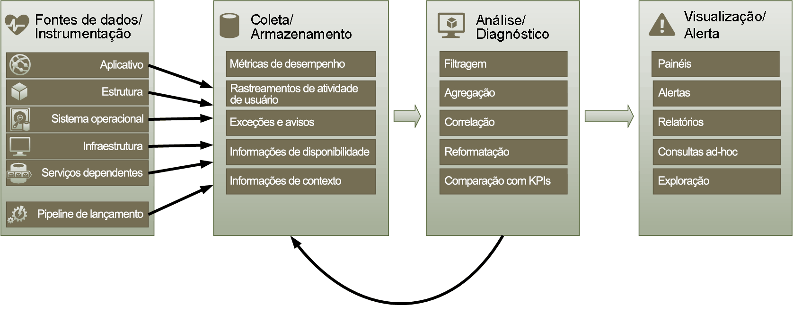
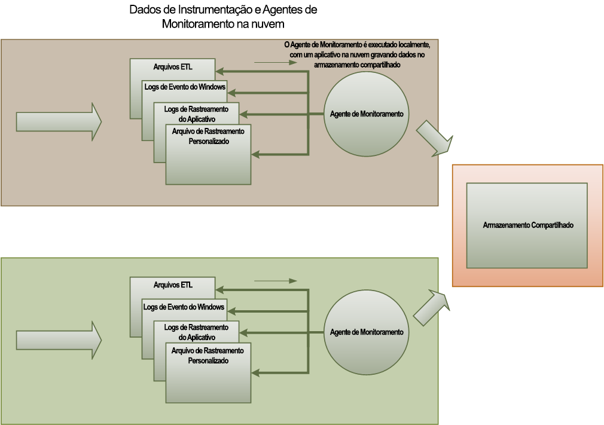
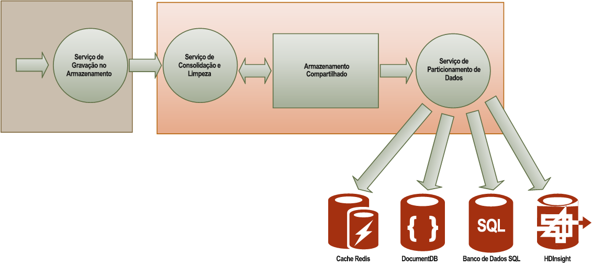

# <a name="monitoring-and-diagnostics"></a><span data-ttu-id="77f9b-103">Monitoramento e diagnóstico</span><span class="sxs-lookup"><span data-stu-id="77f9b-103">Monitoring and diagnostics</span></span>
[!INCLUDE [header](../_includes/header.md)]

<span data-ttu-id="77f9b-104">Os serviços e os aplicativos distribuídos em execução na nuvem são, por sua natureza, partes complexas de software que incluem muitas partes móveis.</span><span class="sxs-lookup"><span data-stu-id="77f9b-104">Distributed applications and services running in the cloud are, by their nature, complex pieces of software that comprise many moving parts.</span></span> <span data-ttu-id="77f9b-105">Em um ambiente de produção, é importante ser capaz de controlar a maneira como os usuários utilizam o seu sistema, monitorar a utilização de recursos e, de maneira geral, monitorar a integridade e o desempenho do sistema.</span><span class="sxs-lookup"><span data-stu-id="77f9b-105">In a production environment, it's important to be able to track the way in which users utilize your system, trace resource utilization, and generally monitor the health and performance of your system.</span></span> <span data-ttu-id="77f9b-106">Você pode usar essas informações como um auxílio de diagnóstico para detectar e corrigir problemas e para ajudar a identificar possíveis problemas e impedir que eles ocorram.</span><span class="sxs-lookup"><span data-stu-id="77f9b-106">You can use this information as a diagnostic aid to detect and correct issues, and also to help spot potential problems and prevent them from occurring.</span></span>

## <a name="monitoring-and-diagnostics-scenarios"></a><span data-ttu-id="77f9b-107">Cenários de monitoramento e diagnóstico</span><span class="sxs-lookup"><span data-stu-id="77f9b-107">Monitoring and diagnostics scenarios</span></span>
<span data-ttu-id="77f9b-108">Você pode usar o monitoramento para obter uma visão geral do funcionamento de um sistema.</span><span class="sxs-lookup"><span data-stu-id="77f9b-108">You can use monitoring to gain an insight into how well a system is functioning.</span></span> <span data-ttu-id="77f9b-109">O monitoramento é uma parte essencial da manutenção das metas de qualidade de serviço.</span><span class="sxs-lookup"><span data-stu-id="77f9b-109">Monitoring is a crucial part of maintaining quality-of-service targets.</span></span> <span data-ttu-id="77f9b-110">Alguns cenários comuns para coleta de dados de monitoramento incluem:</span><span class="sxs-lookup"><span data-stu-id="77f9b-110">Common scenarios for collecting monitoring data include:</span></span>

* <span data-ttu-id="77f9b-111">Garantir que o sistema permaneça íntegro.</span><span class="sxs-lookup"><span data-stu-id="77f9b-111">Ensuring that the system remains healthy.</span></span>
* <span data-ttu-id="77f9b-112">Monitorar a disponibilidade do sistema e dos elementos que o compõem.</span><span class="sxs-lookup"><span data-stu-id="77f9b-112">Tracking the availability of the system and its component elements.</span></span>
* <span data-ttu-id="77f9b-113">Manter o desempenho para garantir que a taxa de transferência do sistema não seja reduzida inesperadamente conforme o volume de trabalho aumentar.</span><span class="sxs-lookup"><span data-stu-id="77f9b-113">Maintaining performance to ensure that the throughput of the system does not degrade unexpectedly as the volume of work increases.</span></span>
* <span data-ttu-id="77f9b-114">Garantir que o sistema atenda a contratos de nível de serviço (SLAs) estabelecidos com os clientes.</span><span class="sxs-lookup"><span data-stu-id="77f9b-114">Guaranteeing that the system meets any service-level agreements (SLAs) established with customers.</span></span>
* <span data-ttu-id="77f9b-115">Proteger a privacidade e a segurança do sistema, dos usuários e de seus dados.</span><span class="sxs-lookup"><span data-stu-id="77f9b-115">Protecting the privacy and security of the system, users, and their data.</span></span>
* <span data-ttu-id="77f9b-116">Controlar as operações executadas para fins normativos ou de auditoria.</span><span class="sxs-lookup"><span data-stu-id="77f9b-116">Tracking the operations that are performed for auditing or regulatory purposes.</span></span>
* <span data-ttu-id="77f9b-117">Monitorar o uso diário do sistema e ajudar a identificar tendências que poderão resultar em problemas se não forem tratadas.</span><span class="sxs-lookup"><span data-stu-id="77f9b-117">Monitoring the day-to-day usage of the system and spotting trends that might lead to problems if they're not addressed.</span></span>
* <span data-ttu-id="77f9b-118">Rastrear problemas que ocorrem, desde o relatório inicial por meio da análise de possíveis causas à retificação, atualizações de software resultantes e implantações.</span><span class="sxs-lookup"><span data-stu-id="77f9b-118">Tracking issues that occur, from initial report through to analysis of possible causes, rectification, consequent software updates, and deployment.</span></span>
* <span data-ttu-id="77f9b-119">Controlar as operações e depurar versões de software.</span><span class="sxs-lookup"><span data-stu-id="77f9b-119">Tracing operations and debugging software releases.</span></span>

> [!NOTE]
> <span data-ttu-id="77f9b-120">Esta lista não se destina a ser completamente abrangente.</span><span class="sxs-lookup"><span data-stu-id="77f9b-120">This list is not intended to be comprehensive.</span></span> <span data-ttu-id="77f9b-121">Este documento se concentra nesses cenários, já que são as situações mais comuns que exigem monitoramento.</span><span class="sxs-lookup"><span data-stu-id="77f9b-121">This document focuses on these scenarios as the most common situations for performing monitoring.</span></span> <span data-ttu-id="77f9b-122">Pode haver outras menos comuns ou específicas para seu ambiente.</span><span class="sxs-lookup"><span data-stu-id="77f9b-122">There might be others that are less common or are specific to your environment.</span></span>
> 
> 

<span data-ttu-id="77f9b-123">As seções a seguir descrevem esses cenários mais detalhadamente.</span><span class="sxs-lookup"><span data-stu-id="77f9b-123">The following sections describe these scenarios in more detail.</span></span> <span data-ttu-id="77f9b-124">As informações sobre cada cenário são abordadas no seguinte formato:</span><span class="sxs-lookup"><span data-stu-id="77f9b-124">The information for each scenario is discussed in the following format:</span></span>

1. <span data-ttu-id="77f9b-125">Uma breve visão geral do cenário</span><span class="sxs-lookup"><span data-stu-id="77f9b-125">A brief overview of the scenario</span></span>
2. <span data-ttu-id="77f9b-126">Os requisitos típicos deste cenário</span><span class="sxs-lookup"><span data-stu-id="77f9b-126">The typical requirements of this scenario</span></span>
3. <span data-ttu-id="77f9b-127">Os dados brutos de instrumentação necessários para dar suporte ao cenário e possíveis fontes dessas informações.</span><span class="sxs-lookup"><span data-stu-id="77f9b-127">The raw instrumentation data that's required to support the scenario, and possible sources of this information</span></span>
4. <span data-ttu-id="77f9b-128">Como esses dados brutos podem ser analisados e combinados para gerar informações de diagnóstico significativas.</span><span class="sxs-lookup"><span data-stu-id="77f9b-128">How this raw data can be analyzed and combined to generate meaningful diagnostic information</span></span>

## <a name="health-monitoring"></a><span data-ttu-id="77f9b-129">Monitoramento da integridade</span><span class="sxs-lookup"><span data-stu-id="77f9b-129">Health monitoring</span></span>
<span data-ttu-id="77f9b-130">Um sistema é íntegro se ele estiver em execução e for capaz de processar solicitações.</span><span class="sxs-lookup"><span data-stu-id="77f9b-130">A system is healthy if it is running and capable of processing requests.</span></span> <span data-ttu-id="77f9b-131">A finalidade do monitoramento da integridade é gerar um instantâneo da integridade atual do sistema para que você possa verificar se todos os componentes do sistema estão funcionando conforme o esperado.</span><span class="sxs-lookup"><span data-stu-id="77f9b-131">The purpose of health monitoring is to generate a snapshot of the current health of the system so that you can verify that all components of the system are functioning as expected.</span></span>

### <a name="requirements-for-health-monitoring"></a><span data-ttu-id="77f9b-132">Requisitos para monitoramento da integridade</span><span class="sxs-lookup"><span data-stu-id="77f9b-132">Requirements for health monitoring</span></span>
<span data-ttu-id="77f9b-133">Se qualquer parte do sistema for considerada como problemática, um operador deverá ser alertado rapidamente (em questão de segundos).</span><span class="sxs-lookup"><span data-stu-id="77f9b-133">An operator should be alerted quickly (within a matter of seconds) if any part of the system is deemed to be unhealthy.</span></span> <span data-ttu-id="77f9b-134">O operador deve ser capaz de determinar quais partes do sistema estão funcionando normalmente e quais partes estão enfrentando problemas.</span><span class="sxs-lookup"><span data-stu-id="77f9b-134">The operator should be able to ascertain which parts of the system are functioning normally, and which parts are experiencing problems.</span></span> <span data-ttu-id="77f9b-135">A integridade do sistema pode ser realçada por meio de um sistema de semáforo:</span><span class="sxs-lookup"><span data-stu-id="77f9b-135">System health can be highlighted through a traffic-light system:</span></span>

* <span data-ttu-id="77f9b-136">Vermelho para não íntegro (o sistema parou)</span><span class="sxs-lookup"><span data-stu-id="77f9b-136">Red for unhealthy (the system has stopped)</span></span>
* <span data-ttu-id="77f9b-137">Amarelo para parcialmente íntegro (o sistema está sendo executado com funcionalidade reduzida)</span><span class="sxs-lookup"><span data-stu-id="77f9b-137">Yellow for partially healthy (the system is running with reduced functionality)</span></span>
* <span data-ttu-id="77f9b-138">Verde para completamente íntegro</span><span class="sxs-lookup"><span data-stu-id="77f9b-138">Green for completely healthy</span></span>

<span data-ttu-id="77f9b-139">Um sistema de monitoramento de integridade abrangente permite que o operador faça uma busca detalhada no sistema para exibir o status de integridade dos componentes e subsistemas.</span><span class="sxs-lookup"><span data-stu-id="77f9b-139">A comprehensive health-monitoring system enables an operator to drill down through the system to view the health status of subsystems and components.</span></span> <span data-ttu-id="77f9b-140">Por exemplo, se o sistema geral for representado como parcialmente íntegro, o operador deve ser capaz de ter uma visão mais detalhada para determinar qual funcionalidade está indisponível no momento.</span><span class="sxs-lookup"><span data-stu-id="77f9b-140">For example, if the overall system is depicted as partially healthy, the operator should be able to zoom in and determine which functionality is currently unavailable.</span></span>

### <a name="data-sources-instrumentation-and-data-collection-requirements"></a><span data-ttu-id="77f9b-141">Requisitos para coleta de dados, fontes de dados e instrumentação</span><span class="sxs-lookup"><span data-stu-id="77f9b-141">Data sources, instrumentation, and data-collection requirements</span></span>
<span data-ttu-id="77f9b-142">Os dados brutos necessários para dar suporte ao monitoramento da integridade podem ser gerados como resultado de:</span><span class="sxs-lookup"><span data-stu-id="77f9b-142">The raw data that's required to support health monitoring can be generated as a result of:</span></span>

* <span data-ttu-id="77f9b-143">Rastreamento da execução de solicitações do usuário.</span><span class="sxs-lookup"><span data-stu-id="77f9b-143">Tracing execution of user requests.</span></span> <span data-ttu-id="77f9b-144">Essas informações podem ser usadas para determinar quais solicitações tiveram êxito, quais falharam e quanto tempo cada solicitação leva.</span><span class="sxs-lookup"><span data-stu-id="77f9b-144">This information can be used to determine which requests have succeeded, which have failed, and how long each request takes.</span></span>
* <span data-ttu-id="77f9b-145">Monitoramento de usuário sintético.</span><span class="sxs-lookup"><span data-stu-id="77f9b-145">Synthetic user monitoring.</span></span> <span data-ttu-id="77f9b-146">Este processo simula as etapas executadas pelo usuário e segue uma série predefinida de etapas.</span><span class="sxs-lookup"><span data-stu-id="77f9b-146">This process simulates the steps performed by a user and follows a predefined series of steps.</span></span> <span data-ttu-id="77f9b-147">Os resultados de cada etapa devem ser capturados.</span><span class="sxs-lookup"><span data-stu-id="77f9b-147">The results of each step should be captured.</span></span>
* <span data-ttu-id="77f9b-148">Logs de exceções, falhas e avisos.</span><span class="sxs-lookup"><span data-stu-id="77f9b-148">Logging exceptions, faults, and warnings.</span></span> <span data-ttu-id="77f9b-149">Essas informações podem ser capturadas como resultado de instruções de rastreamento inseridas no código do aplicativo e da recuperação de informações dos logs de eventos de qualquer serviço referenciado pelo sistema.</span><span class="sxs-lookup"><span data-stu-id="77f9b-149">This information can be captured as a result of trace statements embedded into the application code, as well as retrieving information from the event logs of any services that the system references.</span></span>
* <span data-ttu-id="77f9b-150">Monitoramento da integridade de serviços de terceiros usados pelo sistema.</span><span class="sxs-lookup"><span data-stu-id="77f9b-150">Monitoring the health of any third-party services that the system uses.</span></span> <span data-ttu-id="77f9b-151">Esse monitoramento pode exigir a recuperação e a análise de dados de saúde que fornecem esses serviços.</span><span class="sxs-lookup"><span data-stu-id="77f9b-151">This monitoring might require retrieving and parsing health data that these services supply.</span></span> <span data-ttu-id="77f9b-152">Essas informações podem ter vários formatos.</span><span class="sxs-lookup"><span data-stu-id="77f9b-152">This information might take a variety of formats.</span></span>
* <span data-ttu-id="77f9b-153">Monitoramento do ponto de extremidade.</span><span class="sxs-lookup"><span data-stu-id="77f9b-153">Endpoint monitoring.</span></span> <span data-ttu-id="77f9b-154">Esse mecanismo é descrito em mais detalhes na seção “Monitoramento da disponibilidade”.</span><span class="sxs-lookup"><span data-stu-id="77f9b-154">This mechanism is described in more detail in the "Availability monitoring" section.</span></span>
* <span data-ttu-id="77f9b-155">Coletando informações de desempenho do ambiente, como utilização da CPU em segundo plano ou atividades de E/S (inclusive de rede).</span><span class="sxs-lookup"><span data-stu-id="77f9b-155">Collecting ambient performance information, such as background CPU utilization or I/O (including network) activity.</span></span>

### <a name="analyzing-health-data"></a><span data-ttu-id="77f9b-156">Analisando dados de integridade</span><span class="sxs-lookup"><span data-stu-id="77f9b-156">Analyzing health data</span></span>
<span data-ttu-id="77f9b-157">O foco principal do monitoramento de integridade é indicar rapidamente se o sistema está em execução.</span><span class="sxs-lookup"><span data-stu-id="77f9b-157">The primary focus of health monitoring is to quickly indicate whether the system is running.</span></span> <span data-ttu-id="77f9b-158">A análise hot dos dados imediatos pode disparar um alerta se um componente crítico é detectado como não íntegro.</span><span class="sxs-lookup"><span data-stu-id="77f9b-158">Hot analysis of the immediate data can trigger an alert if a critical component is detected as unhealthy.</span></span> <span data-ttu-id="77f9b-159">(Ele não responde a uma série de pings consecutivos, por exemplo). O operador pode, em seguida, executar a ação corretiva apropriada.</span><span class="sxs-lookup"><span data-stu-id="77f9b-159">(It fails to respond to a consecutive series of pings, for example.) The operator can then take the appropriate corrective action.</span></span>

<span data-ttu-id="77f9b-160">Um sistema mais avançado pode incluir um elemento de previsão que realiza uma análise cold em cargas de trabalho recentes e atuais.</span><span class="sxs-lookup"><span data-stu-id="77f9b-160">A more advanced system might include a predictive element that performs a cold analysis over recent and current workloads.</span></span> <span data-ttu-id="77f9b-161">Uma análise cold pode identificar tendências e determinar se o sistema provavelmente permanecerá íntegro ou se o sistema precisará de recursos adicionais.</span><span class="sxs-lookup"><span data-stu-id="77f9b-161">A cold analysis can spot trends and determine whether the system is likely to remain healthy or whether the system will need additional resources.</span></span> <span data-ttu-id="77f9b-162">Esse elemento preditivo deve ser baseado em métricas de desempenho críticas, como:</span><span class="sxs-lookup"><span data-stu-id="77f9b-162">This predictive element should be based on critical performance metrics, such as:</span></span>

* <span data-ttu-id="77f9b-163">A taxa de solicitações dirigidas a cada serviço ou subsistema.</span><span class="sxs-lookup"><span data-stu-id="77f9b-163">The rate of requests directed at each service or subsystem.</span></span>
* <span data-ttu-id="77f9b-164">Os tempos de resposta dessas solicitações.</span><span class="sxs-lookup"><span data-stu-id="77f9b-164">The response times of these requests.</span></span>
* <span data-ttu-id="77f9b-165">O volume de dados que entram e saem de cada serviço.</span><span class="sxs-lookup"><span data-stu-id="77f9b-165">The volume of data flowing into and out of each service.</span></span>

<span data-ttu-id="77f9b-166">Se o valor de qualquer métrica ultrapassar um limite definido, o sistema poderá gerar um alerta para habilitar um operador ou o dimensionamento automático (se disponível) a fim de executar as ações preventivas necessárias para manter a integridade do sistema.</span><span class="sxs-lookup"><span data-stu-id="77f9b-166">If the value of any metric exceeds a defined threshold, the system can raise an alert to enable an operator or autoscaling (if available) to take the preventative actions necessary to maintain system health.</span></span> <span data-ttu-id="77f9b-167">Essas ações podem envolver acrescentar recursos, reiniciar um ou mais serviços que estão falhando ou aplicar limitações a solicitações de prioridade mais baixa.</span><span class="sxs-lookup"><span data-stu-id="77f9b-167">These actions might involve adding resources, restarting one or more services that are failing, or applying throttling to lower-priority requests.</span></span>

## <a name="availability-monitoring"></a><span data-ttu-id="77f9b-168">Monitoramento da disponibilidade</span><span class="sxs-lookup"><span data-stu-id="77f9b-168">Availability monitoring</span></span>
<span data-ttu-id="77f9b-169">Um sistema realmente íntegro requer que os componentes e os subsistemas que compõem o sistema estejam disponíveis.</span><span class="sxs-lookup"><span data-stu-id="77f9b-169">A truly healthy system requires that the components and subsystems that compose the system are available.</span></span> <span data-ttu-id="77f9b-170">O monitoramento de disponibilidade está intimamente relacionado ao monitoramento de integridade.</span><span class="sxs-lookup"><span data-stu-id="77f9b-170">Availability monitoring is closely related to health monitoring.</span></span> <span data-ttu-id="77f9b-171">Mas enquanto o monitoramento da integridade fornece uma exibição imediata da integridade atual do sistema, o monitoramento da disponibilidade se ocupa de monitorar a disponibilidade do sistema e de seus componentes para gerar estatísticas sobre o tempo de atividade do sistema.</span><span class="sxs-lookup"><span data-stu-id="77f9b-171">But whereas health monitoring provides an immediate view of the current health of the system, availability monitoring is concerned with tracking the availability of the system and its components to generate statistics about the uptime of the system.</span></span>

<span data-ttu-id="77f9b-172">Em muitos sistemas, alguns componentes (como um banco de dados) são configurados com redundância interna para permitir um failover rápido caso ocorram falhas graves ou perda de conectividade.</span><span class="sxs-lookup"><span data-stu-id="77f9b-172">In many systems, some components (such as a database) are configured with built-in redundancy to permit rapid failover in the event of a serious fault or loss of connectivity.</span></span> <span data-ttu-id="77f9b-173">Idealmente, os usuários não devem estar cientes de que ocorreu uma falha.</span><span class="sxs-lookup"><span data-stu-id="77f9b-173">Ideally, users should not be aware that such a failure has occurred.</span></span> <span data-ttu-id="77f9b-174">Mas, de uma perspectiva do monitoramento da disponibilidade, é necessário obter o máximo possível de informações sobre essas falhas para determinar a causa e executar ações corretivas para impedir sua recorrência.</span><span class="sxs-lookup"><span data-stu-id="77f9b-174">But from an availability monitoring perspective, it's necessary to gather as much information as possible about such failures to determine the cause and take corrective actions to prevent them from recurring.</span></span>

<span data-ttu-id="77f9b-175">Os dados necessários para controlar a disponibilidade podem depender de vários fatores de nível inferior.</span><span class="sxs-lookup"><span data-stu-id="77f9b-175">The data that's required to track availability might depend on a number of lower-level factors.</span></span> <span data-ttu-id="77f9b-176">Muitos desses fatores podem ser específicos do aplicativo, do sistema e do ambiente.</span><span class="sxs-lookup"><span data-stu-id="77f9b-176">Many of these factors might be specific to the application, system, and environment.</span></span> <span data-ttu-id="77f9b-177">Um sistema de monitoramento eficaz captura os dados de disponibilidade que correspondem a esses fatores de nível inferior e os agrega para fornecer uma visão geral do sistema.</span><span class="sxs-lookup"><span data-stu-id="77f9b-177">An effective monitoring system captures the availability data that corresponds to these low-level factors and then aggregates them to give an overall picture of the system.</span></span> <span data-ttu-id="77f9b-178">Por exemplo, em um sistema de comércio eletrônico, a funcionalidade de negócios que permite que um cliente faça pedidos pode depender do repositório no qual detalhes do pedido são armazenados e do sistema de pagamento que processa as transações monetárias para pagar por esses pedidos.</span><span class="sxs-lookup"><span data-stu-id="77f9b-178">For example, in an e-commerce system, the business functionality that enables a customer to place orders might depend on the repository where order details are stored and the payment system that handles the monetary transactions for paying for these orders.</span></span> <span data-ttu-id="77f9b-179">A disponibilidade da parte de inserção de pedidos do sistema é, portanto, uma função da disponibilidade do repositório e do subsistema de pagamento.</span><span class="sxs-lookup"><span data-stu-id="77f9b-179">The availability of the order-placement part of the system is therefore a function of the availability of the repository and the payment subsystem.</span></span>

### <a name="requirements-for-availability-monitoring"></a><span data-ttu-id="77f9b-180">Requisitos para monitoramento da disponibilidade</span><span class="sxs-lookup"><span data-stu-id="77f9b-180">Requirements for availability monitoring</span></span>
<span data-ttu-id="77f9b-181">Um operador também deve ser capaz de exibir o histórico de disponibilidade de cada sistema e subsistema e usar essas informações para identificar tendências que podem fazer com que um ou mais subsistemas falhe periodicamente.</span><span class="sxs-lookup"><span data-stu-id="77f9b-181">An operator should also be able to view the historical availability of each system and subsystem, and use this information to spot any trends that might cause one or more subsystems to periodically fail.</span></span> <span data-ttu-id="77f9b-182">(Os serviços começam a falhar em determinado horário do dia que corresponde ao pico de processamento?)</span><span class="sxs-lookup"><span data-stu-id="77f9b-182">(Do services start to fail at a particular time of day that corresponds to peak processing hours?)</span></span>

<span data-ttu-id="77f9b-183">Uma solução de monitoramento deve fornecer uma visão imediata e histórica da disponibilidade ou indisponibilidade de cada subsistema.</span><span class="sxs-lookup"><span data-stu-id="77f9b-183">A monitoring solution should provide an immediate and historical view of the availability or unavailability of each subsystem.</span></span> <span data-ttu-id="77f9b-184">Ele também deve ser capaz de alertar rapidamente um operador quando um ou mais serviços falham ou quando os usuários não podem se conectar aos serviços.</span><span class="sxs-lookup"><span data-stu-id="77f9b-184">It should also be capable of quickly alerting an operator when one or more services fail or when users can't connect to services.</span></span> <span data-ttu-id="77f9b-185">Não se trata apenas de monitorar cada serviço, mas também de examinar as ações se elas falham ao tentar se comunicar com um serviço.</span><span class="sxs-lookup"><span data-stu-id="77f9b-185">This is a matter of not only monitoring each service, but also examining the actions that each user performs if these actions fail when they attempt to communicate with a service.</span></span> <span data-ttu-id="77f9b-186">Até certo ponto, um grau de falha de conectividade é normal e pode ser devido a erros temporários.</span><span class="sxs-lookup"><span data-stu-id="77f9b-186">To some extent, a degree of connectivity failure is normal and might be due to transient errors.</span></span> <span data-ttu-id="77f9b-187">Mas pode ser útil permitir que o sistema emita um alerta pelo número de falhas de conectividade para determinado subsistema que ocorrem durante um período específico.</span><span class="sxs-lookup"><span data-stu-id="77f9b-187">But it might be useful to allow the system to raise an alert for the number of connectivity failures to a specified subsystem that occur during a specific period.</span></span>

### <a name="data-sources-instrumentation-and-data-collection-requirements"></a><span data-ttu-id="77f9b-188">Requisitos para coleta de dados, fontes de dados e instrumentação</span><span class="sxs-lookup"><span data-stu-id="77f9b-188">Data sources, instrumentation, and data-collection requirements</span></span>
<span data-ttu-id="77f9b-189">Assim como com o monitoramento de integridade, os dados brutos necessários para dar suporte ao monitoramento da disponibilidade podem ser gerados como resultado do monitoramento do usuário sintético e do registro em log de exceções, falhas e avisos que possam ocorrer.</span><span class="sxs-lookup"><span data-stu-id="77f9b-189">As with health monitoring, the raw data that's required to support availability monitoring can be generated as a result of synthetic user monitoring and logging any exceptions, faults, and warnings that might occur.</span></span> <span data-ttu-id="77f9b-190">Além disso, dados de disponibilidade podem ser obtidos realizando o monitoramento do ponto de extremidade.</span><span class="sxs-lookup"><span data-stu-id="77f9b-190">In addition, availability data can be obtained from performing endpoint monitoring.</span></span> <span data-ttu-id="77f9b-191">O aplicativo pode expor um ou mais pontos de extremidade de integridade, cada um deles testando o acesso a uma área funcional do sistema.</span><span class="sxs-lookup"><span data-stu-id="77f9b-191">The application can expose one or more health endpoints, each testing access to a functional area within the system.</span></span> <span data-ttu-id="77f9b-192">O sistema de monitoramento pode executar um ping de cada ponto de extremidade seguindo um cronograma definido e coletar os resultados (sucesso ou falha).</span><span class="sxs-lookup"><span data-stu-id="77f9b-192">The monitoring system can ping each endpoint by following a defined schedule and collect the results (success or fail).</span></span>

<span data-ttu-id="77f9b-193">Todas as falhas de conectividade de rede, tempos limite e novas tentativas de conexão devem ser registrados.</span><span class="sxs-lookup"><span data-stu-id="77f9b-193">All timeouts, network connectivity failures, and connection retry attempts must be recorded.</span></span> <span data-ttu-id="77f9b-194">Todos os dados devem ter carimbo de data/hora.</span><span class="sxs-lookup"><span data-stu-id="77f9b-194">All data should be time-stamped.</span></span>

<a name="analyzing-availability-data"></a>

### <a name="analyzing-availability-data"></a><span data-ttu-id="77f9b-195">Analisando dados de disponibilidade</span><span class="sxs-lookup"><span data-stu-id="77f9b-195">Analyzing availability data</span></span>
<span data-ttu-id="77f9b-196">Os dados de instrumentação devem ser agregados e correlacionados para dar suporte aos seguintes tipos de análise:</span><span class="sxs-lookup"><span data-stu-id="77f9b-196">The instrumentation data must be aggregated and correlated to support the following types of analysis:</span></span>

* <span data-ttu-id="77f9b-197">A disponibilidade imediata do sistema e dos subsistemas.</span><span class="sxs-lookup"><span data-stu-id="77f9b-197">The immediate availability of the system and subsystems.</span></span>
* <span data-ttu-id="77f9b-198">As taxas de falha de disponibilidade do sistema e dos subsistemas.</span><span class="sxs-lookup"><span data-stu-id="77f9b-198">The availability failure rates of the system and subsystems.</span></span> <span data-ttu-id="77f9b-199">O ideal é que um operador seja capaz de correlacionar falhas a atividades específicas: o que estava acontecendo quando o sistema falhou?</span><span class="sxs-lookup"><span data-stu-id="77f9b-199">Ideally, an operator should be able to correlate failures with specific activities: what was happening when the system failed?</span></span>
* <span data-ttu-id="77f9b-200">Uma exibição do histórico de taxas de falha do sistema ou de subsistemas em um período especificado, assim como a carga do sistema (número de solicitações de usuários, por exemplo) quando uma falha ocorreu.</span><span class="sxs-lookup"><span data-stu-id="77f9b-200">A historical view of failure rates of the system or any subsystems across any specified period, and the load on the system (number of user requests, for example) when a failure occurred.</span></span>
* <span data-ttu-id="77f9b-201">Os motivos para a indisponibilidade do sistema ou de quaisquer subsistemas.</span><span class="sxs-lookup"><span data-stu-id="77f9b-201">The reasons for unavailability of the system or any subsystems.</span></span> <span data-ttu-id="77f9b-202">Por exemplo, os motivos podem ser a não execução do serviço, a perda de conectividade, a existência de conexão, mas atingindo o tempo limite e a existência de conexão, mas retornando erros.</span><span class="sxs-lookup"><span data-stu-id="77f9b-202">For example, the reasons might be service not running, connectivity lost, connected but timing out, and connected but returning errors.</span></span>

<span data-ttu-id="77f9b-203">Você pode calcular o percentual de disponibilidade de um serviço em um período de tempo usando a seguinte fórmula:</span><span class="sxs-lookup"><span data-stu-id="77f9b-203">You can calculate the percentage availability of a service over a period of time by using the following formula:</span></span>

```
%Availability =  ((Total Time – Total Downtime) / Total Time ) * 100
```

<span data-ttu-id="77f9b-204">Isso é útil para fins de SLA.</span><span class="sxs-lookup"><span data-stu-id="77f9b-204">This is useful for SLA purposes.</span></span> <span data-ttu-id="77f9b-205">(O [monitoramento de SLA](#SLA-monitoring) é descrito em mais detalhes mais adiante neste guia). A definição de *tempo de inatividade* depende do serviço.</span><span class="sxs-lookup"><span data-stu-id="77f9b-205">([SLA monitoring](#SLA-monitoring) is described in more detail later in this guidance.) The definition of *downtime* depends on the service.</span></span> <span data-ttu-id="77f9b-206">Por exemplo, o Serviço de Compilação do Visual Studio Team Services define o tempo de inatividade como o período (total de minutos acumulados) durante o qual o Serviço de Compilação está indisponível.</span><span class="sxs-lookup"><span data-stu-id="77f9b-206">For example, Visual Studio Team Services Build Service defines downtime as the period (total accumulated minutes) during which Build Service is unavailable.</span></span> <span data-ttu-id="77f9b-207">Um minuto será considerado indisponível se todas as solicitações HTTP contínuas para o Serviço de Compilação realizar operações iniciadas pelo cliente durante o minuto resultarem em um código de erro ou não retornarem nenhuma resposta.</span><span class="sxs-lookup"><span data-stu-id="77f9b-207">A minute is considered unavailable if all continuous HTTP requests to Build Service to perform customer-initiated operations throughout the minute either result in an error code or do not return a response.</span></span>

## <a name="performance-monitoring"></a><span data-ttu-id="77f9b-208">Monitoramento de desempenho</span><span class="sxs-lookup"><span data-stu-id="77f9b-208">Performance monitoring</span></span>
<span data-ttu-id="77f9b-209">Conforme o sistema vai sendo colocado cada vez mais sob pressão pelo aumento do volume de usuários, o tamanho dos conjuntos de dados que esses usuários acessam vai crescendo, aumentando a probabilidade de uma possível falha de um ou mais componentes.</span><span class="sxs-lookup"><span data-stu-id="77f9b-209">As the system is placed under more and more stress (by increasing the volume of users), the size of the datasets that these users access grows and the possibility of failure of one or more components becomes more likely.</span></span> <span data-ttu-id="77f9b-210">Frequentemente, a falha de um componente é precedida por uma queda no desempenho.</span><span class="sxs-lookup"><span data-stu-id="77f9b-210">Frequently, component failure is preceded by a decrease in performance.</span></span> <span data-ttu-id="77f9b-211">Se você conseguir detectar uma redução desse tipo, poderá tomar medidas proativas para corrigir a situação.</span><span class="sxs-lookup"><span data-stu-id="77f9b-211">If you're able detect such a decrease, you can take proactive steps to remedy the situation.</span></span>

<span data-ttu-id="77f9b-212">O desempenho do sistema depende de vários fatores.</span><span class="sxs-lookup"><span data-stu-id="77f9b-212">System performance depends on a number of factors.</span></span> <span data-ttu-id="77f9b-213">Cada fator normalmente é medido por meio de KPIs (indicadores chave de desempenho), como o número de transações de banco de dados por segundo ou o volume de solicitações de rede que são atendidas com êxito em um determinado período de tempo.</span><span class="sxs-lookup"><span data-stu-id="77f9b-213">Each factor is typically measured through key performance indicators (KPIs), such as the number of database transactions per second or the volume of network requests that are successfully serviced in a specified time frame.</span></span> <span data-ttu-id="77f9b-214">Alguns desses KPIs podem estar disponíveis como medidas de desempenho específicas, enquanto outros podem ser derivados de uma combinação de métricas.</span><span class="sxs-lookup"><span data-stu-id="77f9b-214">Some of these KPIs might be available as specific performance measures, whereas others might be derived from a combination of metrics.</span></span>

> [!NOTE]
> <span data-ttu-id="77f9b-215">Para determinar se o desempenho é bom ou insatisfatório, você precisa compreender o nível de desempenho em que o sistema deveria ser capaz de ser executado.</span><span class="sxs-lookup"><span data-stu-id="77f9b-215">Determining poor or good performance requires that you understand the level of performance at which the system should be capable of running.</span></span> <span data-ttu-id="77f9b-216">Para isso, é necessário observar o sistema enquanto ele está funcionando com uma carga típica e capturar os dados de cada KPI ao longo de um período de tempo.</span><span class="sxs-lookup"><span data-stu-id="77f9b-216">This requires observing the system while it's functioning under a typical load and capturing the data for each KPI over a period of time.</span></span> <span data-ttu-id="77f9b-217">Isso pode envolver executar o sistema com uma carga simulada em um ambiente de teste e coletar os dados apropriados antes de implantar o sistema em um ambiente de produção.</span><span class="sxs-lookup"><span data-stu-id="77f9b-217">This might involve running the system under a simulated load in a test environment and gathering the appropriate data before deploying the system to a production environment.</span></span>
> 
> <span data-ttu-id="77f9b-218">Você também deve fazer com que o monitoramento para fins de desempenho não sobrecarregue o sistema.</span><span class="sxs-lookup"><span data-stu-id="77f9b-218">You should also ensure that monitoring for performance purposes does not become a burden on the system.</span></span> <span data-ttu-id="77f9b-219">Talvez você possa ajustar dinamicamente o nível de detalhes dos dados que o processo de monitoramento de desempenho coleta.</span><span class="sxs-lookup"><span data-stu-id="77f9b-219">You might be able to dynamically adjust the level of detail for the data that the performance monitoring process gathers.</span></span>
> 
> 

### <a name="requirements-for-performance-monitoring"></a><span data-ttu-id="77f9b-220">Requisitos para monitoramento do desempenho</span><span class="sxs-lookup"><span data-stu-id="77f9b-220">Requirements for performance monitoring</span></span>
<span data-ttu-id="77f9b-221">Para examinar o desempenho do sistema, um operador normalmente precisa consultar informações que incluam:</span><span class="sxs-lookup"><span data-stu-id="77f9b-221">To examine system performance, an operator typically needs to see information that includes:</span></span>

* <span data-ttu-id="77f9b-222">As taxas de resposta para as solicitações de usuários.</span><span class="sxs-lookup"><span data-stu-id="77f9b-222">The response rates for user requests.</span></span>
* <span data-ttu-id="77f9b-223">O número de solicitações de usuários simultâneas.</span><span class="sxs-lookup"><span data-stu-id="77f9b-223">The number of concurrent user requests.</span></span>
* <span data-ttu-id="77f9b-224">O volume de tráfego de rede.</span><span class="sxs-lookup"><span data-stu-id="77f9b-224">The volume of network traffic.</span></span>
* <span data-ttu-id="77f9b-225">As taxas com as quais as transações de negócios estão sendo concluídas.</span><span class="sxs-lookup"><span data-stu-id="77f9b-225">The rates at which business transactions are being completed.</span></span>
* <span data-ttu-id="77f9b-226">O tempo médio de processamento das solicitações.</span><span class="sxs-lookup"><span data-stu-id="77f9b-226">The average processing time for requests.</span></span>

<span data-ttu-id="77f9b-227">Também pode ser útil fornecer ferramentas que permitem ao operador auxiliar na detecção de correlações, como:</span><span class="sxs-lookup"><span data-stu-id="77f9b-227">It can also be helpful to provide tools that enable an operator to help spot correlations, such as:</span></span>

* <span data-ttu-id="77f9b-228">O número de usuários simultâneos versus os tempos de latência de solicitação (quanto tempo leva para iniciar o processamento de uma solicitação depois que o usuário a envia).</span><span class="sxs-lookup"><span data-stu-id="77f9b-228">The number of concurrent users versus request latency times (how long it takes to start processing a request after the user has sent it).</span></span>
* <span data-ttu-id="77f9b-229">O número de usuários simultâneos versus o tempo médio de resposta (quanto tempo leva para concluir uma solicitação após ela começar a ser processada).</span><span class="sxs-lookup"><span data-stu-id="77f9b-229">The number of concurrent users versus the average response time (how long it takes to complete a request after it has started processing).</span></span>
* <span data-ttu-id="77f9b-230">O volume de solicitações versus o número de erros de processamento.</span><span class="sxs-lookup"><span data-stu-id="77f9b-230">The volume of requests versus the number of processing errors.</span></span>

<span data-ttu-id="77f9b-231">Junto com essas informações funcionais mais amplas, o operador deve ser capaz de ter uma visão detalhada do desempenho de cada componente do sistema.</span><span class="sxs-lookup"><span data-stu-id="77f9b-231">Along with this high-level functional information, an operator should be able to obtain a detailed view of the performance for each component in the system.</span></span> <span data-ttu-id="77f9b-232">Esses dados normalmente são fornecidos por meio de contadores de desempenho de nível mais detalhado que rastreiam informações como:</span><span class="sxs-lookup"><span data-stu-id="77f9b-232">This data is typically provided through low-level performance counters that track information such as:</span></span>

* <span data-ttu-id="77f9b-233">Utilização da memória.</span><span class="sxs-lookup"><span data-stu-id="77f9b-233">Memory utilization.</span></span>
* <span data-ttu-id="77f9b-234">Número de threads.</span><span class="sxs-lookup"><span data-stu-id="77f9b-234">Number of threads.</span></span>
* <span data-ttu-id="77f9b-235">Tempo de processamento da CPU.</span><span class="sxs-lookup"><span data-stu-id="77f9b-235">CPU processing time.</span></span>
* <span data-ttu-id="77f9b-236">Tamanho da fila de solicitações.</span><span class="sxs-lookup"><span data-stu-id="77f9b-236">Request queue length.</span></span>
* <span data-ttu-id="77f9b-237">Taxas e erros de E/S de rede ou de disco.</span><span class="sxs-lookup"><span data-stu-id="77f9b-237">Disk or network I/O rates and errors.</span></span>
* <span data-ttu-id="77f9b-238">Número de bytes gravados ou lidos.</span><span class="sxs-lookup"><span data-stu-id="77f9b-238">Number of bytes written or read.</span></span>
* <span data-ttu-id="77f9b-239">Indicadores de middleware, como tamanho da fila.</span><span class="sxs-lookup"><span data-stu-id="77f9b-239">Middleware indicators, such as queue length.</span></span>

<span data-ttu-id="77f9b-240">Todas as visualizações devem permitir que um operador especifique um período de tempo.</span><span class="sxs-lookup"><span data-stu-id="77f9b-240">All visualizations should allow an operator to specify a time period.</span></span> <span data-ttu-id="77f9b-241">Os dados exibidos podem ser um instantâneo da situação atual e/ou uma exibição do histórico de desempenho.</span><span class="sxs-lookup"><span data-stu-id="77f9b-241">The displayed data might be a snapshot of the current situation and/or a historical view of the performance.</span></span>

<span data-ttu-id="77f9b-242">O operador deve ser capaz de gerar um alerta baseado em qualquer medida de desempenho para qualquer valor determinado durante qualquer intervalo de tempo especificado.</span><span class="sxs-lookup"><span data-stu-id="77f9b-242">An operator should be able to raise an alert based on any performance measure for any specified value during any specified time interval.</span></span>

### <a name="data-sources-instrumentation-and-data-collection-requirements"></a><span data-ttu-id="77f9b-243">Requisitos para coleta de dados, fontes de dados e instrumentação</span><span class="sxs-lookup"><span data-stu-id="77f9b-243">Data sources, instrumentation, and data-collection requirements</span></span>
<span data-ttu-id="77f9b-244">Você pode obter dados de desempenho de alto nível (taxa de transferência, número de usuários simultâneos, número de transações de negócios, taxas de erro e assim por diante) monitorando o progresso das solicitações de usuários conforme elas chegam e passam pelo sistema.</span><span class="sxs-lookup"><span data-stu-id="77f9b-244">You can gather high-level performance data (throughput, number of concurrent users, number of business transactions, error rates, and so on) by monitoring the progress of users' requests as they arrive and pass through the system.</span></span> <span data-ttu-id="77f9b-245">Isso envolve a incorporação de instruções de rastreamento nos pontos-chave do código do aplicativo, em conjunto com informações de tempo.</span><span class="sxs-lookup"><span data-stu-id="77f9b-245">This involves incorporating tracing statements at key points in the application code, together with timing information.</span></span> <span data-ttu-id="77f9b-246">Todas as falhas, exceções e avisos devem ser capturados com dados suficientes para correlacioná-los às solicitações que os causaram.</span><span class="sxs-lookup"><span data-stu-id="77f9b-246">All faults, exceptions, and warnings should be captured with sufficient data for correlating them with the requests that caused them.</span></span> <span data-ttu-id="77f9b-247">O log do IIS (Serviços de Informações da Internet) é outra fonte útil.</span><span class="sxs-lookup"><span data-stu-id="77f9b-247">The Internet Information Services (IIS) log is another useful source.</span></span>

<span data-ttu-id="77f9b-248">Se possível, você também deve capturar dados de desempenho de quaisquer sistemas externos que o aplicativo utilizar.</span><span class="sxs-lookup"><span data-stu-id="77f9b-248">If possible, you should also capture performance data for any external systems that the application uses.</span></span> <span data-ttu-id="77f9b-249">Esses sistemas externos podem fornecer seus próprios contadores de desempenho ou outros recursos para solicitação de dados de desempenho.</span><span class="sxs-lookup"><span data-stu-id="77f9b-249">These external systems might provide their own performance counters or other features for requesting performance data.</span></span> <span data-ttu-id="77f9b-250">Se isso não for possível, registre informações como a hora de início e de término de cada solicitação feita para um sistema externo, junto com o status (êxito, falha ou aviso) da operação.</span><span class="sxs-lookup"><span data-stu-id="77f9b-250">If this is not possible, record information such as the start time and end time of each request made to an external system, together with the status (success, fail, or warning) of the operation.</span></span> <span data-ttu-id="77f9b-251">Por exemplo, você pode usar uma abordagem de cronômetro para solicitações de tempo: inicie um cronômetro quando a solicitação for iniciada e pare o cronômetro quando ela for concluída.</span><span class="sxs-lookup"><span data-stu-id="77f9b-251">For example, you can use a stopwatch approach to time requests: start a timer when the request starts and then stop the timer when the request finishes.</span></span>

<span data-ttu-id="77f9b-252">Os dados de desempenho mais detalhados para componentes individuais de um sistema podem estar disponíveis por meio de recursos e serviços como contadores de desempenho do Windows e o Diagnóstico do Azure.</span><span class="sxs-lookup"><span data-stu-id="77f9b-252">Low-level performance data for individual components in a system might be available through features and services such as Windows performance counters and Azure Diagnostics.</span></span>

### <a name="analyzing-performance-data"></a><span data-ttu-id="77f9b-253">Analisando dados de desempenho</span><span class="sxs-lookup"><span data-stu-id="77f9b-253">Analyzing performance data</span></span>
<span data-ttu-id="77f9b-254">Grande parte do trabalho de análise consiste em agregar dados de desempenho por tipo de solicitação de usuário e/ou subsistema ou serviço ao qual cada solicitação é enviada.</span><span class="sxs-lookup"><span data-stu-id="77f9b-254">Much of the analysis work consists of aggregating performance data by user request type and/or the subsystem or service to which each request is sent.</span></span> <span data-ttu-id="77f9b-255">Um exemplo de uma solicitação de usuário é adicionar um item a um carrinho de compras ou executar o processo de check-out em um sistema de comércio eletrônico.</span><span class="sxs-lookup"><span data-stu-id="77f9b-255">An example of a user request is adding an item to a shopping cart or performing the checkout process in an e-commerce system.</span></span>

<span data-ttu-id="77f9b-256">Outro requisito comum é resumir os dados de desempenho em percentis selecionados.</span><span class="sxs-lookup"><span data-stu-id="77f9b-256">Another common requirement is summarizing performance data in selected percentiles.</span></span> <span data-ttu-id="77f9b-257">Por exemplo, um operador pode determinar os tempos de resposta para 99% das solicitações, 95% das solicitações e 70% das solicitações.</span><span class="sxs-lookup"><span data-stu-id="77f9b-257">For example, an operator might determine the response times for 99 percent of requests, 95 percent of requests, and 70 percent of requests.</span></span> <span data-ttu-id="77f9b-258">Pode haver metas de SLA ou outras metas definidas para cada percentil.</span><span class="sxs-lookup"><span data-stu-id="77f9b-258">There might be SLA targets or other goals set for each percentile.</span></span> <span data-ttu-id="77f9b-259">Os resultados em andamento devem ser relatados quase em tempo real para ajudar a detectar problemas imediatos.</span><span class="sxs-lookup"><span data-stu-id="77f9b-259">The ongoing results should be reported in near real time to help detect immediate issues.</span></span> <span data-ttu-id="77f9b-260">Os resultados também devem ser agregados durante o tempo mais longo para fins estatísticos.</span><span class="sxs-lookup"><span data-stu-id="77f9b-260">The results should also be aggregated over the longer time for statistical purposes.</span></span>

<span data-ttu-id="77f9b-261">No caso de problemas de latência com impacto sobre o desempenho, o operador deve ser capaz de identificar rapidamente a causa do afunilamento examinando a latência de cada etapa que cada solicitação executa.</span><span class="sxs-lookup"><span data-stu-id="77f9b-261">In the case of latency issues affecting performance, an operator should be able to quickly identify the cause of the bottleneck by examining the latency of each step that each request performs.</span></span> <span data-ttu-id="77f9b-262">Os dados de desempenho devem, portanto, fornecer um meio de correlacionar as medidas de desempenho de cada etapa associá-las a uma solicitação específica.</span><span class="sxs-lookup"><span data-stu-id="77f9b-262">The performance data must therefore provide a means of correlating performance measures for each step to tie them to a specific request.</span></span>

<span data-ttu-id="77f9b-263">Dependendo dos requisitos de visualização, pode ser útil gerar e armazenar um cubo de dados que contenha exibições dos dados brutos.</span><span class="sxs-lookup"><span data-stu-id="77f9b-263">Depending on the visualization requirements, it might be useful to generate and store a data cube that contains views of the raw data.</span></span> <span data-ttu-id="77f9b-264">Esse cubo de dados pode permitir a análise das informações de desempenho e consultas ad hoc complexas.</span><span class="sxs-lookup"><span data-stu-id="77f9b-264">This data cube can allow complex ad hoc querying and analysis of the performance information.</span></span>

## <a name="security-monitoring"></a><span data-ttu-id="77f9b-265">Monitoramento de segurança</span><span class="sxs-lookup"><span data-stu-id="77f9b-265">Security monitoring</span></span>
<span data-ttu-id="77f9b-266">Todos os sistemas comerciais que contêm dados confidenciais devem implementar uma estrutura de segurança.</span><span class="sxs-lookup"><span data-stu-id="77f9b-266">All commercial systems that include sensitive data must implement a security structure.</span></span> <span data-ttu-id="77f9b-267">A complexidade do mecanismo de segurança geralmente é uma função da confidencialidade dos dados.</span><span class="sxs-lookup"><span data-stu-id="77f9b-267">The complexity of the security mechanism is usually a function of the sensitivity of the data.</span></span> <span data-ttu-id="77f9b-268">Em um sistema que exija que os usuários sejam autenticados, você deve registrar:</span><span class="sxs-lookup"><span data-stu-id="77f9b-268">In a system that requires users to be authenticated, you should record:</span></span>

* <span data-ttu-id="77f9b-269">Todas as tentativas de entrada, quer elas falhem ou tenham êxito.</span><span class="sxs-lookup"><span data-stu-id="77f9b-269">All sign-in attempts, whether they fail or succeed.</span></span>
* <span data-ttu-id="77f9b-270">Todas as operações executadas, e os detalhes de todos os recursos acessados, por um usuário autenticado.</span><span class="sxs-lookup"><span data-stu-id="77f9b-270">All operations performed by--and the details of all resources accessed by--an authenticated user.</span></span>
* <span data-ttu-id="77f9b-271">Quando um usuário encerra uma sessão e sai.</span><span class="sxs-lookup"><span data-stu-id="77f9b-271">When a user ends a session and signs out.</span></span>

<span data-ttu-id="77f9b-272">O monitoramento pode ajudar a detectar ataques ao sistema.</span><span class="sxs-lookup"><span data-stu-id="77f9b-272">Monitoring might be able to help detect attacks on the system.</span></span> <span data-ttu-id="77f9b-273">Por exemplo, um grande número de tentativas de logon com falha pode indicar um ataque de força bruta.</span><span class="sxs-lookup"><span data-stu-id="77f9b-273">For example, a large number of failed sign-in attempts might indicate a brute-force attack.</span></span> <span data-ttu-id="77f9b-274">Um aumento inesperado de solicitações pode ser o resultado de um ataque DDoS (de negação de serviço distribuído).</span><span class="sxs-lookup"><span data-stu-id="77f9b-274">An unexpected surge in requests might be the result of a distributed denial-of-service (DDoS) attack.</span></span> <span data-ttu-id="77f9b-275">Você deve estar preparado para monitorar todas as solicitações para todos os recursos, independentemente da origem dessas solicitações.</span><span class="sxs-lookup"><span data-stu-id="77f9b-275">You must be prepared to monitor all requests to all resources regardless of the source of these requests.</span></span> <span data-ttu-id="77f9b-276">Um sistema que tenha uma vulnerabilidade de logon pode expor acidentalmente recursos para o mundo exterior sem exigir que um usuário realmente entre.</span><span class="sxs-lookup"><span data-stu-id="77f9b-276">A system that has a sign-in vulnerability might accidentally expose resources to the outside world without requiring a user to actually sign in.</span></span>

### <a name="requirements-for-security-monitoring"></a><span data-ttu-id="77f9b-277">Requisitos para monitoramento de segurança</span><span class="sxs-lookup"><span data-stu-id="77f9b-277">Requirements for security monitoring</span></span>
<span data-ttu-id="77f9b-278">Os aspectos mais importantes do monitoramento de segurança devem possibilitar que o operador faça, rapidamente, o seguinte:</span><span class="sxs-lookup"><span data-stu-id="77f9b-278">The most critical aspects of security monitoring should enable an operator to quickly:</span></span>

* <span data-ttu-id="77f9b-279">Detecte tentativas de invasão por uma entidade não autenticada.</span><span class="sxs-lookup"><span data-stu-id="77f9b-279">Detect attempted intrusions by an unauthenticated entity.</span></span>
* <span data-ttu-id="77f9b-280">Identifique tentativas de entidades de executar operações em dados cujo acesso não lhes foi concedido.</span><span class="sxs-lookup"><span data-stu-id="77f9b-280">Identify attempts by entities to perform operations on data for which they have not been granted access.</span></span>
* <span data-ttu-id="77f9b-281">Determine se o sistema ou parte dele está sob ataque de fora ou de dentro.</span><span class="sxs-lookup"><span data-stu-id="77f9b-281">Determine whether the system, or some part of the system, is under attack from outside or inside.</span></span> <span data-ttu-id="77f9b-282">(Por exemplo, um usuário autenticado mal-intencionado pode estar tentando derrubar o sistema).</span><span class="sxs-lookup"><span data-stu-id="77f9b-282">(For example, a malicious authenticated user might be attempting to bring the system down.)</span></span>

<span data-ttu-id="77f9b-283">Para dar suporte a esses requisitos, o operador deve ser notificado:</span><span class="sxs-lookup"><span data-stu-id="77f9b-283">To support these requirements, an operator should be notified:</span></span>

* <span data-ttu-id="77f9b-284">Se uma conta tentar entrar repetidamente com falha durante um período especificado.</span><span class="sxs-lookup"><span data-stu-id="77f9b-284">If one account makes repeated failed sign-in attempts within a specified period.</span></span>
* <span data-ttu-id="77f9b-285">Se uma conta autenticada tentar repetidamente acessar um recurso proibido durante um período especificado.</span><span class="sxs-lookup"><span data-stu-id="77f9b-285">If one authenticated account repeatedly tries to access a prohibited resource during a specified period.</span></span>
* <span data-ttu-id="77f9b-286">Se um grande número de solicitações não autenticadas ou não autorizadas ocorrer durante um período especificado.</span><span class="sxs-lookup"><span data-stu-id="77f9b-286">If a large number of unauthenticated or unauthorized requests occur during a specified period.</span></span>

<span data-ttu-id="77f9b-287">As informações fornecidas a um operador devem incluir o endereço do host de origem de cada solicitação.</span><span class="sxs-lookup"><span data-stu-id="77f9b-287">The information that's provided to an operator should include the host address of the source for each request.</span></span> <span data-ttu-id="77f9b-288">Se as violações de segurança forem provenientes, regularmente, de determinado intervalo de endereços, esses hosts poderão ser bloqueados.</span><span class="sxs-lookup"><span data-stu-id="77f9b-288">If security violations regularly arise from a particular range of addresses, these hosts might be blocked.</span></span>

<span data-ttu-id="77f9b-289">Um aspecto fundamental da manutenção da segurança de um sistema é a capacidade de detectar rapidamente ações que desviam do padrão normal.</span><span class="sxs-lookup"><span data-stu-id="77f9b-289">A key part in maintaining the security of a system is being able to quickly detect actions that deviate from the usual pattern.</span></span> <span data-ttu-id="77f9b-290">As informações como o número de solicitações de entrada com falha e/ou com êxito podem ser exibidas visualmente para ajudar a detectar se há um aumento na atividade em horário fora do comum.</span><span class="sxs-lookup"><span data-stu-id="77f9b-290">Information such as the number of failed and/or successful sign-in requests can be displayed visually to help detect whether there is a spike in activity at an unusual time.</span></span> <span data-ttu-id="77f9b-291">(Um exemplo dessa atividade mostra usuários entrando às 3h e executando um grande número de operações quando seu dia de trabalho começa às 9h).</span><span class="sxs-lookup"><span data-stu-id="77f9b-291">(An example of this activity is users signing in at 3:00 AM and performing a large number of operations when their working day starts at 9:00 AM).</span></span> <span data-ttu-id="77f9b-292">Essas informações também podem ser usadas para ajudar a configurar o dimensionamento automático baseado em tempo.</span><span class="sxs-lookup"><span data-stu-id="77f9b-292">This information can also be used to help configure time-based autoscaling.</span></span> <span data-ttu-id="77f9b-293">Por exemplo, se o operador observar que um grande número de usuários entra regularmente em um determinado horário do dia, ele pode configurar a inicialização de serviços de autenticação adicionais para lidar com o volume de trabalho e depois desativar esses serviços quando o pico terminar.</span><span class="sxs-lookup"><span data-stu-id="77f9b-293">For example, if an operator observes that a large number of users regularly sign in at a particular time of day, the operator can arrange to start additional authentication services to handle the volume of work, and then shut down these additional services when the peak has passed.</span></span>

### <a name="data-sources-instrumentation-and-data-collection-requirements"></a><span data-ttu-id="77f9b-294">Requisitos para coleta de dados, fontes de dados e instrumentação</span><span class="sxs-lookup"><span data-stu-id="77f9b-294">Data sources, instrumentation, and data-collection requirements</span></span>
<span data-ttu-id="77f9b-295">A segurança é um aspecto abrangente da maioria dos sistemas distribuídos.</span><span class="sxs-lookup"><span data-stu-id="77f9b-295">Security is an all-encompassing aspect of most distributed systems.</span></span> <span data-ttu-id="77f9b-296">Os dados pertinentes provavelmente serão gerados em vários pontos em um sistema.</span><span class="sxs-lookup"><span data-stu-id="77f9b-296">The pertinent data is likely to be generated at multiple points throughout a system.</span></span> <span data-ttu-id="77f9b-297">Você deve considerar a adoção de uma abordagem SIEM (gerenciamento de informações e eventos de segurança) para coletar informações relacionadas à segurança resultantes de eventos gerados pelo aplicativo, equipamento de rede, servidores, firewalls, software antivírus e outros elementos de prevenção de intrusões.</span><span class="sxs-lookup"><span data-stu-id="77f9b-297">You should consider adopting a Security Information and Event Management (SIEM) approach to gather the security-related information that results from events raised by the application, network equipment, servers, firewalls, antivirus software, and other intrusion-prevention elements.</span></span>

<span data-ttu-id="77f9b-298">O monitoramento de segurança pode incorporar dados de ferramentas que não fazem parte do seu aplicativo.</span><span class="sxs-lookup"><span data-stu-id="77f9b-298">Security monitoring can incorporate data from tools that are not part of your application.</span></span> <span data-ttu-id="77f9b-299">Essas ferramentas podem incluir utilitários que identificam atividades de verificação de porta por órgãos externos ou filtros de rede que detectam tentativas de acesso não autenticado ao seu aplicativo e dados.</span><span class="sxs-lookup"><span data-stu-id="77f9b-299">These tools can include utilities that identify port-scanning activities by external agencies, or network filters that detect attempts to gain unauthenticated access to your application and data.</span></span>

<span data-ttu-id="77f9b-300">Em todo caso, os dados coletados devem permitir que o administrador determine a natureza de qualquer ataque e tome as medidas apropriadas.</span><span class="sxs-lookup"><span data-stu-id="77f9b-300">In all cases, the gathered data must enable an administrator to determine the nature of any attack and take the appropriate countermeasures.</span></span>

### <a name="analyzing-security-data"></a><span data-ttu-id="77f9b-301">Analisando dados de segurança</span><span class="sxs-lookup"><span data-stu-id="77f9b-301">Analyzing security data</span></span>
<span data-ttu-id="77f9b-302">Um recurso do monitoramento de segurança é a variedade de fontes das quais os dados surgem.</span><span class="sxs-lookup"><span data-stu-id="77f9b-302">A feature of security monitoring is the variety of sources from which the data arises.</span></span> <span data-ttu-id="77f9b-303">Os diferentes formatos e níveis de detalhe geralmente exigem uma análise complexa dos dados capturados, para uni-lis em um thread de informações coerente.</span><span class="sxs-lookup"><span data-stu-id="77f9b-303">The different formats and level of detail often require complex analysis of the captured data to tie it together into a coherent thread of information.</span></span> <span data-ttu-id="77f9b-304">Além dos casos mais simples (por exemplo, a detecção de um grande número de logons com falha ou tentativas repetidas de acesso não autorizado a recursos críticos), pode não ser possível executar processamentos complexos automatizados dos dados de segurança.</span><span class="sxs-lookup"><span data-stu-id="77f9b-304">Apart from the simplest of cases (such as detecting a large number of failed sign-ins, or repeated attempts to gain unauthorized access to critical resources), it might not be possible to perform any complex automated processing of security data.</span></span> <span data-ttu-id="77f9b-305">Em vez disso, talvez seja preferível gravar esses dados, com carimbo de data/hora, mas na forma original, em um repositório seguro para permitir a análise manual por especialistas.</span><span class="sxs-lookup"><span data-stu-id="77f9b-305">Instead, it might be preferable to write this data, time-stamped but otherwise in its original form, to a secure repository to allow for expert manual analysis.</span></span>

<a name="SLA-monitoring"></a>

## <a name="sla-monitoring"></a><span data-ttu-id="77f9b-306">monitoramento de SLA</span><span class="sxs-lookup"><span data-stu-id="77f9b-306">SLA monitoring</span></span>
<span data-ttu-id="77f9b-307">Muitos sistemas comerciais que dão suporte a clientes pagantes fazem garantias quanto ao desempenho do sistema na forma de SLAs.</span><span class="sxs-lookup"><span data-stu-id="77f9b-307">Many commercial systems that support paying customers make guarantees about the performance of the system in the form of SLAs.</span></span> <span data-ttu-id="77f9b-308">Essencialmente, os SLAs declaram que o sistema é capaz de lidar com um volume definido de trabalho dentro de um período de tempo acordado e sem perder informações críticas.</span><span class="sxs-lookup"><span data-stu-id="77f9b-308">Essentially, SLAs state that the system can handle a defined volume of work within an agreed time frame and without losing critical information.</span></span> <span data-ttu-id="77f9b-309">O monitoramento de SLA envolve garantir que o sistema possa atender a SLAs mensuráveis.</span><span class="sxs-lookup"><span data-stu-id="77f9b-309">SLA monitoring is concerned with ensuring that the system can meet measurable SLAs.</span></span>

> [!NOTE]
> <span data-ttu-id="77f9b-310">O monitoramento de SLA está intimamente relacionado ao monitoramento de desempenho.</span><span class="sxs-lookup"><span data-stu-id="77f9b-310">SLA monitoring is closely related to performance monitoring.</span></span> <span data-ttu-id="77f9b-311">Mas enquanto o monitoramento de desempenho tem a finalidade de garantir que o sistema tenha um funcionamento *ideal*, o monitoramento de SLA é governado por uma obrigação contratual que define o que *ideal* realmente significa.</span><span class="sxs-lookup"><span data-stu-id="77f9b-311">But whereas performance monitoring is concerned with ensuring that the system functions *optimally*, SLA monitoring is governed by a contractual obligation that defines what *optimally* actually means.</span></span>
> 
> 

<span data-ttu-id="77f9b-312">Os SLAs geralmente são definidos em termos de:</span><span class="sxs-lookup"><span data-stu-id="77f9b-312">SLAs are often defined in terms of:</span></span>

* <span data-ttu-id="77f9b-313">Disponibilidade geral do sistema.</span><span class="sxs-lookup"><span data-stu-id="77f9b-313">Overall system availability.</span></span> <span data-ttu-id="77f9b-314">Por exemplo, uma organização pode garantir que o sistema estará disponível 99,9% do tempo.</span><span class="sxs-lookup"><span data-stu-id="77f9b-314">For example, an organization might guarantee that the system will be available for 99.9 percent of the time.</span></span> <span data-ttu-id="77f9b-315">Isso equivale a não mais que 9 horas de inatividade por ano ou aproximadamente 10 minutos por semana.</span><span class="sxs-lookup"><span data-stu-id="77f9b-315">This equates to no more than 9 hours of downtime per year, or approximately 10 minutes a week.</span></span>
* <span data-ttu-id="77f9b-316">Taxa de transferência operacional.</span><span class="sxs-lookup"><span data-stu-id="77f9b-316">Operational throughput.</span></span> <span data-ttu-id="77f9b-317">Esse aspecto frequentemente é expresso como um ou mais limites máximos, como garantir que o sistema pode dar suporte a até 100 mil solicitações de usuários simultâneas ou de manipular 10 mil transações de negócios simultâneas.</span><span class="sxs-lookup"><span data-stu-id="77f9b-317">This aspect is often expressed as one or more high-water marks, such as guaranteeing that the system can support up to 100,000 concurrent user requests or handle 10,000 concurrent business transactions.</span></span>
* <span data-ttu-id="77f9b-318">Tempo de resposta operacional.</span><span class="sxs-lookup"><span data-stu-id="77f9b-318">Operational response time.</span></span> <span data-ttu-id="77f9b-319">O sistema também pode fazer garantias em relação à taxa na qual as solicitações são processadas.</span><span class="sxs-lookup"><span data-stu-id="77f9b-319">The system might also make guarantees for the rate at which requests are processed.</span></span> <span data-ttu-id="77f9b-320">Um exemplo é que 99% de todas as transações de negócios serão concluídas em dois segundos e nenhuma transação levará mais de 10 segundos.</span><span class="sxs-lookup"><span data-stu-id="77f9b-320">An example is that 99 percent of all business transactions will finish within 2 seconds, and no single transaction will take longer than 10 seconds.</span></span>

> [!NOTE]
> <span data-ttu-id="77f9b-321">Alguns contratos para sistemas comerciais também podem incluir SLAs de suporte ao cliente.</span><span class="sxs-lookup"><span data-stu-id="77f9b-321">Some contracts for commercial systems might also include SLAs for customer support.</span></span> <span data-ttu-id="77f9b-322">Um exemplo é que todas as solicitações de suporte técnico obterão uma resposta dentro de cinco minutos, e que 99% de todos os problemas serão tratados totalmente dentro de um dia útil.</span><span class="sxs-lookup"><span data-stu-id="77f9b-322">An example is that all help-desk requests will elicit a response within 5 minutes, and that 99 percent of all problems will be fully addressed within 1 working day.</span></span> <span data-ttu-id="77f9b-323">Um [acompanhamento de questões](#issue-tracking) (descrito posteriormente nesta seção) eficaz é fundamental para atender a SLAs como esses.</span><span class="sxs-lookup"><span data-stu-id="77f9b-323">Effective [issue tracking](#issue-tracking) (described later in this section) is key to meeting SLAs such as these.</span></span>
> 
> 

### <a name="requirements-for-sla-monitoring"></a><span data-ttu-id="77f9b-324">Requisitos para monitoramento de SLA</span><span class="sxs-lookup"><span data-stu-id="77f9b-324">Requirements for SLA monitoring</span></span>
<span data-ttu-id="77f9b-325">No nível mais alto, um operador deve ser capaz de determinar rapidamente se o sistema está cumprindo os SLAs ou não.</span><span class="sxs-lookup"><span data-stu-id="77f9b-325">At the highest level, an operator should be able to determine at a glance whether the system is meeting the agreed SLAs or not.</span></span> <span data-ttu-id="77f9b-326">E se não estiver, o operador deve ser capaz de fazer drill down e examinar os fatores subjacentes para determinar as razões de um desempenho abaixo do padrão.</span><span class="sxs-lookup"><span data-stu-id="77f9b-326">And if not, the operator should be able to drill down and examine the underlying factors to determine the reasons for substandard performance.</span></span>

<span data-ttu-id="77f9b-327">Indicadores amplos comuns que podem ser representados visualmente incluem:</span><span class="sxs-lookup"><span data-stu-id="77f9b-327">Typical high-level indicators that can be depicted visually include:</span></span>

* <span data-ttu-id="77f9b-328">O percentual  de tempo de atividade do serviço.</span><span class="sxs-lookup"><span data-stu-id="77f9b-328">The percentage of service uptime.</span></span>
* <span data-ttu-id="77f9b-329">A taxa de transferência do aplicativo (medida em termos de transações e/ou operações bem-sucedidas por segundo).</span><span class="sxs-lookup"><span data-stu-id="77f9b-329">The application throughput (measured in terms of successful transactions and/or operations per second).</span></span>
* <span data-ttu-id="77f9b-330">O número de solicitações do aplicativo com êxito/falha.</span><span class="sxs-lookup"><span data-stu-id="77f9b-330">The number of successful/failing application requests.</span></span>
* <span data-ttu-id="77f9b-331">O número de falhas, exceções e avisos de aplicativo e sistema.</span><span class="sxs-lookup"><span data-stu-id="77f9b-331">The number of application and system faults, exceptions, and warnings.</span></span>

<span data-ttu-id="77f9b-332">Todos esses indicadores devem ser capazes de ser filtrados por um período de tempo especificado.</span><span class="sxs-lookup"><span data-stu-id="77f9b-332">All of these indicators should be capable of being filtered by a specified period of time.</span></span>

<span data-ttu-id="77f9b-333">Um aplicativo em nuvem provavelmente incluirá um número de subsistemas e componentes.</span><span class="sxs-lookup"><span data-stu-id="77f9b-333">A cloud application will likely comprise a number of subsystems and components.</span></span> <span data-ttu-id="77f9b-334">O operador deve ser capaz de selecionar um indicador amplo e ver como ele é composto por meio da integridade dos elementos subjacentes.</span><span class="sxs-lookup"><span data-stu-id="77f9b-334">An operator should be able to select a high-level indicator and see how it's composed from the health of the underlying elements.</span></span> <span data-ttu-id="77f9b-335">Por exemplo, se o tempo de atividade do sistema geral ficar abaixo de um valor aceitável, o operador deve ser capaz de ter uma visão detalhadas para determinar quais elementos estão contribuindo para essa falha.</span><span class="sxs-lookup"><span data-stu-id="77f9b-335">For example, if the uptime of the overall system falls below an acceptable value, an operator should be able to zoom in and determine which elements are contributing to this failure.</span></span>

> [!NOTE]
> <span data-ttu-id="77f9b-336">O tempo de atividade do sistema precisa ser definido com cuidado.</span><span class="sxs-lookup"><span data-stu-id="77f9b-336">System uptime needs to be defined carefully.</span></span> <span data-ttu-id="77f9b-337">Em um sistema que usa a redundância para garantir a disponibilidade máxima, instâncias individuais de elementos podem falhar, mas o sistema pode permanecer funcional.</span><span class="sxs-lookup"><span data-stu-id="77f9b-337">In a system that uses redundancy to ensure maximum availability, individual instances of elements might fail, but the system can remain functional.</span></span> <span data-ttu-id="77f9b-338">O tempo de atividade do sistema apresentado pelo monitoramento da integridade deve indicar o tempo de atividade agregado de cada elemento, e não necessariamente se o sistema foi de fato interrompido.</span><span class="sxs-lookup"><span data-stu-id="77f9b-338">System uptime as presented by health monitoring should indicate the aggregate uptime of each element and not necessarily whether the system has actually halted.</span></span> <span data-ttu-id="77f9b-339">Além disso, as falhas podem ser isoladas.</span><span class="sxs-lookup"><span data-stu-id="77f9b-339">Additionally, failures might be isolated.</span></span> <span data-ttu-id="77f9b-340">Portanto, mesmo se um sistema específico não estiver disponível, o restante do sistema poderá permanecer disponível, mas com funcionalidade reduzida.</span><span class="sxs-lookup"><span data-stu-id="77f9b-340">So even if a specific system is unavailable, the remainder of the system might remain available, although with decreased functionality.</span></span> <span data-ttu-id="77f9b-341">(Em um sistema de comércio eletrônico, uma falha no sistema pode impedir que o cliente faça pedidos, mas ele ainda poderá navegar pelo catálogo de produtos).</span><span class="sxs-lookup"><span data-stu-id="77f9b-341">(In an e-commerce system, a failure in the system might prevent a customer from placing orders, but the customer might still be able to browse the product catalog.)</span></span>
> 
> 

<span data-ttu-id="77f9b-342">Para fins de alerta, o sistema deve ser capaz de acionar um evento se qualquer um dos indicadores amplos ultrapassar um limite especificado.</span><span class="sxs-lookup"><span data-stu-id="77f9b-342">For alerting purposes, the system should be able to raise an event if any of the high-level indicators exceed a specified threshold.</span></span> <span data-ttu-id="77f9b-343">Os detalhes dos diversos fatores que compõem o indicador mais amplo devem estar disponíveis como dados contextuais para o sistema de alertas.</span><span class="sxs-lookup"><span data-stu-id="77f9b-343">The lower-level details of the various factors that compose the high-level indicator should be available as contextual data to the alerting system.</span></span>

### <a name="data-sources-instrumentation-and-data-collection-requirements"></a><span data-ttu-id="77f9b-344">Requisitos para coleta de dados, fontes de dados e instrumentação</span><span class="sxs-lookup"><span data-stu-id="77f9b-344">Data sources, instrumentation, and data-collection requirements</span></span>
<span data-ttu-id="77f9b-345">Os dados brutos necessários para dar suporte ao monitoramento de SLA são semelhantes aos dados brutos necessários para monitorar o desempenho em conjunto com alguns aspectos do monitoramento da integridade e da disponibilidade.</span><span class="sxs-lookup"><span data-stu-id="77f9b-345">The raw data that's required to support SLA monitoring is similar to the raw data that's required for performance monitoring, together with some aspects of health and availability monitoring.</span></span> <span data-ttu-id="77f9b-346">(Consulte as seções para obter mais detalhes). Você pode capturar dados:</span><span class="sxs-lookup"><span data-stu-id="77f9b-346">(See those sections for more details.) You can capture this data by:</span></span>

* <span data-ttu-id="77f9b-347">Monitorando pontos de extremidade.</span><span class="sxs-lookup"><span data-stu-id="77f9b-347">Performing endpoint monitoring.</span></span>
* <span data-ttu-id="77f9b-348">Logs de exceções, falhas e avisos.</span><span class="sxs-lookup"><span data-stu-id="77f9b-348">Logging exceptions, faults, and warnings.</span></span>
* <span data-ttu-id="77f9b-349">Rastreando a execução de solicitações do usuário.</span><span class="sxs-lookup"><span data-stu-id="77f9b-349">Tracing the execution of user requests.</span></span>
* <span data-ttu-id="77f9b-350">Monitorando a disponibilidade de eventuais serviços de terceiros que o sistema usa.</span><span class="sxs-lookup"><span data-stu-id="77f9b-350">Monitoring the availability of any third-party services that the system uses.</span></span>
* <span data-ttu-id="77f9b-351">Usando contadores e métricas de desempenho.</span><span class="sxs-lookup"><span data-stu-id="77f9b-351">Using performance metrics and counters.</span></span>

<span data-ttu-id="77f9b-352">Todos os dados devem ter informações de temporização e carimbo de data/hora.</span><span class="sxs-lookup"><span data-stu-id="77f9b-352">All data must be timed and time-stamped.</span></span>

### <a name="analyzing-sla-data"></a><span data-ttu-id="77f9b-353">Analisando dados de SLA</span><span class="sxs-lookup"><span data-stu-id="77f9b-353">Analyzing SLA data</span></span>
<span data-ttu-id="77f9b-354">Os dados de instrumentação devem ser agregados para gerar uma imagem do desempenho geral do sistema.</span><span class="sxs-lookup"><span data-stu-id="77f9b-354">The instrumentation data must be aggregated to generate a picture of the overall performance of the system.</span></span> <span data-ttu-id="77f9b-355">Os dados agregados também devem dar suporte à busca detalhada para habilitar a análise do desempenho dos subsistemas subjacentes.</span><span class="sxs-lookup"><span data-stu-id="77f9b-355">Aggregated data must also support drill-down to enable examination of the performance of the underlying subsystems.</span></span> <span data-ttu-id="77f9b-356">Por exemplo, você deve ser capaz de:</span><span class="sxs-lookup"><span data-stu-id="77f9b-356">For example, you should be able to:</span></span>

* <span data-ttu-id="77f9b-357">Calcular o número total de solicitações de usuários durante determinado período e determinar a taxa de êxito e falha dessas solicitações.</span><span class="sxs-lookup"><span data-stu-id="77f9b-357">Calculate the total number of user requests during a specified period and determine the success and failure rate of these requests.</span></span>
* <span data-ttu-id="77f9b-358">Combinar os tempos de resposta de solicitações de usuários para gerar uma exibição geral dos tempos de resposta do sistema.</span><span class="sxs-lookup"><span data-stu-id="77f9b-358">Combine the response times of user requests to generate an overall view of system response times.</span></span>
* <span data-ttu-id="77f9b-359">Analisar o progresso das solicitações de usuários para decompor o tempo de resposta geral de determinada solicitação nos tempos de resposta dos itens de trabalho individuais da solicitação.</span><span class="sxs-lookup"><span data-stu-id="77f9b-359">Analyze the progress of user requests to break down the overall response time of a request into the response times of the individual work items in that request.</span></span>  
* <span data-ttu-id="77f9b-360">Determinar a disponibilidade geral do sistema como um percentual de tempo de atividade para qualquer período específico.</span><span class="sxs-lookup"><span data-stu-id="77f9b-360">Determine the overall availability of the system as a percentage of uptime for any specific period.</span></span>
* <span data-ttu-id="77f9b-361">Analisar a disponibilidade de tempo percentual dos componentes e serviços individuais do sistema.</span><span class="sxs-lookup"><span data-stu-id="77f9b-361">Analyze the percentage time availability of the individual components and services in the system.</span></span> <span data-ttu-id="77f9b-362">Isso pode envolver a análise de logs gerados por serviços terceirizados.</span><span class="sxs-lookup"><span data-stu-id="77f9b-362">This might involve parsing logs that third-party services have generated.</span></span>

<span data-ttu-id="77f9b-363">Muitos sistemas comerciais precisam relatar os números do desempenho real em comparação com os SLAs acordados por um período específico, que normalmente é de um mês.</span><span class="sxs-lookup"><span data-stu-id="77f9b-363">Many commercial systems are required to report real performance figures against agreed SLAs for a specified period, typically a month.</span></span> <span data-ttu-id="77f9b-364">Essas informações podem ser usadas para calcular créditos ou outras formas de reembolso para os clientes se os SLAs não forem cumpridos durante o período.</span><span class="sxs-lookup"><span data-stu-id="77f9b-364">This information can be used to calculate credits or other forms of repayments for customers if the SLAs are not met during that period.</span></span> <span data-ttu-id="77f9b-365">Você pode calcular a disponibilidade de um serviço usando a técnica descrita na seção [Analisando dados de disponibilidade](#analyzing-availability-data).</span><span class="sxs-lookup"><span data-stu-id="77f9b-365">You can calculate availability for a service by using the technique described in the section [Analyzing availability data](#analyzing-availability-data).</span></span>

<span data-ttu-id="77f9b-366">Para fins internos, uma organização também pode controlar o número e a natureza dos incidentes que causaram a falha dos serviços.</span><span class="sxs-lookup"><span data-stu-id="77f9b-366">For internal purposes, an organization might also track the number and nature of incidents that caused services to fail.</span></span> <span data-ttu-id="77f9b-367">Aprender a resolver esses problemas rapidamente ou eliminá-los completamente ajudará a reduzir o tempo de inatividade e a cumprir aos SLAs.</span><span class="sxs-lookup"><span data-stu-id="77f9b-367">Learning how to resolve these issues quickly, or eliminate them completely, will help to reduce downtime and meet SLAs.</span></span>

## <a name="auditing"></a><span data-ttu-id="77f9b-368">Auditoria</span><span class="sxs-lookup"><span data-stu-id="77f9b-368">Auditing</span></span>
<span data-ttu-id="77f9b-369">Dependendo da natureza do aplicativo, pode haver exigências estatutárias ou legais que especificam os requisitos para auditoria das operações dos usuários e registro de todo o acesso aos dados.</span><span class="sxs-lookup"><span data-stu-id="77f9b-369">Depending on the nature of the application, there might be statutory or other legal regulations that specify requirements for auditing users' operations and recording all data access.</span></span> <span data-ttu-id="77f9b-370">Uma auditoria pode trazer provas que vinculem clientes a solicitações específicas.</span><span class="sxs-lookup"><span data-stu-id="77f9b-370">Auditing can provide evidence that links customers to specific requests.</span></span> <span data-ttu-id="77f9b-371">O não repúdio é um fator importante em muitos sistemas de comércio eletrônico para ajudar a manter a relação de confiança entre um cliente e a organização responsável pelo aplicativo ou serviço.</span><span class="sxs-lookup"><span data-stu-id="77f9b-371">Non-repudiation is an important factor in many e-business systems to help maintain trust be between a customer and the organization that's responsible for the application or service.</span></span>

### <a name="requirements-for-auditing"></a><span data-ttu-id="77f9b-372">Requisitos para auditoria</span><span class="sxs-lookup"><span data-stu-id="77f9b-372">Requirements for auditing</span></span>
<span data-ttu-id="77f9b-373">Um analista deve ser capaz de rastrear a sequência das operações de negócios que os usuários estão executando para que você possa reconstruir as ações deles.</span><span class="sxs-lookup"><span data-stu-id="77f9b-373">An analyst must be able to trace the sequence of business operations that users are performing so that you can reconstruct users' actions.</span></span> <span data-ttu-id="77f9b-374">Isso pode ser necessário simplesmente para fins de registro ou como parte de uma investigação forense.</span><span class="sxs-lookup"><span data-stu-id="77f9b-374">This might be necessary simply as a matter of record, or as part of a forensic investigation.</span></span>

<span data-ttu-id="77f9b-375">As informações de auditoria são altamente confidenciais.</span><span class="sxs-lookup"><span data-stu-id="77f9b-375">Audit information is highly sensitive.</span></span> <span data-ttu-id="77f9b-376">Elas provavelmente incluirão dados que identifiquem os usuários do sistema, junto com as tarefas em execução.</span><span class="sxs-lookup"><span data-stu-id="77f9b-376">It will likely include data that identifies the users of the system, together with the tasks that they're performing.</span></span> <span data-ttu-id="77f9b-377">Por esse motivo, as informações de auditoria provavelmente terão a forma de relatórios que são disponibilizados somente para analistas confiáveis, em vez de usar um sistema interativo que dê suporte a operações gráficas de busca detalhada.</span><span class="sxs-lookup"><span data-stu-id="77f9b-377">For this reason, audit information will most likely take the form of reports that are available only to trusted analysts rather than as an interactive system that supports drill-down of graphical operations.</span></span> <span data-ttu-id="77f9b-378">Um analista deve ser capaz de gerar uma variedade de relatórios.</span><span class="sxs-lookup"><span data-stu-id="77f9b-378">An analyst should be able to generate a range of reports.</span></span> <span data-ttu-id="77f9b-379">Por exemplo, relatórios podem listar as atividades de todos os usuários que ocorrem durante um período especificado, detalham a cronologia das atividades de um único usuário ou listam a sequência de operações executadas em um ou mais recursos.</span><span class="sxs-lookup"><span data-stu-id="77f9b-379">For example, reports might list all users' activities occurring during a specified time frame, detail the chronology of activity for a single user, or list the sequence of operations performed against one or more resources.</span></span>

### <a name="data-sources-instrumentation-and-data-collection-requirements"></a><span data-ttu-id="77f9b-380">Requisitos para coleta de dados, fontes de dados e instrumentação</span><span class="sxs-lookup"><span data-stu-id="77f9b-380">Data sources, instrumentation, and data-collection requirements</span></span>
<span data-ttu-id="77f9b-381">As principais fontes de informações para auditoria podem incluir:</span><span class="sxs-lookup"><span data-stu-id="77f9b-381">The primary sources of information for auditing can include:</span></span>

* <span data-ttu-id="77f9b-382">O sistema de segurança que gerencia a autenticação do usuário.</span><span class="sxs-lookup"><span data-stu-id="77f9b-382">The security system that manages user authentication.</span></span>
* <span data-ttu-id="77f9b-383">Logs de rastreamento que registram a atividade do usuário.</span><span class="sxs-lookup"><span data-stu-id="77f9b-383">Trace logs that record user activity.</span></span>
* <span data-ttu-id="77f9b-384">Logs de segurança que rastreiam todas as solicitações de rede identificáveis e não identificáveis.</span><span class="sxs-lookup"><span data-stu-id="77f9b-384">Security logs that track all identifiable and unidentifiable network requests.</span></span>

<span data-ttu-id="77f9b-385">O formato dos dados de auditoria e a maneira como eles são armazenados pode ser motivado por requisitos regulatórios.</span><span class="sxs-lookup"><span data-stu-id="77f9b-385">The format of the audit data and the way in which it's stored might be driven by regulatory requirements.</span></span> <span data-ttu-id="77f9b-386">Por exemplo, pode não ser possível limpar os dados de qualquer maneira.</span><span class="sxs-lookup"><span data-stu-id="77f9b-386">For example, it might not be possible to clean the data in any way.</span></span> <span data-ttu-id="77f9b-387">(Eles devem ser registrados em seu formato original). O acesso ao repositório onde é mantido deve ser protegido para evitar violação.</span><span class="sxs-lookup"><span data-stu-id="77f9b-387">(It must be recorded in its original format.) Access to the repository where it's held must be protected to prevent tampering.</span></span>

### <a name="analyzing-audit-data"></a><span data-ttu-id="77f9b-388">Analisando dados de auditoria</span><span class="sxs-lookup"><span data-stu-id="77f9b-388">Analyzing audit data</span></span>
<span data-ttu-id="77f9b-389">Um analista deve ser capaz de acessar os dados brutos em sua totalidade e em seu formato original.</span><span class="sxs-lookup"><span data-stu-id="77f9b-389">An analyst must be able to access the raw data in its entirety, in its original form.</span></span> <span data-ttu-id="77f9b-390">Além de requisito de gerar relatórios de auditoria comuns, as ferramentas usadas para analisar esses dados provavelmente deverão especializadas e mantidas externamente ao sistema.</span><span class="sxs-lookup"><span data-stu-id="77f9b-390">Aside from the requirement to generate common audit reports, the tools for analyzing this data are likely to be specialized and kept external to the system.</span></span>

## <a name="usage-monitoring"></a><span data-ttu-id="77f9b-391">Monitoramento de uso</span><span class="sxs-lookup"><span data-stu-id="77f9b-391">Usage monitoring</span></span>
<span data-ttu-id="77f9b-392">O monitoramento de uso controla como os recursos e componentes de um aplicativo são usados.</span><span class="sxs-lookup"><span data-stu-id="77f9b-392">Usage monitoring tracks how the features and components of an application are used.</span></span> <span data-ttu-id="77f9b-393">O operador pode usar os dados coletados para:</span><span class="sxs-lookup"><span data-stu-id="77f9b-393">An operator can use the gathered data to:</span></span>

* <span data-ttu-id="77f9b-394">Determinar quais recursos são usados intensamente e identificar quaisquer possíveis pontos problemáticos no sistema.</span><span class="sxs-lookup"><span data-stu-id="77f9b-394">Determine which features are heavily used and determine any potential hotspots in the system.</span></span> <span data-ttu-id="77f9b-395">Os elementos de alto tráfego podem se beneficiar do particionamento funcional ou até mesmo da replicação para distribuir a carga de maneira mais uniforme.</span><span class="sxs-lookup"><span data-stu-id="77f9b-395">High-traffic elements might benefit from functional partitioning or even replication to spread the load more evenly.</span></span> <span data-ttu-id="77f9b-396">Um operador também pode usar essas informações para determinar quais recursos são usados com pouca frequência e são possíveis candidatos à desativação ou substituição em uma versão futura do sistema.</span><span class="sxs-lookup"><span data-stu-id="77f9b-396">An operator can also use this information to ascertain which features are infrequently used and are possible candidates for retirement or replacement in a future version of the system.</span></span>
* <span data-ttu-id="77f9b-397">Obter informações sobre os eventos operacionais do sistema em situação de uso normal.</span><span class="sxs-lookup"><span data-stu-id="77f9b-397">Obtain information about the operational events of the system under normal use.</span></span> <span data-ttu-id="77f9b-398">Por exemplo, em um site de comércio eletrônico, você pode registrar as informações estatísticas sobre o número de transações e o volume de clientes que são responsáveis por elas.</span><span class="sxs-lookup"><span data-stu-id="77f9b-398">For example, in an e-commerce site, you can record the statistical information about the number of transactions and the volume of customers that are responsible for them.</span></span> <span data-ttu-id="77f9b-399">Essas informações podem ser usadas para o planejamento da capacidade à medida que o número de clientes cresce.</span><span class="sxs-lookup"><span data-stu-id="77f9b-399">This information can be used for capacity planning as the number of customers grows.</span></span>
* <span data-ttu-id="77f9b-400">Detectar (possivelmente de forma indireta) a satisfação do usuário com o desempenho ou a funcionalidade do sistema.</span><span class="sxs-lookup"><span data-stu-id="77f9b-400">Detect (possibly indirectly) user satisfaction with the performance or functionality of the system.</span></span> <span data-ttu-id="77f9b-401">Por exemplo, se um grande número de clientes em um sistema de comércio eletrônico abandonar regularmente seus carrinhos de compras, isso pode ocorrer devido a um problema com a funcionalidade de check-out.</span><span class="sxs-lookup"><span data-stu-id="77f9b-401">For example, if a large number of customers in an e-commerce system regularly abandon their shopping carts, this might be due to a problem with the checkout functionality.</span></span>
* <span data-ttu-id="77f9b-402">Gerar informações de cobrança.</span><span class="sxs-lookup"><span data-stu-id="77f9b-402">Generate billing information.</span></span> <span data-ttu-id="77f9b-403">Um aplicativo comercial ou um serviço multilocatário pode cobrar os clientes pelos recursos que eles usam.</span><span class="sxs-lookup"><span data-stu-id="77f9b-403">A commercial application or multitenant service might charge customers for the resources that they use.</span></span>
* <span data-ttu-id="77f9b-404">Aplicar cotas.</span><span class="sxs-lookup"><span data-stu-id="77f9b-404">Enforce quotas.</span></span> <span data-ttu-id="77f9b-405">Se um usuário de um sistema multilocatário ultrapassar sua cota paga de tempo de processamento ou uso de recursos durante um período especificado, seu acesso poderá ser limitado ou o processamento poderá ser reduzido.</span><span class="sxs-lookup"><span data-stu-id="77f9b-405">If a user in a multitenant system exceeds their paid quota of processing time or resource usage during a specified period, their access can be limited or processing can be throttled.</span></span>

### <a name="requirements-for-usage-monitoring"></a><span data-ttu-id="77f9b-406">Requisitos para monitoramento de uso</span><span class="sxs-lookup"><span data-stu-id="77f9b-406">Requirements for usage monitoring</span></span>
<span data-ttu-id="77f9b-407">Para examinar o uso do sistema, um operador normalmente precisa consultar informações que incluem:</span><span class="sxs-lookup"><span data-stu-id="77f9b-407">To examine system usage, an operator typically needs to see information that includes:</span></span>

* <span data-ttu-id="77f9b-408">O número de solicitações que são processadas por cada subsistema e direcionadas a cada recurso.</span><span class="sxs-lookup"><span data-stu-id="77f9b-408">The number of requests that are processed by each subsystem and directed to each resource.</span></span>
* <span data-ttu-id="77f9b-409">O trabalho que cada usuário está executando.</span><span class="sxs-lookup"><span data-stu-id="77f9b-409">The work that each user is performing.</span></span>
* <span data-ttu-id="77f9b-410">O volume de armazenamento de dados que cada usuário ocupa.</span><span class="sxs-lookup"><span data-stu-id="77f9b-410">The volume of data storage that each user occupies.</span></span>
* <span data-ttu-id="77f9b-411">Os recursos que cada usuário está acessando.</span><span class="sxs-lookup"><span data-stu-id="77f9b-411">The resources that each user is accessing.</span></span>

<span data-ttu-id="77f9b-412">Um operador também deve ser capaz de gerar gráficos.</span><span class="sxs-lookup"><span data-stu-id="77f9b-412">An operator should also be able to generate graphs.</span></span> <span data-ttu-id="77f9b-413">Por exemplo, um gráfico pode exibir os usuários que consomem mais recursos ou os recursos do sistema ou não que são acessados com mais frequência.</span><span class="sxs-lookup"><span data-stu-id="77f9b-413">For example, a graph might display the most resource-hungry users, or the most frequently accessed resources or system features.</span></span>

### <a name="data-sources-instrumentation-and-data-collection-requirements"></a><span data-ttu-id="77f9b-414">Requisitos para coleta de dados, fontes de dados e instrumentação</span><span class="sxs-lookup"><span data-stu-id="77f9b-414">Data sources, instrumentation, and data-collection requirements</span></span>
<span data-ttu-id="77f9b-415">O rastreamento de uso pode ser executado em um nível relativamente alto.</span><span class="sxs-lookup"><span data-stu-id="77f9b-415">Usage tracking can be performed at a relatively high level.</span></span> <span data-ttu-id="77f9b-416">Ele pode observar os horários de início e término de cada solicitação e da natureza da solicitação (ler, gravar e assim por diante, dependendo do recurso em questão).</span><span class="sxs-lookup"><span data-stu-id="77f9b-416">It can note the start and end times of each request and the nature of the request (read, write, and so on, depending on the resource in question).</span></span> <span data-ttu-id="77f9b-417">Você pode obter essas informações:</span><span class="sxs-lookup"><span data-stu-id="77f9b-417">You can obtain this information by:</span></span>

* <span data-ttu-id="77f9b-418">Rastreando as atividades do usuário.</span><span class="sxs-lookup"><span data-stu-id="77f9b-418">Tracing user activity.</span></span>
* <span data-ttu-id="77f9b-419">Capturando os contadores de desempenho que medem a utilização de cada recurso.</span><span class="sxs-lookup"><span data-stu-id="77f9b-419">Capturing performance counters that measure the utilization for each resource.</span></span>
* <span data-ttu-id="77f9b-420">Monitorando o consumo de recursos por cada usuário.</span><span class="sxs-lookup"><span data-stu-id="77f9b-420">Monitoring the resource consumption by each user.</span></span>

<span data-ttu-id="77f9b-421">Para fins de medição, também é necessário ser capaz de identificar quais usuários são responsáveis por executar quais operações e os recursos que essas operações utilizam.</span><span class="sxs-lookup"><span data-stu-id="77f9b-421">For metering purposes, you also need to be able to identify which users are responsible for performing which operations, and the resources that these operations utilize.</span></span> <span data-ttu-id="77f9b-422">As informações coletadas devem ser detalhadas o suficiente para permitir uma cobrança precisa.</span><span class="sxs-lookup"><span data-stu-id="77f9b-422">The gathered information should be detailed enough to enable accurate billing.</span></span>

<a name="issue-tracking"></a>

## <a name="issue-tracking"></a><span data-ttu-id="77f9b-423">acompanhamento de questões</span><span class="sxs-lookup"><span data-stu-id="77f9b-423">Issue tracking</span></span>
<span data-ttu-id="77f9b-424">Os clientes e outros usuários podem relatar problemas se eventos ou comportamentos inesperados ocorrerem no sistema.</span><span class="sxs-lookup"><span data-stu-id="77f9b-424">Customers and other users might report issues if unexpected events or behavior occurs in the system.</span></span> <span data-ttu-id="77f9b-425">O acompanhamento de questões é voltado gerenciar esses problemas, associá-los a esforços para resolver problemas subjacentes no sistema e informar os clientes de possíveis resoluções.</span><span class="sxs-lookup"><span data-stu-id="77f9b-425">Issue tracking is concerned with managing these issues, associating them with efforts to resolve any underlying problems in the system, and informing customers of possible resolutions.</span></span>

### <a name="requirements-for-issue-tracking"></a><span data-ttu-id="77f9b-426">Requisitos para o acompanhamento de questões</span><span class="sxs-lookup"><span data-stu-id="77f9b-426">Requirements for issue tracking</span></span>
<span data-ttu-id="77f9b-427">Os operadores normalmente acompanham problemas usando um sistema separado que permite que eles registrem e relatem os detalhes dos problemas relatados pelos usuários.</span><span class="sxs-lookup"><span data-stu-id="77f9b-427">Operators often perform issue tracking by using a separate system that enables them to record and report the details of problems that users report.</span></span> <span data-ttu-id="77f9b-428">Esses detalhes podem incluir as tarefas que o usuário estava tentando executar, sintomas do problema, a sequência dos eventos e quaisquer mensagens de aviso ou erro emitidas.</span><span class="sxs-lookup"><span data-stu-id="77f9b-428">These details can include the tasks that the user was trying to perform, symptoms of the problem, the sequence of events, and any error or warning messages that were issued.</span></span>

### <a name="data-sources-instrumentation-and-data-collection-requirements"></a><span data-ttu-id="77f9b-429">Requisitos para coleta de dados, fontes de dados e instrumentação</span><span class="sxs-lookup"><span data-stu-id="77f9b-429">Data sources, instrumentation, and data-collection requirements</span></span>
<span data-ttu-id="77f9b-430">A fonte inicial dos dados para o acompanhamento de questões é o usuário que relatou o problema em primeiro lugar.</span><span class="sxs-lookup"><span data-stu-id="77f9b-430">The initial data source for issue-tracking data is the user who reported the issue in the first place.</span></span> <span data-ttu-id="77f9b-431">O usuário poderá fornecer dados adicionais, como:</span><span class="sxs-lookup"><span data-stu-id="77f9b-431">The user might be able to provide additional data such as:</span></span>

* <span data-ttu-id="77f9b-432">Um despejo de memória (se o aplicativo incluir um componente executado no desktop do usuário).</span><span class="sxs-lookup"><span data-stu-id="77f9b-432">A crash dump (if the application includes a component that runs on the user's desktop).</span></span>
* <span data-ttu-id="77f9b-433">Um instantâneo da tela.</span><span class="sxs-lookup"><span data-stu-id="77f9b-433">A screen snapshot.</span></span>
* <span data-ttu-id="77f9b-434">A data e hora em que ocorreu o erro, junto com qualquer outra informação do ambiente, como o local do usuário.</span><span class="sxs-lookup"><span data-stu-id="77f9b-434">The date and time when the error occurred, together with any other environmental information such as the user's location.</span></span>

<span data-ttu-id="77f9b-435">Essas informações podem ser usadas para ajudar no esforço de depuração e na construção de uma lista de pendências para futuras versões do software.</span><span class="sxs-lookup"><span data-stu-id="77f9b-435">This information can be used to help the debugging effort and help construct a backlog for future releases of the software.</span></span>

### <a name="analyzing-issue-tracking-data"></a><span data-ttu-id="77f9b-436">Analisando dados de acompanhamento de problemas</span><span class="sxs-lookup"><span data-stu-id="77f9b-436">Analyzing issue-tracking data</span></span>
<span data-ttu-id="77f9b-437">Diferentes usuários podem relatar o mesmo problema.</span><span class="sxs-lookup"><span data-stu-id="77f9b-437">Different users might report the same problem.</span></span> <span data-ttu-id="77f9b-438">O sistema de acompanhamento deve associar relatórios comuns.</span><span class="sxs-lookup"><span data-stu-id="77f9b-438">The issue-tracking system should associate common reports.</span></span>

<span data-ttu-id="77f9b-439">O progresso da iniciativa de depuração deve ser registrado em cada relatório de problema.</span><span class="sxs-lookup"><span data-stu-id="77f9b-439">The progress of the debugging effort should be recorded against each issue report.</span></span> <span data-ttu-id="77f9b-440">Quando o problema for resolvido, o cliente pode ser informado da solução.</span><span class="sxs-lookup"><span data-stu-id="77f9b-440">When the problem is resolved, the customer can be informed of the solution.</span></span>

<span data-ttu-id="77f9b-441">Se um usuário relatar um problema conhecido que tem solução conhecida no sistema de acompanhamento de questões, o operador deverá ser capaz de informar imediatamente a solução ao usuário.</span><span class="sxs-lookup"><span data-stu-id="77f9b-441">If a user reports an issue that has a known solution in the issue-tracking system, the operator should be able to inform the user of the solution immediately.</span></span>

## <a name="tracing-operations-and-debugging-software-releases"></a><span data-ttu-id="77f9b-442">Rastreando operações e depurando versões de software.</span><span class="sxs-lookup"><span data-stu-id="77f9b-442">Tracing operations and debugging software releases</span></span>
<span data-ttu-id="77f9b-443">Quando um usuário relata um problema, geralmente ele só está ciente do impacto imediato em suas operações.</span><span class="sxs-lookup"><span data-stu-id="77f9b-443">When a user reports an issue, the user is often only aware of the immediate impact that it has on their operations.</span></span> <span data-ttu-id="77f9b-444">O usuário só pode relatar os resultados de sua própria experiência a um operador responsável por manter o sistema.</span><span class="sxs-lookup"><span data-stu-id="77f9b-444">The user can only report the results of their own experience back to an operator who is responsible for maintaining the system.</span></span> <span data-ttu-id="77f9b-445">Essas experiências geralmente são apenas um sintoma visível de um ou mais problemas fundamentais.</span><span class="sxs-lookup"><span data-stu-id="77f9b-445">These experiences are usually just a visible symptom of one or more fundamental problems.</span></span> <span data-ttu-id="77f9b-446">Em muitos casos, um analista precisará estudar a cronologia das operações subjacentes para estabelecer a causa raiz do problema.</span><span class="sxs-lookup"><span data-stu-id="77f9b-446">In many cases, an analyst will need to dig through the chronology of the underlying operations to establish the root cause of the problem.</span></span> <span data-ttu-id="77f9b-447">Esse processo se chama *análise da causa raiz*.</span><span class="sxs-lookup"><span data-stu-id="77f9b-447">This process is called *root cause analysis*.</span></span>

> [!NOTE]
> <span data-ttu-id="77f9b-448">A análise de causa raiz pode revelar ineficiências no design de um aplicativo.</span><span class="sxs-lookup"><span data-stu-id="77f9b-448">Root cause analysis might uncover inefficiencies in the design of an application.</span></span> <span data-ttu-id="77f9b-449">Nessas situações, talvez seja possível refazer os elementos afetados e implantá-los como parte de uma versão subsequente.</span><span class="sxs-lookup"><span data-stu-id="77f9b-449">In these situations, it might be possible to rework the affected elements and deploy them as part of a subsequent release.</span></span> <span data-ttu-id="77f9b-450">Esse processo requer um controle cuidadoso, e os componentes atualizados devem ser monitorados de perto.</span><span class="sxs-lookup"><span data-stu-id="77f9b-450">This process requires careful control, and the updated components should be monitored closely.</span></span>
> 
> 

### <a name="requirements-for-tracing-and-debugging"></a><span data-ttu-id="77f9b-451">Requisitos para rastreamento e depuração</span><span class="sxs-lookup"><span data-stu-id="77f9b-451">Requirements for tracing and debugging</span></span>
<span data-ttu-id="77f9b-452">Para rastrear eventos inesperados e outros problemas, é vital que os dados de monitoramento forneçam informações suficientes para permitir que o analista rastreie as origens desses problemas e reconstrua a sequência de eventos que ocorreram.</span><span class="sxs-lookup"><span data-stu-id="77f9b-452">For tracing unexpected events and other problems, it's vital that the monitoring data provides enough information to enable an analyst to trace back to the origins of these issues and reconstruct the sequence of events that occurred.</span></span> <span data-ttu-id="77f9b-453">Essas informações devem ser suficientes para permitir que o analista diagnostique a causa raiz dos problemas.</span><span class="sxs-lookup"><span data-stu-id="77f9b-453">This information must be sufficient to enable an analyst to diagnose the root cause of any problems.</span></span> <span data-ttu-id="77f9b-454">Um desenvolvedor pode fazer as modificações necessárias para impedir sua repetição.</span><span class="sxs-lookup"><span data-stu-id="77f9b-454">A developer can then make the necessary modifications to prevent them from recurring.</span></span>

### <a name="data-sources-instrumentation-and-data-collection-requirements"></a><span data-ttu-id="77f9b-455">Requisitos para coleta de dados, fontes de dados e instrumentação</span><span class="sxs-lookup"><span data-stu-id="77f9b-455">Data sources, instrumentation, and data-collection requirements</span></span>
<span data-ttu-id="77f9b-456">A solução de problemas pode envolver o rastreamento de todos os métodos (e seus parâmetros) chamados como parte de uma operação para construir uma árvore que descreva o fluxo lógico pelo sistema quando um cliente faz uma solicitação específica.</span><span class="sxs-lookup"><span data-stu-id="77f9b-456">Troubleshooting can involve tracing all the methods (and their parameters) invoked as part of an operation to build up a tree that depicts the logical flow through the system when a customer makes a specific request.</span></span> <span data-ttu-id="77f9b-457">Exceções e avisos que o sistema gera como resultado desse fluxo precisam ser capturados e registrados.</span><span class="sxs-lookup"><span data-stu-id="77f9b-457">Exceptions and warnings that the system generates as a result of this flow need to be captured and logged.</span></span>

<span data-ttu-id="77f9b-458">Para dar suporte à depuração, o sistema pode fornecer ganchos que permitem que um operador capture informações de estado em pontos importantes no sistema.</span><span class="sxs-lookup"><span data-stu-id="77f9b-458">To support debugging, the system can provide hooks that enable an operator to capture state information at crucial points in the system.</span></span> <span data-ttu-id="77f9b-459">Ou o sistema pode fornecer informações detalhadas passo a passo como o andamento de operações selecionadas.</span><span class="sxs-lookup"><span data-stu-id="77f9b-459">Or, the system can deliver detailed step-by-step information as selected operations progress.</span></span> <span data-ttu-id="77f9b-460">A captura de dados nesse nível de detalhe podem impor uma carga adicional ao sistema e deve ser um processo temporário.</span><span class="sxs-lookup"><span data-stu-id="77f9b-460">Capturing data at this level of detail can impose an additional load on the system and should be a temporary process.</span></span> <span data-ttu-id="77f9b-461">Um operador usa esse processo principalmente quando uma série muito incomum de eventos ocorre e é difícil de replicar, ou quando uma nova versão de um ou mais elementos em um sistema exige monitoramento cuidadoso para garantir que os elementos funcionem conforme o esperado.</span><span class="sxs-lookup"><span data-stu-id="77f9b-461">An operator uses this process mainly when a highly unusual series of events occurs and is difficult to replicate, or when a new release of one or more elements into a system requires careful monitoring to ensure that the elements function as expected.</span></span>

## <a name="the-monitoring-and-diagnostics-pipeline"></a><span data-ttu-id="77f9b-462">O pipeline de monitoramento e diagnóstico</span><span class="sxs-lookup"><span data-stu-id="77f9b-462">The monitoring and diagnostics pipeline</span></span>
<span data-ttu-id="77f9b-463">O monitoramento de um sistema distribuído em larga escala representa um desafio significativo.</span><span class="sxs-lookup"><span data-stu-id="77f9b-463">Monitoring a large-scale distributed system poses a significant challenge.</span></span> <span data-ttu-id="77f9b-464">Cada um dos cenários descritos na seção anterior não devem necessariamente ser considerados isoladamente.</span><span class="sxs-lookup"><span data-stu-id="77f9b-464">Each of the scenarios described in the previous section should not necessarily be considered in isolation.</span></span> <span data-ttu-id="77f9b-465">É provável que haja uma sobreposição significativa dos dados de monitoramento e diagnóstico que são necessários para cada situação, embora esses dados possivelmente tenham que ser processados de diferentes maneiras.</span><span class="sxs-lookup"><span data-stu-id="77f9b-465">There is likely to be a significant overlap in the monitoring and diagnostic data that's required for each situation, although this data might need to be processed and presented in different ways.</span></span> <span data-ttu-id="77f9b-466">Por esses motivos, você deve adotar uma visão holística do monitoramento e do diagnóstico.</span><span class="sxs-lookup"><span data-stu-id="77f9b-466">For these reasons, you should take a holistic view of monitoring and diagnostics.</span></span>

<span data-ttu-id="77f9b-467">Você pode enxergar o processo de diagnóstico e monitoramento inteiro como um pipeline que compreende os estágios mostrados na Figura 1.</span><span class="sxs-lookup"><span data-stu-id="77f9b-467">You can envisage the entire monitoring and diagnostics process as a pipeline that comprises the stages shown in Figure 1.</span></span>



<span data-ttu-id="77f9b-469">*Figura 1. Os estágios do pipeline de monitoramento e diagnóstico*</span><span class="sxs-lookup"><span data-stu-id="77f9b-469">*Figure 1. The stages in the monitoring and diagnostics pipeline*</span></span>

<span data-ttu-id="77f9b-470">A Figura 1 destaca como os dados para monitoramento e diagnóstico podem vir de uma variedade de fontes.</span><span class="sxs-lookup"><span data-stu-id="77f9b-470">Figure 1 highlights how the data for monitoring and diagnostics can come from a variety of data sources.</span></span> <span data-ttu-id="77f9b-471">Os estágios de instrumentação e coleção tratam da identificação de origens de onde os dados precisam ser capturados, determinando quais dados capturar, como capturá-los e como formatar esses dados para que eles possam ser examinados facilmente.</span><span class="sxs-lookup"><span data-stu-id="77f9b-471">The instrumentation and collection stages are concerned with identifying the sources from where the data needs to be captured, determining which data to capture, how to capture it, and how to format this data so that it can be easily examined.</span></span> <span data-ttu-id="77f9b-472">A fase de análise/diagnóstico usa os dados brutos para gerar informações significativas que um operador pode usar para determinar o estado do sistema.</span><span class="sxs-lookup"><span data-stu-id="77f9b-472">The analysis/diagnosis stage takes the raw data and uses it to generate meaningful information that an operator can use to determine the state of the system.</span></span> <span data-ttu-id="77f9b-473">O operador pode usar essas informações para tomar decisões sobre possíveis ações a realizar e passar os resultados para os estágios de instrumentação e coleção.</span><span class="sxs-lookup"><span data-stu-id="77f9b-473">The operator can use this information to make decisions about possible actions to take, and then feed the results back into the instrumentation and collection stages.</span></span> <span data-ttu-id="77f9b-474">A fase do estágio de visualização/alerta apresenta uma exibição de consumo do estado do sistema.</span><span class="sxs-lookup"><span data-stu-id="77f9b-474">The visualization/alerting stage phase presents a consumable view of the system state.</span></span> <span data-ttu-id="77f9b-475">Ela pode exibir informações quase em tempo real por meio de uma série de painéis.</span><span class="sxs-lookup"><span data-stu-id="77f9b-475">It can display information in near real time by using a series of dashboards.</span></span> <span data-ttu-id="77f9b-476">E ela pode gerar relatórios e gráficos para fornecer uma visão histórica dos dados que podem ajudar a identificar tendências a longo prazo.</span><span class="sxs-lookup"><span data-stu-id="77f9b-476">And it can generate reports, graphs, and charts to provide a historical view of the data that can help identify long-term trends.</span></span> <span data-ttu-id="77f9b-477">Se as informações indicarem a probabilidade de que um KPI ultrapasse os limites aceitáveis, esse estágio também pode disparar um alerta para um operador.</span><span class="sxs-lookup"><span data-stu-id="77f9b-477">If information indicates that a KPI is likely to exceed acceptable bounds, this stage can also trigger an alert to an operator.</span></span> <span data-ttu-id="77f9b-478">Em alguns casos, um alerta também pode ser usado para disparar um processo automatizado que tenta realizar ações corretivas, como o dimensionamento automático.</span><span class="sxs-lookup"><span data-stu-id="77f9b-478">In some cases, an alert can also be used to trigger an automated process that attempts to take corrective actions, such as autoscaling.</span></span>

<span data-ttu-id="77f9b-479">Observe que estas etapas constituem um processo de fluxo contínuo em que os estágios acontecem em paralelo.</span><span class="sxs-lookup"><span data-stu-id="77f9b-479">Note that these steps constitute a continuous-flow process where the stages are happening in parallel.</span></span> <span data-ttu-id="77f9b-480">Idealmente, todas as fases devem ser configuradas dinamicamente.</span><span class="sxs-lookup"><span data-stu-id="77f9b-480">Ideally, all the phases should be dynamically configurable.</span></span> <span data-ttu-id="77f9b-481">Em alguns pontos, especialmente quando um sistema tiver sido implantado recentemente ou estiver com problemas, pode ser necessário reunir dados estendidos com maior frequência.</span><span class="sxs-lookup"><span data-stu-id="77f9b-481">At some points, especially when a system has been newly deployed or is experiencing problems, it might be necessary to gather extended data on a more frequent basis.</span></span> <span data-ttu-id="77f9b-482">Em outras ocasiões, deve ser possível voltar à captura de um nível básico de informações essenciais para verificar se o sistema está funcionando corretamente.</span><span class="sxs-lookup"><span data-stu-id="77f9b-482">At other times, it should be possible to revert to capturing a base level of essential information to verify that the system is functioning properly.</span></span>

<span data-ttu-id="77f9b-483">Além disso, todo o processo de monitoramento deve ser considerado uma solução viva, em andamento, que está sujeita a melhorias e ajustes como resultado de comentários.</span><span class="sxs-lookup"><span data-stu-id="77f9b-483">Additionally, the entire monitoring process should be considered a live, ongoing solution that's subject to fine-tuning and improvements as a result of feedback.</span></span> <span data-ttu-id="77f9b-484">Por exemplo, você pode iniciar a medição de muitos fatores para determinar a integridade do sistema.</span><span class="sxs-lookup"><span data-stu-id="77f9b-484">For example, you might start with measuring many factors to determine system health.</span></span> <span data-ttu-id="77f9b-485">A análise ao longo do tempo pode levar a um refinamento conforme você descartar medidas que não são relevantes, permitindo que se concentre mais precisamente nos dados de que precisa, minimizando o ruído de fundo.</span><span class="sxs-lookup"><span data-stu-id="77f9b-485">Analysis over time might lead to a refinement as you discard measures that aren't relevant, enabling you to more precisely focus on the data that you need while minimizing background noise.</span></span>

## <a name="sources-of-monitoring-and-diagnostic-data"></a><span data-ttu-id="77f9b-486">Fontes de dados de monitoramento e diagnóstico</span><span class="sxs-lookup"><span data-stu-id="77f9b-486">Sources of monitoring and diagnostic data</span></span>
<span data-ttu-id="77f9b-487">As informações que o processo de monitoramento usa podem vir de várias fontes, como ilustrado na Figura 1.</span><span class="sxs-lookup"><span data-stu-id="77f9b-487">The information that the monitoring process uses can come from several sources, as illustrated in Figure 1.</span></span> <span data-ttu-id="77f9b-488">No nível do aplicativo, as informações vêm dos logs de rastreamento incorporados no código do sistema.</span><span class="sxs-lookup"><span data-stu-id="77f9b-488">At the application level, information comes from trace logs incorporated into the code of the system.</span></span> <span data-ttu-id="77f9b-489">Os desenvolvedores devem seguir uma abordagem padrão para controlar o fluxo de controle por meio de seu código.</span><span class="sxs-lookup"><span data-stu-id="77f9b-489">Developers should follow a standard approach for tracking the flow of control through their code.</span></span> <span data-ttu-id="77f9b-490">Por exemplo, uma entrada para um método pode emitir uma mensagem de rastreamento que especifica o nome do método, a hora atual, o valor de cada parâmetro e outras informações pertinentes.</span><span class="sxs-lookup"><span data-stu-id="77f9b-490">For example, an entry to a method can emit a trace message that specifies the name of the method, the current time, the value of each parameter, and any other pertinent information.</span></span> <span data-ttu-id="77f9b-491">Registrar as horas de entrada e saída também pode ser útil.</span><span class="sxs-lookup"><span data-stu-id="77f9b-491">Recording the entry and exit times can also prove useful.</span></span>

<span data-ttu-id="77f9b-492">Você deve registrar todas as exceções e avisos e certifique-se de manter um rastreamento completo de todos os avisos e exceções aninhadas.</span><span class="sxs-lookup"><span data-stu-id="77f9b-492">You should log all exceptions and warnings, and ensure that you retain a full trace of any nested exceptions and warnings.</span></span> <span data-ttu-id="77f9b-493">Idealmente, você também deve capturar informações que identificam o usuário que está executando o código, juntamente com informações de correlação da atividade (para controlar solicitações à medida que passam pelo sistema).</span><span class="sxs-lookup"><span data-stu-id="77f9b-493">Ideally, you should also capture information that identifies the user who is running the code, together with activity correlation information (to track requests as they pass through the system).</span></span> <span data-ttu-id="77f9b-494">E você deverá registrar tentativas de acesso a todos os recursos, como bancos de dados, filas de mensagens, arquivos e outros serviços dependentes.</span><span class="sxs-lookup"><span data-stu-id="77f9b-494">And you should log attempts to access all resources such as message queues, databases, files, and other dependent services.</span></span> <span data-ttu-id="77f9b-495">Essas informações podem ser usadas para fins de auditoria e de medição.</span><span class="sxs-lookup"><span data-stu-id="77f9b-495">This information can be used for metering and auditing purposes.</span></span>

<span data-ttu-id="77f9b-496">Muitos aplicativos fazem uso de bibliotecas e estruturas para executar tarefas comuns como acessar um armazenamento de dados ou se comunicar em uma rede.</span><span class="sxs-lookup"><span data-stu-id="77f9b-496">Many applications make use of libraries and frameworks to perform common tasks such as accessing a data store or communicating over a network.</span></span> <span data-ttu-id="77f9b-497">Essas estruturas podem ser configuráveis para gerar suas próprias mensagens de rastreamento e informações de diagnóstico brutas, como taxas de transação, falhas e êxitos de transmissão de dados.</span><span class="sxs-lookup"><span data-stu-id="77f9b-497">These frameworks might be configurable to provide their own trace messages and raw diagnostic information, such as transaction rates and data transmission successes and failures.</span></span>

> [!NOTE]
> <span data-ttu-id="77f9b-498">Muitas estruturas modernas publicam eventos de desempenho e rastreamento automaticamente.</span><span class="sxs-lookup"><span data-stu-id="77f9b-498">Many modern frameworks automatically publish performance and trace events.</span></span> <span data-ttu-id="77f9b-499">A captura dessas informações significa simplesmente fornecer um meio para recuperá-las e armazená-las onde podem ser processadas e analisadas.</span><span class="sxs-lookup"><span data-stu-id="77f9b-499">Capturing this information is simply a matter of providing a means to retrieve and store it where it can be processed and analyzed.</span></span>
> 
> 

<span data-ttu-id="77f9b-500">O sistema operacional que está executando o aplicativo pode ser uma fonte de informações detalhadas de todo o sistema, como contadores de desempenho que indicam o uso da CPU, a utilização da memória e as taxas de E/S.</span><span class="sxs-lookup"><span data-stu-id="77f9b-500">The operating system where the application is running can be a source of low-level system-wide information, such as performance counters that indicate I/O rates, memory utilization, and CPU usage.</span></span> <span data-ttu-id="77f9b-501">Também podem ser relatados erros do sistema operacional (por exemplo, uma falha ao abrir um arquivo corretamente).</span><span class="sxs-lookup"><span data-stu-id="77f9b-501">Operating system errors (such as the failure to open a file correctly) might also be reported.</span></span>

<span data-ttu-id="77f9b-502">Você também deve considerar a infraestrutura e os componentes subjacentes em que seu sistema é executado.</span><span class="sxs-lookup"><span data-stu-id="77f9b-502">You should also consider the underlying infrastructure and components on which your system runs.</span></span> <span data-ttu-id="77f9b-503">Máquinas virtuais, redes virtuais e serviços de armazenamento podem ser fontes de importantes contadores de desempenho no nível da infraestrutura e outros dados de diagnóstico.</span><span class="sxs-lookup"><span data-stu-id="77f9b-503">Virtual machines, virtual networks, and storage services can all be sources of important infrastructure-level performance counters and other diagnostic data.</span></span>

<span data-ttu-id="77f9b-504">Se o seu aplicativo usar outros serviços externos, como um servidor Web ou sistema de gerenciamento de banco de dados, esses serviços podem publicar suas próprias informações de rastreamento, logs e contadores de desempenho.</span><span class="sxs-lookup"><span data-stu-id="77f9b-504">If your application uses other external services, such as a web server or database management system, these services might publish their own trace information, logs, and performance counters.</span></span> <span data-ttu-id="77f9b-505">Exemplos incluem Exibições de gerenciamento dinâmico do SQL Server para rastrear as operações executadas em um banco de dados do SQL Server e logs de rastreamento do IIS para registrar as solicitações feitas a um servidor Web.</span><span class="sxs-lookup"><span data-stu-id="77f9b-505">Examples include SQL Server Dynamic Management Views for tracking operations performed against a SQL Server database, and IIS trace logs for recording requests made to a web server.</span></span>

<span data-ttu-id="77f9b-506">Conforme os componentes de um sistema são modificados e novas versões são implantadas, é importante ser capaz de atribuir problemas, eventos e métricas a cada versão.</span><span class="sxs-lookup"><span data-stu-id="77f9b-506">As the components of a system are modified and new versions are deployed, it's important to be able to attribute issues, events, and metrics to each version.</span></span> <span data-ttu-id="77f9b-507">Essas informações devem ser vinculadas ao pipeline de versões para que os problemas de uma versão específica de um componente possam ser rastreados rapidamente e corrigidos.</span><span class="sxs-lookup"><span data-stu-id="77f9b-507">This information should be tied back to the release pipeline so that problems with a specific version of a component can be tracked quickly and rectified.</span></span>

<span data-ttu-id="77f9b-508">Problemas de segurança podem ocorrer em qualquer ponto do sistema.</span><span class="sxs-lookup"><span data-stu-id="77f9b-508">Security issues might occur at any point in the system.</span></span> <span data-ttu-id="77f9b-509">Por exemplo, um usuário pode tentar entrar com uma ID de usuário ou senha inválida.</span><span class="sxs-lookup"><span data-stu-id="77f9b-509">For example, a user might attempt to sign in with an invalid user ID or password.</span></span> <span data-ttu-id="77f9b-510">Um usuário autenticado pode tentar obter acesso não autorizado a um recurso.</span><span class="sxs-lookup"><span data-stu-id="77f9b-510">An authenticated user might try to obtain unauthorized access to a resource.</span></span> <span data-ttu-id="77f9b-511">Ou um usuário pode fornecer uma chave inválida ou desatualizada para acessar informações criptografadas.</span><span class="sxs-lookup"><span data-stu-id="77f9b-511">Or a user might provide an invalid or outdated key to access encrypted information.</span></span> <span data-ttu-id="77f9b-512">Informações de segurança sobre solicitações bem-sucedidas e falhas sempre devem ser registradas.</span><span class="sxs-lookup"><span data-stu-id="77f9b-512">Security-related information for successful and failing requests should always be logged.</span></span>

<span data-ttu-id="77f9b-513">A seção [instrumentando um aplicativo](#instrumenting-an-application) contém mais orientações sobre as informações que você deve capturar.</span><span class="sxs-lookup"><span data-stu-id="77f9b-513">The section [Instrumenting an application](#instrumenting-an-application) contains more guidance on the information that you should capture.</span></span> <span data-ttu-id="77f9b-514">Mas você pode usar várias estratégias para coletar essas informações:</span><span class="sxs-lookup"><span data-stu-id="77f9b-514">But you can use a variety of strategies to gather this information:</span></span>

* <span data-ttu-id="77f9b-515">**Monitoramento de aplicativo/sistema**.</span><span class="sxs-lookup"><span data-stu-id="77f9b-515">**Application/system monitoring**.</span></span> <span data-ttu-id="77f9b-516">Essa estratégia usa fontes internas ao aplicativo, estruturas do aplicativo, sistema operacional e infra-estrutura.</span><span class="sxs-lookup"><span data-stu-id="77f9b-516">This strategy uses internal sources within the application, application frameworks, operating system, and infrastructure.</span></span> <span data-ttu-id="77f9b-517">O código do aplicativo pode gerar seus próprios dados de monitoramento em pontos importantes durante o ciclo de vida de uma solicitação de cliente.</span><span class="sxs-lookup"><span data-stu-id="77f9b-517">The application code can generate its own monitoring data at notable points during the lifecycle of a client request.</span></span> <span data-ttu-id="77f9b-518">O aplicativo pode incluir instruções de rastreamento que podem ser habilitadas ou desabilitadas seletivamente conforme as circunstâncias ditarem.</span><span class="sxs-lookup"><span data-stu-id="77f9b-518">The application can include tracing statements that might be selectively enabled or disabled as circumstances dictate.</span></span> <span data-ttu-id="77f9b-519">Também é possível inserir diagnóstico dinamicamente usando uma estrutura de diagnóstico.</span><span class="sxs-lookup"><span data-stu-id="77f9b-519">It might also be possible to inject diagnostics dynamically by using a diagnostics framework.</span></span> <span data-ttu-id="77f9b-520">Normalmente, essas estruturas fornecem plug-ins que podem se conectar a vários pontos de instrumentação em seu código e capturar dados de rastreamento nesses pontos.</span><span class="sxs-lookup"><span data-stu-id="77f9b-520">These frameworks typically provide plug-ins that can attach to various instrumentation points in your code and capture trace data at these points.</span></span>
  
    <span data-ttu-id="77f9b-521">Além disso, seu código e/ou a infra-estrutura subjacente pode gerar eventos em pontos críticos.</span><span class="sxs-lookup"><span data-stu-id="77f9b-521">Additionally, your code and/or the underlying infrastructure might raise events at critical points.</span></span> <span data-ttu-id="77f9b-522">Agentes de monitoramento configurados para ouvir esses eventos podem registrar as informações do evento.</span><span class="sxs-lookup"><span data-stu-id="77f9b-522">Monitoring agents that are configured to listen for these events can record the event information.</span></span>
* <span data-ttu-id="77f9b-523">**Monitoramento do usuário real**.</span><span class="sxs-lookup"><span data-stu-id="77f9b-523">**Real user monitoring**.</span></span> <span data-ttu-id="77f9b-524">Essa abordagem registra as interações entre um usuário e o aplicativo e observa o fluxo de cada solicitação e resposta.</span><span class="sxs-lookup"><span data-stu-id="77f9b-524">This approach records the interactions between a user and the application and observes the flow of each request and response.</span></span> <span data-ttu-id="77f9b-525">Essas informações podem ter um propósito duplo: podem ser usadas para medir o uso por cada usuário e para determinar se os usuários estão recebendo uma qualidade de serviço adequada (por exemplo, tempos de resposta rápidos, baixa latência e pequenos erros).</span><span class="sxs-lookup"><span data-stu-id="77f9b-525">This information can have a two-fold purpose: it can be used for metering usage by each user, and it can be used to determine whether users are receiving a suitable quality of service (for example, fast response times, low latency, and minimal errors).</span></span> <span data-ttu-id="77f9b-526">Você pode usar os dados capturados para identificar áreas de preocupação em que as falhas ocorrem com mais frequência.</span><span class="sxs-lookup"><span data-stu-id="77f9b-526">You can use the captured data to identify areas of concern where failures occur most often.</span></span> <span data-ttu-id="77f9b-527">Você também pode usar os dados para identificar elementos onde o sistema fica mais lento, possivelmente devido a pontos de acesso no aplicativo ou a alguma outra forma de afunilamento.</span><span class="sxs-lookup"><span data-stu-id="77f9b-527">You can also use the data to identify elements where the system slows down, possibly due to hotspots in the application or some other form of bottleneck.</span></span> <span data-ttu-id="77f9b-528">Se você implementar essa abordagem com cuidado, será possível reconstruir os fluxos dos usuários pelo aplicativo para fins de teste e depuração.</span><span class="sxs-lookup"><span data-stu-id="77f9b-528">If you implement this approach carefully, it might be possible to reconstruct users' flows through the application for debugging and testing purposes.</span></span>
  
  > [!IMPORTANT]
  > <span data-ttu-id="77f9b-529">Você deve considerar os dados capturados no monitoramento de usuários reais como altamente confidenciais porque podem incluir material confidencial.</span><span class="sxs-lookup"><span data-stu-id="77f9b-529">You should consider the data that's captured by monitoring real users to be highly sensitive because it might include confidential material.</span></span> <span data-ttu-id="77f9b-530">Se você salvar os dados capturados, armazene-os de forma segura.</span><span class="sxs-lookup"><span data-stu-id="77f9b-530">If you save captured data, store it securely.</span></span> <span data-ttu-id="77f9b-531">Se você quiser usar os dados para depuração ou monitoramento de desempenho, primeiro retire todas as informações de identificação pessoal.</span><span class="sxs-lookup"><span data-stu-id="77f9b-531">If you want to use the data for performance monitoring or debugging purposes, strip out all personally identifiable information first.</span></span>
  > 
  > 
* <span data-ttu-id="77f9b-532">**Monitoramento de usuário sintético**.</span><span class="sxs-lookup"><span data-stu-id="77f9b-532">**Synthetic user monitoring**.</span></span> <span data-ttu-id="77f9b-533">Nessa abordagem, você deve escrever seu próprio cliente de teste, que simula um usuário e executa uma série de operações configuráveis típicas.</span><span class="sxs-lookup"><span data-stu-id="77f9b-533">In this approach, you write your own test client that simulates a user and performs a configurable but typical series of operations.</span></span> <span data-ttu-id="77f9b-534">Você pode monitorar o desempenho do cliente de teste para ajudar a determinar o estado do sistema.</span><span class="sxs-lookup"><span data-stu-id="77f9b-534">You can track the performance of the test client to help determine the state of the system.</span></span> <span data-ttu-id="77f9b-535">Você também pode usar várias instâncias do cliente de teste como parte de uma operação de teste de carga para estabelecer qual é a resposta do sistema sob cargas excessivas e que tipo de saída de monitoramento é gerada sob essas condições.</span><span class="sxs-lookup"><span data-stu-id="77f9b-535">You can also use multiple instances of the test client as part of a load-testing operation to establish how the system responds under stress, and what sort of monitoring output is generated under these conditions.</span></span>
  
  > [!NOTE]
  > <span data-ttu-id="77f9b-536">Você pode implementar o monitoramento de usuários reais e sintéticos incluindo um código que rastreie e temporize a execução de chamadas de método e outras partes essenciais de um aplicativo.</span><span class="sxs-lookup"><span data-stu-id="77f9b-536">You can implement real and synthetic user monitoring by including code that traces and times the execution of method calls and other critical parts of an application.</span></span>
  > 
  > 
* <span data-ttu-id="77f9b-537">**Perfis**.</span><span class="sxs-lookup"><span data-stu-id="77f9b-537">**Profiling**.</span></span> <span data-ttu-id="77f9b-538">Essa abordagem se destina principalmente a monitorar e melhorar o desempenho do aplicativo.</span><span class="sxs-lookup"><span data-stu-id="77f9b-538">This approach is primarily targeted at monitoring and improving application performance.</span></span> <span data-ttu-id="77f9b-539">Em vez de operar no nível funcional empregado pelo monitoramento de usuários reais e sintéticos, ela captura informações mais detalhadas conforme o aplicativo é executado.</span><span class="sxs-lookup"><span data-stu-id="77f9b-539">Rather than operating at the functional level of real and synthetic user monitoring, it captures lower-level information as the application runs.</span></span> <span data-ttu-id="77f9b-540">Você pode implementar a criação de perfil usando amostragem periódica do estado de execução de um aplicativo (determinando qual parte do código que o aplicativo está executando em determinado momento).</span><span class="sxs-lookup"><span data-stu-id="77f9b-540">You can implement profiling by using periodic sampling of the execution state of an application (determining which piece of code that the application is running at a given point in time).</span></span> <span data-ttu-id="77f9b-541">Você também pode usar a instrumentação que insere testes no código em momentos importantes (como no início e no fim de uma chamada de método) e registra quais métodos foram chamados, em que momento e quanto tempo cada chamada levou.</span><span class="sxs-lookup"><span data-stu-id="77f9b-541">You can also use instrumentation that inserts probes into the code at important junctures (such as the start and end of a method call) and records which methods were invoked, at what time, and how long each call took.</span></span> <span data-ttu-id="77f9b-542">Você pode analisar esses dados para determinar quais partes do aplicativo podem causar problemas de desempenho.</span><span class="sxs-lookup"><span data-stu-id="77f9b-542">You can then analyze this data to determine which parts of the application might cause performance problems.</span></span>
* <span data-ttu-id="77f9b-543">**Monitoramento do ponto de extremidade**.</span><span class="sxs-lookup"><span data-stu-id="77f9b-543">**Endpoint monitoring**.</span></span> <span data-ttu-id="77f9b-544">Essa técnica usa um ou mais pontos de extremidade de diagnóstico que o aplicativo expõe especificamente para habilitar o monitoramento.</span><span class="sxs-lookup"><span data-stu-id="77f9b-544">This technique uses one or more diagnostic endpoints that the application exposes specifically to enable monitoring.</span></span> <span data-ttu-id="77f9b-545">Um ponto de extremidade fornece um caminho para o código do aplicativo e pode retornar informações sobre a integridade do sistema.</span><span class="sxs-lookup"><span data-stu-id="77f9b-545">An endpoint provides a pathway into the application code and can return information about the health of the system.</span></span> <span data-ttu-id="77f9b-546">Pontos de extremidade diferentes podem se concentrar em diversos aspectos da funcionalidade.</span><span class="sxs-lookup"><span data-stu-id="77f9b-546">Different endpoints can focus on various aspects of the functionality.</span></span> <span data-ttu-id="77f9b-547">Você pode escrever seu próprio cliente de diagnóstico que envia solicitações periódicas para esses pontos de extremidade e assimilar as respostas.</span><span class="sxs-lookup"><span data-stu-id="77f9b-547">You can write your own diagnostics client that sends periodic requests to these endpoints and assimilate the responses.</span></span> <span data-ttu-id="77f9b-548">Para obter mais informações, confira o [Padrão de monitoramento de ponto de extremidade de integridade](../patterns/health-endpoint-monitoring.md).</span><span class="sxs-lookup"><span data-stu-id="77f9b-548">For more information, see the [Health Endpoint Monitoring Pattern](../patterns/health-endpoint-monitoring.md).</span></span>

<span data-ttu-id="77f9b-549">Para uma máxima cobertura, você deve usar uma combinação dessas técnicas.</span><span class="sxs-lookup"><span data-stu-id="77f9b-549">For maximum coverage, you should use a combination of these techniques.</span></span>

<a name="instrumenting-an-application"></a>

## <a name="instrumenting-an-application"></a><span data-ttu-id="77f9b-550">instrumentando um aplicativo</span><span class="sxs-lookup"><span data-stu-id="77f9b-550">Instrumenting an application</span></span>
<span data-ttu-id="77f9b-551">A instrumentação é uma parte essencial do processo de monitoramento.</span><span class="sxs-lookup"><span data-stu-id="77f9b-551">Instrumentation is a critical part of the monitoring process.</span></span> <span data-ttu-id="77f9b-552">Você somente poderá tomar decisões significativas sobre o desempenho e a integridade de um sistema se capturar os dados que lhe permite tomar essas decisões primeiro.</span><span class="sxs-lookup"><span data-stu-id="77f9b-552">You can make meaningful decisions about the performance and health of a system only if you first capture the data that enables you to make these decisions.</span></span> <span data-ttu-id="77f9b-553">As informações reunidas usando a instrumentação devem ser suficientes para que você possa avaliar o desempenho, diagnosticar problemas e tomar decisões sem a necessidade de fazer logon em um servidor de produção remoto para executar o rastreamento (e a depuração) manualmente.</span><span class="sxs-lookup"><span data-stu-id="77f9b-553">The information that you gather by using instrumentation should be sufficient to enable you to assess performance, diagnose problems, and make decisions without requiring you to sign in to a remote production server to perform tracing (and debugging) manually.</span></span> <span data-ttu-id="77f9b-554">Os dados de instrumentação normalmente abrangem informações e métricas que são gravadas nos logs de rastreamento.</span><span class="sxs-lookup"><span data-stu-id="77f9b-554">Instrumentation data typically comprises metrics and information that's written to trace logs.</span></span>

<span data-ttu-id="77f9b-555">O conteúdo de um log de rastreamento pode ser o resultado de dados textuais gravados pelo aplicativo ou de dados binários criados como resultado de um evento de rastreamento (se o aplicativo está usando o ETW (Rastreamento de Eventos para Windows)).</span><span class="sxs-lookup"><span data-stu-id="77f9b-555">The contents of a trace log can be the result of textual data that's written by the application or binary data that's created as the result of a trace event (if the application is using Event Tracing for Windows--ETW).</span></span> <span data-ttu-id="77f9b-556">Eles também podem ser gerados dos logs do sistema que registram eventos resultantes de partes da infraestrutura, como um servidor Web.</span><span class="sxs-lookup"><span data-stu-id="77f9b-556">They can also be generated from system logs that record events arising from parts of the infrastructure, such as a web server.</span></span> <span data-ttu-id="77f9b-557">Mensagens de log textual geralmente são criadas para serem legíveis, mas também devem ser gravadas em um formato que permita que um sistema automatizado possa analisá-las facilmente.</span><span class="sxs-lookup"><span data-stu-id="77f9b-557">Textual log messages are often designed to be human-readable, but they should also be written in a format that enables an automated system to parse them easily.</span></span>

<span data-ttu-id="77f9b-558">Você também deve classificar os logs.</span><span class="sxs-lookup"><span data-stu-id="77f9b-558">You should also categorize logs.</span></span> <span data-ttu-id="77f9b-559">Não grave todos os dados de rastreamento em um único log, mas use logs separados para gravar a saída do rastreamento por meio de diferentes aspectos operacionais do sistema.</span><span class="sxs-lookup"><span data-stu-id="77f9b-559">Don't write all trace data to a single log, but use separate logs to record the trace output from different operational aspects of the system.</span></span> <span data-ttu-id="77f9b-560">Você pode filtrar rapidamente as mensagens de log lendo o log adequado em vez de precisar processar um único arquivo longo.</span><span class="sxs-lookup"><span data-stu-id="77f9b-560">You can then quickly filter log messages by reading from the appropriate log rather than having to process a single lengthy file.</span></span> <span data-ttu-id="77f9b-561">Nunca grave informações com requisitos de segurança diferentes (como informações de auditoria e dados de depuração) no mesmo log.</span><span class="sxs-lookup"><span data-stu-id="77f9b-561">Never write information that has different security requirements (such as audit information and debugging data) to the same log.</span></span>

> [!NOTE]
> <span data-ttu-id="77f9b-562">Um log pode ser implementado como um arquivo no sistema de arquivos ou pode ser mantido em algum outro formato, como um blob no armazenamento de blobs.</span><span class="sxs-lookup"><span data-stu-id="77f9b-562">A log might be implemented as a file on the file system, or it might be held in some other format, such as a blob in blob storage.</span></span> <span data-ttu-id="77f9b-563">Informações de log também podem ser mantidas em um armazenamento mais estruturado, como linhas em uma tabela.</span><span class="sxs-lookup"><span data-stu-id="77f9b-563">Log information might also be held in more structured storage, such as rows in a table.</span></span>
> 
> 

<span data-ttu-id="77f9b-564">As métricas geralmente são uma medida ou contagem de algum aspecto ou recurso do sistema em um momento específico, com uma ou mais marcas ou dimensões associadas (às vezes chamadas de *amostra*).</span><span class="sxs-lookup"><span data-stu-id="77f9b-564">Metrics will generally be a measure or count of some aspect or resource in the system at a specific time, with one or more associated tags or dimensions (sometimes called a *sample*).</span></span> <span data-ttu-id="77f9b-565">Uma única instância de uma métrica não costuma ser útil isoladamente.</span><span class="sxs-lookup"><span data-stu-id="77f9b-565">A single instance of a metric is usually not useful in isolation.</span></span> <span data-ttu-id="77f9b-566">Em vez disso, as métricas precisam ser capturadas ao longo do tempo.</span><span class="sxs-lookup"><span data-stu-id="77f9b-566">Instead, metrics have to be captured over time.</span></span> <span data-ttu-id="77f9b-567">A principal questão a considerar é quais métricas você deve registrar e com que frequência.</span><span class="sxs-lookup"><span data-stu-id="77f9b-567">The key issue to consider is which metrics you should record and how frequently.</span></span> <span data-ttu-id="77f9b-568">Frequentemente, gerar dados de métricas pode impor uma significativa carga adicional ao sistema, enquanto capturar métricas com pouca frequência pode causar a perda das circunstâncias que levam a um evento significativo.</span><span class="sxs-lookup"><span data-stu-id="77f9b-568">Generating data for metrics too often can impose a significant additional load on the system, whereas capturing metrics infrequently might cause you to miss the circumstances that lead to a significant event.</span></span> <span data-ttu-id="77f9b-569">As considerações variam de métrica para métrica.</span><span class="sxs-lookup"><span data-stu-id="77f9b-569">The considerations will vary from metric to metric.</span></span> <span data-ttu-id="77f9b-570">Por exemplo, a utilização da CPU em um servidor pode variar significativamente segundo a segundo, mas a alta utilização se torna um problema apenas se for longa, durante vários minutos.</span><span class="sxs-lookup"><span data-stu-id="77f9b-570">For example, CPU utilization on a server might vary significantly from second to second, but high utilization becomes an issue only if it's long-lived over a number of minutes.</span></span>

<a name="information-for-correlating-data"></a>

### <a name="information-for-correlating-data"></a><span data-ttu-id="77f9b-571">Informações de correlação de dados</span><span class="sxs-lookup"><span data-stu-id="77f9b-571">Information for correlating data</span></span>
<span data-ttu-id="77f9b-572">Você pode monitorar os contadores de desempenho individuais no nível de sistema, capturar métricas de recursos e obter informações de rastreamento do aplicativo de vários arquivos de log facilmente.</span><span class="sxs-lookup"><span data-stu-id="77f9b-572">You can easily monitor individual system-level performance counters, capture metrics for resources, and obtain application trace information from various log files.</span></span> <span data-ttu-id="77f9b-573">Mas algumas formas de monitoramento requerem o estágio de análise e diagnóstico no pipeline de monitoramento para correlacionar os dados recuperados de várias fontes.</span><span class="sxs-lookup"><span data-stu-id="77f9b-573">But some forms of monitoring require the analysis and diagnostics stage in the monitoring pipeline to correlate the data that's retrieved from several sources.</span></span> <span data-ttu-id="77f9b-574">Esses dados podem assumir diversas formas como dados brutos, e o processo de análise deve ter dados de instrumentação suficientes para ser capaz de mapear essas diferentes formas.</span><span class="sxs-lookup"><span data-stu-id="77f9b-574">This data might take several forms in the raw data, and the analysis process must be provided with sufficient instrumentation data to be able to map these different forms.</span></span> <span data-ttu-id="77f9b-575">Por exemplo, no nível de estrutura de aplicativo, uma tarefa pode ser identificada por um ID de thread.</span><span class="sxs-lookup"><span data-stu-id="77f9b-575">For example, at the application framework level, a task might be identified by a thread ID.</span></span> <span data-ttu-id="77f9b-576">Dentro de um aplicativo, o mesmo trabalho pode ser associado à ID de usuário do usuário que está executando essa tarefa.</span><span class="sxs-lookup"><span data-stu-id="77f9b-576">Within an application, the same work might be associated with the user ID for the user who is performing that task.</span></span>

<span data-ttu-id="77f9b-577">Além disso, é improvável que haja um mapeamento individual dos threads e solicitações de usuário, uma vez que operações assíncronas podem reutilizar os mesmos threads para executar operações em nome de mais de um usuário.</span><span class="sxs-lookup"><span data-stu-id="77f9b-577">Also, there's unlikely to be a 1:1 mapping between threads and user requests, because asynchronous operations might reuse the same threads to perform operations on behalf of more than one user.</span></span> <span data-ttu-id="77f9b-578">Para complicar ainda mais, uma única solicitação pode ser manipulada por mais de um thread ao longo de sua execução no sistema.</span><span class="sxs-lookup"><span data-stu-id="77f9b-578">To complicate matters further, a single request might be handled by more than one thread as execution flows through the system.</span></span> <span data-ttu-id="77f9b-579">Se possível, associe cada solicitação a uma ID de atividade exclusiva que é propagada pelo sistema como parte do contexto da solicitação.</span><span class="sxs-lookup"><span data-stu-id="77f9b-579">If possible, associate each request with a unique activity ID that's propagated through the system as part of the request context.</span></span> <span data-ttu-id="77f9b-580">(A técnica para gerar e incluir IDs de atividade em informações de rastreamento depende da tecnologia usada para capturar os dados de rastreamento).</span><span class="sxs-lookup"><span data-stu-id="77f9b-580">(The technique for generating and including activity IDs in trace information depends on the technology that's used to capture the trace data.)</span></span>

<span data-ttu-id="77f9b-581">Todos os dados de monitoramento devem receber o carimbo de data/hora da mesma maneira.</span><span class="sxs-lookup"><span data-stu-id="77f9b-581">All monitoring data should be time-stamped in the same way.</span></span> <span data-ttu-id="77f9b-582">Para ter consistência, registre todas as datas e horas usando o Tempo Universal Coordenado.</span><span class="sxs-lookup"><span data-stu-id="77f9b-582">For consistency, record all dates and times by using Coordinated Universal Time.</span></span> <span data-ttu-id="77f9b-583">Isso ajudará você a rastrear sequências de eventos mais facilmente.</span><span class="sxs-lookup"><span data-stu-id="77f9b-583">This will help you more easily trace sequences of events.</span></span>

> [!NOTE]
> <span data-ttu-id="77f9b-584">Os computadores que operam em redes e fusos horários diferentes podem não estar sincronizados.</span><span class="sxs-lookup"><span data-stu-id="77f9b-584">Computers operating in different time zones and networks might not be synchronized.</span></span> <span data-ttu-id="77f9b-585">Não dependa somente do uso de carimbos de data/hora para correlacionar dados de instrumentação que abrangem várias máquinas.</span><span class="sxs-lookup"><span data-stu-id="77f9b-585">Don't depend on using time stamps alone for correlating instrumentation data that spans multiple machines.</span></span>
> 
> 

### <a name="information-to-include-in-the-instrumentation-data"></a><span data-ttu-id="77f9b-586">Informações a serem incluídas nos dados de instrumentação</span><span class="sxs-lookup"><span data-stu-id="77f9b-586">Information to include in the instrumentation data</span></span>
<span data-ttu-id="77f9b-587">Considere os seguintes pontos ao decidir quais dados de instrumentação você precisa coletar:</span><span class="sxs-lookup"><span data-stu-id="77f9b-587">Consider the following points when you're deciding which instrumentation data you need to collect:</span></span>

* <span data-ttu-id="77f9b-588">As informações capturadas por eventos de rastreamento devem ser legíveis por pessoas e máquinas.</span><span class="sxs-lookup"><span data-stu-id="77f9b-588">Make sure that information captured by trace events is machine and human readable.</span></span> <span data-ttu-id="77f9b-589">Adote esquemas bem definidos para essas informações para facilitar o processamento automatizado de dados de log entre sistemas e dar consistência às operações e à equipe de engenharia que lê os logs.</span><span class="sxs-lookup"><span data-stu-id="77f9b-589">Adopt well-defined schemas for this information to facilitate automated processing of log data across systems, and to provide consistency to operations and engineering staff reading the logs.</span></span> <span data-ttu-id="77f9b-590">Inclua informações de ambiente, como o ambiente de implantação, a máquina na qual o processo está sendo executado, os detalhes do processo e a pilha de chamadas.</span><span class="sxs-lookup"><span data-stu-id="77f9b-590">Include environmental information, such as the deployment environment, the machine on which the process is running, the details of the process, and the call stack.</span></span>  
* <span data-ttu-id="77f9b-591">Habilite perfis somente quando necessário, pois eles podem impor uma sobrecarga significativa no sistema.</span><span class="sxs-lookup"><span data-stu-id="77f9b-591">Enable profiling only when necessary because it can impose a significant overhead on the system.</span></span> <span data-ttu-id="77f9b-592">A criação de perfis usando instrumentação registra um evento (como uma chamada de método) toda vez que ele ocorre, enquanto a amostragem registra apenas eventos selecionados.</span><span class="sxs-lookup"><span data-stu-id="77f9b-592">Profiling by using instrumentation records an event (such as a method call) every time it occurs, whereas sampling records only selected events.</span></span> <span data-ttu-id="77f9b-593">A seleção pode ser baseada em tempo (uma vez a cada *n* segundos) ou em frequência (uma vez a cada *n* solicitações).</span><span class="sxs-lookup"><span data-stu-id="77f9b-593">The selection can be time-based (once every *n* seconds), or frequency-based (once every *n* requests).</span></span> <span data-ttu-id="77f9b-594">Se os eventos ocorrerem com muita frequência, a criação de perfis por instrumentação pode causar uma carga muito grande e ela mesma acabar afetando o desempenho geral.</span><span class="sxs-lookup"><span data-stu-id="77f9b-594">If events occur very frequently, profiling by instrumentation might cause too much of a burden and itself affect overall performance.</span></span> <span data-ttu-id="77f9b-595">Nesse caso, a abordagem de amostragem pode ser preferível.</span><span class="sxs-lookup"><span data-stu-id="77f9b-595">In this case, the sampling approach might be preferable.</span></span> <span data-ttu-id="77f9b-596">No entanto, se a frequência de eventos for baixa, a amostragem poderá perdê-los.</span><span class="sxs-lookup"><span data-stu-id="77f9b-596">However, if the frequency of events is low, sampling might miss them.</span></span> <span data-ttu-id="77f9b-597">Nesse caso, a instrumentação pode ser a melhor abordagem.</span><span class="sxs-lookup"><span data-stu-id="77f9b-597">In this case, instrumentation might be the better approach.</span></span>
* <span data-ttu-id="77f9b-598">Forneça contexto suficiente para permitir que o desenvolvedor ou administrador determine a origem de cada solicitação.</span><span class="sxs-lookup"><span data-stu-id="77f9b-598">Provide sufficient context to enable a developer or administrator to determine the source of each request.</span></span> <span data-ttu-id="77f9b-599">Isso pode incluir alguma forma de ID da atividade que identifica uma instância específica de uma solicitação.</span><span class="sxs-lookup"><span data-stu-id="77f9b-599">This might include some form of activity ID that identifies a specific instance of a request.</span></span> <span data-ttu-id="77f9b-600">Ele também pode incluir informações que podem ser usadas para correlacionar essa atividade com o trabalho computacional executado e os recursos usados.</span><span class="sxs-lookup"><span data-stu-id="77f9b-600">It might also include information that can be used to correlate this activity with the computational work performed and the resources used.</span></span> <span data-ttu-id="77f9b-601">Observe que esse trabalho pode atravessar limites de processos e máquinas.</span><span class="sxs-lookup"><span data-stu-id="77f9b-601">Note that this work might cross process and machine boundaries.</span></span> <span data-ttu-id="77f9b-602">Para a medição, o contexto também deve incluir (direta ou indiretamente por meio de outras informações correlacionadas) uma referência ao cliente que originou a solicitação.</span><span class="sxs-lookup"><span data-stu-id="77f9b-602">For metering, the context should also include (either directly or indirectly via other correlated information) a reference to the customer who caused the request to be made.</span></span> <span data-ttu-id="77f9b-603">Esse contexto fornece informações valiosas sobre o estado do aplicativo no momento em que os dados de monitoramento foram capturados.</span><span class="sxs-lookup"><span data-stu-id="77f9b-603">This context provides valuable information about the application state at the time that the monitoring data was captured.</span></span>
* <span data-ttu-id="77f9b-604">Registre todas as solicitações e os locais ou regiões de onde essas solicitações foram feitas.</span><span class="sxs-lookup"><span data-stu-id="77f9b-604">Record all requests, and the locations or regions from which these requests are made.</span></span> <span data-ttu-id="77f9b-605">Essas informações podem ajudar a determinar se há pontos problemáticos específicos do local.</span><span class="sxs-lookup"><span data-stu-id="77f9b-605">This information can assist in determining whether there are any location-specific hotspots.</span></span> <span data-ttu-id="77f9b-606">Essas informações também podem ser úteis para determinar se é necessário reparticionar um aplicativo ou os dados que ele usa.</span><span class="sxs-lookup"><span data-stu-id="77f9b-606">This information can also be useful in determining whether to repartition an application or the data that it uses.</span></span>
* <span data-ttu-id="77f9b-607">Registre e capture com cuidado os detalhes de exceções.</span><span class="sxs-lookup"><span data-stu-id="77f9b-607">Record and capture the details of exceptions carefully.</span></span> <span data-ttu-id="77f9b-608">Frequentemente, informações críticas sobre a depuração são perdidas como resultado de uma manipulação de exceções deficiente.</span><span class="sxs-lookup"><span data-stu-id="77f9b-608">Often, critical debug information is lost as a result of poor exception handling.</span></span> <span data-ttu-id="77f9b-609">Capture todos os detalhes de exceções que o aplicativo gera, incluindo exceções internas e outras informações de contexto.</span><span class="sxs-lookup"><span data-stu-id="77f9b-609">Capture the full details of exceptions that the application throws, including any inner exceptions and other context information.</span></span> <span data-ttu-id="77f9b-610">Inclua a pilha de chamadas, se possível.</span><span class="sxs-lookup"><span data-stu-id="77f9b-610">Include the call stack if possible.</span></span>
* <span data-ttu-id="77f9b-611">Seja consistente quanto aos dados de que os diferentes elementos do seu aplicativo capturam, pois isso pode auxiliar a analisar os eventos e correlacioná-los a solicitações de usuários.</span><span class="sxs-lookup"><span data-stu-id="77f9b-611">Be consistent in the data that the different elements of your application capture, because this can assist in analyzing events and correlating them with user requests.</span></span> <span data-ttu-id="77f9b-612">Considere o uso de um pacote de registro em log abrangente e configurável para reunir informações em vez de depender de desenvolvedores para adotar a mesma abordagem ao implementar partes diferentes do sistema.</span><span class="sxs-lookup"><span data-stu-id="77f9b-612">Consider using a comprehensive and configurable logging package to gather information, rather than depending on developers to adopt the same approach as they implement different parts of the system.</span></span> <span data-ttu-id="77f9b-613">Colete dados dos contadores de desempenho principais, como o volume de E/S executados, a utilização da rede, o número de solicitações, o uso da memória e a utilização da CPU.</span><span class="sxs-lookup"><span data-stu-id="77f9b-613">Gather data from key performance counters, such as the volume of I/O being performed, network utilization, number of requests, memory use, and CPU utilization.</span></span> <span data-ttu-id="77f9b-614">Alguns serviços de infraestrutura podem fornecer seus próprios contadores de desempenho específicos, como o número de conexões a um banco de dados, a taxa na qual as transações estão sendo executadas e o número de transações com êxito ou falha.</span><span class="sxs-lookup"><span data-stu-id="77f9b-614">Some infrastructure services might provide their own specific performance counters, such as the number of connections to a database, the rate at which transactions are being performed, and the number of transactions that succeed or fail.</span></span> <span data-ttu-id="77f9b-615">Aplicativos também podem definir seus próprios contadores de desempenho.</span><span class="sxs-lookup"><span data-stu-id="77f9b-615">Applications might also define their own specific performance counters.</span></span>
* <span data-ttu-id="77f9b-616">Registre todas as chamadas feitas para serviços externos, como sistemas de banco de dados, serviços Web ou outros serviços de nível de sistema que são parte da infraestrutura.</span><span class="sxs-lookup"><span data-stu-id="77f9b-616">Log all calls made to external services, such as database systems, web services, or other system-level services that are part of the infrastructure.</span></span> <span data-ttu-id="77f9b-617">Registre informações sobre o tempo necessário para executar cada chamada e o êxito ou falha da chamada.</span><span class="sxs-lookup"><span data-stu-id="77f9b-617">Record information about the time taken to perform each call, and the success or failure of the call.</span></span> <span data-ttu-id="77f9b-618">Se possível, capture informações sobre todas as tentativas de repetição e as falhas para quaisquer erros transitórios que ocorrem.</span><span class="sxs-lookup"><span data-stu-id="77f9b-618">If possible, capture information about all retry attempts and failures for any transient errors that occur.</span></span>

### <a name="ensuring-compatibility-with-telemetry-systems"></a><span data-ttu-id="77f9b-619">Garantindo a compatibilidade com sistemas de telemetria</span><span class="sxs-lookup"><span data-stu-id="77f9b-619">Ensuring compatibility with telemetry systems</span></span>
<span data-ttu-id="77f9b-620">Em muitos casos, as informações produzidas pela instrumentação são geradas como uma série de eventos e passadas para um sistema de telemetria separado para processamento e análise.</span><span class="sxs-lookup"><span data-stu-id="77f9b-620">In many cases, the information that instrumentation produces is generated as a series of events and passed to a separate telemetry system for processing and analysis.</span></span> <span data-ttu-id="77f9b-621">Um sistema de telemetria geralmente é independente de qualquer tecnologia ou aplicativo específico, mas espera que as informações sigam um formato específico, geralmente definido por um esquema.</span><span class="sxs-lookup"><span data-stu-id="77f9b-621">A telemetry system is typically independent of any specific application or technology, but it expects information to follow a specific format that's usually defined by a schema.</span></span> <span data-ttu-id="77f9b-622">O esquema especifica de maneira eficaz um contrato que define os campos e os tipos de dados que o sistema de telemetria pode receber.</span><span class="sxs-lookup"><span data-stu-id="77f9b-622">The schema effectively specifies a contract that defines the data fields and types that the telemetry system can ingest.</span></span> <span data-ttu-id="77f9b-623">O esquema deve ser generalizado para permitir que dados sejam recebidos de uma variedade de plataformas e dispositivos.</span><span class="sxs-lookup"><span data-stu-id="77f9b-623">The schema should be generalized to allow for data arriving from a range of platforms and devices.</span></span>

<span data-ttu-id="77f9b-624">Um esquema comum deve incluir campos que são comuns a todos os eventos de instrumentação, como o nome do evento, a hora do evento, o endereço IP do remetente e os detalhes necessários para correlacionar com outros eventos (como uma ID de usuário, uma ID de dispositivo e uma ID de aplicativo).</span><span class="sxs-lookup"><span data-stu-id="77f9b-624">A common schema should include fields that are common to all instrumentation events, such as the event name, the event time, the IP address of the sender, and the details that are required for correlating with other events (such as a user ID, a device ID, and an application ID).</span></span> <span data-ttu-id="77f9b-625">Lembre-se de que qualquer número de dispositivos pode gerar eventos e, portanto, o esquema não deve depender do tipo de dispositivo.</span><span class="sxs-lookup"><span data-stu-id="77f9b-625">Remember that any number of devices might raise events, so the schema should not depend on the device type.</span></span> <span data-ttu-id="77f9b-626">Além disso, vários dispositivos podem gerar eventos para o mesmo aplicativo. O aplicativo pode dar suporte a roaming ou a alguma outra forma de distribuição entre dispositivos.</span><span class="sxs-lookup"><span data-stu-id="77f9b-626">Additionally, various devices might raise events for the same application; the application might support roaming or some other form of cross-device distribution.</span></span>

<span data-ttu-id="77f9b-627">O esquema também pode incluir campos de domínio que são relevantes para um determinado cenário comum entre diferentes aplicativos.</span><span class="sxs-lookup"><span data-stu-id="77f9b-627">The schema might also include domain fields that are relevant to a particular scenario that's common across different applications.</span></span> <span data-ttu-id="77f9b-628">Poderiam ser informações sobre exceções, eventos de início e término do aplicativo e sucesso e/ou falha de chamadas à API de serviços Web.</span><span class="sxs-lookup"><span data-stu-id="77f9b-628">This might be information about exceptions, application start and end events, and success and/or failure of web service API calls.</span></span> <span data-ttu-id="77f9b-629">Todos os aplicativos que usam o mesmo conjunto de campos de domínio devem emitir o mesmo conjunto de eventos, permitindo que um conjunto de relatórios e análises comuns seja compilado.</span><span class="sxs-lookup"><span data-stu-id="77f9b-629">All applications that use the same set of domain fields should emit the same set of events, enabling a set of common reports and analytics to be built.</span></span>

<span data-ttu-id="77f9b-630">Por fim, um esquema pode conter campos personalizados para capturar os detalhes de eventos específicos ao aplicativo.</span><span class="sxs-lookup"><span data-stu-id="77f9b-630">Finally, a schema might contain custom fields for capturing the details of application-specific events.</span></span>

### <a name="best-practices-for-instrumenting-applications"></a><span data-ttu-id="77f9b-631">Práticas recomendadas para a instrumentação de aplicativos</span><span class="sxs-lookup"><span data-stu-id="77f9b-631">Best practices for instrumenting applications</span></span>
<span data-ttu-id="77f9b-632">A lista a seguir resume as práticas recomendadas para instrumentar um aplicativo distribuído em execução na nuvem.</span><span class="sxs-lookup"><span data-stu-id="77f9b-632">The following list summarizes best practices for instrumenting a distributed application running in the cloud.</span></span>

* <span data-ttu-id="77f9b-633">Logs facilitam a leitura e a análise.</span><span class="sxs-lookup"><span data-stu-id="77f9b-633">Make logs easy to read and easy to parse.</span></span> <span data-ttu-id="77f9b-634">Use logs estruturados sempre que possível.</span><span class="sxs-lookup"><span data-stu-id="77f9b-634">Use structured logging where possible.</span></span> <span data-ttu-id="77f9b-635">Seja conciso e descritivo nas mensagens de log.</span><span class="sxs-lookup"><span data-stu-id="77f9b-635">Be concise and descriptive in log messages.</span></span>
* <span data-ttu-id="77f9b-636">Em todos os logs, identifique a origem e forneça informações de contexto e de tempo conforme cada registro de log é gravado.</span><span class="sxs-lookup"><span data-stu-id="77f9b-636">In all logs, identify the source and provide context and timing information as each log record is written.</span></span>
* <span data-ttu-id="77f9b-637">Use o mesmo fuso horário e formato para todos os carimbos de data/hora.</span><span class="sxs-lookup"><span data-stu-id="77f9b-637">Use the same time zone and format for all time stamps.</span></span> <span data-ttu-id="77f9b-638">Isso ajudará a correlacionar eventos para operações que se estendem para hardware e serviços em execução em diferentes regiões geográficas.</span><span class="sxs-lookup"><span data-stu-id="77f9b-638">This will help to correlate events for operations that span hardware and services running in different geographic regions.</span></span>
* <span data-ttu-id="77f9b-639">Categorize os logs e grave mensagens no arquivo de log apropriado.</span><span class="sxs-lookup"><span data-stu-id="77f9b-639">Categorize logs and write messages to the appropriate log file.</span></span>
* <span data-ttu-id="77f9b-640">Não divulgue informações confidenciais sobre o sistema ou informações pessoais dos usuários.</span><span class="sxs-lookup"><span data-stu-id="77f9b-640">Do not disclose sensitive information about the system or personal information about users.</span></span> <span data-ttu-id="77f9b-641">Limpe essas informações antes do registro, mas certifique-se de que os detalhes relevantes sejam mantidos.</span><span class="sxs-lookup"><span data-stu-id="77f9b-641">Scrub this information before it's logged, but ensure that the relevant details are retained.</span></span> <span data-ttu-id="77f9b-642">Por exemplo, remover a ID e senha de qualquer cadeia de caracteres de conexão de banco de dados, mas grave as informações restantes no log para que um analista possa determinar que o sistema está acessando o banco de dados correto.</span><span class="sxs-lookup"><span data-stu-id="77f9b-642">For example, remove the ID and password from any database connection strings, but write the remaining information to the log so that an analyst can determine that the system is accessing the correct database.</span></span> <span data-ttu-id="77f9b-643">Registre todas as exceções críticas, mas permita que o administrador ative e desative o registro em log para níveis mais detalhados de exceções e avisos.</span><span class="sxs-lookup"><span data-stu-id="77f9b-643">Log all critical exceptions, but enable the administrator to turn logging on and off for lower levels of exceptions and warnings.</span></span> <span data-ttu-id="77f9b-644">Além disso, capture e registre todas as informações de lógica de repetição.</span><span class="sxs-lookup"><span data-stu-id="77f9b-644">Also, capture and log all retry logic information.</span></span> <span data-ttu-id="77f9b-645">Esses dados podem ser úteis para monitorar a integridade temporária do sistema.</span><span class="sxs-lookup"><span data-stu-id="77f9b-645">This data can be useful in monitoring the transient health of the system.</span></span>
* <span data-ttu-id="77f9b-646">Rastreie chamadas fora do processo, como solicitações para serviços Web ou banco de dados externos.</span><span class="sxs-lookup"><span data-stu-id="77f9b-646">Trace out of process calls, such as requests to external web services or databases.</span></span>
* <span data-ttu-id="77f9b-647">Não misture mensagens de log com requisitos de segurança diferentes no mesmo arquivo de log.</span><span class="sxs-lookup"><span data-stu-id="77f9b-647">Don't mix log messages with different security requirements in the same log file.</span></span> <span data-ttu-id="77f9b-648">Por exemplo, não grave informações de depuração e auditoria no mesmo log.</span><span class="sxs-lookup"><span data-stu-id="77f9b-648">For example, don't write debug and audit information to the same log.</span></span>
* <span data-ttu-id="77f9b-649">Com exceção dos eventos de auditoria, todas as chamadas de log devem ser operações do tipo "disparar e esquecer", que não atrapalham o progresso das operações de negócios.</span><span class="sxs-lookup"><span data-stu-id="77f9b-649">With the exception of auditing events, make sure that all logging calls are fire-and-forget operations that do not block the progress of business operations.</span></span> <span data-ttu-id="77f9b-650">Eventos de auditoria são excepcionais porque são essenciais para os negócios e podem ser classificados como uma parte fundamental das operações de negócios.</span><span class="sxs-lookup"><span data-stu-id="77f9b-650">Auditing events are exceptional because they are critical to the business and can be classified as a fundamental part of business operations.</span></span>
* <span data-ttu-id="77f9b-651">Verifique se o log é extensível e não tem dependências diretas em um destino concreto.</span><span class="sxs-lookup"><span data-stu-id="77f9b-651">Make sure that logging is extensible and does not have any direct dependencies on a concrete target.</span></span> <span data-ttu-id="77f9b-652">Por exemplo, em vez de gravar informações usando *System.Diagnostics.Trace*, defina uma interface abstrata (como *ILogger*) que exponha métodos de registro e que possa ser implementada por qualquer meio apropriado.</span><span class="sxs-lookup"><span data-stu-id="77f9b-652">For example, rather than writing information by using *System.Diagnostics.Trace*, define an abstract interface (such as *ILogger*) that exposes logging methods and that can be implemented through any appropriate means.</span></span>
* <span data-ttu-id="77f9b-653">Verifique se todos os logs são à prova de falhas e nunca disparam erros em cascata.</span><span class="sxs-lookup"><span data-stu-id="77f9b-653">Make sure that all logging is fail-safe and never triggers any cascading errors.</span></span> <span data-ttu-id="77f9b-654">O registro em log não deve lançar exceções.</span><span class="sxs-lookup"><span data-stu-id="77f9b-654">Logging must not throw any exceptions.</span></span>
* <span data-ttu-id="77f9b-655">Trate a instrumentação como um processo iterativo contínuo e analise os logs regularmente, não apenas quando houver um problema.</span><span class="sxs-lookup"><span data-stu-id="77f9b-655">Treat instrumentation as an ongoing iterative process and review logs regularly, not just when there is a problem.</span></span>

## <a name="collecting-and-storing-data"></a><span data-ttu-id="77f9b-656">Coletando e armazenando dados</span><span class="sxs-lookup"><span data-stu-id="77f9b-656">Collecting and storing data</span></span>
<span data-ttu-id="77f9b-657">A fase de coleta do processo de monitoramento é voltada a recuperar informações geradas pela instrumentação, formatar esses dados para facilitar seu consumo pela fase de análise/computação e salvar os dados transformados em um armazenamento confiável e acessível.</span><span class="sxs-lookup"><span data-stu-id="77f9b-657">The collection stage of the monitoring process is concerned with retrieving the information that instrumentation generates, formatting this data to make it easier for the analysis/diagnosis stage to consume, and saving the transformed data in reliable storage.</span></span> <span data-ttu-id="77f9b-658">Os dados de instrumentação que você coletar de diferentes partes de um sistema distribuído poderão ser mantidos em diversos locais e com vários formatos.</span><span class="sxs-lookup"><span data-stu-id="77f9b-658">The instrumentation data that you gather from different parts of a distributed system can be held in a variety of locations and with varying formats.</span></span> <span data-ttu-id="77f9b-659">Por exemplo, o código do aplicativo pode gerar arquivos de log de rastreamento e dados de log de eventos do aplicativo, enquanto os contadores de desempenho que monitoram os principais aspectos da infraestrutura que seu aplicativo usa podem ser capturados por meio de outras tecnologias.</span><span class="sxs-lookup"><span data-stu-id="77f9b-659">For example, your application code might generate trace log files and generate application event log data, whereas performance counters that monitor key aspects of the infrastructure that your application uses can be captured through other technologies.</span></span> <span data-ttu-id="77f9b-660">Quaisquer componentes e serviços de terceiros que o aplicativo usar poderão fornecer informações de instrumentação em formatos diferentes, usando arquivos de rastreamento separados, armazenamento de blobs ou até mesmo um armazenamento de dados personalizado.</span><span class="sxs-lookup"><span data-stu-id="77f9b-660">Any third-party components and services that your application uses might provide instrumentation information in different formats, by using separate trace files, blob storage, or even a custom data store.</span></span>

<span data-ttu-id="77f9b-661">A coleta de dados geralmente é executada por meio de um serviço de coleta que pode ser executado de forma autônoma por meio do aplicativo que gera os dados de instrumentação.</span><span class="sxs-lookup"><span data-stu-id="77f9b-661">Data collection is often performed through a collection service that can run autonomously from the application that generates the instrumentation data.</span></span> <span data-ttu-id="77f9b-662">A Figura 2 ilustra um exemplo dessa arquitetura, destacando o subsistema de coleta de dados de instrumentação.</span><span class="sxs-lookup"><span data-stu-id="77f9b-662">Figure 2 illustrates an example of this architecture, highlighting the instrumentation data-collection subsystem.</span></span>


<span data-ttu-id="77f9b-664">*Figura 2. Coletando dados de instrumentação*</span><span class="sxs-lookup"><span data-stu-id="77f9b-664">*Figure 2. Collecting instrumentation data*</span></span>

<span data-ttu-id="77f9b-665">Observe que essa é uma exibição simplificada.</span><span class="sxs-lookup"><span data-stu-id="77f9b-665">Note that this is a simplified view.</span></span> <span data-ttu-id="77f9b-666">O serviço de coleta não é necessariamente um único processo, e;e pode ser composto por várias partes constituintes em execução em máquinas diferentes, conforme descrito nas seções a seguir.</span><span class="sxs-lookup"><span data-stu-id="77f9b-666">The collection service is not necessarily a single process and might comprise many constituent parts running on different machines, as described in the following sections.</span></span> <span data-ttu-id="77f9b-667">Além disso, se a análise de alguns dados de telemetria precisar ser executada rapidamente (a análise hot, conforme descrito na seção [Suporte à análise hot, warm e cold](#supporting-hot-warm-and-cold-analysis) mais adiante neste documento), componentes locais que operam fora do serviço de coleta podem executar as tarefas de análise imediatamente.</span><span class="sxs-lookup"><span data-stu-id="77f9b-667">Additionally, if the analysis of some telemetry data must be performed quickly (hot analysis, as described in the section [Supporting hot, warm, and cold analysis](#supporting-hot-warm-and-cold-analysis) later in this document), local components that operate outside the collection service might perform the analysis tasks immediately.</span></span> <span data-ttu-id="77f9b-668">A figura 2 ilustra essa situação para eventos selecionados.</span><span class="sxs-lookup"><span data-stu-id="77f9b-668">Figure 2 depicts this situation for selected events.</span></span> <span data-ttu-id="77f9b-669">Após o processamento analítico, os resultados podem ser enviados diretamente para o subsistema de visualização e alerta.</span><span class="sxs-lookup"><span data-stu-id="77f9b-669">After analytical processing, the results can be sent directly to the visualization and alerting subsystem.</span></span> <span data-ttu-id="77f9b-670">Os dados que são sujeitados a análise warm ou cold são mantidos no armazenamento enquanto esperam o processamento.</span><span class="sxs-lookup"><span data-stu-id="77f9b-670">Data that's subjected to warm or cold analysis is held in storage while it awaits processing.</span></span>

<span data-ttu-id="77f9b-671">Para serviços e aplicativos do Azure, o Diagnóstico do Azure fornece uma possível solução para a captura de dados.</span><span class="sxs-lookup"><span data-stu-id="77f9b-671">For Azure applications and services, Azure Diagnostics provides one possible solution for capturing data.</span></span> <span data-ttu-id="77f9b-672">O Diagnóstico do Azure reúne dados das seguintes fontes para cada nó de computação, agrega-os e os carrega no Armazenamento do Azure:</span><span class="sxs-lookup"><span data-stu-id="77f9b-672">Azure Diagnostics gathers data from the following sources for each compute node, aggregates it, and then uploads it to Azure Storage:</span></span>

* <span data-ttu-id="77f9b-673">Logs IIS</span><span class="sxs-lookup"><span data-stu-id="77f9b-673">IIS logs</span></span>
* <span data-ttu-id="77f9b-674">Logs de solicitação com falha IIS</span><span class="sxs-lookup"><span data-stu-id="77f9b-674">IIS Failed Request logs</span></span>
* <span data-ttu-id="77f9b-675">Logs de eventos do Windows</span><span class="sxs-lookup"><span data-stu-id="77f9b-675">Windows event logs</span></span>
* <span data-ttu-id="77f9b-676">Contadores de desempenho</span><span class="sxs-lookup"><span data-stu-id="77f9b-676">Performance counters</span></span>
* <span data-ttu-id="77f9b-677">Despejos de falhas</span><span class="sxs-lookup"><span data-stu-id="77f9b-677">Crash dumps</span></span>
* <span data-ttu-id="77f9b-678">Logs de infraestrutura do Diagnóstico do Azure</span><span class="sxs-lookup"><span data-stu-id="77f9b-678">Azure Diagnostics infrastructure logs</span></span>  
* <span data-ttu-id="77f9b-679">Logs de erros personalizados</span><span class="sxs-lookup"><span data-stu-id="77f9b-679">Custom error logs</span></span>
* <span data-ttu-id="77f9b-680">.NET EventSource</span><span class="sxs-lookup"><span data-stu-id="77f9b-680">.NET EventSource</span></span>
* <span data-ttu-id="77f9b-681">ETW baseado em manifesto</span><span class="sxs-lookup"><span data-stu-id="77f9b-681">Manifest-based ETW</span></span>

<span data-ttu-id="77f9b-682">Para saber mais, confira o artigo [Azure: noções básicas de telemetria e solução de problemas](http://social.technet.microsoft.com/wiki/contents/articles/18146.windows-azure-telemetry-basics-and-troubleshooting.aspx)</span><span class="sxs-lookup"><span data-stu-id="77f9b-682">For more information, see the article [Azure: Telemetry Basics and Troubleshooting](http://social.technet.microsoft.com/wiki/contents/articles/18146.windows-azure-telemetry-basics-and-troubleshooting.aspx).</span></span>

### <a name="strategies-for-collecting-instrumentation-data"></a><span data-ttu-id="77f9b-683">Estratégias para coletar dados de instrumentação</span><span class="sxs-lookup"><span data-stu-id="77f9b-683">Strategies for collecting instrumentation data</span></span>
<span data-ttu-id="77f9b-684">Devido à natureza elástica da nuvem e para evitar a necessidade de recuperar dados de telemetria manualmente de cada nó no sistema, você deve fazer com que os dados sejam transferidos para um local central e consolidados.</span><span class="sxs-lookup"><span data-stu-id="77f9b-684">Considering the elastic nature of the cloud, and to avoid the necessity of manually retrieving telemetry data from every node in the system, you should arrange for the data to be transferred to a central location and consolidated.</span></span> <span data-ttu-id="77f9b-685">Em um sistema que se estende por vários datacenters, pode ser útil primeiro coletar, consolidar e armazenar dados região por região e depois agregar os dados regionais em um único sistema central.</span><span class="sxs-lookup"><span data-stu-id="77f9b-685">In a system that spans multiple datacenters, it might be useful to first collect, consolidate, and store data on a region-by-region basis, and then aggregate the regional data into a single central system.</span></span>

<span data-ttu-id="77f9b-686">Para otimizar o uso da largura de banda, você pode optar por transferir dados menos urgentes em partes, como lotes.</span><span class="sxs-lookup"><span data-stu-id="77f9b-686">To optimize the use of bandwidth, you can elect to transfer less urgent data in chunks, as batches.</span></span> <span data-ttu-id="77f9b-687">No entanto, os dados não devem ser adiados por tempo indeterminado, especialmente se contiverem informações em que o tempo faz diferença.</span><span class="sxs-lookup"><span data-stu-id="77f9b-687">However, the data must not be delayed indefinitely, especially if it contains time-sensitive information.</span></span>

#### <a name="pulling-and-pushing-instrumentation-data"></a><span data-ttu-id="77f9b-688">*Receber e enviar dados de instrumentação*</span><span class="sxs-lookup"><span data-stu-id="77f9b-688">*Pulling and pushing instrumentation data*</span></span>
<span data-ttu-id="77f9b-689">O subsistema de coleta de dados de instrumentação pode recuperar ativamente dados de instrumentação de logs e outras fontes para cada instância do aplicativo (o *modelo pull*).</span><span class="sxs-lookup"><span data-stu-id="77f9b-689">The instrumentation data-collection subsystem can actively retrieve instrumentation data from the various logs and other sources for each instance of the application (the *pull model*).</span></span> <span data-ttu-id="77f9b-690">Ou ele pode atuar como um receptor passivo que aguarda que os dados sejam enviados dos componentes que constituem cada instância do aplicativo (o *modelo push*).</span><span class="sxs-lookup"><span data-stu-id="77f9b-690">Or, it can act as a passive receiver that waits for the data to be sent from the components that constitute each instance of the application (the *push model*).</span></span>

<span data-ttu-id="77f9b-691">Uma abordagem para implementar o modelo pull é usar agentes de monitoramento em execução localmente com cada instância do aplicativo.</span><span class="sxs-lookup"><span data-stu-id="77f9b-691">One approach to implementing the pull model is to use monitoring agents that run locally with each instance of the application.</span></span> <span data-ttu-id="77f9b-692">Um agente de monitoramento é um processo separado que recupera periodicamente (recebe por pull) dados de telemetria coletados no nó local e grava essas informações diretamente no armazenamento centralizado que é compartilhado por todas as instâncias do aplicativo.</span><span class="sxs-lookup"><span data-stu-id="77f9b-692">A monitoring agent is a separate process that periodically retrieves (pulls) telemetry data collected at the local node and writes this information directly to centralized storage that all instances of the application share.</span></span> <span data-ttu-id="77f9b-693">Esse é o mecanismo que o Diagnóstico do Azure implementa.</span><span class="sxs-lookup"><span data-stu-id="77f9b-693">This is the mechanism that Azure Diagnostics implements.</span></span> <span data-ttu-id="77f9b-694">Cada instância de uma função de trabalho ou web do Azure pode ser configurada para capturar informações de diagnóstico e outras informações de rastreamento que são armazenadas localmente.</span><span class="sxs-lookup"><span data-stu-id="77f9b-694">Each instance of an Azure web or worker role can be configured to capture diagnostic and other trace information that's stored locally.</span></span> <span data-ttu-id="77f9b-695">O agente de monitoramento que é executado em cada instância copia os dados especificados para o Armazenamento do Azure.</span><span class="sxs-lookup"><span data-stu-id="77f9b-695">The monitoring agent that runs alongside each instance copies the specified data to Azure Storage.</span></span> <span data-ttu-id="77f9b-696">O artigo [Habilitando o diagnóstico nos Serviços de Nuvem do Azure e máquinas virtuais](/azure/cloud-services/cloud-services-dotnet-diagnostics) fornece mais detalhes sobre esse processo.</span><span class="sxs-lookup"><span data-stu-id="77f9b-696">The article [Enabling Diagnostics in Azure Cloud Services and Virtual Machines](/azure/cloud-services/cloud-services-dotnet-diagnostics) provides more details on this process.</span></span> <span data-ttu-id="77f9b-697">Alguns elementos, como logs do IIS, despejos de memória e logs de erros personalizados, são gravados no armazenamento de blobs.</span><span class="sxs-lookup"><span data-stu-id="77f9b-697">Some elements, such as IIS logs, crash dumps, and custom error logs, are written to blob storage.</span></span> <span data-ttu-id="77f9b-698">Os dados do log de eventos do Windows, eventos de ETW e contadores de desempenho são gravados no armazenamento de tabelas.</span><span class="sxs-lookup"><span data-stu-id="77f9b-698">Data from the Windows event log, ETW events, and performance counters is recorded in table storage.</span></span> <span data-ttu-id="77f9b-699">A Figura 3 ilustra esse mecanismo.</span><span class="sxs-lookup"><span data-stu-id="77f9b-699">Figure 3 illustrates this mechanism.</span></span>



<span data-ttu-id="77f9b-701">*Figura 3. Usando um agente de monitoramento para obter informações e gravar em um armazenamento compartilhado*</span><span class="sxs-lookup"><span data-stu-id="77f9b-701">*Figure 3. Using a monitoring agent to pull information and write to shared storage*</span></span>

> [!NOTE]
> <span data-ttu-id="77f9b-702">O uso de um agente de monitoramento é ideal para capturar dados de instrumentação obtidos naturalmente de uma fonte de dados.</span><span class="sxs-lookup"><span data-stu-id="77f9b-702">Using a monitoring agent is ideally suited to capturing instrumentation data that's naturally pulled from a data source.</span></span> <span data-ttu-id="77f9b-703">Um exemplo é as informações de exibições de gerenciamento dinâmico do SQL Server ou o comprimento de uma fila do Barramento de Serviço do Azure.</span><span class="sxs-lookup"><span data-stu-id="77f9b-703">An example is information from SQL Server Dynamic Management Views or the length of an Azure Service Bus queue.</span></span>
> 
> 

<span data-ttu-id="77f9b-704">É viável usar a abordagem descrita para armazenar dados de telemetria de um aplicativo de pequena escala em execução em um número limitado de nós em um mesmo local.</span><span class="sxs-lookup"><span data-stu-id="77f9b-704">It's feasible to use the approach just described to store telemetry data for a small-scale application running on a limited number of nodes in a single location.</span></span> <span data-ttu-id="77f9b-705">No entanto, um aplicativo em nuvem global complexo, altamente escalonável, pode gerar volumes enormes de dados de centenas de funções da Web e de trabalho, de fragmentos de bancos de dados e outros serviços.</span><span class="sxs-lookup"><span data-stu-id="77f9b-705">However, a complex, highly scalable, global cloud application might generate huge volumes of data from hundreds of web and worker roles, database shards, and other services.</span></span> <span data-ttu-id="77f9b-706">Esse fluxo de dados poderia facilmente sobrecarregar a largura de banda de E/S disponível com um único local central.</span><span class="sxs-lookup"><span data-stu-id="77f9b-706">This flood of data can easily overwhelm the I/O bandwidth available with a single, central location.</span></span> <span data-ttu-id="77f9b-707">Portanto, sua solução de telemetria deve ser escalonável para impedir que ela atue como um gargalo conforme o sistema se expanda.</span><span class="sxs-lookup"><span data-stu-id="77f9b-707">Therefore, your telemetry solution must be scalable to prevent it from acting as a bottleneck as the system expands.</span></span> <span data-ttu-id="77f9b-708">Idealmente, sua solução deverá incorporar um grau de redundância para reduzir os riscos de perda de informações de monitoramentos importantes (como dados de cobrança ou de auditoria) se parte do sistema falhar.</span><span class="sxs-lookup"><span data-stu-id="77f9b-708">Ideally, your solution should incorporate a degree of redundancy to reduce the risks of losing important monitoring information (such as auditing or billing data) if part of the system fails.</span></span>

<span data-ttu-id="77f9b-709">Para resolver esses problemas, você pode implementar o enfileiramento, conforme mostrado na Figura 4.</span><span class="sxs-lookup"><span data-stu-id="77f9b-709">To address these issues, you can implement queuing, as shown in Figure 4.</span></span> <span data-ttu-id="77f9b-710">Nessa arquitetura, o agente de monitoramento local (se puder ser configurado adequadamente) ou o serviço de coleta de dados personalizado (se não) posta os dados em uma fila.</span><span class="sxs-lookup"><span data-stu-id="77f9b-710">In this architecture, the local monitoring agent (if it can be configured appropriately) or custom data-collection service (if not) posts data to a queue.</span></span> <span data-ttu-id="77f9b-711">Um processo separado em execução assíncrona (o armazenamento de serviço de gravação na Figura 4) usa os dados nessa fila e grava-os no armazenamento compartilhado.</span><span class="sxs-lookup"><span data-stu-id="77f9b-711">A separate process running asynchronously (the storage writing service in Figure 4) takes the data in this queue and writes it to shared storage.</span></span> <span data-ttu-id="77f9b-712">Uma fila de mensagens é adequada para esse cenário porque fornece semântica "pelo menos uma vez" que ajuda a garantir que os dados na fila não serão perdidos depois que ele for lançado.</span><span class="sxs-lookup"><span data-stu-id="77f9b-712">A message queue is suitable for this scenario because it provides "at least once" semantics that help ensure that queued data will not be lost after it's posted.</span></span> <span data-ttu-id="77f9b-713">Você pode implementar o serviço de gravação em armazenamento usando uma função de trabalho separada.</span><span class="sxs-lookup"><span data-stu-id="77f9b-713">You can implement the storage writing service by using a separate worker role.</span></span>


<span data-ttu-id="77f9b-715">*Figura 4. Usando uma fila para armazenar dados de instrumentação em buffer*</span><span class="sxs-lookup"><span data-stu-id="77f9b-715">*Figure 4. Using a queue to buffer instrumentation data*</span></span>

<span data-ttu-id="77f9b-716">O serviço de coleta de dados local pode adicionar dados a uma fila imediatamente após seu recebimento.</span><span class="sxs-lookup"><span data-stu-id="77f9b-716">The local data-collection service can add data to a queue immediately after it's received.</span></span> <span data-ttu-id="77f9b-717">A fila atua como um buffer e o serviço de gravação em armazenamento pode recuperar e gravar os dados em seu próprio ritmo.</span><span class="sxs-lookup"><span data-stu-id="77f9b-717">The queue acts as a buffer, and the storage writing service can retrieve and write the data at its own pace.</span></span> <span data-ttu-id="77f9b-718">Por padrão, uma fila opera no sistema primeiro a entrar, primeiro a sair.</span><span class="sxs-lookup"><span data-stu-id="77f9b-718">By default, a queue operates on a first-in, first-out basis.</span></span> <span data-ttu-id="77f9b-719">Mas você poderá priorizar mensagens para passá-las pela fila se elas contiverem dados que devem ser tratados mais rapidamente.</span><span class="sxs-lookup"><span data-stu-id="77f9b-719">But you can prioritize messages to accelerate them through the queue if they contain data that must be handled more quickly.</span></span> <span data-ttu-id="77f9b-720">Para saber mais, consulte o padrão [Fila de prioridade](https://msdn.microsoft.com/library/dn589794.aspx) .</span><span class="sxs-lookup"><span data-stu-id="77f9b-720">For more information, see the [Priority Queue](https://msdn.microsoft.com/library/dn589794.aspx) pattern.</span></span> <span data-ttu-id="77f9b-721">Como alternativa, você pode usar diferentes canais (como os tópicos do Barramento de Serviço) para direcionar dados para destinos diferentes dependendo do formato do processamento analítico necessário.</span><span class="sxs-lookup"><span data-stu-id="77f9b-721">Alternatively, you can use different channels (such as Service Bus topics) to direct data to different destinations depending on the form of analytical processing that's required.</span></span>

<span data-ttu-id="77f9b-722">Para ter dimensionalidade, você pode executar várias instâncias do serviço de gravação em armazenamento.</span><span class="sxs-lookup"><span data-stu-id="77f9b-722">For scalability, you can run multiple instances of the storage writing service.</span></span> <span data-ttu-id="77f9b-723">Se houver um grande volume de eventos, você poderá usar um hub de eventos para enviar os dados para diferentes recursos de computação para processamento e armazenamento.</span><span class="sxs-lookup"><span data-stu-id="77f9b-723">If there is a high volume of events, you can use an event hub to dispatch the data to different compute resources for processing and storage.</span></span>

<a name="consolidating-instrumentation-data"></a>

#### <a name="consolidating-instrumentation-data"></a><span data-ttu-id="77f9b-724">*Consolidando dados de instrumentação*</span><span class="sxs-lookup"><span data-stu-id="77f9b-724">*Consolidating instrumentation data*</span></span>
<span data-ttu-id="77f9b-725">Os dados de instrumentação recuperados pelo serviço de coleta de dados de uma única instância de um aplicativo fornece uma exibição localizada da integridade e do desempenho dessa instância.</span><span class="sxs-lookup"><span data-stu-id="77f9b-725">The instrumentation data that the data-collection service retrieves from a single instance of an application gives a localized view of the health and performance of that instance.</span></span> <span data-ttu-id="77f9b-726">Para avaliar a integridade geral do sistema, é necessário consolidar alguns aspectos dos dados dos modos de exibição locais.</span><span class="sxs-lookup"><span data-stu-id="77f9b-726">To assess the overall health of the system, it's necessary to consolidate some aspects of the data in the local views.</span></span> <span data-ttu-id="77f9b-727">Você poderá executar esse procedimento depois que os dados forem armazenados, mas, em alguns casos, também poderá obter o resultado enquanto os dados são coletados.</span><span class="sxs-lookup"><span data-stu-id="77f9b-727">You can perform this after the data has been stored, but in some cases, you can also achieve it as the data is collected.</span></span> <span data-ttu-id="77f9b-728">Em vez de serem gravados diretamente no armazenamento compartilhado, os dados de instrumentação podem passar por um serviço de consolidação de dados separado que combine os dados e atue como um processo de filtro e limpeza.</span><span class="sxs-lookup"><span data-stu-id="77f9b-728">Rather than being written directly to shared storage, the instrumentation data can pass through a separate data consolidation service that combines data and acts as a filter and cleanup process.</span></span> <span data-ttu-id="77f9b-729">Por exemplo, dados de instrumentação que incluem as mesmas informações de correlação, como uma ID de atividade, podem ser mesclados.</span><span class="sxs-lookup"><span data-stu-id="77f9b-729">For example, instrumentation data that includes the same correlation information such as an activity ID can be amalgamated.</span></span> <span data-ttu-id="77f9b-730">(É possível que um usuário inicie a execução de uma operação de negócios em um nó e seja transferido para outro nó em caso de falha deste ou dependendo de como o balanceamento de carga esteja configurado). Esse processo também pode detectar e remover quaisquer dados duplicados (sempre é uma possibilidade de se o serviço de telemetria usar filas de mensagens para enviar dados de instrumentação para o armazenamento).</span><span class="sxs-lookup"><span data-stu-id="77f9b-730">(It's possible that a user starts performing a business operation on one node and then gets transferred to another node in the event of node failure, or depending on how load balancing is configured.) This process can also detect and remove any duplicated data (always a possibility if the telemetry service uses message queues to push instrumentation data out to storage).</span></span> <span data-ttu-id="77f9b-731">A Figura 5 ilustra um exemplo dessa estrutura.</span><span class="sxs-lookup"><span data-stu-id="77f9b-731">Figure 5 illustrates an example of this structure.</span></span>


<span data-ttu-id="77f9b-733">*Figura 5. Usando um serviço separado para consolidar e limpar dados de instrumentação*</span><span class="sxs-lookup"><span data-stu-id="77f9b-733">*Figure 5. Using a separate service to consolidate and clean up instrumentation data*</span></span>

### <a name="storing-instrumentation-data"></a><span data-ttu-id="77f9b-734">Armazenando dados de instrumentação</span><span class="sxs-lookup"><span data-stu-id="77f9b-734">Storing instrumentation data</span></span>
<span data-ttu-id="77f9b-735">As discussões anteriores deram uma visão bastante simplista da forma como dados de instrumentação são armazenados.</span><span class="sxs-lookup"><span data-stu-id="77f9b-735">The previous discussions have depicted a rather simplistic view of the way in which instrumentation data is stored.</span></span> <span data-ttu-id="77f9b-736">Na verdade, pode fazer sentido armazenar diferentes tipos de informações usando tecnologias mais apropriadas para a maneira como cada tipo de informação provavelmente será usada.</span><span class="sxs-lookup"><span data-stu-id="77f9b-736">In reality, it can make sense to store the different types of information by using technologies that are most appropriate to the way in which each type is likely to be used.</span></span>

<span data-ttu-id="77f9b-737">Por exemplo, os armazenamentos de blobs e de tabelas do Azure têm algumas semelhanças na maneira como são acessados.</span><span class="sxs-lookup"><span data-stu-id="77f9b-737">For example, Azure blob and table storage have some similarities in the way in which they're accessed.</span></span> <span data-ttu-id="77f9b-738">Mas eles têm limitações nas operações que você pode executar ao usá-los, e a granularidade dos dados que eles contêm é bastante diferente.</span><span class="sxs-lookup"><span data-stu-id="77f9b-738">But they have limitations in the operations that you can perform by using them, and the granularity of the data that they hold is quite different.</span></span> <span data-ttu-id="77f9b-739">Se você precisar executar operações mais analíticas ou precisar de recursos de pesquisa de texto completo dos dados, pode ser mais adequado usar o armazenamento de dados que fornece recursos otimizados para tipos específicos de consultas e acesso de dados.</span><span class="sxs-lookup"><span data-stu-id="77f9b-739">If you need to perform more analytical operations or require full-text search capabilities on the data, it might be more appropriate to use data storage that provides capabilities that are optimized for specific types of queries and data access.</span></span> <span data-ttu-id="77f9b-740">Por exemplo:</span><span class="sxs-lookup"><span data-stu-id="77f9b-740">For example:</span></span>

* <span data-ttu-id="77f9b-741">Os dados do contador de desempenho podem ser armazenados em um banco de dados SQL para habilitar uma análise ad hoc.</span><span class="sxs-lookup"><span data-stu-id="77f9b-741">Performance counter data can be stored in a SQL database to enable ad hoc analysis.</span></span>
* <span data-ttu-id="77f9b-742">Os logs de rastreamento podem ser armazenados mais adequadamente no Azure Cosmos DB.</span><span class="sxs-lookup"><span data-stu-id="77f9b-742">Trace logs might be better stored in Azure Cosmos DB.</span></span>
* <span data-ttu-id="77f9b-743">As informações de segurança podem ser gravadas no HDFS.</span><span class="sxs-lookup"><span data-stu-id="77f9b-743">Security information can be written to HDFS.</span></span>
* <span data-ttu-id="77f9b-744">As informações que exigem pesquisa de texto completo podem ser armazenadas por meio de Elasticsearch (que também pode agilizar pesquisas usando a indexação avançada).</span><span class="sxs-lookup"><span data-stu-id="77f9b-744">Information that requires full-text search can be stored through Elasticsearch (which can also speed searches by using rich indexing).</span></span>

<span data-ttu-id="77f9b-745">Você pode implementar um serviço adicional que recupere periodicamente dados do armazenamento compartilhado, particione e filtre os dados de acordo com sua finalidade e os grave em um conjunto apropriado de armazenamentos de dados conforme mostrado na Figura 6.</span><span class="sxs-lookup"><span data-stu-id="77f9b-745">You can implement an additional service that periodically retrieves the data from shared storage, partitions and filters the data according to its purpose, and then writes it to an appropriate set of data stores as shown in Figure 6.</span></span> <span data-ttu-id="77f9b-746">Uma abordagem alternativa é incluir essa funcionalidade no processo de consolidação e a limpeza e gravar os dados diretamente nesses armazenamentos conforme eles são recuperados, em vez de salvá-los em uma área de armazenamento compartilhado intermediária.</span><span class="sxs-lookup"><span data-stu-id="77f9b-746">An alternative approach is to include this functionality in the consolidation and cleanup process and write the data directly to these stores as it's retrieved rather than saving it in an intermediate shared storage area.</span></span> <span data-ttu-id="77f9b-747">Cada abordagem tem suas vantagens e desvantagens.</span><span class="sxs-lookup"><span data-stu-id="77f9b-747">Each approach has its advantages and disadvantages.</span></span> <span data-ttu-id="77f9b-748">Implementar um serviço separado de particionamento diminui a carga sobre o serviço de limpeza e a consolidação e permite que pelo menos alguns dos dados particionados sejam regenerados se necessário (dependendo da quantidade de dados mantidos no armazenamento compartilhado).</span><span class="sxs-lookup"><span data-stu-id="77f9b-748">Implementing a separate partitioning service lessens the load on the consolidation and cleanup service, and it enables at least some of the partitioned data to be regenerated if necessary (depending on how much data is retained in shared storage).</span></span> <span data-ttu-id="77f9b-749">No entanto, ele consome recursos adicionais.</span><span class="sxs-lookup"><span data-stu-id="77f9b-749">However, it consumes additional resources.</span></span> <span data-ttu-id="77f9b-750">Além disso, pode haver um atraso entre o recebimento de dados de instrumentação de cada instância do aplicativo e a conversão de dados em informações acionáveis.</span><span class="sxs-lookup"><span data-stu-id="77f9b-750">Also, there might be a delay between the receipt of instrumentation data from each application instance and the conversion of this data into actionable information.</span></span>



<span data-ttu-id="77f9b-752">*Figura 6. Particionamento de dados de acordo com requisitos de análise e armazenamento*</span><span class="sxs-lookup"><span data-stu-id="77f9b-752">*Figure 6. Partitioning data according to analytical and storage requirements*</span></span>

<span data-ttu-id="77f9b-753">Os mesmos dados de instrumentação podem ser necessários para mais de um propósito.</span><span class="sxs-lookup"><span data-stu-id="77f9b-753">The same instrumentation data might be required for more than one purpose.</span></span> <span data-ttu-id="77f9b-754">Por exemplo, os contadores de desempenho podem ser usados para fornecer uma exibição do histórico de desempenho do sistema ao longo do tempo.</span><span class="sxs-lookup"><span data-stu-id="77f9b-754">For example, performance counters can be used to provide a historical view of system performance over time.</span></span> <span data-ttu-id="77f9b-755">Essas informações podem ser combinadas com outros dados de uso para gerar informações de cobrança do cliente.</span><span class="sxs-lookup"><span data-stu-id="77f9b-755">This information might be combined with other usage data to generate customer billing information.</span></span> <span data-ttu-id="77f9b-756">Nessas situações, os mesmos dados podem ser enviados para mais de um destino, como um banco de dados de documento que pode atuar como um armazenamento de longo prazo para manter informações de cobrança e um armazenamento multidimensional para lidar com análises de desempenho complexas.</span><span class="sxs-lookup"><span data-stu-id="77f9b-756">In these situations, the same data might be sent to more than one destination, such as a document database that can act as a long-term store for holding billing information, and a multidimensional store for handling complex performance analytics.</span></span>

<span data-ttu-id="77f9b-757">Você também deve a urgência com que os dados são necessários.</span><span class="sxs-lookup"><span data-stu-id="77f9b-757">You should also consider how urgently the data is required.</span></span> <span data-ttu-id="77f9b-758">Dados que fornecem informações para a geração de alertas têm que ser acessados rapidamente e, por isso, devem ser mantidos em um armazenamento de dados rápido e indexados ou estruturados de modo a otimizar as consultas que sistema de alertas executa.</span><span class="sxs-lookup"><span data-stu-id="77f9b-758">Data that provides information for alerting must be accessed quickly, so it should be held in fast data storage and indexed or structured to optimize the queries that the alerting system performs.</span></span> <span data-ttu-id="77f9b-759">Em alguns casos, pode ser necessário que o serviço de telemetria que reúne os dados em cada nó formate e salve os dados localmente para que uma instância local do sistema de alerta possa notificar você rapidamente sobre problemas.</span><span class="sxs-lookup"><span data-stu-id="77f9b-759">In some cases, it might be necessary for the telemetry service that gathers the data on each node to format and save data locally so that a local instance of the alerting system can quickly notify you of any issues.</span></span> <span data-ttu-id="77f9b-760">Os mesmos dados podem ser enviados para o serviço de gravação em armazenamento mostrado nos diagramas anteriores e armazenados centralmente se também forem necessários para outras finalidades.</span><span class="sxs-lookup"><span data-stu-id="77f9b-760">The same data can be dispatched to the storage writing service shown in the previous diagrams and stored centrally if it's also required for other purposes.</span></span>

<span data-ttu-id="77f9b-761">Informações que são usadas para análises mais consideradas, para gerar relatórios e para identificar tendências históricas são menos urgentes e podem ser armazenadas de uma forma que dê suporte à mineração de dados e a consultas ad hoc.</span><span class="sxs-lookup"><span data-stu-id="77f9b-761">Information that's used for more considered analysis, for reporting, and for spotting historical trends is less urgent and can be stored in a manner that supports data mining and ad hoc queries.</span></span> <span data-ttu-id="77f9b-762">Para saber mais, confira a seção [Suporte a análises hot, warm e cold](#supporting-hot-warm-and-cold-analysis) mais adiante neste documento.</span><span class="sxs-lookup"><span data-stu-id="77f9b-762">For more information, see the section [Supporting hot, warm, and cold analysis](#supporting-hot-warm-and-cold-analysis) later in this document.</span></span>

#### <a name="log-rotation-and-data-retention"></a><span data-ttu-id="77f9b-763">*Rotação de logs e retenção de dados*</span><span class="sxs-lookup"><span data-stu-id="77f9b-763">*Log rotation and data retention*</span></span>
<span data-ttu-id="77f9b-764">A instrumentação pode gerar volumes consideráveis de dados.</span><span class="sxs-lookup"><span data-stu-id="77f9b-764">Instrumentation can generate considerable volumes of data.</span></span> <span data-ttu-id="77f9b-765">Esses dados podem ser mantidos em diversos locais, começando pelos arquivos de log brutos, arquivos de rastreamento e outras informações capturadas em cada nó para a exibição consolidada, limpa e particionada desses dados mantidos em um armazenamento compartilhado.</span><span class="sxs-lookup"><span data-stu-id="77f9b-765">This data can be held in several places, starting with the raw log files, trace files, and other information captured at each node to the consolidated, cleaned, and partitioned view of this data held in shared storage.</span></span> <span data-ttu-id="77f9b-766">Em alguns casos, depois que os dados são processados e transferidos, os dados brutos de origem podem ser removidos de cada nó.</span><span class="sxs-lookup"><span data-stu-id="77f9b-766">In some cases, after the data has been processed and transferred, the original raw source data can be removed from each node.</span></span> <span data-ttu-id="77f9b-767">Em outros casos, pode ser necessário ou simplesmente útil salvar as informações brutas.</span><span class="sxs-lookup"><span data-stu-id="77f9b-767">In other cases, it might be necessary or simply useful to save the raw information.</span></span> <span data-ttu-id="77f9b-768">Por exemplo, pode ser melhor deixar dados gerados para fins de depuração disponíveis em sua forma bruta, mas eles poderão ser descartados bem rapidamente após os bugs serem corrigidos.</span><span class="sxs-lookup"><span data-stu-id="77f9b-768">For example, data that's generated for debugging purposes might be best left available in its raw form but can then be discarded quickly after any bugs have been rectified.</span></span>

<span data-ttu-id="77f9b-769">Dados de desempenho geralmente têm uma vida útil mais longa para que possam ser usados na identificação de tendências de desempenho e no planejamento de capacidade.</span><span class="sxs-lookup"><span data-stu-id="77f9b-769">Performance data often has a longer life so that it can be used for spotting performance trends and for capacity planning.</span></span> <span data-ttu-id="77f9b-770">A exibição consolidada dos dados geralmente é mantida online por um período limitado para habilitar o acesso rápido.</span><span class="sxs-lookup"><span data-stu-id="77f9b-770">The consolidated view of this data is usually kept online for a finite period to enable fast access.</span></span> <span data-ttu-id="77f9b-771">Depois disso, ela pode ser arquivada ou descartada.</span><span class="sxs-lookup"><span data-stu-id="77f9b-771">After that, it can be archived or discarded.</span></span> <span data-ttu-id="77f9b-772">Dados coletados para medição e de cobrança clientes talvez precisem ser salvos indefinidamente.</span><span class="sxs-lookup"><span data-stu-id="77f9b-772">Data gathered for metering and billing customers might need to be saved indefinitely.</span></span> <span data-ttu-id="77f9b-773">Além disso, requisitos regulatórios podem exigir que as informações coletadas para fins de auditoria e segurança também sejam arquivados e salvos.</span><span class="sxs-lookup"><span data-stu-id="77f9b-773">Additionally, regulatory requirements might dictate that information collected for auditing and security purposes also needs to be archived and saved.</span></span> <span data-ttu-id="77f9b-774">Esses dados também são confidenciais e talvez precisem ser criptografados ou protegidos para evitar violações.</span><span class="sxs-lookup"><span data-stu-id="77f9b-774">This data is also sensitive and might need to be encrypted or otherwise protected to prevent tampering.</span></span> <span data-ttu-id="77f9b-775">Você nunca deve gravar as senhas dos usuários ou outras informações que podem ser usadas para cometer fraudes de identidade.</span><span class="sxs-lookup"><span data-stu-id="77f9b-775">You should never record users' passwords or other information that might be used to commit identity fraud.</span></span> <span data-ttu-id="77f9b-776">Esses detalhes devem ser removidos dos dados antes do armazenamento.</span><span class="sxs-lookup"><span data-stu-id="77f9b-776">Such details should be scrubbed from the data before it's stored.</span></span>

#### <a name="down-sampling"></a><span data-ttu-id="77f9b-777">*Redução da resolução*</span><span class="sxs-lookup"><span data-stu-id="77f9b-777">*Down-sampling*</span></span>
<span data-ttu-id="77f9b-778">É útil armazenar dados históricos para que você possa identificar tendências de longo prazo.</span><span class="sxs-lookup"><span data-stu-id="77f9b-778">It's useful to store historical data so you can spot long-term trends.</span></span> <span data-ttu-id="77f9b-779">Em vez de salvar dados antigos em sua totalidade, talvez seja possível reduzir a amostra de dados para reduzir sua resolução e economizar custos com armazenamento.</span><span class="sxs-lookup"><span data-stu-id="77f9b-779">Rather than saving old data in its entirety, it might be possible to down-sample the data to reduce its resolution and save storage costs.</span></span> <span data-ttu-id="77f9b-780">Como exemplo, em vez de salvar indicadores de desempenho minuto a minuto, dados de mais de um mês podem ser consolidados para formar um modo de exibição de hora em hora.</span><span class="sxs-lookup"><span data-stu-id="77f9b-780">As an example, rather than saving minute-by-minute performance indicators, you can consolidate data that's more than a month old to form an hour-by-hour view.</span></span>

### <a name="best-practices-for-collecting-and-storing-logging-information"></a><span data-ttu-id="77f9b-781">Práticas recomendadas para coletar e armazenar informações de log</span><span class="sxs-lookup"><span data-stu-id="77f9b-781">Best practices for collecting and storing logging information</span></span>
<span data-ttu-id="77f9b-782">A lista a seguir resume as práticas recomendadas para capturar e armazenar informações de log:</span><span class="sxs-lookup"><span data-stu-id="77f9b-782">The following list summarizes best practices for capturing and storing logging information:</span></span>

* <span data-ttu-id="77f9b-783">O agente de monitoramento ou o serviço de coleta de dados deve ser executado como um serviço fora do processo e deve ser simples de implantar.</span><span class="sxs-lookup"><span data-stu-id="77f9b-783">The monitoring agent or data-collection service should run as an out-of-process service and should be simple to deploy.</span></span>
* <span data-ttu-id="77f9b-784">Toda a saída do agente de monitoramento ou do serviço de coleta de dados deve ter um formato independente da máquina, do sistema operacional ou do protocolo de rede.</span><span class="sxs-lookup"><span data-stu-id="77f9b-784">All output from the monitoring agent or data-collection service should be an agnostic format that's independent of the machine, operating system, or network protocol.</span></span> <span data-ttu-id="77f9b-785">Por exemplo, emita informações em um formato autodescritivo como JSON, MessagePack ou Protobuf em vez de ETL/ETW.</span><span class="sxs-lookup"><span data-stu-id="77f9b-785">For example, emit information in a self-describing format such as JSON, MessagePack, or Protobuf rather than ETL/ETW.</span></span> <span data-ttu-id="77f9b-786">O uso de um formato padrão permite que o sistema construa pipelines de processamento. Componentes que leem, transformam e enviam dados no formato combinado podem ser integrados facilmente.</span><span class="sxs-lookup"><span data-stu-id="77f9b-786">Using a standard format enables the system to construct processing pipelines; components that read, transform, and send data in the agreed format can be easily integrated.</span></span>
* <span data-ttu-id="77f9b-787">O processo de coleta de dados e monitoramento deve ser à prova de falhas e não deve disparar condições de erro em cascata.</span><span class="sxs-lookup"><span data-stu-id="77f9b-787">The monitoring and data-collection process must be fail-safe and must not trigger any cascading error conditions.</span></span>
* <span data-ttu-id="77f9b-788">Em caso de falha temporária no envio de informações para um coletor de dados, o agente de monitoramento ou o serviço de coleta de dados deve estar preparado para reorganizar os dados de telemetria a fim de que as informações mais recentes sejam enviadas primeiro.</span><span class="sxs-lookup"><span data-stu-id="77f9b-788">In the event of a transient failure in sending information to a data sink, the monitoring agent or data-collection service should be prepared to reorder telemetry data so that the newest information is sent first.</span></span> <span data-ttu-id="77f9b-789">(O serviço de coleta de dados/agente de monitoramento pode optar por descartar os dados mais antigos ou salvá-lo localmente e transmiti-los posteriormente para acompanhamento, a seu próprio critério).</span><span class="sxs-lookup"><span data-stu-id="77f9b-789">(The monitoring agent/data-collection service might elect to drop the older data, or save it locally and transmit it later to catch up, at its own discretion.)</span></span>

## <a name="analyzing-data-and-diagnosing-issues"></a><span data-ttu-id="77f9b-790">Analisando dados e diagnosticando problemas</span><span class="sxs-lookup"><span data-stu-id="77f9b-790">Analyzing data and diagnosing issues</span></span>
<span data-ttu-id="77f9b-791">Uma parte importante do processo de monitoramento e diagnóstico é analisar os dados coletados para obter uma visão do bem-estar geral do sistema.</span><span class="sxs-lookup"><span data-stu-id="77f9b-791">An important part of the monitoring and diagnostics process is analyzing the gathered data to obtain a picture of the overall well-being of the system.</span></span> <span data-ttu-id="77f9b-792">Você deve definir seus próprios KPIs e métricas de desempenho, e é importante entender como você pode estruturar os dados que foram coletados para atender às suas necessidades de análise.</span><span class="sxs-lookup"><span data-stu-id="77f9b-792">You should have defined your own KPIs and performance metrics, and it's important to understand how you can structure the data that has been gathered to meet your analysis requirements.</span></span> <span data-ttu-id="77f9b-793">Também é importante entender como os dados capturados em diferentes métricas e arquivos de log estão correlacionados, pois essas informações podem ser fundamentais para rastrear uma sequência de eventos e ajudar a diagnosticar problemas que surgirem.</span><span class="sxs-lookup"><span data-stu-id="77f9b-793">It's also important to understand how the data that's captured in different metrics and log files is correlated, because this information can be key to tracking a sequence of events and help diagnose problems that arise.</span></span>

<span data-ttu-id="77f9b-794">Conforme descrito na seção [Consolidando dados de instrumentação](#consolidating-instrumentation-data), os dados de cada parte do sistema geralmente são capturados localmente, mas normalmente precisam ser combinados com dados gerados em outros locais que participam do sistema.</span><span class="sxs-lookup"><span data-stu-id="77f9b-794">As described in the section [Consolidating instrumentation data](#consolidating-instrumentation-data), the data for each part of the system is typically captured locally, but it generally needs to be combined with data generated at other sites that participate in the system.</span></span> <span data-ttu-id="77f9b-795">Essas informações requerem uma correlação cuidadosa para garantir que os dados sejam combinados com precisão.</span><span class="sxs-lookup"><span data-stu-id="77f9b-795">This information requires careful correlation to ensure that data is combined accurately.</span></span> <span data-ttu-id="77f9b-796">Por exemplo, os dados de uso de uma operação podem incluir um nó que hospeda um site ao qual um usuário se conecta, um nó que executa um serviço separado acessado como parte dessa operação e o armazenamento de dados mantido em um nó adicional.</span><span class="sxs-lookup"><span data-stu-id="77f9b-796">For example, the usage data for an operation might span a node that hosts a website to which a user connects, a node that runs a separate service accessed as part of this operation, and data storage held on another node.</span></span> <span data-ttu-id="77f9b-797">Essas informações precisam ser vinculadas para fornecer uma visão geral do uso de recursos e processamento da operação.</span><span class="sxs-lookup"><span data-stu-id="77f9b-797">This information needs to be tied together to provide an overall view of the resource and processing usage for the operation.</span></span> <span data-ttu-id="77f9b-798">O pré-processamento e filtragem de dados pode ocorrer no nó em que os dados são capturados, enquanto a agregação e a formatação têm maior probabilidade de ocorrer em um nó central.</span><span class="sxs-lookup"><span data-stu-id="77f9b-798">Some pre-processing and filtering of data might occur on the node on which the data is captured, whereas aggregation and formatting are more likely to occur on a central node.</span></span>

<a name="supporting-hot-warm-and-cold-analysis"></a>

### <a name="supporting-hot-warm-and-cold-analysis"></a><span data-ttu-id="77f9b-799">Suporte à análise hot, warm e cold</span><span class="sxs-lookup"><span data-stu-id="77f9b-799">Supporting hot, warm, and cold analysis</span></span>
<span data-ttu-id="77f9b-800">Analisar e reformatar dados para visualização, geração de relatórios e alertas pode ser um processo complexo que consome seu próprio conjunto de recursos.</span><span class="sxs-lookup"><span data-stu-id="77f9b-800">Analyzing and reformatting data for visualization, reporting, and alerting purposes can be a complex process that consumes its own set of resources.</span></span> <span data-ttu-id="77f9b-801">Algumas formas de monitoramento precisam ser pontuais e requerem análise imediata dos dados para serem eficazes.</span><span class="sxs-lookup"><span data-stu-id="77f9b-801">Some forms of monitoring are time-critical and require immediate analysis of data to be effective.</span></span> <span data-ttu-id="77f9b-802">Elas são conhecidas como *análises hot*.</span><span class="sxs-lookup"><span data-stu-id="77f9b-802">This is known as *hot analysis*.</span></span> <span data-ttu-id="77f9b-803">Exemplos incluem as análises que são necessárias para gerar alertas e alguns aspectos do monitoramento de segurança (como detectar um ataque ao sistema).</span><span class="sxs-lookup"><span data-stu-id="77f9b-803">Examples include the analyses that are required for alerting and some aspects of security monitoring (such as detecting an attack on the system).</span></span> <span data-ttu-id="77f9b-804">Os dados que forem necessários para esses fins devem ser disponibilizados e estruturados rapidamente para um processamento eficiente.</span><span class="sxs-lookup"><span data-stu-id="77f9b-804">Data that's required for these purposes must be quickly available and structured for efficient processing.</span></span> <span data-ttu-id="77f9b-805">Em alguns casos, pode ser necessário mover a processamento da análise para os nós individuais onde os dados são mantidos.</span><span class="sxs-lookup"><span data-stu-id="77f9b-805">In some cases, it might be necessary to move the analysis processing to the individual nodes where the data is held.</span></span>

<span data-ttu-id="77f9b-806">Outras formas de análise são menos críticas e podem exigir um pouco de computação e agregação após os dados brutos serem recebidos.</span><span class="sxs-lookup"><span data-stu-id="77f9b-806">Other forms of analysis are less time-critical and might require some computation and aggregation after the raw data has been received.</span></span> <span data-ttu-id="77f9b-807">Isso é chamado de *análise warm*.</span><span class="sxs-lookup"><span data-stu-id="77f9b-807">This is called *warm analysis*.</span></span> <span data-ttu-id="77f9b-808">A análise de desempenho normalmente se encaixa nesta categoria.</span><span class="sxs-lookup"><span data-stu-id="77f9b-808">Performance analysis often falls into this category.</span></span> <span data-ttu-id="77f9b-809">Nesse caso, é improvável que um evento de desempenho único e isolado seja estatisticamente relevante.</span><span class="sxs-lookup"><span data-stu-id="77f9b-809">In this case, an isolated, single performance event is unlikely to be statistically significant.</span></span> <span data-ttu-id="77f9b-810">(Isso pode ser causado por um aumento ou por uma falha repentina). Os dados de uma série de eventos devem fornecer uma imagem mais confiável do desempenho do sistema.</span><span class="sxs-lookup"><span data-stu-id="77f9b-810">(It might be caused by a sudden spike or glitch.) The data from a series of events should provide a more reliable picture of system performance.</span></span>

<span data-ttu-id="77f9b-811">A análise warm também pode ser usada para ajudar a diagnosticar problemas de integridade.</span><span class="sxs-lookup"><span data-stu-id="77f9b-811">Warm analysis can also be used to help diagnose health issues.</span></span> <span data-ttu-id="77f9b-812">Um evento de integridade normalmente é processado por meio de análises hot e pode gerar um alerta imediatamente.</span><span class="sxs-lookup"><span data-stu-id="77f9b-812">A health event is typically processed through hot analysis and can raise an alert immediately.</span></span> <span data-ttu-id="77f9b-813">Um operador deve ser capaz de analisar as razões do evento de integridade examinando os dados do caminho warm.</span><span class="sxs-lookup"><span data-stu-id="77f9b-813">An operator should be able to drill into the reasons for the health event by examining the data from the warm path.</span></span> <span data-ttu-id="77f9b-814">Esses dados devem conter informações sobre os eventos que levaram ao problema que causou o evento de integridade.</span><span class="sxs-lookup"><span data-stu-id="77f9b-814">This data should contain information about the events leading up to the issue that caused the health event.</span></span>

<span data-ttu-id="77f9b-815">Alguns tipos de monitoramento geram dados mais de longo prazo.</span><span class="sxs-lookup"><span data-stu-id="77f9b-815">Some types of monitoring generate more long-term data.</span></span> <span data-ttu-id="77f9b-816">Essa análise pode ser executada em uma data posterior, possivelmente de acordo com uma programação predefinida.</span><span class="sxs-lookup"><span data-stu-id="77f9b-816">This analysis can be performed at a later date, possibly according to a predefined schedule.</span></span> <span data-ttu-id="77f9b-817">Em alguns casos, talvez a análise precise executar a filtragem complexa de grandes volumes de dados capturados em um período de tempo.</span><span class="sxs-lookup"><span data-stu-id="77f9b-817">In some cases, the analysis might need to perform complex filtering of large volumes of data captured over a period of time.</span></span> <span data-ttu-id="77f9b-818">Isso é chamado de *análise cold*.</span><span class="sxs-lookup"><span data-stu-id="77f9b-818">This is called *cold analysis*.</span></span> <span data-ttu-id="77f9b-819">O principal requisito é que os dados sejam armazenados em segurança após serem capturados.</span><span class="sxs-lookup"><span data-stu-id="77f9b-819">The key requirement is that the data is stored safely after it has been captured.</span></span> <span data-ttu-id="77f9b-820">Por exemplo, a auditoria e o monitoramento de uso exigem uma imagem precisa do estado do sistema em momentos regulares, mas essas informações de estado não precisam estar disponíveis para processamento imediatamente após serem coletadas.</span><span class="sxs-lookup"><span data-stu-id="77f9b-820">For example, usage monitoring and auditing require an accurate picture of the state of the system at regular points in time, but this state information does not have to be available for processing immediately after it has been gathered.</span></span>

<span data-ttu-id="77f9b-821">A análise cold também pode ser usada a fim de fornecer dados para análise de previsão de integridade.</span><span class="sxs-lookup"><span data-stu-id="77f9b-821">An operator can also use cold analysis to provide the data for predictive health analysis.</span></span> <span data-ttu-id="77f9b-822">O operador pode coletar informações de histórico durante um período especificado e usá-las em conjunto com os dados atuais de integridade (recuperados do afunilamento) para identificar tendências que em breve poderão causar problemas de integridade.</span><span class="sxs-lookup"><span data-stu-id="77f9b-822">The operator can gather historical information over a specified period and use it in conjunction with the current health data (retrieved from the hot path) to spot trends that might soon cause health issues.</span></span> <span data-ttu-id="77f9b-823">Nesses casos, pode ser necessário emitir um alerta para que a ação corretiva possa ser executada.</span><span class="sxs-lookup"><span data-stu-id="77f9b-823">In these cases, it might be necessary to raise an alert so that corrective action can be taken.</span></span>

### <a name="correlating-data"></a><span data-ttu-id="77f9b-824">Correlacionando dados</span><span class="sxs-lookup"><span data-stu-id="77f9b-824">Correlating data</span></span>
<span data-ttu-id="77f9b-825">Os dados capturados pela instrumentação podem fornecer um instantâneo do estado do sistema, mas o objetivo da análise é tornar esses dados acionáveis.</span><span class="sxs-lookup"><span data-stu-id="77f9b-825">The data that instrumentation captures can provide a snapshot of the system state, but the purpose of analysis is to make this data actionable.</span></span> <span data-ttu-id="77f9b-826">Por exemplo:</span><span class="sxs-lookup"><span data-stu-id="77f9b-826">For example:</span></span>

* <span data-ttu-id="77f9b-827">O que causou uma intensa carga de E/S no nível do sistema em um momento específico?</span><span class="sxs-lookup"><span data-stu-id="77f9b-827">What has caused an intense I/O loading at the system level at a specific time?</span></span>
* <span data-ttu-id="77f9b-828">Trata-se do resultado de um grande número de operações de banco de dados?</span><span class="sxs-lookup"><span data-stu-id="77f9b-828">Is it the result of a large number of database operations?</span></span>
* <span data-ttu-id="77f9b-829">Isso é refletido nos tempos de resposta do banco de dados, no número de transações por segundo e nos tempos de resposta do aplicativo ao mesmo tempo?</span><span class="sxs-lookup"><span data-stu-id="77f9b-829">Is this reflected in the database response times, the number of transactions per second, and application response times at the same juncture?</span></span>

<span data-ttu-id="77f9b-830">Se sim, uma ação corretiva que pode reduzir a carga pode ser fragmentar os dados em mais servidores.</span><span class="sxs-lookup"><span data-stu-id="77f9b-830">If so, one remedial action that might reduce the load might be to shard the data over more servers.</span></span> <span data-ttu-id="77f9b-831">Além disso, exceções podem surgir como resultado de uma falha em qualquer nível do sistema.</span><span class="sxs-lookup"><span data-stu-id="77f9b-831">In addition, exceptions can arise as a result of a fault in any level of the system.</span></span> <span data-ttu-id="77f9b-832">Uma exceção em um nível normalmente dispara outra falha no nível acima.</span><span class="sxs-lookup"><span data-stu-id="77f9b-832">An exception in one level often triggers another fault in the level above.</span></span>

<span data-ttu-id="77f9b-833">Por esses motivos, você precisa ser capaz de correlacionar os diferentes tipos de dados de monitoramento em cada nível para produzir uma visão geral do estado do sistema e dos aplicativos que são executados nele.</span><span class="sxs-lookup"><span data-stu-id="77f9b-833">For these reasons, you need to be able to correlate the different types of monitoring data at each level to produce an overall view of the state of the system and the applications that are running on it.</span></span> <span data-ttu-id="77f9b-834">Você pode usar essas informações para tomar decisões sobre se o sistema está funcionando de forma aceitável ou não e determinar o que pode ser feito para melhorar a qualidade do sistema.</span><span class="sxs-lookup"><span data-stu-id="77f9b-834">You can then use this information to make decisions about whether the system is functioning acceptably or not, and determine what can be done to improve the quality of the system.</span></span>

<span data-ttu-id="77f9b-835">Conforme descrito na seção [Informações para correlação de dados](#information-for-correlating-data), você deve garantir que os dados brutos de instrumentação incluam informações suficientes de contexto e ID de atividades para dar suporte às agregações necessárias para a correlação de eventos.</span><span class="sxs-lookup"><span data-stu-id="77f9b-835">As described in the section [Information for correlating data](#information-for-correlating-data), you must ensure that the raw instrumentation data includes sufficient context and activity ID information to support the required aggregations for correlating events.</span></span> <span data-ttu-id="77f9b-836">Além disso, esses dados podem ser mantidos em formatos diferentes e pode ser necessário analisar essas informações para convertê-los em um formato padronizado para análise.</span><span class="sxs-lookup"><span data-stu-id="77f9b-836">Additionally, this data might be held in different formats, and it might be necessary to parse this information to convert it into a standardized format for analysis.</span></span>

### <a name="troubleshooting-and-diagnosing-issues"></a><span data-ttu-id="77f9b-837">Solução de problemas e diagnósticos</span><span class="sxs-lookup"><span data-stu-id="77f9b-837">Troubleshooting and diagnosing issues</span></span>
<span data-ttu-id="77f9b-838">O diagnóstico exige a capacidade de determinar a causa das falhas ou comportamentos inesperados, incluindo a realização de análise da causa raiz.</span><span class="sxs-lookup"><span data-stu-id="77f9b-838">Diagnosis requires the ability to determine the cause of faults or unexpected behavior, including performing root cause analysis.</span></span> <span data-ttu-id="77f9b-839">As informações necessárias geralmente incluem:</span><span class="sxs-lookup"><span data-stu-id="77f9b-839">The information that's required typically includes:</span></span>

* <span data-ttu-id="77f9b-840">Informações detalhadas de logs de eventos e rastreamentos para todo o sistema ou para um subsistema especificado durante um período especificado.</span><span class="sxs-lookup"><span data-stu-id="77f9b-840">Detailed information from event logs and traces, either for the entire system or for a specified subsystem during a specified time window.</span></span>
* <span data-ttu-id="77f9b-841">Rastreamentos de pilha completos, resultantes de exceções e falhas de qualquer nível especificado que ocorrerem tanto dentro do sistema ou em um subsistema especificado durante um período especificado.</span><span class="sxs-lookup"><span data-stu-id="77f9b-841">Complete stack traces resulting from exceptions and faults of any specified level that occur within the system or a specified subsystem during a specified period.</span></span>
* <span data-ttu-id="77f9b-842">Despejos de memória para todos os processos com falha em qualquer parte do sistema ou de um subsistema especificado durante um período especificado.</span><span class="sxs-lookup"><span data-stu-id="77f9b-842">Crash dumps for any failed processes either anywhere in the system or for a specified subsystem during a specified time window.</span></span>
* <span data-ttu-id="77f9b-843">Logs de atividades que gravaram as operações executadas por todos os usuários ou por usuários selecionados durante um período especificado.</span><span class="sxs-lookup"><span data-stu-id="77f9b-843">Activity logs recording the operations that are performed either by all users or for selected users during a specified period.</span></span>

<span data-ttu-id="77f9b-844">A análise de dados para fins de solução de problemas normalmente requer um conhecimento técnico profundo da arquitetura do sistema e dos vários componentes que compõem a solução.</span><span class="sxs-lookup"><span data-stu-id="77f9b-844">Analyzing data for troubleshooting purposes often requires a deep technical understanding of the system architecture and the various components that compose the solution.</span></span> <span data-ttu-id="77f9b-845">Como resultado, frequentemente é necessário um alto grau de intervenção manual para interpretar os dados, estabelecer a causa dos problemas e recomendar uma estratégia apropriada para corrigi-los.</span><span class="sxs-lookup"><span data-stu-id="77f9b-845">As a result, a large degree of manual intervention is often required to interpret the data, establish the cause of problems, and recommend an appropriate strategy to correct them.</span></span> <span data-ttu-id="77f9b-846">Pode ser apropriado simplesmente armazenar uma cópia dessas informações em seu formato original e torná-la disponível para análise cold por um especialista.</span><span class="sxs-lookup"><span data-stu-id="77f9b-846">It might be appropriate simply to store a copy of this information in its original format and make it available for cold analysis by an expert.</span></span>

## <a name="visualizing-data-and-raising-alerts"></a><span data-ttu-id="77f9b-847">Visualizando dados e gerando alertas</span><span class="sxs-lookup"><span data-stu-id="77f9b-847">Visualizing data and raising alerts</span></span>
<span data-ttu-id="77f9b-848">Um aspecto importante de qualquer sistema de monitoramento é a capacidade de apresentar os dados de forma que um operador possa identificar problemas ou tendências rapidamente.</span><span class="sxs-lookup"><span data-stu-id="77f9b-848">An important aspect of any monitoring system is the ability to present the data in such a way that an operator can quickly spot any trends or problems.</span></span> <span data-ttu-id="77f9b-849">Também é importante a capacidade de informar rapidamente um operador em caso de evento significativo que possa exigir atenção.</span><span class="sxs-lookup"><span data-stu-id="77f9b-849">Also important is the ability to quickly inform an operator if a significant event has occurred that might require attention.</span></span>

<span data-ttu-id="77f9b-850">A apresentação de dados pode ter diversos formatos, incluindo a visualização usando painéis, alertas e relatórios.</span><span class="sxs-lookup"><span data-stu-id="77f9b-850">Data presentation can take several forms, including visualization by using dashboards, alerting, and reporting.</span></span>

### <a name="visualization-by-using-dashboards"></a><span data-ttu-id="77f9b-851">Visualização usando painéis</span><span class="sxs-lookup"><span data-stu-id="77f9b-851">Visualization by using dashboards</span></span>
<span data-ttu-id="77f9b-852">A maneira mais comum para visualizar dados é usar painéis que podem exibir informações como uma série de tabelas, gráficos ou de alguma outra maneira ilustrada.</span><span class="sxs-lookup"><span data-stu-id="77f9b-852">The most common way to visualize data is to use dashboards that can display information as a series of charts, graphs, or some other illustration.</span></span> <span data-ttu-id="77f9b-853">Esses itens podem ser parametrizados e um analista deve ser capaz de selecionar os parâmetros importantes (como o período de tempo) para qualquer situação específica.</span><span class="sxs-lookup"><span data-stu-id="77f9b-853">These items can be parameterized, and an analyst should be able to select the important parameters (such as the time period) for any specific situation.</span></span>

<span data-ttu-id="77f9b-854">Os painéis podem ser organizados hierarquicamente.</span><span class="sxs-lookup"><span data-stu-id="77f9b-854">Dashboards can be organized hierarchically.</span></span> <span data-ttu-id="77f9b-855">Os painéis de nível superior podem dar uma visão geral de cada aspecto do sistema, mas permitem ao operador fazer drill down.</span><span class="sxs-lookup"><span data-stu-id="77f9b-855">Top-level dashboards can give an overall view of each aspect of the system but enable an operator to drill down to the details.</span></span> <span data-ttu-id="77f9b-856">Por exemplo, um painel que mostra a E/S de disco geral para o sistema deve permitir que um analista veja as taxas de E/S para cada disco individual para determinar se um ou mais dispositivos específicos são responsáveis por um volume desproporcional de tráfego.</span><span class="sxs-lookup"><span data-stu-id="77f9b-856">For example, a dashboard that depicts the overall disk I/O for the system should allow an analyst to view the I/O rates for each individual disk to ascertain whether one or more specific devices account for a disproportionate volume of traffic.</span></span> <span data-ttu-id="77f9b-857">O ideal é que o painel também exiba informações relacionadas, como a origem de cada solicitação (o usuário ou atividade) que está gerando a E/S.</span><span class="sxs-lookup"><span data-stu-id="77f9b-857">Ideally, the dashboard should also display related information, such as the source of each request (the user or activity) that's generating this I/O.</span></span> <span data-ttu-id="77f9b-858">Essas informações podem ser usadas para determinar se (e como) é necessário distribuir a carga de forma mais uniforme entre os dispositivos e se o sistema teria um desempenho melhor se mais dispositivos fossem adicionados.</span><span class="sxs-lookup"><span data-stu-id="77f9b-858">This information can then be used to determine whether (and how) to spread the load more evenly across devices, and whether the system would perform better if more devices were added.</span></span>

<span data-ttu-id="77f9b-859">Um painel também pode usar codificação por cores ou outras indicações visuais para indicar valores que parecem anormais ou que estão fora de um intervalo esperado.</span><span class="sxs-lookup"><span data-stu-id="77f9b-859">A dashboard might also use color-coding or some other visual cues to indicate values that appear anomalous or that are outside an expected range.</span></span> <span data-ttu-id="77f9b-860">Usando o exemplo anterior:</span><span class="sxs-lookup"><span data-stu-id="77f9b-860">Using the previous example:</span></span>

* <span data-ttu-id="77f9b-861">Um disco com uma taxa de E/S que está atingindo sua capacidade máxima por um longo período (um disco hot) pode ser destacado em vermelho.</span><span class="sxs-lookup"><span data-stu-id="77f9b-861">A disk with an I/O rate that's approaching its maximum capacity over an extended period (a hot disk) can be highlighted in red.</span></span>
* <span data-ttu-id="77f9b-862">Um disco com uma taxa de E/S que é executado periodicamente no seu limite máximo por curtos períodos (um disco warm) pode ser destacado em amarelo.</span><span class="sxs-lookup"><span data-stu-id="77f9b-862">A disk with an I/O rate that periodically runs at its maximum limit over short periods (a warm disk) can be highlighted in yellow.</span></span>
* <span data-ttu-id="77f9b-863">Um disco que está apresentando uso normal pode ser exibido em verde.</span><span class="sxs-lookup"><span data-stu-id="77f9b-863">A disk that's exhibiting normal usage can be displayed in green.</span></span>

<span data-ttu-id="77f9b-864">Observe que, para que um sistema de painéis funcione de maneira eficaz, ele deve ter dados brutos com os quais trabalhar.</span><span class="sxs-lookup"><span data-stu-id="77f9b-864">Note that for a dashboard system to work effectively, it must have the raw data to work with.</span></span> <span data-ttu-id="77f9b-865">Se estiver criando seu próprio sistema de painéis ou usando um painel desenvolvido por outra empresa, você deve compreender quais dados de instrumentação precisa coletar, em quais níveis de granularidade e como eles deve ser formatados para consumo pelo painel.</span><span class="sxs-lookup"><span data-stu-id="77f9b-865">If you are building your own dashboard system, or using a dashboard developed by another organization, you must understand which instrumentation data you need to collect, at what levels of granularity, and how it should be formatted for the dashboard to consume.</span></span>

<span data-ttu-id="77f9b-866">Um bom painel não exibe apenas informações, ele permite que um analista faça perguntas ad hoc sobre essas informações.</span><span class="sxs-lookup"><span data-stu-id="77f9b-866">A good dashboard does not only display information, it also enables an analyst to pose ad hoc questions about that information.</span></span> <span data-ttu-id="77f9b-867">Alguns sistemas oferecem ferramentas de gerenciamento que o operador pode usar para executar essas tarefas e explorar os dados subjacentes.</span><span class="sxs-lookup"><span data-stu-id="77f9b-867">Some systems provide management tools that an operator can use to perform these tasks and explore the underlying data.</span></span> <span data-ttu-id="77f9b-868">Como alternativa, dependendo do repositório usado para manter essas informações, talvez seja possível consultar os dados diretamente ou importá-los para ferramentas como o Microsoft Excel para análises e relatórios posteriores.</span><span class="sxs-lookup"><span data-stu-id="77f9b-868">Alternatively, depending on the repository that's used to hold this information, it might be possible to query this data directly, or import it into tools such as Microsoft Excel for further analysis and reporting.</span></span>

> [!NOTE]
> <span data-ttu-id="77f9b-869">Você deve restringir o acesso aos painéis a pessoal autorizado, já que essas informações podem ser confidenciais comercialmente.</span><span class="sxs-lookup"><span data-stu-id="77f9b-869">You should restrict access to dashboards to authorized personnel, because this information might be commercially sensitive.</span></span> <span data-ttu-id="77f9b-870">Você também deve proteger os dados subjacentes para que o painel de controle impeça que os usuários os alterem.</span><span class="sxs-lookup"><span data-stu-id="77f9b-870">You should also protect the underlying data for dashboards to prevent users from changing it.</span></span>
> 
> 

### <a name="raising-alerts"></a><span data-ttu-id="77f9b-871">Gerando alertas</span><span class="sxs-lookup"><span data-stu-id="77f9b-871">Raising alerts</span></span>
<span data-ttu-id="77f9b-872">Gerar alertas é o processo de analisar os dados de instrumentação e monitoramento e gerar uma notificação se for detectado um evento significativo.</span><span class="sxs-lookup"><span data-stu-id="77f9b-872">Alerting is the process of analyzing the monitoring and instrumentation data and generating a notification if a significant event is detected.</span></span>

<span data-ttu-id="77f9b-873">A geração de alertas ajuda a garantir que o sistema permaneça íntegro, responsivo e seguro.</span><span class="sxs-lookup"><span data-stu-id="77f9b-873">Alerting helps ensure that the system remains healthy, responsive, and secure.</span></span> <span data-ttu-id="77f9b-874">Trata-se de uma parte importante de qualquer sistema que faz garantias de desempenho, disponibilidade e privacidade para os usuários e cujos dados precisem ser acionados imediatamente.</span><span class="sxs-lookup"><span data-stu-id="77f9b-874">It's an important part of any system that makes performance, availability, and privacy guarantees to the users where the data might need to be acted on immediately.</span></span> <span data-ttu-id="77f9b-875">Talvez seja necessário notificar o operador do evento que disparou o alerta.</span><span class="sxs-lookup"><span data-stu-id="77f9b-875">An operator might need to be notified of the event that triggered the alert.</span></span> <span data-ttu-id="77f9b-876">Os alertas também podem ser usados para invocar funções do sistema, como o dimensionamento automático.</span><span class="sxs-lookup"><span data-stu-id="77f9b-876">Alerting can also be used to invoke system functions such as autoscaling.</span></span>

<span data-ttu-id="77f9b-877">A geração de alertas normalmente depende dos seguintes dados de instrumentação:</span><span class="sxs-lookup"><span data-stu-id="77f9b-877">Alerting usually depends on the following instrumentation data:</span></span>

* <span data-ttu-id="77f9b-878">Eventos de segurança.</span><span class="sxs-lookup"><span data-stu-id="77f9b-878">Security events.</span></span> <span data-ttu-id="77f9b-879">Se os logs de eventos indicarem que falhas repetidas autenticação e/ou autorização estão ocorrendo, o sistema pode estar sob ataque e um operador deve ser informado.</span><span class="sxs-lookup"><span data-stu-id="77f9b-879">If the event logs indicate that repeated authentication and/or authorization failures are occurring, the system might be under attack and an operator should be informed.</span></span>
* <span data-ttu-id="77f9b-880">Métricas de desempenho.</span><span class="sxs-lookup"><span data-stu-id="77f9b-880">Performance metrics.</span></span> <span data-ttu-id="77f9b-881">O sistema deve responder rapidamente se uma métrica de desempenho específica ultrapassar um limite especificado.</span><span class="sxs-lookup"><span data-stu-id="77f9b-881">The system must quickly respond if a particular performance metric exceeds a specified threshold.</span></span>
* <span data-ttu-id="77f9b-882">Informações de disponibilidade.</span><span class="sxs-lookup"><span data-stu-id="77f9b-882">Availability information.</span></span> <span data-ttu-id="77f9b-883">Se uma falha for detectada, talvez seja necessário reiniciar rapidamente um ou mais subsistemas ou fazer um failover para um recurso de backup.</span><span class="sxs-lookup"><span data-stu-id="77f9b-883">If a fault is detected, it might be necessary to quickly restart one or more subsystems, or fail over to a backup resource.</span></span> <span data-ttu-id="77f9b-884">Falhas repetidas em um subsistema podem indicar problemas mais graves.</span><span class="sxs-lookup"><span data-stu-id="77f9b-884">Repeated faults in a subsystem might indicate more serious concerns.</span></span>

<span data-ttu-id="77f9b-885">Operadores podem receber informações de alerta por meio de vários canais de distribuição, como emails, mensagens de texto SMS ou um dispositivo de pager.</span><span class="sxs-lookup"><span data-stu-id="77f9b-885">Operators might receive alert information by using many delivery channels such as email, a pager device, or an SMS text message.</span></span> <span data-ttu-id="77f9b-886">Um alerta também pode incluir uma indicação de quão crítica é a situação.</span><span class="sxs-lookup"><span data-stu-id="77f9b-886">An alert might also include an indication of how critical a situation is.</span></span> <span data-ttu-id="77f9b-887">Muitos sistemas de alertas dão suporte a grupos de assinantes e todos os operadores que são membros do mesmo grupo podem receber o mesmo conjunto de alertas.</span><span class="sxs-lookup"><span data-stu-id="77f9b-887">Many alerting systems support subscriber groups, and all operators who are members of the same group can receive the same set of alerts.</span></span>

<span data-ttu-id="77f9b-888">Um sistema de alertas deve ser personalizável e os valores apropriados dos dados de instrumentação subjacentes podem ser fornecidos como parâmetros.</span><span class="sxs-lookup"><span data-stu-id="77f9b-888">An alerting system should be customizable, and the appropriate values from the underlying instrumentation data can be provided as parameters.</span></span> <span data-ttu-id="77f9b-889">Essa abordagem permite que o operador filtre dados e se concentra nos limites ou combinações de valores que são de seu interesse.</span><span class="sxs-lookup"><span data-stu-id="77f9b-889">This approach enables an operator to filter data and focus on those thresholds or combinations of values that are of interest.</span></span> <span data-ttu-id="77f9b-890">Observe que, em alguns casos, os dados brutos de instrumentação podem ser fornecidos para o sistema de alertas.</span><span class="sxs-lookup"><span data-stu-id="77f9b-890">Note that in some cases, the raw instrumentation data can be provided to the alerting system.</span></span> <span data-ttu-id="77f9b-891">Em outras situações, pode ser melhor fornecer dados agregados.</span><span class="sxs-lookup"><span data-stu-id="77f9b-891">In other situations, it might be more appropriate to supply aggregated data.</span></span> <span data-ttu-id="77f9b-892">(Por exemplo, um alerta poderá ser disparado se a utilização da CPU de um nó tiver excedido 90% nos últimos 10 minutos).</span><span class="sxs-lookup"><span data-stu-id="77f9b-892">(For example, an alert can be triggered if the CPU utilization for a node has exceeded 90 percent over the last 10 minutes).</span></span> <span data-ttu-id="77f9b-893">Os detalhes fornecidos para o sistema de alertas também devem incluir informações de resumo e contexto apropriados.</span><span class="sxs-lookup"><span data-stu-id="77f9b-893">The details provided to the alerting system should also include any appropriate summary and context information.</span></span> <span data-ttu-id="77f9b-894">Esses dados podem ajudar a reduzir a possibilidade de que eventos que são falso positivo disparem um alerta.</span><span class="sxs-lookup"><span data-stu-id="77f9b-894">This data can help reduce the possibility that false-positive events will trip an alert.</span></span>

### <a name="reporting"></a><span data-ttu-id="77f9b-895">Relatórios</span><span class="sxs-lookup"><span data-stu-id="77f9b-895">Reporting</span></span>
<span data-ttu-id="77f9b-896">A emissão de relatórios é usada para gerar uma visão geral do sistema.</span><span class="sxs-lookup"><span data-stu-id="77f9b-896">Reporting is used to generate an overall view of the system.</span></span> <span data-ttu-id="77f9b-897">Eles podem incorporar dados históricos além das informações atuais.</span><span class="sxs-lookup"><span data-stu-id="77f9b-897">It might incorporate historical data in addition to current information.</span></span> <span data-ttu-id="77f9b-898">Os requisitos para a geração de relatórios se enquadram em duas categorias amplas: relatórios operacionais e relatórios de segurança.</span><span class="sxs-lookup"><span data-stu-id="77f9b-898">Reporting requirements themselves fall into two broad categories: operational reporting and security reporting.</span></span>

<span data-ttu-id="77f9b-899">Relatórios operacionais geralmente incluem os seguintes aspectos:</span><span class="sxs-lookup"><span data-stu-id="77f9b-899">Operational reporting typically includes the following aspects:</span></span>

* <span data-ttu-id="77f9b-900">Agregar estatísticas que você pode usar para compreender a utilização de recursos do sistema geral ou de subsistemas especificados durante um período especificado.</span><span class="sxs-lookup"><span data-stu-id="77f9b-900">Aggregating statistics that you can use to understand resource utilization of the overall system or specified subsystems during a specified time window</span></span>
* <span data-ttu-id="77f9b-901">Identificar tendências na utilização de recursos do sistema geral ou de subsistemas específicos durante um período especificado.</span><span class="sxs-lookup"><span data-stu-id="77f9b-901">Identifying trends in resource usage for the overall system or specified subsystems during a specified period</span></span>
* <span data-ttu-id="77f9b-902">Monitorar as exceções que ocorreram em todo o sistema ou em subsistemas especificados durante um período especificado.</span><span class="sxs-lookup"><span data-stu-id="77f9b-902">Monitoring the exceptions that have occurred throughout the system or in specified subsystems during a specified period</span></span>
* <span data-ttu-id="77f9b-903">Determinar a eficiência do aplicativo em termos dos recursos implantados e compreender se o volume de recursos (e seu custo associado) pode ser reduzido sem afetar o desempenho desnecessariamente.</span><span class="sxs-lookup"><span data-stu-id="77f9b-903">Determining the efficiency of the application in terms of the deployed resources, and understanding whether the volume of resources (and their associated cost) can be reduced without affecting performance unnecessarily</span></span>

<span data-ttu-id="77f9b-904">Os relatórios de segurança tratam do uso do sistema de controle pelo cliente.</span><span class="sxs-lookup"><span data-stu-id="77f9b-904">Security reporting is concerned with tracking customers' use of the system.</span></span> <span data-ttu-id="77f9b-905">Eles podem incluir:</span><span class="sxs-lookup"><span data-stu-id="77f9b-905">It can include:</span></span>

* <span data-ttu-id="77f9b-906">Auditoria de operações do usuário.</span><span class="sxs-lookup"><span data-stu-id="77f9b-906">Auditing user operations.</span></span> <span data-ttu-id="77f9b-907">Isso requer a gravação de solicitações individuais que cada usuário realiza, além de datas e horas.</span><span class="sxs-lookup"><span data-stu-id="77f9b-907">This requires recording the individual requests that each user performs, together with dates and times.</span></span> <span data-ttu-id="77f9b-908">Os dados devem ser estruturados para permitir que um administrador reconstrua rapidamente a sequência de operações executadas por um usuário específico em um período especificado.</span><span class="sxs-lookup"><span data-stu-id="77f9b-908">The data should be structured to enable an administrator to quickly reconstruct the sequence of operations that a user performs over a specified period.</span></span>
* <span data-ttu-id="77f9b-909">Controle do uso do recurso pelo usuário.</span><span class="sxs-lookup"><span data-stu-id="77f9b-909">Tracking resource use by user.</span></span> <span data-ttu-id="77f9b-910">Isso requer a gravação de como cada solicitação de um usuário acessa os vários recursos que compõem o sistema e por quanto tempo.</span><span class="sxs-lookup"><span data-stu-id="77f9b-910">This requires recording how each request for a user accesses the various resources that compose the system, and for how long.</span></span> <span data-ttu-id="77f9b-911">Um administrador deve ser capaz de usar esses dados para gerar um relatório de utilização por usuário por um período especificado, possivelmente para fins de cobrança.</span><span class="sxs-lookup"><span data-stu-id="77f9b-911">An administrator must be able to use this data to generate a utilization report by user over a specified period, possibly for billing purposes.</span></span>

<span data-ttu-id="77f9b-912">Em muitos casos, os processos em lotes podem gerar relatórios de acordo com um agendamento definido.</span><span class="sxs-lookup"><span data-stu-id="77f9b-912">In many cases, batch processes can generate reports according to a defined schedule.</span></span> <span data-ttu-id="77f9b-913">(A latência normalmente não é um problema). Mas eles também devem estar disponíveis para a geração de uma base ad hoc, se necessário.</span><span class="sxs-lookup"><span data-stu-id="77f9b-913">(Latency is not normally an issue.) But they should also be available for generation on an ad hoc basis if needed.</span></span> <span data-ttu-id="77f9b-914">Por exemplo, se estiver armazenando dados em um banco de dados relacional, como o Banco de Dados SQL Azure, você pode usar uma ferramenta como o SQL Server Reporting Services para extrair e formatar dados e apresentá-lo como um conjunto de relatórios.</span><span class="sxs-lookup"><span data-stu-id="77f9b-914">As an example, if you are storing data in a relational database such as Azure SQL Database, you can use a tool such as SQL Server Reporting Services to extract and format data and present it as a set of reports.</span></span>

## <a name="related-patterns-and-guidance"></a><span data-ttu-id="77f9b-915">Diretrizes e padrões relacionados</span><span class="sxs-lookup"><span data-stu-id="77f9b-915">Related patterns and guidance</span></span>
* <span data-ttu-id="77f9b-916">[diretrizes de dimensionamento automático](../best-practices/auto-scaling.md) descrevem como diminuir a sobrecarga de gerenciamento ao reduzir a necessidade de um operador monitorar o desempenho de um sistema continuamente e tomar decisões sobre como adicionar ou remover recursos.</span><span class="sxs-lookup"><span data-stu-id="77f9b-916">[Autoscaling guidance](../best-practices/auto-scaling.md) describes how to decrease management overhead by reducing the need for an operator to continually monitor the performance of a system and make decisions about adding or removing resources.</span></span>
* <span data-ttu-id="77f9b-917">[Padrão de monitoramento de ponto de extremidade de integridade](https://msdn.microsoft.com/library/dn589789.aspx) descreve como implementar verificações funcionais dentro de um aplicativo que ferramentas externas podem acessar por meio de pontos de extremidade expostos em intervalos regulares.</span><span class="sxs-lookup"><span data-stu-id="77f9b-917">[Health Endpoint Monitoring Pattern](https://msdn.microsoft.com/library/dn589789.aspx) describes how to implement functional checks within an application that external tools can access through exposed endpoints at regular intervals.</span></span>
* <span data-ttu-id="77f9b-918">[padrão de fila de prioridade](https://msdn.microsoft.com/library/dn589794.aspx) mostra como priorizar mensagens em fila para que solicitações urgentes sejam recebidas e possam ser processadas antes de mensagens menos urgentes.</span><span class="sxs-lookup"><span data-stu-id="77f9b-918">[Priority Queue Pattern](https://msdn.microsoft.com/library/dn589794.aspx) shows how to prioritize queued messages so that urgent requests are received and can be processed before less urgent messages.</span></span>

## <a name="more-information"></a><span data-ttu-id="77f9b-919">Mais informações</span><span class="sxs-lookup"><span data-stu-id="77f9b-919">More information</span></span>
* [<span data-ttu-id="77f9b-920">Monitoramento, diagnóstico e solução de problemas de Armazenamento do Microsoft Azure</span><span class="sxs-lookup"><span data-stu-id="77f9b-920">Monitor, diagnose, and troubleshoot Microsoft Azure Storage</span></span>](/azure/storage/storage-monitoring-diagnosing-troubleshooting)
* [<span data-ttu-id="77f9b-921">Azure: noções básicas de telemetria e solução de problemas</span><span class="sxs-lookup"><span data-stu-id="77f9b-921">Azure: Telemetry Basics and Troubleshooting</span></span>](http://social.technet.microsoft.com/wiki/contents/articles/18146.windows-azure-telemetry-basics-and-troubleshooting.aspx)
* [<span data-ttu-id="77f9b-922">Habilitando o Diagnostics nos Serviços de nuvem do Azure e Máquinas virtuais</span><span class="sxs-lookup"><span data-stu-id="77f9b-922">Enabling Diagnostics in Azure Cloud Services and Virtual Machines</span></span>](/azure/cloud-services/cloud-services-dotnet-diagnostics)
* <span data-ttu-id="77f9b-923">[Cache Redis do Azure](https://azure.microsoft.com/services/cache/), [Azure Cosmos DB](https://azure.microsoft.com/services/cosmos-db/) e [HDInsight](https://azure.microsoft.com/services/hdinsight/)</span><span class="sxs-lookup"><span data-stu-id="77f9b-923">[Azure Redis Cache](https://azure.microsoft.com/services/cache/), [Azure Cosmos DB](https://azure.microsoft.com/services/cosmos-db/), and [HDInsight](https://azure.microsoft.com/services/hdinsight/)</span></span>
* [<span data-ttu-id="77f9b-924">Como usar filas do Barramento de Serviço</span><span class="sxs-lookup"><span data-stu-id="77f9b-924">How to use Service Bus queues</span></span>](/azure/service-bus-messaging/service-bus-dotnet-get-started-with-queues)
* [<span data-ttu-id="77f9b-925">Business intelligence do SQL Server em máquinas virtuais do Azure</span><span class="sxs-lookup"><span data-stu-id="77f9b-925">SQL Server business intelligence in Azure Virtual Machines</span></span>](/azure/virtual-machines/windows/sqlclassic/virtual-machines-windows-classic-ps-sql-bi)
* <span data-ttu-id="77f9b-926">[Receber notificações de alerta](/azure/monitoring-and-diagnostics/insights-receive-alert-notifications) e [Controlar a integridade do serviço](/azure/monitoring-and-diagnostics/insights-service-health)</span><span class="sxs-lookup"><span data-stu-id="77f9b-926">[Receive alert notifications](/azure/monitoring-and-diagnostics/insights-receive-alert-notifications) and [Track service health](/azure/monitoring-and-diagnostics/insights-service-health)</span></span>
* [<span data-ttu-id="77f9b-927">Application Insights</span><span class="sxs-lookup"><span data-stu-id="77f9b-927">Application Insights</span></span>](/azure/application-insights/app-insights-overview)

