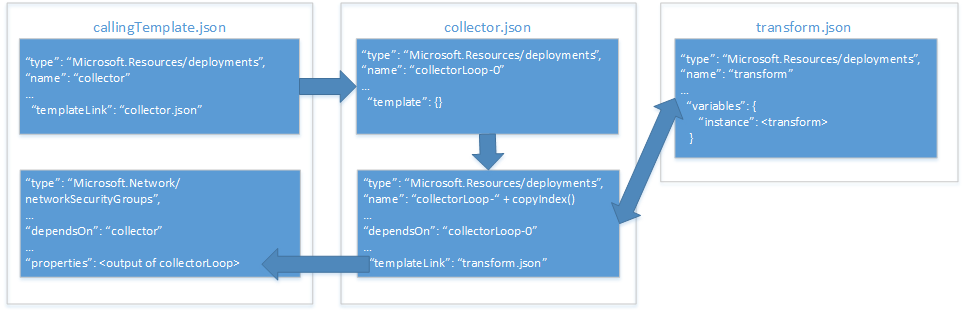

# <a name="implement-a-property-transformer-and-collector-in-an-azure-resource-manager-template"></a><span data-ttu-id="440bd-103">Implementar um transformador de propriedade e um coletor em um modelo do Azure Resource Manager</span><span class="sxs-lookup"><span data-stu-id="440bd-103">Implement a property transformer and collector in an Azure Resource Manager template</span></span>

<span data-ttu-id="440bd-104">Em [usar um objeto como um parâmetro em um modelo do Azure Resource Manager][objects-as-parameters], você aprendeu como armazenar valores de propriedade de recurso em um objeto e então aplicá-los a um recurso durante a implantação.</span><span class="sxs-lookup"><span data-stu-id="440bd-104">In [use an object as a parameter in an Azure Resource Manager template][objects-as-parameters], you learned how to store resource property values in an object and apply them to a resource during deployment.</span></span> <span data-ttu-id="440bd-105">Embora essa seja uma maneira muito útil para gerenciar os parâmetros, ainda exige que você mapear as propriedades do objeto para propriedades de recursos sempre que você pode usá-lo em seu modelo.</span><span class="sxs-lookup"><span data-stu-id="440bd-105">While this is a very useful way to manage your parameters, it still requires you to map the object's properties to resource properties each time you use it in your template.</span></span>

<span data-ttu-id="440bd-106">Para resolver esse problema, você pode implementar um modelo de transformação e um coletor de propriedade que itere sua matriz de objeto e a transforme no esquema JSON esperado pelo recurso.</span><span class="sxs-lookup"><span data-stu-id="440bd-106">To work around this, you can implement a property transform and collector template that iterates your object array and transforms it into the JSON schema expected by the resource.</span></span>

> [!IMPORTANT]
> <span data-ttu-id="440bd-107">Essa abordagem requer que você tenha uma compreensão profunda dos modelos e das funções do Resource Manager.</span><span class="sxs-lookup"><span data-stu-id="440bd-107">This approach requires that you have a deep understanding of Resource Manager templates and functions.</span></span>

<span data-ttu-id="440bd-108">Vamos dar uma olhada em como é possível implementar um coletor de propriedade e um transformador com um exemplo que implanta um [grupo de segurança de rede (NSG)][nsg].</span><span class="sxs-lookup"><span data-stu-id="440bd-108">Let's take a look at how we can implement a property collector and transformer with an example that deploys a [network security group (NSG)][nsg].</span></span> <span data-ttu-id="440bd-109">O diagrama a seguir mostra a relação entre os nossos modelos e nossos recursos dentro desses modelos:</span><span class="sxs-lookup"><span data-stu-id="440bd-109">The diagram below shows the relationship between our templates and our resources within those templates:</span></span>



<span data-ttu-id="440bd-111">Nosso **modelo de chamada** inclui dois recursos:</span><span class="sxs-lookup"><span data-stu-id="440bd-111">Our **calling template** includes two resources:</span></span>
* <span data-ttu-id="440bd-112">um link de modelo que invoca nosso **modelo de coletor**.</span><span class="sxs-lookup"><span data-stu-id="440bd-112">a template link that invokes our **collector template**.</span></span>
* <span data-ttu-id="440bd-113">o recurso NSG para implantar.</span><span class="sxs-lookup"><span data-stu-id="440bd-113">the NSG resource to deploy.</span></span>

<span data-ttu-id="440bd-114">Nosso **modelo de coletor** inclui dois recursos:</span><span class="sxs-lookup"><span data-stu-id="440bd-114">Our **collector template** includes two resources:</span></span>
* <span data-ttu-id="440bd-115">um recurso de **âncora**.</span><span class="sxs-lookup"><span data-stu-id="440bd-115">an **anchor** resource.</span></span>
* <span data-ttu-id="440bd-116">um link de modelo que invoca o modelo de transformação em um loop de cópia.</span><span class="sxs-lookup"><span data-stu-id="440bd-116">a template link that invokes the transform template in a copy loop.</span></span>

<span data-ttu-id="440bd-117">Nosso **modelo de transformação** inclui um único recurso: um modelo vazio com uma variável que transforma nosso JSON `source` no esquema JSON esperado por nosso recurso NSG no **modelo principal**.</span><span class="sxs-lookup"><span data-stu-id="440bd-117">Our **transform template** includes a single resource: an empty template with a variable that transforms our `source` JSON to the JSON schema expected by our NSG resource in the **main template**.</span></span>

## <a name="parameter-object"></a><span data-ttu-id="440bd-118">Objeto de parâmetro</span><span class="sxs-lookup"><span data-stu-id="440bd-118">Parameter object</span></span>

<span data-ttu-id="440bd-119">Usaremos nosso objeto de parâmetro `securityRules` de [objetos como parâmetros][objects-as-parameters].</span><span class="sxs-lookup"><span data-stu-id="440bd-119">We'll be using our `securityRules` parameter object from [objects as parameters][objects-as-parameters].</span></span> <span data-ttu-id="440bd-120">Nosso **modelo de transformação** transformará cada objeto na matriz de `securityRules` no esquema JSON esperado pelo recurso NSG em nosso **modelo de chamada**.</span><span class="sxs-lookup"><span data-stu-id="440bd-120">Our **transform template** will transform each object in the `securityRules` array into the JSON schema expected by the NSG resource in our **calling template**.</span></span>

```json
{
    "$schema": "https://schema.management.azure.com/schemas/2015-01-01/deploymentParameters.json#",
    "contentVersion": "1.0.0.0",
    "parameters":{ 
      "networkSecurityGroupsSettings": {
      "value": {
          "securityRules": [
            {
              "name": "RDPAllow",
              "description": "allow RDP connections",
              "direction": "Inbound",
              "priority": 100,
              "sourceAddressPrefix": "*",
              "destinationAddressPrefix": "10.0.0.0/24",
              "sourcePortRange": "*",
              "destinationPortRange": "3389",
              "access": "Allow",
              "protocol": "Tcp"
            },
            {
              "name": "HTTPAllow",
              "description": "allow HTTP connections",
              "direction": "Inbound",
              "priority": 200,
              "sourceAddressPrefix": "*",
              "destinationAddressPrefix": "10.0.1.0/24",
              "sourcePortRange": "*",
              "destinationPortRange": "80",
              "access": "Allow",
              "protocol": "Tcp"
            }
          ]
        }
      }
    }
  }
```

<span data-ttu-id="440bd-121">Vamos examinar nosso **modelo de transformação**.</span><span class="sxs-lookup"><span data-stu-id="440bd-121">Let's look at our **transform template** first.</span></span>

## <a name="transform-template"></a><span data-ttu-id="440bd-122">Modelo de Transformação</span><span class="sxs-lookup"><span data-stu-id="440bd-122">Transform template</span></span>

<span data-ttu-id="440bd-123">Nosso **modelo de transformação** inclui dois parâmetros que são passados do **modelo de coletor**:</span><span class="sxs-lookup"><span data-stu-id="440bd-123">Our **transform template** includes two parameters that are passed from the **collector template**:</span></span> 
* <span data-ttu-id="440bd-124">`source` é um objeto que recebe um dos objetos de valor de propriedade da matriz de propriedade.</span><span class="sxs-lookup"><span data-stu-id="440bd-124">`source` is an object that receives one of the property value objects from the property array.</span></span> <span data-ttu-id="440bd-125">Em nosso exemplo, cada objeto da matriz de `"securityRules"` será transmitido um de cada vez.</span><span class="sxs-lookup"><span data-stu-id="440bd-125">In our example, each object from the `"securityRules"` array will be passed in one at a time.</span></span>
* <span data-ttu-id="440bd-126">`state` é uma matriz que recebe os resultados concatenados de todas as transformações anteriores.</span><span class="sxs-lookup"><span data-stu-id="440bd-126">`state` is an array that receives the concatenated results of all the previous transforms.</span></span> <span data-ttu-id="440bd-127">Esta é a coleção do JSON transformado.</span><span class="sxs-lookup"><span data-stu-id="440bd-127">This is the collection of transformed JSON.</span></span>

<span data-ttu-id="440bd-128">Nossos parâmetros têm esta aparência:</span><span class="sxs-lookup"><span data-stu-id="440bd-128">Our parameters look like this:</span></span>

```json
{
  "$schema": "https://schema.management.azure.com/schemas/2015-01-01/deploymentTemplate.json#",
  "contentVersion": "1.0.0.0",
  "parameters": {
    "source": { "type": "object" },
    "state": {
      "type": "array",
      "defaultValue": [ ]
    }
  },
```

<span data-ttu-id="440bd-129">Nosso modelo também define uma variável denominada `instance`.</span><span class="sxs-lookup"><span data-stu-id="440bd-129">Our template also defines a variable named `instance`.</span></span> <span data-ttu-id="440bd-130">Ele executa a transformação real do nosso objeto `source` para o esquema JSON necessário:</span><span class="sxs-lookup"><span data-stu-id="440bd-130">It performs the actual transform of our `source` object into the required JSON schema:</span></span>

```json
  "variables": {
    "instance": [
      {
        "name": "[parameters('source').name]",
        "properties":{
            "description": "[parameters('source').description]",
            "protocol": "[parameters('source').protocol]",
            "sourcePortRange": "[parameters('source').sourcePortRange]",
            "destinationPortRange": "[parameters('source').destinationPortRange]",
            "sourceAddressPrefix": "[parameters('source').sourceAddressPrefix]",
            "destinationAddressPrefix": "[parameters('source').destinationAddressPrefix]",
            "access": "[parameters('source').access]",
            "priority": "[parameters('source').priority]",
            "direction": "[parameters('source').direction]"            
        }
      }
    ]

  },
```

<span data-ttu-id="440bd-131">Por fim, o `output` de nosso modelo concatena as transformações coletadas de nosso parâmetro `state` com a transformação atual executada pelo nossa variável `instance`:</span><span class="sxs-lookup"><span data-stu-id="440bd-131">Finally, the `output` of our template concatenates the collected transforms of our `state` parameter with the current transform performed by our `instance` variable:</span></span>

```json
    "resources": [],
    "outputs": {
    "collection": {
      "type": "array",
      "value": "[concat(parameters('state'), variables('instance'))]"
    }
```

<span data-ttu-id="440bd-132">Em seguida, vamos dar uma olhada no nosso **modelo de coletor** para ver como ele passa os valores de parâmetro.</span><span class="sxs-lookup"><span data-stu-id="440bd-132">Next, let's take a look at our **collector template** to see how it passes in our parameter values.</span></span>

## <a name="collector-template"></a><span data-ttu-id="440bd-133">Modelo de coletor</span><span class="sxs-lookup"><span data-stu-id="440bd-133">Collector template</span></span>

<span data-ttu-id="440bd-134">Nosso **modelo de coletor** inclui três parâmetros:</span><span class="sxs-lookup"><span data-stu-id="440bd-134">Our **collector template** includes three parameters:</span></span>
* <span data-ttu-id="440bd-135">`source` é nossa matriz de objetos de parâmetro completa.</span><span class="sxs-lookup"><span data-stu-id="440bd-135">`source` is our complete parameter object array.</span></span> <span data-ttu-id="440bd-136">Ele é passado pelo **modelo de chamada**.</span><span class="sxs-lookup"><span data-stu-id="440bd-136">It's passed in by the **calling template**.</span></span> <span data-ttu-id="440bd-137">Ele tem o mesmo nome que o parâmetro `source` no nosso **modelo de transformação**, mas há uma diferença importante que você já deve ter notado: essa é a matriz completa, mas nós só passamos um elemento dessa matriz para o **modelo de transformação** por vez.</span><span class="sxs-lookup"><span data-stu-id="440bd-137">This has the same name as the `source` parameter in our **transform template** but there is one key difference that you may have already noticed: this is the complete array, but we only pass one element of this array to the **transform template** at a time.</span></span>
* <span data-ttu-id="440bd-138">`transformTemplateUri` é o URI do nosso **modelo de transformação**.</span><span class="sxs-lookup"><span data-stu-id="440bd-138">`transformTemplateUri` is the URI of our **transform template**.</span></span> <span data-ttu-id="440bd-139">Nós o estamos definindo como um parâmetro aqui para a reutilização do modelo.</span><span class="sxs-lookup"><span data-stu-id="440bd-139">We're defining it as a parameter here for template reusability.</span></span>
* <span data-ttu-id="440bd-140">`state` é uma matriz inicialmente vazia que podemos passar para o nosso **modelo de transformação**.</span><span class="sxs-lookup"><span data-stu-id="440bd-140">`state` is an initially empty array that we pass to our **transform template**.</span></span> <span data-ttu-id="440bd-141">Quando o loop de cópia for concluído, ele armazenará a coleção de objetos de parâmetro transformados.</span><span class="sxs-lookup"><span data-stu-id="440bd-141">It stores the collection of transformed parameter objects when the copy loop is complete.</span></span>

<span data-ttu-id="440bd-142">Nossos parâmetros têm esta aparência:</span><span class="sxs-lookup"><span data-stu-id="440bd-142">Our parameters look like this:</span></span>

```json
  "parameters": {
    "source": { "type": "array" },
    "transformTemplateUri": { "type": "string" },
    "state": {
      "type": "array",
      "defaultValue": [ ]
    }
``` 

<span data-ttu-id="440bd-143">Em seguida, definimos uma variável chamada `count`.</span><span class="sxs-lookup"><span data-stu-id="440bd-143">Next, we define a variable named `count`.</span></span> <span data-ttu-id="440bd-144">Seu valor é o comprimento da matriz de objetos de parâmetro `source`:</span><span class="sxs-lookup"><span data-stu-id="440bd-144">Its value is the length of the `source` parameter object array:</span></span>

```json
  "variables": {
    "count": "[length(parameters('source'))]"
  },
```

<span data-ttu-id="440bd-145">Como você pode suspeitar, nós o usamos para o número de iterações em nosso loop de cópia.</span><span class="sxs-lookup"><span data-stu-id="440bd-145">As you might suspect, we use it for the number of iterations in our copy loop.</span></span>

<span data-ttu-id="440bd-146">Agora vamos dar uma olhada em nossos recursos.</span><span class="sxs-lookup"><span data-stu-id="440bd-146">Now let's take a look at our resources.</span></span> <span data-ttu-id="440bd-147">Definimos dois recursos:</span><span class="sxs-lookup"><span data-stu-id="440bd-147">We define two resources:</span></span>
* <span data-ttu-id="440bd-148">`loop-0` é o recurso com base em zero para o loop de cópia.</span><span class="sxs-lookup"><span data-stu-id="440bd-148">`loop-0` is the zero-based resource for our copy loop.</span></span>
* <span data-ttu-id="440bd-149">`loop-` é concatenado com o resultado da função `copyIndex(1)` para gerar um nome exclusivo baseado em iteração para nosso recurso, começando com `1`.</span><span class="sxs-lookup"><span data-stu-id="440bd-149">`loop-` is concatenated with the result of the `copyIndex(1)` function to generate a unique iteration-based name for our resource, starting with `1`.</span></span>

<span data-ttu-id="440bd-150">Nossos recursos têm esta aparência:</span><span class="sxs-lookup"><span data-stu-id="440bd-150">Our resources look like this:</span></span>

```json
  "resources": [
    {
      "type": "Microsoft.Resources/deployments",
      "apiVersion": "2015-01-01",
      "name": "loop-0",
      "properties": {
        "mode": "Incremental",
        "parameters": { },
        "template": {
          "$schema": "https://schema.management.azure.com/schemas/2015-01-01/deploymentTemplate.json#",
          "contentVersion": "1.0.0.0",
          "parameters": { },
          "variables": { },
          "resources": [ ],
          "outputs": {
            "collection": {
              "type": "array",
              "value": "[parameters('state')]"
            }
          }
        }
      }
    },
    {
      "type": "Microsoft.Resources/deployments",
      "apiVersion": "2015-01-01",
      "name": "[concat('loop-', copyindex(1))]",
      "copy": {
        "name": "iterator",
        "count": "[variables('count')]",
        "mode": "serial"
      },
      "dependsOn": [
        "loop-0"
      ],
      "properties": {
        "mode": "Incremental",
        "templateLink": { "uri": "[parameters('transformTemplateUri')]" },
        "parameters": {
          "source": { "value": "[parameters('source')[copyindex()]]" },
          "state": { "value": "[reference(concat('loop-', copyindex())).outputs.collection.value]" }
        }
      }
    }
  ],
```

<span data-ttu-id="440bd-151">Vamos examinar mais detalhadamente os parâmetros que estamos passando para nosso **modelo de transformação** no modelo aninhado.</span><span class="sxs-lookup"><span data-stu-id="440bd-151">Let's take a closer look at the parameters we're passing to our **transform template** in the nested template.</span></span> <span data-ttu-id="440bd-152">Você se lembra de que nosso parâmetro `source` passa o objeto atual na matriz de objetos de parâmetro `source`.</span><span class="sxs-lookup"><span data-stu-id="440bd-152">Recall from earlier that our `source` parameter passes the current object in the `source` parameter object array.</span></span> <span data-ttu-id="440bd-153">O parâmetro `state` é onde ocorre a coleção, pois obtém a saída da iteração anterior do nosso loop de cópia&mdash;observe que a função `reference()` usa a função `copyIndex()` sem nenhum parâmetro para fazer referência a `name` de nosso objeto de modelo vinculado anterior&mdash;e passa a iteração atual.</span><span class="sxs-lookup"><span data-stu-id="440bd-153">The `state` parameter is where the collection happens, because it takes the output of the previous iteration of our copy loop&mdash;notice that the `reference()` function uses the `copyIndex()` function with no parameter to reference the `name` of our previous linked template object&mdash;and passes it to the current iteration.</span></span>

<span data-ttu-id="440bd-154">Por fim, o `output` de nosso modelo retorna o `output` da última iteração de nosso **modelo de transformação**:</span><span class="sxs-lookup"><span data-stu-id="440bd-154">Finally, the `output` of our template returns the `output` of the last iteration of our **transform template**:</span></span>

```json
  "outputs": {
    "result": {
      "type": "array",
      "value": "[reference(concat('loop-', variables('count'))).outputs.collection.value]"
    }
  }
```
<span data-ttu-id="440bd-155">Pode parecer contraintuitivo retornar o `output` da última iteração de nosso **modelo de transformação** para nosso **modelo de chamada** porque ele apareceu quando estávamos armazenando-o em nosso parâmetro `source`.</span><span class="sxs-lookup"><span data-stu-id="440bd-155">It may seem counterintuitive to return the `output` of the last iteration of our **transform template** to our **calling template** because it appeared we were storing it in our `source` parameter.</span></span> <span data-ttu-id="440bd-156">No entanto, lembre-se de que é a última iteração do nosso **modelo de transformação** que contém a matriz completa de objetos de propriedade transformados e que é o que queremos retornar.</span><span class="sxs-lookup"><span data-stu-id="440bd-156">However, remember that it's the last iteration of our **transform template** that holds the complete array of transformed property objects, and that's what we want to return.</span></span>

<span data-ttu-id="440bd-157">Por fim, vamos dar uma olhada em como chamar o **modelo de coletor** do nosso **modelo de chamada**.</span><span class="sxs-lookup"><span data-stu-id="440bd-157">Finally, let's take a look at how to call the **collector template** from our **calling template**.</span></span>

## <a name="calling-template"></a><span data-ttu-id="440bd-158">Modelo de chamada</span><span class="sxs-lookup"><span data-stu-id="440bd-158">Calling template</span></span>

<span data-ttu-id="440bd-159">Nosso **modelo de chamada** define um parâmetro único chamado `networkSecurityGroupsSettings`:</span><span class="sxs-lookup"><span data-stu-id="440bd-159">Our **calling template** defines a single parameter named `networkSecurityGroupsSettings`:</span></span>

```json
...
"parameters": {
    "networkSecurityGroupsSettings": {
        "type": "object"
    }
```

<span data-ttu-id="440bd-160">Em seguida, nosso modelo define uma variável denominada `collectorTemplateUri`:</span><span class="sxs-lookup"><span data-stu-id="440bd-160">Next, our template defines a single variable named `collectorTemplateUri`:</span></span>

```json
"variables": {
    "collectorTemplateUri": "[uri(deployment().properties.templateLink.uri, 'collector.template.json')]"
  }
```

<span data-ttu-id="440bd-161">Como se esperaria, esse é o URI para o **modelo de coletor** que será usado pelo nosso recurso de modelo vinculado:</span><span class="sxs-lookup"><span data-stu-id="440bd-161">As you would expect, this is the URI for the **collector template** that will be used by our linked template resource:</span></span>

```json
{
    "apiVersion": "2015-01-01",
    "name": "collector",
    "type": "Microsoft.Resources/deployments",
    "properties": {
        "mode": "Incremental",
        "templateLink": {
            "uri": "[variables('collectorTemplateUri')]",
            "contentVersion": "1.0.0.0"
        },
        "parameters": {
            "source" : {"value": "[parameters('networkSecurityGroupsSettings').securityRules]"},
            "transformTemplateUri": { "value": "[uri(deployment().properties.templateLink.uri, 'transform.json')]"}
        }
    }
}
```

<span data-ttu-id="440bd-162">Passamos dois parâmetros para o **modelo de coletor**:</span><span class="sxs-lookup"><span data-stu-id="440bd-162">We pass two parameters to the **collector template**:</span></span>
* <span data-ttu-id="440bd-163">`source` é a nossa matriz de objetos de propriedade.</span><span class="sxs-lookup"><span data-stu-id="440bd-163">`source` is our property object array.</span></span> <span data-ttu-id="440bd-164">Em nosso exemplo, ele é nosso parâmetro `networkSecurityGroupsSettings`.</span><span class="sxs-lookup"><span data-stu-id="440bd-164">In our example, it's our `networkSecurityGroupsSettings` parameter.</span></span>
* <span data-ttu-id="440bd-165">`transformTemplateUri` é a variável que acabamos de definir com o URI do nosso **modelo de coletor**.</span><span class="sxs-lookup"><span data-stu-id="440bd-165">`transformTemplateUri` is the variable we just defined with the URI of our **collector template**.</span></span>

<span data-ttu-id="440bd-166">Por fim, nosso recurso `Microsoft.Network/networkSecurityGroups` atribui diretamente o `output` do `collector` vinculado o recurso de modelo para sua propriedade `securityRules`:</span><span class="sxs-lookup"><span data-stu-id="440bd-166">Finally, our `Microsoft.Network/networkSecurityGroups` resource directly assigns the `output` of the `collector` linked template resource to its `securityRules` property:</span></span>

```json
    {
      "apiVersion": "2015-06-15",
      "type": "Microsoft.Network/networkSecurityGroups",
      "name": "networkSecurityGroup1",
      "location": "[resourceGroup().location]",
      "properties": {
        "securityRules": "[reference('collector').outputs.result.value]"
      }
    }
  ],
  "outputs": {
      "instance":{
          "type": "array",
          "value": "[reference('collector').outputs.result.value]"
      }

  }
```

## <a name="try-the-template"></a><span data-ttu-id="440bd-167">Experimentar o modelo</span><span class="sxs-lookup"><span data-stu-id="440bd-167">Try the template</span></span>

<span data-ttu-id="440bd-168">Um modelo de exemplo está disponível no [GitHub][github].</span><span class="sxs-lookup"><span data-stu-id="440bd-168">An example template is available on [GitHub][github].</span></span> <span data-ttu-id="440bd-169">Para implantar o modelo, clone o repositório e execute os seguintes comandos da [CLI do Azure][cli]:</span><span class="sxs-lookup"><span data-stu-id="440bd-169">To deploy the template, clone the repo and run the following [Azure CLI][cli] commands:</span></span>

```bash
git clone https://github.com/mspnp/template-examples.git
cd template-examples/example4-collector
az group create --location <location> --name <resource-group-name>
az group deployment create -g <resource-group-name> \
    --template-uri https://raw.githubusercontent.com/mspnp/template-examples/master/example4-collector/deploy.json \
    --parameters deploy.parameters.json
```

<!-- links -->
[objects-as-parameters]: ./objects-as-parameters.md
[resource-manager-linked-template]: /azure/azure-resource-manager/resource-group-linked-templates
[resource-manager-variables]: /azure/azure-resource-manager/resource-group-template-functions-deployment
[nsg]: /azure/virtual-network/virtual-networks-nsg
[cli]: /cli/azure/?view=azure-cli-latest
[github]: https://github.com/mspnp/template-examples
