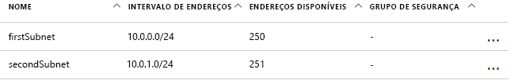
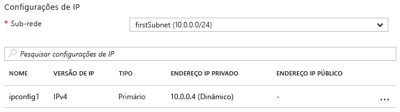

# <a name="update-a-resource-in-an-azure-resource-manager-template"></a>Atualizar um recurso em um modelo do Azure Resource Manager

Existem alguns cenários nos quais você precisa atualizar um recurso durante a implantação. Você pode encontrar esse cenário quando não é possível especificar todas as propriedades de um recurso até que outros recursos dependentes sejam criados. Por exemplo, se você criar um pool de back-end para um balanceador de carga, poderá atualizar as NICs (adaptadores de rede) nas VMs (máquinas virtuais) para incluí-las no pool de back-end. E, embora o Resource Manager dê suporte à atualização de recursos durante a implantação, é necessário projetar o modelo corretamente para evitar erros e garantir que a implantação é tratada como uma atualização.

Primeiro, é necessário referenciar o recurso uma vez no modelo para criá-lo e então referenciar o recurso com o mesmo nome para atualizá-lo mais tarde. No entanto, se dois recursos tiverem o mesmo nome em um modelo, o Resource Manager gerará uma exceção. Para evitar esse erro, especifique o recurso atualizado em um segundo modelo que está vinculado ou incluído como um submodelo usando o tipo de recurso `Microsoft.Resources/deployments`.

Em segundo lugar, você deve especificar o nome da propriedade existente a ser alterado ou um novo nome de uma propriedade a ser adicionado ao modelo aninhado. Você também deve especificar as propriedades originais e seus valores originais. Se você não fornecer as propriedades e os valores originais, o Resource Manager considerará que você deseja criar um novo recurso e excluirá o recurso original.

## <a name="example-template"></a>Modelo de exemplo

Vamos examinar um modelo de exemplo que demonstra isso. Nosso modelo implanta uma rede virtual chamada `firstVNet` que tem uma sub-rede chamada `firstSubnet`. Em seguida, ele implanta uma NIC (interface de rede virtual) chamada `nic1` e a associa à nossa sub-rede. Em seguida, um recurso de implantação denominado `updateVNet` inclui um modelo aninhado que atualiza nosso recurso `firstVNet` ao adicionar uma segunda sub-rede denominada `secondSubnet`.

```json
{
  "$schema": "https://schema.management.azure.com/schemas/2015-01-01/deploymentTemplate.json#",
  "contentVersion": "1.0.0.0",
  "parameters": {},
  "resources": [
      {
      "apiVersion": "2016-03-30",
      "name": "firstVNet",
      "location":"[resourceGroup().location]",
      "type": "Microsoft.Network/virtualNetworks",
      "properties": {
          "addressSpace":{"addressPrefixes": [
              "10.0.0.0/22"
          ]},
          "subnets":[
              {
                  "name":"firstSubnet",
                  "properties":{
                    "addressPrefix":"10.0.0.0/24"
                  }
              }
            ]
      }
    },
    {
        "apiVersion": "2015-06-15",
        "type":"Microsoft.Network/networkInterfaces",
        "name":"nic1",
        "location":"[resourceGroup().location]",
        "dependsOn": [
            "firstVNet"
        ],
        "properties": {
            "ipConfigurations":[
                {
                    "name":"ipconfig1",
                    "properties": {
                        "privateIPAllocationMethod":"Dynamic",
                        "subnet": {
                            "id": "[concat(resourceId('Microsoft.Network/virtualNetworks','firstVNet'),'/subnets/firstSubnet')]"
                        }
                    }
                }
            ]
        }
    },
    {
      "apiVersion": "2015-01-01",
      "type": "Microsoft.Resources/deployments",
      "name": "updateVNet",
      "dependsOn": [
          "nic1"
      ],
      "properties": {
        "mode": "Incremental",
        "parameters": {},
        "template": {
          "$schema": "https://schema.management.azure.com/schemas/2015-01-01/deploymentTemplate.json#",
          "contentVersion": "1.0.0.0",
          "parameters": {},
          "variables": {},
          "resources": [
              {
                  "apiVersion": "2016-03-30",
                  "name": "firstVNet",
                  "location":"[resourceGroup().location]",
                  "type": "Microsoft.Network/virtualNetworks",
                  "properties": {
                      "addressSpace": "[reference('firstVNet').addressSpace]",
                      "subnets":[
                          {
                              "name":"[reference('firstVNet').subnets[0].name]",
                              "properties":{
                                  "addressPrefix":"[reference('firstVNet').subnets[0].properties.addressPrefix]"
                                  }
                          },
                          {
                              "name":"secondSubnet",
                              "properties":{
                                  "addressPrefix":"10.0.1.0/24"
                                  }
                          }
                     ]
                  }
              }
          ],
          "outputs": {}
          }
        }
    }
  ],
  "outputs": {}
}
```

Vamos dar uma olhada no objeto de recurso de nosso recurso `firstVNet` primeiro. Observe que especificamos as configurações para nosso `firstVNet` em um modelo aninhado&mdash;. Isso ocorre porque o Resource Manager não permite que o mesmo nome de implantação no mesmo modelo e modelos aninhados são considerados como um modelo diferente. Ao especificarmos nossos valores para o nosso recurso `firstSubnet`, estamos informando o Resource Manager para atualizar o recurso existente em vez de excluí-lo e reimplantá-lo. Por fim, nossas novas configurações para `secondSubnet` são selecionadas durante essa atualização.

## <a name="try-the-template"></a>Experimentar o modelo

Um modelo de exemplo está disponível no [GitHub][github]. Para implantar o modelo, execute os seguintes comandos da [CLI do Azure][cli]:

```bash
az group create --location <location> --name <resource-group-name>
az group deployment create -g <resource-group-name> \
    --template-uri https://raw.githubusercontent.com/mspnp/template-examples/master/example1-update/deploy.json
```

Depois que a implantação for concluída, abra o grupo de recursos que você especificou no portal. Você vê uma rede virtual denominada `firstVNet` e uma NIC denominada `nic1`. Clique em `firstVNet` e, depois, em `subnets`. Você verá a `firstSubnet` que foi originalmente criada e a `secondSubnet` que foi adicionada ao recurso `updateVNet`.



Depois, retorne ao grupo de recursos e clique em `nic1`. Em seguida, clique em `IP configurations`. Na seção `IP configurations`, a `subnet` é definida como `firstSubnet (10.0.0.0/24)`.



A `firstVNet` original foi atualizada em vez de recriada. Se `firstVNet` tivesse sido recriada, a `nic1` não seria associada a `firstVNet`.

## <a name="next-steps"></a>Próximas etapas

* Saiba como implantar um recurso com base em uma condição, como se um valor de parâmetro estivesse presente. Confira [Implantar condicionalmente um recurso em um modelo do Azure Resource Manager](./conditional-deploy.md).

[cli]: /cli/azure/?view=azure-cli-latest
[github]: https://github.com/mspnp/template-examples
