# Guia de design de governança: novo desenvolvimento no Azure para várias equipesGovernance design guide: new development in Azure for multiple teams

O objetivo deste guia é ajudar você a aprender o processo para criar um modelo de controle de recursos no Azure.The goal of this guidance is to help you learn the process for designing a resource governance model in Azure.  Nós irá examinar um conjunto de requisitos de governança hipotético e passar por várias implementações de exemplo que atendem a esses requisitos.We'll look at a set of hypothetical governance requirements, then go through several example implementations that satisfy those requirements. 

Nossos requisitos são:Our requirements are:
* Gerenciamento de identidade para várias equipes com requisitos de acesso de recursos diferentes no Azure.Identity management for multiple teams with different resource access requirements in Azure. O sistema de gerenciamento de identidades armazena a identidade dos seguintes usuários:The identity management system stores the identity of the following users:
  1. A pessoa em nossa organização responsável pela propriedade de **assinaturas**.The individual in our organization responsible for ownership of **subscriptions**.
  2. O indivíduo em nossa organização responsável pelo **infraestrutura recursos compartilhados** usada para se conectar a rede local a uma rede virtual do Azure.The individual in our organization responsible for the **shared infrastructure resources** used to connect our on-premises network to an Azure virtual network. 
  3. Duas pessoas em nossa organização responsáveis pelo gerenciamento de uma **carga de trabalho**.Two individuals in our organization responsible for managing a **workload**. 
* Suporte para vários **ambientes**.Support for multiple **environments**. Como você aprendeu anteriormente, um ambiente é um agrupamento lógico de recursos com requisitos de segurança e gerenciamento semelhante.As you learned earlier, an environment is a logical grouping of resources with similar management and security requirements. São necessários três ambientes:We require three environments:
  1. Um **ambiente de infraestrutura compartilhada** que inclui recursos compartilhados por cargas de trabalho em outros ambientes.A **shared infrastructure environment** that includes resources shared by workloads in other environments. Por exemplo, uma rede virtual com uma sub-rede do gateway que fornece conectividade para locais.For example, a virtual network with a gateway subnet that provides connectivity to on-premises.
  2. Um **ambiente de produção** com as políticas de segurança mais restritivas.A **production environment** with the most restrictive security policies. Pode incluir cargas de trabalho voltadas para o ambiente interno ou externo.May include internal or external facing workloads.
  3. Um **ambiente de desenvolvimento** para o trabalho de verificação de conceito e teste.A **development environment** for proof-of-concept and testing work. Esse ambiente tem políticas de segurança, conformidade e custo que diferem no ambiente de produção.This environment has security, compliance, and cost policies that differ from those in the production environment.
* Um **modelo de permissões de privilégio mínimo** no qual os usuários não têm permissões por padrão.A **permissions model of least privilege** in which users have no permissions by default. O modelo deve oferecer suporte ao seguinte:The model must support the following:
  * Um único usuário confiável no escopo de assinatura com permissão para atribuir direitos de acesso de recursos.A single trusted user at the subscription scope with permission to assign resource access rights.
  * Por padrão, todos os proprietários de carga de trabalho têm seu acesso negado aos recursos.Each workload owner is denied access to resources by default. Os direitos de acesso do recurso são concedidos explicitamente pelo usuário único confiável no escopo da assinatura.Resource access rights are granted explicitly by the single trusted user at the subscription scope.
  * Acesso de gerenciamento para os recursos de infraestrutura compartilhada limitado ao proprietário da infraestrutura compartilhada.Management access for the shared infrastructure resources limited to the shared infrastructure owner.  
  * Acesso de gerenciamento para cada carga de trabalho restrito ao proprietário da carga de trabalho.Management access for each workload restricted to the workload owner.
  * Uso restrito a [funções internas de RBAC][rbac-built-in-roles].Use of [built-in RBAC roles][rbac-built-in-roles] only. Nenhuma função RBAC personalizada.No custom RBAC roles.
* Custo de controle por nome de proprietário de carga de trabalho, ambiente ou ambos.Cost tracking by workload owner name, environment, or both. 

## Gerenciamento de identidadesIdentity management

Antes de podermos projetar o gerenciamento de identidades para nosso modelo de controle, é importante entender as quatro áreas principais que englobam:Before we can design identity management for our governance model, it's important to understand the four major areas it encompasses:

* Administração: os processos e as ferramentas para criação, edição e exclusão de identidade do usuário.Administration: the processes and tools for creating, editing, and deleting user identity.
* Autenticação: verificando a identidade do usuário por meio da validação de credenciais, como um nome de usuário e senha.Authentication: verifying user identity by validating credentials, such as a user name and password.
* Autorização: determinar os recursos que um usuário autenticado tem permissão para acesso ou as operações que eles têm permissão para executar.Authorization: determining which resources an authenticated user is allowed to access or what operations they have permission to perform.
* Auditoria: examinar periodicamente os logs e outras informações para descobrir problemas de segurança relacionados à identidade do usuário.Auditing: periodically reviewing logs and other information to discover security issues related to user identity. Isso inclui a revisão de padrões de uso suspeito, periodicamente revisando as permissões de usuário para verificar se que elas estão corretas e outras funções.This includes reviewing suspicious usage patterns, periodically reviewing user permissions to verify they are accurate, and other functions.

Há apenas um serviço confiável para o Azure para identidade, que é o Azure AD (Active Directory).There is only one service trusted by Azure for identity, and that is Azure Active Directory (AD). Vamos ser adicionar usuários ao Azure AD e usá-lo para todas as funções listadas acima.We'll be adding users to Azure AD and using it for all of the functions listed above. Mas, antes de examinarmos como configuraremos Azure AD, é importante entender as contas com privilégios que são usadas para gerenciar o acesso a esses serviços.But before we look at how we'll configure Azure AD, it's important to understand the privileged accounts that are used to manage access to these services.

Quando sua organização se inscreveu para uma conta do Azure, pelo menos um Azure **proprietário da conta** foi atribuído e do Azure AD **locatário** foi criado se já não havia um locatário do Azure AD associado à sua uso de organização de outros serviços da Microsoft como o Office 365.When your organization signed up for an Azure account, at least one Azure **account owner** was assigned and an Azure AD **tenant** was created if there was not already an Azure AD tenant associated with your organization's use of other Microsoft services such as Office 365. Um **administrador global** com permissões totais no locatário do Azure AD estava associado quando ele foi criado.A **global administrator** with full permissions on the Azure AD tenant was associated when it was created. 

Ambas as identidades de usuário de administrador global do proprietário da conta do Azure e o Azure AD são armazenadas em um sistema de identidade altamente seguro que é gerenciado pela Microsoft.Both of the Azure Account Owner and Azure AD global administrator user identities are stored in a highly secure identity system that is managed by Microsoft. O proprietário da conta do Azure está autorizado a criar, atualizar e excluir assinaturas.The Azure Account Owner is authorized to create, update, and delete subscriptions. O administrador global do Azure AD está autorizado a realizar várias ações no Azure AD, mas para este guia de design vamos nos concentrar na criação e exclusão de identidade de usuário.The Azure AD global administrator is authorized to perform many actions in Azure AD, but for this design guide we'll focus on the creation and deletion of user identity. 

> [!NOTE]
> Sua organização talvez já tenha um locatário existente do Azure AD, se houver um existente do Office 365 ou a licença do Intune associada à sua conta.Your organization may already have an existing Azure AD tenant if there's an existing Office 365 or Intune license associated with your account.

O proprietário da conta do Azure tem permissão para criar, atualizar e excluir assinaturas:The Azure Account Owner has permission to create, update, and delete subscriptions: 

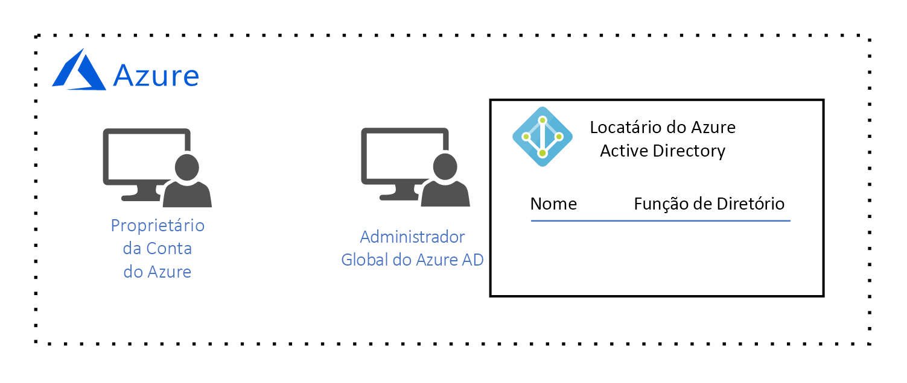
*Figura 1. Uma conta do Azure com um gerente de conta e o Administrador Global do Azure AD.*
*Figure 1. An Azure account with an Account Manager and Azure AD Global Administrator.*

O **administrador global** do Azure AD tem permissão para criar contas de usuário:The Azure AD **global administrator** has permission to create user accounts:  

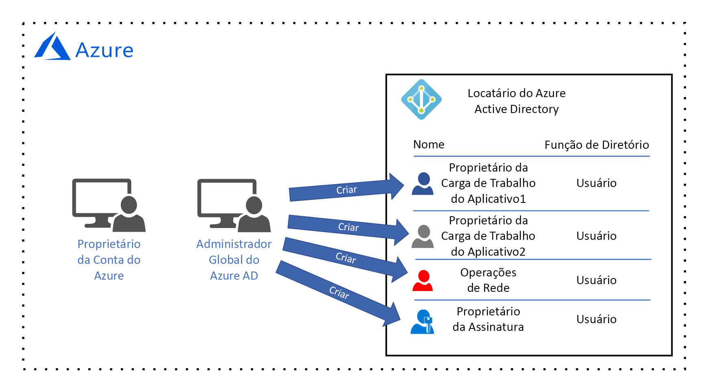
*Figura 2. O Administrador Global do Azure AD cria as contas de usuário necessárias no locatário.*
*Figure 2. The Azure AD Global Administrator creates the required user accounts in the tenant.*

As duas primeiras contas, **proprietário de carga de trabalho do app1** e **proprietário de carga de trabalho do app2** são associadas a um indivíduo em nossa organização responsável por gerenciar uma carga de trabalho.The first two accounts, **App1 Workload Owner** and **App2 Workload Owner** are each associated with an individual in our organization responsible for managing a workload. A conta **operações de rede** pertence à pessoa responsável pelos recursos de infraestrutura compartilhada.The **network operations** account is owned by the individual that is responsible for the shared infrastructure resources. Por fim, a conta do **proprietário da assinatura** está associada à pessoa responsável pela propriedade de assinaturas.Finally, the **subscription owner** account is associated with the individual responsible for ownership of subscriptions.

## Modelo de permissões de acesso do recurso de privilégio mínimoResource access permissions model of least privilege

Agora que temos nosso sistema de gerenciamento de identidades e contas de usuário criadas, precisamos decidir como podemos aplicará funções RBAC (controle) de acesso baseado em função para cada conta para dar suporte a um modelo de permissões de menos privilégios.Now that we have our identity management system and user accounts created, we have to decide how we'll apply role-based access control (RBAC) roles to each account to support a permissions model of least privilege.

Nosso outro requisito é para os recursos associados a cada carga de trabalho ser isoladas umas das outras, de modo que nenhum proprietário de uma carga de trabalho tem acesso de gerenciamento para qualquer outra carga de trabalho que não possuem.Our other requirement is for the resources associated with each workload be isolated from one another such that no one workload owner has management access to any other workload they do not own. Temos um requisito para implementar esse modelo usando somente [funções internas para o RBAC do Azure][rbac-built-in-roles].We have a requirement to implement this model using only [built-in roles for Azure RBAC][rbac-built-in-roles].

Cada função RBAC é aplicada em um dos três escopos no Azure: **assinatura**, **grupo de recursos**, em seguida, um **recurso** individual.Each RBAC role is applied at one of three scopes in Azure: **subscription**, **resource group**, then an individual **resource**. As funções são herdadas em escopos inferiores.Roles are inherited at lower scopes. Por exemplo, se um usuário é atribuído a [função proprietário interno] [ rbac-built-in-owner] no nível de assinatura, essa função também foi atribuída a esse usuário no grupo de recursos e no nível de recurso individual, a menos que ele seja substituído.For example, if a user is assigned the [built-in owner role][rbac-built-in-owner] at the subscription level, that role is also assigned to that user at the resource group and individual resource level unless it's overridden.

Portanto, para criar um modelo de acesso de privilégio mínimo, é necessário decidir as ações que um tipo específico de usuário pode realizar em cada um desses três escopos.Therefore, to create a model of least privilege access we have to decide the actions a particular type of user is allowed to take at each of these three scopes. Por exemplo, nosso requisito é para um proprietário de carga de trabalho tem permissão para gerenciar o acesso a somente os recursos associados à sua carga de trabalho e nenhum outro.For example, our requirement is for a workload owner to have permission to manage access to only the resources associated with their workload and no others. Se tivéssemos atribuir a [função de proprietário interna][rbac-built-in-owner] no escopo de assinatura, o proprietário de cada carga de trabalho teria acesso de gerenciamento para todas as cargas de trabalho.If we were to assign the [built-in owner role][rbac-built-in-owner] at the subscription scope, each workload owner would have management access to all workloads.

Vamos dar uma olhada em dois modelos de permissão de exemplo para entender esse conceito um pouco melhor.Let's take a look at two example permission models to understand this concept a little better. No primeiro exemplo, nosso modelo confia somente no administrador de serviço para criar grupos de recursos.In the first example, our model trusts only the service administrator to create resource groups. No segundo exemplo, nosso modelo atribui a função de proprietário interno para o proprietário de cada carga de trabalho no escopo da assinatura.In the second example, our model assigns the built-in owner role to each workload owner at the subscription scope. 

Nos dois exemplos, temos um administrador de serviço de assinatura que é atribuído a [função proprietário interno][rbac-built-in-owner] no escopo de assinatura.In both examples, we have a subscription service administrator that is assigned the [built-in owner role][rbac-built-in-owner] at the subscription scope. Lembre-se de que a [função de proprietário interna][rbac-built-in-owner] concede todas as permissões, incluindo o gerenciamento de acesso aos recursos.Recall that the [built-in owner role][rbac-built-in-owner] grants all permissions including the management of access to resources.
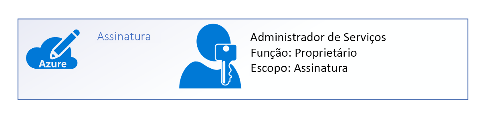
*Figura 3. Uma assinatura com um administrador de serviços atribuídos à função de proprietário interno.*
*Figure 3. A subscription with a service administrator assigned the built-in owner role.* 

1. No primeiro exemplo, temos **proprietário da carga de trabalho A** com nenhuma permissões no escopo de assinatura - tiverem sem direitos de gerenciamento de acesso de recursos por padrão.In our first example, we have **workload owner A** with no permissions at the subscription scope - they have no resource access management rights by default. Esse usuário deseja implantar e gerenciar os recursos para sua carga de trabalho.This user wants to deploy and manage the resources for their workload. Eles devem contatar o **administrador de serviço** para solicitar a criação de um grupo de recursos.They must contact the **service administrator** to request creation of a resource group.
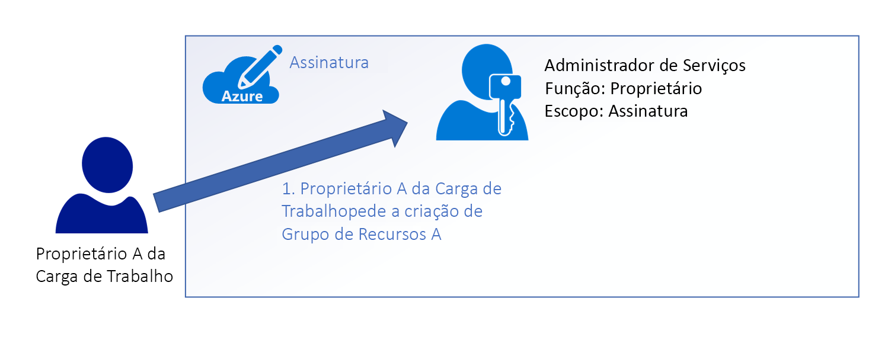  

2. O **administrador de serviço** examina a solicitação e cria o **grupo de recursos A**. Neste ponto, o **proprietário da carga de trabalho A** ainda não tem permissão para fazer nada.The **service administrator** reviews their request and creates **resource group A**. At this point, **workload owner A** still doesn't have permission to do anything.

3. O **administrador de serviço** adiciona **proprietário da carga de trabalho A** para **do grupo de recursos A** e atribui o [função colaborador interna](/azure/role-based-access-control/built-in-roles#contributor).The **service administrator** adds **workload owner A** to **resource group A** and assigns the [built-in contributor role](/azure/role-based-access-control/built-in-roles#contributor). A função de colaborador concede todas as permissões no **grupo de recursos A**, exceto o gerenciamento de permissão de acesso.The contributor role grants all permissions on **resource group A** except managing access permission.
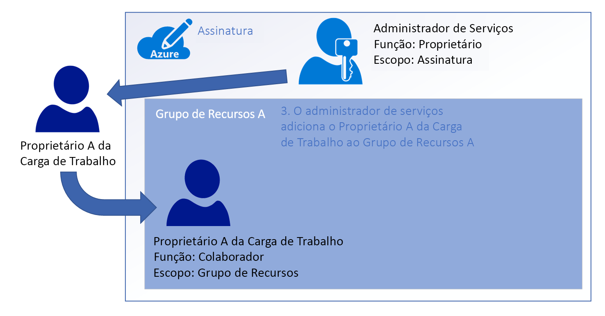

4. Vamos supor que o **proprietário da carga de trabalho A** tenha um requisito para um par de membros da equipe para exibir o tráfego de rede e CPU dados como parte do planejamento de capacidade para a carga de trabalho de monitoramento.Let's assume that **Workload owner A** has a requirement for a pair of team members to view the CPU and network traffic monitoring data as part of capacity planning for the workload. Como o **proprietário da carga de trabalho A** é atribuído à função de colaborador, ele não tem permissão para adicionar um usuário ao **grupo de recursos A**. Eles devem enviar esta solicitação para o **administrador de serviços**.Because **workload owner A** is assigned the contributor role, they do not have permission to add a user to **resource group A**. They must send this request to the **service administrator**.
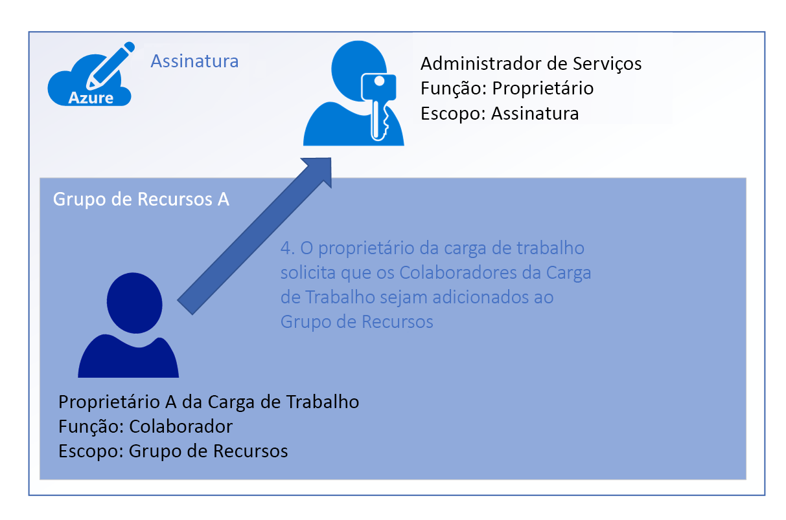

5. O **administrador de serviço** examina a solicitação e adiciona os dois **colaborador da carga de trabalho** usuários **do grupo de recursos A**. Nenhum desses dois usuários exige a permissão para gerenciar recursos, portanto, eles recebem a [função de leitor interna](/azure/role-based-access-control/built-in-roles#contributor).The **service administrator** reviews the request, and adds the two **workload contributor** users to **resource group A**. Neither of these two users require permission to manage resources, so they are assigned the [built-in reader role](/azure/role-based-access-control/built-in-roles#contributor). 
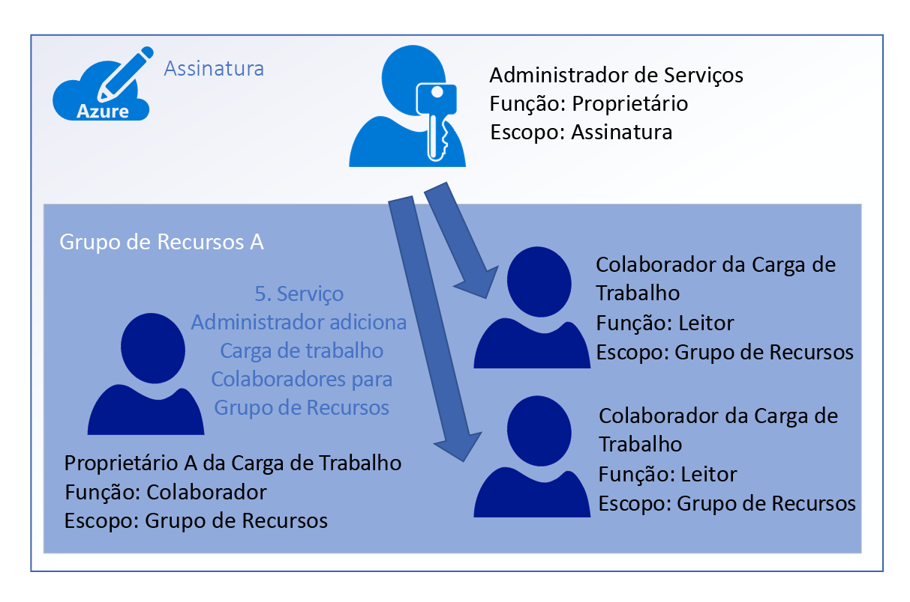

6. Em seguida, o **proprietário da carga de trabalho B** também requer um grupo de recursos conter os recursos para sua carga de trabalho.Next, **workload owner B** also requires a resource group to contain the resources for their workload. Assim como acontece com **proprietário da carga de trabalho A**, **proprietário da carga de trabalho B** inicialmente não tem permissão para realizar qualquer ação no escopo de assinatura para que eles devem enviar uma solicitação para o **administrador de serviços**.As with **workload owner A**, **workload owner B** initially does not have permission to take any action at the subscription scope so they must send a request to the **service administrator**. 
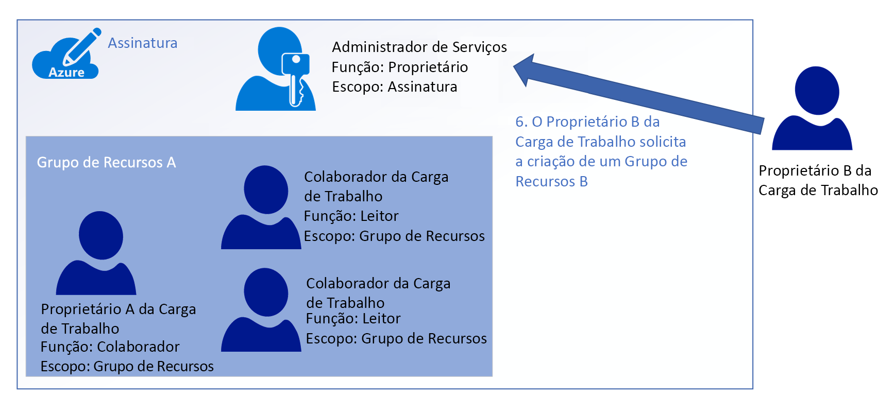

7. O **administrador de serviço** examina a solicitação e cria o **grupo de recursos B**. 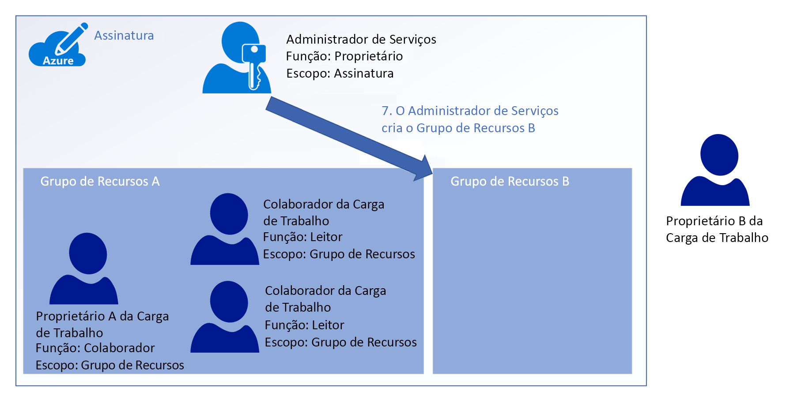The **service administrator** reviews the request and creates **resource group B**. 

8. O **administrador de serviço** então adiciona o **proprietário da carga de trabalho B** ao **grupo de recursos B** e atribui a [função colaborador interna](https://docs.microsoft.com/en-us/azure/role-based-access-control/built-in-roles#contributor).The **service administrator** then adds **workload owner B** to **resource group B** and assigns the [built-in contributor role](https://docs.microsoft.com/en-us/azure/role-based-access-control/built-in-roles#contributor). 
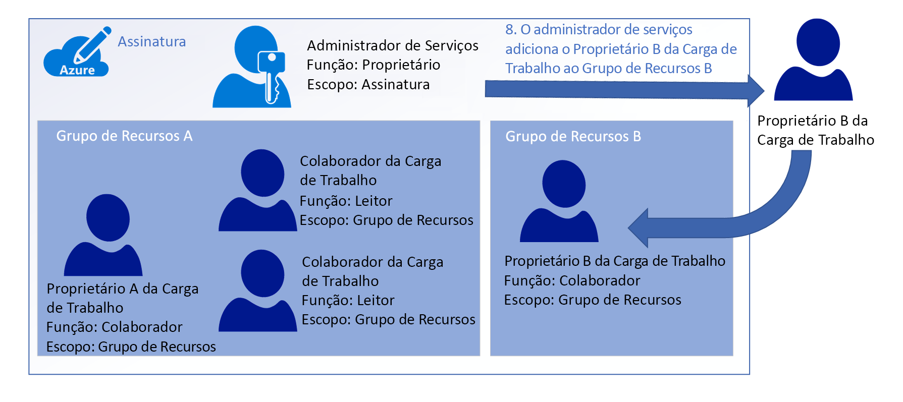

Neste ponto, cada um dos proprietários da carga de trabalho é isolado em seu próprio grupo de recursos.At this point, each of the workload owners is isolated in their own resource group. Nenhum dos proprietários da carga de trabalho ou membros da equipe tem acesso de gerenciamento para os recursos em outro grupo de recursos.None of the workload owners or their team members have management access to the resources in any other resource group. 

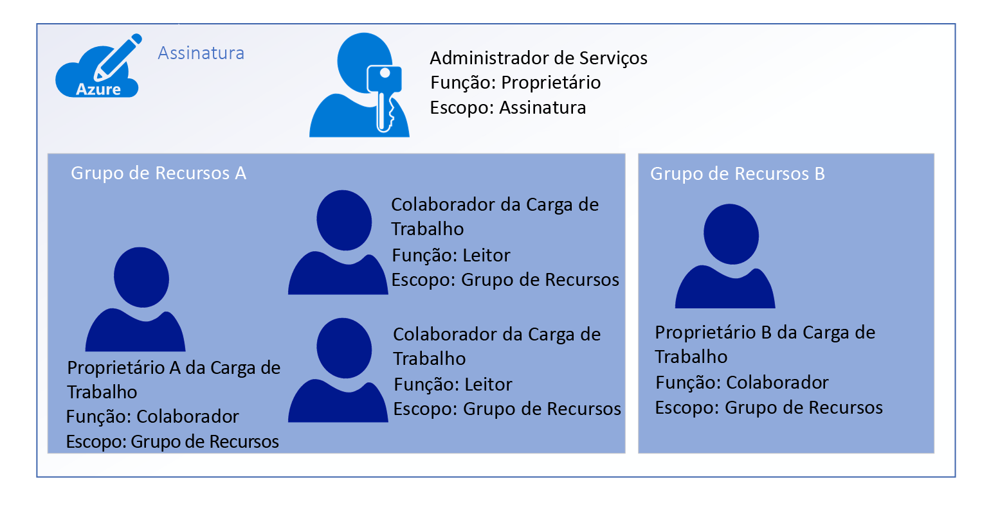
*Figura 4. Uma assinatura com dois proprietários da carga de trabalho isolada com seu próprio grupo de recursos.*
*Figure 4. A subscription with two workload owners isolated with their own resource group.*

Este é um modelo de privilégio mínimo - cada usuário recebe a permissão correta no escopo de gerenciamento do recurso correto.This model is a least privilege model - each user is assigned the correct permission at the correct resource management scope.

No entanto, considere a possibilidade de que todas as tarefas neste exemplo sejam executadas pelo **administrador de serviço**.However, consider that every task in this example was performed by the **service administrator**. Enquanto esse é um exemplo simples e não parece ser um problema porque não havia apenas dois proprietários da carga de trabalho, é fácil imaginar que os tipos de problemas que possam resultar de uma organização de grande porte.While this is a simple example and may not appear to be an issue because there were only two workload owners, it's easy to imagine the types of issues that would result for a large organization. Por exemplo, o **administrador de serviço** pode se tornar um afunilamento com uma grande lista de pendências de solicitações que resultar em atrasos.For example, the **service administrator** can become a bottleneck with a large backlog of requests that result in delays.  

Vamos dar uma olhada no segundo exemplo que reduz o número de tarefas executadas pelo **administrador de serviço**.Let's take a look at second example that reduces the number of tasks performed by the **service administrator**. 

1. Nesse modelo, **proprietário da carga de trabalho A** é atribuído a [função proprietário interno][rbac-built-in-owner] no escopo de assinatura, permitindo que eles criem seu próprios grupo de recursos: **grupo de recursos A**. 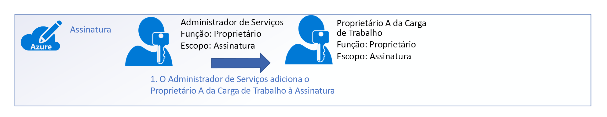In this model, **workload owner A** is assigned the [built-in owner role][rbac-built-in-owner] at the subscription scope, enabling them to create their own resource group: **resource group A**. 

2. Quando **do grupo de recursos A** é criado, **proprietário da carga de trabalho A** é adicionado por padrão e herda o [proprietário interno] [ rbac-built-in-owner] função do escopo de assinatura.When **resource group A** is created, **workload owner A** is added by default and inherits the [built-in owner][rbac-built-in-owner] role from the subscription scope.
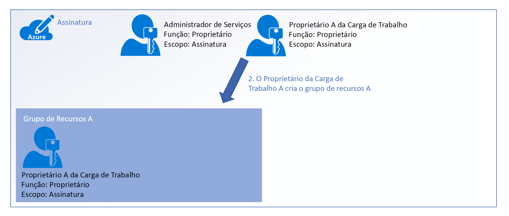

3. A [função interna de proprietário][rbac-built-in-owner] concede ao **proprietário da carga de trabalho A** permissão para gerenciar o acesso ao grupo de recursos.The [built-in owner role][rbac-built-in-owner] grants **workload owner A** permission to manage access to the resource group. O **proprietário da carga de trabalho A** adiciona dois **colaboradores da carga de trabalho** e atribui a [função leitor interna][rbac-built-in-owner] para cada um deles.**Workload owner A** adds two **workload contributors** and assigns the [built-in reader role][rbac-built-in-owner] to each of them. 
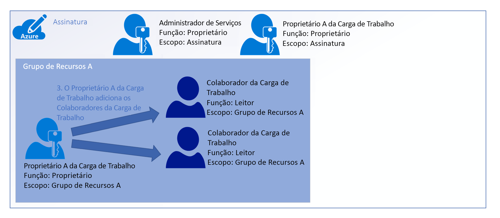

4. O **administrador de serviço** agora adiciona o **proprietário da carga de trabalho B** à assinatura com a função de proprietário interno.**Service administrator** now adds **workload owner B** to the subscription with the built-in owner role. 
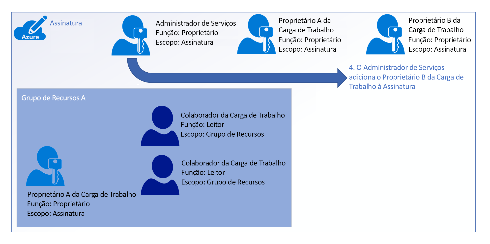

5. O **proprietário da carga de trabalho B** cria o **grupo de recursos B** e é adicionado por padrão.**Workload owner B** creates **resource group B** and is added by default. Novamente, o **proprietário da carga de trabalho B** herda a função de proprietário interno do escopo da assinatura.Again, **workload owner B** inherits the built-in owner role from the subscription scope.
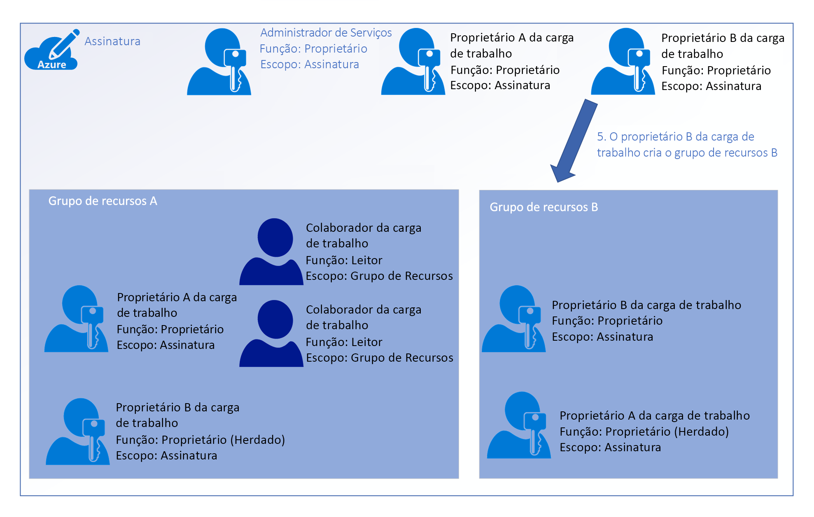

Observe que, neste modelo, o **administrador de serviço** executou ações menos do que no primeiro exemplo, devido a delegação de acesso de gerenciamento para cada um dos proprietários da carga de trabalho individuais.Note that in this model, the **service administrator** performed fewer actions than they did in the first example due to the delegation of management access to each of the individual workload owners.

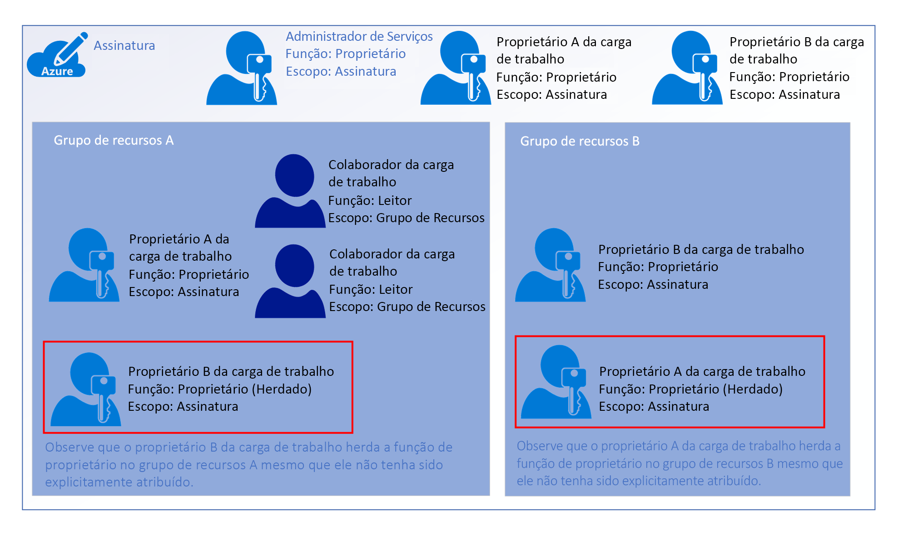
*Figura 5. Uma assinatura com um administrador de serviço e dois proprietários da carga de trabalho, todos atribuídos à função de proprietário interno.*
*Figure 5. A subscription with a service administrator and two workload owners, all assigned the built-in owner role.*

No entanto, porque ambos **proprietário da carga de trabalho A** e **proprietário da carga de trabalho B** são atribuídos à função de proprietário interno no escopo de assinatura, eles terão cada herdadas a função de proprietário interno para cada um dos outros recursos grupo.However, because both **workload owner A** and **workload owner B** are assigned the built-in owner role at the subscription scope, they have each inherited the built-in owner role for each other's resource group. Isso significa que não só têm acesso total aos recursos do outro, eles também são capazes de delegar acesso de gerenciamento para cada um dos outros grupos de recursos.This means that not only do they have full access to one another's resources, they are also able to delegate management access to each other's resource groups. Por exemplo, **proprietário da carga de trabalho B** tem direitos para adicionar qualquer outro usuário para **do grupo de recursos A** e pode atribuir qualquer função a eles, incluindo a função de proprietário interno.For example, **workload owner B** has rights to add any other user to **resource group A** and can assign any role to them, including the built-in owner role.

Se compararmos cada exemplo para nossos requisitos, podemos ver dois exemplos dar suporte a um único usuário confiável no escopo de assinatura com permissão para conceder direitos de acesso de recursos para os proprietários de duas cargas de trabalho.If we compare each example to our requirements, we see that both examples support a single trusted user at the subscription scope with permission to grant resource access rights to our two workload owners. Cada um dos proprietários de duas cargas de trabalho não tinham acesso ao gerenciamento de recursos por padrão e exigiam que o **administrador de serviço** atribuísse explicitamente permissões a eles.Each of the two workload owners did not have access to resource management by default and required the **service administrator** to explicitly assign permissions to them. No entanto, somente o primeiro exemplo suporta o requisito de que os recursos associados a cada carga de trabalho são isolados uma da outra, de modo que nenhum proprietário da carga de trabalho tem acesso aos recursos de qualquer outra carga de trabalho.However, only the first example supports the requirement that the resources associated with each workload are isolated from one another such that no workload owner has access to the resources of any other workload.

## Modelo de gerenciamento de recursosResource management model

Agora que criamos um modelo de permissões de privilégios mínimos, vamos dar uma olhada em algumas aplicações desses modelos de controle.Now that we've designed a permissions model of least privilege, let's move on to take a look at some practical applications of these governance models. Lembre-se de que nossos requisitos devem dar suporte a três ambientes a seguir:Recall from our requirements that we must support the following three environments:
1. **Infraestrutura compartilhada:** um único grupo de recursos compartilhados por todas as cargas de trabalho.**Shared infrastructure:** a single group of resources shared by all workloads. Estes são recursos como gateways de rede, firewalls e serviços de segurança.These are resources such as network gateways, firewalls, and security services.  
2. **Desenvolvimento:** vários grupos de recursos que representam várias cargas de trabalho prontas para não produção.**Development:** multiple groups of resources representing multiple non-production ready workloads. Esses recursos são usados para verificação de conceito, teste e outras atividades de desenvolvedor.These resources are used for proof-of-concept, testing, and other developer activities. Esses recursos podem ter um modelo de governança mais reduzido, para permitir maior agilidade do desenvolvedor.These resources may have a more relaxed governance model because to allow for increased developer agility.
3. **Produção:** vários grupos de recursos que representam várias cargas de trabalho de produção.**Production:** multiple groups of resources representing multiple production workloads. Esses recursos são usados para hospedar os artefatos de aplicativo voltados para o público e o privado.These resources are used to host the private and public facing application artifacts. Esses recursos normalmente têm o controle mais completa e modelos de segurança para proteger os recursos, o código do aplicativo e dados contra acesso não autorizado.These resources typically have the tightest governance and security models to protect the resources, application code, and data from unauthorized access.

Para cada um desses três ambientes, temos um requisito para controlar dados de custo por **proprietário da carga de trabalho**, **ambiente**, ou ambos.For each of these three environments, we have a requirement to track cost data by **workload owner**, **environment**, or both. Ou seja, gostaríamos de saber o custo em andamento de nosso **infraestrutura compartilhada**, os custos por pessoas em ambos o **desenvolvimento** e **produção** ambientes, e Finalmente custo geral **desenvolvimento** e **produção**.That is, we want to know the ongoing cost of our **shared infrastructure**, the costs incurred by individuals in both the **development** and **production** environments, and finally the overall cost of **development** and **production**. 

Você já aprendeu que os recursos estão no escopo em dois níveis: **assinatura** e **grupo de recursos**.You have already learned that resources are scoped to two levels: **subscription** and **resource group**. Portanto, nossa primeira decisão é como organizar nossos ambientes por **assinatura**.Therefore, our first decision is how to organize our environments by **subscription**. Há apenas duas possibilidades: uma única assinatura ou várias assinaturas.There are only two possibilities: a single subscription, or, multiple subscriptions. 

Antes de examinarmos exemplos de cada um desses modelos, vamos examinar a estrutura de gerenciamento de assinaturas no Azure.Before we look at examples of each of these models, let's review the management structure for subscriptions in Azure. 

Lembre-se de nossos requisitos que temos um indivíduo em nossa organização que é responsável por assinaturas, e esse usuário possui o **proprietário da assinatura** conta em nosso locatário do Azure AD.Recall from our requirements that we have an individual in our organization that is responsible for subscriptions, and this user owns the **subscription owner** account in our Azure AD tenant. No entanto, essa conta não tem permissão para criar assinaturas.However, this account does not have permission to create subscriptions. Somente o **Proprietário da Conta do Azure** tem permissão para fazer isso: 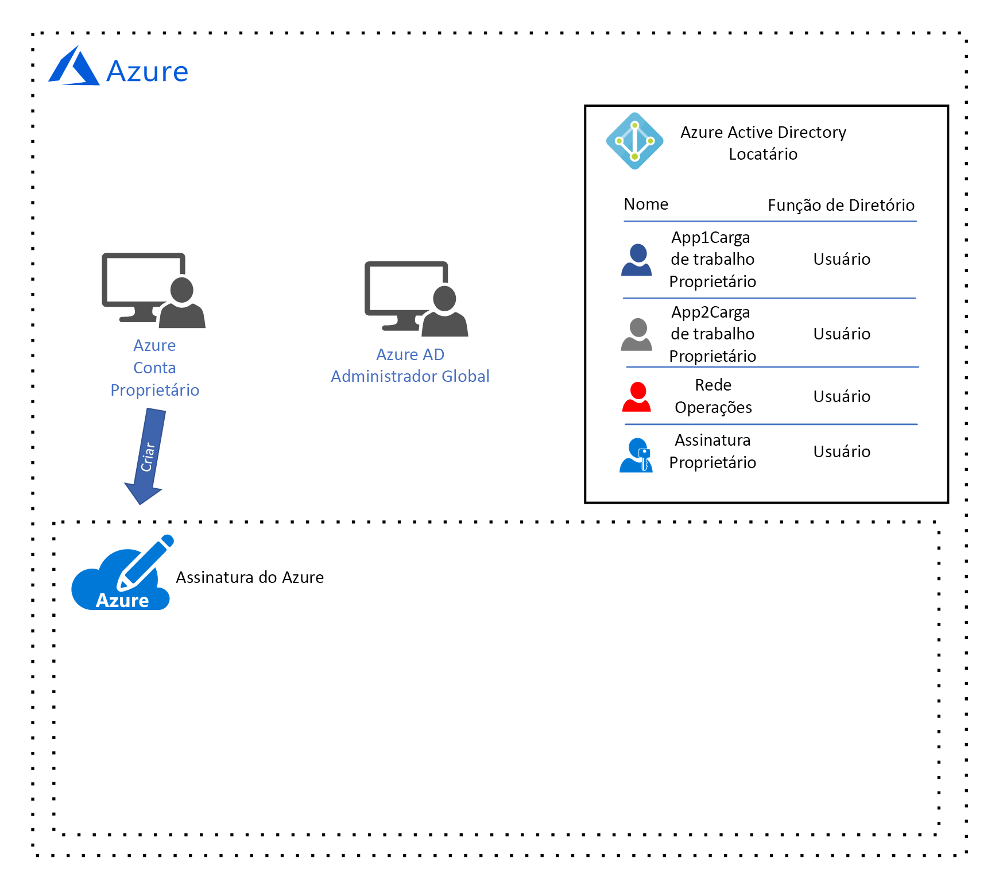
*Figura 6. Um proprietário de conta do Azure cria uma assinatura.*Only the **Azure Account Owner** has permission to do this: 
*Figure 6. An Azure Account Owner creates a subscription.*

Quando a assinatura tiver sido criada, o **proprietário da conta do Azure** pode adicionar o **proprietário da assinatura** de conta para a assinatura com o **proprietário** função:Once the subscription has been created, the **Azure Account Owner** can add the **subscription owner** account to the subscription with the **owner** role:

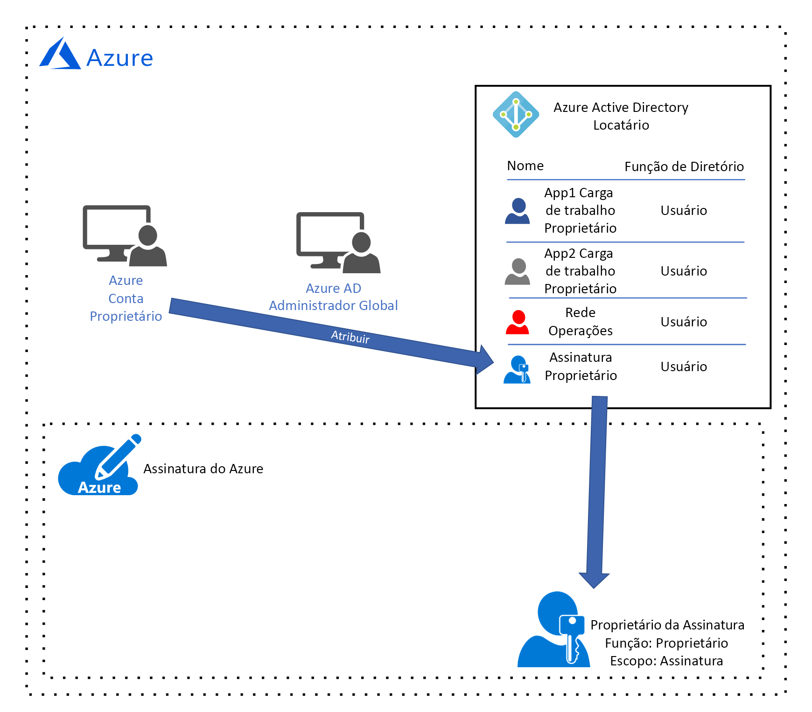
*Figura 7. O proprietário da conta do Azure adiciona a conta de usuário do **proprietário da assinatura** para a assinatura com a função **proprietário**.*
*Figure 7. The Azure Account Owner adds the **subscription owner** user account to the subscription with the **owner** role.*

O **proprietário da assinatura** agora pode criar **grupos de recursos** e delegar o gerenciamento de acesso de recursos.The **subscription owner** can now create **resource groups** and delegate resource access management.

Primeiro vamos examinar um modelo de gerenciamento de recursos de exemplo usando uma única assinatura.First let's look at an example resource management model using a single subscription. Nossa primeira decisão é como alinhar grupos de recursos para os três ambientes.Our first decision is how to align resource groups to the three environments. Nós temos duas opções:We have two options:
1. Alinhe cada ambiente a um único grupo de recursos.Align each environment to a single resource group. Todos os recursos de infraestrutura compartilhada são implantados em um único grupo de recursos de **infraestrutura compartilhada**.All shared infrastructure resources are deployed to a single **shared infrastructure** resource group. Todos os recursos associados com cargas de trabalho de desenvolvimento são implantados em um único grupo de recursos de **desenvolvimento**.All resources associated with development workloads are deployed to a single **development** resource group. Todos os recursos associados com cargas de trabalho de produção são implantados em um único grupo de recursos de **produção** para o ambiente de **produção**.All resources associated with production workloads are deployed into a single **production** resource group for the **production** environment. 
2. Alinhe as cargas de trabalho com um grupo de recursos separado, usando uma convenção de nomenclatura e marcas para alinhar grupos de recursos com cada um dos três ambientes.Align workloads with a separate resource group, using a naming convention and tags to align resource groups with each of the three environments.  

Vamos começar avaliando a primeira opção.Let's begin by evaluating the first option. Usaremos o modelo de permissões, discutido na seção anterior, com um administrador de serviço de assinatura única que cria grupos de recursos e adiciona os usuários a eles com qualquer interno **colaborador** ou **leitor** função.We'll be using the permissions model that we discussed in the previous section, with a single subscription service administrator that creates resource groups and adds users to them with either the built-in **contributor** or **reader** role. 

1. O primeiro grupo de recursos implantados representa o ambiente de **infraestrutura compartilhada**.The first resource group deployed represents the **shared infrastructure** environment. O **proprietário da assinatura** cria um grupo de recursos para os recursos de infraestrutura compartilhada denominados **netops-shared-rg**.The **subscription owner** creates a resource group for the shared infrastructure resources named **netops-shared-rg**. 
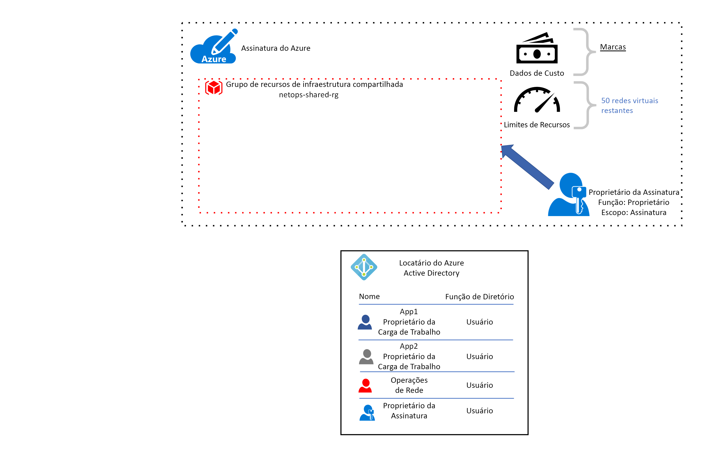
2. O **proprietário da assinatura** adiciona a conta de **usuário operações de rede** ao grupo de recursos e atribui a função **colaborador**.The **subscription owner** adds the **network operations user** account to the resource group and assigns the **contributor** role. 
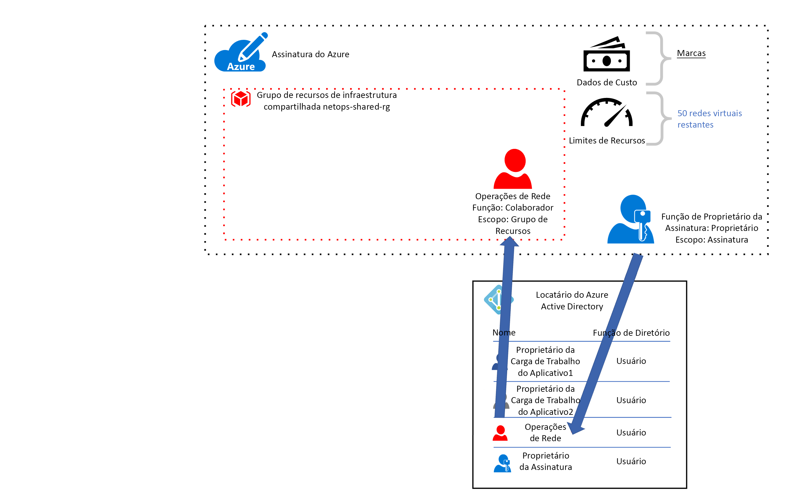
3. O **usuário de operações de rede** cria um [gateway VPN](/azure/vpn-gateway/vpn-gateway-about-vpngateways) e o configura para se conectar ao dispositivo de VPN local.The **network operations user** creates a [VPN gateway](/azure/vpn-gateway/vpn-gateway-about-vpngateways) and configures it to connect to the on-premises VPN appliance. O usuário **operações de rede** também se aplica a um par de [marcas](/azure/azure-resource-manager/resource-group-using-tags) para cada um dos recursos: *environment:shared* e *managedBy:netOps*.The **network operations** user also applies a pair of [tags](/azure/azure-resource-manager/resource-group-using-tags) to each of the resources: *environment:shared* and *managedBy:netOps*. Quando o **administrador de serviço de assinatura** exportar um custo de relatório, os custos serão alinhados com cada uma dessas marcas.When the **subscription service administrator** exports a cost report, costs will be aligned with each of these tags. Isso permite que o **administrador de serviço de assinatura** dinamizar os custos usando a marca *environment* e a marca *managedBy*.This allows the **subscription service administrator** to pivot costs using the *environment* tag and the *managedBy* tag. Observe o contador de **limites de recursos** no lado superior direito da figura.Notice the **resource limits** counter at the top right-hand side of the figure. Cada assinatura do Azure tem [limites de serviço](/azure/azure-subscription-service-limits), e para ajudá-lo a entender o efeito desses limites Seguiremos o limite de rede virtual para cada assinatura.Each Azure subscription has [service limits](/azure/azure-subscription-service-limits), and to help you understand the effect of these limits we'll follow the virtual network limit for each subscription. Há um limite padrão de 50 redes virtuais por assinatura e depois que a primeira rede virtual é implantada agora há 49 disponíveis.There is a default limit of 50 virtual networks per subscription, and after the first virtual network is deployed there are now 49 available.

4. Dois ou mais grupos de recursos são implantados, o primeiro é denominado *prod rg*.Two more resource groups are deployed, the first is named *prod-rg*. Este grupo de recursos está alinhado com o ambiente de **produção**.This resource group is aligned with the **production** environment. O segundo é denominado *dev-rg* e é alinhado ao ambiente de **desenvolvimento**.The second is named *dev-rg* and is aligned with the **development** environment. Todos os recursos associados com cargas de trabalho de produção são implantados para o **produção** todos os recursos associados com cargas de trabalho de desenvolvimento e ambiente são implantados para o ambiente de **desenvolvimento**.All resources associated with production workloads are deployed to the **production** environment and all resources associated with development workloads are deployed to the **development** environment. Neste exemplo, só implantaremos duas cargas de trabalho para cada um desses dois ambientes para não encontramos qualquer limite de serviço de assinatura do Azure.In this example we'll only deploy two workloads to each of these two environments so we won't encounter any Azure subscription service limits. No entanto, é importante considerar que cada grupo de recursos tem um limite de 800 recursos por grupo de recursos.However, it's important to consider that each resource group has a limit of 800 resources per resource group. Portanto, se pudermos continuar adicionando cargas de trabalho para cada grupo de recursos, é possível que esse limite seja atingido.Therefore, if we keep adding workloads to each resource group it is possible that this limit will be reached. 
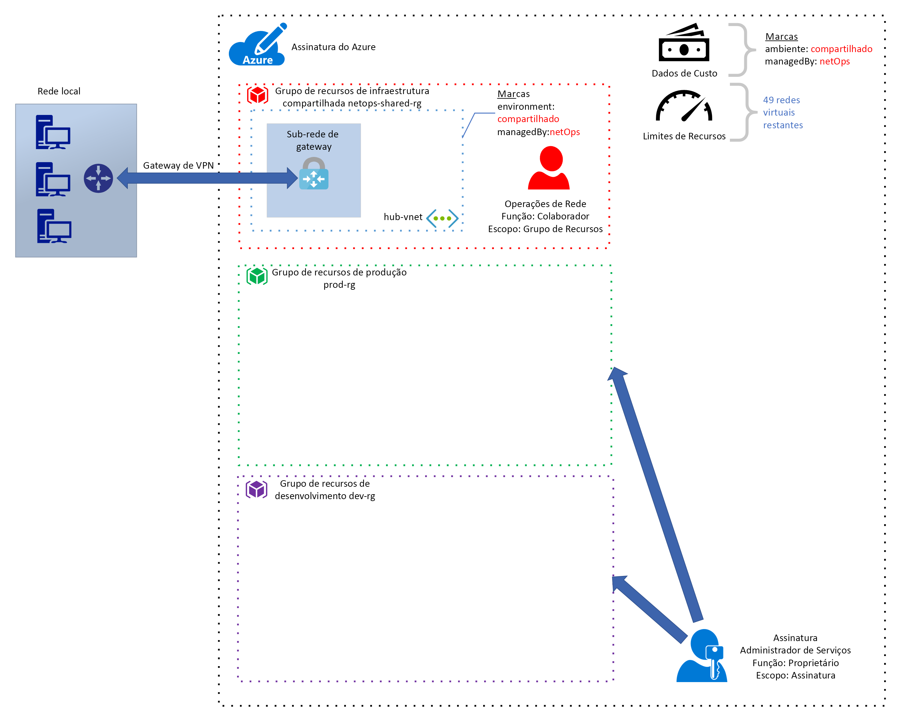
5. A primeira **proprietário da carga de trabalho** envia uma solicitação para o **administrador de serviço de assinatura** e é adicionado a cada um dos grupos de recursos dos ambientes de **desenvolvimento** e de **produção** com a função **colaborador**.The first **workload owner** sends a request to the **subscription service administrator** and is added to each of the **development** and **production** environment resource groups with the **contributor** role. Como você aprendeu anteriormente, o **colaborador** função permite que o usuário execute qualquer operação que não seja a atribuição de uma função para outro usuário.As you learned earlier, the **contributor** role allows the user to perform any operation other than assigning a role to another user. O primeiro **proprietário da carga de trabalho** agora pode criar os recursos associados à sua carga de trabalho.The first **workload owner** can now create the resources associated with their workload.
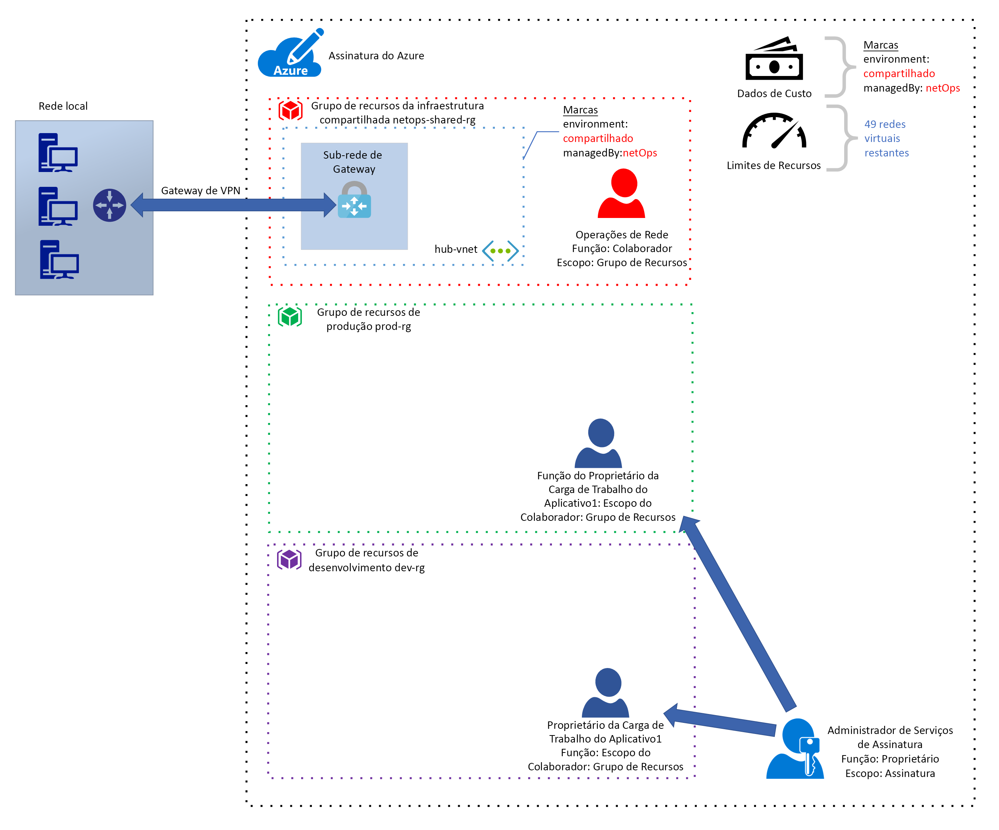
6. O primeiro **proprietário da carga de trabalho** cria uma rede virtual em cada dois grupos de recursos com um par de máquinas virtuais em cada um.The first **workload owner** creates a virtual network in each of the two resource groups with a pair of virtual machines in each. O primeiro **proprietário da carga de trabalho** se aplica às marcas *environment* e *managedBy* para todos os recursos.The first **workload owner** applies the *environment* and *managedBy* tags to all resources. Observe que o contador de limite do serviço do Azure está agora em 47 redes virtuais restantes.Note that the Azure service limit counter is now at 47 virtual networks remaining.
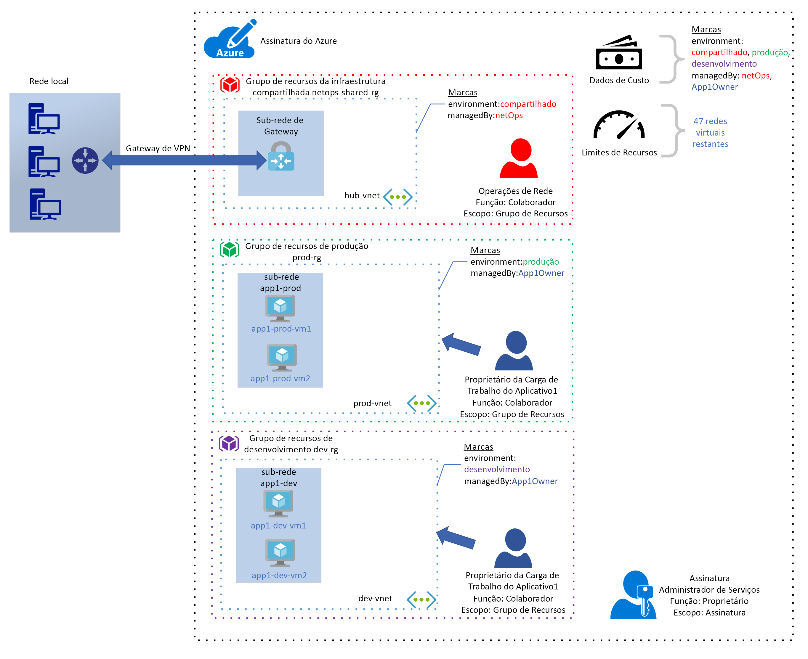
7. Nenhuma das redes virtuais não tem conectividade com o local quando é criada.Each of the virtual networks does not have connectivity to on-premises when they are created. Nesse tipo de arquitetura, cada rede virtual deve ser emparelhada para a *hub-vnet* no ambiente de **infraestrutura compartilhada**.In this type of architecture, each virtual network must be peered to the *hub-vnet* in the **shared infrastructure** environment. O emparelhamento de rede virtual cria uma conexão entre duas redes virtuais separadas e permite o tráfego de rede entre eles.Virtual network peering creates a connection between two separate virtual networks and allows network traffic to travel between them. Observe que o emparelhamento de rede virtual não é inerentemente transitiva.Note that virtual network peering is not inherently transitive. Um emparelhamento deve ser especificado em cada uma das duas redes virtuais que estão conectadas e se apenas uma das redes virtuais Especifica um emparelhamento a conexão está incompleta.A peering must be specified in each of the two virtual networks that are connected, and if only one of the virtual networks specifies a peering the connection is incomplete. Para ilustrar o efeito disso, o primeiro **proprietário da carga de trabalho** Especifica um emparelhamento entre **prod-vnet** e **hub-vnet**.To illustrate the effect of this, the first **workload owner** specifies a peering between **prod-vnet** and **hub-vnet**. O emparelhamento primeiro é criado, mas nenhum tráfego flui, já que o emparelhamento complementar do **hub-vnet** para **prod-vnet** ainda não foi especificado.The first peering is created, but no traffic flows because the complementary peering from **hub-vnet** to **prod-vnet** has not yet been specified. A primeira **proprietário da carga de trabalho** contatos a **operações de rede** solicitações nesse complementares emparelhamento de conexão e usuário.The first **workload owner** contacts the **network operations** user and requests this complementary peering connection.
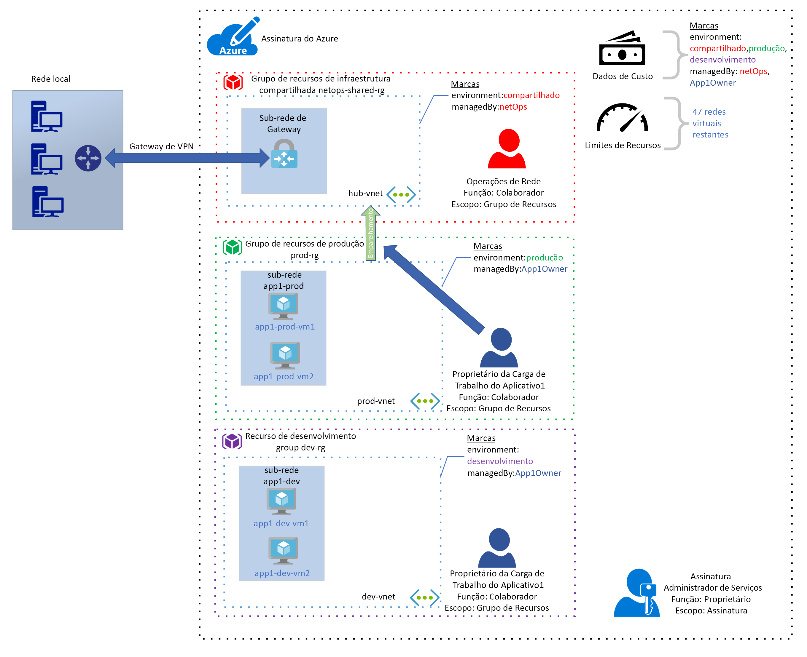
8. O usuário **operações de rede** examina a solicitação, a aprova e então especifica o emparelhamento nas configurações para o **hub-vnet**.The **network operations** user reviews the request, approves it, then specifies the peering in the settings for the **hub-vnet**. A conexão de emparelhamento agora está concluída e o tráfego de rede flui entre as duas redes virtuais.The peering connection is now complete and network traffic flows between the two virtual networks.
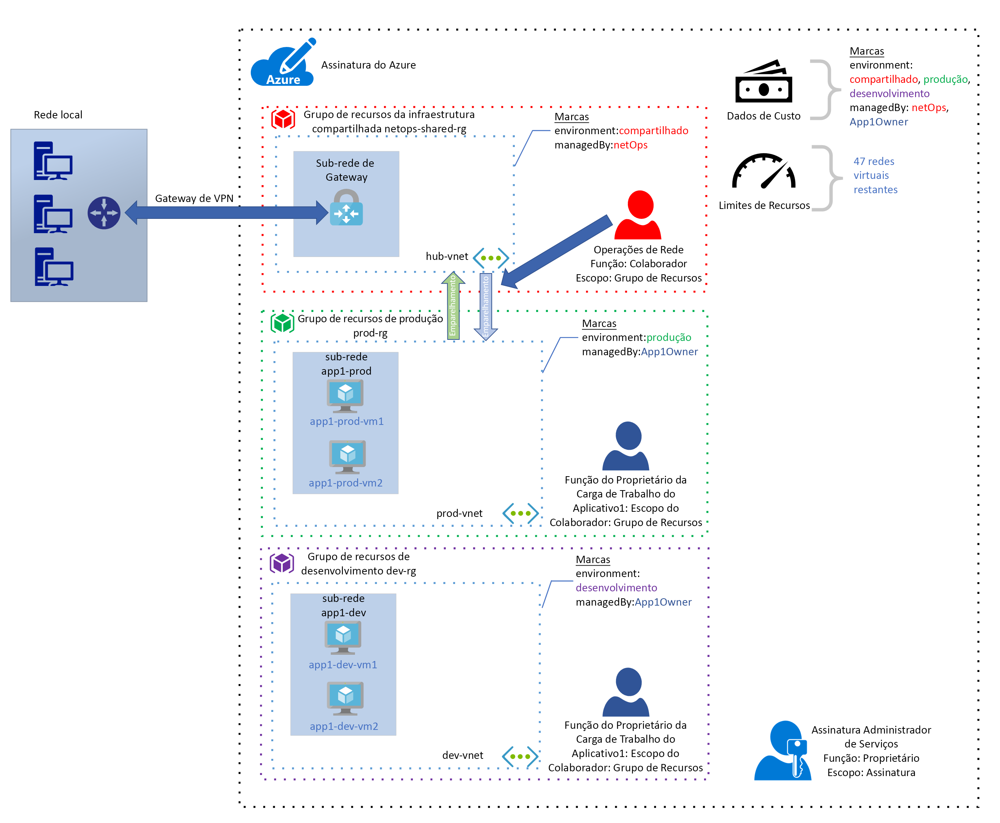
9. Agora, um segundo **proprietário da carga de trabalho** envia uma solicitação para o **administrador de serviço de assinatura** e é adicionado à existente **produção** e **desenvolvimento**  grupos de recurso de ambiente com o **colaborador** função.Now, a second **workload owner** sends a request to the **subscription service administrator** and is added to the existing **production** and **development** environment resource groups with the **contributor** role. O segundo **proprietário da carga de trabalho** tem as mesmas permissões em todos os recursos como o primeiro **proprietário da carga de trabalho** em cada grupo de recursos.The second **workload owner** has the same permissions on all resources as the first **workload owner** in each resource group. 
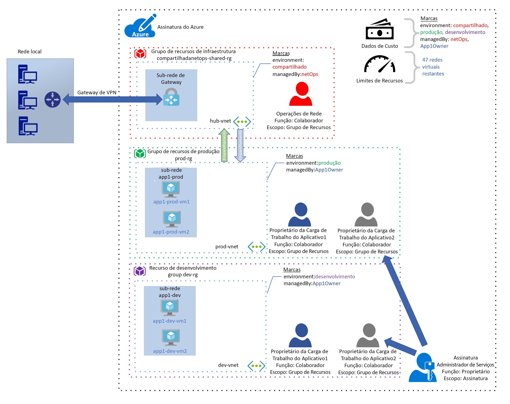
10. O segundo **proprietário da carga de trabalho** cria uma sub-rede na rede virtual **prod-vnet** e então adicionada duas máquinas virtuais.The second **workload owner** creates a subnet in the **prod-vnet** virtual network, then adds two virtual machines. O segundo **proprietário da carga de trabalho** se aplica às marcas *environment* e *managedBy* para cada recurso.The second **workload owner** applies the *environment* and *managedBy* tags to each resource.
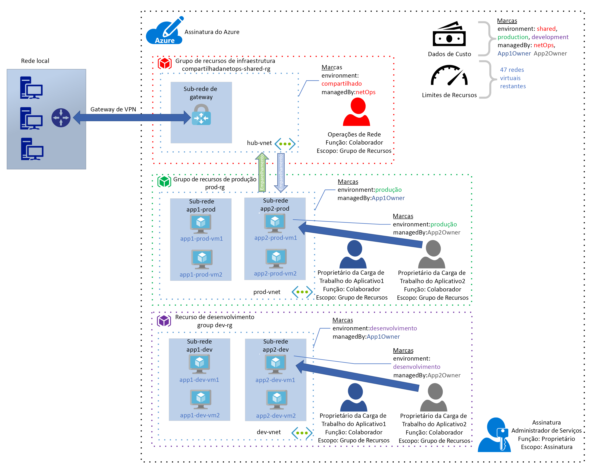 

Esse modelo de gerenciamento de recursos de exemplo permite gerenciar nossos recursos nos três ambientes necessários.This example resource management model enables us to manage our resources in the three required environments. Nossos recursos de infraestrutura compartilhada estão protegidos porque há apenas um usuário na assinatura com a permissão para acessar esses recursos.Our shared infrastructure resources are protected because there's only a single user in the subscription with permission to access those resources. Cada um dos nossos proprietários da carga de trabalho é capaz de utilizar os recursos de infraestrutura de compartilhamento sem ter que todas as permissões sobre os recursos compartilhados reais próprios.Each of our workload owners is able to utilize the share infrastructure resources without having any permissions on the actual shared resources themselves. Esse modelo de gerenciamento falha nosso requisito para o isolamento de carga de trabalho - cada um dos dois **proprietários da carga de trabalho** sejam capazes de acessar os recursos de carga de trabalho do outro.This management model fails our requirement for workload isolation - each of the two **workload owners** are able to access the resources of the other's workload. 

Há outra consideração importante com esse modelo, que pode não ser imediatamente óbvia.There's another important consideration with this model that may not be immediately obvious. Em nosso exemplo, foi **proprietário de carga de trabalho do app1** que solicitou a conexão de rede emparelhamento com o **vnet hub** para fornecer conectividade a locais.In our example, it was **app1 workload owner** that requested the network peering connection with the **hub-vnet** to provide connectivity to on-premises. O usuário **operações de rede** avaliou a solicitação com base nos recursos implantados com carga de trabalho.The **network operations** user evaluated that request based on the resources deployed with that workload. Quando o **proprietário da assinatura** adicionou o **proprietário de carga de trabalho do app2** com a função **colaborador**, o usuário tinha direitos de acesso de gerenciamento para todos os recursos no grupo de recursos **prod-rg**.When the **subscription owner** added **app2 workload owner** with the **contributor** role, that user had management access rights to all resources in the **prod-rg** resource group. 

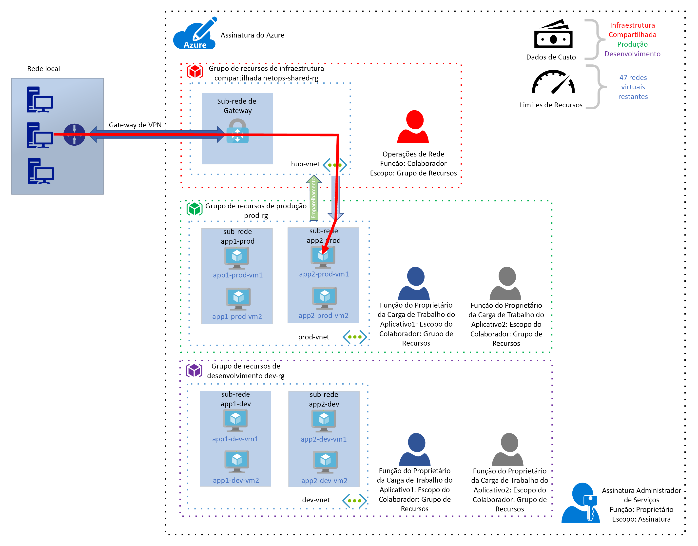

Isso significa que o **proprietário de carga de trabalho do app2** teve permissão para implantar sua própria sub-rede com máquinas virtuais na rede virtual **redes de produção**.This means **app2 workload owner** had permission to deploy their own subnet with virtual machines in the **prod-vnet** virtual network. Por padrão, essas máquinas virtuais agora têm acesso à rede local.By default, those virtual machines now have access to the on-premises network. O usuário **operações de rede** não está ciente dessas máquinas e não aprova sua conectividade com local.The **network operations** user is not aware of those machines and did not approve their connectivity to on-premises.

Em seguida, vamos examinar uma única assinatura com vários grupos de recursos para diferentes ambientes e cargas de trabalho.Next, let's look at a single subscription with multiple resources groups for different environments and workloads. Observe que no exemplo anterior, os recursos para cada ambiente foram facilmente identificáveis porque estavam no mesmo grupo de recursos.Note that in the previous example, the resources for each environment were easily identifiable because they were in the same resource group. Agora que não temos mais esse agrupamento, precisamos contar com uma convenção de nomenclatura do grupo de recursos para fornecer essa funcionalidade.Now that we no longer have that grouping, we will have to rely on a resource group naming convention to provide that functionality. 

1. Nossos recursos de **infraestrutura compartilhada** ainda terão um grupo de recursos separado nesse modelo, para que ele permaneça igual.Our **shared infrastructure** resources will still have a separate resource group in this model, so that remains the same. Cada carga de trabalho exige dois grupos de recursos, um para cada um dos ambientes de **desenvolvimento** e de **produção**.Each workload requires two resource groups - one for each of the **development** and **production** environments. Para a primeira carga de trabalho, o **proprietário da assinatura** cria dois grupos de recursos.For the first workload, the **subscription owner** creates two resource groups. A primeira é denominada **app1-prod-rg** e a segunda é denominada **app1-dev-rg**.The first is named **app1-prod-rg** and the second one is named **app1-dev-rg**. Como discutido anteriormente, essa convenção de nomenclatura identifica os recursos como sendo associados à primeira carga de trabalho, **app1**, e o ambiente de **desenvolvimento** ou de **produção**.As discussed earlier, this naming convention identifies the resources as being associated with the first workload, **app1**, and either the **dev** or **prod** environment. Novamente, o proprietário da *assinatura* adiciona o **proprietário de carga de trabalho do app1** ao grupo de recursos com a função **colaborador**.Again, the *subscription* owner adds **app1 workload owner** to the resource group with the **contributor** role.
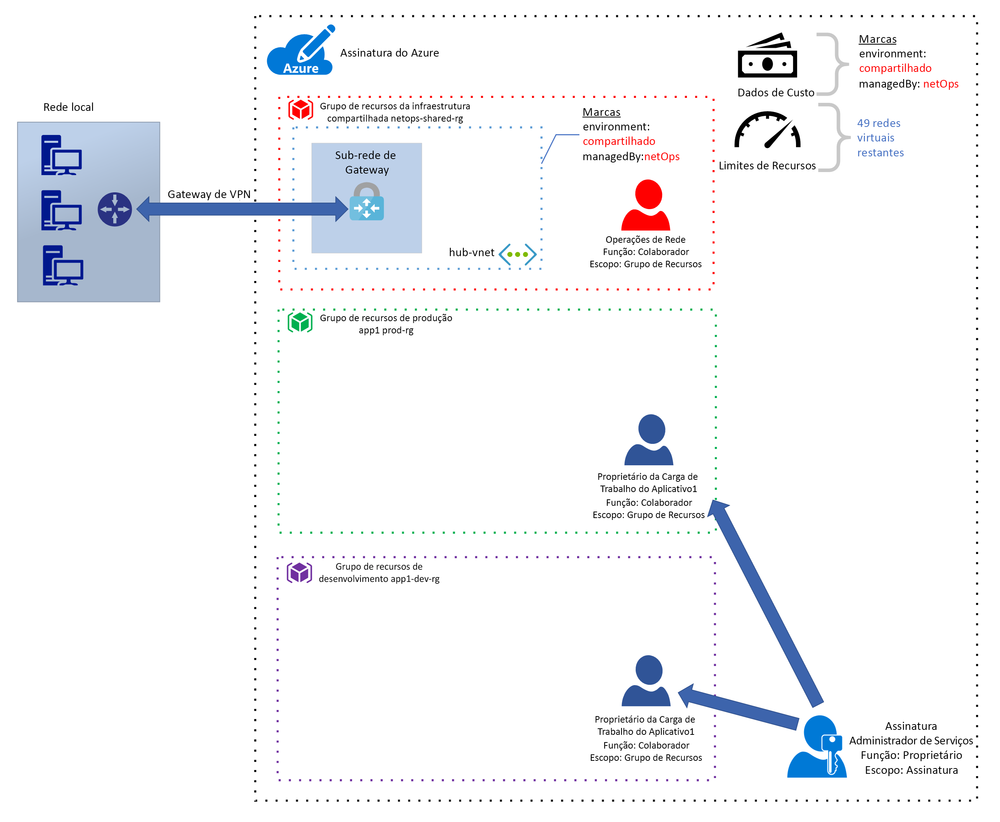
2. Semelhante ao primeiro exemplo, **proprietário de carga de trabalho do app1** implanta uma rede virtual denominada **app1-prod-vnet** para o **produção** ambiente e outro nomeado**app1-dev-vnet** para o **desenvolvimento** ambiente.Similar to the first example, **app1 workload owner** deploys a virtual network named **app1-prod-vnet** to the **production** environment, and another named **app1-dev-vnet** to the **development** environment. Novamente, o **proprietário de carga de trabalho do app1** envia uma solicitação para o usuário **operações de rede** para criar uma conexão de emparelhamento.Again, **app1 workload owner** sends a request to the **network operations** user to create a peering connection. Observe que o **proprietário de carga de trabalho do app1** adiciona as mesmas marcas como no primeiro exemplo e o limite de contador foi reduzido para 47 redes virtuais restantes na assinatura.Note that **app1 workload owner** adds the same tags as in the first example, and the limit counter has been decremented to 47 virtual networks remaining in the subscription.
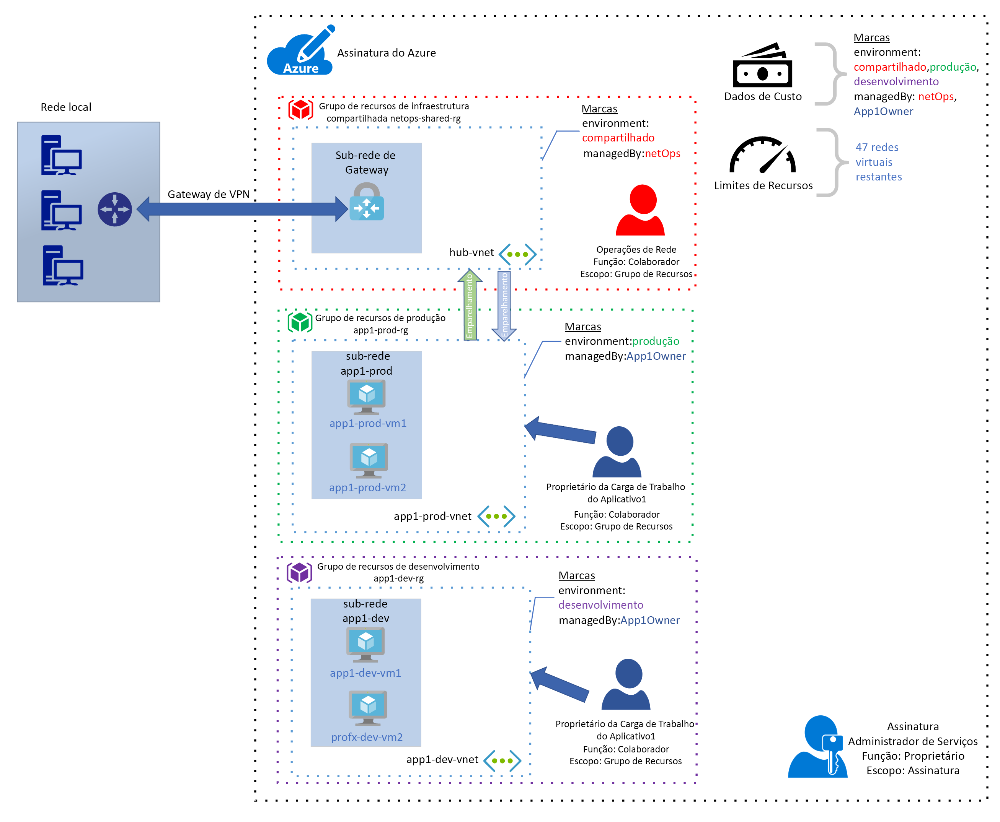
3. Agora, o **proprietário da assinatura** cria dois grupos de recursos para o **proprietário de carga de trabalho do app2**.The **subscription owner** now creates two resource groups for **app2 workload owner**. Seguir as mesmas convenções de **proprietário de carga de trabalho do app1**, os grupos de recursos são nomeados como **app2-prod-rg** e **app2-dev-rg**.Following the same conventions as for **app1 workload owner**, the resource groups are named **app2-prod-rg** and **app2-dev-rg**. O **proprietário da assinatura** adiciona **proprietário de carga de trabalho do app2** para cada um dos grupos de recursos com a função **colaborador**.The **subscription owner** adds **app2 workload owner** to each of the resource groups with the **contributor** role.
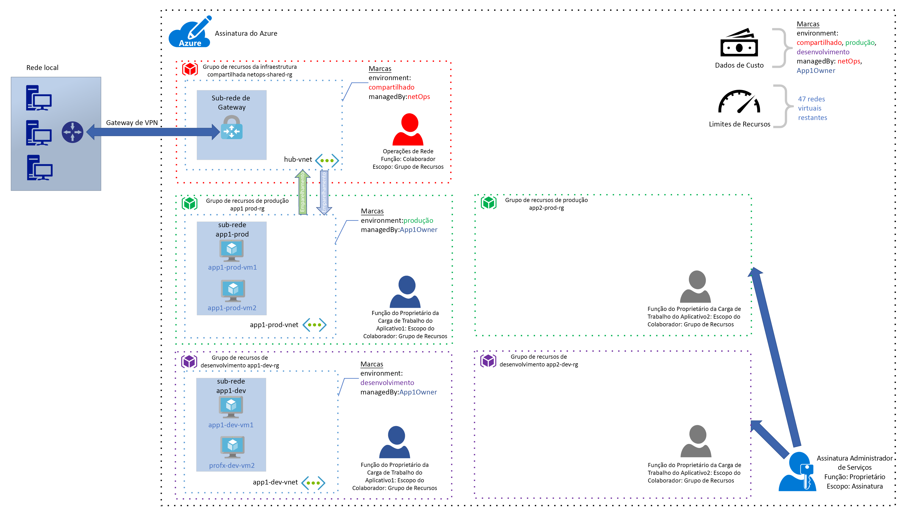
4. O *proprietário da carga de trabalho de app2* implanta redes virtuais e máquinas virtuais para os grupos de recursos com as mesmas convenções de nomenclatura.*App2 workload owner* deploys virtual networks and virtual machines to the resource groups with the same naming conventions. As marcas são adicionadas e o contador de limite foi reduzido para 45 redes virtuais restantes na *assinatura*.Tags are added and the limit counter has been decremented to 45 virtual networks remaining in the *subscription*.
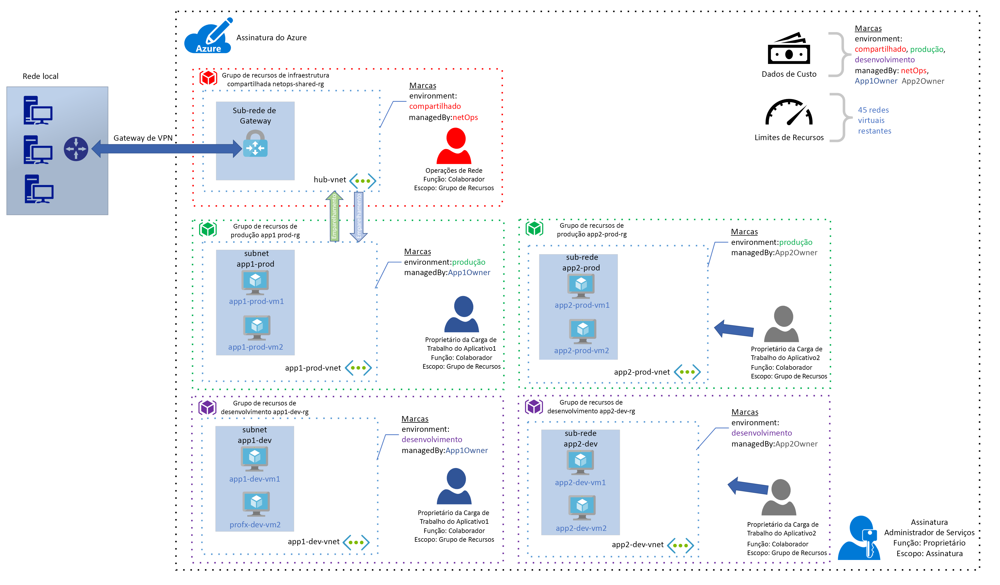
5. O *proprietário da carga de trabalho do app2* envia uma solicitação para o usuário *operações de rede* para o mesmo nível a *app2-prod-vnet* com o *hub vnet*.*App2 workload owner* sends a request to the *network operations* user to peer the *app2-prod-vnet* with the *hub-vnet*. O usuário de *operações de rede* cria a conexão de emparelhamento.The *network operations* user creates the peering connection.
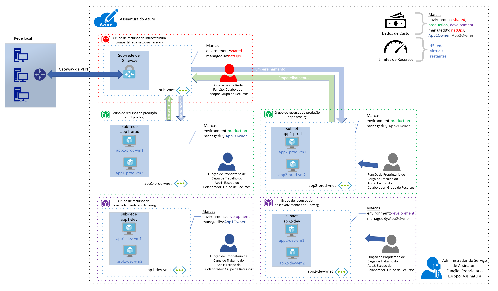

O modelo de gerenciamento resultante é semelhante ao primeiro exemplo, com várias diferenças importantes:The resulting management model is similar to the first example, with several key differences:
* Cada uma das duas cargas de trabalho é isolada por carga de trabalho e pelo ambiente.Each of the two workloads is isolated by workload and by environment.
* Esse modelo exigia duas redes virtuais a mais do que o primeiro modelo de exemplo.This model required two more virtual networks than the first example model. Enquanto isso não é uma distinção importante com apenas duas cargas de trabalho, o limite teórico no número de cargas de trabalho para esse modelo é 24.While this is not an important distinction with only two workloads, the theoretical limit on the number of workloads for this model is 24. 
* Os recursos não são agrupados em um único grupo de recursos para cada ambiente.Resources are no longer grouped in a single resource group for each environment. O agrupamento de recursos requer uma compreensão das convenções de nomenclatura usadas para cada ambiente.Grouping resources requires an understanding of the naming conventions used for each environment. 
* Cada uma das conexões de rede virtual emparelhadas foi revisada e aprovada pelo usuário *operações de rede*.Each of the peered virtual network connections was reviewed and approved by the *network operations* user.

Agora vamos dar uma olhada em um modelo de gerenciamento de recursos usando várias assinaturas.Now let's look at a resource management model using multiple subscriptions. Nesse modelo, cada um dos três ambientes para uma assinatura separada será alinhar: uma **serviços compartilhados** assinatura, **produção** assinatura e, finalmente, um **desenvolvimento** assinatura.In this model, we'll align each of the three environments to a separate subscription: a **shared services** subscription, **production** subscription, and finally a **development** subscription. As considerações para este modelo são semelhantes a um modelo usando uma única assinatura em que temos que decidir como alinhar grupos de recursos para cargas de trabalho.The considerations for this model are similar to a model using a single subscription in that we have to decide how to align resource groups to workloads. Nós já determinamos que criar um grupo de recursos para cada carga de trabalho satisfaz nosso requisito de isolamento de carga de trabalho, portanto ficaremos com esse modelo neste exemplo.We've already determined that creating a resource group for each workload satisfies our workload isolation requirement, so we'll stick with that model in this example.

1. Nesse modelo, há três *assinaturas*: *infraestrutura compartilhada*, *produção* e *desenvolvimento*.In this model, there are three *subscriptions*: *shared infrastructure*, *production*, and *development*. Cada uma dessas três assinaturas requer um *proprietário da assinatura* e, em nosso exemplo simples, vamos usar a mesma conta de usuário para todos os três.Each of these three subscriptions requires a *subscription owner*, and in our simple example we'll use the same user account for all three. O *infraestrutura compartilhada* recursos são gerenciados da mesma forma para os dois primeiros exemplos acima, e a primeira carga de trabalho está associada a *app1-rg* no *produção* ambiente e o recurso de mesmo nome de grupo no *desenvolvimento* ambiente.The *shared infrastructure* resources are managed similarly to the first two examples above, and the first workload is associated with the *app1-rg* in the *production* environment and the same-named resource group in the *development* environment. O *proprietário de carga de trabalho do app1* é adicionado a cada grupo de recursos com a função *colaborador*.The *app1 workload owner* is added to each of the resource group with the *contributor* role. 
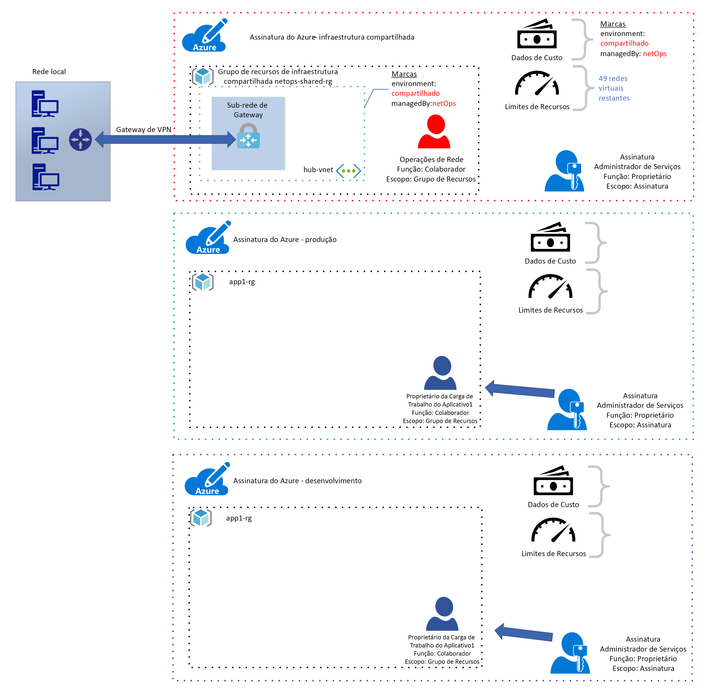
2. Assim como acontece com os exemplos anteriores, *proprietário de carga de trabalho do app1* cria os recursos e as solicitações de conexão de emparelhamento com o *infraestrutura compartilhada* rede virtual.As with the earlier examples, *app1 workload owner* creates the resources and requests the peering connection with the *shared infrastructure* virtual network. O *proprietário de carga de trabalho do app1* adiciona somente a marca *managedBy* porque não há mais necessidade para a marca *environment*.*App1 workload owner* adds only the *managedBy* tag because there is no longer a need for the *environment* tag. Ou seja, os recursos para cada ambiente agora são agrupados na mesma *assinatura* e a marca *environment* fica redundante.That is, resources are for each environment are now grouped in the same *subscription* and the *environment* tag is redundant. O contador de limites será diminuído para 49 redes virtuais restantes.The limit counter is decremented to 49 virtual networks remaining.
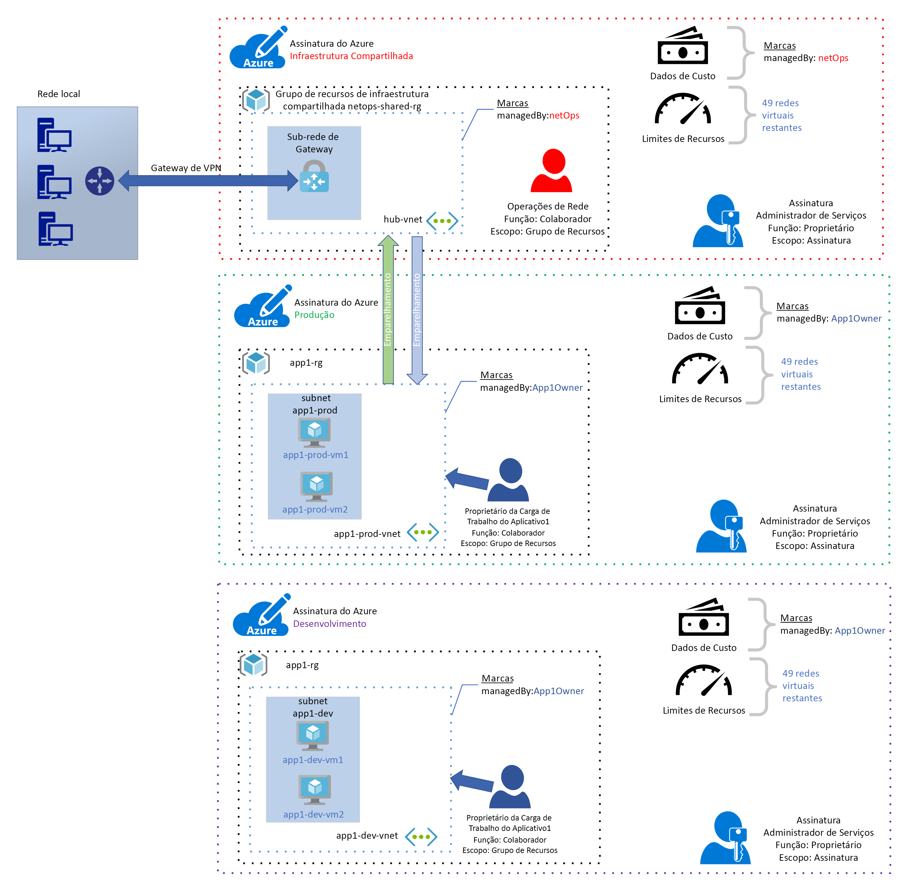
3. Por fim, o *proprietário da assinatura* repete o processo para a carga de trabalho segundo, adicionando os grupos de recursos com o *app2 proprietário da carga de trabalho* no \* função de colaborador.Finally, the *subscription owner* repeats the process for the second workload, adding the resource groups with the *app2 workload owner* in the \*contributor role. O contador de limite para cada uma das assinaturas do ambiente é reduzido para 48 redes virtuais restantes.The limit counter for each of the environment subscriptions is decremented to 48 virtual networks remaining. 

Esse modelo de gerenciamento tem os benefícios do segundo exemplo acima.This management model has the benefits of the second example above. No entanto, a principal diferença é que os limites são um problema devido ao fato de que eles estão espalhados por duas *assinaturas*.However, the key difference is that limits are less of an issue due to the fact that they are spread over two *subscriptions*. A desvantagem é que os dados de custo controlados por marcas devem ser agregados em todas as três *assinaturas*.The drawback is that the cost data tracked by tags must be aggregated across all three *subscriptions*. 

Portanto, você pode selecionar qualquer um desses dois modelos de gerenciamento de recursos de exemplo, dependendo da prioridade de seus requisitos.Therefore, you can select any of these two examples resource management models depending on the priority of your requirements. Se você antecipar que sua organização não atinja os limites de serviço para uma única assinatura, poderá usar uma única assinatura com vários grupos de recursos.If you anticipate that your organization will not reach the service limits for a single subscription, you can use a single subscription with multiple resource groups. Por outro lado, se sua organização prevê várias cargas de trabalho, pode ser melhor ter várias assinaturas para cada ambiente.Conversely, if your organization anticipates many workloads, multiple subscriptions for each environment may be better.

<!-- ## Summary

## Next steps -->

<!-- links -->

[rbac-built-in-owner]: /azure/role-based-access-control/built-in-roles#owner
[rbac-built-in-roles]: /azure/role-based-access-control/built-in-roles
