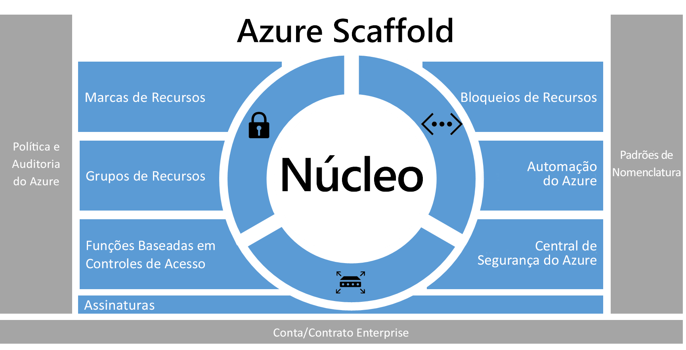
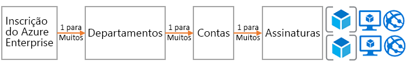
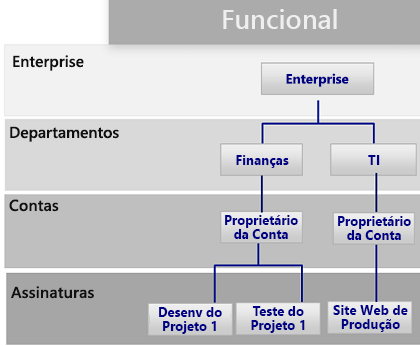
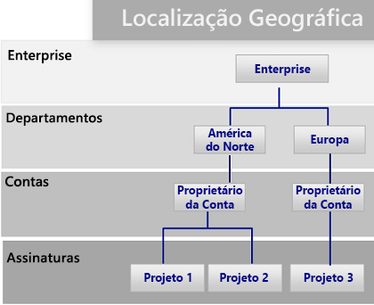
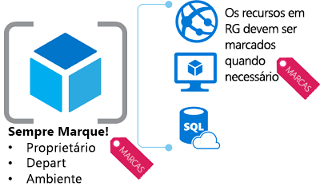
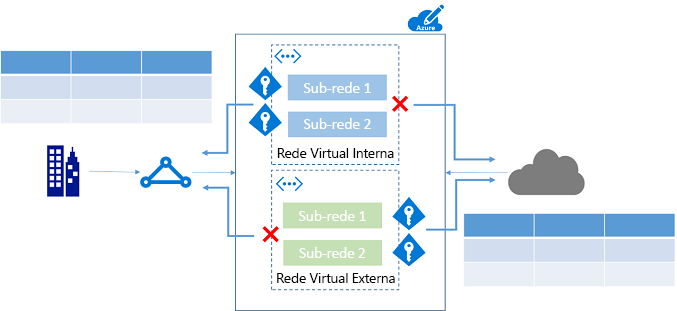
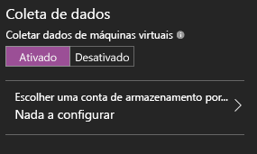

# Andaime empresarial do Azure — governança de assinatura prescritivaAzure enterprise scaffold - prescriptive subscription governance
As empresas estão adotando cada vez mais a nuvem pública em busca de agilidade e flexibilidade.Enterprises are increasingly adopting the public cloud for its agility and flexibility. Elas estão usando os pontos fortes da nuvem para gerar receita ou otimizar recursos para os negócios.They are utilizing the cloud's strengths to generate revenue or optimize resources for the business. O Microsoft Azure fornece uma variedade de serviços que as empresas podem montar como blocos de construção para atender a uma ampla gama de aplicativos e cargas de trabalho.Microsoft Azure provides a multitude of services that enterprises can assemble like building blocks to address a wide array of workloads and applications. 

Mas, muitas vezes, é difícil saber por onde começar.But, knowing where to begin is often difficult. Depois de decidir usar o Azure, normalmente surgem algumas perguntas:After deciding to use Azure, a few questions commonly arise:

* "Como atender aos nossos requisitos legais para domínio dos dados em determinados países?""How do I meet our legal requirements for data sovereignty in certain countries?"
* "Como garantir que alguém não altere inadvertidamente um sistema crítico?""How do I ensure that someone does not inadvertently change a critical system?"
* "Como saber o que cada recurso aceita para que eu possa responsabilizá-lo e cobrá-lo de volta precisamente?""How do I know what every resource is supporting so I can account for it and bill it back accurately?"

A possibilidade de uma assinatura vazia sem recursos de segurança é assustadora.The prospect of an empty subscription with no guard rails is daunting. Esse espaço em branco pode atrasar sua migração para o Azure.This blank space can hamper your move to Azure.

Este artigo fornece um ponto de partida para que profissionais técnicos atendam à necessidade de governança e a equilibrem com a necessidade de agilidade.This article provides a starting point for technical professionals to address the need for governance, and balance it with the need for agility. Ele apresenta o conceito de um andaime empresarial que orienta as organizações na implementação e no gerenciamento de suas assinaturas do Azure.It introduces the concept of an enterprise scaffold that guides organizations in implementing and managing their Azure subscriptions. 

## Necessidade de governançaNeed for governance
Ao migrar para o Azure, você deve abordar o tópico de governança antecipadamente para garantir o uso bem-sucedido da nuvem dentro da empresa.When moving to Azure, you must address the topic of governance early to ensure the successful use of the cloud within the enterprise. Infelizmente, o tempo e a burocracia de criar um sistema abrangente de governança significam que alguns grupos de negócios vão diretamente aos fornecedores sem se envolverem com a TI empresarial.Unfortunately, the time and bureaucracy of creating a comprehensive governance system means some business groups go directly to vendors without involving enterprise IT. Essa abordagem pode deixar a empresa aberta a vulnerabilidades se os recursos não forem gerenciados corretamente.This approach can leave the enterprise open to vulnerabilities if the resources are not properly managed. As características da nuvem pública — agilidade, flexibilidade e preço com base no consumo — são importantes para os grupos de negócios que precisam atender rapidamente às demandas dos clientes (internos e externos).The characteristics of the public cloud - agility, flexibility, and consumption-based pricing - are important to business groups that need to quickly meet the demands of customers (both internal and external). Porém, a TI empresarial precisa garantir que sistemas e dados sejam protegidos eficazmente.But, enterprise IT needs to ensure that data and systems are effectively protected.

Na vida real, o andaime é usado para criar a base da estrutura.In real life, scaffolding is used to create the basis of the structure. O andaime guia o plano geral, além de fornecer pontos de ancoragem para que mais sistemas permanentes sejam montados.The scaffold guides the general outline, and provides anchor points for more permanent systems to be mounted. Um andaime empresarial é igual: um conjunto de controles flexíveis e recursos do Azure que fornecem estrutura ao ambiente, bem como âncoras para serviços criados com base na nuvem pública.An enterprise scaffold is the same: a set of flexible controls and Azure capabilities that provide structure to the environment, and anchors for services built on the public cloud. Ele fornece aos criadores (TI e grupos de negócios) uma base para criar e agregar novos serviços.It provides the builders (IT and business groups) a foundation to create and attach new services.

Um andaime se baseia em práticas que coletamos dos muitos compromissos com clientes de vários tamanhos.The scaffold is based on practices we have gathered from many engagements with clients of various sizes. Esses clientes variam de pequenas organizações que desenvolvem soluções na nuvem a grandes empresas da Fortune 500, bem como fornecedores de software independentes que estão migrando e desenvolvendo soluções na nuvem.Those clients range from small organizations developing solutions in the cloud to Fortune 500 enterprises and independent software vendors who are migrating and developing solutions in the cloud. O andaime empresarial foi "criado especificamente" para ser flexível e aceitar cargas de TI tradicionais e cargas de trabalho ágeis; por exemplo, desenvolvedores que criam aplicativos SaaS (software como serviço) baseados em recursos do Azure.The enterprise scaffold is "purpose-built" to be flexible to support both traditional IT workloads and agile workloads; such as, developers creating software-as-a-service (SaaS) applications based on Azure capabilities.

O andaime empresarial destina-se a ser a base de cada nova assinatura no Azure.The enterprise scaffold is intended to be the foundation of each new subscription within Azure. Ele permite aos administradores garantir que as cargas de trabalho atendam aos requisitos mínimos de governança de uma organização sem impedir que grupos de negócios e desenvolvedores cumpram rapidamente suas próprias metas.It enables administrators to ensure workloads meet the minimum governance requirements of an organization without preventing business groups and developers from quickly meeting their own goals.

> [!IMPORTANT]
> A governança é essencial para o sucesso do Azure.Governance is crucial to the success of Azure. Este artigo foca na implementação técnica de um andaime empresarial, mas toca apenas no processo mais amplo e nas relações entre os componentes.This article targets the technical implementation of an enterprise scaffold but only touches on the broader process and relationships between the components. A governança da política flui de cima para baixo e é determinada por aquilo que a empresa quer alcançar.Policy governance flows from the top down and is determined by what the business wants to achieve. Naturalmente, a criação de um modelo de governança para o Azure inclui representantes da TI, mas o mais importante é ter uma forte representação dos líderes do grupo de negócios, além de gerenciamento de segurança e risco.Naturally, the creation of a governance model for Azure includes representatives from IT, but more importantly it should have strong representation from business group leaders, and security and risk management. No fim, um andaime empresarial é sobre reduzir o risco aos negócios para facilitar a missão e os objetivos de uma organização.In the end, an enterprise scaffold is about mitigating business risk to facilitate an organization's mission and objectives.
> 
> 

A imagem a seguir descreve os componentes do andaime.The following image describes the components of the scaffold. A base depende de um plano sólido para departamentos, contas e assinaturas.The foundation relies on a solid plan for departments, accounts, and subscriptions. Os pilares consistem em políticas do Resource Manager e sólidos padrões de nomenclatura.The pillars consist of Resource Manager policies and strong naming standards. O restante do andaime vem dos principais recursos e capacidades do Azure que possibilitam um ambiente seguro e gerenciável.The rest of the scaffold comes from core Azure capabilities and features that enable a secure and manageable environment.

> [!NOTE]
> O Azure cresceu rapidamente desde sua apresentação em 2008.Azure has grown rapidly since its introduction in 2008. Esse crescimento exigiu que as equipes de engenharia da Microsoft repensassem a abordagem de gerenciamento e implantação de serviços.This growth required Microsoft engineering teams to rethink their approach for managing and deploying services. O modelo do Azure Resource Manager foi introduzido em 2014 e substitui o modelo de implantação clássico.The Azure Resource Manager model was introduced in 2014 and replaces the classic deployment model. O Resource Manager permite que as organizações implantem, organizem e controlem mais facilmente os recursos do Azure.Resource Manager enables organizations to more easily deploy, organize, and control Azure resources. O Resource Manager inclui a paralelização ao criar recursos para implantação mais rápida de soluções complexas e interdependentes.Resource Manager includes parallelization when creating resources for faster deployment of complex, interdependent solutions. Ele também inclui controle de acesso granular e a capacidade de marcar recursos com metadados.It also includes granular access control, and the ability to tag resources with metadata. A Microsoft recomenda criar todos os recursos por meio do modelo do Resource Manager.Microsoft recommends that you create all resources through the Resource Manager model. O andaime empresarial foi explicitamente desenvolvido para o modelo do Resource Manager.The enterprise scaffold is explicitly designed for the Resource Manager model.
> 
> 

## Definir sua hierarquiaDefine your hierarchy
A base do andaime é a inscrição no Azure Enterprise (e no Enterprise Portal).The foundation of the scaffold is the Azure Enterprise Enrollment (and the Enterprise Portal). A inscrição empresarial define a forma e o uso dos serviços do Azure em uma empresa e é a principal estrutura de governança.The enterprise enrollment defines the shape and use of Azure services within a company and is the core governance structure. No contrato empresarial, os clientes podem subdividir o ambiente em departamentos, contas e, por fim, em assinaturas.Within the enterprise agreement, customers are able to further subdivide the environment into departments, accounts, and finally, subscriptions. Uma assinatura do Azure é a unidade básica onde todos os recursos estão contidos.An Azure subscription is the basic unit where all resources are contained. Ela também define vários limites dentro do Azure, como o número de núcleos, recursos, etc.It also defines several limits within Azure, such as number of cores, resources, etc.

Cada empresa é diferente e a hierarquia na imagem anterior permite flexibilidade significativa em como o Azure é organizado dentro da empresa.Every enterprise is different and the hierarchy in the previous image allows for significant flexibility in how Azure is organized within the company. Antes de implementar as orientações contidas neste documento, você deve modelar a hierarquia e entender o impacto na cobrança, no acesso aos recursos e na complexidade.Before implementing the guidance contained in this document, you should model your hierarchy and understand the impact on billing, resource access, and complexity.

Os três padrões comuns para inscrições do Azure são:The three common patterns for Azure Enrollments are:

* O padrão **funcional**The **functional** pattern
  
    
* O padrão da **unidade de negócios**The **business unit** pattern 
  
    
* O padrão **geográfico**The **geographic** pattern
  
    

Aplique o andaime no nível de assinatura para estender os requisitos de governança da empresa na assinatura.You apply the scaffold at the subscription level to extend the governance requirements of the enterprise into the subscription.

## Padrões de nomenclaturaNaming standards
O primeiro pilar do andaime são os padrões de nomenclatura.The first pillar of the scaffold is naming standards. Os padrões de nomenclatura bem definidos permitem identificar recursos no portal, em uma cobrança e dentro de scripts.Well-designed naming standards enable you to identify resources in the portal, on a bill, and within scripts. Provavelmente, você já tem padrões de nomenclatura para a infraestrutura local.Most likely, you already have naming standards for on-premises infrastructure. Ao adicionar o Azure ao seu ambiente, você deve estender esses padrões de nomenclatura para os recursos do Azure.When adding Azure to your environment, you should extend those naming standards to your Azure resources. O padrão de nomenclatura facilita gerenciamento eficiente do ambiente em todos os níveis.Naming standard facilitate more efficient management of the environment at all levels.

> [!TIP]
> Para convenções de nomenclatura:For naming conventions:
> * Analise e adote onde possível as [Orientações de padrões e práticas](../best-practices/naming-conventions.md).Review and adopt where possible the [Patterns and Practices guidance](../best-practices/naming-conventions.md). Essas diretrizes ajudam a decidir sobre um padrão de nomenclatura significativo.This guidance helps you decide on a meaningful naming standard.
> * Use camelCasing para nomes de recursos (como myResourceGroup e vnetNetworkName).Use camelCasing for names of resources (such as myResourceGroup and vnetNetworkName). Observação: há determinados recursos, como contas de armazenamento, em que a única opção é usar letras minúsculas (e não outros caracteres especiais).Note: There are certain resources, such as storage accounts, where the only option is to use lower case (and no other special characters).
> * Considere o uso de políticas do Azure Resource Manager (descritas na próxima seção) para impor padrões de nomenclatura.Consider using Azure Resource Manager policies (described in the next section) to enforce naming standards.
> 
> As dicas anteriores lhe ajudarão-lo a implementar uma convenção de nomenclatura consistente.The preceding tips help you implement a consistent naming convention.

## Políticas e auditoriaPolicies and auditing
O segundo pilar do andaime envolve a criação das[políticas do Azure](/azure/azure-policy/azure-policy-introduction) e a [auditoria do log de atividades](/azure/azure-resource-manager/resource-group-audit).The second pillar of the scaffold involves creating [Azure policies](/azure/azure-policy/azure-policy-introduction) and [auditing the activity log](/azure/azure-resource-manager/resource-group-audit). As políticas do Resource Manager fornecem a capacidade de gerenciar riscos no Azure.Resource Manager policies provide you with the ability to manage risk in Azure. Você pode definir políticas que garantem o domínio dos dados, restringindo, impondo ou auditando determinadas ações.You can define policies that ensure data sovereignty by restricting, enforcing, or auditing certain actions. 

* A política é um sistema de **permissão** padrão.Policy is a default **allow** system. Controle ações definindo e atribuindo políticas a recursos que negam ou auditam ações nos recursos.You control actions by defining and assigning policies to resources that deny or audit actions on resources.
* As políticas são descritas pelas definições de política em uma linguagem de definição de política (condições "se-então").Policies are described by policy definitions in a policy definition language (if-then conditions).
* Crie políticas com arquivos formatados para JSON (Javascript Object Notation).You create polices with JSON (Javascript Object Notation) formatted files. Após definir uma política, atribua-a a um escopo específico: assinatura, grupo de recursos ou recurso.After defining a policy, you assign it to a particular scope: subscription, resource group, or resource.

As políticas têm várias ações que permitem uma abordagem refinada para seus cenários.Policies have multiple actions that allow for a fine-grained approach to your scenarios. As ações são:The actions are:

* **Negar**: bloqueia a solicitação do recurso**Deny**: Blocks the resource request
* **Auditar**: permite a solicitação, mas adiciona uma linha ao log de atividades (que pode ser usado para fornecer alertas ou disparar runbooks)**Audit**: Allows the request but adds a line to the activity log (which can be used to provide alerts or to trigger runbooks)
* **Acrescentar**: adiciona informações especificadas ao recurso.**Append**: Adds specified information to the resource. Por exemplo, se não houver uma marcação "CostCenter" em um recurso, adicione essa marcação com um valor padrão.For example, if there is not a "CostCenter" tag on a resource, add that tag with a default value.

### Usos comuns das políticas do Resource ManagerCommon uses of Resource Manager policies
As políticas do Azure Resource Manager são uma poderosa ferramenta do kit de ferramentas do Azure.Azure Resource Manager policies are a powerful tool in the Azure toolkit. Elas permitem evitar custos inesperados, de modo a identificar um centro de custos para recursos por meio de marcação, e garantir que os requisitos de conformidade sejam atendidos.They enable you to avoid unexpected costs, to identify a cost center for resources through tagging, and to ensure that compliancy requirements are met. Quando as políticas são combinadas com os recursos internos de auditoria, você pode adaptar soluções complexas e flexíveis.When policies are combined with the built-in auditing features, you can fashion complex and flexible solutions. As políticas permitem às empresas fornecer controles para cargas de trabalho "TI Tradicional" e cargas de trabalho "Ágeis"; por exemplo, para desenvolver aplicativos para cliente.Policies allow companies to provide controls for "Traditional IT" workloads and "Agile" workloads; such as, developing customer applications. Os padrões mais comuns que vemos para políticas são:The most common patterns we see for policies are:

* **Domínio geográfico de conformidade/dados**: o Azure fornece regiões pelo mundo.**Geo-compliance/data sovereignty** - Azure provides regions across the world. Muitas vezes, as empresas desejam controlar onde os recursos são criados (seja para garantir o domínio dos dados, seja apenas para garantir que os recursos sejam criados para os consumidores finais dos recursos).Enterprises often wish to control where resources are created (whether to ensure data sovereignty or just to ensure resources are created close to the end consumers of the resources).
* **Gerenciamento de custo**: uma assinatura do Azure pode conter recursos de muitos tipos e escala.**Cost management** - An Azure subscription can contain resources of many types and scale. As empresas muitas vezes querem garantir que as assinaturas padrão evitem usar muitos recursos desnecessariamente, o que pode custar muito dinheiro no mês ou no ano.Corporations often wish to ensure that standard subscriptions avoid using unnecessarily large resources, which can cost hundreds of dollars a month or more.
* **Governança padrão por meio de marcações obrigatórias**: exigir marcações é um dos recursos mais comuns e altamente desejados.**Default governance through required tags** - Requiring tags is one of the most common and highly desired features. Usando políticas do Azure Resource Manager, as empresas são capazes de garantir que um recurso seja apropriadamente marcado.Using Azure Resource Manager Policies enterprises are able to ensure that a resource is appropriately tagged. As marcações mais comuns são: Departamento, Proprietário do Recurso e tipo de Ambiente (por exemplo: produção, teste, desenvolvimento)The most common tags are: Department, Resource Owner, and Environment type (for example - production, test, development)

**Exemplos****Examples**

Assinatura de "TI Tradicional" para aplicativos de linha de negócios"Traditional IT" subscription for line-of-business applications

* Impor as marcações Departamento e Proprietário a todos os recursosEnforce Department and Owner tags on all resources
* Restringir a criação de recursos à região América do NorteRestrict resource creation to the North American Region
* Restringir a capacidade de criar VMs da série G e Clusters HDInsightRestrict the ability to create G-Series VMs and HDInsight Clusters

Ambiente "Ágil" para uma unidade de negócios que cria aplicativos de nuvem"Agile" Environment for a business unit creating cloud applications

* Para atender aos requisitos de domínio de dados, permita a criação de recursos APENAS em uma região específica.To meet data sovereignty requirements, allow the creation of resources ONLY in a specific region.
* Impor a marcação Ambiente a todos os recursos.Enforce Environment tag on all resources. Se um recurso for criado sem uma marcação, acrescente a marcação **Ambiente: desconhecido** ao recurso.If a resource is created without a tag, append the **Environment: Unknown** tag to the resource.
* Fazer auditoria quando os recursos forem criados fora da América do Norte, mas não impedir.Audit when resources are created outside of North America but do not prevent.
* Fazer auditoria quando recursos de alto custo forem criados.Audit when high-cost resources are created.

> [!TIP]
> O uso mais comum das políticas do Resource Manager entre organizações é controlar *onde* os recursos podem ser criados e *quais* tipos de recurso podem ser criados.The most common use of Resource Manager policies across organizations is to control *where* resources can be created and *what* types of resources can be created. Além de fornecer controles sobre *onde* e *quais*, muitas empresas usam políticas para garantir que os recursos tenham os metadados apropriados para cobrar pelo consumo.In addition to providing controls on *where* and *what*, many enterprises use policies to ensure resources have the appropriate metadata to bill back for consumption. É recomendável aplicar políticas no nível de assinatura para:We recommend applying policies at the subscription level for:
> 
> * Domínio geográfico de conformidade/dadosGeo-compliance/data sovereignty
> * Gerenciamento de custoCost management
> * Marcações obrigatórias (determinadas pelas necessidades de negócios, como BillTo, Proprietário do Aplicativo)Required tags (Determined by business need, such as BillTo, Application Owner)
> 
> Você pode aplicar políticas adicionais em níveis inferiores do escopo.You can apply additional policies at lower levels of scope.
> 
> 

### Auditoria — o que aconteceu?Audit - what happened?
Para exibir o funcionamento do seu ambiente, você precisa auditar a atividade do usuário.To view how your environment is functioning, you need to audit user activity. A maioria dos tipos de recursos no Azure cria logs de diagnóstico que você pode analisar por meio de uma ferramenta de log ou no Azure Log Analytics.Most resource types within Azure create diagnostic logs that you can analyze through a log tool or in Azure Log Analytics. É possível coletar logs de atividades em várias assinaturas para fornecer uma visão departamental ou empresarial.You can gather activity logs across multiple subscriptions to provide a departmental or enterprise view. Os registros de auditoria são uma ferramenta importante de diagnóstico e um mecanismo crucial para disparar eventos no ambiente do Azure.Audit records are both an important diagnostic tool and a crucial mechanism to trigger events in the Azure environment.

Os logs de atividades das implantações do Resource Manager permitem determinar as **operações** que ocorreram e quem as executou.Activity logs from Resource Manager deployments enable you to determine the **operations** that took place and who performed them. Os logs de atividades podem ser coletados e agregados usando ferramentas como o Log Analytics.Activity logs can be collected and aggregated using tools like Log Analytics.

## Marcações de recursosResource tags
Conforme os usuários em sua organização adicionam recursos à assinatura, torna-se cada vez mais importante associar recursos ao departamento, cliente e ambiente apropriados.As users in your organization add resources to the subscription, it becomes increasingly important to associate resources with the appropriate department, customer, and environment. Você pode anexar metadados a recursos por meio de [marcações](/azure/azure-resource-manager/resource-group-using-tags).You can attach metadata to resources through [tags](/azure/azure-resource-manager/resource-group-using-tags). Você pode usar marcações para fornecer informações sobre o recurso ou o proprietário.You use tags to provide information about the resource or the owner. Além de permitir agregar e agrupar recursos de várias maneiras, as marcações usam esses dados para a finalidade de estorno.Tags enable you to not only aggregate and group resources in various ways, but use that data for the purposes of chargeback. Você pode marcar recursos com até 15 pares de chave/valor.You can tag resources with up to 15 key:value pairs. 

As marcações de recurso são flexíveis e devem ser anexadas à maioria dos recursos.Resource tags are flexible and should be attached to most resources. Os exemplos de marcações de recurso comuns são:Examples of common resource tags are:

* BillToBillTo
* Departamento (ou Unidade de Negócios)Department (or Business Unit)
* Ambiente (Produção, Preparação, Desenvolvimento)Environment (Production, Stage, Development)
* Camada (Camada da Web, Camada de Aplicativo)Tier (Web Tier, Application Tier)
* Proprietário do AplicativoApplication Owner
* ProjectNameProjectName

Para obter mais exemplos de marcações, confira [Convenções de nomenclatura recomendadas para recursos do Azure](../best-practices/naming-conventions.md).For more examples of tags, see [Recommended naming conventions for Azure resources](../best-practices/naming-conventions.md).

> [!TIP]
> Considere criar uma política que exija marcação para:Consider making a policy that mandates tagging for:
> 
> * Grupos de recursosResource groups
> * ArmazenamentoStorage
> * Máquinas VirtuaisVirtual Machines
> * Servidores Web/Ambientes do Serviço de AplicativoApplication Service Environments/web servers
> 
> Essa estratégia de marcação identifica nas assinaturas quais metadados são necessários para os negócios, as finanças, a segurança, o gerenciamento de riscos e o gerenciamento geral do ambiente.This tagging strategy identifies across your subscriptions what metadata is needed for the business, finance, security, risk management, and overall management of the environment. 

## Grupo de recursosResource group
O Resource Manager permite colocar recursos em grupos significativos para gerenciamento, cobrança ou afinidade natural.Resource Manager enables you to put resources into meaningful groups for management, billing, or natural affinity. Conforme mencionado anteriormente, o Azure tem dois modelos de implantação.As mentioned earlier, Azure has two deployment models. No modelo Clássico mais antigo, a unidade básica de gerenciamento era a assinatura.In the earlier Classic model, the basic unit of management was the subscription. Era difícil dividir recursos em uma assinatura, o que levou à criação de um grande número de assinaturas.It was difficult to break down resources within a subscription, which led to the creation of large numbers of subscriptions. Com o modelo do Resource Manager, vimos a introdução dos grupos de recursos.With the Resource Manager model, we saw the introduction of resource groups. Os grupos de recursos são contêineres de recursos que têm um ciclo de vida comum ou compartilham um atributo, como "todos os servidores SQL" ou "Aplicativo A".Resource groups are containers of resources that have a common lifecycle or share an attribute such as "all SQL servers" or "Application A".

Os grupos de recursos não podem ser contidos um dentro do outro e os recursos podem pertencer apenas a um grupo de recursos.Resource groups cannot be contained within each other and resources can only belong to one resource group. É possível aplicar determinadas ações em todos os recursos em um grupo de recursos.You can apply certain actions on all resources in a resource group. Por exemplo, a exclusão de um grupo de recursos remove todos os recursos do grupo de recursos.For example, deleting a resource group removes all resources within the resource group. Normalmente, você coloca um aplicativo inteiro ou sistema relacionado no mesmo grupo de recursos.Typically, you place an entire application or related system in the same resource group. Por exemplo, um aplicativo de três camadas chamado Aplicativo Web da Contoso conteria o servidor Web, o servidor de aplicativos e o servidor SQL no mesmo grupo de recursos.For example, a three-tier application called Contoso Web Application would contain the web server, application server and SQL server in the same resource group.

> [!TIP]
> O modo como organizar os grupos de recursos pode variar de cargas de trabalho de "TI Tradicional" a cargas de trabalho de "TI Ágil":How you organize your resource groups may vary from "Traditional IT" workloads to "Agile IT" workloads:
> 
> * As cargas de trabalho "TI Tradicional" são mais frequentemente agrupadas por itens no mesmo ciclo de vida, como um aplicativo."Traditional IT" workloads are most commonly grouped by items within the same lifecycle, such as an application. O agrupamento por aplicativo permite o gerenciamento individual de aplicativo.Grouping by application allows for individual application management.
> * As cargas de trabalho "TI da Agile" tendem a se concentrar nos aplicativos de nuvem voltados para o cliente."Agile IT" workloads tend to focus on external customer-facing cloud applications. Os grupos de recursos devem refletir as camadas da implantação (como Camada da Web, Camada de Aplicativo) e o gerenciamento.The resource groups should reflect the layers of deployment (such as Web Tier, App Tier) and management.
> 
> Noções básicas sobre sua carga de trabalho ajudam a desenvolver uma estratégia de grupo de recursos.Understanding your workload helps you develop a resource group strategy.

## Controle de acesso baseado em funçãoRole-based access control
Você provavelmente está se perguntando: "quem deve ter acesso aos recursos?"You probably are asking yourself "who should have access to resources?" e "como controlar esse acesso?"and "how do I control this access?" Permitir ou negar acesso ao portal do Azure, bem como controlar o acesso aos recursos no portal é essencial.Allowing or disallowing access to the Azure portal, and controlling access to resources in the portal is crucial. 

Quando o Azure foi inicialmente lançado, os controles de acesso para uma assinatura eram básicos: Administrador ou Coadministrador.When Azure was initially released, access controls to a subscription were basic: Administrator or Co-Administrator. O acesso a uma assinatura no modelo Clássico implicava acesso a todos os recursos no portal.Access to a subscription in the Classic model implied access to all the resources in the portal. Essa falta de um controle refinado levou à proliferação de assinaturas para fornecer um nível de controle de acesso razoável para uma Inscrição no Azure.This lack of fine-grained control led to the proliferation of subscriptions to provide a level of reasonable access control for an Azure Enrollment.

Essa proliferação de assinaturas não é mais necessária.This proliferation of subscriptions is no longer needed. Com o controle de acesso baseado em função, você pode atribuir usuários às funções padrão (como tipos de função comuns "leitor" e "gravador").With role-based access control, you can assign users to standard roles (such as common "reader" and "writer" types of roles). Você também pode definir funções personalizadas.You can also define custom roles.

> [!TIP]
> Para implementar um controle de acesso baseado em função:To implement role-based access control:
> * Conecte seu repositório de identidades corporativo (mais frequentemente, o Active Directory) ao Azure Active Directory usando a ferramenta AD Connect.Connect your corporate identity store (most commonly Active Directory) to Azure Active Directory using the AD Connect tool.
> * Controle o Administrador/Coadministrador de uma assinatura usando uma identidade gerenciada.Control the Admin/Co-Admin of a subscription using a managed identity. **Não** atribua Administrador/Coadministrador a um novo proprietário da assinatura.**Don't** assign Admin/Co-admin to a new subscription owner. Em vez disso, use funções RBAC para fornecer direitos de **Proprietário** a um grupo ou indivíduo.Instead, use RBAC roles to provide **Owner** rights to a group or individual.
> * Adicione usuários do Azure a um grupo (por exemplo, Proprietários do Aplicativo X) no Active Directory.Add Azure users to a group (for example, Application X Owners) in Active Directory. Use o grupo sincronizado para fornecer aos membros do grupo os direitos apropriados para gerenciar o grupo de recursos que contém o aplicativo.Use the synced group to provide group members the appropriate rights to manage the resource group containing the application.
> * Siga o princípio de conceder o **privilégio mínimo** exigido para realizar o trabalho esperado.Follow the principle of granting the **least privilege** required to do the expected work. Por exemplo: For example:
>   * Grupo de Implantação: um grupo que só é capaz de implantar recursos.Deployment Group: A group that is only able to deploy resources.
>   * Gerenciamento de Máquinas Virtuais: um grupo que é capaz de reiniciar VMs (para operações)Virtual Machine Management: A group that is able to restart VMs (for operations)
> 
> Essas dicas ajudam a gerenciar o acesso do usuário em sua assinatura.These tips help you manage user access across your subscription.

## Bloqueios de recursos do AzureAzure resource locks
À medida que sua organização adiciona serviços principais à assinatura, torna-se cada vez mais importante garantir que esses serviços estejam disponíveis para evitar interrupção nos negócios.As your organization adds core services to the subscription, it becomes increasingly important to ensure that those services are available to avoid business disruption. Os [Bloqueios de recursos](/azure/azure-resource-manager/resource-group-lock-resources) permitem restringir operações nos recursos de alto valor, onde sua modificação ou exclusão teria um impacto significativo nos aplicativos ou na infraestrutura da nuvem.[Resource locks](/azure/azure-resource-manager/resource-group-lock-resources) enable you to restrict operations on high-value resources where modifying or deleting them would have a significant impact on your applications or cloud infrastructure. Você pode aplicar bloqueios a uma assinatura, um grupo de recursos ou um recurso.You can apply locks to a subscription, resource group, or resource. Normalmente, você aplica bloqueios a recursos fundamentais, como redes virtuais, gateways e contas de armazenamento.Typically, you apply locks to foundational resources such as virtual networks, gateways, and storage accounts. 

Atualmente, os Bloqueios de recursos aceitam dois valores: CanNotDelete e ReadOnly.Resource locks currently support two values: CanNotDelete and ReadOnly. CanNotDelete significa que os usuários (com os direitos apropriados) ainda podem ler ou modificar um recurso, mas não podem excluí-lo.CanNotDelete means that users (with the appropriate rights) can still read or modify a resource but cannot delete it. ReadOnly significa que usuários autorizados não podem excluir nem modificar um recurso.ReadOnly means that authorized users can't delete or modify a resource.

Para criar ou excluir bloqueios de gerenciamento, você deve ter acesso às ações `Microsoft.Authorization/*` ou `Microsoft.Authorization/locks/*`.To create or delete management locks, you must have access to `Microsoft.Authorization/*` or `Microsoft.Authorization/locks/*` actions.
Das funções internas, somente Proprietário e Administrador do Acesso de Usuário recebem essas ações.Of the built-in roles, only Owner and User Access Administrator are granted those actions.

> [!TIP]
> As opções de rede principais devem ser protegidas com bloqueios.Core network options should be protected with locks. A exclusão acidental de uma VPN site a site, de gateway seria desastroso para uma assinatura do Azure.Accidental deletion of a gateway, site-to-site VPN would be disastrous to an Azure subscription. O Azure não permite a exclusão de uma rede virtual que esteja em uso, mas aplicar mais restrições é uma precaução útil.Azure doesn't allow you to delete a virtual network that is in use, but applying more restrictions is a helpful precaution. 
> 
> * Rede virtual: CanNotDeleteVirtual Network: CanNotDelete
> * Grupo de Segurança de Rede: CanNotDeleteNetwork Security Group: CanNotDelete
> * Políticas: CanNotDeletePolicies: CanNotDelete
> 
> As políticas também são essenciais para a manutenção dos controles adequados.Policies are also crucial to the maintenance of appropriate controls. É recomendável aplicar um bloqueio **CanNotDelete** para políticas que estão em uso.We recommend that you apply a **CanNotDelete** lock to polices that are in use.

## Recursos de rede essenciaisCore networking resources
O acesso a recursos pode ser interno (dentro da rede da empresa) ou externo (por meio da Internet).Access to resources can be either internal (within the corporation's network) or external (through the internet). É fácil para os usuários em sua organização colocar recursos inadvertidamente no ponto errado e potencialmente abri-los para o acesso mal-intencionado.It is easy for users in your organization to inadvertently put resources in the wrong spot, and potentially open them to malicious access. Assim como acontece com dispositivos locais, as empresas devem adicionar os controles adequados para garantir que os usuários do Azure tomam as decisões certas.As with on-premises devices, enterprises must add appropriate controls to ensure that Azure users make the right decisions. Para governança da assinatura, identificamos recursos principais que fornecem controle básico de acesso.For subscription governance, we identify core resources that provide basic control of access. Os principais recursos consistem em:The core resources consist of:

* **Redes virtuais** são objetos de contêiner para sub-redes.**Virtual networks** are container objects for subnets. Embora não sejam estritamente necessárias, geralmente elas são usadas ao conectar aplicativos aos recursos corporativos internos.Though not strictly necessary, it is often used when connecting applications to internal corporate resources.
* Os **grupos de segurança de rede** são semelhantes a um firewall e fornecem regras de como um recurso pode "falar" pela rede.**Network security groups** are similar to a firewall and provide rules for how a resource can "talk" over the network. Eles fornecem controle granular sobre como/se uma sub-rede (ou máquina virtual) pode se conectar à Internet ou a outras sub-redes na mesma rede virtual.They provide granular control over how/if a subnet (or virtual machine) can connect to the Internet or other subnets in the same virtual network.

> [!TIP]
> Para rede:For networking:
> * Crie redes virtuais dedicadas a cargas de trabalho externas e internas.Create virtual networks dedicated to external-facing workloads and internal-facing workloads. Essa abordagem reduz a possibilidade de colocar acidentalmente máquinas virtuais que são destinadas a cargas de trabalho internas em um espaço voltado para as cargas externas.This approach reduces the chance of inadvertently placing virtual machines that are intended for internal workloads in an external facing space.
> * Configure grupos de segurança de rede para limitar o acesso.Configure network security groups to limit access. No mínimo, bloqueie o acesso à Internet em redes virtuais internas e bloqueie o acesso à rede corporativa em redes virtuais externas.At a minimum, block access to the internet from internal virtual networks, and block access to the corporate network from external virtual networks.
> 
> Essas dicas lhe ajudarão a implementar recursos de rede seguros.These tips help you implement secure networking resources.

### AutomaçãoAutomation
Gerenciar recursos individualmente é demorado e potencialmente sujeito a erros para determinadas operações.Managing resources individually is both time-consuming and potentially error prone for certain operations. O Azure fornece vários recursos de automação, incluindo Automação do Azure, Aplicativos Lógicos e Azure Functions.Azure provides various automation capabilities including Azure Automation, Logic Apps, and Azure Functions. A [Automação do Azure](/azure/automation/automation-intro) permite aos administradores criar e definir runbooks para lidar com tarefas comuns no gerenciamento de recursos.[Azure Automation](/azure/automation/automation-intro) enables administrators to create and define runbooks to handle common tasks in managing resources. Crie runbooks usando um editor de código do PowerShell ou um editor gráfico.You create runbooks by using either a PowerShell code editor or a graphical editor. Você pode produzir fluxos de trabalho complexos de vários estágios.You can produce complex multi-stage workflows. A Automação do Azure geralmente é usada para lidar com tarefas comuns, como desligar recursos não utilizados ou criar recursos em resposta a um gatilho específico sem a necessidade de intervenção humana.Azure Automation is often used to handle common tasks such as shutting down unused resources, or creating resources in response to a specific trigger without needing human intervention.

> [!TIP]
> Para automação:For automation:
> * Crie uma conta de Automação do Azure e examine os runbooks (linha de comando e gráfico) disponíveis na [Galeria de Runbooks](/azure/automation/automation-runbook-gallery).Create an Azure Automation account and review the available runbooks (both graphical and command line) available in the [Runbook Gallery](/azure/automation/automation-runbook-gallery).
> * Importe e personalize runbooks importantes para seu próprio uso.Import and customize key runbooks for your own use.
> 
> Um cenário comum é a capacidade de Iniciar/Desligar máquinas virtuais de modo programado.A common scenario is the ability to Start/Shutdown virtual machines on a schedule. Há runbooks de exemplo que estão disponíveis na Galeria que lidam com esse cenário e ensinam como expandi-lo.There are example runbooks that are available in the Gallery that both handle this scenario and teach you how to expand it.
> 
> 

## Central de Segurança do AzureAzure Security Center
Talvez um dos maiores impedimentos à adoção da nuvem tenham sido as preocupações com a segurança.Perhaps one of the biggest blockers to cloud adoption has been the concerns over security. Os gerentes de risco à TI e os departamentos de segurança precisam garantir que esses recursos no Azure sejam seguros.IT risk managers and security departments need to ensure that resources in Azure are secure. 

A [Central de Segurança do Azure](/azure/security-center/security-center-intro) fornece uma visão central do status de segurança dos recursos nas assinaturas, além de recomendações que ajudam a evitar recursos comprometidos.The [Azure Security Center](/azure/security-center/security-center-intro) provides a central view of the security status of resources in the subscriptions, and provides recommendations that help prevent compromised resources. Ela pode permitir políticas mais granulares (por exemplo, aplicar políticas a grupos de recursos específicos que permitem à empresa adaptar sua postura ao risco que está enfrentando).It can enable more granular policies (for example, applying policies to specific resource groups that allow the enterprise to tailor their posture to the risk they are addressing). Por fim, a Central de Segurança do Azure é uma plataforma aberta que permite aos parceiros da Microsoft e fornecedores de software independentes criar software que se conecte à Central de Segurança do Azure para aprimorar seus recursos.Finally, Azure Security Center is an open platform that enables Microsoft partners and independent software vendors to create software that plugs into Azure Security Center to enhance its capabilities. 

> [!TIP]
> A Central de Segurança do Azure é habilitada por padrão em cada assinatura.Azure Security Center is enabled by default in each subscription. No entanto, você deve habilitar a coleta de dados em máquinas virtuais de modo a permitir que a Central de Segurança do Azure instale seu agente e comece a coletar dados.However, you must enable data collection from virtual machines to allow Azure Security Center to install its agent and begin gathering data.
> 
> 
> 
> 

## Próximas etapasNext steps
* Agora que você aprendeu sobre governança de assinatura, é hora de ver essas recomendações na prática.Now that you have learned about subscription governance, it's time to see these recommendations in practice. Veja [Exemplos de implementação da governança de assinatura do Azure](subscription-governance-examples.md).See [Examples of implementing Azure subscription governance](subscription-governance-examples.md).
