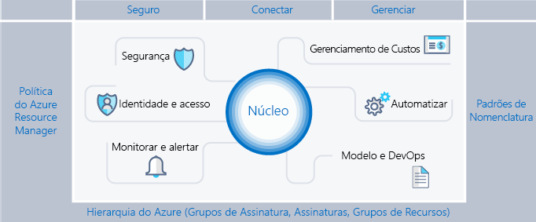
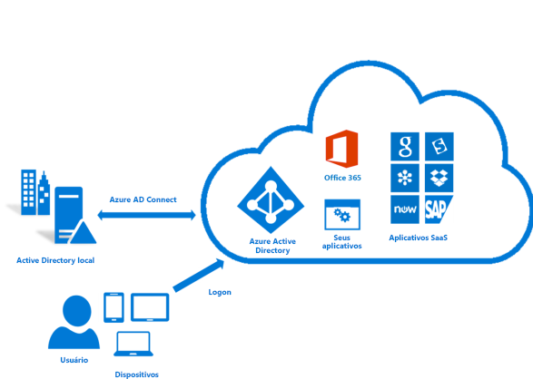
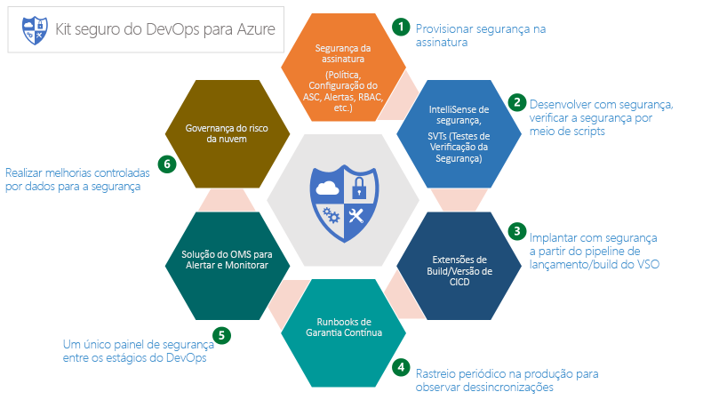
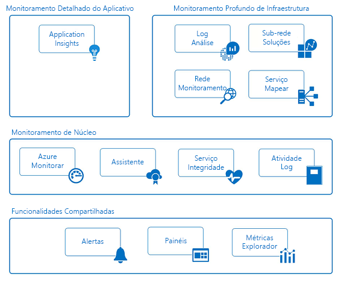

# Andaime do Azure Enterprise: Governança de assinatura prescritivaAzure enterprise scaffold: Prescriptive subscription governance

As empresas estão adotando cada vez mais a nuvem pública em busca de agilidade e flexibilidade.Enterprises are increasingly adopting the public cloud for its agility and flexibility. Elas utilizam os pontos fortes da nuvem para gerar receita e otimizar o uso de recursos para os negócios.They utilize the cloud's strengths to generate revenue and optimize resource usage for the business. O Microsoft Azure fornece diversos serviços e recursos que as empresas montam como blocos de construção para atender a uma ampla gama de aplicativos e cargas de trabalho.Microsoft Azure provides a multitude of services and capabilities that enterprises assemble like building blocks to address a wide array of workloads and applications.

Decidir usar o Microsoft Azure é apenas a primeira etapa para obter o benefício da nuvem.Deciding to use Microsoft Azure is only the first step to achieving the benefit of the cloud. A segunda etapa é entender como a empresa pode usar o Azure efetivamente e identificar os recursos de linha de base que precisam estar em vigor para responder a perguntas como:The second step is understanding how the enterprise can effectively use Azure and identify the baseline capabilities that need to be in place to address questions like:

* “Estou preocupado com o domínio de dados; como posso garantir que meus dados e sistemas atendam aos nossos requisitos regulatórios?”"I'm concerned about data sovereignty; how can I ensure that my data and systems meet our regulatory requirements?"
* "Como saber o que cada recurso aceita para que eu possa responsabilizá-lo e cobrá-lo de volta precisamente?""How do I know what every resource is supporting so I can account for it and bill it back accurately?"
* “Eu quero ter certeza de que tudo o que podemos implantar ou fazer na nuvem pública comece com a ideia da segurança em primeiro lugar; como ajudar a facilitar isso?""I want to make sure that everything we deploy or do in the public cloud starts with the mindset of security first, how do I help facilitate that?"

A possibilidade de uma assinatura vazia sem recursos de segurança é assustadora.The prospect of an empty subscription with no guard rails is daunting. Esse espaço em branco pode atrasar sua migração para o Azure.This blank space can hamper your move to Azure.

Este artigo fornece um ponto de partida para que profissionais técnicos atendam à necessidade da governança e a equilibrem com a necessidade da agilidade.This article provides a starting point for technical professionals to address the need for governance and balance it with the need for agility. Aqui é apresentado o conceito de um andaime empresarial que orienta as organizações na implementação e no gerenciamento de seus ambientes do Azure de uma maneira segura.It introduces the concept of an enterprise scaffold that guides organizations in implementing and managing their Azure environments in a secure way. O artigo fornece a estrutura para desenvolver controles eficazes e eficientes.It provides the framework to develop effective and efficient controls.

## Necessidade de governançaNeed for governance

Ao migrar para o Azure, você deve abordar o tópico de governança antecipadamente para garantir o uso bem-sucedido da nuvem dentro da empresa.When moving to Azure, you must address the topic of governance early to ensure the successful use of the cloud within the enterprise. Infelizmente, o tempo e a burocracia necessários para criar um sistema abrangente de governança significam que alguns grupos de negócios chegam diretamente aos fornecedores sem se envolverem com a TI empresarial.Unfortunately, the time and bureaucracy of creating a comprehensive governance system means some business groups go directly to providers without involving enterprise IT. Essa abordagem pode comprometer a empresa se os recursos não forem gerenciados corretamente.This approach can leave the enterprise open to compromise if the resources are not properly managed. As características da nuvem pública — agilidade, flexibilidade e preço com base no consumo — são importantes para os grupos de negócios que precisam atender rapidamente às demandas dos clientes (internos e externos).The characteristics of the public cloud - agility, flexibility, and consumption-based pricing - are important to business groups that need to quickly meet the demands of customers (both internal and external). Porém, a TI empresarial precisa garantir que sistemas e dados sejam protegidos eficazmente.But, enterprise IT needs to ensure that data and systems are effectively protected.

Ao construir um prédio, o andaime é usado para criar a base de uma estrutura.When creating a building, scaffolding is used to create the basis of a structure. O andaime guia o plano geral, além de fornecer pontos de ancoragem para que mais sistemas permanentes sejam montados.The scaffold guides the general outline and provides anchor points for more permanent systems to be mounted. Um andaime empresarial é igual: um conjunto de controles flexíveis e recursos do Azure que fornecem estrutura ao ambiente, bem como âncoras para serviços criados com base na nuvem pública.An enterprise scaffold is the same: a set of flexible controls and Azure capabilities that provide structure to the environment, and anchors for services built on the public cloud. Ele fornece aos criadores (TI e grupos de negócios) uma base para criar e agregar novos serviços, mantendo a agilidade na entrega em mente.It provides the builders (IT and business groups) a foundation to create and attach new services keeping speed of delivery in mind.

Um andaime se baseia em práticas que coletamos dos muitos compromissos com clientes de vários tamanhos.The scaffold is based on practices we have gathered from many engagements with clients of various sizes. Esses clientes variam de pequenas organizações que desenvolvem soluções na nuvem até grandes empresas multinacionais, bem como fornecedores de software independentes que estão migrando cargas de trabalho e desenvolvendo soluções nativas na nuvem.Those clients range from small organizations developing solutions in the cloud to large multi-national enterprises and independent software vendors who are migrating workloads and developing cloud-native solutions. O andaime empresarial foi “criado especificamente” para ser flexível e aceitar cargas de TI tradicionais e cargas de trabalho ágeis; por exemplo, desenvolvedores que criam aplicativos SaaS (software como serviço) baseados em recursos da plataforma do Azure.The enterprise scaffold is "purpose-built" to be flexible to support both traditional IT workloads and agile workloads; such as, developers creating software-as-a-service (SaaS) applications based on Azure platform capabilities.

O andaime empresarial destina-se a ser a base de cada nova assinatura no Azure.The enterprise scaffold is intended to be the foundation of each new subscription within Azure. Ele permite aos administradores garantir que as cargas de trabalho atendam aos requisitos mínimos de governança de uma organização sem impedir que grupos de negócios e desenvolvedores cumpram rapidamente suas próprias metas.It enables administrators to ensure workloads meet the minimum governance requirements of an organization without preventing business groups and developers from quickly meeting their own goals. Nossa experiência mostra que isso acelera bastante o crescimento da nuvem pública, em vez de impedi-lo.Our experience shows that this greatly speeds, rather than impedes, public cloud growth.

> [!NOTE]
> A Microsoft lançou a versão prévia de um novo recurso chamado [Azure Blueprints](/azure/governance/blueprints/overview), que permitirá a você empacotar, gerenciar e implantar imagens, modelos, políticas e scripts comuns em assinaturas e grupos de gerenciamento.Microsoft has released into preview a new capability called [Azure Blueprints](/azure/governance/blueprints/overview) that will enable you to package, manage, and deploy common images, templates, policies, and scripts across subscriptions and management groups. Esse recurso é a ponte entre a finalidade do andaime como modelo de referência e a implantação desse modelo na organização.This capability is the bridge between the scaffold's purpose as reference model and deploying that model to your organization.
>
A imagem a seguir mostra os componentes do andaime.The following image shows the components of the scaffold. A base depende de um plano sólido para a hierarquia de gerenciamento e para as assinaturas.The foundation relies on a solid plan for the management hierarchy and subscriptions. Os pilares consistem em políticas do Resource Manager e sólidos padrões de nomenclatura.The pillars consist of Resource Manager policies and strong naming standards. O restante do andaime é composto pelos principais recursos e funcionalidades do Azure, que possibilitam e conectam um ambiente seguro e gerenciável.The rest of the scaffold are core Azure capabilities and features that enable and connect a secure and manageable environment.

## Definir sua hierarquiaDefine your hierarchy

A base do andaime é a hierarquia e o relacionamento do Registro empresarial do Azure para assinaturas e grupos de recursos.The foundation of the scaffold is the hierarchy and relationship of the Azure Enterprise Enrollment through to subscriptions and resource groups. O Registro empresarial define a forma e o uso dos serviços do Azure em uma empresa de um ponto de vista contratual.The enterprise enrollment defines the shape and use of Azure services within your company from a contractual point of view. No contrato empresarial, os clientes podem subdividir o ambiente em departamentos, contas e, por fim, em assinaturas e grupos de recursos correspondentes à estrutura de suas respectivas organizações.Within the enterprise agreement, you can further subdivide the environment into departments, accounts, and finally, subscriptions and resource groups to match your organization's structure.

Uma assinatura do Azure é a unidade básica onde todos os recursos estão contidos.An Azure subscription is the basic unit where all resources are contained. Ela também define vários limites dentro do Azure, como o número de núcleos, de redes virtuais e outros recursos.It also defines several limits within Azure, such as number of cores, virtual networks and other resources. Os Grupos de Recursos do Azure são usados para refinar o modelo de assinatura ainda mais e permitir um agrupamento mais natural de recursos.Azure Resource Groups are used to further refine the subscription model and enable a more natural grouping of resources.

Cada empresa é diferente e a hierarquia na imagem acima permite flexibilidade significativa em como o Azure é organizado dentro da sua empresa.Every enterprise is different and the hierarchy in the above image allows for significant flexibility in how Azure is organized within your company. A primeira &mdash; e mais importante &mdash; decisão que você pode tomar ao começar a usar a nuvem pública é modelar sua hierarquia para refletir as necessidades da sua empresa para cobrança, gerenciamento e acesso a recursos.Modeling your hierarchy to reflect the needs of your company for billing, resource management, and resource access is the first &mdash; and most important &mdash; decision you make when starting in the public cloud.

### Departamentos e contasDepartments and Accounts

Os três padrões comuns para inscrições do Azure são:The three common patterns for Azure Enrollments are:

* O padrão **funcional**The **functional** pattern

    
* O padrão da **unidade de negócios**The **business unit** pattern

    
* O padrão **geográfico**The **geographic** pattern

    

Embora cada um desses padrões tenha o seu lugar, o padrão de **unidade de negócios** está sendo cada vez mais adotado devido à sua flexibilidade na criação de um modelo de custo da organização e porque ele reflete o alcance de controle.Though each of these patterns has its place, the **business unit** pattern is increasingly being adopted for its flexibility in modeling an organization's cost model as well as reflecting span of control. O grupo de Engenharia e Operações Fundamentais da Microsoft criou um subconjunto do padrão de **unidade de negócios** que é muito eficaz, modelado como **Federal**, **Estadual** e **Local**.Microsoft Core Engineering and Operations group has created a sub-set of the **business unit** pattern that is very effective, modeled on **Federal**, **State**, and **Local**. (Para obter mais informações, consulte [Organizar assinaturas e grupos de recursos na empresa](https://azure.microsoft.com/blog/organizing-subscriptions-and-resource-groups-within-the-enterprise/).)(For more information, see [Organizing subscriptions and resource groups within the Enterprise](https://azure.microsoft.com/blog/organizing-subscriptions-and-resource-groups-within-the-enterprise/).)

### Grupos de GerenciamentoManagement Groups

A Microsoft lançou recentemente uma nova maneira de modelar sua hierarquia: [Grupos de gerenciamento do Azure](/azure/azure-resource-manager/management-groups-overview).Microsoft has recently released a new way of modeling your hierarchy: [Azure management groups](/azure/azure-resource-manager/management-groups-overview). Os grupos de gerenciamento são muito mais flexíveis do que os departamentos e contas e podem ser aninhados em até seis níveis.Management groups are much more flexible than departments and accounts and can be nested up to six levels. Os grupos de gerenciamento permitem que você crie uma hierarquia separada da sua hierarquia de cobrança, exclusivamente para o gerenciamento eficiente de recursos.Management groups allow you to create a hierarchy that is separate from your billing hierarchy, solely for efficient management of resources. Os grupos de gerenciamento podem espelhar sua hierarquia de cobrança; e as empresas começam desse modo muitas vezes.Management groups can mirror your billing hierarchy and often enterprises start that way. No entanto, o poder dos grupos de gerenciamento surge quando você os utiliza para modelar a organização de modo que as assinaturas relacionadas &mdash; independentemente de onde elas estejam na hierarquia de cobrança, &mdash; sejam agrupadas e precisem de funções comuns atribuídas, assim como iniciativas e políticas.However, the power of management groups is when you use them to model your organization where related subscriptions &mdash; regardless where they are in the billing hierarchy &mdash; are grouped together and need common roles assigned as well as policies and initiatives. Alguns exemplos:A few examples:

* **Produção/não produção**.**Production/Non-Production**. Algumas empresas criam grupos de gerenciamento para identificar suas assinaturas de produção e não produção.Some enterprises create management groups to identify their production and non-production subscriptions. Os grupos de gerenciamento permitem que esses clientes gerenciem mais facilmente funções e políticas, por exemplo: uma assinatura que não é de produção pode permitir aos desenvolvedores o acesso de “colaborador”, mas em uma de produção, eles têm apenas acesso de “leitor”.Management groups allow these customers to more easily manage roles and policies, for example: non-production subscription may allow developers "contributor" access, but in production, they have only "reader" access.
* **Serviços internos/externos**.**Internal Services/External Services**. Assim como ocorre com o par produção/não produção, as empresas geralmente têm requisitos, políticas e funções diferentes para serviços internos e externos (voltados para o cliente).Much like Production/Non-Production, enterprises often have different requirements, policies and roles for internal services vs external (customer facing) services.

Grupos de gerenciamento bem pensados são, juntamente com o Azure Policy e as Iniciativas do Azure, a espinha dorsal de uma governança eficiente do Azure.Well thought out management groups are, along with Azure Policy and Initiatives the backbone of efficient governance of Azure.

### AssinaturasSubscriptions

Ao decidir sobre seus departamentos e contas (ou grupos de gerenciamento), você está examinando principalmente como dividir seu ambiente do Azure para corresponder à sua organização.When deciding on your Departments and Accounts (or management groups), you are primarily looking at how you're dividing up your Azure environment to match your organization. As assinaturas, no entanto, são onde o trabalho realmente acontece, e suas decisões aqui impactam a segurança, escalabilidade e cobrança.Subscriptions, however, are where the real work happens and your decisions here impact security, scalability and billing.  Muitas organizações examinam os seguintes padrões como guias:Many organizations look at the following patterns as their guides:

* **Aplicativo/serviço**: as assinaturas representam um aplicativo ou um serviço (portfólio de aplicativos)**Application/Service**: Subscriptions represent an application or a service (portfolio of applications)
* **Ciclo de vida**: as assinaturas representam um ciclo de vida de um serviço, como desenvolvimento ou produção.**Lifecycle**: Subscriptions represent a lifecycle of a service, such as Production or Development.
* **Departamento**: as assinaturas representam departamentos na organização.**Department**: Subscriptions represent departments in the organization.

Os dois primeiros padrões são mais comumente utilizados, e ambos são altamente recomendáveis.The first two patterns are the most commonly used, and both are highly recommended. A abordagem de Ciclo de vida é apropriada para a maioria das organizações.The Lifecycle approach is appropriate for most organizations. Nesse caso, a recomendação geral é usar duas assinaturas de base.In this case, the general recommendation is to use two base subscriptions. “Produção” e “Não produção”, depois use grupos de recursos para subdividir ainda mais os ambientes."Production" and "Non-Production," and then use resource groups to break out the environments further.

### Grupos de recursosResource groups

O Azure Resource Manager permite colocar recursos em grupos significativos para gerenciamento, cobrança ou afinidade natural.Azure Resource Manager enables you to put resources into meaningful groups for management, billing, or natural affinity. Os grupos de recursos são contêineres de recursos que têm um ciclo de vida comum ou compartilham um atributo, como "todos os servidores SQL" ou "Aplicativo A".Resource groups are containers of resources that have a common life cycle or share an attribute such as "all SQL servers" or "Application A".

Os grupos de recursos não podem ser aninhados e os recursos podem pertencer apenas a um grupo de recursos.Resource groups can't be nested, and resources can only belong to one resource group. Algumas ações podem agir em todos os recursos em um grupo de recursos.Some actions can act on all resources in a resource group. Por exemplo, a exclusão de um grupo de recursos remove todos os recursos do grupo de recursos.For example, deleting a resource group removes all resources within the resource group. Assim como as assinaturas, existem padrões comuns durante a criação de grupos de recursos e eles vão variar de cargas de trabalho de “TI tradicional” a cargas de trabalho de “TI Agile”:Like subscriptions, there are common patterns when creating resource groups and will vary from "Traditional IT" workloads to "Agile IT" workloads:

* As cargas de trabalho de “TI Tradicional” são mais frequentemente agrupadas por itens no mesmo ciclo de vida, como um aplicativo."Traditional IT" workloads are most commonly grouped by items within the same life cycle, such as an application. O agrupamento por aplicativo permite o gerenciamento individual de aplicativo.Grouping by application allows for individual application management.
* As cargas de trabalho "TI da Agile" tendem a se concentrar nos aplicativos de nuvem voltados para o cliente."Agile IT" workloads tend to focus on external customer-facing cloud applications. Os grupos de recursos muitas vezes refletem as camadas da implantação (como Camada da Web, Camada de Aplicativo) e o gerenciamento.The resource groups often reflect the layers of deployment (such as Web Tier, App Tier) and management.

> [!NOTE]
> Noções básicas sobre sua carga de trabalho ajudam a desenvolver uma estratégia de grupo de recursos.Understanding your workload helps you develop a resource group strategy. Esses padrões podem ser misturados e combinados.These patterns can be mixed and matched. Por exemplo, um grupo de recursos de serviços compartilhados na mesma assinatura como grupos de recursos “Agile”.For example, a shared services resource group in the same subscription as "Agile" resource groups.

## Padrões de nomenclaturaNaming standards

O primeiro pilar do andaime é um padrão consistente de nomenclatura.The first pillar of the scaffold is a consistent naming standard. Os padrões de nomenclatura bem definidos permitem identificar recursos no portal, em uma cobrança e dentro de scripts.Well-designed naming standards enable you to identify resources in the portal, on a bill, and within scripts. Você provavelmente já tem padrões de nomenclatura para a infraestrutura local.You likely already have existing naming standards for on-premises infrastructure. Ao adicionar o Azure ao seu ambiente, você deve estender esses padrões de nomenclatura para os recursos do Azure.When adding Azure to your environment, you should extend those naming standards to your Azure resources.

> [!TIP]
> Para convenções de nomenclatura:For naming conventions:
> * Analise e adote onde possível as [Orientações de padrões e práticas](https://docs.microsoft.com/en-us/azure/architecture/best-practices/naming-conventions).Review and adopt where possible the [Patterns and Practices guidance](https://docs.microsoft.com/en-us/azure/architecture/best-practices/naming-conventions). Essas diretrizes ajudam a decidir sobre um padrão de nomenclatura significativo e fornece exemplos abrangentes.This guidance helps you decide on a meaningful naming standard and provides extensive examples.
> * Usar políticas do Resource Manager para ajudar a impor padrões de nomenclaturaUsing Resource Manager Policies to help enforce naming standards
>
>Lembre-se de que é difícil alterar nomes mais tarde, portanto, alguns minutos agora evitarão problemas mais tarde.Remember that it's difficult to change names later, so a few minutes now will save you trouble later.

Concentre-se nos padrões de nomenclatura desses recursos que são mais comumente usados e pesquisados.Concentrate your naming standards on those resources that are more commonly used and searched for.  Por exemplo, todos os grupos de recursos devem seguir um padrão bem definido para maior clareza.For example, all resource groups should follow a strong standard for clarity.

### Marcações de recursosResource Tags

As marcas de recurso estão alinhadas diretamente com padrões de nomenclatura.Resource tags are tightly aligned with naming standards. Conforme recursos são adicionados às assinaturas, torna-se cada vez mais importante categorizá-los logicamente para fins operacionais, de gerenciamento e de cobrança.As resources are added to subscriptions, it becomes increasingly important to logically categorize them for billing, management, and operational purposes. Para obter mais informações, veja [Usar marcas para organizar os recursos do Azure](https://docs.microsoft.com/en-us/azure/azure-resource-manager/resource-group-using-tags).For more information, see [Use tags to organize your Azure Resource](https://docs.microsoft.com/en-us/azure/azure-resource-manager/resource-group-using-tags).

> [!IMPORTANT]
> As marcas podem conter informações pessoais e podem estar enquadradas nos regulamentos do RGPD.Tags can contain personal information and may fall under the regulations of GDPR. Planeje cuidadosamente o gerenciamento de suas marcas.Plan for management of your tags carefully. Se você estiver buscando informações gerais sobre o GDPR, confira a seção sobre GDPR do [Portal de Confiança do Serviço](https://servicetrust.microsoft.com/ViewPage/GDPRGetStarted).If you're looking for general info about GDPR, see the GDPR section of the [Service Trust Portal](https://servicetrust.microsoft.com/ViewPage/GDPRGetStarted).

As marcas são usadas de várias maneiras, além de gerenciamento e cobrança.Tags are used in many ways beyond billing and management. Geralmente, eles são usados como parte da automação (consulte a seção posterior).They are often used as part of automation (see later section). Isso pode causar conflitos se não for considerado de antemão.This can cause conflicts if not considered up front. A prática recomendada é identificar todas as marcas comuns no nível corporativo (por exemplo, ApplicationOwner, CostCenter) e aplicá-las de forma consistente ao implantar recursos usando a automação.The recommended practice is to identify all the common tags at the enterprise level (such as ApplicationOwner, CostCenter) and apply them consistently when deploying resources using automation.

## Azure Policy e Iniciativas do AzureAzure Policy and Initiatives

O segundo pilar do andaime envolve o uso de [Azure Policy e Iniciativas do Azure](/azure/azure-policy/azure-policy-introduction) para gerenciar o risco pela imposição de regras (com efeitos) sobre os recursos e serviços em suas assinaturas.The second pillar of the scaffold involves using [Azure Policy and Initiatives](/azure/azure-policy/azure-policy-introduction) to manage risk by enforcing rules (with effects) over the resources and services in your subscriptions. Iniciativas do Azure são coleções de políticas que são projetadas para alcançar uma única meta.Azure Initiatives are collections of policies that are designed to achieve a single goal. O Azure Policy e as Iniciativas do Azure são atribuídos a um escopo de recursos para começar a imposição das diretivas especificadas.Azure policy and initiatives are then assigned to a resource scope to begin enforcement of the particular policies.

O Azure Policy e as Iniciativas do Azure são ainda mais eficientes quando usadas com os grupos de gerenciamento mencionados anteriormente.Azure Policy and Initiatives are even more powerful when used with the management groups mentioned earlier. Os grupos de gerenciamento permitem a atribuição de uma iniciativa ou política para um conjunto inteiro de assinaturas.Management groups enable the assignment of an initiative or policy to an entire set of subscriptions.

### Usos comuns das políticas do Resource ManagerCommon uses of Resource Manager policies

As políticas e iniciativas do Azure são uma poderosa ferramenta do kit de ferramentas do Azure.Azure policies and initiatives are a powerful tool in the Azure toolkit. As políticas permitem às empresas fornecer controles para cargas de trabalho de “TI tradicional” que permitem a estabilidade necessária para aplicativos de LOB, permitindo também cargas de trabalho “Agile”; por exemplo, desenvolver aplicativos de cliente sem expor a empresa a riscos adicionais.Policies allow companies to provide controls for "Traditional IT" workloads that enable the stability that is needed for LOB applications while also allowing "Agile" workloads; such as, developing customer applications without opening up the enterprise to additional risk. Os padrões mais comuns que vemos para políticas são:The most common patterns we see for policies are:

* **Domínio geográfico de conformidade/dados**.**Geo-compliance/data sovereignty**. O Azure tem uma lista crescente de regiões em todo o mundo.Azure has an ever-growing list of regions across the world. As empresas geralmente precisam garantir que recursos em um determinado escopo permaneçam em uma região geográfica para atender aos requisitos regulatórios.Enterprises often need to ensure that resources in a particular scope remain in a geographic region to address regulatory requirements.
* **Evite expor publicamente os servidores**.**Avoid exposing servers publicly**. O Azure Policy pode impedir a implantação de certos tipos de recursos.Azure policy can prohibit the deployment of certain resources types. Um uso comum é criar uma política para negar a criação de um IP público dentro de um determinado escopo, evitando a exposição não intencional de um servidor à Internet.A common use is to create a policy to deny the creation of a public IP within a particular scope, avoiding un-intended exposure of a server to the internet.
* **Gerenciamento de Custos e Metadados**.**Cost Management and Metadata**. As marcas de recurso são geralmente usadas para adicionar dados de cobrança importantes a recursos e grupos de recursos, como o CostCenter, Proprietário e muito mais.Resource tags are often used to add important billing data to resources and resource groups such as CostCenter, Owner and more. Essas marcas são imprescindíveis para uma cobrança e gerenciamento precisos dos recursos.These tags are invaluable for accurate billing and management of resources. As políticas podem impor a aplicação de marcas de recursos a todos os recursos implantados, facilitando o gerenciamento destes.Policies can enforce the application of resources tags to all deployed resource, making it easier to manage.

### Usos comuns de iniciativasCommon uses of initiatives

A introdução de iniciativas ofereceu às empresas uma maneira de agrupar as políticas de lógicas e controlá-las como um todo.The introduction of initiatives provided enterprises a way to group logical policies together and track as a whole. Iniciativas também oferecem suporte à empresa para atender às necessidades das cargas de trabalho “Agile” e “tradicionais”.Initiatives further support the enterprise to address the needs of both "agile" and "traditional" workloads. Temos visto usos muito criativos de iniciativas, mas geralmente vemos:We have seen very creative uses of initiatives, but commonly we see:

* **Habilitar o monitoramento na Central de Segurança do Azure**.**Enable monitoring in Azure Security Center**. Essa é uma iniciativa de padrão no Azure Policy e um ótimo exemplo sobre o que são as iniciativas.This is a default initiative in the Azure Policy and an excellent example of what initiative are. Ela permite políticas que identificam os bancos de dados SQL não criptografados, vulnerabilidades relacionadas à VM e necessidades de segurança mais comuns.It enables policies that identify un-encrypted SQL databases, VM vulnerabilities and more common security related needs.
* **Iniciativa específica regulatória**.**Regulatory specific initiative**. As empresas geralmente agrupam políticas comuns em um requisito regulatório (como HIPAA) para que os controles e a conformidade a esses controles sejam acompanhados com eficiência.Enterprises often group policies common to a regulatory requirement (such as HIPAA) so that controls and compliancy to those controls are tracked efficiently.
* **Tipos de recurso e SKUs**.**Resource Types & SKUs**. Criar uma iniciativa que restrinja os tipos de recursos que podem ser implantados, bem como as SKUs que podem ser implantadas pode ajudar a controlar os custos e garantir que sua organização esteja implantando somente recursos para os quais sua equipe possui o conjunto de qualificações e procedimentos para dar suporte.Creating an initiative that restricts the types of resources that can be deployed as well as the SKUs that can be deployed can help to control costs and ensure your organization is only deploying resources that your team have the skillset and procedures to support.

> [!TIP]
> É recomendável que você use sempre definições de iniciativa em vez de definições de política.We recommend you always use initiative definitions instead of policy definitions. Depois de atribuir uma iniciativa a um escopo, como assinatura ou grupo de gerenciamento, você pode adicionar facilmente outra política à iniciativa sem precisar alterar as atribuições.After assigning an initiative to a scope, such as subscription or management group, you can easily add another policy to the initiative without having to change any assignments. Isso facilita bastante entender o que é aplicado e o acompanhamento da conformidade.This makes understanding what is applied and tracking compliance far easier.

### Atribuições de Iniciativa e PolíticaPolicy and Initiative assignments

Após criar políticas e agrupá-las em iniciativas lógicas você deve atribuir a política a um escopo, se ela um grupo de gerenciamento, uma assinatura ou até mesmo um grupo de recursos.After the creation of policies and grouping them into logical initiatives you must assign the policy to a scope, whether it is a management group, a subscription or even a resource group. As atribuições permitem que você também exclua um subescopo da atribuição de uma política.Assignments allow you to also exclude a sub-scope from the assignment of a policy. Por exemplo, se você negar a criação de IPs públicos em uma assinatura, você pode criar uma atribuição com uma exclusão para um grupo de recursos conectado à sua rede de perímetro protegida.For example, if you deny the creation of public IPs within a subscription, you could create an assignment with an exclusion for a resource group connected to your protected DMZ.

Você encontrará vários exemplos de política que mostram como iniciativas e políticas podem ser aplicadas a vários recursos no Azure neste repositório [GitHub](https://github.com/Azure/azure-policy).You will find several Policy examples that show how Policy and Initiatives can be applied to various resources within Azure on this [GitHub](https://github.com/Azure/azure-policy) repository.

## Gerenciamento de identidade e de acessoIdentity and access management

Uma das primeira e mais importantes perguntas que você se faz ao começar a usar a nuvem pública é “quem devem ter acesso aos recursos?”One of the first, and most crucial, questions you ask yourself when starting with the public cloud is "who should have access to resources?" e "como controlar esse acesso?"and "how do I control this access?" Permitir ou negar acesso ao portal do Azure, bem como controlar o acesso aos recursos no portal é essencial para o sucesso a longo prazo e para a segurança dos seus ativos na nuvem.Allowing or disallowing access to the Azure portal, and controlling access to resources in the portal is critical to the long term success and safety of your assets in the cloud.

Para executar a tarefa de proteger o acesso aos seus recursos você primeiro configura seu provedor de identidade e, em seguida, configura o acesso e as funções.To accomplish the task of securing access to your resources you will first configure your identity provider and then configure Roles and access. O Azure Active Directory (Azure AD), conectado ao seu Active Directory local, é a base da identidade do Azure Identity.Azure Active Directory (Azure AD), connected to your on-premises Active Directory, is the foundation of Azure Identity. Dito isto, o Azure AD *não* é o Active Directory e é importante entender o que é um locatário do Azure AD e como ele se relaciona ao seu registro no Azure.That said, Azure AD is *not* Active Directory and it's important to understand what an Azure AD tenant is and how it relates to your Azure enrollment.  Examine as [informações](../getting-started/azure-resource-access.md) disponíveis para ter uma base sólida sobre o Azure AD e o AD.Review the available [information](../getting-started/azure-resource-access.md) to gain a solid foundation on Azure AD and AD. Para conectar e sincronizar seu Active Directory ao Azure AD, instale e configure a [ferramenta AD Connect](/azure/active-directory/connect/active-directory-aadconnect) local.To connect and synchronize your Active Directory to Azure AD, install and configure the [AD Connect tool](/azure/active-directory/connect/active-directory-aadconnect) on-premises.

Quando o Azure foi inicialmente lançado, os controles de acesso para uma assinatura eram básicos: Administrador ou Coadministrador.When Azure was initially released, access controls to a subscription were basic: Administrator or Co-Administrator. O acesso a uma assinatura no modelo Clássico implicava acesso a todos os recursos no portal.Access to a subscription in the Classic model implied access to all the resources in the portal. Essa falta de um controle refinado levou à proliferação de assinaturas para fornecer um nível de controle de acesso razoável para uma Inscrição no Azure.This lack of fine-grained control led to the proliferation of subscriptions to provide a level of reasonable access control for an Azure Enrollment. Essa proliferação de assinaturas não é mais necessária.This proliferation of subscriptions is no longer needed. Com o controle de acesso baseado em função (RBAC), você pode atribuir usuários às funções padrão que fornecem acesso comum, como “proprietário”, “colaborador” ou “leitor” ou até mesmo criar suas próprias funçõesWith role-based access control (RBAC), you can assign users to standard roles that provide common access such as "owner", "contributor" or "reader" or even create your own roles

Ao implementar acesso baseado em função, o código a seguir é altamente recomendável:When implementing role-based access, the following are highly recommended:

* Controle o Administrador/Coadministrador de uma assinatura já que essas funções têm permissões abrangentes.Control the Administrator/Co-Administrator of a subscription as these roles have extensive permissions. Você só precisa adicionar o Proprietário da Assinatura como um Coadministrador caso ele precise gerenciar implantações clássicas do Azure.You only need to add the Subscription Owner as a Co-administrator if they need to managed Azure Classic deployments.

* Use Grupos de Gerenciamento para atribuir [funções](/azure/azure-resource-manager/management-groups-overview#management-group-access) entre várias assinaturas e reduzir a carga de gerenciá-las no nível da assinatura.Use Management Groups to assign [roles](/azure/azure-resource-manager/management-groups-overview#management-group-access) across multiple subscriptions and reduce the burden of managing them at the subscription level.
* Adicione usuários do Azure a um grupo (por exemplo, Proprietários do Aplicativo X) no Active Directory.Add Azure users to a group (for example, Application X Owners) in Active Directory. Use o grupo sincronizado para fornecer aos membros do grupo os direitos apropriados para gerenciar o grupo de recursos que contém o aplicativo.Use the synced group to provide group members the appropriate rights to manage the resource group containing the application.
* Siga o princípio de conceder o **privilégio mínimo** exigido para realizar o trabalho esperado.Follow the principle of granting the **least privilege** required to do the expected work.

> [!IMPORTANT]
>Considere o uso dos recursos de [Azure AD Privileged Identity Management](/azure/active-directory/privileged-identity-management/pim-configure), [Autenticação Multifator](/azure/active-directory/authentication/howto-mfa-getstarted) do Azure e [Acesso Condicional](/azure/active-directory/active-directory-conditional-access-azure-portal) para fornecer uma melhor segurança e mais visibilidade para ações administrativas em suas assinaturas do Azure.Consider using [Azure AD Privileged Identity Management](/azure/active-directory/privileged-identity-management/pim-configure), Azure [Multi-Factor Authentication](/azure/active-directory/authentication/howto-mfa-getstarted) and [Conditional Access](/azure/active-directory/active-directory-conditional-access-azure-portal) capabilities to provide better security and more visibility to administrative actions across your Azure subscriptions. Esses recursos são provenientes de uma licença válida do Azure AD Premium (dependendo do recurso) para proteger ainda mais e gerenciar sua identidade.These capabilities come from a valid Azure AD Premium license (depending on the feature) to further secure and manage your identity. O Azure AD PIM habilita a acesso administrativo “Just In Time” com o fluxo de trabalho de aprovação, bem como uma auditoria completa de atividades e ativações do administrador.Azure AD PIM enables "Just-in-Time" administrative access with approval workflow, as well as a full audit of administrator activations and activities. A MFA do Azure é outro recurso crítico e permite a verificação em duas etapas para fazer logon no portal do Azure.Azure MFA is another critical capability and enables two-step verification for login to the Azure portal. Combinados com Controles de Acesso Condicional você pode gerenciar com eficiência o risco de ameaça à segurança.When combined with Conditional Access Controls you can effectively manage your risk of compromise.

Planejar e preparar a sua identidade e os controles de acesso e seguir a prática recomendada do Azure Identity Management ([link](/azure/security/azure-security-identity-management-best-practices)) é uma das melhores estratégias de mitigação de risco que você pode empregar e deve ser considerada obrigatória para cada implantação.Planning and preparing for your identity and access controls and following Azure Identity Management best practice ([link](/azure/security/azure-security-identity-management-best-practices)) is one of the best risk mitigation strategies that you can employ and should be considered mandatory for every deployment.

## SegurançaSecurity

Talvez um dos maiores impedimentos à adoção da nuvem de forma tradicional tenham sido as preocupações com a segurança.One of the biggest blockers to cloud adoption traditionally has been concerns over security. Os gerentes de risco em TI e os departamentos de segurança precisam garantir que os recursos no Azure estejam protegidos e seguros por padrão.IT risk managers and security departments need to ensure that resources in Azure are protected and secure by default. O Azure fornece uma série de recursos que você pode aproveitar para proteger os recursos e detectar/impedir ameaças em relação a esses recursos.Azure provides a number of capabilities that you can leverage to protect resources and detect/prevent threats against those resources.

### Central de Segurança do AzureAzure Security Center

A [Central de Segurança do Azure](/azure/security-center/security-center-intro) oferece uma exibição unificada do status de segurança dos recursos em seu ambiente, além de proteção avançada contra ameaças.The [Azure Security Center](/azure/security-center/security-center-intro) provides a unified view of the security status of resources across your environment in addition to advanced threat protection. A Central de Segurança do Azure é uma plataforma aberta que permite aos parceiros da Microsoft criar software que se conecte à Central de Segurança do Azure e aprimorar seus recursos.Azure Security Center is an open platform that enables Microsoft partners to create software that plugs into and enhance its capabilities. Os recursos de linha de base da Central de Segurança do Azure (camada gratuita) oferecem avaliação e recomendações que aprimorarão sua postura em relação à segurança.The baseline capabilities of Azure Security Center (free tier) provides assessment and recommendations that will enhance your security posture. Suas camadas pagas habilitam recursos adicionais e valiosos, como acesso de administração Just In Time e controles de aplicativo adaptáveis (lista de permissões).Its paid tiers enable additional and valuable capabilities such as Just In Time admin access and adaptive application controls (whitelisting).

> [!TIP]
>A Central de Segurança do Azure é uma ferramenta muito poderosa que é constantemente aprimorada e incorpora sempre novos recursos que você pode aproveitar para detectar ameaças e proteger sua empresa.Azure security center is a very powerful tool that is constantly being enhanced and incorporating new capabilities you can leverage to detect threats and protect your enterprise. É altamente recomendável sempre habilitar ASC.It is highly recommended to always enable ASC.

### Bloqueios de recursos do AzureAzure resource locks

À medida que sua organização adiciona serviços principais à assinatura, torna-se cada vez mais importante evitar interrupção nos negócios.As your organization adds core services to subscriptions it becomes increasingly important to avoid business disruption. Um tipo de interrupção que vemos com frequência é consequências não intencionais de scripts e ferramentas trabalhando contra uma assinatura do Azure, excluindo recursos por engano.One type of disruption that we often see is unintended consequences of scripts and tools working against an Azure subscription deleting resources mistakenly. Os [Bloqueios de recursos](/azure/azure-resource-manager/resource-group-lock-resources) permitem restringir operações nos recursos de alto valor, onde sua modificação ou exclusão teria um impacto significativo.[Resource Locks](/azure/azure-resource-manager/resource-group-lock-resources) enable you to restrict operations on high-value resources where modifying or deleting them would have a significant impact. Os bloqueios são aplicados a uma assinatura, grupo de recursos ou até mesmo recursos individuais.Locks are applied to a subscription, resource group, or even individual resources. O caso de uso comum é aplicar bloqueios a recursos fundamentais, como redes virtuais, gateways, grupos de segurança de rede e contas de armazenamento de chaves.The common use case is to apply locks to foundational resources such as virtual networks, gateways, network security groups and key storage accounts.

### Kit de ferramentas de DevOps seguroSecure DevOps Toolkit

O “Kit de Segurança do DevOps para Azure” (AzSK) é uma coleção de scripts, ferramentas, extensões, automações, etc. originalmente criado pela equipe de TI da própria Microsoft e lançado como software livre através do Github ([link](https://github.com/azsk/DevOpsKit-docs)).The "Secure DevOps Kit for Azure" (AzSK) is a collection of scripts, tools, extensions, automations, etc. originally created by Microsoft's own IT Team and released in OpenSource via Github ([link](https://github.com/azsk/DevOpsKit-docs)). O AzSK cuida das necessidades de segurança de ponta a ponta e a segurança dos recursos e da assinatura do Azure para equipes que usam automação extensiva e integra perfeitamente a segurança em fluxos de trabalho do DevOps nativo ajudando a proteger o DevOps essas áreas de 6 enfoque:AzSK caters to the end to end Azure subscription and resource security needs for teams using extensive automation and smoothly integrating security into native dev ops workflows helping accomplish secure dev ops with these 6 focus areas:

* Proteger a assinaturaSecure the subscription
* Permitir o desenvolvimento seguroEnable secure development
* Integrar segurança para CI/CDIntegrate security into CICD
* Garantia contínuaContinuous Assurance
* Alertas e monitoramentoAlerting & Monitoring
* Governança de risco na nuvemCloud Risk Governance

O AzSK é um conjunto avançado de ferramentas, scripts e informações que são uma parte importante de um plano de governança completo do Azure e incorporar isso no seu andaime é crucial para dar suporte a suas metas de gerenciamento de riscos de organizaçõesThe AzSK is a rich set of tools, scripts and information that are an important part of a full Azure governance plan and incorporating this into your scaffold is crucial to supporting your organizations risk management goals

### Gerenciamento de Atualizações do AzureAzure Update Management

Uma das principais tarefas que podem ser feitas para proteger o ambiente é garantir que os servidores tenham as atualizações mais recentes.One of the key tasks you can do to keep your environment safe is ensure that your servers are patched with the latest updates. Embora haja várias ferramentas para fazer isso, o Azure fornece a solução de [Gerenciamento de Atualizações do Azure](/azure/automation/automation-update-management) para tratar da identificação e da distribuição de patches críticos do sistema operacional.While there are many tools to accomplish this, Azure provides the [Azure Update Management](/azure/automation/automation-update-management) solution to address the identification and rollout of critical OS patches.  Ele faz uso da Automação do Azure (que é abordado na seção [Automatizar](#automate) mais adiante neste guia.It makes use of Azure Automation (which is covered in the [Automate](#automate) section, later in this guide.

## Monitoramento e alertasMonitor and alerts

Coletar e analisar a telemetria que fornece uma linha de visão sobre as atividades, métricas de desempenho, integridade e disponibilidade dos serviços que você está usando em todas as suas assinaturas do Azure é essencial para gerenciar proativamente seus aplicativos e infraestrutura e é uma necessidade fundamental de cada assinatura do Azure.Collecting and analyzing telemetry that provides line of sight into the activities, performance metrics, health and availability of the services you are using across all of your Azure subscriptions is critical to proactively manage your applications and infrastructure and is a foundational need of every Azure subscription. Cada serviço do Azure emite a telemetria na forma de Logs de atividades, Métricas e Logs de diagnóstico.Every Azure service emits telemetry in the form of Activity Logs, Metrics and Diagnostic Logs.

* Os **Log de atividades** descrevem todas as operações executadas nos recursos em suas assinaturas**Activity Logs** describe all operations performed on resources in your subscriptions
* As **Métricas** são informações numéricas emitidas de dentro de um recurso que descrevem o desempenho e a integridade de um recurso**Metrics** are numerical information emitted from within a resource that describe the performance and health of a resource
* Os **Logs de diagnóstico** são emitidos por um serviço do Azure e fornecem dados avançados e frequentes sobre a operação deste serviço.**Diagnostic Logs** are emitted by an Azure service and provide rich, frequent data about the operation of that service.

Essas informações podem ser exibidas e tratadas em vários níveis e estão sendo continuamente aperfeiçoadas.This information can be viewed and acted upon at multiple levels and are continually being improved. O Azure oferece recursos de monitoramento **compartilhado**, **principal** e **profundo** dos recursos do Azure por meio dos serviços descritos no diagrama a seguir.Azure provides **shared**, **core** and **deep** monitoring capabilities of Azure resources through the services outlined in the diagram below.

### Funcionalidades compartilhadasShared capabilities

* **Alertas**: você pode coletar cada log, eventos e métricas de recursos do Azure, mas sem a capacidade de ser notificado sobre condições críticas e de como atuar. Esses dados serão úteis somente para fins de histórico e análise forense.**Alerts**: You can collect every log, event and metric from Azure resources, but without the ability to be notified of critical conditions and act, this data is only useful for historic purposes and forensics. O Azure Alerts notifica proativamente sobre condições que você define para todos os seus aplicativos e infraestrutura.Azure Alerts proactively notify you of conditions you define across all your applications and infrastructure. Você pode criar regras de alerta nos logs, eventos e métricas que usam grupos de ações para notificar os conjuntos de destinatários.You create alert rules across logs, events and metrics that use action groups to notify sets of recipients. Os grupos de ação também fornecem a capacidade de automatizar a correção usando ações externas, como webhooks para executar runbooks de Automação do Azure e o Azure Functions.Action groups also provide the ability to automate remediation using external actions such as webhooks to run Azure Automation runbooks and Azure Functions.

* **Painéis**: os painéis permitem que você agregue exibições de monitoramento e combine dados de recursos e assinaturas para dar a você uma visão de toda a empresa sobre a telemetria dos recursos do Azure.**Dashboards**: Dashboards enable you to aggregate monitoring views and combine data across resources and subscriptions to give you an enterprise-wide view into the telemetry of Azure resources. Você pode criar e configurar seus próprios modos de exibição e compartilhá-los com outras pessoas.You can create and configure your own views and share them with others. Por exemplo, você poderia criar um painel composto por vários blocos para que os DBAs possam fornecer informações em todos os serviços de banco de dados do Azure, incluindo o BD SQL do Azure, banco de dados do Azure para PostgreSQL e o banco de dados do Azure para MySQL.For example, you could create a dashboard consisting of various tiles for DBAs to provide information across all Azure database services, including Azure SQL DB, Azure DB for PostgreSQL and Azure DB for MySQL.

* **Metrics Explorer**: métricas são valores numéricos gerados pelos recursos do Azure (por exemplo, porcentagem de CPU, E/S de disco), que fornecem informações sobre a operação e o desempenho dos seus recursos.**Metrics Explorer**: Metrics are numerical values generated by Azure resources (e.g. % CPU, Disk I/O, that provide insight into the operation and performance of your resources. Usando o Metrics Explorer, você pode definir e enviar as métricas no qual você está interessado ao Log Analytics para agregação e análise.By using Metrics Explorer you can define and send the metrics in which you are interested to Log Analytics for aggregation and analysis.

### Monitoramento principalCore monitoring

* **Azure Monitor**: é o serviço de plataforma principal que fornece uma única fonte para monitorar os recursos do Azure.**Azure Monitor**: Azure Monitor is the core platform service that provides a single source for monitoring Azure resources. A interface do Portal do Azure do Azure Monitor fornece um ponto de partida centralizado para todos os recursos de monitoramento no Azure, incluindo os recursos de monitoramento profundo do Application Insights, Log Analytics, Monitor de Rede, Soluções de Gerenciamento e Mapas do Serviço.The Azure Portal interface of Azure Monitor provides a centralized jump off point for all the monitoring features across Azure including the deep monitoring capabilities of Application Insights, Log Analytics, Network Monitoring, Management Solutions and Service Maps. Com o Azure Monitor, é possível visualizar, consultar, rotear, arquivar e executar ações nas métricas e nos logs provenientes dos recursos do Azure em toda a sua nuvem.With Azure Monitor you can visualize, query, route, archive and act on the metrics and logs coming from Azure resources across your entire cloud estate. Além do portal, você pode recuperar dados por meio de cmdlets do PowerShell do Monitor, da CLI de plataforma cruzada ou das APIs REST do Azure Monitor.In addition to the portal you can retrieve data through the Monitor PowerShell Cmdlets, Cross Platform CLI or the Azure Monitor REST APIs.

* **Assistente do Azure**: o Assistente do Azure monitora a telemetria em suas assinaturas e ambientes constantemente e fornece recomendações sobre as melhores práticas sobre como otimizar seus recursos do Azure para economizar dinheiro e melhorar o desempenho, segurança e disponibilidade dos recursos que compõem seus aplicativos.**Azure Advisor**: Azure Advisor constantly monitors telemetry across your subscriptions and environments and provides recommendations on best practices on how to optimize your Azure resources to save money and improve performance, security and availability of the resources that make up your applications.

* **Integridade do Serviço**: a Integridade do Serviço do Azure identifica os problemas com os Serviços do Azure que podem afetar seus aplicativos, além de ajudar no planejamento de janelas de manutenção agendada.**Service Health**: Azure Service Health identifies any issues with Azure Services that may impact your applications as well as assists you in planning for scheduled maintenance windows.

* **Log de atividades**: o Log de atividades descreve todas as operações executadas nos recursos em suas assinaturas.**Activity Log**: The Activity Log describes all operations on resources in your subscriptions. Ele fornece uma trilha de auditoria para determinar “o que”, “quem” e “quando” de qualquer operação de criação, atualização e exclusão de recursos.It provides an audit trail to determine the 'what', 'who', and 'when' of any create, update, delete operation on resources. Os eventos do Log de Atividades são armazenados na plataforma e ficam disponíveis para consulta por 90 dias.Activity Log events are stored in the platform and are available to query for 90 days. Você pode ingerir os Logs de atividade para o Log Analytics para maiores períodos de retenção e consultas e análises mais profundas em vários recursos.You can ingest Activity Logs into Log Analytics for longer retention periods and deeper querying and analysis across multiple resources.

### Monitoramento profundo de aplicativosDeep application monitoring

* **Application Insights**: o Application Insights permite que você colete telemetria específica do aplicativo e monitore o desempenho, a disponibilidade e o uso de aplicativos na nuvem ou locais.**Application Insights**: Application Insights enables you to collect application specific telemetry and monitor the performance, availability and usage of applications in the cloud or on-premises. Ao instrumentar seu aplicativo com os SDKs com suporte para várias linguagens, incluindo .NET, JavaScript, JAVA, Node.js, Ruby e Python.By instrumenting your application with supported SDKs for multiple languages including .NET, JavaScript, JAVA, Node.js, Ruby and Python. Os eventos do Application Insights são ingeridos no mesmo armazenamento de dados do Log Analytics que dá suporte à infraestrutura e monitoramento de segurança para que você possa correlacionar e agregar eventos ao longo do tempo por meio de uma linguagem de consulta avançada.Application Insights events are ingested into the same Log Analytics data store that supports infrastructure and security monitoring to enable you to correlate and aggregate events over time through a rich query language.

### Monitoramento profundo de infraestruturaDeep infrastructure monitoring

* **Log Analytics**: o Log Analytics desempenha um papel central no monitoramento do Azure ao coletar a telemetria e outros dados de diversas fontes e fornecer um mecanismo de linguagem de consulta e de análise que fornece informações sobre a operação de seus aplicativos e recursos.**Log Analytics**: Log Analytics plays a central role in Azure monitoring by collecting telemetry and other data from a variety of sources and providing a query language and analytics engine that gives you insights into the operation of your applications and resources. Você pode interagir diretamente com os dados do Log Analytics por meio de exibições e pesquisas de log de alto desempenho ou usar as ferramentas de análise em outros serviços do Azure que armazenam seus dados no Log Analytics, como o Application Insights e a Central de Segurança do Azure.You can either interact directly with Log Analytics data through highly performant log searches and views, or you may use analysis tools in other Azure services that store their data in Log Analytics such as Application Insights or Azure Security Center.

* **Monitoramento de rede**: os serviços de monitoramento de rede do Azure permitem que você obtenha informações sobre o fluxo de tráfego de rede, desempenho, segurança, conectividade e gargalos.**Network Monitoring**: Azure's network monitoring services enable you to gain insight into network traffic flow, performance, security, connectivity and bottlenecks. Um design de rede bem planejado deve incluir a configuração de serviços de monitoramento de rede do Azure, como o Observador de Rede e o Monitor do ExpressRoute.A well-planned network design should include configuring Azure network monitoring services such as Network Watcher and ExpressRoute Monitor.

* **Soluções de gerenciamento**: as soluções de gerenciamento são conjuntos empacotados de lógica, insights e consultas do Log Analytics predefinidas para um aplicativo ou serviço.**Management Solutions**: Management solutions are packaged sets of logic, insights and pre-defined Log Analytics queries for an application or service. Elas dependem do Log Analytics como base para armazenar e analisar dados de evento.They rely on Log Analytics as the foundation to store and analyze event data. Os exemplos de soluções de gerenciamento incluem o monitoramento de contêineres e análise de Banco de Dados SQL do Azure.Sample management solutions include monitoring containers and Azure SQL Database analytics.

* **Mapa do Serviço**: o Mapa do Serviço fornece uma exibição gráfica em seus componentes de infraestrutura, seus processos e interdependências em outros computadores e processos externos.**Service Map**: Service Map provides a graphical view into your infrastructure components, their processes and interdependencies on other computers and external processes. Ele integra soluções de gerenciamento, eventos e dados de desempenho ao Log Analytics.It integrates events, performance data and management solutions in Log Analytics.

> [!TIP]
> Antes de criar alertas individuais, crie e mantenha um conjunto compartilhado de Grupos de Ação que pode ser usado para os Alertas do Azure.Before creating individual alerts, create and maintain a set of shared Action Groups that can be used across Azure Alerts. Isso permitirá que você mantenha centralmente o ciclo de vida de listas de destinatários, métodos de entrega de notificação (email, números de telefone para SMS) e webhooks para ações externas (runbooks de Automação do Azure, Azure Functions / Aplicativos Lógicos, ITSM).This will enable you to centrally maintain the lifecycle of your recipient lists, notification delivery methods (email, SMS phone numbers) and webhooks to external actions (Azure Automation runbooks, Azure Functions / Logic Apps, ITSM).

## Gerenciamento de custoCost management

Uma das principais alterações que você enfrentará mudar da nuvem local para a nuvem pública é a mudança de gastos de capital (comprar hardware) para gastos operacionais (pagar por serviço conforme você o utiliza).One of the major changes that you will face when you move from on-premises cloud to the public cloud is the switch from capital expenditure (buying hardware) to operating expenditure (paying for service as you use it). Essa mudança de CAPEX para OPEX também traz a necessidade de gerenciar com mais cuidado seus custos.This switch from CAPEX to OPEX also brings the need to more carefully manage your costs. O benefício da nuvem é que você pode afetar essencial e positivamente o custo de um serviço usado apenas desativando-o (ou redimensionando-o) quando ele não for necessário.The benefit of the cloud is that you can fundamentally and positively impact the cost of a service you use by merely turning it off (or resizing) when it's not needed. Deliberadamente gerenciar seus custos na nuvem é uma prática recomendada e que os clientes maduros fazem diariamente.Deliberately managing your costs in the cloud is a recommended practice and one that mature customers do daily.

A Microsoft fornece várias ferramentas para você poder visualizar, controlar e gerenciar seus custos.Microsoft provides a several tools for you to be able to visual, track and manage your costs. Nós também fornecemos um conjunto completo de APIs para que você possa personalizar e integrar o gerenciamento de custos em suas próprias ferramentas e painéis.We also provide a full set of APIs to enable you to customize and integrate cost management into your own tools and dashboards. Essas ferramentas são agrupadas livremente em: Recursos do Portal do Azure e recursos externosThese tools are loosely grouped into: Azure Portal Capabilities and external capabilities

### Recursos do Portal do AzureAzure Portal capabilities

Essas são ferramentas para fornecer informações instantâneas sobre custo, bem como a capacidade de executar açõesThese are tools to provide you instant information on cost as well as the ability to take actions

* **Custo do Recurso de Assinatura**: localizada no Portal, a exibição da [Análise de Custo do Azure](/azure/cost-management/overview) fornece uma visão geral de seus custos e informações sobre os gastos diários por recurso ou grupo de recursos.**Subscription Resource Cost**: Located in The Portal, the [Azure Cost Analysis](/azure/cost-management/overview) view provides a quick look at your costs and information on daily spend by resource or resource group.
* **Gerenciamento de Custos do Azure**: este produto é o resultado da compra da Cloudyn pela Microsoft e permite que você gerencie e analise seus gastos com o Azure e também o que você gasta em outros provedores de nuvem pública.**Azure Cost Management**: This product is the result of the purchase of Cloudyn by Microsoft and allows you to manage and analyze your Azure spend as well what you spend on other Public Cloud providers. Há uma camada gratuita e outra paga, com uma grande variedade de recursos conforme visto na [visão geral](/azure/cost-management/overview).There are both free and paid tiers, with a great wealth of capabilities as seen in the [overview](/azure/cost-management/overview).
* **Grupos de Ações e Azure Orçamentos**: saber quanto algo custa e fazer algo sobre isso, até recentemente, era mais um trabalho manual.**Azure Budgets and Action Groups** Knowing what somethings costs and doing something about it until recently has been more of a manual exercise. Com a introdução do Azure Orçamentos e suas APIs, agora é possível criar ações (como visto [neste](https://channel9.msdn.com/Shows/Azure-Friday/Managing-costs-with-the-Azure-Budgets-API-and-Action-Groups) exemplo) quando os custos atingem um limite.With the introduction of Azure Budgets and its APIs, it's now possible to create actions (as seen in [this](https://channel9.msdn.com/Shows/Azure-Friday/Managing-costs-with-the-Azure-Budgets-API-and-Action-Groups) example) when costs hit a threshold. Por exemplo, desligar um grupo de recursos de “teste” quando este atinge 100% de seu orçamento ou [outro exemplo].For example, shutting down a "test" resource group when it hits 100% of its budget, or [another example].
* **Assistente do Azure**: saber quanto algo custa é apenas a metade; a outra metade é saber o que fazer com essas informações.**Azure Advisor** Knowing what something costs is only half the battle; the other half is knowing what to do with that information. O [Assistente do Azure](/azure/advisor/advisor-overview) fornece recomendações sobre as ações necessárias para economizar dinheiro, melhorar a confiabilidade ou até mesmo aumentar a segurança.[Azure Advisor](/azure/advisor/advisor-overview) provides you recommendations on actions to take to save money, improve reliability or even increase security.

### Ferramentas de gerenciamento de custos externasExternal cost management tools

* **Azure Consumption Insights do Power BI**.**PowerBI Azure Consumption Insights**. Você deseja criar suas próprias visualizações para sua organização?Do you want to create your own visualizations for your organization? Nesse caso, o pacote de conteúdo do Azure Consumption Insights para PowerBI é sua ferramenta de escolha.If so, then the Azure Consumption Insights content pack for PowerBI is your tool of choice. Usando este pacote de conteúdo e o PowerBI, você pode criar visualizações personalizadas para representar sua organização, fazer uma análise mais profunda sobre os custos e adicionar outras fontes de dados para aprimoramento adicional.Using this content pack and PowerBI you can create custom visualizations to represent your organization, do deeper analysis on costs and add in other data sources for further enrichment.

* **API de consumo**.**Consumption API**. As [APIs de consumo](/rest/api/consumption/) oferecem acesso programático aos dados de uso e custo, além de informações sobre orçamentos, instâncias reservadas e cobranças do marketplace.The [consumption APIs](/rest/api/consumption/) give you programmatic access to cost and usage data in addition to information on budgets, reserved instances and marketplace charges. Essas APIs são acessíveis somente para Registros Enterprise e algumas assinaturas Web Direct, porém oferecem a capacidade de integrar seus dados de custo em suas próprias ferramentas e data warehouses.These APIs are accessible only for Enterprise Enrollments and some Web Direct subscriptions however they give you the ability to integrate your cost data into your own tools and data warehouses. Você também pode acessar essas APIs usando a CLI do Azure, visto [aqui](/cli/azure/consumption?view=azure-cli-latest).You can also access these APIs by using the Azure CLI, seen [here](/cli/azure/consumption?view=azure-cli-latest).

Quando olhamos entre os clientes que usaram a nuvem por muito tempo e são “maduros” em termos de uso, podemos ver várias práticas altamente recomendadasWhen we look across customers who have used the cloud for a long time and are "mature" in their use, we see a number of highly recommended practices

* **Monitorar ativamente os custos**.**Actively monitor costs**. As organizações que são usuários maduros do Azure monitoram constantemente os custos e executam ações quando necessário.Organizations that are mature Azure users constantly monitor costs and take actions when needed. Algumas organizações até possuem pessoas dedicadas a fazer a análise e sugerir alterações para uso, e essas pessoas mais que compensam o preço dos seus serviços na primeira vez que encontram um cluster HDInsight não utilizado que estava em execução durante meses.Some organizations even dedicate people to do analysis and suggest changes to usage, and these people more than pay for themselves the first time they find an unused HDInsight cluster that's been running for months.
* **Usar instâncias reservadas**.**Use Reserved Instances**. Outra prática essencial para o gerenciamento de custos na nuvem é usar a ferramenta certa para o trabalho.Another key tenant for managing costs in the cloud is to use the right tool for the job. Se você tiver uma VM IaaS que deve permanece ligada 24x7, então usar uma Instância Reservada economizará uma quantidade significativa de dinheiro.If you have an IaaS VM that must stay on 24x7, then using a Reserved Instance will save you significant money. Encontrar o equilíbrio certo entre automatizar o desligamento de máquinas virtuais e usar RIs exige experiência e análise.Finding the right balance between automating the shutdown of VMs and using RIs takes experience and analysis.
* **Usar a automação de forma eficaz**: muitas cargas de trabalho não precisam estar em execução todos os dias.**Use automation effectively**: Many workloads do not need to be running every day. Até mesmo desligar uma VM por um período de 4 horas todos os dias pode economizar 15% do seu custo.Even turning off a VM for a 4-hour period every day can save you 15% of your cost. A automação se pagará rapidamente.Automation will pay for itself quickly.
* **Use as marcas de recurso para visibilidade**: conforme mencionado em outro lugar neste documento, usar as marcas de recurso permitirá uma melhor análise de custos.**Use resource tags for visibility**: As mentioned elsewhere in this document, using resource tags will allow for better analysis of costs.

Gerenciamento de custos é uma disciplina essencial para uma execução eficaz e eficiente de uma nuvem pública.Cost management is a discipline that is core to the effective and efficient running of a public cloud. As empresas que alcançam o sucesso serão capazes de controlar os custos e correspondê-los à sua demanda real em vez de gastar demais e esperar que a demanda chegue.Enterprises that achieve success will be able to control their costs and match them to their actual demand as opposed to overbuying and hoping demand comes.

## AutomatizarAutomate

Um dos muitos recursos que diferencia a maturidade das organizações que usam provedores de nuvem é o nível de automação que elas têm incorporado.One of the many capabilities that differentiates the maturity of organizations using cloud providers is the level of automation that they have incorporated.  A automação é um processo contínuo e conforme sua organização se move para a nuvem é uma área na qual você precisa investir tempo e recursos.Automation is a never-ending process and as your organization moves to the cloud it is any area that you need to invest resources and time in building.  A automação serve para muitas finalidades, incluindo distribuição consistente de recursos (ligada diretamente a outro conceito essencial do andaime, modelos e DevOps) para a correção de problemas.Automation serves many purposes including consistent rollout of resources (where it ties directly to another core scaffold concept, Templates & DevOps) to the remediation of issues.  A automação é o “tecido conjuntivo” do andaime do Azure e vincula cada área.Automation is the "connective tissue" of the Azure scaffold and links each area together.

Há várias ferramentas disponíveis à medida que você cria esse recurso, desde ferramentas próprias da Microsoft, como a Automação do Azure, Grade de Eventos e das ferramentas de CLI do Azure, até uma grande quantidade de ferramentas de terceiros, como Terraform, Jenkins, Chef e Puppet (para citar alguns exemplos).There are a number of tools that are available as you build out this capability, from first party tools such as Azure Automation, EventGrid and AzureCLI to an extensive amount of third party tools such as Terraform, Jenkins, Chef, and Puppet (to name a few). Essenciais que sua equipe de operações possa automatizar são a Automação do Azure, Grade de Eventos e o Azure Cloud Shell:Core to your operations team ability to automate are Azure Automation, Event Grid and the Azure Cloud Shell:

* **Automação do Azure**: é um recurso baseado em nuvem que permite a criação de Runbooks (no PowerShell ou Python) e permite automatizar processos, configurar recursos e até aplicar patches.**Azure Automation**: Is a cloud-based capability that allows to you author Runbooks (in either PowerShell or Python) and allows you automate processes, configure resources, and even apply patches.  A [Automação do Azure](/azure/automation/automation-intro) tem um conjunto abrangente de recursos de plataforma cruzada que fazem parte da sua implantação, mas são muito extensos para serem abordado em detalhes aqui.[Azure Automation](/azure/automation/automation-intro) has an extensive set of cross platform capabilities that are integral to your deployment but are too extensive to be covered in depth here.
* **Grade de Eventos**: este [serviço](/azure/event-grid) é um sistema de roteamento de eventos totalmente gerenciado permite reagir a eventos dentro de seu ambiente do Azure.**Event Grid**: this [service](/azure/event-grid) is a fully-managed event routing system that let's you react to events within your Azure environment. Assim como a Automação é o tecido conjuntivo das organizações de nuvem maduras, a Grade de Eventos é o tecido conjuntivo da boa automação.Like Automation is the connective tissue of mature cloud organizations, Event Grid is the connective tissue of good automation. Usando a Grade de Eventos, você pode criar uma ação simples, sem servidor, para enviar um email ao administrador sempre que um novo recurso é criado e registrar este recurso em um banco de dados.Using Event Grid, you can create a simple, serverless, action to send an email to an administrator whenever a new resource is created and log that resource in a database. Essa mesma Grade de Eventos pode notificar quando um recurso é excluído e remover o item do banco de dados.That same Event Grid can notify when a resource is deleted and remove the item from the database.
* **Azure Cloud Shell**: é um [shell](/azure/cloud-shell/overview) interativo, baseado em navegador para o gerenciamento de recursos do Azure.**Azure Cloud Shell**: is an interactive, browser-based [shell](/azure/cloud-shell/overview) for managing resources in Azure. Ele fornece um ambiente completo para o PowerShell ou Bash que é iniciado conforme necessário (e mantido por você) para que você tenha um ambiente consistente para executar seus scripts.It provides a complete environment for either PowerShell or Bash that is launched as needed (and maintained for you) so that you have a consistent environment from which to run your scripts. O Azure Cloud Shell fornece acesso a ferramentas essenciais adicionais - já instaladas - para automatizar seu ambiente, incluindo [CLI do Azure](/cli/azure/get-started-with-azure-cli?view=azure-cli-latest), [Terraform](/azure/virtual-machines/linux/terraform-install-configure) e uma lista crescente de [ferramentas](https://azure.microsoft.com/updates/cloud-shell-new-cli-tools-and-font-size-selection/) adicionais para gerenciar contêineres, bancos de dados (sqlcmd) e muito mais.The Azure Cloud Shell provides access to additional key tools -already installed-- to automate your environment including [Azure CLI](/cli/azure/get-started-with-azure-cli?view=azure-cli-latest), [Terraform](/azure/virtual-machines/linux/terraform-install-configure) and a growing list of additional [tools](https://azure.microsoft.com/updates/cloud-shell-new-cli-tools-and-font-size-selection/) to manage containers, databases (sqlcmd) and more.

A automação é um trabalho em tempo integral e ele rapidamente se tornará uma das mais importantes tarefas operacionais dentro de sua equipe de nuvem.Automation is a full-time job and it will rapidly become one of the most important operational tasks within your cloud team. As organizações que usam a abordagem de “primeiro automatizar” tem maior sucesso usando o Azure:Organizations that take the approach of "automate first" have greater success in using Azure:

* Gerenciamento de custos: buscar oportunidades de automação ativamente e criar automação para redimensionar recursos, escalar verticalmente/reduzir verticalmente e desativar recursos não utilizados.Managing costs: actively seeking opportunities and creating automation to re-size resources, scale-up/down and turn off unused resources.
* Flexibilidade operacional: através do uso de automação (juntamente com modelos e DevOps) você obtém um nível de capacidade de repetição que aumenta a disponibilidade e a segurança e permite que sua equipe se concentre na solução de problemas de negócios.Operational flexibility: through the use of automation (along with Templates and DevOps) you gain a level of repeatability that increases availability, increases security and enables your team to focus on solving business problems.

## Modelos e DevOpsTemplates and DevOps

Conforme realçado na seção Automação, sua meta como uma organização deve ser provisionar recursos por meio de scripts e modelos controlados por código-fonte e para minimizar a configuração interativa de seus ambientes.As highlighted in the Automate section, your goal as an organization should be to provision resources through source-controlled templates and scripts and to minimize interactive configuration of your environments. Essa abordagem de “infraestrutura como código”, juntamente com um processo de DevOps disciplinado para implantação contínua pode garantir a consistência e reduzir desvios em seus ambientes.This approach of "infrastructure as code" along with a disciplined DevOps process for continuous deployment can ensure consistency and reduce drift across your environments. Quase todos os recursos do Azure podem ser implantados por meio de [modelos JSON do Azure Resource Manager (ARM)](/azure/azure-resource-manager/resource-group-template-deploy) em conjunto com o PowerShell ou com a CLI da plataforma Azure e ferramentas como a Terraform da Hashicorp (que tem um suporte de primeira classe e é integrado ao Azure Cloud Shell).Almost every Azure resource is deployable through [Azure Resource Manager (ARM) JSON templates](/azure/azure-resource-manager/resource-group-template-deploy) in conjunction with PowerShell or the Azure cross platform CLI and tools such as Terraform from Hashicorp (which has first class support and integrated into the Azure Cloud Shell).

Artigos como [este](https://blogs.msdn.microsoft.com/mvpawardprogram/2018/05/01/azure-resource-manager/) oferecem uma ótima discussão sobre as melhores práticas e lições aprendidas na aplicação de uma abordagem de DevOps para modelos do ARM com a cadeia de ferramentas do [Azure DevOps](/azure/devops/user-guide/?view=vsts).Article such as [this one](https://blogs.msdn.microsoft.com/mvpawardprogram/2018/05/01/azure-resource-manager/) provide an excellent discussion on best practices and lessons learned in applying a DevOps approach to ARM templates with the [Azure DevOps](/azure/devops/user-guide/?view=vsts) tool chain. Demore o tempo e faça o esforço necessários para desenvolver um conjunto principal de modelos específicos para os requisitos da sua organização e para desenvolver pipelines de entrega contínua com cadeias de ferramentas do DevOps (Azure DevOps, Jenkins, Bamboo, Teamcity, Concourse), especialmente para ambientes de produção e de QA.Take the time and effort to develop a core set of templates specific to your organization's requirements, and to develop continuous delivery pipelines with DevOps tool chains (Azure DevOps, Jenkins, Bamboo, Teamcity, Concourse), especially for your production and QA environments. Há uma grande biblioteca de [modelos de início rápido do Azure](https://github.com/Azure/azure-quickstart-templates) no GitHub que você pode usar como ponto de partida para modelos, e você pode criar rapidamente os pipelines de entrega baseado em nuvem com o Azure DevOps.There is a large library of [Azure Quick Start templates](https://github.com/Azure/azure-quickstart-templates) on GitHub that you can use as a starting point for templates, and you can quickly create cloud-based delivery pipelines with Azure DevOps.

Como uma prática recomendada para assinaturas de produção ou de grupos de recursos, sua meta deve ser utilizar segurança RBAC para impedir usuários interativos por padrão, e utilizar os pipelines de entrega contínua automatizados com base em entidades de serviço para provisionar todos os recursos e fornecer todo o código do aplicativo.As a best practice for production subscriptions or resource groups, your goal should be utilizing RBAC security to disallow interactive users by default and utilizing automated continuous delivery pipelines based on service principals to provision all resources and deliver all application code. Nenhum administrador ou desenvolvedor deve tocar o Portal do Azure para configurar os recursos de forma interativa.No admin or developer should touch the Azure Portal to interactively configure resources. Esse nível de DevOps exige um esforço concentrado e utiliza todos os conceitos de andaime do Azure e fornece um ambiente consistente e mais seguro que atenda às suas organizações para aumentar a escala.This level of DevOps takes a concerted effort and utilizes all the concepts of the Azure scaffold and provides a consistent and more secure environment that will meet your organizations to grow scale.

> [!TIP]
> Ao projetar e desenvolver modelos complexos do ARM, use [modelos vinculados](/azure/azure-resource-manager/resource-group-linked-templates) para organizar e refatorar relacionamentos complexos de arquivos JSON monolíticos.When designing and developing complex ARM templates, use [linked templates](/azure/azure-resource-manager/resource-group-linked-templates) to organize and refactor complex resource relationships from monolithic JSON files. Isso permitirá que você gerencie recursos individualmente e faça seus modelos mais legíveis, testáveis e reutilizáveis.This will enable you to manage resources individually and make your templates more readable, testable and reusable.

O Azure é um provedor de nuvem de grande escala e, ao mudar sua organização do mundo de servidores locais para a nuvem, utilizar os mesmos conceitos que provedores de nuvem e aplicativos SaaS utilizam fornecerá a sua organização a capacidade de reagir às necessidades dos negócios de uma maneira muito mais eficiente.Azure is a hyper scale cloud provider and as you move your organization from the world of on-premises servers to the cloud, utilizing the same concepts that cloud providers and SaaS applications use will provide your organization to react to the needs of the business in vastly more efficient way.

## Rede principalCore network

O componente final do modelo de referência de andaime do Azure é essencial para como sua organização acessa o Azure, de forma segura.The final component of the Azure scaffold reference model is core to how your organization accesses Azure, in a secure manner. O acesso a recursos pode ser interno (dentro da rede da empresa) ou externo (por meio da Internet).Access to resources can be either internal (within the corporation's network) or external (through the internet). É fácil para os usuários em sua organização colocar recursos inadvertidamente no ponto errado e potencialmente abri-los para o acesso mal-intencionado.It is easy for users in your organization to inadvertently put resources in the wrong spot, and potentially open them to malicious access. Assim como acontece com dispositivos locais, as empresas devem adicionar os controles adequados para garantir que os usuários do Azure tomam as decisões certas.As with on-premises devices, enterprises must add appropriate controls to ensure that Azure users make the right decisions. Para governança da assinatura, identificamos recursos principais que fornecem controle básico de acesso.For subscription governance, we identify core resources that provide basic control of access. Os principais recursos consistem em:The core resources consist of:

* **Redes virtuais** são objetos de contêiner para sub-redes.**Virtual networks** are container objects for subnets. Embora não sejam estritamente necessárias, geralmente elas são usadas ao conectar aplicativos aos recursos corporativos internos.Though not strictly necessary, it is often used when connecting applications to internal corporate resources.
* **Rotas definidas pelo usuário** permitem que você manipule a tabela de rotas em uma sub-rede, permitindo o envio de tráfego por meio de uma solução de virtualização de rede ou para um gateway remoto em uma rede virtual emparelhada.**User Defined Routes** allow you to manipulate the route table within a subnet enabling you to send traffic through a network virtual appliance or to a remote gateway on a peered virtual network.
* **Emparelhamento de rede virtual** permite que você conecte duas ou mais redes virtuais do Azure sem nenhum problema, criando designs de hub-spoke ou redes de serviços compartilhados mais complexos.**Virtual Network Peering** enables you to seamlessly connect two or more Azure virtual networks, creating more complex hub & spoke designs or shared services networks.
* **Pontos de extremidade de serviço**.**Service Endpoints**. No passado, os serviços de PaaS contavam com métodos diferentes para proteger o acesso aos recursos de suas redes virtuais.In the past, PaaS services relied on different methods to secure access to those resources from your virtual networks. Pontos de extremidade de serviço permitem que você proteja o acesso aos serviços de PaaS habilitados APENAS de pontos de extremidade conectados, aumentando a segurança como um todo.Service endpoints allow you to secure access to enabled PaaS services from ONLY connected endpoints, increasing overall security.
* **Grupos de segurança** são um amplo conjunto de regras que fornecem a você a capacidade de permitir ou negar o tráfego de entrada e saída para/de recursos do Azure.**Security groups** are an extensive set of rules which provide you the ability to allow or deny inbound and outbound traffic to/from Azure Resources. [Grupos de Segurança](/azure/virtual-network/security-overview) consistem em regras de segurança, que podem ser aumentadas com **Marcas de Serviço** (que definem os serviços do Azure comuns como AzureKeyVault, Sql e outros) e **Grupos de Aplicativos** (que definem a estrutura do aplicativo, como servidores Web, AppServers e assim por diante)[Security Groups](/azure/virtual-network/security-overview) consist of Security Rules, which can be augmented with **Service Tags** (which define common Azure services such as AzureKeyVault, Sql and others) and **Application Groups** (which define and application structure, such as WebServers, AppServers and such)

> [!TIP]
> Usar marcas de serviço e grupos de aplicativos em seus grupos de segurança de rede não apenas melhoram a legibilidade das regras, que é essencial para entender o impacto, mas também possibilita uma microssegmentação eficaz dentro de uma sub-rede maior, reduzindo a expansão e aumentando a flexibilidade.Use Service tags and Application groups in your network security groups to not only enhance the readability of your rules -which is crucial to understanding impact- but also to enable effective micro-segmentation within a larger subnet, reducing sprawl and increasing flexibility.

### Data Center VirtualVirtual Data Center

O Azure fornece recursos internos e recursos de terceiros da nossa extensa rede de parceiros que permitem que você tenha uma postura eficaz em relação à segurança.Azure provides you both internal capabilities and third-party capabilities from our extensive partner network that enable you to have an effective security stance. Mais importante, a Microsoft fornece as melhores práticas e orientações com o [Azure Data Center Virtual](/azure/architecture/vdc/networking-virtual-datacenter).More importantly, Microsoft provides best practices and guidance in the form of the [Azure Virtual Data Center](/azure/architecture/vdc/networking-virtual-datacenter). Ao mudar de uma única carga de trabalho para várias cargas de trabalho que utilizam recursos híbridos, as diretrizes de VDC fornecerão “receita” para possibilitar uma rede flexível, que aumentará conforme as suas cargas de trabalho no Azure crescem.As you move from a single workload to multiple workloads which leverage hybrid capabilities, the VDC guidance will provide you with "recipe" to enable a flexible, network that will grow as your workloads in Azure grow.  

## Próximas etapasNext steps

A governança é essencial para o sucesso do Azure.Governance is crucial to the success of Azure. Este artigo foca na implementação técnica de um andaime empresarial, mas toca apenas no processo mais amplo e nas relações entre os componentes.This article targets the technical implementation of an enterprise scaffold but only touches on the broader process and relationships between the components. A governança da política flui de cima para baixo e é determinada por aquilo que a empresa quer alcançar.Policy governance flows from the top down and is determined by what the business wants to achieve. Naturalmente, a criação de um modelo de governança para o Azure inclui representantes da TI, mas o mais importante é ter uma forte representação dos líderes do grupo de negócios, além de gerenciamento de segurança e risco.Naturally, the creation of a governance model for Azure includes representatives from IT, but more importantly it should have strong representation from business group leaders, and security and risk management. No fim, um andaime empresarial é sobre reduzir o risco aos negócios para facilitar a missão e os objetivos de uma organizaçãoIn the end, an enterprise scaffold is about mitigating business risk to facilitate an organization's mission and objectives

Agora que você aprendeu sobre governança de assinatura, é hora de ver essas recomendações na prática.Now that you have learned about subscription governance, it's time to see these recommendations in practice. Veja [Exemplos de implementação da governança de assinatura do Azure](azure-scaffold-examples.md).See [Examples of implementing Azure subscription governance](azure-scaffold-examples.md).
