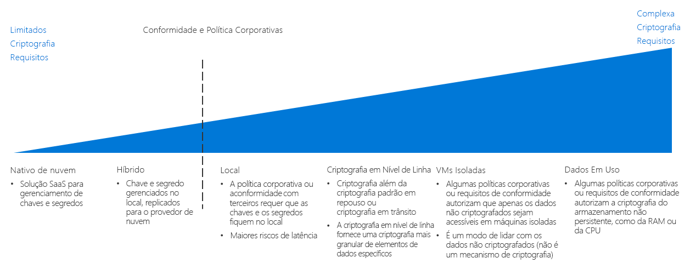

# Guia de decisão de criptografia

A criptografia dos dados os protege contra acessos não autorizados. Uma política de criptografia implementada apropriadamente proporciona camadas adicionais de segurança para suas cargas de trabalho baseadas em nuvem e protege contra invasores e outros usuários não autorizados dentro e fora de sua organização e suas redes.

Ainda que os recursos de criptografia geralmente sejam a preferência, a criptografia tem custos que podem aumentar a latência e uso geral de recursos. Para cargas de trabalho exigentes, é essencial alcançar o equilíbrio correto entre desempenho e a criptografia.

Ir para: [Gerenciamento de chaves](#key-management) | [Criptografia de dados](#data-encryption) | [Saiba mais](#learn-more)

O ponto de inflexão ao determinar uma estratégia de criptografia de nuvem se concentra em políticas corporativas e cartas de ordem de conformidade.

Há várias maneiras de implementar a criptografia em um ambiente de nuvem, com diferentes custos e complexidades. A política corporativa e a conformidade de terceiros são os maiores impulsionadores ao planejar uma estratégia de criptografia. A maioria das soluções baseadas em nuvem fornece mecanismos padrão de criptografia de dados, seja em repouso ou em trânsito. No entanto, para requisitos de políticas e conformidade que exigem controles mais rígidos, como segredos padronizados e gerenciamento de chaves, criptografia em uso ou criptografia específica de dados, provavelmente você precisará implementar uma solução complexa.

## Gerenciamento de chaves

Sistemas modernos de gerenciamento de chaves devem oferecer suporte para o armazenamento de chaves usando HSMs (módulos de segurança de hardware) para aumentar a proteção. Assim, um sistema de gerenciamento de chaves é essencial para sua organização ter capacidade de criar e armazenar chaves criptográficas, senhas importantes, cadeias de conexão e outras informações confidenciais de TI da sua organização.

Ao planejar uma migração na nuvem, a tabela a seguir descreve como você pode armazenar e gerenciar chaves de criptografia, certificados e segredos, que são essenciais para a criação de implantações de nuvem segura e gerenciável:

| Pergunta | Nativo de nuvem | Híbrido | Configuração local |
|---------------------------------------------------------------------------------------------------------------------------------------|--------------|--------|-------------|
| Há uma falta de gerenciamento centralizado de chaves e segredos na sua organização?                                                                    | Sim          | Não     | Não           |
| Você precisará limitar a criação de chaves e segredos em dispositivos para seu hardware local ao usar essas chaves na nuvem? | Não            | Sim    | Não           |
| Sua organização tem regras ou políticas em vigor que impediriam que as chaves e os segredos fossem armazenados fora do local?                | Não            | Não      | Sim         |

### Nativo de nuvem

Com o gerenciamento de chaves nativo de nuvem, todas as chaves e segredos são gerados, gerenciados e armazenados em um cofre baseado em nuvem. Essa abordagem simplifica muitas tarefas de TI relacionadas ao gerenciamento de chaves.

Suposições sobre o gerenciamento de chaves nativo de nuvem: Ao usar um sistema de gerenciamento de chaves nativo de nuvem, pressupõe-se o seguinte:

- Você confia a criação, o gerenciamento e a hospedagem de chaves e segredos da sua organização à solução de gerenciamento de chaves de nuvem.
- Você habilita todos os aplicativos e serviços locais que dependam do acesso a serviços ou segredos de criptografia para acessar o sistema de gerenciamento de chaves em nuvem.

### Híbrido (traga sua própria chave)

Com uma abordagem do tipo traga sua própria chave, você gera chaves em um hardware do HSM dedicado em seu ambiente local e depois transfere as chaves a um sistema seguro de gerenciamento de chaves de nuvem para uso com recursos de nuvem.

Suposições sobre o gerenciamento de chaves híbrido: Ao usar um sistema de gerenciamento de chaves híbrido, pressupõe-se o seguinte:

- Você confia a segurança subjacente e a infraestrutura de controle de acesso da plataforma de nuvem para hospedar e usar suas chaves e segredos.
- Conforme a política organizacional ou regulatória, você é obrigado a manter a criação e o gerenciamento de segredos e chaves local da sua organização.

### Local (mantenha sua própria chave)

Em determinados cenários, é possível haver motivos regulatórios, técnicos ou por força de política que levem à impossibilidade de armazenar chaves em um sistema de gerenciamento de chaves fornecido por um serviço de nuvem pública. Nesses casos, você deve manter as chaves usando o hardware local e provisionar um mecanismo para permitir que os recursos baseados em nuvem acessem essas chaves para fins de criptografia. Observe que uma abordagem do tipo mantenha sua própria chave pode não ser compatível com todos os serviços de nuvem.

Suposições sobre o gerenciamento de chaves local: Ao usar um sistema de gerenciamento de chaves local, pressupõe-se o seguinte:

- Conforme a política organizacional ou regulatória, você é obrigado a manter a criação, o gerenciamento e a hospedagem de segredos e chaves local da sua organização.
- Quaisquer aplicativos ou serviços baseados em nuvem que dependam do acesso a serviços ou segredos de criptografia podem acessar o sistema de gerenciamento de chaves local.

## Criptografia de dados

Há vários estados diferentes de dados com diferentes necessidades de criptografia a serem considerados ao planejar sua política de criptografia:

| Estado de dados | Dados |
|-----|-----|
| Dados em trânsito | Tráfego interno, conexões de Internet, conexões entre datacenters ou redes virtuais |
| Dados em repouso    | Bancos de dados, arquivos, discos virtuais, armazenamento de PaaS |
| Dados em uso     | Dados carregados na memória RAM ou em caches da CPU |

### Dados em trânsito

Dados em trânsito são dados que se movem entre recursos nas redes internas, entre datacenters ou externas ou pela Internet.

A criptografia de dados em trânsito geralmente é feita com protocolos SSL/TLS para o tráfego. O tráfego que transita entre os recursos hospedados na nuvem em direção à rede externa ou à Internet pública deve estar criptografado. Geralmente, os recursos de PaaS também impõem a criptografia SSL/TLS ao tráfego por padrão. Geralmente recomendada, a imposição da criptografia para o tráfego entre os recursos de IaaS hospedados dentro de suas redes virtuais é uma decisão a ser tomada por sua equipe de adoção da nuvem e o proprietário da carga de trabalho.

**Suposições sobre a criptografia de dados em trânsito**. Para a implementação de uma política de criptografia adequada a dados em trânsito, pressupõe-se o seguinte:

- Todos os pontos de extremidade publicamente acessíveis em seu ambiente de nuvem vão comunicar com a Internet pública usando protocolos SSL/TLS.
- Ao conectar redes em nuvem a outras redes externas ou locais na Internet pública, use protocolos VPN criptografados.
- Ao conectar redes de nuvem a redes locais ou a outras redes externas usando uma conexão WAN dedicada, como o ExpressRoute, você usará uma VPN ou outro dispositivo de criptografia local emparelhado com um dispositivo correspondente de VPN virtual ou de criptografia implantado na sua rede de nuvem.
- Caso tenha dados confidenciais que não devam ser incluídos em logs de tráfego ou outros relatórios de diagnóstico visíveis à equipe de TI, você criptografará todo o tráfego entre recursos em sua rede virtual.

### Dados em repouso

Dados em repouso representam quaisquer dados que não estão sendo ativamente movidos ou processados, incluindo arquivos, bancos de dados, unidades de máquina virtual, as contas de armazenamento de PaaS ou ativos semelhantes. A criptografia de dados armazenados protege dispositivos ou arquivos virtuais contra o acesso não autorizado a partir de uma invasão de rede externa, usuários internos mal-intencionados ou liberações acidentais.

Por padrão, recursos de armazenamento e banco de dados de PaaS geralmente impõem a criptografia. Recursos de IaaS virtuais podem ser protegidos por meio da criptografia de disco virtual usando as chaves de criptografia armazenadas em seu sistema de gerenciamento de chaves.

A criptografia de dados em repouso também abrange técnicas mais avançadas de criptografia de banco de dados, como a nível de coluna e a nível de linha, o que oferece muito mais controle a respeito de exatamente quais dados estão sendo protegidos.

Seus requisitos gerais de política e conformidade, a confidencialidade dos dados sendo armazenados e os requisitos de desempenho de suas cargas de trabalho devem determinar quais ativos exigem criptografia.

**Suposições sobre a criptografia de dados em repouso**. A criptografia de dados em repouso pressupõe o seguinte:

- Você está armazenando dados que não são destinados ao uso público.
- Suas cargas de trabalho podem aceitar o custo de latência de criptografia de disco.

### Dados em uso

A criptografia de dados em uso envolve a proteção de dados em armazenamento não persistente, como memória RAM ou caches de CPU. O uso de tecnologias, como criptografia de memória cheia e tecnologias de enclave, como as SGXs (Extensões de proteção segura) da Intel. Isso também inclui técnicas de criptografia, como a criptografia homomórfica, a qual pode ser usada para criar ambientes de execução confiáveis e seguros.

**Suposições sobre a criptografia de dados em uso**. A criptografia de dados em uso pressupõe o seguinte:

- Você deve manter a propriedade dos dados separada da plataforma de nuvem subjacente em todos os momentos, incluindo no nível de memória RAM e CPU.

## Saiba mais

Confira os links a seguir para obter mais informações sobre criptografia e gerenciamento de chaves na plataforma do Azure.

- [Visão geral da criptografia do Azure](/azure/security/security-azure-encryption-overview). Uma descrição detalhada de como o Azure usa a criptografia para proteger os dados em repouso e em trânsito.
- [Azure Key Vault](/azure/key-vault/key-vault-overview). O Key Vault é o sistema de gerenciamento de chave primária para armazenar e gerenciar chaves de criptografia, segredos e certificados no Azure.
- [Computação confidencial no Azure](/solutions/confidential-compute). A iniciativa de computação confidencial do Azure fornece ferramentas e tecnologias para criar ambientes confiáveis de execução ou outros mecanismos de criptografia para proteger os dados em uso.

## Próximas etapas

Saiba como Redes definidas por software fornecem funcionalidades de redes virtualizadas para implantações de nuvem.

> [!div class="nextstepaction"]
> [Qual padrão de Rede definida por software é o melhor para minha implantação?](../software-defined-network/overview.md)
