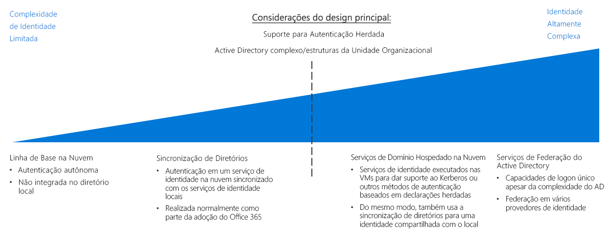

# Guia de decisão de identidadeIdentity decision guide

Em qualquer ambiente, local, híbrido ou somente na nuvem, o departamento de TI precisa controlar quais administradores, usuários e grupos têm acesso aos recursos.In any environment, whether on-premises, hybrid, or cloud-only, IT needs to control which administrators, users, and groups have access to resources. Os serviços de IAM (Gerenciamento de Identidades e Acesso) permitem que você gerencie o controle de acesso na nuvem.Identity and access management (IAM) services enable you to manage access control in the cloud.

Ir para: [Determinar requisitos de integração de identidade](#determine-identity-integration-requirements) | [Nativo de nuvem](#cloud-baseline) | [Sincronização de Diretório](#directory-synchronization) | [Serviços de domínio hospedados na nuvem](#cloud-hosted-domain-services) | [Serviços de Federação do Active Directory (AD FS)](#active-directory-federation-services) | [Integração de identidade em evolução](#evolving-identity-integration)  |  [Saiba mais](#learn-more)Jump to: [Determine Identity Integration Requirements](#determine-identity-integration-requirements) | [Cloud native](#cloud-baseline) | [Directory Synchronization](#directory-synchronization) | [Cloud hosted domain services](#cloud-hosted-domain-services) | [Active Directory Federation Services](#active-directory-federation-services) | [Evolving identity integration](#evolving-identity-integration) | [Learn more](#learn-more)

Há várias maneiras de gerenciar a identidade em um ambiente de nuvem, que variam em termos de custo e complexidade.There are several ways to manage identity in a cloud environment, which vary in cost and complexity. Um fator essencial na estruturação dos serviços de identidade baseados em nuvem é o nível de integração exigido pela infraestrutura de identidade local existente.A key factor in structuring your cloud-based identity services is the level of integration required with your existing on-premises identity infrastructure.

As soluções de identidade de SaaS (software como serviço) baseadas em nuvem fornecem um nível básico de gerenciamento de identidades e de controle de acesso para recursos da nuvem.Cloud-based software as a service (SaaS) identity solutions provide a base level of access control and identity management for cloud resources. No entanto, se a infraestrutura do AD (Active Directory) da sua organização tiver uma estrutura de floresta complexa ou UOs (unidades organizacionais) personalizadas, as cargas de trabalho baseadas em nuvem poderão exigir a replicação de diretório na nuvem para manter um conjunto consistente de identidades, grupos e funções entre os ambientes local e de nuvem.However, if your organization's Active Directory (AD) infrastructure has a complex forest structure or customized organizational units (OUs), your cloud-based workloads may require directory replication to the cloud for a consistent set of identities, groups, and roles between your on-premises and cloud environments. Se a replicação de diretório é exigida para uma solução global, a complexidade pode aumentar significativamente.If directory replication is required for a global solution, complexity can increase significantly. Além disso, o suporte a aplicativos dependentes de mecanismos de autenticação herdados pode exigir a implantação dos serviços de domínio na nuvem.Additionally, support for applications dependent on legacy authentication mechanisms may require the deployment of domain services in the cloud.

## Determinar os requisitos de integração de identidadeDetermine identity integration requirements

| PerguntaQuestion | Linha de base de nuvemCloud baseline | Sincronização de diretórioDirectory synchronization | Serviços de domínio hospedados na nuvemCloud-hosted Domain Services | Serviços de Federação do ADAD Federation Services |
|------|------|------|------|------|
| Você não tem um serviço de diretório local atualmente?Do you currently lack an on-premises directory service? | SimYes | NãoNo | NãoNo | Não No |
| Suas cargas de trabalho precisam ser autenticadas em relação a algum serviço de identidade local?Do your workloads need to authenticate against on-premises identity services? | Não No | SimYes | NãoNo | Não No |
| Suas cargas de trabalho dependem de mecanismos de autenticação herdados, como Kerberos ou NTLM?Do your workloads depend on legacy authentication mechanisms, such as Kerberos or NTLM? | Não No | Não No | SimYes | Não No |
| A integração entre a nuvem e o serviços de identidade locais não é possível?Is integration between cloud and on-premises identity services impossible? | Não No | Não No | SimYes | Não No |
| Você precisa de logon único entre vários provedores de identidade?Do you require single sign-on across multiple identity providers? | Não No | NãoNo | Não No | SimYes |

Como parte do planejamento da migração para o Azure, você precisará determinar a melhor maneira de integrar seus serviços existentes de gerenciamento de identidades e de identidade na nuvem.As part of planning your migration to Azure, you will need to determine how best to integrate your existing identity management and cloud identity services. Abaixo temos cenários comuns de integração.The following are common integration scenarios.

### Linha de base de nuvemCloud baseline

As plataformas de nuvem pública fornecem um sistema de IAM nativo para conceder a usuários e grupos acesso aos recursos de gerenciamento.Public cloud platforms provide a native IAM system for granting users and groups access to management features. Se sua organização não tem uma solução de identidade local relevante e você planeja migrar cargas de trabalho por questões de compatibilidade com mecanismos de autenticação baseados em nuvem, crie sua infraestrutura de identidade usando um serviço de identidade nativo de nuvem.If your organization lacks a significant on-premises identity solution, and you plan on migrating workloads to be compatible with cloud-based authentication mechanisms, you should build your identity infrastructure using a cloud-native identity service.

**Pressuposições da linha de base de nuvem**.**Cloud baseline assumptions**. O uso de uma infraestrutura de identidade puramente nativa de nuvem pressupõe o seguinte:Using a purely cloud-native identity infrastructure assumes the following:

- Os recursos baseados em nuvem não dependerão de servidores do Active Directory ou serviços de diretório locais; como alternativa, as cargas de trabalho poderão ser modificadas para remover tais dependências.Your cloud-based resources will not have dependencies on on-premises directory services or Active Directory servers, or workloads can be modified to remove those dependencies your.
- As cargas de trabalho de aplicativo ou serviço que estão sendo migradas dão suporte a mecanismos de autenticação compatíveis com provedores de identidade de nuvem ou podem ser modificadas facilmente para dar suporte a eles.The application or service workloads being migrated either support authentication mechanisms compatible with cloud identity providers or can be modified easily to support them. Os provedores de identidade nativos de nuvem se baseiam em mecanismos de autenticação prontos para a Internet, como SAML, OAuth e OpenID Connect.Cloud native identity providers rely on internet-ready authentication mechanisms such as SAML, OAuth, and OpenID Connect. Cargas de trabalho existentes dependentes de métodos de autenticação herdados que usam protocolos como Kerberos ou NTLM talvez precisem ser refatoradas antes da migração para a nuvem.Existing workloads that depend on legacy authentication methods using protocols such as Kerberos or NTLM may need to be refactored before migrating to the cloud.

> [!TIP]
> A maioria dos serviços de identidade nativos de nuvem não é capaz de substituir totalmente os diretórios locais tradicionais.Most cloud-native identity services are not full replacements for traditional on-premises directories. Recursos de diretório, como gerenciamento do computador ou políticas de grupo, podem ficar disponíveis apenas com o uso de ferramentas ou serviços adicionais.Directory features such as computer management or group policy may not be available without using additional tools or services.

Migrar completamente os serviços de identidade para um provedor baseado em nuvem elimina a necessidade de manter sua própria infraestrutura de identidade, o que simplifica bastante o gerenciamento de TI.Completely migrating your identity services to a cloud-based provider eliminates the need to maintain your own identity infrastructure, significantly simplifying your IT management.

### Sincronização de diretórioDirectory synchronization

Para organizações com uma infraestrutura de identidade existente, a sincronização de diretório costuma ser a melhor solução para preservar o gerenciamento de acesso e de usuário existente, fornecendo as funcionalidades de IAM necessárias para gerenciar recursos da nuvem.For organizations with an existing identity infrastructure, directory synchronization is often the best solution for preserving existing user and access management while providing the required IAM capabilities for managing cloud resources. O processo acima replica continuamente as informações de diretório entre a nuvem e os ambientes locais, o que permite o SSO (logon único) para os usuários e um sistema de identidade, função e permissão consistente para toda a organização.This process continuously replicates directory information between the cloud and on-premises environments, allowing single sign-on (SSO) for users and a consistent identity, role, and permission system across your entire organization.

Observação: as organizações que adotaram o Office 365 talvez já tenham implementado a [sincronização de diretório](/office365/enterprise/set-up-directory-synchronization) entre a infraestrutura do Active Directory local e o Azure Active Directory.Note: Organizations that have adopted Office 365 may have already implemented [directory synchronization](/office365/enterprise/set-up-directory-synchronization) between their on-premises Active Directory infrastructure and Azure Active Directory.

**Pressuposições da sincronização de diretório**.**Directory synchronization assumptions**. O uso de uma solução de identidade sincronizada pressupõe o seguinte:Using a synchronized identity solution assumes the following:

- Você precisa manter um conjunto comum de contas de usuário e grupos na nuvem e na infraestrutura de TI local.You need to maintain a common set of user accounts and groups across your cloud and on-premises IT infrastructure.
- Os serviços de identidade local dão suporte à replicação com seu provedor de identidade de nuvem.Your on-premises identity services support replication with your cloud identity provider.
- Exigência de mecanismos de SSO para usuários que acessam os provedores de identidade locais e de nuvem.You require SSO mechanisms for users accessing cloud and on-premises identity providers.

> [!TIP]
> As cargas de trabalho baseadas em nuvem que dependem de mecanismos de autenticação herdados sem suporte pelos serviços de identidade baseados em nuvem, como o Azure AD, exigirão também conectividade com os serviços de domínio locais ou servidores virtuais no ambiente de nuvem que oferece os serviços.Any cloud-based workloads that depend on legacy authentication mechanisms that are not supported by cloud-based identity services like Azure AD will still require either connectivity to on-premises domain services or virtual servers in the cloud environment providing these services. O uso de serviços de identidade locais também introduz dependências na conectividade entre as redes locais e de nuvem.Using on-premises identity services also introduces dependencies on connectivity between the cloud and on-premises networks.

### Serviços de domínio hospedados na nuvemCloud-hosted domain services

Se você tiver cargas de trabalho que dependem de autenticação baseada em declarações usando protocolos herdados, como Kerberos ou NTLM, e essas cargas de trabalho não puderem ser refatoradas para aceitar protocolos de autenticação modernos, como SAML ou OAuth e OpenID Connect, talvez seja necessário migrar alguns dos seus serviços de domínio para a nuvem como parte da implantação de nuvem.If you have workloads that depend on claims-based authentication using legacy protocols such as Kerberos or NTLM, and those workloads cannot be refactored to accept modern authentication protocols such as SAML or OAuth and OpenID Connect, you may need to migrate some of your domain services to the cloud as part of your cloud deployment.

Esse tipo de implantação envolve a implantação de máquinas virtuais que executam o Active Directory em suas redes virtuais baseadas em nuvem para fornecer serviços de domínio aos recursos na nuvem.This type of deployment involves deploying virtual machines running Active Directory in your cloud-based virtual networks to provide domain services for resources in the cloud. Todos os aplicativos e serviços existentes que estão migrando para sua rede de nuvem devem poder usar os servidores de diretório hospedados na nuvem com algumas modificações.Any existing applications and services migrating to your cloud network should be able to use of these cloud-hosted directory servers with minor modifications.

É provável que os serviços de domínio e diretórios existentes continuem a ser usados em seu ambiente local.It's likely that your existing directories and domain services will continue to be used in your on-premises environment. Nesse cenário, é recomendável que você também use a sincronização de diretório para fornecer um conjunto comum de usuários e funções em ambientes de nuvem e locais.In this scenario, it's recommended that you also use directory synchronization to provide a common set of users and roles in both the cloud and on-premises environments.

**Pressuposições dos serviços de domínio hospedados na nuvem**.**Cloud hosted domain services assumptions**. A execução de uma migração de diretório pressupõe o seguinte:Performing a directory migration assumes the following:

- Suas cargas de trabalho dependem de autenticação baseada em declarações usando protocolos como Kerberos ou NTLM.Your workloads depend on claims-based authentication using protocols like Kerberos or NTLM.
- As máquinas virtuais da carga de trabalho precisa ter ingressado no domínio para fins de gerenciamento ou aplicação da política de grupo do Active Directory.Your workload virtual machines need to be domain-joined for management or application of Active Directory group policy purposes.

> [!TIP]
> Embora uma migração de diretório combinada com serviços de domínio hospedados na nuvem ofereça boa flexibilidade na hora de migrar cargas de trabalho existentes, a hospedagem de máquinas virtuais na rede virtual de nuvem para fornecer esses serviços aumenta a complexidade das tarefas de gerenciamento de TI.While a directory migration coupled with cloud-hosted domain services provides great flexibility when migrating existing workloads, hosting virtual machines within your cloud virtual network to provide these services does increase the complexity of your IT management tasks. À medida que a experiência de migração de nuvem for progredindo, examine os requisitos de manutenção de longo prazo para hospedar os servidores.As your cloud migration experience matures, examine the long-term maintenance requirements of hosting these servers. Avalie se a refatoração das cargas de trabalho existentes para permitir a compatibilidade com provedores de identidade de nuvem como o Azure Active Directory pode reduzir a necessidade de servidores hospedados na nuvem.Consider whether refactoring existing workloads for compatibility with cloud identity providers such as Azure Active Directory can reduce the need for these cloud-hosted servers.

### Serviços de Federação do Active Directory (AD FS)Active Directory Federation Services

A federação de identidades estabelece relações de confiança entre vários sistemas de gerenciamento de identidades para permitir recursos de autorização e autenticação comuns.Identity federation establishes trust relationships across multiple identity management systems to allow common authentication and authorization capabilities. Assim, é possível dar suporte à funcionalidade de logon único em vários domínios na organização ou nos sistemas de identidade gerenciados por seus clientes ou parceiros de negócios.You can then support single sign-on capabilities across multiple domains within your organization or identity systems managed by your customers or business partners.

O Azure AD dá suporte à federação de domínios do Active Directory locais usando os [Serviços de Federação do Active Directory](/azure/active-directory/hybrid/how-to-connect-fed-whatis) (AD FS).Azure AD supports federation of on-premises Active Directory domains using [Active Directory Federation Services](/azure/active-directory/hybrid/how-to-connect-fed-whatis) (AD FS). Confira a arquitetura de referência [Estender o AD FS ao Azure](../../../reference-architectures/identity/adfs.md) para ver como isso pode ser implementado no Azure.See the reference architecture [Extend AD FS to Azure](../../../reference-architectures/identity/adfs.md) to see how this can be implemented in Azure.

## Integração de identidade em evoluçãoEvolving identity integration

A integração de identidade é um processo iterativo.Identity integration is an iterative process. Talvez seja melhor começar com uma solução nativa de nuvem e um pequeno conjunto de usuários e funções correspondentes para uma implantação inicial.You may want to start with a cloud native solution with a small set of users and corresponding roles for an initial deployment. À medida que a migração for progredindo, pense em adotar um modelo federado ou realizar uma migração de diretório total dos serviços de identidade locais para a nuvem.As your migration matures, consider adopting a federated model or performing a full directory migration of your on-premises identity services to the cloud. Reavalie sua estratégia de identidade em cada iteração do processo de migração.Revisit your identity strategy in every iteration of your migration process.

## Saiba maisLearn more

Confira os itens abaixo para obter mais informações sobre os serviços de identidade na plataforma Azure.See the following for more information about identity services on the Azure platform.

- [Azure AD](https://azure.microsoft.com/services/active-directory).[Azure AD](https://azure.microsoft.com/services/active-directory). O Azure AD fornece serviços de identidade baseados em nuvem.Azure AD provides cloud-based identity services. Ele permite que você gerencie o acesso a seus recursos do Azure e controle o gerenciamento de identidades, o registro de dispositivos, o provisionamento de usuário, o controle de acesso do aplicativo e a proteção de dados.It allows you to manage access to your Azure resources and control identity management, device registration, user provisioning, application access control, and data protection.
- [Azure AD Connect](/azure/active-directory/hybrid/whatis-hybrid-identity).[Azure AD Connect](/azure/active-directory/hybrid/whatis-hybrid-identity). A ferramenta Azure AD Connect permite que você se conecte a instâncias do Azure AD com suas soluções de gerenciamento de identidades existente, permitindo a sincronização do diretório existente com a nuvem.The Azure AD Connect tool allows you to connect Azure AD instances with your existing identity management solutions, allowing synchronization of your existing directory in the cloud.
- [RBAC](/azure/role-based-access-control/overview) (Controle de Acesso Baseado em Função).[Role-based access control](/azure/role-based-access-control/overview) (RBAC). O Azure AD fornece RBAC para gerenciar o acesso aos recursos no plano de gerenciamento com eficiência e segurança.Azure AD provides RBAC to efficiently and securely manage access to resources in the management plane. Os trabalhos e as responsabilidades são organizados em funções; os usuários são atribuídos a essas funções.Jobs and responsibilities are organized into roles, and users are assigned to these roles. O RBAC permite controlar quem tem acesso a um recurso e quais ações um usuário pode executar em tal recurso.RBAC allows you to control who has access to a resource along with which actions a user can perform on that resource.
- [Azure AD PIM](/azure/active-directory/privileged-identity-management/pim-configure) (Privileged Identity Management).[Azure AD Privileged Identity Management](/azure/active-directory/privileged-identity-management/pim-configure) (PIM). O PIM reduz o tempo de exposição dos privilégios de acesso a recursos e aumenta a visibilidade em relação a seu uso por meio de relatórios e alertas.PIM lowers the exposure time of resource access privileges and increases your visibility into their use through reports and alerts. Ele limita os usuários para só poderem usar seus privilégios JIT (“Just-In-Time”) ou atribuindo privilégios por uma duração reduzida, após a qual eles são revogados automaticamente.It limits users to taking on their privileges "just in time" (JIT), or by assigning privileges for a shorter duration, after which privileges are revoked automatically.
- [Integrar domínios do Active Directory local ao Azure Active Directory](../../../reference-architectures/identity/azure-ad.md).[Integrate on-premises Active Directory domains with Azure Active Directory](../../../reference-architectures/identity/azure-ad.md). A presente arquitetura de referência fornece um exemplo de sincronização de diretório entre domínios do Active Directory locais e o Azure AD.This reference architecture provides an example of directory synchronization between on-premises Active Directory domains and Azure AD.
- [Estender o AD DS (Active Directory Domain Services) ao Azure.Extend Active Directory Domain Services (AD DS) to Azure.](../../../reference-architectures/identity/adds-extend-domain.md) A presente arquitetura de referência fornece um exemplo de implantação de servidores do AD DS para estender os serviços de domínio a recursos baseados em nuvem.This reference architecture provides an example of deploying AD DS servers to extend domain services to cloud-based resources.
- [Estender o AD FS (Serviços de Federação do Active Directory) ao Azure](../../../reference-architectures/identity/adfs.md).[Extend Active Directory Federation Services (AD FS) to Azure](../../../reference-architectures/identity/adfs.md). A presente arquitetura de referência configura os Serviços de Federação do Active Directory (AD FS) para realizar a autenticação federada e a autorização com seu diretório do Azure AD.This reference architecture configures Active Directory Federation Services (AD FS) to perform federated authentication and authorization with your Azure AD directory.

## Próximas etapasNext steps

Saiba como implementar a imposição de política na nuvem.Learn how to implement policy enforcement in the cloud.

> [!div class="nextstepaction"]
> [Imposição de políticaPolicy enforcement](../policy-enforcement/overview.md)
