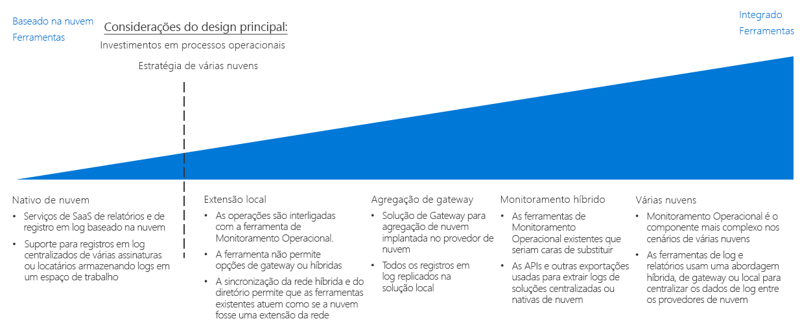

# Guia de decisão de registro em log e relatórioLogging and reporting decision guide

Todas as organizações precisam de mecanismos para notificar as equipes de TI sobre problemas de desempenho, tempo de atividade e segurança antes que tornem-se problemas sérios.All organizations need mechanisms for notifying IT teams of performance, uptime, and security issues before they become serious problems. Uma estratégia de monitoramento com êxito permite reconhecer como está o desempenho dos componentes individuais que compõem as cargas de trabalho e a infraestrutura de rede.A successful monitoring strategy allows you to understand how the individual components that make up your workloads and networking infrastructure are performing. No contexto de uma migração de nuvem pública, integrar registro em log e relatório a qualquer um dos sistemas de monitoramento existentes, enquanto monitora eventos e métricas importantes para a equipe de TI apropriada, é essencial para garantir que a organização atenda às metas de tempo de atividade, segurança e conformidade com a política.Within the context of a public cloud migration, integrating logging and reporting with any of your existing monitoring systems, while surfacing important events and metrics to the appropriate IT staff, is critical in ensuring your organization is meeting uptime, security, and policy compliance goals.

Ir para: [Planejar a infraestrutura de monitoramento](#planning-your-monitoring-infrastructure) | [Nativo de Nuvem](#cloud-native) | [Extensão local](#on-premises-extension) | [Agregação de gateway](#gateway-aggregation) | [Monitoramento híbrido (local)](#hybrid-monitoring-on-premises) | [Monitoramento híbrido (baseado em nuvem)](#hybrid-monitoring-cloud-based) | [Multinuvem](#multi-cloud) | [Saiba mais](#learn-more)Jump to: [Planning your monitoring infrastructure](#planning-your-monitoring-infrastructure) | [Cloud native](#cloud-native) | [On-premises extension](#on-premises-extension) | [Gateway aggregation](#gateway-aggregation) | [Hybrid monitoring (on-premises)](#hybrid-monitoring-on-premises) | [Hybrid monitoring (cloud-based)](#hybrid-monitoring-cloud-based) | [Multi-cloud](#multi-cloud) | [Learn more](#learn-more)

O ponto de inflexão ao determinar uma estratégia de identidade na nuvem baseia-se principalmente nos investimentos existentes feitos pela organização nos processos operacionais e, até certo ponto, nos requisitos necessários para dar suporte a uma estratégia de multinuvem.The inflection point when determining a cloud identity strategy is based primarily on existing investments your organization has made in operational processes, and to some degree any requirements you have to support a multi-cloud strategy.

Há várias maneiras de registrar e relatar atividades na nuvem.There are multiple ways to log and report on activities in the cloud. O registro em log nativo e centralizado em nuvem são duas opções comuns de SaaS (software como serviço) que são orientadas pelo design de assinatura e pelo número de assinaturas.Cloud native and centralized logging are two common software as a service (SaaS) options that are driven by the subscription design and the number of subscriptions.

## Planejar a infraestrutura de monitoramentoPlanning your monitoring infrastructure

Ao planejar a implantação, será necessário considerar onde os dados de registro em log serão armazenados e como os serviços de relatório e monitoramento baseados em nuvem serão integrados com os processos e as ferramentas existentes.When planning your deployment, you need to consider where logging data is stored and how you will integrate cloud-based reporting and monitoring services with your existing processes and tools.

| PerguntaQuestion | Nativo de nuvemCloud native | Extensão localOn-premises extension | Monitoramento híbridoHybrid monitoring | Agregação de gatewayGateway aggregation |
|-----|-----|-----|-----|-----|
| Há uma infraestrutura de monitoramento local existente?Do you have an existing on-premises monitoring infrastructure? | Não No | simYes | simYes |  Não No |
| Há requisitos para impedir o armazenamento de dados do log em locais de armazenamento externos?Do you have requirements preventing storage of log data on external storage locations? | Não No | SimYes | NãoNo | Não No |
| Você precisa integrar o monitoramento de nuvem com sistemas locais?Do you need to integrate cloud monitoring with on-premises systems? | Não No | Não No | SimYes | Não No |
Você precisará processar ou filtrar dados telemétricos, antes de enviá-los aos sistemas de monitoramento?Do you need to process or filter telemetry data before submitting it to your monitoring systems? | Não No | NãoNo | Não No | SimYes |

### Nativo de nuvemCloud native

Se a organização atualmente não possuir sistemas de registros em log e relatórios estabelecidos, ou se a implantação de nuvem planejada não precisar ser integrada com sistema local existente ou outros sistemas de monitoramento externos, uma solução de SaaS nativa de nuvem será a opção mais simples.If your organization currently lacks established logging and reporting systems, or if your planned cloud deployment does not need to be integrated with existing on-premises or other external monitoring systems, a cloud native SaaS solution is the simplest choice.

Nesse cenário, os dados do log são registrados e armazenados no mesmo ambiente de nuvem da carga de trabalho, enquanto as ferramentas de registro em log e relatórios que processam e exibem informações para a equipe de TI são oferecidas como parte da plataforma de nuvem.In this scenario, log data is recorded and stored in the same cloud environment as your workload, while the logging and reporting tools that process and surface information to IT staff are offered as part of the cloud platform.

As soluções de registro em log nativas de nuvem podem ser implementadas ad hoc por assinatura ou carga de trabalho para implantações experimentais ou menores e são organizadas de maneira centralizada para monitorar dados do log em toda a propriedade de nuvem.Cloud native logging solutions can be implemented ad hoc per subscription or workload for smaller or experimental deployments and are organized in a centralized manner to monitor log data across your entire cloud estate.

**Suposições sobre a nuvem nativa**.**Cloud native assumptions**. O uso de um sistema de registro em log e relatório de nuvem nativa supõe o seguinte:Using a cloud native logging and reporting system assumes the following:

- Não é necessário integrar os dados do log das cargas de trabalho de nuvem em sistemas locais existentes.You do not need to integrate the log data from you cloud workloads into existing on-premises systems.
- Você não usará os sistemas de relatórios baseados em nuvem para monitorar sistemas locais.You will not be using your cloud-based reporting systems to monitor on-premises systems.

### Extensão localOn-premises extension

Nos cenários em que for necessário integrar telemetria de nuvem com sistemas locais que não dão suporte a registro em log e relatório híbrido, ou suporte à migração de aplicativos e serviços com um valor mínimo de redesenvolvimento, será necessário implantar agentes de monitoramento em VMs que enviarão dados do log diretamente aos sistemas locais, em vez de armazená-los no ambiente de nuvem.In scenarios where you need to integrate cloud telemetry with on-premises systems that do not support hybrid logging and reporting, or support the migration of applications and services with a minimum amount of redevelopment, you will need to deploy monitoring agents to VMs that will send log data directly to your on-premises systems, rather than storing it in the cloud environment.

Para dar suporte a essa abordagem, os recursos de nuvem precisarão comunicar-se diretamente com os sistemas locais por meio de uma combinação de [rede híbrida](../software-defined-network/hybrid.md) e [serviços de domínio hospedados na nuvem](../identity/overview.md#cloud-hosted-domain-services).In order to support this approach, your cloud resources will need to be able to communicate directly with your on-premises systems through a combination of [hybrid networking](../software-defined-network/hybrid.md) and [cloud hosted domain services](../identity/overview.md#cloud-hosted-domain-services). Dessa forma, a rede virtual na nuvem funcionará como uma extensão da rede do ambiente local.With this in place, the cloud virtual network functions as a network extension of the on-premises environment. Consequentemente, as cargas de trabalho hospedadas na nuvem poderão comunicar-se diretamente com o sistema de registro em log e relatórios local.Therefore, cloud hosted workloads can communicate directly with your on-premises logging and reporting system.

Essa abordagem converte o investimento existente em ferramentas de monitoramento com modificações limitadas para todos os aplicativos ou serviços implantados na nuvem.This approach capitalizes on your existing investment in monitoring tooling with limited modification to any cloud-deployed applications or services. Geralmente, essa é a abordagem mais rápida para dar suporte ao monitoramento durante uma migração lift-and-shift.This is often the fastest approach to support monitoring during a lift-and-shift migration. Porém, não captura dados do log produzidos por recursos de PaaS e SaaS baseados em nuvem e omitirá todos os logs relacionados a VM gerados pela própria plataforma de nuvem, como o status da VM.However, it won’t capture log data produced by cloud-based PaaS and SaaS resources, and it will omit any VM-related logs generated by the cloud platform itself such as VM status. Como resultado, esse padrão deverá ser uma solução temporária até que uma solução de monitoramento híbrido mais abrangente seja implementada.As a result, this pattern should be a temporary solution until a more comprehensive hybrid monitoring solution is implemented.

Suposições sobre somente no local:On-premises only assumptions:

- É necessário manter os dados do log somente no ambiente local para dar suporte aos requisitos técnicos ou devido a requisitos da política ou regulatórios.You need to maintain log data only in your on-premises environment only, either in support of technical requirements or due to regulatory or policy requirements.
- Os sistemas locais não dão suporte a registros em log e relatórios híbridos ou soluções de agregação de gateway.Your on-premises systems do not support hybrid logging and reporting or gateway aggregation solutions.
- Os aplicativos baseados em nuvem podem enviar telemetria diretamente aos sistemas de registro em log local ou os agentes de monitoramento que enviam para o local podem ser implantados em VMs de carga de trabalho.Your cloud-based applications can submit telemetry directly to your on-premises logging systems or monitoring agents that submit to on-premises can be deployed to workload VMs.
- As cargas de trabalho não dependem de serviços de PaaS ou SaaS que exigem registros em log e relatórios baseados em nuvem.Your workloads are not dependent on PaaS or SaaS services that require cloud-based logging and reporting.

### Agregação de gatewayGateway aggregation

Para cenários em que o valor dos dados telemétricos baseados em nuvem for muito grande ou os sistemas de monitoramento locais existentes precisarem de dados do log modificados antes de serem processados, um serviço de [agregação de gateway](../../../patterns/gateway-aggregation.md) de dados do log poderá ser necessário.For scenarios where the amount of cloud-based telemetry data is very large or existing on-premises monitoring systems need log data modified before it can be processed, a log data [gateway aggregation](../../../patterns/gateway-aggregation.md) service may be required.

Um serviço de gateway é implantado no provedor de nuvem.A gateway service is deployed to your cloud provider. Em seguida, aplicativos e serviços relevantes são configurados para enviar dados telemétricos para o gateway, em vez de um sistema de registro em log padrão.Then, relevant applications and services are configured to submit telemetry data to the gateway instead of a default logging system. O gateway poderá, em seguida, processar os dados: agregando, combinando ou formatando-os antes de enviá-los ao serviço de monitoramento para ingestão e análise.The gateway can then process the data: aggregating, combining, or otherwise formatting it before then submitting it to your monitoring service for ingestion and analysis.

Além disso, um gateway poderá ser utilizado para agregar e pré-processar dados telemétricos vinculados a sistemas híbridos ou nativos de nuvem.Also, a gateway can be used to aggregate and preprocess telemetry data bound for cloud-native or hybrid systems.

Suposições sobre a agregação de gateway:Gateway aggregation assumptions:

- Você espera níveis muito altos de dados telemétricos dos aplicativos ou serviços baseados em nuvem.You expect very high levels of telemetry data from your cloud-based applications or services.
- Você precisará formatar ou otimizar os dados telemétricos, antes de enviá-los aos sistemas de monitoramento.You need to format or otherwise optimize telemetry data before submitting it to your monitoring systems.
- Os sistemas de monitoramento têm APIs ou outros mecanismos disponíveis para ingerir dados do log após processamento pelo gateway.Your monitoring systems have APIs or other mechanisms available to ingest log data after processing by the gateway.

### Monitoramento híbrido (local)Hybrid monitoring (on-premises)

Uma solução de monitoramento híbrido combina dados do log dos recursos locais e da nuvem para fornecer uma exibição integrada do status operacional da propriedade de TI.A hybrid monitoring solution combines log data from both your on-premises and cloud resources to provide an integrated view into your IT estate's operational status.

Se você tiver um investimento existente em sistemas de monitoramento local cuja substituição se tornaria difícil ou de alto custo, talvez seja necessário integrar a telemetria das cargas de trabalho de nuvem em soluções de monitoramento locais preexistentes.If you have an existing investment in on-premises monitoring systems that would be difficult or costly to replace, you may need to integrate the telemetry from your cloud workloads into preexisting on-premises monitoring solutions. Em um sistema de monitoramento local híbrido, os dados telemétricos locais continuam usando o sistema de monitoramento local existente.In a hybrid on-premises monitoring system, on-premises telemetry data continues to use the existing on-premises monitoring system. Os dados telemétricos baseados em nuvem são enviados diretamente ao sistema de monitoramento de nuvem, ou os dados são armazenados na nuvem junto com as cargas de trabalho e, em seguida, compilados e ingeridos no sistema local em intervalos regulares.Cloud-based telemetry data is either sent to the cloud monitoring system directly, or the data is stored on the cloud alongside your workloads and then compiled and ingested into the on-premises system at regular intervals.

**Suposições sobre o monitoramento híbrido local**.**On-premises hybrid monitoring assumptions**. O uso de um sistema local de registro em log e relatório para monitoramento híbrido supõe o seguinte:Using an on-premises logging and reporting system for hybrid monitoring assumes the following:

- Você precisa usar sistemas de relatórios locais existentes para monitorar as cargas de trabalho na nuvem.You need to use existing on-premises reporting systems to monitor cloud workloads.
- Você precisa manter a propriedade dos dados do log no local.You need to maintain ownership of log data on-premises.
- Os sistemas de gerenciamento locais têm APIs ou outros mecanismos disponíveis para ingerir dados do log de sistemas baseados em nuvem.Your on-premises management systems have APIs or other mechanisms available to ingest log data from cloud-based systems.

> [!TIP]
> Como parte da natureza iterativa da migração na nuvem, é provável a transição de monitoramento local e nativo de nuvem distinto para uma abordagem híbrida parcial.As part of the iterative nature of cloud migration, transitioning from distinct cloud-native and on-premises monitoring to a partial hybrid approach is likely. Certifique-se de manter as alterações na arquitetura de monitoramento alinhadas com os processos operacionais e de TI globais.Make sure to keep changes to your monitoring architecture in line with your overall IT and operational processes.

### Monitoramento híbrido (baseado em nuvem)Hybrid monitoring (cloud-based)

Se você não tiver uma forte necessidade para manter um sistema de monitoramento local, ou se quiser substituir os sistemas de monitoramento locais por uma solução de SaaS, também poderá optar por integrar dados do log locais com um sistema de monitoramento baseado em nuvem centralizado.If you do not have a compelling need to maintain an on-premises monitoring system, or you want to replace on-premises monitoring systems with a SaaS solution, you can also choose to integrate on-premises log data with a centralized cloud-based monitoring system.

Reproduzindo a abordagem centralizada local, nesse cenário, as cargas de trabalho de nuvem usariam o mecanismo de registro em log de nuvem padrão, e os aplicativos e serviços locais enviariam do diretório de telemetria para o sistema de registro em log baseado em nuvem, ou agregariam esses dados para ingestão no sistema de nuvem em intervalos regulares.Mirroring the on-premises centered approach, in this scenario cloud workloads would use their default cloud logging mechanism, and on-premises applications and services would either send telemetry directory to the cloud-based logging system, or aggregate that data for ingestion into the cloud system at regular intervals. O sistema de monitoramento baseado em nuvem serviria como o sistema primário de monitoramento e relatório para toda a área de TI.The cloud-based monitoring system would then serve as your primary monitoring and reporting system for your entire IT estate.

Suposições sobre o monitoramento híbrido baseado em nuvem: O uso de sistemas de registro em log e relatório baseados em nuvem para monitoramento híbrido supõe o seguinte:Cloud-based hybrid monitoring assumptions: Using cloud-based logging and reporting systems for hybrid monitoring assumes the following:

- Você não depende de sistemas de monitoramento locais existentes.You are not dependent upon existing on-premises monitoring systems.
- As cargas de trabalho não possuem requisitos regulatórios ou de política para armazenar dados do log no local.Your workloads do not have regulatory or policy requirements to store log data on-premises.
- Os sistemas de monitoramento baseados em nuvem têm APIs ou outros mecanismos disponíveis para ingerir dados do log de aplicativos e serviços locais.Your cloud-based monitoring systems have APIs or other mechanisms available to ingest log data from on-premises applications and services.

### Várias nuvensMulti-cloud

Integrar os recursos de registro em log e relatório em uma plataforma com várias nuvens pode ser complexo.Integrating logging and reporting capabilities across a multiple-cloud platform can be complicated. Os serviços oferecidos entre plataformas muitas vezes não são diretamente comparáveis, e os recursos de registro em log e telemetria fornecidos por esses serviços também são diferentes.Services offered between platforms are often not directly comparable, and logging and telemetry capabilities provided by these services differ as well.
O suporte para registro em log em várias nuvens geralmente exigirá o uso de serviços de gateway para processar dados do log em um formato comum, antes de enviar os dados para uma solução de registro em log híbrida.Multi-cloud logging support often requires the use of gateway services to process log data into a common format before submitting data to a hybrid logging solution.

## Saiba maisLearn more

O [Azure Monitor](/azure/azure-monitor/overview) é o serviço de monitoramento e relatório padrão do Azure.[Azure Monitor](/azure/azure-monitor/overview) is the default reporting and monitoring service for Azure. Ele fornece:It provides:

- Uma plataforma unificada para coletar telemetria de aplicativos, telemetria do host (como VMs), métricas de contêineres, métricas da plataforma do Azure e logs de eventos.A unified platform for collecting app telemetry, host telemetry (such as VMs), container metrics, Azure platform metrics, and event logs.
- Visualização, consultas, alertas e ferramentas de análise.Visualization, queries, alerts, and analytical tools. Adicionalmente, pode fornecer informações sobre máquinas virtuais, sistemas operacionais convidados, redes virtuais e eventos de aplicativo de carga de trabalho.It can provide insights into virtual machines, guest operating systems, virtual networks, and workload application events.
- [APIs REST](/azure/monitoring-and-diagnostics/monitoring-rest-api-walkthrough) para integração com serviços externos e automação de serviços de monitoramento e alerta[REST APIs](/azure/monitoring-and-diagnostics/monitoring-rest-api-walkthrough) for integration with external services and automation of monitoring and alerting services
- [Integração](/azure/monitoring-and-diagnostics/monitoring-partners) com muitos fornecedores de terceiros populares.[Integration](/azure/monitoring-and-diagnostics/monitoring-partners) with many popular third-party vendors.
