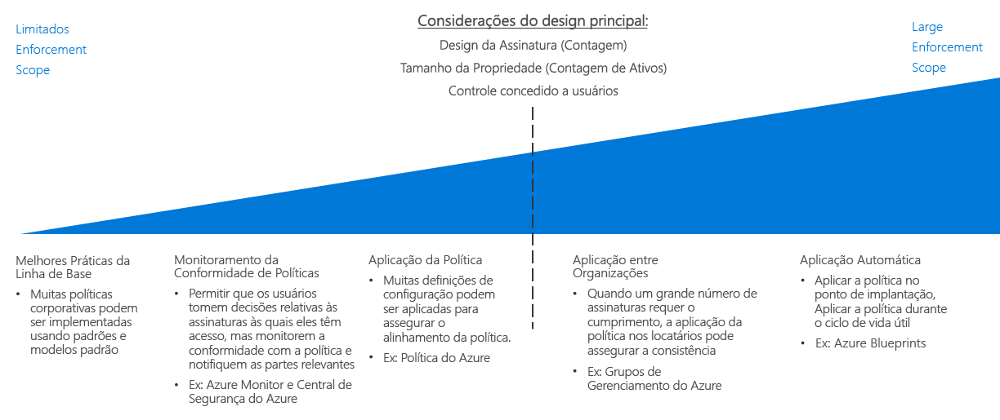

# Guia de decisão de imposição de política

Definir a política organizacional não é eficaz, a menos que haja uma maneira de impô-la em sua organização. Um aspecto fundamental do planejamento de qualquer migração para a nuvem é determinar a melhor maneira de combinar as ferramentas fornecidas pela plataforma de nuvem com seus processos de TI existentes para facilitar a conformidade com a política em seu acervo de nuvem inteiro.

Ir para: [Práticas recomendas da linha de base](#baseline-recommended-practices) | [Monitoramento de conformidade de política](#policy-compliance-monitoring) | [Aplicação de política](#policy-enforcement) | [Política entre organizações](#cross-organization-policy) | [Aplicação automatizada](#automated-enforcement)

À medida que cresce o seu acervo de nuvem, você se deparará com uma necessidade correspondente para manter e aplicação de políticas em uma matriz maior de recursos, assinaturas e locatários. Quanto maior for o seu acervo, quanto mais complexa seus mecanismos de imposição precisarão garantir aderência consistente e detecção de violação rápida. Mecanismos de imposição política fornecidos pela plataforma no nível de recursos ou assinatura geralmente são suficientes para implantações menores de nuvem, enquanto as implantações maiores, talvez precisem aproveitar os mecanismos mais sofisticados que envolvam padrões de implantação, agrupamento de recursos e organização e a integração de imposição política com o registro em log e sistemas de relatórios.

O ponto de inflexão principal ao escolher a complexidade de sua estratégia de imposição política é voltado principalmente no número de assinaturas ou locatários exigidos pelo seu [design de assinatura](../subscriptions/overview.md). A quantidade de controle concedido a várias funções de usuário dentro de seu acervo de nuvem pode influenciar essas decisões também.

## Práticas recomendadas da linha de base

Para implantações de nuvem simples e de assinatura única, muitas políticas corporativas muitos ser impostas usando os recursos que são nativos à maioria das plataformas de nuvem. Mesmo nesse nível relativamente baixo de complexidade de implantação, o uso consistente dos padrões discutidos em todos os [guias de decisão](../overview.md) do CAF podem ajudar a estabelecer um nível de linha de base de conformidade da política.

Por exemplo: 

- [Modelos de implantação](../resource-consistency/overview.md) podem provisionar recursos com a estrutura padronizada e a configuração.
- [Marcação e padrões de nomenclatura](../resource-tagging/overview.md) podem ajudar a organizar as operações e oferecer suporte aos requisitos de negócios e de estatísticas.
- Restrições de rede e gerenciamento de tráfego podem ser implementadas por meio da [rede definida pelo software](../software-defined-network/overview.md).
- [Controle de acesso baseado em função](../identity/overview.md) pode proteger e isolar seus recursos de nuvem.

Inicie o seu planejamento de implantação da política de nuvem examinando como o aplicativo dos padrões discutidos ao longo desses guias pode ajudar a atender às suas necessidades organizacionais.

## Monitorar a conformidade da política

Outro fator importante, mesmo para implantações de nuvem relativamente pequenas, é a capacidade de verificar se os aplicativos e serviços baseados em nuvem estão em conformidade com a política organizacional, notificando prontamente as partes responsáveis se um recurso se tornar incompatível. Realizar o [registro em log e criar relatórios](../log-and-report/overview.md) do status de conformidade efetivamente de suas cargas de trabalho de nuvem é uma parte crítica de uma estratégia de imposição de política corporativa.

Conforme sua propriedade de nuvem cresce, ferramentas adicionais como a [Central de Segurança do Azure](/azure/security-center/) pode fornecer a segurança integrada e a detecção de ameaças e ajudar a aplicar gerenciamento centralizado de políticas e alertas para seu local e ativos de nuvem.

## Aplicação de políticas

Você também pode aplicar as definições de configuração e regras de criação de recursos no nível da assinatura para ajudar a garantir o alinhamento de políticas.

[O Azure Policy](/azure/governance/policy/overview) é um serviço do Azure para criar, atribuir e gerenciar políticas. Essas políticas impõem diferentes regras e efeitos sobre os recursos para que esses recursos permaneçam em conformidade com seus padrões corporativos e contratos de nível de serviço. O Azure Policy avalia seus recursos quanto a não conformidade com políticas atribuídas. Por exemplo, você talvez queira limitar o tamanho da SKU de máquinas virtuais em seu ambiente. Depois que essa política é implementada, os recursos novos e existentes são avaliados quanto à conformidade. Com a política certa, os recursos existentes podem ser colocados em conformidade.

## Política entre organizações

À medida que o seu acervo de nuvem aumenta para abranger várias assinaturas que exigem imposição, você precisa se concentrar em uma estratégia de imposição de todo o locatário para garantir a consistência de política.

Sua [design de assinatura](../subscriptions/overview.md) deve levar em conta para a que diz respeito à sua estrutura organizacional. Além de ajudar a dar suporte a organização complexa dentro de seu design de assinatura, [grupos de gerenciamento do Azure](../subscriptions/overview.md#management-groups) podem ser usados para atribuir as regras do Azure Policy entre várias assinaturas.

## Imposição automática

Embora modelos de implantação padronizado entrarão em vigor em uma escala menor, [o Azure BluePrints](/azure/governance/blueprints/overview) permite a orquestração em larga escala padronizada de provisionamento e a implantação de soluções do Azure. As cargas de trabalho entre várias assinaturas podem ser implantadas com as configurações de política consistentes para todos os recursos criados.

Para ambientes de TI, ao integrar recursos de nuvem e locais, talvez seja necessário usar o registro em log e relatório de sistemas para fornecer recursos de monitoramento híbrido. Seus sistemas de monitoramento operacionais personalizados ou de terceiros podem oferecer recursos de imposição de política adicionais. Para propriedades de nuvem complicadas, considere a melhor maneira de integrar esses sistemas com seus ativos de nuvem.

## Próximas etapas

Saiba como a consistência de recurso é usada para organizar e padronizar as implantações de nuvem para dar suporte a metas de design e a governança de assinatura.

> [!div class="nextstepaction"]
> [Consistência de recursos](../resource-consistency/overview.md)
