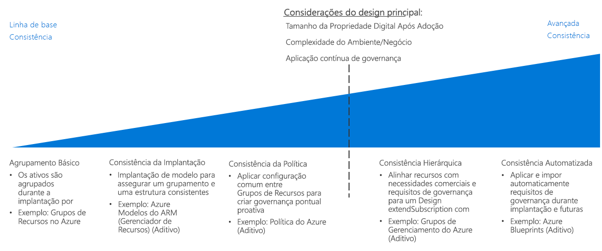

# CAF: Guia de decisão de consistência de recursos

Azure [design de assinatura](../subscriptions/overview.md) define como organizar seus ativos de nuvem em relação à estrutura da sua organização, práticas de contabilidade e requisitos de carga de trabalho. Esse nível de estrutura, além de abordar os requisitos de política organizacional governança entre o seu acervo de nuvem requer a capacidade de organizar consistentemente, implantar e gerenciar os recursos dentro de uma assinatura.

Ir para: [Agrupamento básico](#basic-grouping) | [Consistência da implantação](#deployment-consistency) | [Consistência de política](#policy-consistency) | [Consistência hierárquica](#hierarchical-consistency) | [Consistência automatizada](#automated-consistency)

Decisões sobre o nível de requisitos de consistência de recursos do seu acervo de nuvem são principalmente conduzidas por estes fatores: tamanho após a migração de estado digital, comercial ou requisitos ambientais que não se enquadram dentro de sua assinatura existente abordagens de design, ou a necessidade de impor a governança ao longo do tempo após a implantação dos recursos. 

Como esses fatores aumentam em importância, os benefícios de garantir a implantação consistente, agrupamento e gerenciamento de recursos baseados em nuvem torna-se mais importante. Alcançar níveis de consistência de recursos para atender às necessidades crescentes mais avançados requer mais esforço gasto em automação, ferramentas e imposição de consistência e isso resulta em um mais tempo gasto no gerenciamento de alterações e controle.

## Agrupamento básico

No Azure, [grupos de recursos](/azure/azure-resource-manager/resource-group-overview#resource-groups) são um mecanismo de organização de recursos de núcleo para agrupar logicamente os recursos dentro de uma assinatura.

Os grupos de recursos atuam como contêineres para recursos com um ciclo de vida comum ou restrições de gerenciamento compartilhadas como política ou requisitos de controle de acesso a função (RBAC). Os grupos de recursos não podem ser aninhados e os recursos podem pertencer apenas a um grupo de recursos. Algumas ações podem agir em todos os recursos em um grupo de recursos. Por exemplo, a exclusão de um grupo de recursos remove todos os recursos daquele grupo. Existem padrões comuns durante a criação de grupos de recursos, normalmente são divididos em duas categorias:

- Cargas de trabalho de TI tradicionais: Geralmente, agrupadas por itens no mesmo ciclo de vida, como um aplicativo. O agrupamento por aplicativo permite o gerenciamento individual de aplicativo.
- As cargas de trabalho TI da Agile: Tendem a se concentrar nos aplicativos de nuvem voltados para o cliente. Esses grupos de recursos muitas vezes refletem as camadas da implantação (como camada da Web ou camada de aplicativo) e gerenciamento.

## Consistência de implantação

Criando sobre o mecanismo de agrupamento de recurso base, a plataforma do Azure fornece um sistema para usar os modelos para implantar seus recursos no ambiente de nuvem. Você pode usar modelos para criar organização consistente e convenções de nomenclatura ao implantar cargas de trabalho, impor esses aspectos do seu design de implantação e gerenciamento de recursos.

Os [Modelos do Azure Resource Manager](/azure/azure-resource-manager/resource-group-overview#template-deployment) permitem que você implante repetidamente seus recursos em um estado consistente usando uma estrutura de grupo de recursos e configuração predeterminada. Modelos do Gerenciador de Recursos ajudam a definir um conjunto de padrões como base para suas implantações.

Por exemplo, você pode ter um modelo padrão para a implantação de uma carga de trabalho de servidor web que contém duas máquinas virtuais como servidores web combinados com um balanceador de carga para distribuir o tráfego entre os servidores. Em seguida, você pode reutilizar este modelo para criar um conjunto estruturalmente idêntico de máquinas virtuais e balanceador de carga sempre que esse tipo de carga de trabalho é necessário, apenas alterar o nome da implantação e endereços IP envolvidos.

Observe que você pode implantar esses modelos e integrá-los aos seus sistemas de CI/CD também por meio de programação.

## Consistência de política

Para garantir que as políticas de controle sejam aplicadas quando os recursos são criados, a parte do design de agrupamento de recursos envolve o uso de uma configuração comum ao implantar recursos.

Ao combinar grupos de recursos e modelos padronizados do Gerenciador de Recursos, você pode impor padrões para quais configurações são necessárias em uma implantação e quais regras da [política do Azure](/azure/governance/policy/overview) são aplicadas a cada grupo de recursos ou recurso.

Por exemplo, você pode ter um requisito de que todas as máquinas virtuais implantadas dentro de sua assinatura se conectam a uma sub-rede comum gerenciada por sua equipe de TI central. Você pode criar um modelo padrão para a implantação de VMs de carga de trabalho que criariam um grupo de recursos separado para a carga de trabalho e implantaria as VMs necessárias de lá. Esse grupo de recursos teria uma regra de política para permitir que somente as interfaces de rede dentro do grupo de recursos fossem associados à sub-rede compartilhada.

Para obter uma discussão mais detalhada sobre impor suas decisões de política dentro de uma implantação de nuvem, consulte [Imposição de política](../policy-enforcement/overview.md).

## Consistência hierárquica

Grupos de recursos permite que você dê suporte a níveis adicionais de hierarquia em sua organização dentro da assinatura, aplicando regras de política do Azure e acessar os controles em um nível de grupo de recursos. No entanto, à medida que aumenta o tamanho do seu acervo de nuvem, você precisa dar suporte aos requisitos de governança de assinatura cruzada mais complicados que podem ter suporte usando a hierarquia de empresa/departamento/conta/assinatura do Azure Enterprise Agreement. 

[Grupos de gerenciamento do Azure](../subscriptions/overview.md#management-groups) permite às assinaturas da organização em estruturas organizacionais mais sofisticadas por assinaturas de agrupamento em uma hierarquia de alternativa para que estabelecida pela estrutura do seu contrato enterprise. Essa hierarquia alternativa permite que você aplique os mecanismos de imposição de política e controle de acesso em várias assinaturas e os recursos que eles contêm. Hierarquias de grupo de gerenciamento podem ser usadas para corresponder as assinaturas do seu acervo de nuvem com requisitos de governança de negócios ou de operações. 

## Consistência automatizada

Para implantações de nuvem grande, a governança global se torna mais importante e mais complexa. É crucial aplicar e impor requisitos de governança ao implantar recursos automaticamente, bem como atender aos requisitos atualizados para implantações existentes.

[Azure Blueprints](/azure/governance/blueprints/overview) permitem que as organizações deem suporte à governança global de instalações de nuvem grande no Azure. Blueprints se movem além dos recursos fornecidos pelos modelos padrão do Azure Resource Manager para criar orquestrações de implantação completa capaz de recursos de implantação e aplicar regras de política. Blueprints oferecem suporte a controle de versão, a capacidade aplicar as atualizações para todas as assinaturas em que o plano gráfico foi usado e a capacidade de bloquear assinaturas implantadas para evitar a criação não autorizada e a modificação dos recursos.

Esses pacotes permitem que as equipes de TI e de desenvolvimento implantem rapidamente novas cargas de trabalho e ativos de rede que estejam em conformidade com a alteração dos requisitos de política organizacional. Os blueprints podem ser integrados em pipelines de CI/CD para aplicar os padrões de governança revisados para implantações conforme são atualizados.

## Próximas etapas

Saiba como os recursos de nomenclatura e marcação são usados para organizar e gerenciar seus recursos de nuvem.

> [!div class="nextstepaction"]
> [Recursos de nomenclatura e marcação](../resource-tagging/overview.md)
