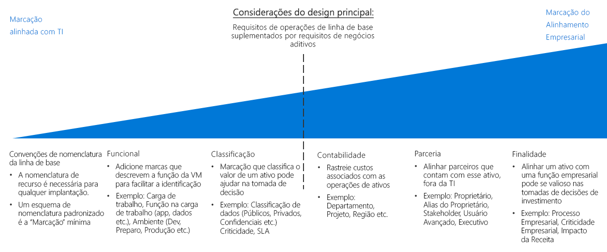

# Organização de recursos e guia de decisão de marcação

A organização de recursos baseados em nuvem é uma das tarefas mais importantes para TI, a menos que você tenha implantações muito simples. Organizar seus recursos atende a três objetivos principais:

- **Gerenciamento de Recursos**. Suas equipes de TI precisarão localizar rapidamente os recursos associados às cargas de trabalho específicas, ambientes, grupos de propriedade ou outras informações importantes. Os recursos de organização são essenciais para a atribuição de funções organizacionais e permissões de acesso para o gerenciamento de recursos.
- **Operações**. Além de tornar mais fácil para os recursos que a TI gerencia, um esquema organizacional apropriado lhe permite tirar proveito de automação como parte da criação de recursos, monitoramento operacional e criação de processos de DevOps.
- **Contabilidade**. Tornar os grupos de negócios cientes do consumo de recursos de nuvem requer que a TI entenda quais cargas de trabalho e equipes estão usando quais recursos. Para dar suporte a abordagens, como estatísticas de análise e estorno, os recursos de nuvem precisam ser organizados para refletir o uso e propriedade.

## Guia de decisão de marcação

Ir para: [Convenções de nomenclatura de linha de base](#baseline-naming-conventions) | [Padrões de marcação de recursos](#resource-tagging-patterns) | [Nomenclatura e marcação política](#naming-and-tagging-policy) | [Saiba mais](#learn-more)

Sua abordagem de marcação pode ser simples ou complexa, com ênfase variando de dar suporte a equipes de TI gerenciado as cargas de trabalho de nuvem para integração de informações relacionadas a todos os aspectos de toda a empresa.

Um foco de marcação IT alinhado reduzirá a complexidade de ativos de monitoramento e tomará decisões de gerenciamento com base na funcionalidade e classificação muito mais fáceis.

Marcação de esquemas que também incluem as políticas de TI não pode exigir um grande investimento de tempo para criar padrões de marcação que refletem os interesses de negócios e mantêm esses padrões ao longo do tempo. No entanto, o resultado desse processo é um sistema de identificação fornecendo maior capacidade de levar em conta os custos e o valor de ativos de TI. Essa associação de valor de um ativo para seus custos operacionais é uma das primeiras etapas para alterar a percepção de centro de custo de TI em sua organização.

## Convenções de nomenclatura da linha de base

Uma convenção de nomenclatura padronizada é o ponto de partida para organizar seus recursos hospedados na nuvem. Um sistema de nomenclatura adequadamente estruturado permite que você identifique rapidamente os recursos de gerenciamento e fins de contabilização. Se você tiver convenções de nomenclatura de TI existentes em outras partes da sua organização, considere se as suas convenções de nomenclatura de recursos de nuvem devem ser alinhadas a eles ou se você deve estabelecer padrões separados baseado em nuvem.

Observe também que os tipos de recursos do Azure diferentes têm diferentes [requisitos de nomenclatura](../../../best-practices/naming-conventions.md#naming-rules-and-restrictions). As convenções de nomenclatura devem ser compatíveis com esses requisitos de nomenclatura.

## Padrões de marcação de recursos

Para a organização mais sofisticada do que uma convenção de nomenclatura consistente apenas pode fornecer, as plataformas de nuvem compatíveis com a capacidade de marcar os recursos.

*Marcas* são elementos de metadados anexados aos recursos. As marcas consistem em pares de cadeias de caracteres de chave/valor. Os valores que incluem esses pares cabem a você, mas a aplicação de um conjunto consistente de marcas globais, como parte de uma nomenclatura abrangente e política de marcação, é uma parte essencial de uma política de governança geral.

Aqui estão alguns exemplos de padrões comuns de marcação:

<!-- markdownlint-disable MD033 -->

| Tipo de marca | Exemplos | DESCRIÇÃO |
|-----|-----|-----|
| Funcional            | app = catalogsearch1  camada = web  webserver = apache env = prod  env = preparo  env = dev                 | Categorize os recursos em relação à sua finalidade dentro de uma carga de trabalho, em qual ambiente foram implantados ou outra funcionalidade e detalhes operacionais.                                 |
| classificação        | confidentiality=private SLA = 24 horas                                 | Classifica um recurso, como são usados e quais políticas se aplicam a ele                               |
| Contabilidade            | departamento = financeiro  projeto = catalogsearch  região = northamerica | Permite o recurso a ser associado a grupos específicos dentro de uma organização para fins de cobrança |
| Parceria           | proprietário = jsmith  contactalias = catsearchowners stakeholders = user1;user2;user3                        | Fornece informações sobre o que as pessoas (fora da IT) são relacionadas ou caso contrário, são afetadas pelo recurso                      |
| Finalidade               | businessprocess=support businessimpact=moderate revenueimpact=high   | Alinha os recursos para as funções de negócios para dar melhor suporte a decisões de investimento  |

<!-- markdownlint-enable MD033 -->

## Nomenclatura e marcação de política

Sua política de nomenclatura e marcação evoluirá ao longo do tempo. No entanto, é fundamental determinar suas prioridades organizacionais principais desde o início de uma migração na nuvem. Como parte do processo de planejamento, considere cuidadosamente as seguintes perguntas:

- Qual é a melhor forma de suas políticas de nomeação e marcação se integrarem às políticas organizacionais e de nomenclatura existentes em sua organização?
- Você implementará um sistema de contabilidade de estorno ou análise? Como são seus departamentos, grupos de negócios e equipes representados nessa estrutura organizacional?
- Quais informações de marcação serão necessárias para todos os recursos? Quais informações de marcação serão deixadas até as equipes individuais implementarem ou não implementarem?
- A marcação precisa representar detalhes desses requisitos de conformidade regulatória para um recurso? E os detalhes operacionais como requisitos de tempo de atividade, cronogramas de patch ou requisitos de segurança?

## Saiba mais

Para obter mais informações sobre nomenclatura e marcação no Azure, consulte:

- [Convenções de nomenclatura para recursos do Azure](../../../best-practices/naming-conventions.md). Consulte as orientações do site do Azure Cloud Fundamentals para obter as convenções de nomenclatura recomendadas para recursos do Azure.
- [Use as marcas para organizar seus recursos do Azure](/azure/azure-resource-manager/resource-group-using-tags?toc=/azure/billing/TOC.json). Você pode aplicar marcas no Azure no grupo de recursos e no nível do recurso individual, dando a você flexibilidade na granularidade de quaisquer relatórios de estatísticas com base em marcas aplicadas.

## Próximas etapas

Saiba como a criptografia é usada para proteger os dados em ambientes de nuvem.

> [!div class="nextstepaction"]
> [Criptografia](../encryption/overview.md)
