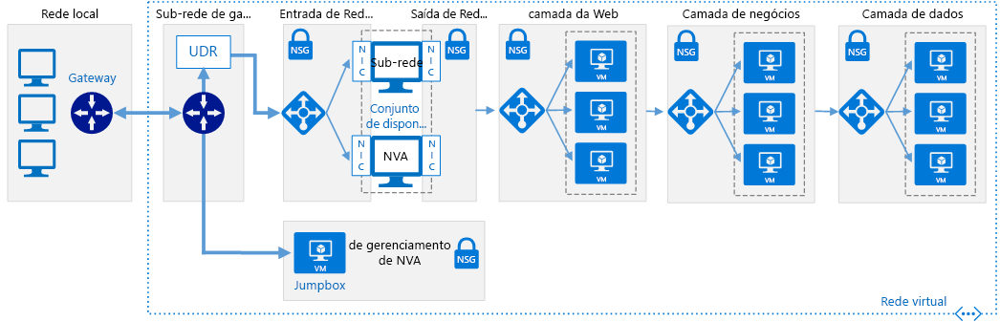

# Redes definidas pelo software: DMZ de nuvemSoftware Defined Networks: Cloud DMZ

A arquitetura de rede da DMZ de Nuvem permite acesso limitado entre redes locais e baseadas em nuvem, usando uma VPN (rede privada virtual) para conectar as redes.The Cloud DMZ network architecture allows limited access between your on-premises and cloud-based networks, using a virtual private network (VPN) to connect the networks. Uma DMZ é implantada na nuvem para proteger o acesso à rede local a partir de recursos baseados em nuvem.A DMZ is deployed in the cloud to secure access to the on-premises network from cloud-based resources.

Essa arquitetura foi projetada para dar suporte a cenários em que a organização deseja iniciar a integração de cargas de trabalho baseadas em nuvem com cargas de trabalho locais, mas pode não ter políticas de segurança em nuvem totalmente desenvolvidas ou adquirido uma conexão WAN dedicada segura entre os dois ambientes.This architecture is designed to support scenarios where your organization wants to start integrating cloud-based workloads with on-premises workloads but may not have fully matured cloud security policies or acquired a secure dedicated WAN connection between the two environments. Como resultado, as redes em nuvem devem ser tratadas como uma zona desmilitarizada para garantir que os serviços locais sejam seguros.As a result, cloud networks should be treated like a demilitarized zone to ensure on-premises services are secure.

A DMZ implanta NVAs (dispositivos virtuais de rede) para implementar a funcionalidade de segurança como firewalls e inspeção de pacotes.The DMZ deploys network virtual appliances (NVAs) to implement security functionality such as firewalls and packet inspection. O tráfego que passa entre aplicativos ou serviços locais e baseados em nuvem deve passar pela DMZ onde pode ser auditado.Traffic passing between on-premises and cloud-based applications or services must pass through the DMZ where it can be audited. As conexões VPN e as regras que determinam qual tráfego é permitido pela rede DMZ são estritamente controladas pelas equipes de segurança de TI.VPN connections and the rules determining what traffic is allowed through the DMZ network are strictly controlled by IT security teams.

## Suposições sobre a DMZ de NuvemCloud DMZ assumptions

A implantação de uma DMZ de Nuvem supõe o seguinte:Deploying a Cloud DMZ assumes the following:

- As equipes de segurança não alinharam totalmente as exigências e políticas de segurança locais e baseadas em nuvem.Your security teams have not fully aligned on-premises and cloud-based security requirements and policies.
- As cargas de trabalho baseadas em nuvem exigem acesso limitado a serviços hospedados nas redes locais ou de terceiros, ou os usuários ou aplicativos no ambiente local precisam de acesso limitado a recursos hospedados em nuvem.Your cloud-based workloads require limited access to services hosted on your on-premises or third-party networks, or your users or applications in your on-premises environment need limited access to cloud-hosted resources.
- A implementação de uma conexão VPN entre as redes locais e o provedor de nuvem não é impedida pela política corporativa, requisitos regulamentares ou problemas de compatibilidade técnica.Implementing a VPN connection between your on-premises networks and cloud provider is not prevented by corporate policy, regulatory requirements, or technical compatibility issues.
- As cargas de trabalho não exigem várias assinaturas para ignorar limites de recursos de assinatura, ou envolvem várias assinaturas mas não requerem gerenciamento central de conectividade ou serviços compartilhados usados por recursos distribuídos por várias assinaturas.Your workloads either do not require multiple subscriptions to bypass subscription resource limits, or they involve multiple subscriptions but don't require central management of connectivity or shared services used by resources spread across multiple subscriptions.

A equipe de Adoção da Nuvem deverá considerar os seguintes problemas ao analisar a implementação de uma arquitetura de rede virtual de DMZ de Nuvem:Your Cloud Adoption team should consider the following issues when looking at implementing a Cloud DMZ virtual networking architecture:

- Conectar redes locais com redes em nuvem aumenta a complexidade dos requisitos de segurança.Connecting on-premises networks with cloud networks increases the complexity of your security requirements. Embora a conexão entre as redes em nuvem e o ambiente local esteja garantida, ainda será necessário garantir que os recursos da nuvem estejam seguros.Even though the connection between cloud networks and the on-premises environment are secured, you still need to ensure cloud resources are secured.
- A arquitetura de DMZ de Nuvem normalmente é utilizada como um ponto de partida, enquanto a conectividade é mais protegida e a política de segurança é alinhada entre as redes locais e na nuvem, permitindo uma adoção mais ampla de uma arquitetura de rede híbrida em grande escala.The Cloud DMZ architecture is commonly used as a stepping stone while connectivity is further secured and security policy aligned between on-premises and cloud networks, allowing a broader adoption of a full-scale hybrid networking architecture.

## Saiba maisLearn more

Consulte o seguinte para obter mais informações sobre a implementação de uma DMZ de Nuvem na plataforma do Azure.See the following for more information about the implementing a Cloud DMZ in the Azure platform.

- [Implementar uma DMZ entre o Azure e o datacenter local](../../../reference-architectures/dmz/secure-vnet-hybrid.md).[Implement a DMZ between Azure and your on-premises datacenter](../../../reference-architectures/dmz/secure-vnet-hybrid.md). Este artigo descreve como implementar uma arquitetura de rede híbrida segura no Azure.This article discusses how to implement a secure hybrid network architecture in Azure.
