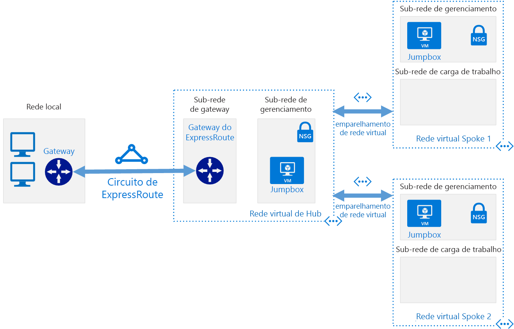

# Redes Definidas por Software: Hub e Spoke

O modelo de rede hub e spoke organiza a sua infraestrutura de rede de nuvem baseada no Azure em várias redes virtuais conectadas. Esse modelo permite a você gerenciar requisitos comuns de comunicação ou segurança com mais eficiência e lidar com possíveis limitações de assinatura.

No modelo hub e spoke, o *hub* é uma rede virtual que atua como um local central para gerenciar a conectividade externa e hospedagem de serviços usados por várias cargas de trabalho. Os *spokes* são as redes virtuais que hospedam as cargas de trabalho e conectam-se ao hub central por meio do [emparelhamento de rede virtual](/virtual-network/virtual-network-peering-overview).

Passando dentro ou fora de redes de spoke de carga de trabalho, todo o tráfego é roteado por meio da rede de hub em que ele pode ser roteado, inspecionado ou de alguma forma gerenciado por regras de IT centralmente gerenciadas ou processos.

Esse modelo tem o objetivo de resolver os problemas a seguir:

- Redução dos custos e eficiência do gerenciamento. A centralização de serviços que podem ser compartilhados por diversas cargas de trabalho, tais como soluções de virtualização de rede (NVAs) e servidores DNS em um local permite que a TI minimize recursos redundantes e esforço de gerenciamento em várias cargas de trabalho.
- Superar os limites das assinaturas. Grandes cargas de trabalho baseadas em nuvem podem exigir o uso de mais recursos que são permitidos em uma única assinatura do Azure (consulte [limites de assinatura](/azure/azure-subscription-service-limits)). Redes virtuais de carga de trabalho de emparelhamento de assinaturas diferentes para um hub central podem superar esses limites.
- Separação de preocupações. A capacidade de implantar cargas de trabalho individuais entre as equipes de TI centrais e as equipes de cargas de trabalho.

O diagrama a seguir mostra um hub de exemplo e arquitetura de spoke incluindo conectividade híbrida gerenciada centralmente.

A arquitetura hub e spoke é frequentemente usada junto com a arquitetura de rede híbrida, fornecendo uma conexão gerenciada centralmente a ao seu ambiente local compartilhado entre várias cargas de trabalho. Nesse cenário, todo tráfego viajando entre as cargas de trabalho e locais, passa pelo hub, onde pode ser gerenciado e protegido.

## Suposições de hub e spoke

Implementar uma arquitetura de rede virtual hub e spoke pressupõe o seguinte:

- As implantações de nuvem envolverão as cargas de trabalho hospedadas em ambientes de trabalho separados, como desenvolvimento, teste e produção, todos se baseiam em um conjunto de serviços comuns, como DNS ou serviços de diretório.
- Suas cargas de trabalho não precisam se comunicar entre si, mas ter comunicações externas comuns e requisitos de serviços compartilhados.
- Suas cargas de trabalho exigem mais recursos que estão disponíveis em uma única assinatura do Azure.
- Você precisa fornecer para as equipes de carga de trabalho direitos de gerenciamento delegado sobre seus próprios recursos enquanto mantêm o controle da central de segurança sobre conectividade externa.

## Hub e spoke global

As arquiteturas hub e spoke são normalmente implementadas com redes virtuais implantadas à mesma região do Azure para minimizar a latência entre as redes. Porém, organizações grandes com um alcance global podem precisar implantar cargas de trabalho através de várias regiões para disponibilidade, recuperação de desastres ou requisitos regulatórios. Com o uso do [emparelhamento de rede virtual global](/azure/virtual-network/virtual-network-peering-overview) do Azure, o modelo hub e spoke pode estender o gerenciamento centralizado e serviços compartilhados entre regiões para dar suporte a cargas de trabalho distribuídas em todo o mundo.

## Saiba mais

Para obter exemplos de como implementar as redes de hub e spoke no Azure, consulte os exemplos a seguir no site de Arquiteturas de Referência do Azure:

- [Implemente uma topologia de rede hub-spoke no Azure](../../../reference-architectures/hybrid-networking/hub-spoke.md)
- [Implemente uma topologia de rede hub-spoke com serviços compartilhados no Azure](../../../reference-architectures/hybrid-networking/shared-services.md)
