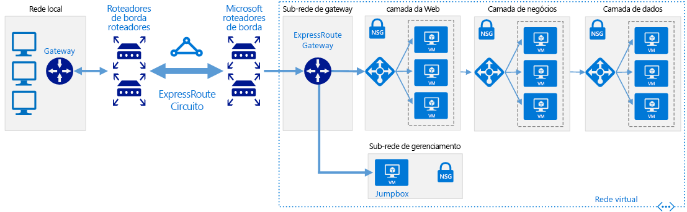

# Redes Definidas pelo Software: Rede híbridaSoftware Defined Networks: Hybrid network

A arquitetura de rede em nuvem híbrida permite que as redes virtuais acessem os recursos e serviços locais e vice-versa, usando uma Conexão WAN dedicada como o ExpressRoute ou outro método de conexão para conectar diretamente as redes.The hybrid cloud network architecture allows virtual networks to access your on-premises resources and services and vice versa, using a Dedicated WAN connection such as ExpressRoute or other connection method to directly connect the networks.

Com base na arquitetura de rede virtual nativa de nuvem, uma rede virtual híbrida é isolada quando criada inicialmente.Building on the cloud native virtual network architecture, a hybrid virtual network is isolated when initially created. Adicionar conectividade ao ambiente local concede acesso de e para a rede local, embora todos os outros recursos de direcionamento de tráfego de entrada na rede virtual precisem ser explicitamente permitidos.Adding connectivity to the on-premises environment grants access to and from the on-premises network, although all other inbound traffic targeting resources in the virtual network need to be explicitly allowed. É possível proteger a conexão usando dispositivos de firewall virtuais e regras de roteamento para limitar o acesso, especificar exatamente quais serviços podem ser acessados entre as duas redes usando recurso de roteamento nativo de nuvem, ou implantando NVAs (dispositivos virtuais de rede) para gerenciar o tráfego.You can secure the connection using virtual firewall devices and routing rules to limit access or you can specify exactly what services can be accessed between the two networks using cloud-native routing features or deploying network virtual appliances (NVAs) to manage traffic.

Embora a arquitetura de rede híbrida dê suporte a conexões VPN, as Conexões WAN dedicadas, como o ExpressRoute, geralmente são preferidas devido ao desempenho mais alto e maior segurança.Although the hybrid networking architecture supports VPN connections, dedicated WAN connections like ExpressRoute are generally preferred due to higher performance and increased security.

## Suposições sobre a rede híbridaHybrid assumptions

Implantar uma rede virtual híbrida supõe o seguinte:Deploying a hybrid virtual network assumes the following:

- As equipes de segurança de TI alinham a política de segurança de rede local e baseada em nuvem para garantir que as redes virtuais baseadas em nuvem sejam confiáveis para a comunicação direta com os sistemas locais.Your IT security teams have aligned on-premises and cloud-based network security policy to ensure cloud-based virtual networks can be trusted to communicated directly with on-premises systems.
- As cargas de trabalho baseadas em nuvem exigem acesso a armazenamento, aplicativos e serviços hospedados nas redes locais ou de terceiros, ou os usuários ou aplicativos locais precisam de acesso a recursos hospedados em nuvem.Your cloud-based workloads require access to storage, applications, and services hosted on your on-premises or third-party networks, or your users or applications in your on-premises need access to cloud-hosted resources.
- Você precisa migrar aplicativos e serviços existentes que dependem de recursos locais, mas não quer gastar os recursos em redesenvolvimento para remover essas dependências.You need to migrate existing applications and services that depend on on-premises resources, but don't want to expend the resources on redevelopment to remove those dependencies.
- A implementação de uma VPN ou Conexão WAN dedicada entre as redes locais e o provedor de nuvem não é impedida pela política corporativa, pelos requisitos regulamentares ou problemas de compatibilidade técnica.Implementing a VPN or dedicated WAN connection between your on-premises networks and cloud provider is not prevented by corporate policy, regulatory requirements, or technical compatibility issues.
- As cargas de trabalho não exigem várias assinaturas para ignorar os limites de recursos de assinatura, OU as cargas de trabalho envolvem várias assinaturas, mas não requerem gerenciamento central de conectividade ou serviços compartilhados usados por recursos distribuídos por várias assinaturas.Your workloads either do not require multiple subscriptions to bypass subscription resource limits, OR your workloads involve multiple subscriptions but do not require central management of connectivity or shared services used by resources spread across multiple subscriptions.

A equipe de Adoção de Nuvem deverá considerar os seguintes problemas ao analisar a implementação de uma arquitetura de rede virtual híbrida:Your Cloud Adoption team should consider the following issues when looking at implementing a hybrid virtual networking architecture:

- Conectar redes locais com redes em nuvem aumenta a complexidade dos requisitos de segurança.Connecting on-premises networks with cloud networks increases the complexity of your security requirements. Ambas as redes precisam ser protegidas contra vulnerabilidades externas e acesso não autorizado de ambos os lados do ambiente híbrido.Both networks need to be secured against external vulnerabilities and unauthorized access from both sides of the hybrid environment.
- O dimensionamento do número e tamanho das cargas de trabalho em um ambiente de nuvem híbrida pode adicionar uma complexidade significativa ao gerenciamento de tráfego e roteamento.Scaling the number and size of workloads within a hybrid cloud environment can add significant complexity to routing and traffic management.
- Será necessário desenvolver políticas de gerenciamento e controle de acesso compatíveis para manter uma governança consistente em toda a organização.You will need to develop compatible management and access control policies to maintain consistent governance throughout your organization.

## Saiba maisLearn more

Consulte o seguinte para obter mais informações sobre a rede híbrida na plataforma do Azure.See the following for more information about hybrid networking in the Azure platform.

- [Arquitetura de referência de rede híbrida](../../../reference-architectures/hybrid-networking/expressroute.md).[Hybrid network reference architecture](../../../reference-architectures/hybrid-networking/expressroute.md). As redes virtuais híbridas do Azure usam um circuito de ExpressRoute ou uma VPN do Azure para conectar a rede virtual aos ativos de TI hospedados não Azure existentes da organização.Azure hybrid virtual networks use either an ExpressRoute circuit or Azure VPN to connect your virtual network with your organization's existing non-Azure hosted IT assets. Este artigo aborda as opções para criar uma rede híbrida no Azure.This article discusses the options for creating a hybrid network in Azure.
