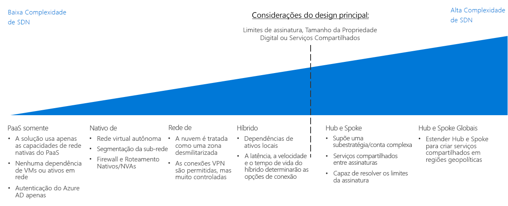

# CAF: Guia de decisão de rede definida pelo software

A SDN (Rede Definida pelo Software) é uma arquitetura de rede projetada para permitir a funcionalidade de rede virtualizada que pode ser gerenciada, configurada e modificada centralmente por meio de software. A SDN fornece uma camada de abstração sobre a infraestrutura de rede física e habilita o equivalente virtualizado a roteadores físicos, firewalls e outro hardware de rede que possa ser localizado em uma rede local.

A SDN permite que a equipe de TI configure e implante estruturas de rede e recursos que deem suporte às necessidades de carga de trabalho usando recursos virtualizados. A flexibilidade do gerenciamento de implantação baseada em software permite a rápida modificação de recursos de rede e a capacidade de dar suporte a modelos de implantação ágeis e tradicionais. As redes virtualizadas criadas com a tecnologia de SDN são essenciais para a criação de redes seguras em uma plataforma de nuvem pública.

## Guia de decisão de rede

Ir para: [Somente PaaS](paas-only.md) | [Nativo de Nuvem](cloud-native.md) | | [DMZ de Nuvem](cloud-dmz.md) [Híbrido](hybrid.md) | [Modelo Hub-Spoke](hub-spoke.md) | [Saiba mais](#learn-more)

A SDN oferece várias opções com diferentes graus de complexidade e preço. O guia de descoberta acima fornece uma referência para personalizar rapidamente essas opções e alcançar melhor alinhamento com as estratégias tecnológicas e específicas do negócio.

O ponto de inflexão nesse guia depende de várias decisões importantes que a equipe de Estratégia de Nuvem tenha realizado antes de tomar decisões sobre a arquitetura de rede. Entre elas, as mais importantes são as decisões que envolvem a [definição de Propriedade Digital ](../../digital-estate/overview.md) e [Design de Assinatura](../subscriptions/overview.md) (que também pode exigir inserções das decisões tomadas relacionadas às estratégias de mercados globais e contabilidade de nuvem).

Implantações de região única e pequena de menos de 1.000 VMs têm menor probabilidade de serem significativamente afetadas por esse ponto de inflexão. Por outro lado, grandes esforços de adoção com mais de 1.000 VMs, várias unidades de negócios ou vários mercados geopolíticos podem ser substancialmente afetados pela decisão de SDN e esse ponto-chave de inflexão.

## Escolher as arquiteturas de rede virtual corretas

Essa seção expande o guia de decisão para ajudá-lo a escolher as arquiteturas de rede virtual corretas.

Há muitas maneiras de implementar tecnologias de SDN para criar redes virtuais baseadas em nuvem. O modo como você estrutura as redes virtuais usadas na migração e como essas redes interagem com a infraestrutura de TI existente dependerá de uma combinação dos requisitos de carga de trabalho e os requisitos de controle.

Ao planejar qual arquitetura de rede virtual ou combinação de arquiteturas deverá ser considerada ao planejar a migração na nuvem, considere as seguintes perguntas para ajudar a determinar a correta para a organização:

| Pergunta | Somente PaaS | Nativo de nuvem | DMZ de nuvem | Híbrido | Hub e Spoke |
|-----|-----|-----|-----|-----|-----|
| A carga de trabalho utilizará apenas serviços de PaaS e não exigirá recursos de rede além daqueles fornecidos pelos próprios serviços? | Sim | Não | Não | Não | Não  |
| A carga de trabalho requer integração com aplicativos locais? | Não  | Não  | sim | sim | Sim |
| Você estabeleceu políticas de segurança sólidas e conectividade segura entre o local e as redes na nuvem? | Não  | Não | Não  | sim | Sim |
| A carga de trabalho exige serviços de autenticação que não têm suporte por meio dos serviços de identidade na nuvem ou você precisa de acesso direto aos controladores de domínio locais? | Não  | Não | Não  | sim | Sim |
| Você precisará implantar e gerenciar um grande número de VMs e cargas de trabalho? | Não  | Não | Não | Não  | Sim |
| Você precisará fornecer gerenciamento centralizado e conectividade local ao delegar controle sobre recursos a equipes de carga de trabalho individuais? | Não  | Não | Não | Não  | Sim |

## Arquiteturas de redes virtuais

Saiba mais sobre as principais arquiteturas de rede definidas pelo software:

- [**Somente PaaS**](paas-only.md): Os produtos de PaaS (plataforma como serviço) dão suporte a um conjunto limitado de recursos de rede internos e podem não exigir uma rede definida pelo software definida explicitamente para dar suporte aos requisitos de carga de trabalho.
- [**Nativo de Nuvem**](cloud-native.md): Uma rede virtual nativa de nuvem é a arquitetura de rede definida pelo software padrão ao implantar recursos em uma plataforma de nuvem.
- [**DMZ de Nuvem**](cloud-dmz.md): Fornece conectividade limitada entre a rede local e de nuvem, que é protegida por meio da implementação de uma zona desmilitarizada no ambiente de nuvem.
- [**Híbrido**](hybrid.md): A arquitetura de rede de nuvem híbrida permite que as redes virtuais acessem os recursos locais e vice-versa.
- [**Hub e Spoke**](hub-spoke.md): A arquitetura hub e spoke permite gerenciar centralmente a conectividade externa e os serviços compartilhados, isolar as cargas de trabalho individuais e superar possíveis limites de assinatura.

## Saiba mais

Consulte o documento a seguir para obter mais informações sobre rede definida pelo software na plataforma do Azure.

- [Rede Virtual do Microsoft Azure](/azure/virtual-network/virtual-networks-overview). No Azure, o recurso de SDN principal é fornecido pela Rede Virtual do Azure, que atua como um análogo de nuvem para redes locais físicas. As redes virtuais também atuam como um limite de isolamento padrão entre recursos na plataforma.
- [Melhores práticas do Grupo de Segurança de Rede do Azure](/azure/security/azure-security-network-security-best-practices). Recomendações da equipe de Segurança do Azure sobre como configurar as redes virtuais para minimizar as vulnerabilidades de segurança.

## Próximas etapas

Saiba como os logs, monitoramento e relatórios são utilizados pelas equipes de operações para gerenciar a integridade e a conformidade com as políticas das cargas de trabalho da nuvem.

> [!div class="nextstepaction"]
> [Logs e relatórios](../log-and-report/overview.md)
