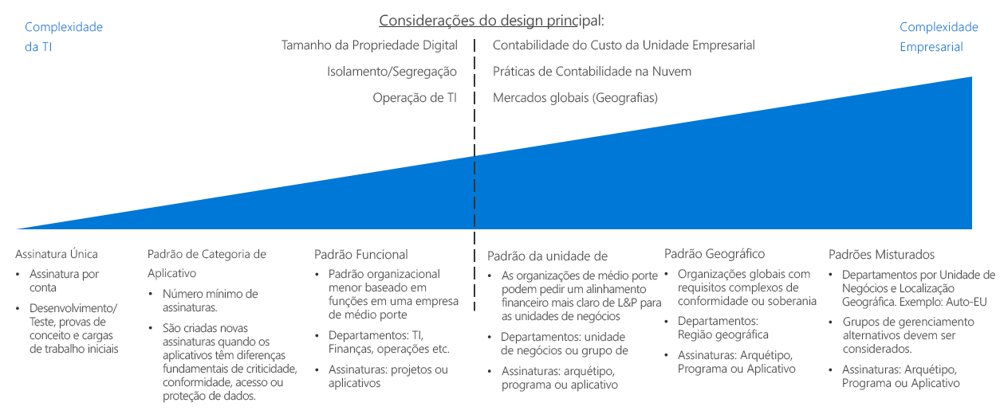
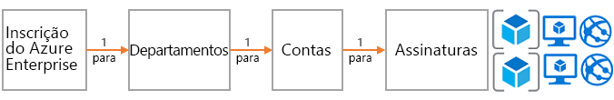
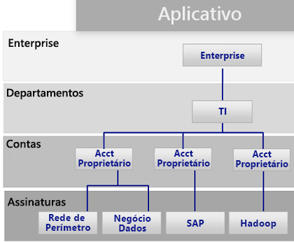
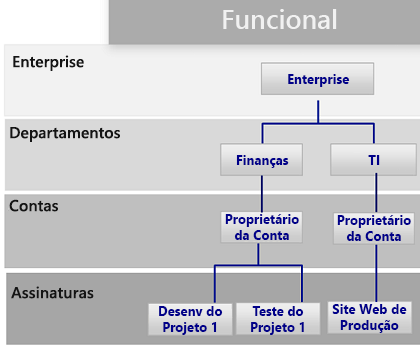
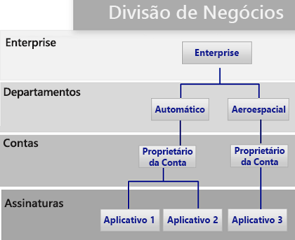
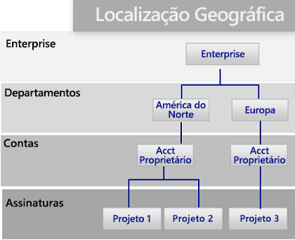

# Guia de decisão da assinaturaSubscription decision guide

Todas as plataformas de nuvem se baseiam em um modelo de propriedade principal que fornece às organizações várias opções de cobrança e de gerenciamento de recursos.All cloud platforms are based on a core ownership model that provides organizations with numerous billing and resource management options. A estrutura que o Azure usa é diferente de outros provedores de nuvem porque ela inclui várias opções de suporte à hierarquia organizacional e à propriedade de assinatura agrupada.The structure that Azure uses is different from other cloud providers because it includes various support options for organizational hierarchy and grouped subscription ownership. Independentemente disso, normalmente há um indivíduo responsável pela cobrança e outro que recebe a atribuição de proprietário de nível superior para fins de gerenciamento de recursos.Regardless, there is generally one individual responsible for billing and another who is assigned as the top-level owner for managing resources.

Ir para: [Design de assinaturas e Contratos Enterprise do Azure](#subscriptions-design-and-azure-enterprise-agreements) | [Padrões de design de assinatura](#subscription-design-patterns) | [Grupos de gerenciamento](#management-groups)  |  [Organização no nível da assinatura](#organization-at-the-subscription-level)Jump to: [Subscriptions design and Azure Enterprise Agreements](#subscriptions-design-and-azure-enterprise-agreements) | [Subscription design patterns](#subscription-design-patterns) | [Management groups](#management-groups) | [Organization at the subscription level](#organization-at-the-subscription-level)

O design de assinatura é uma das estratégias mais comuns que as empresas usam para estabelecer uma estrutura ou organizar ativos durante a adoção da nuvem.Subscription design is one of the most common strategies that companies use to establish a structure or organize assets during cloud adoption.

**Hierarquia de assinatura**: uma *assinatura* é uma coleção lógica de serviços do Azure (como máquinas virtuais, Bancos de Dados SQL, Serviços de Aplicativos ou contêineres).**Subscription hierarchy**: A *subscription* is a logical collection of Azure services (such as virtual machines, SQL DB, App Services, or containers). Cada ativo no Azure é implantado em uma assinatura única.Each asset in Azure is deployed to a single subscription. Cada assinatura pertence a uma *conta*.Each subscription is then owned by one *account*. A conta é uma conta de usuário (ou, de preferência, uma conta de serviço) que fornece acessos administrativo e de cobrança em uma assinatura.This account is a user account (or preferably a service account) that provides billing and administrative access across a subscription. Para clientes que tiverem assumido o compromisso de usar um valor específico do Azure por meio de um EA (Contrato Enterprise), outro nível de controle, chamado *departamento*, é adicionado.For customers who have made a commitment to use a specific amount of Azure through an Enterprise Agreement (EA), another level of control called a *department* is added. No portal do EA, assinaturas, contas e departamentos podem ser usados a fim de criar uma hierarquia para fins de cobrança e gerenciamento.In the EA portal, subscription, accounts, and departments can be used to create a hierarchy for billing and management purposes.

A complexidade dos designs de assinatura varia.The complexity of subscription designs varies. Decisões relativas a uma estratégia de design têm pontos de inflexão exclusivos, pois normalmente envolvem restrições tanto comerciais quanto de TI.Decisions regarding a design strategy have unique inflection points, as they typically involve both business and IT constraints. Antes de tomar decisões técnicas, os arquitetos de TI e os tomadores de decisão devem trabalhar com os stakeholders do negócio e com a equipe de estratégia para entender a abordagem contábil para a nuvem desejada, as práticas contábeis nas unidades de negócios e as necessidades de mercado globais da organização.Before making technical decisions, IT architects and decision makers should work with the business stakeholders and the cloud strategy team to understand the desired cloud accounting approach, cost accounting practices within your business units, and global market needs for your organization.

**Ponto de inflexão**: a linha pontilhada na imagem acima faz referência a um ponto de inflexão entre padrões simples e padrões mais complexos de design de assinatura.**Inflection point**: The dashed line in the image above references an inflection point between simple and more complex patterns for subscription design. Outros pontos de decisões técnicas com base no tamanho da propriedade digital comparados com os limites da assinatura do Azure, as políticas de isolamento e de diferenciação e as divisões operacionais de TI geralmente afetam de forma substancial o design de assinatura.Additional technical decision points based on digital estate size versus Azure subscription limits, isolation and segregation policies, and IT operational divisions usually have a significant effect on subscription design.

**Outras considerações**: Uma coisa importante a se observar ao selecionar um design de assinatura é que as assinaturas não são a única maneira de agrupar recursos ou implantações.**Other considerations**: An important thing to note when selecting a subscription design is that subscriptions aren’t the only way to group resources or deployments. As assinaturas foram criadas nos primórdios do Azure e, como tal, elas têm limitações relacionadas a soluções do Azure anteriores, como o Azure Service Manager.Subscriptions were created in the early days of Azure, as such they have limitations related to previous Azure solutions like Azure Service Manager.

A estrutura de implantação, a automação e novas abordagens ao agrupamento de recursos podem afetar o design de assinatura estruturado.Deployment structure, automation, and new approaches to grouping resources can affect your structure subscription design. Antes de finalizar um design de assinatura, considere como as decisões de [consistência de recursos](../resource-consistency/overview.md) podem influenciar as escolhas de design.Before finalizing a subscription design, consider how [resource consistency](../resource-consistency/overview.md) decisions might influence your design choices. Por exemplo, uma grande empresa multinacional pode inicialmente levar em conta um padrão complexo para o gerenciamento da assinatura.For example, a large multinational organization might initially consider a complex pattern for subscription management. No entanto, a mesma empresa pode ter melhores benefícios com um padrão de unidade de negócios mais simples adicionando uma hierarquia do grupo de gerenciamento.However, that same company might realize greater benefits with a simpler business unit pattern by adding a management group hierarchy.

## Design de assinaturas e Contratos Enterprise do AzureSubscriptions design and Azure Enterprise agreements

Todas as assinaturas do Azure estão associadas uma conta, que está conectada ao controle de acesso de cobrança e de nível superior para cada assinatura.All Azure subscriptions are associated with one account, which is connected to billing and top-level access control for each subscription. Uma mesma conta pode ter várias assinaturas e fornecer um nível base à organização das assinaturas.A single account can own multiple subscriptions and can provide a base level of subscriptions organization.

Para pequenas implantações do Azure, uma assinatura única ou pequena coleção de assinaturas pode compor o acervo de nuvem completo.For small Azure deployments, a single subscription or a small collection of subscriptions may compose your entire cloud estate. No entanto, grandes implantações do Azure provavelmente precisam abranger várias assinaturas para dar suporte a sua estrutura organizacional e ignorar [cotas e limites de assinatura](/azure/azure-subscription-service-limits).However, large Azure deployments likely need to span multiple subscriptions to support your organizational structure and bypass [subscription quotas and limits](/azure/azure-subscription-service-limits).

Cada Contrato Enterprise do Azure permite maior organização de assinaturas e contas em hierarquias que refletem suas prioridades organizacionais.Each Azure Enterprise Agreement provides a further ability to organize subscriptions, and accounts into hierarchies that reflect your organizational priorities. O registro empresarial de sua organização define a forma e o uso dos serviços do Azure na empresa sob uma perspectiva contratual.Your organizational enterprise enrollment defines the shape and use of Azure services within your company from a contractual point of view. É possível, em cada contrato Enterprise, subdividir o ambiente em departamentos, contas e assinaturas correspondentes à estrutura da organização.Within each enterprise agreement, you can further subdivide the environment into departments, accounts, and subscriptions to match your organization's structure.

## Padrões de design de assinaturaSubscription design patterns

Cada empresa é diferente.Every enterprise is different. Portanto, a hierarquia de departamento/conta/assinatura habilitada por meio de um Contrato Enterprise do Azure permite grande flexibilidade em relação a como o Azure é organizado.Therefore, the department/account/subscription hierarchy enabled throughout an Azure Enterprise Agreement allows for significant flexibility in how Azure is organized. A primeira e mais importante decisão que você pode tomar ao começar a usar a nuvem pública é modelar a hierarquia da organização para refletir as necessidades da empresa em termos de cobrança, gerenciamento e acesso a recursos.Modeling your organization's hierarchy to reflect the needs of your company for billing, resource management, and resource access is the first, and most important, decision that you make when starting in the public cloud.

Os seguintes padrões de assinatura refletem um aumento geral na complexidade do design de assinatura para dar suporte a possíveis prioridades organizacionais:The following subscription patterns reflect a general increase in subscription design complexity to support potential organizational priorities:

### Assinatura únicaSingle subscription

Uma assinatura única por conta pode ser suficiente para organizações que precisam implantar um pequeno número de ativos hospedados na nuvem.A single subscription per account may suffice for organizations that need to deploy a small number of cloud-hosted assets. Ele geralmente é o primeiro padrão de assinatura implementado no início de um processo de adoção de nuvem, permitindo que implantações de prova de conceito ou experimentais em pequena escala explorem as funcionalidades de uma plataforma de nuvem.This is often the first subscription pattern you implement when beginning your cloud adoption process, allowing small-scale experimental or proof of concept deployments to explore the capabilities of a cloud platform.

No entanto, pode haver limitações técnicas ao número de recursos com suporte por uma assinatura única.However, there can be technical limitations to the number of resources that a single subscription will support. À medida que aumenta o tamanho do seu acervo de nuvem, você provavelmente precisará também dar suporte à organização dos recursos para organizar melhor políticas e controle de acesso de uma maneira que não tem suporte pela assinatura única.As the size of your cloud estate grows, you may likely want to also support organizing your resources to better organize policies and access control in a manner not supported with a single subscription.

### Padrão de categoria do aplicativoApplication category pattern

Conforme o volume de uma organização vai crescendo na nuvem, cresce também a probabilidade de se ter que usar várias assinaturas.As the size of an organization's cloud footprint grows, the use of multiple subscriptions becomes increasingly likely. Para isso, as assinaturas geralmente são criadas para dar suporte a aplicativos com diferenças fundamentais em relação ao grau de importância no negócio, aos requisitos de conformidade, aos controles de acesso ou às necessidades de proteção de dados.In this scenario, subscriptions are generally created to support applications that have fundamental differences in business criticality, compliance requirements, access controls, or data protection needs. As assinaturas e contas que dão suporte a essas categorias de aplicativo são organizadas em um único departamento que pertence e é administrado pela equipe central de operações de TI.The subscriptions and accounts supporting these application categories are all organized under a single department which is owned and administered by central IT operations staff.

Cada organização escolherá categorizar os aplicativos de forma diferente, geralmente separando as assinaturas com base em serviços ou aplicativos específicos, ou de acordo com arquétipos de aplicativo.Each organization will choose to categorize applications differently, often separating subscriptions based on specific applications or services or along the lines of application archetypes. Algumas cargas de trabalho que podem justificar uma assinatura separada de acordo com o padrão em questão incluem:Workloads that might justify a separate subscription under this pattern include:

- Aplicativos experimentais ou de baixo riscoExperimental or low-risk applications
- Aplicativos com dados protegidosApplications with protected data
- Cargas de trabalho críticasMission-critical workloads
- Aplicativos sujeitos a requisitos regulatórios (como HIPAA ou FedRAMP)Applications subject to regulatory requirements (such as HIPAA or FedRAMP)
- Cargas de trabalho em lotesBatch workloads
- Cargas de trabalho de Big Data, como o HadoopBig data workloads such as Hadoop
- Cargas de trabalho em contêineres que usam orquestradores de implantação, como o KubernetesContainerized workloads using deployment orchestrators such as Kubernetes
- Cargas de trabalho de análiseAnalytics workloads

O padrão mencionado dá suporte a vários proprietários de contas responsáveis por cargas de trabalho específicas.This pattern supports multiple accounts owners responsible for specific workloads. Já que ele não possui uma estrutura mais complexa no nível de departamento da hierarquia do Contrato Enterprise, o padrão não requer um Contrato Enterprise do Azure para ser implementado.As it lacks a more complex structure at the department level of the enterprise agreement hierarchy, this pattern does not require an Azure Enterprise Agreement to implement.

### Padrão funcionalFunctional pattern

É um padrão que organiza assinaturas e contas conforme linhas funcionais, como financeiro, vendas ou suporte de TI, usando a hierarquia de Empresa/Departamento/Conta/Assinatura fornecida aos clientes do Contrato Enterprise do Azure.This pattern organizes subscriptions and accounts along functional lines, such as finance, sales, or IT support, using the Enterprise/Department/Account/subscription hierarchy provided to Azure enterprise agreement customers.

### Padrão da unidade de negóciosBusiness unit pattern

É um padrão que agrupa assinaturas e contas com base na categoria de lucros e prejuízos, unidade de negócios, divisão, centro de lucro ou estrutura de negócios semelhante usando a hierarquia do Contrato Enterprise do Azure.This pattern groups subscriptions and accounts based on profit and loss category, business unit, division, profit center, or similar business structure using the Azure Enterprise Agreement hierarchy.

### Padrão geográficoGeographic pattern

Para organizações com operações globais, é um padrão que agrupa assinaturas e contas com base em regiões geográficas usando a hierarquia do Contrato Enterprise do Azure.For organizations with global operations, this pattern groups subscriptions and accounts based on geographic regions using the Azure Enterprise Agreement hierarchy.

### Padrões mistosMixed patterns

Hierarquia de empresa/departamento/conta/assinaturas.enterprise/department/account/subscriptions hierarchy. No entanto, você pode combinar os padrões, como região geográfica e unidade de negócios, para refletir estruturas de cobrança e organizacionais mais complexas em sua empresa.However, you can combine patterns such as geographic region and business unit to reflect more complex billing and organizational structures within your company. Além disso, o [design de consistência de recursos](../resource-consistency/overview.md) poderá estender ainda mais a governança e a estrutura organizacional de seu design de assinatura.In addition, your [resource consistency design](../resource-consistency/overview.md) can further extend the governance and organizational structure of your subscription design.

Os grupos de gerenciamento, conforme discutido na seção a seguir, podem ajudar a dar suporte a estruturas organizacionais mais complicadas.Management groups, as discussed in the following section, can help support more complicated organizational structures.

Os grupos de gerenciamento, discutidos na seção a seguir, podem ajudar a dar suporte a estruturas organizacionais mais complicadas.Management groups, discussed in the following section, can help support more complicated organizational structures.

## Grupos de gerenciamentoManagement groups

Além da estrutura de departamento e organização fornecida pelos Contratos Enterprise, os [grupos de gerenciamento do Azure](/azure/governance/management-groups/index) oferecem maior flexibilidade para organizar controle de acesso, política e conformidade entre várias assinaturas.In addition to the department and organization structure provided through Enterprise Agreements, [Azure management groups](/azure/governance/management-groups/index) offer additional flexibility for organizing policy, access control, and compliance across multiple subscriptions. Grupos de gerenciamento podem ser aninhados em até seis níveis, permitindo que você crie uma hierarquia separada da hierarquia de cobrança.Management groups can be nested up to six levels, allowing you to create a hierarchy that is separate from your billing hierarchy. Isso pode ocorrer exclusivamente para o gerenciamento eficiente dos recursos.This can be solely for efficient management of resources.

Os grupos de gerenciamento podem espelhar a hierarquia de cobrança; é comum as empresas começarem assim.Management groups can mirror your billing hierarchy, and often enterprises start that way. No entanto, o poder dos grupos de gerenciamento surge quando você os utiliza para modelar a organização de modo que as assinaturas relacionadas &mdash; independentemente de onde elas estejam na hierarquia de cobrança, &mdash; sejam agrupadas e precisem de funções comuns atribuídas, junto com iniciativas e políticas.However, the power of management groups is when you use them to model your organization where related subscriptions &mdash; regardless of where they are in the billing hierarchy &mdash; are grouped together and need common roles assigned along with policies and initiatives.

Os exemplos incluem:Examples include:

- Produção/não produção: Algumas empresas criam grupos de gerenciamento para identificar suas assinaturas de produção e não produção.Production/non-production: Some enterprises create management groups to identify their production and non-production subscriptions. Os grupos de gerenciamento permitem que esses clientes gerenciem mais facilmente funções e políticas, por exemplo: uma assinatura que não é de produção pode permitir aos desenvolvedores o acesso de “colaborador”, mas em uma de produção, eles têm apenas acesso de “leitor”.Management groups allow these customers to more easily manage roles and policies, for example: non-production subscription may allow developers "contributor" access, but in production, they have only "reader" access.
- Serviços internos/externos: Assim como ocorre com o par produção/não produção, as empresas geralmente têm requisitos, políticas e funções diferentes para serviços internos e externos (voltados para o cliente).Internal services/external services: Much like production/non-production, enterprises often have different requirements, policies, and roles for internal services versus external customer-facing services.

## Organização no nível da assinaturaOrganization at the subscription level

Ao determinar seus departamentos e contas (ou grupos de gerenciamento), você precisará inicialmente decidir como vai dividir o ambiente do Azure para corresponder à organização.When determining your departments and accounts (or management groups), you will primarily need to decide how you're going to divide your Azure environment to match your organization. No entanto, as assinaturas são onde o trabalho realmente acontece, e as decisões envolvidas afetarão a segurança, a escalabilidade e a cobrança.However, subscriptions are where the real work happens, and these decisions will impact security, scalability, and billing.

Considere os seguintes padrões como guias:Consider the following patterns as guides:

- **Aplicativo/serviço**: as assinaturas representam um aplicativo ou um serviço (portfólio de aplicativos).**Application/service**: Subscriptions represent an application or a service (portfolio of applications).

- **Ciclo de vida**: as assinaturas representam um ciclo de vida de um serviço, como desenvolvimento ou produção.**Lifecycle**: Subscriptions represent a lifecycle of a service, such as production or development.

- **Departamento**: as assinaturas representam departamentos na organização.**Department**: Subscriptions represent departments in the organization.

Os dois primeiros padrões são mais comumente utilizados, e são ambos altamente recomendáveis.The first two patterns are the most commonly used and are both highly recommended. A abordagem de ciclo de vida é adequada à maioria das organizações.The lifecycle approach is appropriate for most organizations. Aqui, a recomendação geral é usar duas assinaturas base, produção e não produção, e usar grupos de recursos para detalhar ainda mais os ambientes.In this case, the general recommendation is to use two base subscriptions: production and non-production, and then use resource groups to break out the environments further.

Para obter uma descrição geral de como os grupos de recursos e as assinaturas do Azure são usados, confira [Gerenciamento de acesso a recursos no Azure](../../getting-started/azure-resource-access.md).For a general description of how Azure subscriptions and resource groups are used to group and manage resources, see [Resource access management in Azure](../../getting-started/azure-resource-access.md).

## Próximas etapasNext steps

Saiba como os serviços de identidade são usados no gerenciamento e no controle de acesso na nuvem.Learn how identity services are used for access control and management in the cloud.

> [!div class="nextstepaction"]
> [IdentidadeIdentity](../identity/overview.md)
