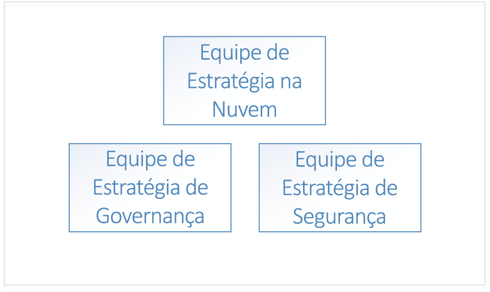
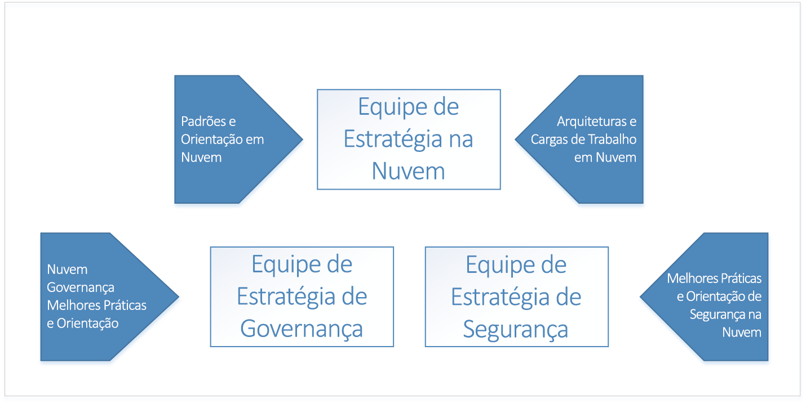
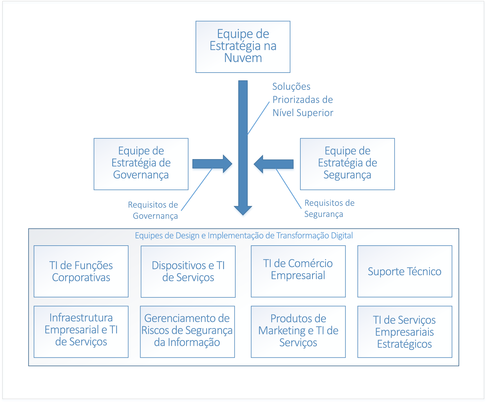

# Introdução à Estrutura de Adoção de NuvemGetting started with the Cloud Adoption Framework

A **transformação digital** para a computação em nuvem representa uma mudança da operação local para a operação na nuvem.The **digital transformation** to cloud computing represents a shift from operating on-premises to operating in the cloud. Essa mudança inclui novas maneiras de fazer negócios — por exemplo, a transformação digital muda de despesas de capital com software e hardware do data center para despesas operacionais com o uso dos recursos de nuvem.This shift includes new ways of doing business - for example, the digital transformation shifts from capital expenditures for software and datacenter hardware to operating expenditures for usage of cloud resources. Introdução à [Estrutura de Adoção de Nuvem da Microsoft para Azure](../overview.md).Let's see how to get started using the [Microsoft Cloud Adoption Framework for Azure](../overview.md).

## Processo de transformação digitalThe digital transformation process

Para obter êxito na adoção da nuvem, uma empresa deve preparar a organização, o pessoal e os processos para a transformação digital.To be successful in adopting the cloud, an enterprise must prepare its organization, people, and processes to be ready for this digital transformation. Toda estrutura organizacional empresarial é diferente, portanto, não há uma abordagem única para a preparação da organização.Every enterprise's organizational structure is different, so there is no one-size-fits-all approach to organizational readiness. Este documento descreve as etapas de alto nível que sua empresa pode seguir para se preparar.This document outlines the high-level steps your enterprise can take to get ready. Sua organização terá de passar um tempo desenvolvendo um plano detalhado para realizar cada uma das etapas listadas.Your organization will have to spend time developing a detailed plan to accomplish each of the listed steps.

O processo de alto nível para a transformação digital inclui:The high-level process for the digital transformation is:

1. Criar uma equipe de estratégia de nuvem.Create a cloud strategy team. Essa equipe é responsável por comandar a transformação digital.This team is responsible for leading the digital transformation. Nesse estágio, também é importante formar uma equipe de governança e uma equipe de segurança para a transformação digital.It's also important at this stage to form a governance team and a security team for the digital transformation.
2. Os membros da equipe de estratégia de nuvem aprendem o que há de novo e diferente sobre tecnologias de nuvem.Members of the cloud strategy team learn what's new and different about cloud technologies.
3. A equipe de estratégia de nuvem prepara a empresa, criando o caso comercial para a transformação digital — enumera todas as lacunas atuais na estratégia de negócios e determina as soluções de alto nível para eliminá-las.The cloud strategy team prepares the enterprise by building the business case for digital transformation - enumerates all the current gaps in business strategy and determines the high-level solutions to eliminate them.
4. Alinhar as soluções de alto nível com grupos de negócios.Align high-level solutions with business groups. Em cada grupo comercial, identifique os stakeholders que serão responsáveis pelo design e implementação para cada solução.Identify stakeholders in each business group to own the design and implementation for each solution.
5. Modifique as funções, habilidades e processos existentes para incluir funções, habilidades e processos de nuvem.Translate existing roles, skills and process to include cloud roles, skills, and process.

<!--6. Develop processes for operating in the cloud to make solutions more robust in terms of availability, resiliency, and security.
1. Optimize solutions for performance, scalability, and cost efficiency.-->

## Etapa 1: Criar uma equipe de estratégia de nuvemStep 1: Create a cloud strategy team

A primeira etapa no processo de transformação digital da sua empresa é envolver líderes de negócios de toda a organização para criar uma CST (equipe de estratégia de nuvem).The first step in your enterprise's digital transformation is engaging business leaders from across the organization to create a cloud strategy team (CST). Essa equipe é composta por líderes de negócios do departamento financeiro, da infraestrutura de TI e de grupos de aplicativos.This team consists of business leaders from finance, IT infrastructure, and application groups. Essas equipes podem ajudar na análise de nuvem e na fase de experimentação.These teams can help with the cloud analysis and experimentation phase.

Por exemplo, uma equipe de estratégia de nuvem pode ser conduzida pelo Diretor de Tecnologia (CTO) e ser composta por membros da equipe de arquitetura empresarial, do departamento financeiro de TI, de tecnólogos seniores de vários grupos de aplicativos de TI (RH, finanças e assim por diante) e por líderes das equipes de infraestrutura, segurança, e rede.For instance, a Cloud Strategy Team could be driven by the CTO and consist of members of the enterprise architecture team, IT finance, senior technologists from various IT applications groups (HR, finance, and so on), and leaders from the infrastructure, security, and networking teams.

Também é importante formar duas outras equipes de alto nível: uma equipe de governança e uma equipe de segurança.It's also important to form two other high-level teams: a governance team, and a security team. Essas equipes são responsáveis pelo design, implementação e manutenção de auditorias das políticas de segurança e governança da empresa.These teams are responsible for designing, implementing, and the ongoing audit of the enterprise's governance and security policies. A equipe de governança requer membros que tenham trabalhado com proteção de ativos, gerenciamento de custos, política de grupo e tópicos relacionados.The governance team requires members that have worked with asset protection, cost management, group policy and related topics. A equipe de segurança requer membros que estejam familiarizados com os padrões de segurança atuais do setor, assim como com os requisitos de segurança da empresa.The security team requires members that are well versed in current industry security standards as well as the enterprise's security requirements.

A equipe de governança é responsável por projetar e implementar o modelo de governança da empresa na nuvem, bem como implantar e manter os ativos de infraestrutura compartilhada que fazem parte da transformação digital.The governance team is responsible for designing and implementing the enterprise's governance model in the cloud, as well as deploying and maintaining the shared infrastructure assets that are part of the digital transformation. Esses ativos incluem o hardware, software e recursos da nuvem necessários para conectar a rede local à rede virtual na nuvem.These assets include hardware, software, and cloud resources necessary to connect the on-premises network to virtual networking in the cloud.

A equipe de segurança é responsável por projetar e implementar a política de segurança da empresa na nuvem, trabalhando de perto com a equipe de governança.The security team is responsible for designing and implementing the enterprise's security policy in the cloud, working closely with the governance team. A equipe de segurança é responsável pela extensão do limite de segurança da rede local, que inclui a rede virtual na nuvem.The security team owns the extension of the security boundary of the on-premises network to include virtual networking in the cloud. Isso pode significar a responsabilidade e manutenção dos firewalls de entrada e saída da rede virtual da nuvem, além de garantir que as ferramentas e políticas evitem a implantação de recursos não autorizados.This may take the form of owning and maintaining the inbound and outbound firewalls on the cloud virtual network as well as ensuring that tools and policy prevent the deployment of unauthorized resources.

## Etapa 2: Conhecer o que há de novo na nuvemStep 2: Learn what's new in the cloud

Na próxima etapa do processo de transformação digital da sua empresa, os membros da equipe de estratégia de nuvem deverão aprender como a tecnologia de nuvem mudará a maneira como a empresa faz negócios.The next step in your enterprise's digital transformation is for the members of the cloud strategy team to learn about how cloud technology will change the way the enterprise does business. Trata-se da preparação e do planejamento para as mudanças na empresa, no pessoal e na tecnologia.This is preparation and planning for the changes to your business, people, and technology. Isso é importante para que os membros da equipe de estratégia de nuvem reconheçam o que há de novo e de diferente na nuvem em comparação às infraestruturas locais.It's important for the members of the cloud strategy team to understand what's new and different in the cloud as compared to on-premises.

O ponto de partida para entender a nuvem é aprender [como o Azure funciona](what-is-azure.md) em um alto nível.The starting point for understanding the cloud is learning [how Azure works](what-is-azure.md) at a high level. Em seguida, saiba mais sobre os conceitos básicos da [governança no Azure](what-is-governance.md) na preparação para [entender o gerenciamento de acesso de recurso](azure-resource-access.md).Next, learn about the basics of [governance in Azure](what-is-governance.md) in preparation for [understanding resource access management](azure-resource-access.md).

Para o aprendizado avançado, a equipe de governança deve revisar os conceitos e guias de design na seção de governança da tabela de conteúdos.For advanced learning, the governance team should review the concepts and design guides in the governance section of the table of contents. As seções de infraestrutura e cargas de trabalho são úteis para aprender mais sobre arquiteturas típicas e cargas de trabalho na nuvem.The infrastructure and workloads sections are useful for learning about typical architectures and workloads in the cloud.

## Etapa 3: Identificar lacunas na estratégia de negóciosStep 3: Identify gaps in business strategy

A próxima etapa é a especificação dos problemas de negócios que exigem uma solução de transformação digital, pela equipe de estratégia de nuvem.The next step is for the cloud strategy team to enumerate the business problems that require a digital transformation solution. Por exemplo, uma empresa pode ter um datacenter local existente com o hardware de fim da vida útil que exige a substituição.For example, an enterprise may have an existing on-premises datacenter with end-of-life hardware that requires replacement. Em outro exemplo, uma empresa pode estar enfrentando dificuldades com o tempo de lançamento no mercado para novos recursos e serviços e pode estar atrasada em relação à concorrência.In another example, an enterprise may be experiencing difficulty with time-to-market for new features and services and may be falling behind to competition. Essas lacunas representam as *metas* da transformação digital da sua empresa.These gaps represent the *goals* of your enterprise's digital transformation.

As lacunas na estratégia de negócios podem ser classificadas nas seguintes categorias:Gaps in business strategy can be classified into the following categories:

|CategoriaCategory|DESCRIÇÃODescription|
|-----|-----|
|Gerenciamento de custoCost management|Representa uma lacuna na maneira que a empresa paga pela tecnologia.Represents a gap in the way the Enterprise pays for technology.|
|GovernançaGovernance|Representa uma lacuna nos processos usados pela empresa para proteger seus ativos contra o uso indevido que pode resultar em custos excessivos, problemas de segurança ou problemas de conformidade.Represents a gap in the processes used by the Enterprise to protect its assets from improper usage that might result in cost overruns, security issues, or compliance issues. |
|ConformidadeCompliance|Representa uma lacuna na maneira com que a empresa adere aos seus próprios processos internos e políticas, bem como leis externas, regulamentações e padrões.Represents a gap in the way the enterprise adheres to its own internal processes and policies as well as external laws, regulations, and standards. |
|SegurançaSecurity|Representa uma lacuna na maneira com que a empresa protege seus ativos de tecnologia e os dados contra ameaças externas.Represents a gap in the way the enterprise protects its technology and data assets from external threats. |
|Governança de dadosData governance|Representa uma lacuna na maneira com que uma empresa gerencia seus dados, especialmente os dados do cliente.Represents a gap in the way an enterprise manages its data, especially customer data. Por exemplo, o novo Regulamento Geral sobre a Proteção de Dados (RGPD) na União Europeia tem requisitos rigorosos para a proteção de dados do cliente que podem exigir novos hardware e software.For example, new General Data Protection Regulation (GDPR) in the European Union has strict requirements for the protection of customer data that may require new hardware and software.|

Depois de sua empresa classificar todas as lacunas de estratégia de negócios nessas categorias, a próxima etapa é determinar uma solução de alto nível para cada problema.Once your enterprise has classified all business strategy gaps into these categories, the next step is to determine a high-level solution for each problem.

A tabela a seguir ilustra diversos exemplos:The following table illustrates several examples:

|Lacuna de estratégia de negóciosBusiness strategy gap|Categoria &nbsp; &nbsp; &nbsp; &nbsp; &nbsp;Category &nbsp; &nbsp; &nbsp; &nbsp; &nbsp;|Solução &nbsp;&nbsp;&nbsp;&nbsp;&nbsp;&nbsp;&nbsp;&nbsp;&nbsp;&nbsp;&nbsp;&nbsp;&nbsp;&nbsp;Solution &nbsp;&nbsp;&nbsp;&nbsp;&nbsp;&nbsp;&nbsp;&nbsp;&nbsp;&nbsp;&nbsp;&nbsp;&nbsp;&nbsp;|
|-----|-----|-----|
| Os serviços atualmente hospedados no local apresentam problemas com disponibilidade, resiliência e escalabilidade durante o tempo de pico de demanda, que é aproximadamente dez por cento do uso.Services currently hosted on-premises experience issues with availability, resiliency, and scalability during time of peak demand, which is approximately ten percent of usage. Os servidores no data center local apresentam fim de vida útil.Servers in on-premises datacenter are end-of-life. A TI empresarial recomenda adquirir novo hardware local para o data center com as especificações para lidar com os picos de demanda.Enterprise IT recommends purchasing new on-premises hardware for datacenter with specifications to handle peak demand.| Gerenciamento de custoCost management | Migre as cargas de trabalho locais afetadas para recursos escalonáveis na nuvem, pagando somente pelo uso.Migrate affected existing on-premises workloads to scalable resources in the cloud, paying for usage only. |
| As leis e os regulamentos de gerenciamento de dados externos exigem que a empresa adira a um conjunto de controles padrão que requer criptografia de dados em repouso, exigindo novo hardware e software.External data management laws and regulations require the enterprise to adhere to set of standard controls that require encryption of data at rest, requiring new hardware and software. | Governança de dadosData governance | Mova dados para a criptografia do serviço de armazenamento do Azure para dados em repouso.Move data to Azure storage service encryption for data at rest. |
| Os serviços hospedados no data center local sofreram ataques de negação de serviço distribuído (DDoS) em serviços públicos.Services hosted in on-premises datacenter been experiencing distributed denial of service (DDoS) attacks on public-facing services. Os ataques são difíceis de atenuar e exigem que novas equipes de hardware, software e segurança os resolvam com eficiência.The attacks are difficult to mitigate and require new hardware, software, and security personnel to deal with effectively. | SegurançaSecurity | Migre os serviços para o Azure e tire proveito da proteção contra DDoS do Azure.Migrate services to Azure, and take advantage of Azure DDoS protection.|

Quando todas as lacunas na estratégia de negócios tiverem sido enumeradas e soluções de alto nível tiverem sido determinadas, priorize a lista.When all of the gaps in business strategy have been enumerated and high-level solutions have been determined, prioritize the list. A lista pode ser priorizada alinhando as lacunas de estratégia de negócios com as metas de curto e longo prazo da empresa em cada categoria.The list can be prioritized by aligning the business strategy gaps with the enterprise's short and long-term goals in each category. Por exemplo, se a empresa tem uma meta de curto prazo para reduzir custos de TI nos próximos dois trimestres fiscais, as lacunas de negócios na categoria de *gerenciamento de custos* podem ser priorizadas pela economia de custos projetada associada a cada uma delas.For example, if the enterprise has a short-term goal to reduce IT spend in the next two fiscal quarters, the business gaps in the *cost management* category may be prioritized by the projected cost saving associated with each.

A saída desse processo é uma lista com classificação da pilha com soluções de alto nível alinhadas com as categorias de negócios.The output of this process is a stack-ranked list of high-level solutions aligned with business categories.

## Etapa 4: Alinhar as soluções de alto nível com grupos de negócios para criar soluçõesStep 4: Align high-level solutions with business groups to design solutions

Agora que as metas da transformação digital foram enumeradas, priorizadas, e soluções de alto nível propostas, a próxima etapa é para a equipe de estratégia de nuvem alinhar cada uma das soluções de alto nível com as equipes de design e implementação em cada um dos grupos de negócios.Now that the goals of the digital transformation have been enumerated, prioritized, and high-level solutions proposed, the next step is for the cloud strategy team to align each of the high-level solutions with design and implementation teams in each of the business groups.

As equipes usam as listas priorizadas e trabalham em cada solução de alto nível para planejar cada solução.The teams take the prioritized lists and work through each high-level solution to design each solution. O processo de planejamento envolve a especificação de nova infraestrutura e novas cargas de trabalho.The design process will involve the specification of new infrastructure and new workloads. Também podem ocorrer alterações nas funções das pessoas e nos processos que elas seguem.There may also be changes to the roles of the people and the processes they follow. Nesse estágio, também é extremamente importante que cada uma das equipes de design inclua as equipes de governança e segurança para revisão de cada projeto.It's also extremely important at this stage for each of the design teams to include both the governance and security teams for review of each design. Cada design deve ficar dentro das políticas e dos procedimentos definidos pelas equipes de segurança e governança, e essas equipes devem ser incluídas na aprovação de cada design.Each design must fall within with the policies and procedures defined by the governance and security teams, and these teams must be included in the final sign off of each design.

O design de cada solução é uma tarefa não trivial e, à medida que os designs são criados, eles devem ser considerados no contexto com outros designs de solução de outras equipes.The design of each solution is a non-trivial task and as designs are created, must be considered in context with other solution designs from other teams. Por exemplo, se vários dos designs resultarem em uma migração de serviços de aplicativos existentes do local para a nuvem, pode ser mais eficiente agrupá-los e projetar uma estratégia geral de migração.For example, if several of the designs result in a migration of existing on-premises applications and services to the cloud, it may be more efficient to group these together and design an overall migration strategy. Em outro exemplo, pode não ser possível migrar alguns aplicativos locais e serviços existentes, e a solução pode ser substituí-los por novos serviços de desenvolvimento ou de terceiros.In another example, it may not be possible to migrate some existing on-premises applications and services and the solution may be to replace them with either new development or third-party services. Nesse caso, pode ser mais eficiente agrupar esses juntos e determinar a sobreposição entre eles para determinar se um serviço de terceiros pode ser usado para mais de uma solução.In this case, it may be more efficient to group these together and determine the overlap between them to determine if a third-party service can be used for more than one solution.

Depois que o design da solução for concluído, a equipe passa para a fase de implementação de cada design.Once the design of the solution is complete, the team moves on to the implementation phase for each design. A fase de implementação de cada design de solução pode ser executada usando processos de gerenciamento do design padrão.The implementation phase for each solution design can be run using standard project management processes.

## Etapa 5: Modificar as funções, habilidades e processos existentes para a nuvemStep 5: Translate existing roles, skills, and process for the cloud

Em cada fase evolucionária da história no setor de TI, as alterações mais notórias geralmente são marcadas por mudanças nas funções da equipe.At each evolutionary phase during the history of the IT industry, the most notable industry changes are often marked by changes in staff roles. Durante a transição dos mainframes para o modelo de cliente/servidor, a função do operador de computador desapareceu em grande parte, substituída pelo administrador do sistema.During the transition from mainframes to the client/server model, the role of the computer operator largely disappeared, replaced by the system administrator. Quando a era da virtualização chegou, a necessidade de indivíduos que trabalham com servidores físicos diminuiu, substituída por uma necessidade de especialistas em virtualização.When the age of virtualization arrived, the requirement for individuals working with physical servers diminished, replaced with a need for virtualization specialists. Da mesma forma, à medida que as instituições mudarem para computação em nuvem, as funções provavelmente mudarão novamente.Similarly, as institutions shift to cloud computing, roles will likely change again. Por exemplo, os especialistas de data center podem ser substituídos por analistas financeiros de nuvem.For example, datacenter specialists might be replaced with cloud financial analysts. Mesmo nos casos em que os cargos de trabalho de TI não foram alterados, as funções de trabalho diário evoluíram significativamente.Even in cases where IT job titles have not changed, the daily work roles have evolved significantly.

Os membros da equipe de TI podem se sentir ansiosos sobre suas funções e posições, pois percebem que é necessário um conjunto diferente de habilidades para o suporte de soluções em nuvem.IT staff members may feel anxious about their roles and positions as they realize that a different set of skills is needed for the support of cloud solutions. Mas funcionários ágeis que exploram e aprendem novas tecnologias de nuvem não precisam ter esse medo.But agile employees who explore and learn new cloud technologies don’t need to have that fear. Eles podem liderar a adoção de serviços de nuvem e ajudar a organização a entender e adotar as mudanças associadas.They can lead the adoption of cloud services and help the organization understand and embrace the associated changes.

### Capturando preocupaçõesCapturing concerns

Durante a transformação digital, cada equipe deve capturar quaisquer preocupações dos funcionários conforme elas surjam.During the digital transformation, each team should capture any staff concerns as they arise. Durante a captura de preocupações, identifique o seguinte:When capturing concerns, identify the following:

* O tipo de preocupação.The type of concern. Por exemplo, os trabalhadores podem ser resistentes às alterações em seus trabalhos que acompanham a transformação digital.For example, workers may be resistant to the changes in job duties that accompany the digital transformation.
* O efeito se o problema não for resolvido.The effect if the concern is not addressed. Por exemplo, a resistência à transformação digital pode resultar em trabalhadores executando lentamente as mudanças necessárias.For example, resistance to the digital transformation may be result in workers being slow to execute the changes necessary.
* A área equipada para tratar da preocupação.The area equipped to address the concern. Por exemplo, se os funcionários no departamento de TI estão relutantes em adquirir novas habilidades, a área de stakeholders da TI é a mais bem equipada para lidar com essa questão.For example, if workers in the IT department are reluctant to acquire new skills, the IT stakeholder's area is best equipped to address this concern. Identificar a área pode ficar claro para algumas questões e, nesses casos, talvez seja necessário escalonar para liderança executiva.Identifying the area may be clear for some concerns, and in these cases you may need to escalate to executive leadership.

### Identificar lacunasIdentify gaps

Outro aspecto para lidar com os problemas da transformação digital da sua empresa é identificar **lacunas**.Another aspect of working through the issues with your enterprise's digital transformation is identifying **gaps**. Uma lacuna é uma função, habilidade ou processo necessário para a transformação digital que atualmente não existe na sua empresa.A gap is a role, skill, or process required for your digital transformation that does not currently exist in your enterprise.

Comece enumerando as novas responsabilidades que acompanham a transformação digital, com ênfase em novas responsabilidades e responsabilidades atuais a serem desativadas.Begin by enumerating the new responsibilities that accompany the digital transformation, with an emphasis on new responsibilities and current responsibilities to be retired. Identifique a área que está alinhada com cada responsabilidade.Identify the area that is aligned with each responsibility. Para novas responsabilidades, determine o quanto está alinhada com a área.For new responsibilities, determine how closely aligned it is with the area. Algumas responsabilidades podem abranger várias áreas, e isso representa uma oportunidade para um melhor alinhamento que deve ser capturado como uma preocupação.Some responsibilities may span several areas, and this represents an opportunity for better alignment that should be captured as a concern. Caso nenhuma área seja identificada como responsável, use isso como uma lacuna.In the case where no area is identified as being responsible, capture this as a gap.

Em seguida, identifique as habilidades necessárias para dar suporte à responsabilidade.Next, identify the skills necessary to support the responsibility. Determine se sua empresa possui recursos existentes com essas habilidades.Determine if your enterprise has existing resources with these skills. Se não houver nenhum recurso existente, determine quais programas de treinamento ou aquisição de talentos são necessários.If there are no existing resources, determine what training programs or talent acquisition is necessary. Determine o período pelo qual a responsabilidade deve ser suportada para manter sua transformação digital no caminho certo.Determine the time frame by which the responsibility must be supported to keep your digital transformation on track.

Por fim, identifique as funções que executarão essas habilidades.Finally, identify the roles that will execute these skills. Parte da sua força de trabalho atual assumirá partes da função e, em outros casos, poderá ser necessária uma função inteiramente nova.Some of your existing workforce will assume parts of the role, and in other cases an entirely new role may be necessary.

### Parceria entre as equipesPartner across teams

As habilidades necessárias para preencher as lacunas na transformação digital de sua organização normalmente não se limitarão a uma única função ou a até mesmo a um único departamento.The skills necessary to fill the gaps in your organization's digital transformation will typically not be confined to a single role, or even a single department. Habilidades terão relações e dependências que podem abranger uma única ou várias funções, e essas funções podem existir em vários departamentos.Skills will have relationships and dependencies that can span a single role or multiple roles, and those roles may exist in several departments. Por exemplo, um proprietário de carga de trabalho pode exigir que alguém em uma função de TI provisione recursos principais, como assinaturas e grupos de recursos.For example, a workload owner may require someone in an IT role to provision core resources such as subscriptions and resource groups.

Essas dependências representam novos processos implementados pela organização para gerenciar o fluxo de trabalho entre funções.These dependencies represent new processes that your organization implements to manage the workflow between roles. No exemplo acima, há vários tipos diferentes de processo que podem dar suporte à relação entre o proprietário da carga de trabalho e a função de TI.In the above example, there are several different types of process that can support the relationship between the workload owner and the IT role. Por exemplo, uma ferramenta de fluxo de trabalho pode ser criada para gerenciar o processo ou um modelo de email simples pode ser utilizado.For example, a workflow tool can be created to manage the process, or, a simple email template can be used.

Acompanhe essas dependências e anote os processos que oferecerão suporte a eles e se o processo existe ou não atualmente.Track these dependencies and make note of the processes that will support them, and whether or not the process currently exists. Para processos que exigem ferramentas, verifique se a linha do tempo para a implantação de qualquer ferramenta está alinhada ao cronograma de transformação digital geral.For process that require tooling, ensure that the timeline for deploying any tools aligns with the overall digital transformation schedule.

## Próximas etapasNext steps

A transformação digital é um processo iterativo e, a cada iteração, as equipes envolvidas ficarão mais eficientes.The digital transformation is an iterative process, and with each iteration the teams involved will become more efficient.

> [!div class="nextstepaction"]
> [Entender como funciona o AzureUnderstand how Azure works](what-is-azure.md)
