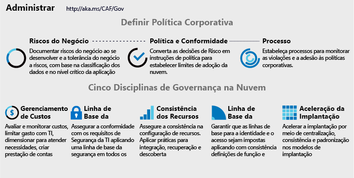

# Implementar uma estratégia de governança de nuvem

<!-- markdownlint-disable MD033 -->

<ul class="panelContent cardsI">
<li style="display: flex; flex-direction: column;">
    

        

            

                

Qualquer alteração em processos de negócios ou plataformas de tecnologia apresenta risco aos negócios. Equipes de governança de nuvem, cujos membros muitas vezes são conhecidos como responsáveis da nuvem, ficam encarregadas de atenuar esses riscos com interrupção mínima para os esforços de adoção ou inovação.  No entanto, a governança de nuvem requer mais do que a implementação técnica. Alterações sutis nas políticas corporativas narrativa ou corporativas podem afetar significativamente os esforços de adoção. Antes da implementação, é importante enxergar além da IT durante a definição de política corporativa.  
                

            

        

    

</li>
<li style="display: flex; flex-direction: column;">
    <a href="../_images/operational-transformation-govern-highres.png" style="display: flex; flex-direction: column; flex: 1 0 auto;">
        

            

                

                    

 
<i>Figura 1. Visual de política corporativa e as Cinco disciplinas de Governança de nuvem</i>
                    

                

            

        

    </a>
</li>
</ul>

<!-- markdownlint-enable MD033 -->

## Definir política corporativa

A definição de política corporativa se concentra na identificação e mitigação de riscos de negócios independentemente da plataforma de nuvem. Estratégia de governança de nuvem íntegra começa com a política corporativa de som. O processo de três etapas a seguir orienta o desenvolvimento iterativo dessas políticas.

<!-- markdownlint-disable MD033 -->

<ul  class="panelContent cardsF">
<li style="display: flex; flex-direction: column;">
    <a href="./policy-compliance/understanding-business-risk.md" style="display: flex; flex-direction: column; flex: 1 0 auto;">
        

            

                

                    

                        

                            
                        

                    

                    

                        <h3>Riscos de negócios</h3>
                        
Investigue os planos atuais de adoção de nuvem e a classificação de dados para identificar os riscos para os negócios. Trabalhe com os negócios para equilibrar a tolerância a risco e custos de mitigação.

                    

                

            

        

    </a>
</li>
<li style="display: flex; flex-direction: column;">
    <a href="./policy-compliance/define-policy.md" style="display: flex; flex-direction: column; flex: 1 0 auto;">
        

            

                

                    

                        

                            
                        

                    

                    

                        <h3>Política e conformidade</h3>
                        
Avalie a tolerância de risco para informar as políticas invasivas minimamente que regem a adoção de nuvem e atenua os riscos. Em alguns setores, a conformidade de terceiros afeta a criação de política inicial.

                    

                

            

        

    </a>
</li>
<li style="display: flex; flex-direction: column;">
    <a href="./policy-compliance/processes.md" style="display: flex; flex-direction: column; flex: 1 0 auto;">
        

            

                

                    

                        

                            
                        

                    

                    

                        <h3>Processos</h3>
                        
O ritmo das atividades de adoção e inovações naturalmente criará as violações de política. A execução de processos relevantes auxiliará na monitorando e impondo a conformidade com políticas.

                    

                

            

        

    </a>
</li>
</ul>

<!-- markdownlint-enable MD033 -->

## Próximas etapas

Estratégia de governança de nuvem de som começa com noções básicas sobre o risco de negócios.

> [!div class="nextstepaction"]
> [Noções básicas sobre o risco de negócios](./policy-compliance/understanding-business-risk.md)
