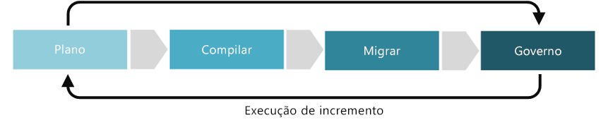

# Aperfeiçoamento da disciplina de Aceleração de implantação

A disciplina de Aceleração de implantação se concentra no estabelecimento de políticas que garantem que os recursos são implantados e configurados de forma consistente e repetidamente e permanecer em conformidade em todo seu ciclo de vida. Dentro das Cinco disciplinas de Governança de nuvem, a Aceleração de implantação inclui decisões sobre automatizar implantações, controlar o código-fonte de artefatos de implantação, monitorar os recursos implantados para manter o estado desejado e auditar qualquer problema de conformidade.

Este artigo descreve algumas tarefas possíveis que sua empresa pode realizar para desenvolver melhor e maturar a disciplina de Aceleração de implantação. Essas tarefas podem ser divididas entre as fases de planejamento, criação, adoção e operacional para a implementação de uma solução de nuvem, que depois são iteradas para permitir o desenvolvimento de uma [abordagem incremental para a governança de nuvem](../journeys/overview.md#an-incremental-approach-to-cloud-governance).

*Figura 1. Fases de adoção da abordagem incremental da governança de nuvem.*

É impossível para qualquer pessoa documentar os requisitos a serem levados em consideração de todas as empresas. Portanto, este artigo descreve as atividades de exemplo potenciais e mínimas sugeridas para cada fase do processo de amadurecimento da governança. O objetivo inicial dessas atividades é ajudar a criar um [MVP de política](../journeys/overview.md#an-incremental-approach-to-cloud-governance) e estabelecer uma estrutura para a evolução da política incremental. A equipe de Governança de Nuvem precisará decidir quanto investir nessas atividades para melhorar os recursos de controle de Linha de base de identidade.

> [!CAUTION]
> Nenhuma das atividades mínimas ou potenciais descritas neste artigo está alinhada a políticas corporativas específicas ou a requisitos de conformidade a terceiros. Essas diretrizes foram projetadas para ajudar a facilitar as conversas que levarão ao alinhamento de ambos os requisitos com um modelo de governança de nuvem.

## Planejamento e preparação

Esta fase de maturidade de governança une os resultados de negócios e as estratégias realizáveis. Durante esse processo, a equipe de liderança define métricas específicas, mapeia essas métricas ao estado digital e começa a planejar o esforço global de migração.

**Atividades mínimas sugeridas:**

- Avaliar suas opções [cadeia de ferramentas de Aceleração de implantação](toolchain.md) e implementar uma estratégia híbrida que é apropriada para sua organização.
- Desenvolver um documento com o esboço das Diretrizes de arquitetura e distribuí-lo aos principais stakeholders.
- Treinar e envolver as pessoas e equipes afetadas pelo desenvolvimento das Diretrizes de arquitetura.
- Treinar a equipe de TI para entender os princípios e estratégias de DevSecOps e a importância de implantações totalmente automatizadas na disciplina de aceleração de implantação e as equipes de desenvolvimento.

**Atividades potenciais:**

- Definir funções e atribuições que controlarão a aceleração de implantação na nuvem.

## Compilação e pré-implantação

**Atividades mínimas sugeridas:**

- Para novos aplicativos baseados em nuvem, introduza implantações totalmente automatizadas no início do processo de desenvolvimento. Esse investimento melhorará a confiabilidade de seus processos de testes e garantirá a consistência em seus ambientes de desenvolvimento, garantia de qualidade e produção.
- Armazenar todos os artefatos de implantação como modelos de implantação ou scripts de configuração usando uma plataforma de controle de código-fonte como GitHub ou Azure DevOps.
- Considerar um teste do piloto antes de implementar sua [cadeia de ferramentas de Aceleração de implantação](toolchain.md), garantindo que ele simplifica a suas implantações tanto quanto possível. Aplicar comentários de testes piloto durante a fase de pré-implantação, conforme a necessidade de repetição.
- Avaliar a arquitetura lógica e física de seus aplicativos e identifique oportunidades para automatizar a implantação de recursos do aplicativo ou aprimorar as partes da arquitetura usando outros recursos baseados em nuvem.
- Atualizar o documento das Diretrizes de Arquitetura para incluir a implantação e planos de adoção de usuário e distribuir para os stakeholders.
- Continuar a instruir as pessoas e equipes mais afetadas pelas diretrizes de arquitetura.

**Atividades potenciais:**

- Definir uma integração contínua e pipeline de implantação contínua (CI/CD) para gerenciar totalmente a liberação de atualizações para seu aplicativo por meio de seus ambientes de desenvolvimento, garantia de qualidade e produção.

## Adotar e migrar

A migração é um processo incremental que se concentra no movimento, teste e adoção de aplicativos ou cargas de trabalho em um estado digital existente.

**Atividades mínimas sugeridas:**

- Migrar sua [cadeia de ferramentas de Aceleração de implantação](toolchain.md) do desenvolvimento à produção.
- Atualizar o documento com o esboço das Diretrizes de Arquitetura e distribuí-lo aos principais stakeholders.
- Desenvolver materiais e documentações educativas, comunicações de conscientização, incentivos e outros programas para ajudar a conduzir a adoção de TI.

**Atividades potenciais:**

- Validar se as melhores práticas definidas durante as fases de criação/pré-implantação são executadas corretamente.
- Certificar-se de que cada aplicativo ou carga de trabalho se alinha com a estratégia de aceleração de implantação antes do lançamento.

## Operação e pós-implementação

Depois que a transformação for concluída, a governança e as operações devem ser mantidas para o ciclo de vida natural de um aplicativo ou uma carga de trabalho. Essa fase de maturidade de governança se concentra em atividades que normalmente ocorrem depois que a solução é implementada e que o ciclo de transformação começa a se estabilizar.

**Atividades mínimas sugeridas:**

- Personalizar sua [cadeia de ferramentas de Aceleração de implantação](toolchain.md) com base em alterações às necessidades de identidade de mudança da empresa.
- Automatizar as notificações e relatórios para alertar você sobre possíveis problemas de configuração ou programas mal-intencionados.
- Monitorar e informar sobre o uso de recursos e o aplicativo.
- Relatar a respeito das métricas de pós-implantação e distribuir aos stakeholders.
- Revisar as Diretrizes de Arquitetura para orientar futuros processos de adoção.
- Continuar a se comunicar e treinar as pessoas e equipes afetadas regularmente para garantir aderência contínua às diretrizes de arquitetura.

**Atividades potenciais:**

- Configurar o monitoramento de configuração de estado desejado e ferramenta de relatório.
- Revisar regularmente as ferramentas de configuração e scripts para melhorar os processos e identificar problemas comuns.
- Trabalhar com equipes de desenvolvimento, operações e segurança para ajudar a práticas recomendadas de DevSecOps maduras e dividir silos organizacionais que levam a ineficiências.

## Próximas etapas

Agora que você entende o conceito de governança de identidade de nuvem, examine a [cadeia de ferramentas da Linha de base de identidade](toolchain.md) para identificar as ferramentas do Azure e recursos que você precisará ao desenvolver a disciplina de governança da Linha de base de identidade na plataforma do Azure.

> [!div class="nextstepaction"]
> [Cadeia de ferramentas de linha de base de identidade para o Azure](toolchain.md)
