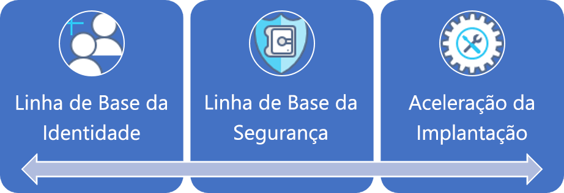
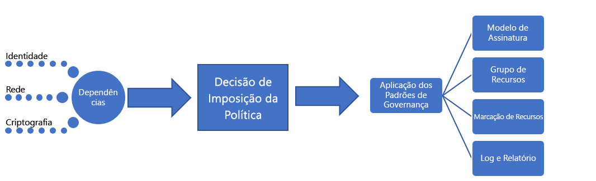

# Empresas de grande porte: Melhor prática explicadaLarge enterprise: Best practice explained

A jornada de governança começa com um conjunto de [políticas corporativas](./initial-corporate-policy.md) iniciais.The governance journey starts with a set of initial [corporate policies](./initial-corporate-policy.md). Essas políticas são usadas para estabelecer um produto viável mínimo (MVP) para governança que reflita as [práticas recomendadas](./overview.md).These policies are used to establish a minimum viable product (MVP) for governance that reflects [best practices](./overview.md).

Neste artigo, discutiremos as estratégias de alto nível que são necessárias para a criação de um MVP de governança.In this article, we discuss the high-level strategies that are required to create a governance MVP. O ponto central do MVP de governança é a disciplina [Aceleração da Implantação](../../deployment-acceleration/overview.md).The core of the governance MVP is the [Deployment Acceleration](../../deployment-acceleration/overview.md) discipline. As ferramentas e os padrões aplicados neste estágio permitirão as evoluções incrementais necessárias para expandir a governança no futuro.The tools and patterns applied at this stage will enable the incremental evolutions needed to expand governance in the future.

## MVP de governança (fundamentos para adoção da nuvem)Governance MVP (Cloud Adoption Foundation)

A adoção rápida da governança e a política corporativa é uma realidade graças a alguns princípios simples e ferramentas de governança baseadas em nuvem.Rapid adoption of governance and corporate policy is achievable, thanks to a few simple principles and cloud-based governance tooling. Essas são as primeiras das três Disciplinas de governança a serem abordadas em qualquer processo de governança.These are the first of the three governance disciplines to approach in any governance process. Nos aprofundaremos em cada uma delas neste artigo.Each will be expanded upon in this article.

Para estabelecer o ponto de partida, este artigo discutirá as estratégias de alto nível por trás da Linha de Base de Identidade, Linha de Base de Segurança e Aceleração de Implantação que são necessárias para criar um MVP de governança e que servirão como a base para a adoção como um todo.To establish the starting point, this article will discuss the high-level strategies behind Identity Baseline, Security Baseline, and Deployment Acceleration that are required to create a governance MVP, which will serve as the foundation for all adoption.

## Processo de implementaçãoImplementation process

A implementação do MVP de governança possui dependências de Identidade, Segurança e Rede.The implementation of the governance MVP has dependencies on Identity, Security, and Networking. Depois de resolver as dependências, a equipe de Governança de Nuvem decidirá sobre alguns aspectos de governança.Once the dependencies are resolved, the Cloud Governance team will decide a few aspects of governance. As decisões da equipe de Governança de Nuvem e das equipes de suporte serão implementadas por meio de um único pacote de ativos de imposição.The decisions from the Cloud Governance team and from supporting teams will be implemented through a single package of enforcement assets.

Essa implementação também pode ser descrita usando uma lista de verificação simples:This implementation can also be described using a simple checklist:

1. Solicite decisões relacionadas às dependências básicas: Identidade, Rede e Criptografia.Solicit decisions regarding core dependencies: Identity, Network, and Encryption.
2. Determine o padrão a ser usado durante a imposição da política corporativa.Determine the pattern to be used during corporate policy enforcement.
3. Determine os padrões de governança apropriados para as disciplinas Consistência de Recursos, Marcação de Recursos e Registro em Log e Relatórios.Determine the appropriate governance patterns for the Resource Consistency, Resource Tagging, and Loging and Reporting disciplines.
4. Implemente as ferramentas de governança alinhadas ao padrão de imposição de política escolhido para aplicar as decisões dependentes e as decisões de governança.Implement the governance tools aligned to the chosen policy enforcement pattern to apply the dependent decisions and governance decisions.

[!INCLUDE [implementation-process](../../../../../includes/cloud-adoption/governance/implementation-process.md)]

## Aplicação de padrões definidos por governançaApplication of governance-defined patterns

A equipe de Governança de Nuvem será responsável pelas seguintes decisões e implementações.The Cloud Governance team will be responsible for the following decisions and implementations. Muitas equipes precisarão de informações de outras equipes, mas a equipe de Governança de Nuvem provavelmente será a responsável pela decisão e pela implementação.Many will require inputs from other teams, but the Cloud Governance team is likely to own both the decision and implementation. As seções a seguir descrevem as decisões tomadas para esse caso de uso e os detalhes de cada decisão.The following sections outline the decisions made for this use case and details of each decision.

### Modelo de assinaturaSubscription Model

O padrão **Misto** foi escolhido para assinaturas do Azure.The **Mixed** pattern has been chosen for Azure subscriptions.

- Conforme surgem novas solicitações para recursos do Azure, um "Departamento" deve ser estabelecido para cada unidade de negócios importantes em cada geografia operacional.As new requests for Azure resources arise, a "Department" should be established for each major business unit in each operating geography. Dentro de cada um dos Departamentos, "Assinaturas" devem ser criadas para cada arquétipo do aplicativo.Within each of the Departments, "Subscriptions" should be created for each application archetype.
- Um arquétipo de aplicativo é uma maneira de agrupar aplicativos com necessidades semelhantes.An application archetype is a means of grouping applications with similar needs. Exemplos comuns incluem: Aplicativos com dados protegidos, aplicativos regulamentados (como HIPAA ou FedRAMP), aplicativos de baixo risco, aplicativos com dependências locais, SAP ou outros mainframes no Azure ou aplicativos que estendem o SAP ou mainframes locais.Common examples include: Applications with protected data, governed applications (such as HIPAA or FedRAMP), low-risk applications, applications with on-premises dependencies, SAP or other mainframes in Azure, or applications that extend on-premises SAP or mainframes. Cada organização tem necessidades únicas baseadas nas classificações de dados e nos tipos de aplicativos que são compatíveis com os negócios.Each organization has unique needs based on data classifications and the types of applications that support the business. O mapeamento de dependência do estado digital pode ajudar a definir arquétipos de aplicativo em uma organização.Dependency mapping of the digital estate can help define the application archetypes in an organization.
- Uma convenção de nomenclatura comum deve ser aceita como parte do design da assinatura com base nos dois marcadores anteriores.A common naming convention should be agreed upon as part of the subscription design, based on the above two bullets.

### Consistência de recursosResource Consistency

A **Consistência de hierárquica** foi escolhida como um padrão de Consistência de Recursos.**Hierarchical Consistency** has been chosen as a Resource Consistency pattern.

- Grupos de recursos devem ser criados para cada aplicativo.Resource groups should be created for each application. Grupos de gerenciamento são criados para cada arquétipo de aplicativo.Management groups should be created for each application archetype. O Azure Policy deve ser aplicado a todas as assinaturas no grupo de gerenciamento associado.Azure Policy should be applied to all subscriptions in the associated management group.
- Como parte do processo de implantação, os modelos de Consistência de recursos para todos os ativos devem ser armazenados o controle de origem.As part of the deployment process, Resource Consistency templates for all assets should be stored in source control.
- Cada grupo de recursos deve associar a um aplicativo ou carga de trabalho específica.Each resource group should align to a specific workload or application.
- A hierarquia do grupo de gerenciamento do Azure definida deve representar a responsabilidade de cobrança e a propriedade de aplicativo usando grupos aninhados.The Azure management group hierarchy defined should represent billing responsibility and application ownership using nested groups.
- Uma ampla implementação do Azure Policy pode exceder os compromissos de tempo da equipe e pode não fornecer muito valor neste momento.Extensive implementation of Azure Policy could exceed the team’s time commitments and may not provide much value at this point. No entanto, uma política padrão simples deve ser criada e aplicada a cada grupo de para impor as primeiras poucas declarações de política de governança de nuvem.However, a simple default policy should be created and applied to each resource group to enforce the first few cloud governance policy statements. Isso serve para definir a implementação de requisitos de governança específicos.This serves to define the implementation of specific governance requirements. Essas implementações poderão então ser aplicadas em todos os ativos implantados.Those implementations can then be applied across all deployed assets.

### Marcação de recursosResource Tagging

O padrão de **Contabilidade** foi escolhido para marcação de recursos.The **Accounting** pattern has been chosen for resource tagging.

- Os ativos implantados devem ser marcados com valores para: Unidade de cobrança/departamento, geografia, classificação de dados, nível de importância, SLA, ambiente, arquétipo do aplicativo, aplicativo e proprietário do aplicativo.Deployed assets should be tagged with values for the following: Department/Billing Unit, Geography, Data Classification, Criticality, SLA, Environment, Application Archetype, Application, and Application Owner.
- Esses valores junto com o grupo de gerenciamento do Azure e a assinatura associada a um ativo implantado impulsionarão as decisões de governança, operações e segurança.These values along with the Azure management group and subscription associated with a deployed asset will drive governance, operations, and security decisions.

### Registro em log e relatóriosLogging and reporting

Neste ponto, um padrão **Híbrido** para o registro em log e relatório é sugerido, mas não é exigido de nenhuma equipe de desenvolvimento.At this point, a **Hybrid** pattern for log and reporting is suggested but not required of any development team.

- Nenhum requisito de governança está definido atualmente em relação aos dados a serem coletados para fins de registro em log ou relatório.No governance requirements are currently set regarding the specific data points to be collected for logging or reporting purposes. Isso é específico para esse narrativa fictícia e deve ser considerado um antipadrão.This is specific to this fictional narrative and should be considered an antipattern. Padrões de registro em log devem ser determinados e impostos assim que possível.Logging standards should be determined and enforced as soon as possible.
- Uma análise adicional será necessária antes da liberação de dados protegidos ou cargas de trabalho críticas.Additional analysis is required before the release of any protected data or mission-critical workloads.
- Antes de dar suporte a cargas de trabalho de missão crítica ou dados protegidos, a solução de monitoramento operacional local deve conceder acesso ao espaço de trabalho usado para registro em log.Prior to supporting protected data or mission-critical workloads, the existing on-premises operational monitoring solution must be granted access to the workspace used for logging. Aplicativos são necessários para atender a requisitos de segurança e registro em log com o uso do locatário, se o aplicativo for compatível com um SLA definido.Applications are required to meet security and logging requirements associated with the use of that tenant, if the application is to be supported with a defined SLA.

## Evolução dos processos de governançaEvolution of governance processes

Algumas das instruções de política não podem ou não devem ser controladas por ferramentas automatizadas.Some of the policy statements cannot or should not be controlled by automated tooling. Outras políticas exigirão esforço periódico de segurança de TI e as equipes de linha de base de identidade local.Other policies will require periodic effort from IT Security and on-premises Identity Baseline teams. A equipe de governança de nuvem será necessária para supervisionar os seguintes processos para implementar as últimas oito instruções de política:The Cloud Governance team will need to oversee the following processes to implement the last eight policy statements:

**Alterações de política corporativa**: A equipe de governança de nuvem fará alterações de design MVP para adotar as novas políticas de governança.**Corporate Policy Changes**: The Cloud Governance team will make changes to the governance MVP design to adopt the new policies. O valor de governança de MVP é que ele permite a aplicação automática de novas políticas.The value of the governance MVP is that it will allow for the automatic enforcement of the new policies.

**Aceleração da adoção**: A equipe de Governança de Nuvem tem examinado scripts de implantação em várias equipes.**Adoption Acceleration**: The Cloud Governance team has been reviewing deployment scripts across multiple teams. Ela mantém um conjunto de scripts que atuam como modelos de implantação.They've maintained a set of scripts that serve as deployment templates. Esses modelos são usados pelas equipes de adoção de nuvem e equipes DevOps para definir implantações mais rapidamente.Those templates can be used by the cloud adoption teams and DevOps teams to more quickly define deployments. Cada script contém requisitos para impor políticas de controle e não é necessário esforço adicional dos engenheiros de adoção da nuvem.Each script contains the requirements for enforcing governance policies, and additional effort from cloud adoption engineers is not needed. Como curadores desses scripts, eles implementam mais rapidamente as alterações de política.As the curators of these scripts, they can implement policy changes more quickly. Além disso, são exibidos como aceleradores de adoção.Additionally, they are viewed as accelerators of adoption. Isso garante consistência entre implantações, sem forçar estritamente a aderência.This ensures consistent deployments without strictly enforcing adherence.

**Treinamento de engenharia**: A equipe de Governança de Nuvem oferece sessões de treinamento bimestrais além de ter criado dois vídeos para engenheiros.**Engineer Training**: The Cloud Governance team offers bi-monthly training sessions and has created two videos for engineers. Ambos os recursos ajudam os engenheiros a acelerar rapidamente sobre a cultura de governança e as implantações executadas.Both resources help engineers get up to speed quickly on the governance culture and how deployments are performed. A equipe está adicionando ativos de treinamento que mostram a diferença entre implantações em produção e de não produção, o que ajuda os engenheiros a entender como as novas políticas afetam a adoção.The team is adding training assets to demonstrate the difference between production and non-production deployments, which helps engineers understand how the new policies affect adoption. Isso garante consistência entre implantações, sem forçar estritamente a aderência.This ensures consistent deployments without strictly enforcing adherence.

**Planejamento de implantação**: Antes de implantar qualquer ativo que contenha dados protegidos, a equipe de Governança de Nuvem será responsável por revisar os scripts de implantação para validar o alinhamento da governança.**Deployment Planning**: Prior to deployment of any asset containing protected data, the Cloud Governance team will be responsible for reviewing deployment scripts to validate governance alignment. Equipes existentes com implantações aprovadas anteriormente serão auditadas usando ferramentas programáticas.Existing teams with previously approved deployments will be audited using programmatic tooling.

**Auditoria mensal e relatórios**: A cada mês, a equipe de Governança de Nuvem executa uma auditoria de todas as implantações na nuvem para validar o alinhamento contínuo à política.**Monthly Audit and Reporting**: Each month, the Cloud Governance team runs an audit of all cloud deployments to validate continued alignment to policy. Quando são encontrados desvios, eles são documentados e compartilhados com as equipes de adoção da nuvem.When deviations are discovered, they are documented and shared with the cloud adoption teams. Quando a imposição não representa um risco de interrupção dos negócios ou de perda de dados, as políticas serão automaticamente aplicadas.When enforcement doesn't risk a business interruption or data leak, the policies are automatically enforced. No final da auditoria, a equipe de Governança de Nuvem compila um relatório para a equipe de Estratégia de Nuvem e para cada equipe de adoção da nuvem para comunicar a adesão, de forma geral, à política.At the end of the audit, the Cloud Governance team compiles a report for the Cloud Strategy team and each cloud adoption team to communicate overall adherence to policy. O relatório também é armazenado para fins de auditoria e legais.The report is also stored for auditing and legal purposes.

**Revisão trimestral da política**: A cada trimestre, a equipe de Governança de Nuvem e a equipe de Estratégia de Nuvem revisará os resultados de auditoria e sugerirá alterações à política corporativa.**Quarterly Policy Review**: Each quarter, the Cloud Governance team and Cloud Strategy team to review audit results and suggest changes to corporate policy. Muitas dessas sugestões são o resultado de melhorias contínuas e da observação dos padrões de uso.Many of those suggestions are the result of continuous improvements and the observation of usage patterns. As alterações de política aprovadas são integradas às ferramentas de governança durante ciclos posteriores de auditoria.Approved policy changes are integrated into governance tooling during subsequent audit cycles.

## Padrões alternativosAlternative patterns

Se qualquer um dos padrões escolhidos nessa jornada de governança não se alinhar aos requisitos do leitor, há alternativas disponíveis para cada padrão:If any of the patterns chosen in this governance journey don't align with the reader's requirements, alternatives to each pattern are available:

- [Padrões de criptografiaEncryption patterns](../../../decision-guides/encryption/overview.md)
- [Padrões de identidadeIdentity patterns](../../../decision-guides/identity/overview.md)
- [Padrões de registro em log e relatóriosLogging and Reporting patterns](../../../decision-guides/log-and-report/overview.md)
- [Padrões de imposição de políticaPolicy Enforcement patterns](../../../decision-guides/policy-enforcement/overview.md)
- [Padrões de consistência de recursosResource Consistency patterns](../../../decision-guides/resource-consistency/overview.md)
- [Padrões de marcação de recursosResource Tagging patterns](../../../decision-guides/resource-tagging/overview.md)
- [Padrões de rede definida por softwareSoftware Defined Network patterns](../../../decision-guides/software-defined-network/overview.md)
- [Padrões de design de assinaturaSubscription Design patterns](../../../decision-guides/subscriptions/overview.md)

## Próximas etapasNext steps

Depois que este guia for implementado, cada equipe de adoção da nuvem poderá continuar com uma base sólida sobre governança.Once this guidance is implemented, each cloud adoption team can proceed with a solid governance foundation. A equipe de Governança de Nuvem trabalhará em paralelo para atualizar continuamente as políticas corporativas e disciplinas de governança.The Cloud Governance team will work in parallel to continually update the corporate policies and governance disciplines.

As duas equipes usarão os indicadores de tolerância para identificar a próxima evolução necessária para continuar a dar suporte à adoção da nuvem.Both teams will use the tolerance indicators to identify the next evolution needed to continue supporting cloud adoption. A próxima etapa para a empresa nessa jornada está evoluindo sua linha de base de governança para dar suporte a aplicativos com requisitos de autenticação de multifator herdados ou de terceiros (MFA).The next step for the company in this journey is to evolve their governance baseline to support applications with legacy or third-party multifactor authentication (MFA) requirements.

> [!div class="nextstepaction"]
> [Evolução da linha de base de identidadeIdentity Baseline evolution](./identity-baseline-evolution.md)
