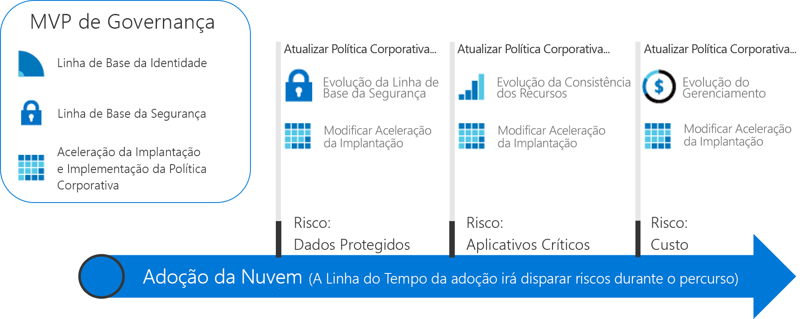

# Percursos de governança acionáveis

Os percursos de governança nesta seção ilustram a abordagem incremental do modelo de governança de CAF. Você pode estabelecer uma plataforma de governança Agile que evoluirá para atender às necessidades de qualquer cenário de governança de nuvem.

## Examine e adote as melhores práticas de governança de nuvem

Para iniciar um caminho de adoção, escolha um dos percursos a seguir. Cada percurso descreve uma série de melhores práticas, com base em um conjunto de experiências fictícias de cliente. Para os leitores novos na abordagem incremental do modelo de governança de CAF, é recomendável examinar a introdução da teoria de governança de alto nível a seguir antes de adotar a melhor prática.

<!-- markdownlint-disable MD033 -->

<ul class="panelContent cardsZ">
<li style="display: flex; flex-direction: column;">
    <a href="./small-to-medium-enterprise/overview.md" style="display: flex; flex-direction: column; flex: 1 0 auto;">
        

            

                

                    

                        <h3>Empresas de pequeno a médio porte</h3>
                        
Um percurso de governança para empresas que possuem menos de cinco datacenters e gerenciam os custos por meio de um modelo de TI central ou de análise.

                    

                

            

        

    </a>
</li>
<li style="display: flex; flex-direction: column;">
    <a href="./large-enterprise/overview.md" style="display: flex; flex-direction: column; flex: 1 0 auto;">
        

            

                

                    

                        <h3>Empresas de grande porte</h3>
                        
Um percurso de governança para empresas que possuem mais de cinco datacenters e gerenciam os custos por meio de várias unidades de negócios.

                    

                

            

        

    </a>
</li>
</ul>

<!-- markdownlint-enable MD033 -->

## Uma abordagem incremental para a governança de nuvem

Adotar a nuvem é um percurso, não um destino. Ao longo do caminho, há marcos claros e benefícios comerciais tangíveis. No entanto, o estado final de adoção da nuvem geralmente é desconhecido quando uma empresa começa o percurso. A governança de nuvem cria as grades de proteção que mantêm a empresa em um caminho seguro durante todo o percurso.

Esses percursos de governança descrevem as experiências de empresas fictícias com base nos percursos de clientes reais. Cada percurso segue o cliente por entre os aspectos de governança da sua adoção da nuvem.

### Estabelecendo um estado final

Um percurso sem um destino é apenas um passeio. É importante estabelecer uma visão aproximada do estado final antes de dar o primeiro passo. O infográfico a seguir fornece um quadro de referência do estado final. Mesmo não sendo o seu ponto de partida, ele mostra seu potencial destino.

O modelo de governança de CAF identifica as principais áreas de importância durante o percurso. Cada área se relaciona com diferentes tipos de riscos que devem ser resolvidos pela a empresa conforme ela adota mais serviços de nuvem. Dentro dessa estrutura, o percurso de governança identifica as ações necessárias para a equipe de governança de nuvem. Ao longo do caminho, cada princípio do modelo de governança de CAF é descrito com mais detalhes. No geral, incluem-se:

**Políticas corporativas**. As políticas corporativas orientam a governança de nuvem. O percurso de governança se concentra nos aspectos específicos da política corporativa:

- Riscos dos negócios: identificar e compreender os riscos corporativos.
- Política e conformidade: converter os riscos em instruções de política que dão suporte a requisitos de conformidade.
- Processos: garantir a conformidade às políticas de estado.

**Cinco disciplinas da governança de nuvem**. Essas disciplinas dão suporte às políticas corporativas. Cada disciplina protege a empresa contra possíveis armadilhas:

- Gerenciamento de Custos
- Linha de base de segurança
- Consistência de recursos
- Linha de base de identidade
- Aceleração de implantação

Essencialmente, as políticas corporativas atuam como um sistema de avisos antecipados para detectar possíveis problemas. As disciplinas ajudam a empresa a reduzir os riscos e a criar as grades de proteção.

### Expanda até o estado final

Como os requisitos de governança evoluirão durante todo o percurso de adoção da nuvem, é necessária uma abordagem diferente para a governança. As empresas não podem mais esperar até que uma equipe pequena crie as grades de proteção e os roteiros de cada rodovia *antes de dar o primeiro passo*. Os resultados de negócios são esperados mais rapidamente e sem problemas. A governança de TI também deve se mover rapidamente e acompanhar o ritmo das demandas de negócios para permanecer relevante durante a adoção da nuvem e evitar a “TI sombra”.

Uma abordagem de **governança incremental** possibilita essas características. A governança incremental se baseia em um pequeno conjunto de políticas, processos e ferramentas corporativas para estabelecer uma fundação para a adoção e a governança. Essa fundação é chamada de **MVP (produto mínimo viável)**. Um MVP permite que a equipe de governança incorpore a governança rapidamente em implementações durante todo o ciclo de vida de adoção. Um MVP pode ser estabelecido a qualquer momento durante o processo de adoção da nuvem. No entanto, trata-se de uma boa prática adotar um MVP o quanto antes.

A capacidade de responder rapidamente aos riscos de mudanças possibilita que a equipe da governança de nuvem se engaje de novas formas. Ela pode ingressar na equipe de estratégia de nuvem como scouts, seguindo em à frente das equipes de adoção da nuvem, traçando rotas e definindo rapidamente as grades de proteção para reduzir os riscos associados aos planos de adoção. Essas camadas de governança just-in-time são conhecidas como **evoluções da governança**. Com essa abordagem, a estratégia de governança evolui um passo à frente das equipes de adoção da nuvem.

O diagrama a seguir mostra um MVP de governança simples e três evoluções da governança. Durante as evoluções, políticas corporativas adicionais são definidas para reduzir novos riscos. Depois, a disciplina de Aceleração de Implantação aplica essas alterações em cada implantação.

> [!NOTE]
> A governança não é uma substituição para funções-chave, como segurança, rede, identidade, finanças, DevOps ou operações. Ao longo do caminho, haverá interações e dependências com membros de cada função. Esses membros devem ser incluídos na equipe de governança de nuvem para acelerar a tomada de decisões e ações.

## Escolha de um percurso de governança

Os percursos demonstram como implementar um MVP de governança. A partir daí, cada percurso mostra como a equipe de governança de nuvem pode trabalhar à frente das equipes de adoção da nuvem como um parceiro para acelerar os esforços de adoção. O modelo de governança de CAF orienta o aplicativo de governança desde a fundação até as evoluções subsequentes.

Para iniciar um percurso de governança, escolha uma das duas opções abaixo. As opções são baseadas em experiências de cliente sintetizadas. Os títulos são baseados no tamanho da empresa para facilitar a navegação. No entanto, a decisão do leitor pode ser mais complexa. As tabelas a seguir descrevem as diferenças entre as duas opções.

> [!NOTE]
> É improvável que algum dos percursos se alinhe completamente à sua situação. Escolha o que estiver mais próximo e use-o como um ponto de partida. Ao longo do percurso, são fornecidas informações adicionais para ajudá-lo a personalizar as decisões e atender a critérios específicos.

### Características de negócios

|                                            | Empresas de pequeno a médio porte                                                                              | Empresas de grande porte                                                                                               |
|--------------------------------------------|---------------------------------------------------------------------------------------------------------|----------------------------------------------------------------------------------------------------------------|
| Geografia (país ou região geopolítica) | Os clientes ou funcionários residem, em grande parte, em uma região                                                      | Os clientes ou funcionários residem em várias regiões                                                              |
| Unidades de negócios afetadas                    | Unidade de negócios única                                                                                    | Várias unidades de negócios                                                                                        |
| Orçamento de TI                                  | Orçamento de TI único                                                                                        | Orçamento alocado nas unidades de negócios                                                                         |
| Investimentos em TI                             | Os investimentos orientados por CapEx (despesa de capital) são planejados anualmente e geralmente abrangem apenas uma manutenção básica. | Os investimentos orientados por CapEx são planejados anualmente e geralmente incluem manutenção e um ciclo de atualização de 3 a 5 anos. |

### O estado atual antes da adoção da governança de nuvem

|                                             | Empresas de pequeno a médio porte                                                                               | Empresas de grande porte                                                                                                          |
|---------------------------------------------|----------------------------------------------------------------------------------------------------------|---------------------------------------------------------------------------------------------------------------------------|
| Datacenter ou provedores de hospedagem terceirizados | Menos de cinco datacenters                                                                                  | Mais de cinco datacenters                                                                                                   |
| Rede                                  | Sem WAN ou 1 &ndash; 2 provedores de WAN                                                                             | Rede complexa ou WAN global                                                                                             |
| Identidade                                    | Floresta única, domínio único. Nenhum requisito para autenticação baseada em declarações ou dispositivos MFA de terceiros. | Várias florestas e vários domínios complexos. Os aplicativos requerem autenticação baseada em declarações ou dispositivos MFA de terceiros. |

### Estado futuro desejado após a evolução da governança de nuvem

|                                              | Empresas de pequeno a médio porte                                                                        | Empresas de grande porte                                                                                        |
|----------------------------------------------|---------------------------------------------------------------------------------------------------|---------------------------------------------------------------------------------------------------------|
| Gerenciamento de Custos – contabilização da nuvem           | Modelo de análise. A cobrança é centralizada entre a TI.                                                | Modelo de estorno. A cobrança pode ser distribuída entre as aquisições da TI.                                  |
| Linha de base de segurança – dados protegidos           | Dados financeiros e IP da empresa. Dados de cliente limitados. Sem requisitos de conformidade de terceiros.     | Várias coleções de dados financeiros e de PII de clientes. Talvez seja preciso considerar a conformidade a terceiros. |
| Consistência de recursos – aplicativos de missão crítica | As interrupções são ruins, mas não financeiramente prejudiciais. As operações de TI existentes são relativamente imaturas. | Interrupções definiram e monitoraram os impactos financeiros. As operações de TI estão estabelecidas e são maduras.         |

Esses dois percursos representam dois extremos de experiência para os clientes que investem na governança de nuvem. A maioria das empresas reflete uma combinação dos dois cenários acima. Depois de examinar o percurso, use o modelo de governança de CAF para iniciar a conversa de governança e modificar os percursos de linha de base para atender melhor às suas necessidades.

## Próximas etapas

Escolha um desses percursos:

> [!div class="nextstepaction"]
> [Percurso de governança de empresas de pequeno a médio porte](./small-to-medium-enterprise/overview.md)
>
> [Percurso de governança de empresas de grande porte](./large-enterprise/overview.md)
