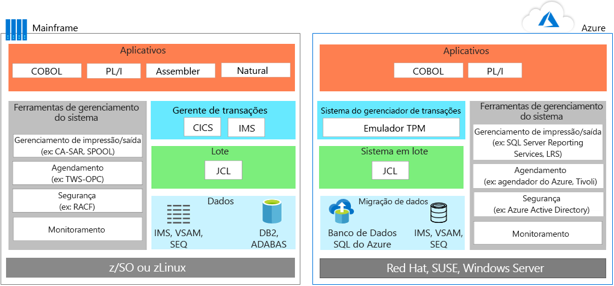
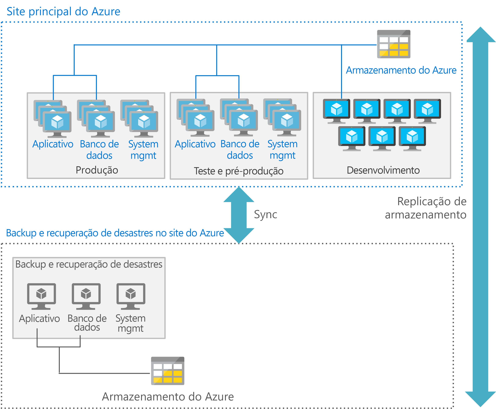

# Migração de aplicativos de mainframeMainframe application migration

Ao migrar aplicativos de ambientes de mainframe no Azure, a maioria das equipes segue uma abordagem pragmática: reutilizar onde e quando possível, e, em seguida, iniciar implantação em fases, em que os aplicativos sejam reconfigurados ou substituídos.When migrating applications from mainframe environments to Azure, most teams follow a pragmatic approach: reuse wherever and whenever possible, and then start a phased deployment where applications are rewritten or replaced.

Migração de aplicativos normalmente envolvem uma ou mais das seguintes estratégias:Application migration typically involves one or more of the following strategies:

- Hospedar novamente: Você pode mover o código existente, programas e aplicativos de mainframe e, em seguida, recompilar o código que será executado em um emulador de mainframe hospedado em uma instância de nuvem.Rehost: You can move existing code, programs, and applications from the mainframe, and then recompile the code to run in a mainframe emulator hosted in a cloud instance. Essa abordagem normalmente inicia com aplicativos de movimento para um emulador baseado em nuvem e, em seguida, migrar o banco de dados para um banco de dados baseado em nuvem.This approach typically starts with moving applications to a cloud-based emulator, and then migrating the database to a cloud-based database. Alguma engenharia e refatoração são necessárias, juntamente com conversões de dados e arquivo.Some engineering and refactoring are required along with data and file conversions.

    Como alternativa, você pode hospedar novamente usando um provedor de hospedagem tradicional.Alternatively, you can rehost using a traditional hosting provider. Um dos principais benefícios da nuvem é terceirizar o gerenciamento da infraestrutura.One of the principal benefits of the cloud is outsourcing infrastructure management. Você pode encontrar um provedor de datacenter que irá hospedar suas cargas de trabalho de mainframe para você.You can find a datacenter provider that will host your mainframe workloads for you. Esse modelo pode comprar o tempo, reduzir o bloqueio de fornecedor e produzir economia de custo provisório.This model may buy time, reduce vendor lock in, and produce interim cost savings.

- Desativar: Todos os aplicativos que não são mais necessários devem ser desativados antes da migração.Retire: All applications that are no longer needed should be retired before migration.

- Recompilar: Algumas organizações optam por reescrever totalmente programas usando técnicas modernas.Rebuild: Some organizations choose to completely rewrite programs using modern techniques. Dado o custo e a complexidade dessa abordagem, não é tão comum quanto uma abordagem lift-and-shift.Given the added cost and complexity of this approach, it’s not as common as a lift-and-shift approach. Muitas vezes após esse tipo de migração, faz sentido começar substituindo módulos e o código usando mecanismos de transformação de código.Often after this type of migration, it makes sense to begin replacing modules and code using code transformation engines.

- Substitua: Essa abordagem substitui a funcionalidade de mainframe com os recursos equivalentes na nuvem.Replace: This approach replaces mainframe functionality with equivalent features in the cloud. Software como serviço (SaaS) é uma opção que está usando uma solução criada especificamente para uma preocupação de empresa, como finanças, recursos humanos, fabricação ou planejamento de recursos empresariais.Software as a service (SaaS) is one option, which is using a solution created specifically for an enterprise concern, such as finance, human resources, manufacturing, or enterprise resource planning. Além disso, muitos aplicativos específicos do setor agora estão disponíveis para resolver problemas que as soluções de mainframe personalizadas costumavam resolver anteriormente.In addition, many industry-specific apps are now available to solve problems that custom mainframe solutions used to previously solve.

Você deve considerar começando pelo planejamento dessas cargas de trabalho que você deseja migrar inicialmente e, em seguida, determinar esses requisitos para a movimentação de aplicativos associados, bases de código herdado e bancos de dados.You should consider starting by planning those workloads that you want to initially migrate, and then determine those requirements for moving associated applications, legacy codebases, and databases.

## Emulação de mainframe no AzureMainframe emulation in Azure

Os serviços de nuvem do Azure podem emular os ambientes de mainframe tradicionais, permitindo a reutilização de código existente do mainframe e aplicativos.Azure cloud services can emulate traditional mainframe environments, enabling you to reuse existing mainframe code and applications. Componentes de servidor comuns que você pode emular incluem transação online (OLTP), lotes e sistemas de ingestão de dados.Common server components that you can emulate include online transaction processing (OLTP), batch, and data ingestion systems.

### Sistemas OLTPOLTP systems

Muitos mainframes têm sistemas OLTP que processam milhares ou milhões de atualizações para grandes números de usuários.Many mainframes have OLTP systems that process thousands or millions of updates for huge numbers of users. Esses aplicativos geralmente usam o processamento de transações e o software de manipulação de formulário de tela, como sistema de controle de informações do cliente (CICS), sistemas de gerenciamento de informações (IMS) e processador de interface de terminal (TIP).These applications often use transaction processing and screen-form handling software, such as customer information control system (CICS), information management systes (IMS), and terminal interface processor (TIP).

Ao mover aplicativos OLTP no Azure, emuladores para monitores (TP) de processamento de transações de mainframe estão disponíveis para serem executado como infraestrutura como serviço (IaaS) usando máquinas virtuais (VMs) no Azure.When moving OLTP applications to Azure, emulators for mainframe transaction processing (TP) monitors are available to run as infrastructure as a service (IaaS) using virtual machines (VMs) on Azure. A funcionalidade de tratamento e a funcionalidade de formulário também podem ser implementados pelo servidores web.The screen handling and form functionality can also be implemented by web servers. Essa abordagem pode ser combinada com as APIs de banco de dados, como o objeto de dados do ActiveX (ADO), conectividade de banco de dados aberto (ODBC) e conectividade de banco de dados Java (JDBC) para acesso a dados e transações.This approach can be combined with database APIs, such as ActiveX data object (ADO), open database connectivity (ODBC), and Java database connectivity (JDBC) for data access and transactions.

### Atualizações em lotes de restrição de tempoTime-constrained batch updates

Muitos sistemas de mainframe executam atualizações mensais ou anuais de milhões de registros de conta, como aqueles usados em serviços bancários, seguros e governamentais.Many mainframe systems perform monthly or annual updates of millions of account records, such as those used in banking, insurance, and government. Mainframes lidam com esses tipos de cargas de trabalho, oferecendo a sistemas de manipulação de dados de alta taxa de transferência.Mainframes handle these types of workloads by offering high-throughput data handling systems. Trabalhos em lotes de mainframes são normalmente seriais por natureza e dependem das operações de entrada/saída por segundo (IOPS) fornecidas pelo backbone do mainframe para desempenho.Mainframes batch jobs are typically serial in nature and depend on the input/output operations per second (IOPS) provided by the mainframe backbone for performance.

Ambientes de lote baseados em nuvem usam a computação paralela e redes de alta velocidade para o desempenho.Cloud-based batch environments use parallel compute and high-speed networks for performance. Se você precisa o desempenho do lote, o Azure fornece várias opções de rede, armazenamento e computação.If you need to optimize batch performance, Azure provides various compute, storage, and networking options.

### Sistemas de ingestão de dadosData ingestion systems

Os mainframes ingerem lotes grandes de dados de varejo, serviços financeiros, fabricação e outras soluções para o processamento.Mainframes ingest large batches of data from retail, financial services, manufacturing, and other solutions for processing. Com o Azure, você pode usar os utilitários de linha de comando simples, como [AzCopy](/azure/storage/common/storage-use-azcopy) para cópia de dados de local de armazenamento.With Azure, you can use simple command-line utilities such as [AzCopy](/azure/storage/common/storage-use-azcopy) for copying data to and from storage location. Você também pode usar o serviço do [Azure Data Factory](/azure/data-factory/introduction), permitindo a ingestão de dados de armazenamentos de dados diferentes para criar e agendar fluxos de trabalho orientados a dados.You can also use the [Azure Data Factory](/azure/data-factory/introduction) service, enabling you to ingest data from disparate data stores to create and schedule data-driven workflows.

Além dos ambientes de emulação, o Azure fornece plataforma como serviço (PaaS) e análise de serviços que podem melhorar os ambientes existentes do mainframe.In addition to emulation environments, Azure provides platform as a service (PaaS) and analytics services that can enhance existing mainframe environments.

## Migre cargas de trabalho OLTP para o AzureMigrate OLTP workloads to Azure

A abordagem de lift-and-shift é a opção sem código para migrar rapidamente aplicativos existentes no Azure.The lift-and-shift approach is the no code option for quickly migrating existing applications to Azure. Cada aplicativo é migrado “no estado em que se encontra”, o que oferece os benefícios da nuvem sem os riscos ou custos de realização de alterações no código.Each application is migrated as is, which provides the benefits of the cloud without the risks or costs of making code changes. Usar um emulador para monitores de processamento de transação de mainframe (TP) no Azur com suporte a essa abordagem.Using an emulator for mainframe transaction processing (TP) monitors on Azure supports this approach.

Os monitores TP estão disponíveis de vários fornecedores e executados em máquinas virtuais, uma infraestrutura como uma opção de serviço (IaaS) no Azure.TP monitors are available from various vendors and run on virtual machines, an infrastructure as a service (IaaS) option on Azure. Os diagramas a seguir de antes e depois mostram uma migração de um aplicativo online apoiado por IBM DB2, um sistema de gerenciamento de banco de dados relacionais (DBMS) em um mainframe IBM z/OS.The following before and after diagrams show a migration of an online application backed by IBM DB2, a relational database management system (DBMS), on an IBM z/OS mainframe. DB2 para z/OS usa arquivos de método de acesso de armazenamento (VSAM) para armazenar os dados e Método de Acesso Sequencial Indexado (ISAM) para arquivos simples.DB2 for z/OS uses virtual storage access method (VSAM) files to store the data and Indexed Sequential Access Method (ISAM) for flat files. Essa arquitetura também usa CICS para monitoramento de transação.This architecture also uses CICS for transaction monitoring.

No Azure, ambientes de emulação são usados para executar o Gerenciador de TP e os trabalhos em lotes que usam JCL.On Azure, emulation environments are used to run the TP manager and the batch jobs that use JCL. Na camada de dados, o DB2 é substituído pelo [Banco de Dados SQL do Azure](/azure/sql-database/sql-database-technical-overview), embora o banco de dados Oracle, DB2 LUW ou Microsoft SQL Server também possa ser usado.In the data tier, DB2 is replaced by [Azure SQL Database](/azure/sql-database/sql-database-technical-overview), although Microsoft SQL Server, DB2 LUW, or Oracle Database can also be used. Um emulador dá suporte a IMS, VSAM e SEQ.An emulator supports IMS, VSAM, and SEQ. Ferramentas de gerenciamento do sistema de mainframe são substituídas por serviços do Azure e o software de outros fornecedores, que são executados em máquinas virtuais.The mainframe’s system management tools are replaced by Azure services, and software from other vendors, that run in VMs.

O manuseio de tela e a funcionalidade de entrada de formulário são comumente implementados usando servidores da web, que podem ser combinados com APIs de banco de dados, como ADO, ODBC e JDBC para acesso a dados e transações.The screen handling and form entry functionality is commonly implemented using web servers, which can be combined with database APIs, such as ADO, ODBC, and JDBC for data access and transactions. A linha exata de componentes de IaaS do Azure para usar depende do sistema operacional que você preferir.The exact line-up of Azure IaaS components to use depends on the operating system you prefer. Por exemplo: For example:

- VMs com base no Windows: Internet Information Server (IIS), juntamente com o ASP.NET para o tratamento de tela e lógica de negócios.Windows–based VMs: Internet Information Server (IIS) along with ASP.NET for the screen handling and business logic. Use o ADO.NET para acesso a dados e transações.Use ADO.NET for data access and transactions.

- VMs com base no Linux: Os servidores de aplicativos baseados em Java que estão disponíveis, como o Apache Tomcat para tratamento de tela e a funcionalidade de negócios baseado em Java.Linux–based VMs: The Java-based application servers that are available, such as Apache Tomcat for screen handling and Java-based business functionality. Use o JDBC para transações e acesso a dados.Use JDBC for data access and transactions.

## Migre cargas de trabalho de lote para o AzureMigrate batch workloads to Azure

Operações em lote no Azure são diferentes do ambiente de lote típico em mainframes.Batch operations in Azure differ from the typical batch environment on mainframes. Trabalhos em lotes de mainframes são normalmente seriais por natureza e dependem dos IOPS fornecidos pelo backbone de mainframe por desempenho.Mainframe batch jobs are typically serial in nature and depend on the IOPS provided by the mainframe backbone for performance. Ambientes de lote baseados em nuvem usam a computação paralela e redes de alta velocidade para o desempenho.Cloud-based batch environments use parallel computing and high-speed networks for performance.

Para otimizar o desempenho do lote usando o Azure, considere as opções de [computar](/azure/virtual-machines/windows/overview), [armazenar](/azure/storage/blobs/storage-blobs-introduction), [rede](https://azure.microsoft.com/blog/maximize-your-vm-s-performance-with-accelerated-networking-now-generally-available-for-both-windows-and-linux/), e [monitoramento](/azure/azure-monitor/overview) da seguinte maneira.To optimize batch performance using Azure, consider the [compute](/azure/virtual-machines/windows/overview), [storage](/azure/storage/blobs/storage-blobs-introduction), [networking](https://azure.microsoft.com/blog/maximize-your-vm-s-performance-with-accelerated-networking-now-generally-available-for-both-windows-and-linux/), and [monitoring](/azure/azure-monitor/overview) options as follows.

### ComputaçãoCompute

Use:Use:

- VMs com a velocidade de relógio mais alta.VMs with the highest clock speed. Aplicativos de mainframe são geralmente de thread único e CPUs de mainframe têm um relógio de velocidade muito alta.Mainframe applications are often single-threaded and mainframe CPUs have a very high clock speed.

- VMs com capacidade de memória grande para permitir o armazenamento em cache de dados e áreas de trabalho do aplicativo.VMs with large memory capacity to allow caching of data and application work areas.

- VMs com vCPUs de densidade mais alta para tirar proveito de processamento com multithread, se o aplicativo dá suporte a vários threads.VMs with higher density vCPUs to take advantage of multi-threaded processing if the application supports multiple threads.

- Processamento paralelo, como Azure facilmente pode ser dimensionado para processamento paralelo, oferecendo mais poder de computação para um execução de lote.Parallel processing, as Azure easily scales out for parallel processing, delivering more compute power for a batch run.

### ArmazenamentoStorage

Use:Use:

- [Azure SSD Premium](/azure/virtual-machines/windows/premium-storage) ou [SSD Ultra do Azure](/azure/virtual-machines/windows/disks-ultra-ssd) para máximo de IOPS disponível.[Azure Premium SSD](/azure/virtual-machines/windows/premium-storage) or [Azure Ultra SSD](/azure/virtual-machines/windows/disks-ultra-ssd) for maximum available IOPS.

- Particionamento com vários discos para mais IOPS por tamanho de armazenamento.Striping with multiple disks for more IOPS per storage size.

- O particionamento para armazenamento para distribuir E/S sobre vários dispositivos de armazenamento de Azure.Partitioning for storage to spread IO over multiple Azure storage devices.

### RedeNetworking

- Use [Rede Acelerada do Azure](/azure/virtual-network/create-vm-accelerated-networking-powershell) para minimizar a latência.Use [Azure Accelerated Networking](/azure/virtual-network/create-vm-accelerated-networking-powershell) to minimize latency.

### MonitoramentoMonitoring

- Use ferramentas de monitoramento, [Azure Monitor](/azure/azure-monitor/overview), [Azure Application Insights](/azure/application-insights/app-insights-overview) e até mesmo os logs do Azure permitem que os administradores monitorem qualquer sobre o desempenho das execuções de lote e ajudar a eliminar gargalos.Use monitoring tools, [Azure Monitor](/azure/azure-monitor/overview), [Azure Application Insights](/azure/application-insights/app-insights-overview), and even the Azure logs enable administrators to monitor any over performance of batch runs and help eliminate bottlenecks.

## Migrar os ambientes de desenvolvimentoMigrate development environments

Arquitetura distribuída da nuvem se baseiam em um conjunto diferente de ferramentas de desenvolvimento que fornecem a vantagem de práticas modernas e linguagens de programação.The cloud’s distributed architectures rely on a different set of development tools that provide the advantage of modern practices and programming languages. Para facilitar essa transição, você pode usar um ambiente de desenvolvimento com outras ferramentas que são projetadas para emular os ambientes do IBM z/OS.To ease this transition, you can use a development environment with other tools that are designed to emulate IBM z/OS environments. A lista a seguir mostra as opções da Microsoft e outros fornecedores:The following list shows options from Microsoft and other vendors:

| ComponenteComponent        | Opções do AzureAzure Options                                                                                                                                  |
|------------------|---------------------------------------------------------------------------------------------------------------------------------------------------|
| z/OSz/OS             | Windows, Linux ou UNIXWindows, Linux, or UNIX                                                                                                                      |
| CICSCICS             | Serviços do Azure oferecidos pelo Micro Focus, Oracle, Software GT (Fujitsu), TmaxSoft, Raincode e dados NTT ou reescrever usando o KubernetesAzure services offered by Micro Focus, Oracle, GT Software (Fujitsu), TmaxSoft, Raincode, and NTT Data, or rewrite using Kubernetes |
| IMSIMS              | Serviços do Azure oferecidos pela Micro Focus e OracleAzure services offered by Micro Focus and Oracle                                                                                  |
| AssemblerAssembler        | Serviços do Azure de Raincode e TmaxSoft; ou COBOL, C ou Java, ou são mapeados para funções do sistema operacionalAzure services from Raincode and TmaxSoft; or COBOL, C, or Java, or map to operating system functions               |
| JCLJCL              | JCL, PowerShell ou outras ferramentas de scriptJCL, PowerShell, or other scripting tools                                                                                                   |
| COBOLCOBOL            | COBOL, C ou JavaCOBOL, C, or Java                                                                                                                            |
| NaturalNatural          | Natural, COBOL, C ou JavaNatural, COBOL, C, or Java                                                                                                                  |
| FORTRAN e PL/IFORTRAN and PL/I | FORTRAN, PL/I, COBOL, C ou JavaFORTRAN, PL/I, COBOL, C, or Java                                                                                                           |
| REXX e PL/IREXX and PL/I    | REXX, PowerShell ou outras ferramentas de scriptREXX, PowerShell, or other scripting tools                                                                                                  |

## Migre bancos de dados e dadosMigrate databases and data

A migração de aplicativo geralmente envolve a nova hospedagem da camada de dados.Application migration usually involves rehosting the data tier. Você pode migrar o SQL Server, o código-fonte aberto e outros bancos de dados relacionais para soluções totalmente gerenciadas no Azure, tais como [Instância Gerenciada do Banco de Dados SQL do Azure](/azure/sql-database/sql-database-managed-instance), [Serviço de Banco de Dados do Azure para PostgreSQL](/azure/postgresql/overview), e [Banco de Dados do Azure para MySQL](/azure/mysql/overview) com [Serviço de Migração de Banco de Dados do Azure](/azure/dms/dms-overview).You can migrate SQL Server, open-source, and other relational databases to fully-managed solutions on Azure, such as [Azure SQL Database Managed Instance](/azure/sql-database/sql-database-managed-instance), [Azure Database Service for PostgreSQL](/azure/postgresql/overview), and [Azure Database for MySQL](/azure/mysql/overview) with [Azure Database Migration Service](/azure/dms/dms-overview).

Por exemplo, você pode migrar se a camada de dados de mainframe usa:For example, you can migrate if the mainframe data tier uses:

- IBM DB2 ou um banco de dados IMS, usar o banco de dados SQL do Azure, SQL Server, DB2 LUW ou banco de dados Oracle Database no Azure.IBM DB2 or an IMS database, use Azure SQL database, SQL Server, DB2 LUW, or Oracle Database on Azure.

- VSAM e outros arquivos simples, use arquivos simples do Método Indexado de Acesso Sequencial (ISAM) para o SQL do Azure, SQL Server, DB2 LUW ou Oracle.VSAM and other flat files, use Indexed Sequential Access Method (ISAM) flat files for Azure SQL, SQL Server, DB2 LUW, or Oracle.

- Grupos de Data de Geração (GDGs), migrar para os arquivos no Azure que usam uma convenção de nomenclatura e extensões de nome de arquivo que fornecem funcionalidade semelhante ao GDGs.Generation Date Groups (GDGs), migrate to files on Azure that use a naming convention and filename extensions that provide similar functionality to GDGs.

A camada de dados do IBM inclui vários componentes principais que também devem migrar.The IBM data tier includes several key components that you must also migrate. Por exemplo, ao migrar um banco de dados, você também migrar uma coleção de dados contidos em pools, cada um contendo dbextents, que são conjuntos de dados z/OS VSAM.For example, when you migrate a database, you also migrate a collection of data contained in pools, each containing dbextents, which are z/OS VSAM data sets. A migração deve incluir o diretório que identifica os locais de dados nos pools de armazenamento.Your migration must include the directory that identifies data locations in the storage pools. Além disso, o plano de migração deve considerar o log de banco de dados, que contém um registro das operações executadas no banco de dados.Also, your migration plan must consider the database log, which contains a record of operations performed on the database. Um banco de dados pode ter um, dois (duplo ou alternativo) ou quatro logs (duplo ou alternativo).A database can have one, two (dual or alternate), or four (dual and alternate) logs.

A migração de banco de dados também inclui os seguintes componentes:Database migration also includes these components:

- Gerenciador de banco de dados: Fornece acesso aos dados no banco de dados.Database manager: Provides access to data in the database. O gerenciador de banco de dados é executado em sua própria partição em um ambiente de z/OS.The database manager runs in its own partition in a z/OS environment.

- Solicitante de aplicativo: Aceita solicitações de aplicativos antes de passá-los para um servidor de aplicativos.Application requester: Accepts requests from applications before passing them to an application server.

- Adaptador de recursos online: Inclui componentes do solicitante de aplicativo para uso em transações do CICS.Online resource adapter: Includes application requester components for use in CICS transactions.

- Adaptador de recursos em lote: Componentes do solicitante de aplicativo implementa para aplicativos de longe z/OS.Batch resource adapter: Implements application requester components for z/OS batch applications.

- SQL Interativo (ISQL): É executado como um aplicativo CICS e uma interface, permitindo que os usuários insiram instruções SQL ou comandos de operador.Interactive SQL (ISQL): Runs as a CICS application and interface enabling users to enter SQL statements or operator commands.

- Aplicativo CICS: É executado sob o controle do CICS, usando fontes de dados e recursos disponíveis no CICS.CICS application: Runs under the control of CICS, using available resources and data sources in CICS.

- Aplicativo do lote: Executa lógica de processo sem comunicação interativa com usuários para, por exemplo, produzir atualizações de dados em massa ou gerar relatórios a partir de um banco de dados.Batch application: Runs process logic without interactive communication with users to, for example, produce bulk data updates or generate reports from a database.

## Otimizar a taxa de transferência e escala para o AzureOptimize scale and throughput for Azure

Em termos gerais, mainframes escalam verticalmente, enquanto a nuvem pode ser dimensionada. Para otimizar a escala e a taxa de transferência de aplicativos de estilo mainframe em execução no Azure, é importante que você compreenda como mainframes podem separar e isolar aplicativos.Generally speaking, mainframes scale up, while the cloud scales out. To optimize scale and throughput of mainframe-style applications running on Azure, it is important that you understand at how mainframes can separate and isolate applications. Um mainframe z/OS usa um recurso chamado Partições Lógicas (LPARS) para isolar e gerenciar os recursos para um aplicativo específico em uma única instância.A z/OS mainframe uses a feature called Logical Partitions (LPARS) to isolate and manage the resources for a specific application on a single instance.

Por exemplo, um mainframe pode usar uma partição lógica (LPAR) para uma região do CICS com programas associados de COBOL e um LPAR separado para DB2.For example, a mainframe might use one logical partition (LPAR) for a CICS region with associated COBOL programs, and a separate LPAR for DB2. LPARs adicionais geralmente são usados para o desenvolvimento, teste e ambientes de preparo.Additional LPARs are often used for the development, testing, and staging environments.

No Azure, é mais comum usar VMs separadas para servirem para essa finalidade.On Azure, it’s more common to use separate VMs to serve this purpose. Normalmente, as arquiteturas do Azure implantam VMs para a camada de aplicativo, um conjunto separado de VMs para a camada de dados, outro conjunto para o desenvolvimento e assim por diante.Azure architectures typically deploy VMs for the application tier, a separate set of VMs for the data tier, another set for development, and so on. Cada camada de processamento pode ser otimizada usando o tipo mais adequado de máquinas virtuais e recursos para esse ambiente.Each tier of processing can be optimized using the most suitable type of VMs and  features for that environment.

Além disso, cada camada também pode fornecer serviços de recuperação de desastres apropriados.In addition, each tier can also provide appropriate disaster recovery services. Por exemplo, VMs do banco de dados e produção podem requerer uma recuperação ativa ou passiva, enquanto as VMs de desenvolvimento e teste dão suporte a uma recuperação fria.For example, production and database VMs might require a hot or warm recovery, while the development and testing VMs support a cold recovery.

A figura a seguir mostra uma possível implantação do Azure usando um site principal e um secundário.The following figure shows a possible Azure deployment using a primary and a secondary site. No site primário, as VMs de produção, pré-produção e teste são implantadas com alta disponibilidade.In the primary site, the production, preproduction, and testing VMs are deployed with high availability. O site secundário é feito para backup e recuperação de desastres.The secondary site is for backup and disaster recovery.

## Executar um mainframe preparado para o AzurePerform a staged mainframe to Azure

Migrar soluções de um mainframe para o Azure pode envolver uma migração *preparada*, na qual alguns aplicativos são movidos pela primeira vez e outros permanecem no mainframe temporariamente ou permanentemente.Moving solutions from a mainframe to Azure may involve a *staged* migration, whereby some applications are moved first, and others remain on the mainframe temporarily or permanently. Normalmente, essa abordagem requer sistemas que permitem que aplicativos e bancos de dados para fins de interoperabilidade entre o mainframe e o Azure.This approach typically requires systems that allow applications and databases to interoperate between the mainframe and Azure.

Um cenário comum é mover um aplicativo no Azure enquanto mantém os dados usados pelo aplicativo no mainframe.A common scenario is to move an application to Azure while keeping the data used by the application on the mainframe. Software específico é usado para permitir que os aplicativos no Azure acessem dados de mainframe.Specific software is used to enable the applications on Azure to access data from the mainframe. Felizmente, uma ampla gama de soluções fornece integração entre o Azure e os ambientes existentes de mainframe, suporte para cenários híbridos e migração ao longo do tempo.Fortunately, a wide range of solutions provide integration between Azure and existing mainframe environments, support for hybrid scenarios, and migration over time. Parceiros da Microsoft, fornecedores independentes de software e integradores de sistema podem ajudá-lo em seu percurso.Microsoft partners, independent software vendors, and system integrators can help you on your journey.

Uma opção é o [Microsoft Host Integration Server](/host-integration-server) (HIS), uma solução que fornece a arquitetura distribuída de banco de dados relacional (DRDA) necessária para aplicativos no Azure para acessar dados no DB2 que permanece no mainframe.One option is [Microsoft Host Integration Server](/host-integration-server) (HIS), a solution that provides the distributed relational database architecture (DRDA) required for applications in Azure to access data in DB2 that remains on the mainframe. Outras opções para integração com o mainframe no Azure incluem soluções da IBM, Attunity, Codit, outros fornecedores e opções de software livre.Other options for mainframe-to-Azure integration include solutions from IBM, Attunity, Codit, other vendors, and open source options.

## Soluções de parceirosPartner solutions

Se você estiver considerando uma migração de mainframe, o ecossistema de parceiros está disponível para ajudá-lo.If you are considering a mainframe migration, the partner ecosystem is available to assist you.

O Azure fornece uma infraestrutura comprovada, altamente disponível e escalonável para sistemas que atualmente executam em mainframes.Azure provides a proven, highly available, and scalable infrastructure for systems that currently run on mainframes. Algumas cargas de trabalho podem ser migradas com relativa facilidade.Some workloads can be migrated with relative ease. Outras cargas de trabalho que dependem do software de sistema herdado, como o CICS e IMS, podem ser hospedadas novamente usando soluções de parceiros e migrados para o Azure ao longo do tempo.Other workloads that depend on legacy system software, such as CICS and IMS, can be rehosted using partner solutions and migrated to Azure over time. Independentemente da opção escolhida, a Microsoft e nossos parceiros estão disponíveis para ajudá-lo a otimizar o Azure enquanto mantém a funcionalidade de software do sistema de mainframe.Regardless of the choice you make, Microsoft and our partners are available to assist you in optimizing for Azure while maintaining mainframe system software functionality.

Para obter orientações detalhadas sobre como escolher uma solução de parceiro, consulte a [Aliança de Modernização de Plataforma](https://www.platformmodernization.org/pages/mainframe.aspx).For detailed guidance about choosing a partner solution, refer to the [Platform Modernization Alliance](https://www.platformmodernization.org/pages/mainframe.aspx).

## Saiba maisLearn more

Para saber mais, consulte os recursos a seguir:For more information, see the following resources:

- [Introdução ao AzureGet started with Azure](/azure)

- [Aliança de Modernização de Plataforma: Migração de mainframePlatform Modernization Alliance: Mainframe migration](https://www.platformmodernization.org/pages/mainframe.aspx)

- [Implantar o IBM DB2 pureScale no AzureDeploy IBM DB2 pureScale on Azure](https://azure.microsoft.com/resources/deploy-ibm-db2-purescale-on-azure)

- [Documentação do Host Integration Server (HIS)Host Integration Server (HIS) documentation](/host-integration-server)
