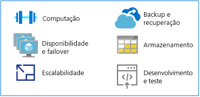

# Fazer a transição dos mainframes para Azure

Como uma plataforma alternativa para a execução de aplicativos de mainframe tradicionais, o Azure oferece computação de hiperescala e armazenamento em um ambiente de alta disponibilidade. Você obtém o valor e a agilidade de uma plataforma moderna, com base em nuvem sem os custos associados a um ambiente de mainframe.

Esta seção fornece orientações técnicas para fazer a mudança de uma plataforma de mainframe no Azure.

## MIPS vs. vCPUs

Não há uma fórmula de mapeamento universal que existe para determinar a quantidade de unidades de processamento centrais virtuais (vCPUs) necessárias para executar as cargas de trabalho do mainframe. No entanto, a métrica de um milhão de instruções por segundo (MIPS) geralmente é mapeada para vCPUs no Azure. MIPS mede a potência de computação geral de um mainframe, fornecendo um valor constante do número de ciclos por segundo para uma determinada máquina.

Uma organização de pequeno porte pode exigir menos de 500 MIPS, enquanto uma grande organização normalmente usa mais de 5.000 MIPS. Em 1.000 dólares por MIPS únicos, uma grande organização gasta aproximadamente 5 milhões de dólares por ano para implantar uma infraestrutura de 5.000 MIPS. A estimativa de custo anual de uma implantação típica do Azure dessa escala é de aproximadamente um décimo do custo de uma infraestrutura de MIPS. Para obter detalhes, consulte a tabela 4 no white paper [Desmistificando o mainframe para a migração do Azure](https://azure.microsoft.com/resources/demystifying-mainframe-to-azure-migration).

Um cálculo preciso de MIPS para vCPUs com o Azure depende do tipo de vCPU e a carga de trabalho exata que você está executando. No entanto, estudos de benchmark fornecem uma boa base para estimar o número e tipo de vCPUs que será necessário. Um recente [parâmetro de comparação do HPE zREF](https://h20195.www2.hpe.com/v2/getpdf.aspx/4aa4-2452enw.pdf) fornece as estimativas a seguir:

- 288 MIPS por baseados em Intel core em execução nos servidores HP Proliant para trabalhos online (CICS).

- 170 MIPS por núcleo da Intel para trabalhos em lotes de COBOL.

Este guia estima MIPS 200 por vCPU para processamento online e MIPS 100 por vCPU para processamento em lotes.

> [!NOTE]
> Essas estimativas estão sujeitas a alterações, conforme a nova série de máquina virtual (VM) fica disponível no Azure.

## Failover e alta disponibilidade

Muitas vezes, sistemas de mainframe oferecem disponibilidade de 9s (99,999 por cento) quando são usados o acoplamento de mainframe e Sysplex paralelo. Ainda assim, operadores de sistema precisam agendar o tempo de inatividade para manutenção e carregamentos de programas iniciais (IPLs). A disponibilidade real se aproxima de dois ou três 9s, no mesmo nível dos servidores avançados baseados em Intel.

Por comparação, o Azure oferece contratos de nível de compromisso de serviço (SLAs), onde várias disponibilidade de 9s é o padrão, otimizado com replicação local ou com base geográfica de serviços.

O Azure fornece disponibilidade adicional ao replicar dados de vários dispositivos de armazenamento, localmente ou em outras regiões geográficas. Caso ocorra uma falha com base no Azure, recursos de computação podem acessar dados replicados no nível do local ou regional.

Quando você usa a plataforma do Azure como um recurso de serviço (PaaS), como [Banco de Dados SQL](/azure/sql-database/sql-database-technical-overview) e [Banco de Dados do Azure Cosmos](/azure/cosmos-db/introduction), o Azure pode tratar automaticamente de failovers. Quando você usa a infraestrutura do Azure como um serviço (IaaS), failover se baseia na funcionalidade específica do sistema, como recursos, instâncias de cluster de failover e grupos de disponibilidade AlwaysOn do SQL Server.

## Escalabilidade

Mainframes normalmente se expandem, enquanto os ambientes de nuvem se expandem. Mainframes podem escalar horizontalmente com o uso de um recurso de acoplamento (FC), mas os altos custos de armazenamento e hardware torna os mainframes muito caros para escalar.

Além disso, o FC oferece computação firmemente acoplada, ao passo que os recursos de escalabilidade horizontal do Azure são flexíveis. A nuvem pode ser ampliada ou reduzida para corresponder às especificações exatas do usuário, com a capacidade de computação, armazenamento e escalabilidade de serviços sob demanda em um modelo de faturamento baseado em uso.

## Backup e recuperação

Os clientes de mainframe normalmente mantêm sites de recuperação de desastres ou fazer uso ou um provedor de mainframe independentes para contingências de desastres. Sincronização com um site de recuperação de desastres geralmente é feita por meio de cópias offline de dados. Ambas as opções incorrem em custos altos.

Redundância geográfica automatizada também está disponível por meio de facilidade acoplamento de mainframe, embora com grande despesa, e geralmente é reservado para sistemas de missão crítica. Em contraste, o Azure tem opções fáceis de implementar e econômicas para [backup](/azure/backup/backup-introduction-to-azure-backup), [recuperação](/azure/site-recovery/site-recovery-overview), e [redundância](/azure/storage/common/storage-redundancy) nos níveis locais ou regionais ou por meio de redundância geográfica.

## Armazenamento

Parte de entendimento sobre como os mainframes funcionam envolve vários termos de sobreposição de decodificação. Por exemplo, armazenamento central, a memória real, o armazenamento real e o armazenamento principal geralmente se refere ao armazenamento anexado diretamente para o processador de mainframe.

Hardware de mainframe inclui processadores e muitos outros dispositivos, como dispositivos de armazenamento de acesso direto (DASDs), unidades de fita magnética e vários tipos de consoles de usuário. Fitas e DASDs são usados para funções do sistema e por programas de usuário.

Tipos de armazenamento físico para mainframes incluem:

- Armazenamento central: Localizado diretamente no processador de mainframe, isso também é conhecido como processador ou armazenamento real.

- Armazenamento auxiliar: Localizados separadamente do mainframe, esse tipo inclui o armazenamento em DASDs e também é conhecido como armazenamento de paginação.

A nuvem oferece uma variedade de opções flexíveis e escalonáveis, e você pagará apenas essas opções que você precisa. O [Armazenamento do Azure](/azure/storage/common/storage-introduction) oferece um armazenamento de objetos altamente escalonável para objetos de dados, um serviço de sistema de arquivos para a nuvem, armazenamento de mensagens confiáveis e armazenamento de NoSQL. Para VMs, discos gerenciados e discos não gerenciados fornecem armazenamento em disco persistente e seguro.

## Desenvolvimento de mainframe e teste

Dos grandes condutores em projetos de migração de mainframe é a evolução do desenvolvimento de aplicativos. As organizações querem que seu ambiente de desenvolvimento seja mais ágil e responsivo às necessidades de negócios.

Mainframes normalmente têm partições lógicas separadas (LPARs) para desenvolvimento e teste, como controle de qualidade e preparo LPARs. Soluções de desenvolvimento de mainframe incluem compiladores (COBOL, PL / eu Assembler) e editores. O mais comum é a Facilidade de Produtividade do Sistema Interativo (ISPF) para o sistema operacional z/OS que executa os mainframes IBM. Outros incluem a Facilidade de Programação (RPF) ROSCOE e ferramentas de Computer Associates, como Biblioteca CA e Ca-Panvalet.

Compiladores e ambientes de emulação estão disponíveis em plataformas x86, portanto, desenvolvimento e teste podem estar normalmente entre as cargas de trabalho primeiro para migrar de um mainframe no Azure. A disponibilidade e o uso difundido das [ferramentas do DevOps no Azure](https://azure.microsoft.com/solutions/devops/) está acelerando a migração de desenvolvimento e ambientes de teste.

Quando as soluções são desenvolvidas e testadas no Azure e estão prontas para implantação ao mainframe, você precisará copiar o código para o mainframe e compilá-lo ali.

## Próximas etapas

> [!div class="nextstepaction"]
> [Migração de aplicativos de mainframe](application-strategies.md)
