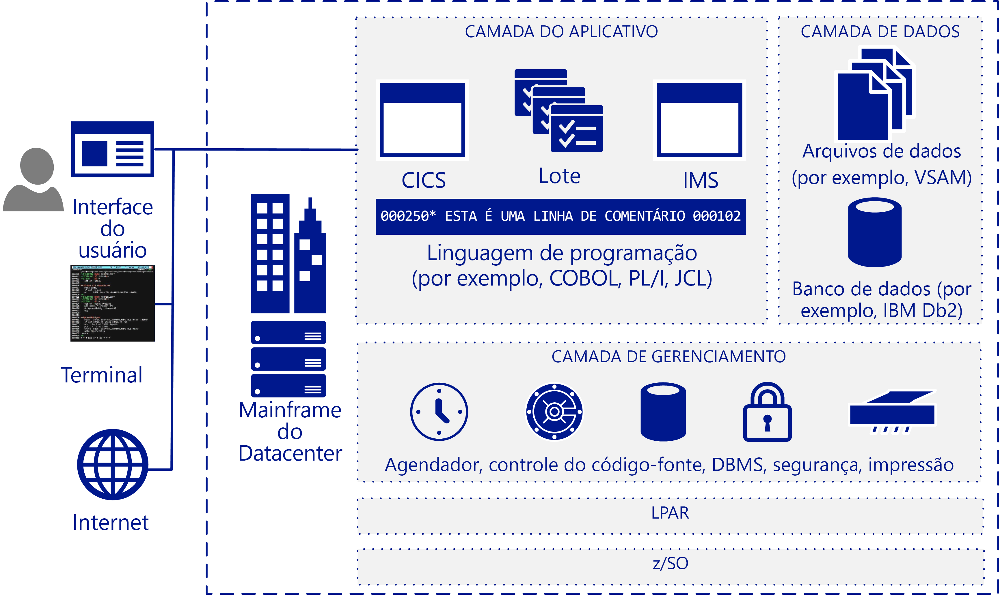

# Visão geral da migração de mainframeMainframe migration overview

Muitas empresas e organizações se beneficiam de mover algumas ou todas as suas cargas de trabalho de mainframe, aplicativos e bancos de dados para a nuvem.Many companies and organizations benefit from moving some or all their mainframe workloads, applications, and databases to the cloud. O Azure fornece recursos semelhantes a mainframe em escala de nuvem sem muitas das desvantagens associadas a mainframes.Azure provides mainframe-like features at cloud scale without many of the drawbacks associated with mainframes.

O termo mainframe geralmente se refere a um sistema de computador grande, mas, atualmente, a grande maioria de mainframes implantados nos servidores IBM System Z ou sistemas compatíveis com plug da IBM executando MVS, DOS, VSE, OS/390 ou z/OS.The term mainframe generally refers to a large computer system, but the vast majority currently of mainframes deployed are IBM System Z servers or IBM plug-compatible systems running MVS, DOS, VSE, OS/390, or z/OS. Os sistemas de mainframe continuam a ser usados em muitos setores para executar os sistemas de informações vitais e têm um lugar em cenários altamente específicos, como ambientes de TI com uso intensivo de transações grandes, de alto volume.Mainframe systems continue to be used in many industries to run vital information systems, and they have a place in highly-specific scenarios, such as large, high-volume, transaction intensive IT environments.

Migrar para a nuvem permite que as empresas modernizem sua infraestrutura.Migrating to the cloud enables companies to modernize their infrastructure. Com os serviços de nuvem você pode disponibilizar aplicativos de mainframe e o valor que eles fornecem, como uma carga de trabalho sempre que sua organização precisar.With cloud services you can make mainframe applications, and the value that they provide, available as a workload whenever your organization needs it. Muitas cargas de trabalho podem ser transferidas para o Azure com apenas pequenas alterações de código, como atualizar os nomes dos bancos de dados.Many workloads can be transferred to Azure with only minor code changes, such as updating the names of databases. Você pode migrar cargas de trabalho mais complexas usando uma abordagem em fases.You can migrate more complex workloads using a phased approach.

A maioria das empresas da Fortune 500 já estão em executando o Azure para suas cargas de trabalho críticas.Most Fortune 500 companies are already running Azure for their critical workloads. Os incentivos de reduções significativos do Azure motivam muitos projetos de migração.Azure's significant bottom-line incentives motivate many migration projects. As empresas normalmente movem o desenvolvimento e testam as cargas de trabalho no Azure primeiro, depois, pelo DevOps, email e recuperação de desastre como um serviço.Companies typically move development and test workloads to Azure first, followed by DevOps, email, and disaster recovery as a service.

## Público-alvoIntended audience

Se você estiver considerando uma migração ou a adição de serviços de nuvem como uma opção para seu ambiente de TI, este guia é para você.If you’re considering a migration or the addition of cloud services as an option for your IT environment, this guide is for you.

Este guia ajuda as organizações de TI a iniciar a conversa de migração.This guidance helps IT organizations start the migration conversation. Você pode estar mais familiarizado com o Azure e infraestruturas de nuvem do que está com mainframes, portanto, este guia começa com uma visão geral de como funcionam os mainframes e continua com várias estratégias para determinar o que e como migrar.You may be more familiar with Azure and cloud-based infrastructures than you are with mainframes, so this guide starts with an overview of how mainframes work, and continues with various strategies for determining what and how to migrate.

## Arquitetura de mainframeMainframe architecture

No final de década de 50, os mainframes foram projetados como servidores de expansão para executar grandes volumes de transações online e processamento em lotes.In the late 1950s, mainframes were designed as scale-up servers to run high-volume online transactions and batch processing. Por isso, mainframes têm software para formulários de transações online (às vezes chamado de telas verdes) e sistemas de e/s de alto desempenho para as execuções em lote de processamento.Because of this, mainframes have software for online transaction forms (sometimes called green screens) and high-performance I/O systems for processing batch runs.

Os mainframes têm uma reputação de alta confiabilidade e disponibilidade e são conhecidos por sua capacidade de executar trabalhos de lote e grandes transações online.Mainframes have a reputation for high reliability and availability, and are known for their ability to run huge online transactions and batch jobs. Uma transação resulta de uma parte do processamento iniciado por uma única solicitação, normalmente de um usuário em um terminal.A transaction results from a piece of processing initiated by a single request, typically from a user at a terminal. As transações também podem vir de várias fontes, incluindo páginas da web, estações de trabalho remotas e aplicativos de outros sistemas de informações.Transactions can also come from multiple other sources, including web pages, remote workstations, and applications from other information systems. Uma transação também pode ser disparada automaticamente em um horário predefinido, como mostra a figura a seguir.A transaction can also be triggered automatically at a predefined time as the following figure shows.

Uma arquitetura típica de mainframe IBM inclui os seguintes componentes comuns:A typical IBM mainframe architecture includes these common components:

- **Sistemas de front-end:** Os usuários podem iniciar transações a partir de terminais, páginas da web ou estações de trabalho remotas.**Front-end systems:** Users can initiate transactions from terminals, web pages, or remote workstations. Aplicativos de mainframe geralmente têm interfaces do usuário personalizada que podem ser preservadas após a migração para o Azure.Mainframe applications often have custom user interfaces that can be preserved after migration to Azure. Emuladores de terminal ainda são usados para acessar os aplicativos de mainframe e também são chamados de terminais de tela de verde.Terminal emulators are still used to access mainframe applications, and are also called green-screen terminals.

- **Camada de aplicativo:** Mainframes geralmente incluem um sistema de controle de informações do cliente (CICS), um conjunto de gerenciamento de transações potenciais para o mainframe do IBM Z/OS que muitas vezes é usado com o Sistema de Gerenciamento de Informações da IBM (IMS), um gerenciador de transação baseado em mensagem.**Application tier:** Mainframes typically include a customer information control system (CICS), a leading transaction management suite for the IBM z/OS mainframe that is often used with IBM Information Management System (IMS), a message-based transaction manager. Os sistemas de lote manipulam atualizações de alta taxa de transferência de dados para grandes volumes de registros de conta.Batch systems handle high-throughput data updates for large volumes of account records.

- **Código:** Linguagens de programação usadas pelos mainframes incluem COBOL, Fortran, PL/I e Natural.**Code:** Programming languages used by mainframes include COBOL, Fortran, PL/I, and Natural. A linguagem de controle de trabalho (JCL) é usada para trabalhar com o z/OS.Job control language (JCL) is used to work with z/OS.

- **Camada de Banco de Dados**: Um sistema de gerenciador de banco de dados relacional (DBMS) para z/OS é o IBM DD2.**Database tier:** A common relational database management system (DBMS) for z/OS is IBM DD2. Ele gerencia as estruturas de dados chamadas *dbspaces* que contêm uma ou mais tabelas e são atribuídas aos pools de armazenamento físicos de conjuntos de dados chamados *dbextents*.It manages data structures called *dbspaces* that contain one or more tables and are assigned to storage pools of physical data sets called *dbextents*. Dois componentes de banco de dados importantes são o diretório que identifica os locais de dados nos pools de armazenamento e o log que contém um registro das operações executadas no banco de dados.Two important database components are the directory that identifies data locations in the storage pools, and the log that contains a record of operations performed on the database. Há suporte para vários formatos de dados de arquivo simples.Various flat-file data formats are supported. Normalmente, o DB2 para z/OS usa os conjuntos de dados do método de acesso de armazenamento virtual (VSAM) para armazenar os dados.DB2 for z/OS typically uses virtual storage access method (VSAM) datasets to store the data.

- **Camada de gerenciamento:** Os mainframes IBM incluem o agendamento de software como TWS-OPC, ferramentas para impressão e gerenciamento de saída como CA-SAR e SPOOL e um sistema de controle do código-fonte para código.**Management tier:** IBM mainframes include scheduling software such as TWS-OPC, tools for print and output management such as CA-SAR and SPOOL, and a source control system for code. O controle de acesso seguro para z/OS é tratado pelo recurso de controle de acesso a recursos (RACF).Secure access control for z/OS is handled by resource access control facility (RACF). Um gerenciador de banco de dados fornece acesso aos dados no banco de dados e é executado em sua própria partição em um ambiente de z/OS.A database manager provides access to data in the database and runs in its own partition in a z/OS environment.

- **LPAR:** Partições lógicas ou LPARs, são usados para dividir os recursos de computação.**LPAR:** Logical partitions, or LPARs, are used to divide compute resources. Um mainframe físico é particionado em vários LPARs.A physical mainframe is partitioned into multiple LPARs.

- **z/OS:** Um sistema operacional de 64 bits que é mais comumente usado para mainframes IBM.**z/OS:** A 64-bit operating system that is most commonly used for IBM mainframes.

Sistemas IBM usam um monitor de transação, como o CICS para acompanhar e gerenciar todos os aspectos de uma transação comercial.IBM systems use a transaction monitor such as CICS to track and manage all aspects of a business transaction. O CICS gerencia o compartilhamento de recursos, a integridade dos dados e priorização de execução.CICS manages the sharing of resources, the integrity of data, and prioritization of execution. O CICS autoriza usuários, aloca recursos e passa as solicitações de banco de dados pelo aplicativo para um gerenciador de banco de dados, como IBM DB2.CICS authorizes users, allocates resources, and passes database requests by the application to a database manager, such as IBM DB2.

Para ajuste mais preciso, o CICS normalmente é usado com o IMS/TM (anteriormente conhecido como comunicações de dados/IMS ou IMS/DC).For more precise tuning, CICS is commonly used with IMS/TM (formerly IMS/Data Communications or IMS/DC). O IMS foi projetado para reduzir a redundância de dados, mantendo uma única cópia dos dados.IMS was designed to reduce data redundancy by maintaining a single copy of the data. Ele complementa o CICS como um monitor de transação, mantendo o estado ao longo do processo e a gravação de funções de negócios em um repositório de dados.It complements CICS as a transaction monitor by maintaining state throughout the process and recording business functions in a data store.

## Operações de mainframeMainframe operations

A seguir estão as operações de mainframe típico:The following are typical mainframe operations:

- **(Online):** As cargas de trabalho incluem o processamento de transações, gerenciamento de banco de dados e conexões.**Online:** Workloads include transaction processing, database management, and connections. Geralmente, são implementados usando conectores de z/OS, CICS e DB2 da IBM.They are often implemented using IBM DB2, CICS, and z/OS connectors.

- **Lote:** Os trabalhos são executados sem interação do usuário, normalmente em um agendamento regular, como todas as manhãs da semana.**Batch:** Jobs run without user interaction, typically on a regular schedule such as every weekday morning. Trabalhos em lotes podem ser executados em sistemas baseados em Windows ou Linux usando um emulador JCL como um Micro Focus Enterprise Server ou software Control-M BMC.Batch jobs can be run on systems based on Windows or Linux by using a JCL emulator such as Micro Focus Enterprise Server or BMC Control-M software.

- **Linguagem de controle de trabalho (JCL):** Especifique os recursos necessários para processar trabalhos de lote.**Job control language (JCL):** Specify resources needed to process batch jobs. JCL transmite essas informações para z/OS por meio de um conjunto de instruções de controle de trabalho.JCL conveys this information to z/OS through a set of job control statements. JCL básico contém seis tipos de instruções: JOB, ASSGN, DLBL, EXTENT, LIBDEF e EXEC.Basic JCL contains six types of statements: JOB, ASSGN, DLBL, EXTENT, LIBDEF, and EXEC. Um trabalho pode conter várias instruções EXEC (etapas) e cada etapa pode ter várias instruções LIBDEF, ASSGN, DLBL e EXTENT.A job can contain several EXEC statements (steps), and each step could have several LIBDEF, ASSGN, DLBL, and EXTENT statements.

- **Carregamento inicial do programa (IPL):**  Refere-se ao carregamento de uma cópia do sistema operacional do disco para armazenamento real do processador e para executá-lo.**Initial program load (IPL):**  Refers to loading a copy of the operating system from disk into a processor’s real storage and running it. Os IPLs são usados para se recuperar do tempo de inatividade.IPLs are used to recover from downtime. Um IPL é semelhante a inicialização do sistema operacional nas VMs de Linux ou Windows.An IPL is like booting the operating system on Windows or Linux VMs.

## Próximas etapasNext steps

> [!div class="nextstepaction"]
> [Mitos e fatosMyths and facts](myths-and-facts.md)
