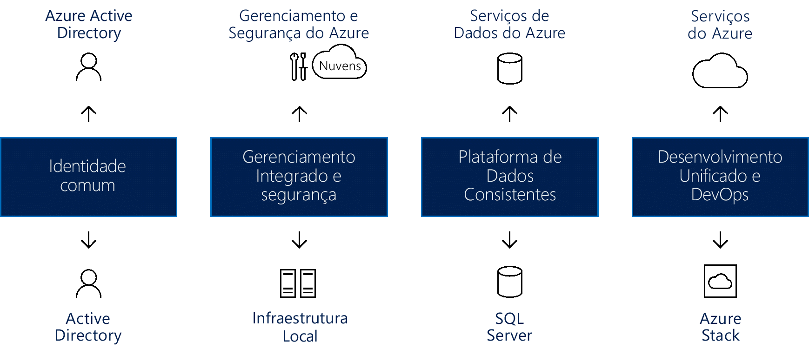

# Criar consistência de nuvem híbridaCreate hybrid cloud consistency

Este artigo orienta você quanto às abordagens de alto nível para a criação de consistência de nuvem híbrida.This article guides you through the high level approaches for creating hybrid cloud consistency.

Os modelos de implantação híbrida durante a migração podem reduzir o risco e contribuir para uma transição da infraestrutura sem problemas.Hybrid deployment models during migration can reduce risk and contribute to a smooth infrastructure transition. Em relação aos processos de negócios, as plataformas de nuvem oferecem o maior nível de flexibilidade.Cloud platforms offer the greatest level of flexibility when it comes to business processes. Muitas organizações são reticentes quanto a fazer a transição para a nuvem, preferindo manter controle total sobre os dados mais confidenciais.Many organizations are hesitant to make the move to the cloud, preferring instead to keep full control over the most sensitive data. Infelizmente, os servidores locais não permitem ter a mesma taxa de inovação como a nuvem.Unfortunately, on-premises servers don’t allow for the same rate of innovation as the cloud. Uma solução de nuvem híbrida possibilita a você o melhor dos dois cenários: a velocidade de inovação na nuvem E o conforto do gerenciamento local.A hybrid cloud solution allows you the best of both worlds: The speed of cloud innovation AND the comfort of on-premises management.

## Integrar a consistência da nuvem híbridaIntegrate hybrid cloud consistency

O uso de uma solução de nuvem híbrida permite que as organizações dimensionem os recursos de computação.Using a hybrid cloud solution allows organizations to scale computing resources. Isso também elimina a necessidade de fazer grandes investimentos de capital para lidar com picos de demanda de curto prazo.It also eliminates the need to make massive capital expenditures to handle short-term spikes in demand. Quando alterações aos seus negócios levam à necessidade de liberar recursos locais para mais dados confidenciais ou aplicativos, o desprovisionamento de recursos de nuvem fica mais fácil, rápido e com menos custos.When changes to your business drive the need to free up local resources for more sensitive data or applications, it is easier, faster, and less expensive to deprovision cloud resources. Você paga apenas pelos recursos que sua organização usa temporariamente em vez de precisar comprar e fazer a manutenção de recursos adicionais.You pay only for those resources your organization temporarily uses, instead of having to purchase and maintain additional resources. Isso reduz a quantidade de equipamentos que podem permanecer inativos durante longos períodos de tempo.This reduces the amount of equipment that might remain idle over long periods of time. Nuvem híbrida é uma plataforma de "melhor de todos os mundos possíveis", fornecendo todos os benefícios da flexibilidade, escalabilidade e eficiências de custo; de computação em nuvem de computação tudo isso com o mais baixo possível risco de exposição de dados.Hybrid cloud computing is a "best of all possible worlds" platform, delivering all the benefits of cloud computing flexibility, scalability, and cost efficiencies; all with the lowest possible risk of data exposure.

*Figura 1. Criação da consistência de nuvem híbrida entre identidades, gerenciamentos, segurança, dados, desenvolvimentos e DevOps*
*Figure 1. Creating hybrid cloud consistency across identity, management, security, data, development, and DevOps*

Uma verdadeira solução de nuvem híbrida deve fornecer quatro componentes, com cada um oferecendo benefícios significativos, incluindo:A true hybrid cloud solution must provide four components, each of which brings significant benefits, including:

- Identidade comum para aplicativos locais e em nuvem: melhora a produtividade do usuário ao fornecer a ele um SSO (logon único) para todos os seus aplicativos.Common identity for on-premises and cloud applications: This improves user productivity by giving users single sign-on (SSO) to all their applications. Também é garantida a consistência conforme aplicativos e usuários ultrapassam as fronteiras da rede/nuvem.It also ensures consistency as applications and users cross network/cloud boundaries.
- Gerenciamento e segurança integrados em sua nuvem híbrida: fornece uma maneira coesa para monitorar, gerenciar e proteger o ambiente, permitindo uma maior visibilidade e controle.Integrated management and security across your hybrid cloud: This provides you with a cohesive way to monitor, manage, and secure the environment, enabling increased visibility and control.
- Uma plataforma consistente de dados para o datacenter e a nuvem: cria a portabilidade de dados, combinada com o acesso contínuo serviços locais e de dados de nuvem para uma profunda compreensão de todas as fontes de dados.A consistent data platform for the datacenter and the cloud: This creates data portability, combined with seamless access to on-premises and cloud data services for deep insight into all data sources.
- Desenvolvimento e DevOps unificados entre os datacenters de nuvem e locais: permite que você mova os aplicativos entre os dois ambientes conforme o necessário, melhorando a produtividade do desenvolvedor, pois agora ambos os locais têm o mesmo ambiente de desenvolvimento.Unified development and DevOps across the cloud and on-premises datacenters: This allows you to move applications between the two environments as needed, improving developer productivity, as both places now have the same development environment.
  
Os exemplos desses componentes de uma perspectiva do Azure incluem:Examples of these components from an Azure perspective include:

- o Azure AD (Azure Active Directory), que funciona com o Azure AD local para fornecer uma identidade comum a todos os usuários.Azure Active Directory (Azure AD), which works with on-premises Azure AD to provide common identity for all users. O SSO entre o local e por meio da nuvem facilita o acesso seguro dos usuários aos aplicativos e ativos de que precisam.SSO across on-premises and via the cloud makes it simple for users to safely access the applications and assets they need. Os administradores podem gerenciar a segurança e controles de governança para que os usuários possam acessar o que eles precisam, com flexibilidade para ajustar essas permissões sem afetar a experiência do usuário.Administrators can manage security and governance controls so that users can access what they need, with flexibility to adjust those permissions without affecting the user experience.
- O Azure oferece serviços integrados de gerenciamento e segurança para as infraestruturas de nuvem e local que incluem um conjunto integrado de ferramentas para monitorar, configurar e proteger nuvens híbridas.Azure provides integrated management and security services for both cloud and on-premises infrastructure that include an integrated set of tools for monitoring, configuring, and protecting hybrid clouds. Essa abordagem de ponta a ponta do gerenciamento aborda especificamente os desafios do mundo real que as organizações enfrentam ao levar uma solução de nuvem híbrida em consideração.This end-to-end approach to management specifically addresses real-world challenges facing organizations considering a hybrid cloud solution.
- Uma nuvem híbrida do Azure fornece ferramentas comuns que garantem acesso seguro a todos os dados, de modo perfeito e eficiente.Azure hybrid cloud provides common tools that ensure secure access to all data, seamlessly and efficiently. Os serviços de dados do Azure se unem ao Microsoft SQL Server para criar uma plataforma de dados consistente.Azure data services combine with Microsoft SQL Server to create a consistent data platform. Um modelo de nuvem híbrida consistente permite que os usuários trabalhem com dados operacionais e analíticos, fornecendo os mesmos serviços locais e na nuvem para data warehouse, análise de dados e visualização de dados.A consistent hybrid cloud model allows users to work with both operational and analytical data, providing the same services on-premises and in the cloud for data warehousing, data analysis, and data visualization.
- Os serviços de nuvem do Microsoft Azure, combinados com o Microsoft Azure Stack local, fornecem desenvolvimento e DevOps unificados.Microsoft Azure cloud services, combined with Microsoft Azure Stack on-premises, provide unified development and DevOps. A consistência entre a nuvem e o local significa que sua equipe de DevOps pode criar aplicativos que sejam executados em qualquer um desses ambientes e podem fazer facilmente a implantação ao local correto.Consistency across the cloud and on-premises means that your DevOps team can build applications that run in either environment, and can easily deploy to the right location. Você também pode reutilizar os modelos em toda a solução híbrida, o que pode simplificar ainda mais os processos do DevOps.You can reuse templates across the hybrid solution as well, which can further simplify DevOps processes.

## Azure Stack em um ambiente de nuvem híbridaAzure Stack in a hybrid cloud environment

O Microsoft Azure Stack é uma solução de nuvem híbrida que permite que organizações executem serviços consistentes do Azure em seus datacenters, fornecendo uma experiência simplificada de desenvolvimento, de gerenciamento e de segurança que seja consistente com os serviços de nuvem pública do Azure.Microsoft Azure Stack is a hybrid cloud solution that allows organizations to run Azure-consistent services in their datacenter, providing a simplified development, management, and security experience that is consistent with Azure public cloud services. O Azure Stack é uma extensão do Azure, o que permite a execução dos serviços do Azure a partir de seus ambientes locais e mover para a nuvem do Azure se e quando necessário.Azure Stack is an extension of Azure, enabling you to run Azure services from your on-premises environments and then move to the Azure cloud if and when required.

O Azure Stack permite que você implante e opere o IaaS e o PaaS usando as mesmas ferramentas e oferecendo a mesma experiência de nuvem pública do Azure.Azure Stack allows you to deploy and operate both IaaS and PaaS using the same tools and offering the same experience as the Azure public cloud. O gerenciamento do Azure Stack, seja por meio do portal de interface do usuário da Web ou por meio do PowerShell, tem uma aparência consistente para os administradores de TI e usuários finais do Azure.Management of Azure Stack, whether through the web UI portal or through PowerShell, has a consistent look and feel for IT administrators and end users with Azure.

O Azure e o Azure Stack desbloqueiam novos casos de uso híbrido para aplicativos voltados ao cliente e internos de linha de negócios, incluindo:Azure and Azure Stack unlock new hybrid use cases for both customer-facing and internal line-of-business applications, including:

- **Soluções desconectadas e de borda**.**Edge and disconnected solutions**. Os clientes podem lidar com os requisitos de latência e conectividade processando dados localmente no Azure Stack e então agregando-os ao Azure para análise adicional, com uma lógica comum do aplicativo entre ambos.Customers can address latency and connectivity requirements by processing data locally in Azure Stack and then aggregating in Azure for further analytics, with common application logic across both. Há muitos clientes interessados nesse cenário de borda em diferentes contextos, incluindo chão de fábrica, cruzeiros e minas.Many customers are interested in this edge scenario across different contexts, including factory floors, cruise ships, and mine shafts.
- **Aplicativos de nuvem que atendem a diversos regulamentos**.**Cloud applications that meet various regulations**. Os clientes podem desenvolver e implantar aplicativos no Azure com total flexibilidade para realizar a implantar local no Azure Stack para atender aos requisitos regulatórios ou de política sem a necessidade de alterações no código.Customers can develop and deploy applications in Azure, with full flexibility to deploy on-premises on Azure Stack to meet regulatory or policy requirements, with no code changes needed. Entre os exemplos ilustrativos de aplicativos, há auditorias globais, relatórios financeiros, intercâmbios comerciais internacionais, jogos online e relatórios de despesas.Illustrative application examples include global audit, financial reporting, foreign exchange trading, online gaming, and expense reporting. Algumas vezes, os clientes querem implantar instâncias diferentes do mesmo aplicativo no Azure ou Azure Stack com base em requisitos técnicos e de negócios.Customers are sometimes looking to deploy different instances of the same application to Azure or Azure Stack, based on business and technical requirements. Embora o Azure cumpra a maioria dos requisitos, o Azure Stack complementa a abordagem de implantação quando necessário.While Azure meets most requirements, Azure Stack complements the deployment approach where needed.
- **Modelo de aplicativo de nuvem local**.**Cloud application model on-premises**. Os clientes podem usar os serviços Web, os contêineres e as arquiteturas sem servidor e de microsserviço do Azure para atualizar e estender aplicativos existentes ou criar novos.Customers can use Azure web services, containers, serverless, and microservice architectures to update and extend existing applications or build new ones. É possível usar processos consistentes de DevOps entre o Azure na nuvem e o Azure Stack local.You can use consistent DevOps processes across Azure in the cloud and Azure Stack on-premises. Há um crescente interesse na modernização de aplicativos, incluindo aplicativos principais de missão crítica.There is a growing interest in application modernization, including for core mission-critical applications.

O Azure Stack é oferecido com duas opções de implantação:Azure Stack is offered via two deployment options:

- **Sistemas integrados do Azure Stack**.**Azure Stack integrated systems**. Os sistemas integrados do Azure Stack são oferecidos por meio de uma parceria entre Microsoft e os parceiros de hardware, criando uma solução que fornece uma inovação conduzida na nuvem equilibrada com uma simplicidade no gerenciamento.Azure Stack integrated systems are offered through a partnership of Microsoft and hardware partners, creating a solution that provides cloud-paced innovation balanced with simplicity in management. Como o Azure Stack é oferecido como um sistema integrado de hardware e software, você obtém a quantidade certa de flexibilidade e controle, enquanto ainda adota a inovação a partir da nuvem.Because Azure Stack is offered as an integrated system of hardware and software, you get the right amount of flexibility and control, while still adopting innovation from the cloud. Os sistemas integrados do Azure Stack variam de 4 a 12 nós de tamanho e conta com um suporte conjunto da Microsoft e dos parceiros de hardware.Azure Stack integrated systems range in size from 4–12 nodes and are jointly supported by the hardware partner and Microsoft. Use sistemas integrados do Azure Stack para habilitar novos cenários para suas cargas de trabalho de produção.Use Azure Stack integrated systems to enable new scenarios for your production workloads.
- **Kit de Desenvolvimento do Azure Stack**.**Azure Stack Development Kit**. O Kit de Desenvolvimento do Microsoft Azure Stack é uma implantação de nó único do Azure Stack que você pode usar para avaliar e saber mais sobre essa extensão.Microsoft Azure Stack Development Kit is a single-node deployment of Azure Stack, which you can use to evaluate and learn about Azure Stack. Você também pode usar o kit como um ambiente de desenvolvedor, no qual é possível desenvolver usando as APIs e ferramentas consistentes com o Azure.You can also use the kit as a developer environment, where you can develop using APIs and tooling that are consistent with Azure. O Kit de Desenvolvimento do Azure Stack não foi projetado para ser usado como um ambiente de produção.Azure Stack Development Kit is not intended to be used as a production environment.

## Ecossistema de nuvem única do Azure StackAzure Stack One Cloud Ecosystem

Você pode acelerar iniciativas de pilha do Azure usando o ecossistema do Azure completo:You can speed up Azure Stack initiatives by using the complete Azure ecosystem:

- O Azure garante que a maioria dos aplicativos e serviços certificados do Azure funcionará no Azure Stack.Azure ensures that most applications and services certified for Azure will work on Azure Stack. Vários ISVs &mdash; incluindo Bitnami, Docker, Kemp Technologies, Pivotal Cloud Foundry, Red Hat Enterprise Linux e SUSE Linux &mdash; estão estendendo suas soluções ao Azure Stack.Several ISVs &mdash; including Bitnami, Docker, Kemp Technologies, Pivotal Cloud Foundry, Red Hat Enterprise Linux, and SUSE Linux &mdash; are extending their solutions to Azure Stack.
- Você pode optar por ter o Azure Stack entregue e operado como um serviço totalmente gerenciado.You can opt to have Azure Stack delivered and operated as a fully managed service. Vários parceiros &mdash; incluindo Tieto, Yourhosting, Revera, Pulsant e NTT &mdash; contarão com as ofertas de serviço gerenciadas no Azure e Azure Stack em breve.Several partners &mdash; including Tieto, Yourhosting, Revera, Pulsant, and NTT &mdash; will have managed service offerings across Azure and Azure Stack shortly. Esses parceiros têm fornecido serviços gerenciados do Azure por meio do programa de Provedor de soluções de nuvem (Provedores de nuvem) e agora estão ampliando suas ofertas para incluir soluções híbridas.These partners have been delivering managed services for Azure via the Cloud Solution Provider (Cloud Providers) program and are now extending their offerings to include hybrid solutions.
- Como exemplo de uma solução de nuvem híbrida completa e totalmente gerenciada, a Avanade fornece uma oferta de all-in-one que inclui serviços de transformação de nuvem, software, instalação e configuração, infraestrutura e serviços gerenciados contínuos para que os clientes possam usar o Azure Stack exatamente como fazem com o Azure atualmente.As an example of a complete, fully managed hybrid cloud solution, Avanade is delivering an all-in-one offer that includes cloud transformation services, software, infrastructure, setup and configuration, and ongoing managed services so customers can consume Azure Stack just as they do with Azure today.
- Os SIs (Integradores de sistemas) podem ajudar a acelerar as iniciativas de modernização de aplicativos com a criação de soluções de ponta a ponta do Azure para clientes.Systems Integrators (SI) can help accelerate application modernization initiatives by building end-to-end Azure solutions for customers. Eles usam conjuntos detalhados de habilidades do Azure, conhecimento sobre o setor e o domínio e experiência de processo (por exemplo, DevOps).They bring in-depth Azure skill sets, domain and industry knowledge, and process expertise (e.g., DevOps). Cada nuvem do Azure Stack é uma oportunidade para um SI criar a solução, liderar e influenciar a implantação de sistema, personalizar as funcionalidades incluídas e entregar atividades operacionais.Every Azure Stack cloud is an opportunity for an SI to design the solution, lead and influence system deployment, customize the included capabilities, and deliver operational activities. Isso inclui SIs como Avanade, DXC, Dell EMC Services, InFront Consulting Group, HPE Pointnext e Pricewaterhouse Coopers (PwC).This includes SIs like Avanade, DXC, Dell EMC Services, InFront Consulting Group, HPE Pointnext, and Pricewaterhouse Coopers (PwC).
