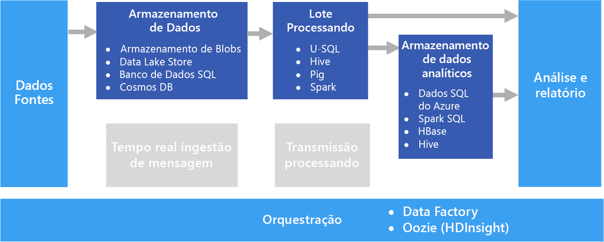

# Processamento em lotes

Um cenário comum de Big Data é o processamento em lotes de dados em repouso. Nesse cenário, os dados de origem são carregados no armazenamento de dados, pelo próprio aplicativo de origem ou por um fluxo de trabalho de orquestração. Os dados são então processados in-loco por um trabalho paralelizado, o que também pode ser iniciado pelo fluxo de trabalho de orquestração. O processamento pode incluir várias etapas iterativas antes que os resultados transformados sejam carregados em um armazenamento de dados analíticos, que pode ser consultado por componentes de relatório e análise.

Por exemplo, os logs de um servidor Web podem ser copiados para uma pasta e então processados durante a noite para gerar relatórios diários das atividades da Web.

## Quando usar esta solução

O processamento em lotes é usado em uma variedade de cenários, de transformações de dados simples a um pipeline ETL (extração, transformação e carregamento) mais completo. Em um contexto de Big Data, o processamento em lotes pode operar em conjuntos grandes de dados, em que o cálculo leva um tempo significativo para ser concluído. (Por exemplo, consulte [Arquitetura lambda](../big-data/index.md#lambda-architecture).) O processamento em lotes normalmente leva a uma exploração interativa posterior, fornece os dados prontos para modelagem para o aprendizado de máquina ou grava os dados em um armazenamento de dados que é otimizado para análise e visualização.

Um exemplo de processamento em lotes é transformar um conjunto grande de arquivos simples, CSV ou JSON semiestruturados em um formato esquematizado e estruturado pronto para consulta posterior. Normalmente, os dados são convertidos dos formatos brutos usados para ingestão (como CSV) em formatos binários que têm um melhor desempenho para consulta, pois eles armazenam dados em um formato de coluna e, geralmente, fornecem índices e estatísticas embutidas sobre os dados.

## Desafios

- **Formato de dados e codificação**. Alguns dos problemas mais difíceis de depurar ocorrem quando os arquivos usam um formato ou codificação inesperada. Por exemplo, os arquivos de origem podem usar uma combinação da codificação UTF-16 e UTF-8, conter delimitadores inesperados (espaço versus tabulação) ou incluir caracteres inesperados. Outro exemplo comum são campos de texto que contêm guias, espaços ou vírgulas, interpretados como delimitadores. A lógica de carregamento e análise de dados precisa ser flexível o suficiente para detectar e resolver esses problemas.

- **Orquestrando fatias de tempo.** Em geral, os dados de origem são colocados em uma hierarquia de pastas que reflete as janelas de processamento, organizadas por ano, mês, dia, hora e assim por diante. Em alguns casos, os dados podem ser recebidos com atraso. Por exemplo, suponha que haja uma falha em um servidor Web e os logs de 7 de março não estejam na pasta para o processamento até 9 de março. Eles são apenas ignorados porque foram recebidos com muito atraso? A lógica de processamento downstream pode manipular registros fora de ordem?

## Arquitetura

Uma arquitetura de processamento em lotes tem os componentes lógicos a seguir, mostrados no diagrama acima.

- **Armazenamento de dados.** Normalmente, um armazenamento de arquivos distribuído que pode atuar como um repositório de amplos volumes de arquivos grandes em vários formatos. Genericamente, esse tipo de repositório costuma ser conhecido como um data lake. 

- **Processamento em lotes.** Com frequência, a natureza de alto volume de Big Data significa que as soluções precisam processar arquivos de dados usando trabalhos em lotes de execução longa para filtrar, agregar e, de outro modo, preparar os dados para análise. Normalmente, esses trabalhos envolvem ler arquivos de origem, processá-los e gravar a saída para novos arquivos. 

- **Armazenamento de dados analíticos.** Muitas soluções de Big Data foram projetadas para preparar dados para análise e então fornecer os dados processados em um formato estruturado que pode ser consultado com ferramentas analíticas. 

- **Análise e relatórios.** A meta da maioria das soluções de Big Data é gerar insights sobre os dados por meio de análise e relatórios. 

- **Orquestração.** Normalmente, com o processamento em lotes, um pouco de orquestração é necessário para migrar ou copiar os dados para o armazenamento de dados, o processamento em lotes, o armazenamento de dados analíticos e as camadas de relatórios.

## Opções de tecnologia

As tecnologias a seguir são as opções recomendadas de soluções de processamento em lotes do Azure.

### Armazenamento de dados

- **Contêineres do Azure Storage Blob**. Muitos processos de negócios do Azure já fazem uso do armazenamento de blobs do Azure, fazendo dele uma boa escolha para um armazenamento de Big Data.
- **Azure Data Lake Store**. O Azure Data Lake Store oferece armazenamento praticamente ilimitado para qualquer tamanho de arquivo, bem como opções de segurança extensiva, tornando-o uma boa escolha para soluções de Big Data de escala extremamente grande que exigem um repositório centralizado de dados em formatos heterogêneos.

Para obter mais informações, consulte [Armazenamento de dados](../technology-choices/data-storage.md).

### Processamento em lotes

- **U-SQL**. O U-SQL é a linguagem de processamento de consulta usada pelo Azure Data Lake Analytics. Ele combina a natureza declarativa do SQL com a extensibilidade de procedimentos do C# e aproveita o paralelismo para permitir o processamento eficiente de dados em grande escala.
- **Hive**. O Hive é uma linguagem semelhante ao SQL que é compatível com a maioria das distribuições do Hadoop, incluindo HDInsight. Ele pode ser usado para processar dados de qualquer repositório compatível com o HDFS, incluindo o armazenamento de blobs do Azure e o Azure Data Lake Store.
- **Pig**. O Pig é uma linguagem de processamento de Big Data declarativa usada em muitas distribuições do Hadoop, incluindo HDInsight. É particularmente útil para o processamento de dados não estruturados ou semiestruturados.
- **Spark**. O mecanismo do Spark dá suporte a programas de processamento em lotes escritos em uma variedade de linguagens, incluindo Java, Scala e Python. O Spark usa uma arquitetura distribuída para processar dados em paralelo em vários nós de trabalho.

Para obter mais informações, consulte [Processamento em lotes](../technology-choices/batch-processing.md).

### Armazenamento de dados analíticos

- **SQL Data Warehouse**. O SQL Data Warehouse do Azure é um serviço gerenciado baseado em tecnologias do banco de dados do SQL Server e otimizado para dar suporte a cargas de trabalho de data warehouse em grande escala.
- **Spark SQL**. O Spark SQL é uma API baseada no Spark que dá suporte à criação de dataframes e tabelas que podem ser consultados com a sintaxe SQL.
- **HBase**. O HBase é um repositório NoSQL de baixa latência que oferece uma opção de alto desempenho e flexível para consulta de dados estruturados e semiestruturados.
- **Hive**. Além de ser útil para o processamento em lotes, o Hive oferece uma arquitetura de banco de dados que é conceitualmente semelhante a um RDBMS típico. As melhorias no desempenho de consulta do Hive por meio de inovações como o mecanismo Tez e a iniciativa Stinger significam que as tabelas do Hive podem ser usadas efetivamente como fontes para consultas analíticas em alguns cenários.

Para obter mais informações, consulte [Armazenamentos de dados analíticos](../technology-choices/analytical-data-stores.md).

### Análise e relatórios

- **Azure Analysis Services**. Muitas soluções de Big Data emulam arquiteturas tradicionais de business intelligence empresarial, incluindo um modelo de dados OLAP (processamento analítico online) centralizado (também conhecido como um cubo) nos quais relatórios, painéis e uma análise interativa "segmentar e analisar" podem ser baseados. O Azure Analysis Services dá suporte à criação de modelos de tabela para atender a essa necessidade.
- **Power BI**. O Power BI permite aos analistas de dados criar visualizações interativas de dados com base em modelos de dados em um modelo OLAP ou diretamente em um armazenamento de dados analíticos.
- **Microsoft Excel**. O Microsoft Excel é um dos aplicativos de software mais amplamente usados no mundo e oferece uma variedade de funcionalidades de análise e visualização de dados. Os analistas de dados podem usar o Excel para criar modelos de dados de documentos com base em armazenamentos de dados analíticos ou recuperar dados de modelos de dados OLAP em Tabelas Dinâmicas e gráficos interativos.

Para obter mais informações, consulte [Análise e relatórios](../technology-choices/analysis-visualizations-reporting.md).

### Orquestração

- **Azure Data Factory**. Os pipelines do Azure Data Factory podem ser usados para definir uma sequência de atividades, agendada para janelas temporais recorrentes. Essas atividades podem iniciar operações de cópia de dados, bem como trabalhos do Hive, Pig, MapReduce ou Spark em clusters HDInsight sob demanda, trabalhos do U-SQL no Azure Date Lake Analytics e procedimentos armazenados no SQL Data Warehouse do Azure ou no Banco de Dados SQL do Azure.
- **Oozie** e **Sqoop**. O Oozie é um mecanismo de automação de trabalhos para o ecossistema do Apache Hadoop e pode ser usado para iniciar operações de cópia de dados, bem como trabalhos do Hive, Pig e MapReduce para processar dados e trabalhos do Sqoop para copiar dados entre bancos de dados HDFS e SQL.

Para obter mais informações, consulte [Orquestração de pipeline](../technology-choices/pipeline-orchestration-data-movement.md)
