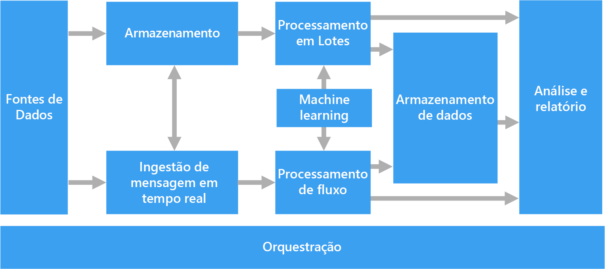
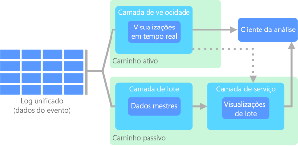
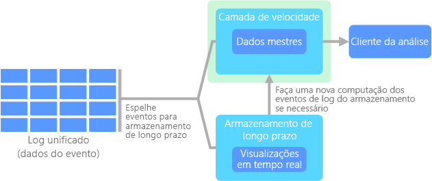
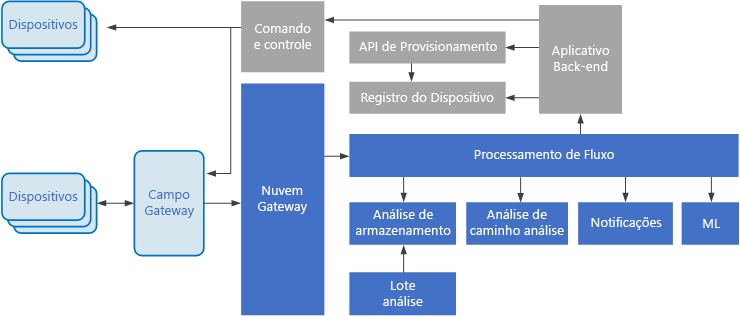

# Arquiteturas de Big DataBig data architectures

Uma arquitetura de Big Data foi projetada para lidar com ingestão, processamento e análise de dados grandes ou complexos demais para sistemas de banco de dados tradicionais.A big data architecture is designed to handle the ingestion, processing, and analysis of data that is too large or complex for traditional database systems. O limite no qual as organizações ingressam no campo do Big Data é diferente, dependendo das capacidades dos usuários e de suas ferramentas.The threshold at which organizations enter into the big data realm differs, depending on the capabilities of the users and their tools. Para alguns, isso pode significar centenas de gigabytes de dados, enquanto para outros, centenas de terabytes.For some, it can mean hundreds of gigabytes of data, while for others it means hundreds of terabytes. À medida que as ferramentas para o trabalho com conjuntos de Big Data evoluem, na mesma proporção evolui o significado de Big Data.As tools for working with big data sets advance, so does the meaning of big data. Cada vez mais, esse termo se relaciona ao valor que é possível extrair dos conjuntos de dados por meio de análise avançada, em vez de estritamente o tamanho dos dados, embora nesses casos, eles tendam a ser muito grandes.More and more, this term relates to the value you can extract from your data sets through advanced analytics, rather than strictly the size of the data, although in these cases they tend to be quite large.

Ao longo dos anos, o cenário dos dados vem mudando.Over the years, the data landscape has changed. Houve uma mudança no que você pode fazer ou o que deve fazer, com os dados.What you can do, or are expected to do, with data has changed. O custo de armazenamento caiu drasticamente, enquanto os meios pelos quais os dados são coletados continuam aumentando.The cost of storage has fallen dramatically, while the means by which data is collected keeps growing. Alguns dados são recebidos a um ritmo rápido, constantemente exigindo sua coleta e observação.Some data arrives at a rapid pace, constantly demanding to be collected and observed. Outros dados são recebidos mais lentamente, mas em partes muito grandes, geralmente na forma de décadas de dados históricos.Other data arrives more slowly, but in very large chunks, often in the form of decades of historical data. Talvez você esteja enfrentando um problema de análise avançada ou um problema que exija o aprendizado de máquina.You might be facing an advanced analytics problem, or one that requires machine learning. Esses são desafios que as arquiteturas de Big Data buscam resolver.These are challenges that big data architectures seek to solve.

Soluções de Big Data normalmente envolvem um ou mais dos seguintes tipos de carga de trabalho:Big data solutions typically involve one or more of the following types of workload:

* Processamento em lote de fontes Big Data em repouso.Batch processing of big data sources at rest.
* Processamento em tempo real de Big Data em movimento.Real-time processing of big data in motion.
* Exploração interativa de Big Data.Interactive exploration of big data.
* Análise preditiva e machine learning.Predictive analytics and machine learning.

Considere o uso das arquiteturas de Big Data quando precisar:Consider big data architectures when you need to:

* Armazenar e processar dados em volumes muito grandes para um banco de dados tradicional.Store and process data in volumes too large for a traditional database.
* Transformar dados não estruturados para análise e relatório.Transform unstructured data for analysis and reporting.
* Capturar, processar e analisar fluxos não associados de dados em tempo real ou com baixa latência.Capture, process, and analyze unbounded streams of data in real time, or with low latency.

## Componentes de uma arquitetura de Big DataComponents of a big data architecture

O diagrama a seguir mostra os componentes lógicos que se inserem em uma arquitetura de Big Data.The following diagram shows the logical components that fit into a big data architecture. As soluções individuais podem não conter todos os itens neste diagrama.Individual solutions may not contain every item in this diagram.

 

A maioria das arquiteturas de Big Data inclui alguns ou todos os seguintes componentes:Most big data architectures include some or all of the following components:

* **Fontes de dados**.**Data sources**. Todas as soluções de Big Data começam com uma ou mais fontes de dados.All big data solutions start with one or more data sources. Os exemplos incluem:Examples include:

    * Armazenamentos de dados de aplicativo, como bancos de dados relacionais.Application data stores, such as relational databases.
    * Arquivos estáticos produzidos por aplicativos, como arquivos de log do servidor Web.Static files produced by applications, such as web server log files.
    * Fontes de dados em tempo real, como dispositivos IoT.Real-time data sources, such as IoT devices.

* **Armazenamento de dados**.**Data storage**. Os dados de operações de processamento em lotes normalmente são armazenados em um repositório de arquivos distribuído que pode conter amplos volumes de arquivos grandes em vários formatos.Data for batch processing operations is typically stored in a distributed file store that can hold high volumes of large files in various formats. Esse tipo de repositório geralmente é chamado *data lake*.This kind of store is often called a *data lake*. As opções para implementar esse armazenamento incluem contêineres de blobs ou Azure Data Lake Store no Armazenamento do Azure.Options for implementing this storage include Azure Data Lake Store or blob containers in Azure Storage.

* **Processamento em lotes**.**Batch processing**. Como os conjuntos de dados são muito grandes, geralmente, uma solução de Big Data precisa processar arquivos de dados usando trabalhos em lotes de execução longa para filtrar, agregar e, de outro modo, preparar os dados para análise.Because the data sets are so large, often a big data solution must process data files using long-running batch jobs to filter, aggregate, and otherwise prepare the data for analysis. Normalmente, esses trabalhos envolvem ler arquivos de origem, processá-los e gravar a saída para novos arquivos.Usually these jobs involve reading source files, processing them, and writing the output to new files. Opções incluem executar trabalhos de U-SQL no Azure Data Lake Analytics, usar trabalhos Hive, Pig ou de Mapear/Reduzir personalizados em um cluster HDInsight Hadoop ou usar programas de Java, Scala ou Python em um cluster HDInsight Spark.Options include running U-SQL jobs in Azure Data Lake Analytics, using Hive, Pig, or custom Map/Reduce jobs in an HDInsight Hadoop cluster, or using Java, Scala, or Python programs in an HDInsight Spark cluster.

* **Ingestão de mensagens em tempo real**.**Real-time message ingestion**. Se a solução inclui fontes em tempo real, a arquitetura precisa incluir uma maneira de capturar e armazenar mensagens em tempo real para processamento de fluxo.If the solution includes real-time sources, the architecture must include a way to capture and store real-time messages for stream processing. Isso pode ser um armazenamento de dados simples, em que as mensagens de entrada são removidas para uma pasta para processamento.This might be a simple data store, where incoming messages are dropped into a folder for processing. No entanto, muitas soluções precisam de um repositório de ingestão de mensagens para atuar como buffer de mensagens e dar suporte a processamento de expansão, entrega confiável e outras semânticas de enfileiramento de mensagem.However, many solutions need a message ingestion store to act as a buffer for messages, and to support scale-out processing, reliable delivery, and other message queuing semantics. Essa parte de uma arquitetura de streaming geralmente é conhecida como buffer de fluxo.This portion of a streaming architecture is often referred to as stream buffering. Entre as opções estão os Hubs de Eventos do Azure, o Hub IoT do Azure e o Kafka.Options include Azure Event Hubs, Azure IoT Hub, and Kafka.

* **Processamento de fluxo**.**Stream processing**. Depois de capturar mensagens em tempo real, a solução precisa processá-las filtrando, agregando e preparando os dados para análise.After capturing real-time messages, the solution must process them by filtering, aggregating, and otherwise preparing the data for analysis. Os dados de fluxo processados são gravados em um coletor de saída.The processed stream data is then written to an output sink. O Azure Stream Analytics oferece um serviço de processamento de fluxo gerenciado baseado em consultas SQL em execução perpétua que operam em fluxos não associados.Azure Stream Analytics provides a managed stream processing service based on perpetually running SQL queries that operate on unbounded streams. Você também pode usar tecnologias de streaming Apache de software livre, como Storm e Spark Streaming em um cluster HDInsight.You can also use open source Apache streaming technologies like Storm and Spark Streaming in an HDInsight cluster.

* **Armazenamento de dados analíticos**.**Analytical data store**. Muitas soluções de Big Data preparam dados para análise e então fornecem os dados processados em um formato estruturado que pode ser consultado com ferramentas analíticas.Many big data solutions prepare data for analysis and then serve the processed data in a structured format that can be queried using analytical tools. O armazenamento de dados analíticos usado para atender a essas consultas pode ser um data warehouse relacional estilo Kimball, como visto na maioria das soluções de BI (business intelligence) tradicionais.The analytical data store used to serve these queries can be a Kimball-style relational data warehouse, as seen in most traditional business intelligence (BI) solutions. Como alternativa, os dados podem ser apresentados por meio de uma tecnologia NoSQL de baixa latência, como HBase ou um banco de dados Hive interativo que oferece uma abstração de metadados sobre arquivos de dados no armazenamento de dados distribuído.Alternatively, the data could be presented through a low-latency NoSQL technology such as HBase, or an interactive Hive database that provides a metadata abstraction over data files in the distributed data store. O SQL Data Warehouse do Azure fornece um serviço gerenciado para armazenamento de dados em larga escala baseado em nuvem.Azure SQL Data Warehouse provides a managed service for large-scale, cloud-based data warehousing. O HDInsight dá suporte a Hive interativo, HBase e Spark SQL, que também pode ser usado para veicular dados para análise.HDInsight supports Interactive Hive, HBase, and Spark SQL, which can also be used to serve data for analysis.

* **Análise e relatórios**.**Analysis and reporting**. A meta da maioria das soluções de Big Data é gerar insights sobre os dados por meio de análise e relatórios.The goal of most big data solutions is to provide insights into the data through analysis and reporting. Para capacitar os usuários a analisar os dados, a arquitetura pode incluir uma camada de modelagem de dados, como um cubo OLAP multidimensional ou um modelo de dados tabular no Azure Analysis Services.To empower users to analyze the data, the architecture may include a data modeling layer, such as a multidimensional OLAP cube or tabular data model in Azure Analysis Services. Também pode dar suporte a business intelligence de autoatendimento, usando as tecnologias de modelagem e visualização do Microsoft Power BI ou do Microsoft Excel.It might also support self-service BI, using the modeling and visualization technologies in Microsoft Power BI or Microsoft Excel. Análise e relatórios também podem assumir a forma de exploração de dados interativos por cientistas de dados ou analistas de dados.Analysis and reporting can also take the form of interactive data exploration by data scientists or data analysts. Para esses cenários, muitos serviços do Azure dão suporte a blocos de anotações analíticos, como Jupyter, permitindo que esses usuários aproveitem suas habilidades existentes com Python ou R. Para exploração de dados em larga escala, você pode usar o Microsoft R Server, seja no modo autônomo ou com Spark.For these scenarios, many Azure services support analytical notebooks, such as Jupyter, enabling these users to leverage their existing skills with Python or R. For large-scale data exploration, you can use Microsoft R Server, either standalone or with Spark.

* **Orquestração**.**Orchestration**. A maioria das soluções de Big Data consiste em operações de processamento de dados repetidas, encapsuladas em fluxos de trabalho, que transformam dados de origem, movem dados entre várias origens e coletores, carregam os dados processados em um armazenamento de dados analíticos ou enviam os resultados por push diretamente para um relatório ou painel.Most big data solutions consist of repeated data processing operations, encapsulated in workflows, that transform source data, move data between multiple sources and sinks, load the processed data into an analytical data store, or push the results straight to a report or dashboard. Para automatizar esses fluxos de trabalho, você pode usar uma tecnologia de orquestração, como Azure Data Factory ou Apache Oozie e Sqoop.To automate these workflows, you can use an orchestration technology such Azure Data Factory or Apache Oozie and Sqoop.

## Arquitetura lambdaLambda architecture

Ao trabalhar com conjuntos de dados muito grandes, pode levar muito tempo para executar a classificação de consultas de que os clientes precisam.When working with very large data sets, it can take a long time to run the sort of queries that clients need. Essas consultas não podem ser executadas em tempo real e geralmente exigem algoritmos como [MapReduce](https://en.wikipedia.org/wiki/MapReduce), que operam em paralelo em todo o conjunto de dados.These queries can't be performed in real time, and often require algorithms such as [MapReduce](https://en.wikipedia.org/wiki/MapReduce) that operate in parallel across the entire data set. Os resultados são então armazenados separadamente dos dados brutos e usados para consulta.The results are then stored separately from the raw data and used for querying.

Uma desvantagem dessa abordagem é que ela introduz latência &mdash; se o processamento levar algumas horas, uma consulta poderá retornar resultados de várias horas atrás.One drawback to this approach is that it introduces latency &mdash; if processing takes a few hours, a query may return results that are several hours old. O ideal é que você obtenha alguns resultados em tempo real (talvez com alguma perda de precisão) e combine esses resultados com os resultados da análise de lote.Ideally, you would like to get some results in real time (perhaps with some loss of accuracy), and combine these results with the results from the batch analytics.

A **arquitetura lambda**, primeiramente proposta por Nathan Marz, resolve esse problema criando dois caminhos para o fluxo de dados.The **lambda architecture**, first proposed by Nathan Marz, addresses this problem by creating two paths for data flow. Todos os dados recebidos pelo sistema passam por esses dois caminhos:All data coming into the system goes through these two paths:

* Uma **camada de lote** (caminho frio) armazena todos os dados de entrada em sua forma bruta e executa o processamento em lotes nos dados.A **batch layer** (cold path) stores all of the incoming data in its raw form and performs batch processing on the data. O resultado desse processamento é armazenado como uma **exibição de lote**.The result of this processing is stored as a **batch view**.

* Uma **camada de velocidade** (caminho quente) analisa os dados em tempo real.A **speed layer** (hot path) analyzes data in real time. Essa camada foi projetada para baixa latência, em detrimento da precisão.This layer is designed for low latency, at the expense of accuracy.

A camada de lote alimenta uma **camada de serviço** que indexa a exibição de lote para uma consulta eficiente.The batch layer feeds into a **serving layer** that indexes the batch view for efficient querying. A camada de velocidade atualiza a camada de serviço com atualizações incrementais de acordo com os dados mais recentes.The speed layer updates the serving layer with incremental updates based on the most recent data.

Os dados que fluem para o caminho quente são restritos por requisitos de latência impostos pela camada de velocidade, de modo que ela possa ser processada o mais rapidamente possível.Data that flows into the hot path is constrained by latency requirements imposed by the speed layer, so that it can be processed as quickly as possible. Geralmente, isso exige uma desvantagem de algum nível de precisão em favor dos dados que estão prontos o mais rapidamente possível.Often, this requires a tradeoff of some level of accuracy in favor of data that is ready as quickly as possible. Por exemplo, considere um cenário de IoT em que um grande número de sensores de temperatura envia dados telemétricos.For example, consider an IoT scenario where a large number of temperature sensors are sending telemetry data. A camada de velocidade pode ser usada para processar uma janela de tempo deslizante dos dados de entrada.The speed layer may be used to process a sliding time window of the incoming data. 

Os dados que fluem para o caminho frio, por outro lado, não estão sujeitos aos mesmos requisitos de baixa latência.Data flowing into the cold path, on the other hand, is not subject to the same low latency requirements. Isso permite uma computação de alta precisão em conjuntos de dados grandes, o que pode ser muito demorado.This allows for high accuracy computation across large data sets, which can be very time intensive. 

Em última análise, os caminhos quente e frio convergem no aplicativo cliente de análise.Eventually, the hot and cold paths converge at the analytics client application. Se o cliente precisar exibir dados em tempo hábil, mas potencialmente menos precisos em tempo real, ele adquirirá seu resultado do caminho quente.If the client needs to display timely, yet potentially less accurate data in real time, it will acquire its result from the hot path. Caso contrário, ele selecionará resultados do caminho frio para exibir dados em menos tempo hábil, mas mais precisos.Otherwise, it will select results from the cold path to display less timely but more accurate data. Em outras palavras, o caminho quente contém dados para uma janela relativamente pequena de tempo, após o qual os resultados podem ser atualizados com os dados mais precisos do caminho frio.In other words, the hot path has data for a relatively small window of time, after which the results can be updated with more accurate data from the cold path.

Os dados brutos armazenados na camada de lote são imutáveis.The raw data stored at the batch layer is immutable. Os dados de entrada sempre são acrescentados aos dados existentes e os dados anteriores nunca são substituídos.Incoming data is always appended to the existing data, and the previous data is never overwritten. As alterações no valor de um dado específico são armazenadas como um novo registro de evento com carimbo de data/hora.Any changes to the value of a particular datum are stored as a new timestamped event record. Isso permite o recálculo em qualquer ponto no tempo no histórico dos dados coletados.This allows for recomputation at any point in time across the history of the data collected. A capacidade de recalcular a exibição de lote dos dados brutos originais é importante, pois permite que novas exibições sejam criadas conforme o sistema evolui.The ability to recompute the batch view from the original raw data is important, because it allows for new views to be created as the system evolves. 

## Arquitetura de kappaKappa architecture

Uma desvantagem da arquitetura de lambda é sua complexidade.A drawback to the lambda architecture is its complexity. A lógica de processamento aparece em dois lugares diferentes &mdash; os caminhos frio e quente &mdash; usando estruturas diferentes.Processing logic appears in two different places &mdash; the cold and hot paths &mdash; using different frameworks. Isso leva a uma lógica de cálculo duplicada e a complexidade de gerenciar a arquitetura para os dois caminhos.This leads to duplicate computation logic and the complexity of managing the architecture for both paths.

A **arquitetura de kappa** foi proposta por Jay Kreps como uma alternativa à arquitetura de lambda.The **kappa architecture** was proposed by Jay Kreps as an alternative to the lambda architecture. Ela tem as mesmas metas básicas da arquitetura de lambda, mas com uma diferença importante: todos os dados fluem por um único caminho, usando um sistema de processamento de fluxo.It has the same basic goals as the lambda architecture, but with an important distinction: All data flows through a single path, using a stream processing system. 

Há algumas semelhanças na camada de lote da arquitetura de lambda, em que os dados do evento são imutáveis e todos eles são coletados, em vez de um subconjunto.There are some similarities to the lambda architecture's batch layer, in that the event data is immutable and all of it is collected, instead of a subset. Os dados são ingeridos como um fluxo de eventos em um log unificado distribuído e tolerante a falhas.The data is ingested as a stream of events into a distributed and fault tolerant unified log. Esses eventos são ordenados e o estado atual de um evento é alterado somente por um novo evento que está sendo acrescentado.These events are ordered, and the current state of an event is changed only by a new event being appended. Semelhante à camada de velocidade da arquitetura de uma lambda, todo o processamento de eventos é feito no fluxo de entrada e persistido como uma exibição em tempo real.Similar to a lambda architecture's speed layer, all event processing is performed on the input stream and persisted as a real-time view. 

Se você precisar recalcular todo o conjunto de dados (equivalente ao que a camada de lote faz no lambda), basta reproduzir o fluxo, normalmente usando o paralelismo para concluir o cálculo em tempo hábil.If you need to recompute the entire data set (equivalent to what the batch layer does in lambda), you simply replay the stream, typically using parallelism to complete the computation in a timely fashion.

## Internet das coisas (IoT)Internet of Things (IoT)

Do ponto de vista prático, a IoT (Internet das Coisas) representa qualquer dispositivo conectado à Internet.From a practical viewpoint, Internet of Things (IoT) represents any device that is connected to the Internet. Isso inclui seu computador, telefone celular, relógio inteligente, termostato inteligente, refrigerador inteligente, automóvel conectado, implantes de monitoramento cardíaco e qualquer outra coisa que se conecta à Internet e envia ou recebe dados.This includes your PC, mobile phone, smart watch, smart thermostat, smart refrigerator, connected automobile, heart monitoring implants, and anything else that connects to the Internet and sends or receives data. O número de dispositivos conectados cresce diariamente, assim como a quantidade de dados coletados deles.The number of connected devices grows every day, as does the amount of data collected from them. Em geral, esses dados são coletados em ambientes altamente restritos, às vezes, de alta latência.Often this data is being collected in highly constrained, sometimes high-latency environments. Em outros casos, os dados são enviados de ambientes de baixa latência por milhares ou milhões de dispositivos, que necessitam da capacidade de ingerir os dados rapidamente e processá-lo de forma adequada.In other cases, data is sent from low-latency environments by thousands or millions of devices, requiring the ability to rapidly ingest the data and process accordingly. Portanto, um planejamento adequado é necessário para lidar com essas restrições e esses requisitos exclusivos.Therefore, proper planning is required to handle these constraints and unique requirements.

Arquiteturas orientadas por eventos são essenciais para soluções de IoT.Event-driven architectures are central to IoT solutions. O diagrama a seguir mostra uma possível arquitetura lógica de IoT.The following diagram shows a possible logical architecture for IoT. O diagrama enfatiza os componentes da arquitetura do streaming de eventos.The diagram emphasizes the event-streaming components of the architecture.

O **gateway de nuvem** consome eventos de dispositivo no limite da nuvem, usando um sistema de mensagens de latência baixa e confiável.The **cloud gateway** ingests device events at the cloud boundary, using a reliable, low latency messaging system.

Os dispositivos podem enviar eventos diretamente para o gateway de nuvem, ou por meio de um **gateway de campo**.Devices might send events directly to the cloud gateway, or through a **field gateway**. Um gateway de campo é um software ou dispositivo especializado, geralmente colocado com os dispositivos, que recebe eventos e os encaminha para o gateway de nuvem.A field gateway is a specialized device or software, usually collocated with the devices, that receives events and forwards them to the cloud gateway. O gateway de campo também pode pré-processar os eventos de dispositivo brutos executando funções, como filtragem, agregação ou transformação de protocolo.The field gateway might also preprocess the raw device events, performing functions such as filtering, aggregation, or protocol transformation.

Após a ingestão, os eventos passam por um ou mais **processadores de fluxo** que podem encaminhar os dados (por exemplo, para armazenamento) ou executar análise e outros tipos de processamento.After ingestion, events go through one or more **stream processors** that can route the data (for example, to storage) or perform analytics and other processing.

A seguir estão alguns tipos comuns de processamento.The following are some common types of processing. (Esta lista certamente não é exaustiva.)(This list is certainly not exhaustive.)

- Gravando os dados de evento para armazenamento menos acessado, para arquivamento ou análise de processo em lote.Writing event data to cold storage, for archiving or batch analytics.

- Análise de caminho mais acessado, analisando o fluxo de eventos (quase) em tempo real, para detectar anomalias, reconhecer padrões em janelas de tempo ou disparar alertas quando ocorre uma condição específica no fluxo.Hot path analytics, analyzing the event stream in (near) real time, to detect anomalies, recognize patterns over rolling time windows, or trigger alerts when a specific condition occurs in the stream. 

- Tratamento de tipos especiais de mensagens que não são de telemetria de dispositivos, como notificações e alarmes.Handling special types of nontelemetry messages from devices, such as notifications and alarms. 

- Machine Learning.Machine learning.

As caixas destacadas em cinza mostram os componentes de um sistema de IoT que não estão diretamente relacionadas ao streaming de evento, mas são incluídos aqui para fins de integridade.The boxes that are shaded gray show components of an IoT system that are not directly related to event streaming, but are included here for completeness.

- O **registro do dispositivo** é um banco de dados dos dispositivos provisionados, incluindo os IDs de dispositivo e metadados do dispositivo, como localização.The **device registry** is a database of the provisioned devices, including the device IDs and usually device metadata, such as location.

- A **API de provisionamento** é uma interface externa comum para provisionar e registrar dispositivos novos.The **provisioning API** is a common external interface for provisioning and registering new devices.

- Algumas soluções IoT permitem que **mensagens de comando e controle** sejam enviadas aos dispositivos.Some IoT solutions allow **command and control messages** to be sent to devices.

Serviços do Azure relevantes:Relevant Azure services:

- [Hub IoT do AzureAzure IoT Hub](https://azure.microsoft.com/services/iot-hub/)
- [Hubs de eventos do AzureAzure Event Hubs](https://azure.microsoft.com/services/event-hubs/)
- [Stream Analytics do AzureAzure Stream Analytics](https://azure.microsoft.com/services/stream-analytics/)  

Saiba mais sobre o IoT no Azure lendo a [arquitetura de referência do IoT do Azure](https://azure.microsoft.com/updates/microsoft-azure-iot-reference-architecture-available/).Learn more about IoT on Azure by reading the [Azure IoT reference architecture](https://azure.microsoft.com/updates/microsoft-azure-iot-reference-architecture-available/).

