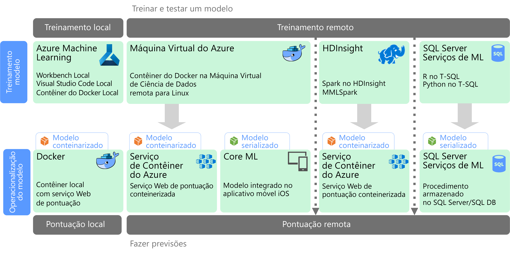

# Aprendizado de máquina em escalaMachine learning at scale

O ML (aprendizado de máquina) é uma técnica usada para treinar modelos preditivos com base em algoritmos matemáticos.Machine learning (ML) is a technique used to train predictive models based on mathematical algorithms. O aprendizado de máquina analisa as relações entre os campos de dados para prever valores desconhecidos.Machine learning analyzes the relationships between data fields to predict unknown values.

A criação e implantação de um modelo de aprendizado de máquina é um processo iterativo:Creating and deploying a machine learning model is an iterative process:

- Os cientistas de dados exploram os dados de origem para determinar as relações entre os *recursos* e os *rótulos* previstos.Data scientists explore the source data to determine relationships between *features* and predicted *labels*.
- Os cientistas de dados treinam e validam modelos com base em algoritmos apropriados para encontrar o modelo ideal para previsão.The data scientists train and validate models based on appropriate algorithms to find the optimal model for prediction.
- O modelo ideal é implantado em produção, como um serviço Web ou outra função encapsulada.The optimal model is deployed into production, as a web service or some other encapsulated function.
- Conforme novos dados são coletados, o modelo é periodicamente retreinado para melhorar sua eficácia.As new data is collected, the model is periodically retrained to improve its effectiveness.

O aprendizado de máquina em escala aborda dois interesses de escalabilidade diferentes.Machine learning at scale addresses two different scalability concerns. O primeiro é o treinamento de um modelo em conjuntos grandes de dados que exigem funcionalidades de expansão de um cluster a ser treinado.The first is training a model against large data sets that require the scale-out capabilities of a cluster to train. O segundo concentra-se na operacionalização do modelo aprendido de forma que ele possa ser dimensionado para atender às demandas dos aplicativos que o consomem.The second centers is operationalizating the learned model in a way that can scale to meet the demands of the applications that consume it. Normalmente, isso é feito pela implantação das funcionalidades preditivas como um serviço Web que podem então ser expandidas.Typically this is accomplished by deploying the predictive capabilities as a web service that can then be scaled out.

O aprendizado de máquina em escala traz o benefício de geração de funcionalidades preditivas avançadas, porque modelos melhores normalmente resultam de mais dados.Machine learning at scale has the benefit that it can produce powerful, predictive capabilities because better models typically result from more data. Depois que um modelo é treinado, ele pode ser implantado como um serviço Web de expansão sem monitoração de estado e de alto desempenho.Once a model is trained, it can be deployed as a stateless, highly-performant, scale-out web service.

## Preparação de modelo e treinamentoModel preparation and training

Durante a fase de preparação de modelo e treinamento, os cientistas de dados exploram os dados de maneira interativa usando linguagens como o Python e o R para:During the model preparation and training phase, data scientists explore the data interactively using languages like Python and R to:

- Extrair amostras de armazenamentos de dados de alto volume.Extract samples from high volume data stores.
- Localizar e tratar exceções, duplicatas e valores ausentes para limpar os dados.Find and treat outliers, duplicates, and missing values to clean the data.
- Determinar correlações e relações nos dados por meio de análise estatística e visualização.Determine correlations and relationships in the data through statistical analysis and visualization.
- Gerar novos recursos calculados que melhoram a previsibilidade de relações estatísticas.Generate new calculated features that improve the predictiveness of statistical relationships.
- Treinar os modelos de ML com base em algoritmos preditivos.Train ML models based on predictive algorithms.
- Validar os modelos treinados usando dados que foram retidos durante o treinamento.Validate trained models using data that was withheld during training.

Para dar suporte a essa fase interativa de análise e modelagem, a plataforma de dados precisa permitir aos cientistas de dados explorar os dados usando uma variedade de ferramentas.To support this interactive analysis and modeling phase, the data platform must enable data scientists to explore data using a variety of tools. Além disso, o treinamento de um modelo de aprendizado de máquina complexo pode exigir uma grande quantidade de processamento intensivo de amplos volumes de dados; portanto, é essencial ter recursos suficientes para a expansão do treinamento do modelo.Additionally, the training of a complex machine learning model can require a lot of intensive processing of high volumes of data, so sufficient resources for scaling out the model training is essential.

## Implantação e consumo de modeloModel deployment and consumption

Quando um modelo está pronto para ser implantado, ele pode ser encapsulado como um serviço Web e implantado na nuvem, em um dispositivo de borda ou em um ambiente empresarial de execução do ML.When a model is ready to be deployed, it can be encapsulated as a web service and deployed in the cloud, to an edge device, or within an enterprise ML execution environment. Esse processo de implantação é conhecido como operacionalização.This deployment process is referred to as operationalization.

## DesafiosChallenges

O aprendizado de máquina em escala apresenta alguns desafios:Machine learning at scale produces a few challenges:

- Normalmente, você precisa de muitos dados para treinar um modelo, especialmente para modelos de aprendizado profundo.You typically need a lot of data to train a model, especially for deep learning models.
- Você precisa preparar esses conjuntos de Big Data antes mesmo de começar a treinar o modelo.You need to prepare these big data sets before you can even begin training your model.
- A fase de treinamento de modelo precisa acessar os armazenamentos de Big Data.The model training phase must access the big data stores. É comum realizar o treinamento de modelo usando o mesmo cluster de Big Data, como o Spark, que é usado para preparação de dados.It's common to perform the model training using the same big data cluster, such as Spark, that is used for data preparation.
- Para cenários como aprendizado profundo, você precisará não apenas de um cluster que possa fornecer a expansão em CPUs, mas o cluster também precisará consistir em nós habilitados para GPU.For scenarios such as deep learning, not only will you need a cluster that can provide you scale out on CPUs, but your cluster will need to consist of GPU-enabled nodes.

## Aprendizado de máquina em escala no AzureMachine learning at scale in Azure

Antes de decidir quais serviços de ML serão usados em treinamento e operacionalização, considere se você precisa mesmo treinar um modelo ou se um modelo predefinido pode atender às suas necessidades.Before deciding which ML services to use in training and operationalization, consider whether you need to train a model at all, or if a prebuilt model can meet your requirements. Em muitos casos, o uso de um modelo predefinido é apenas uma questão de chamar um serviço Web ou usar uma biblioteca de ML para carregar um modelo existente.In many cases, using a prebuilt model is just a matter of calling a web service or using an ML library to load an existing model. Algumas opções incluem:Some options include:

- Usar os serviços Web fornecidos pelos Serviços Cognitivos da Microsoft.Use the web services provided by Microsoft Cognitive Services.
- Usar os modelos de rede neural pré-treinados fornecidos pelo Cognitive Toolkit.Use the pretrained neural network models provided by Cognitive Toolkit.
- Inserir os modelos serializados fornecidos pelo Core ML para aplicativos iOS.Embed the serialized models provided by Core ML for an iOS apps.

Se um modelo predefinido não se ajusta aos seus dados ou ao seu cenário, outras opções no Azure incluem o Azure Machine Learning, HDInsight com Spark MLlib e MMLSpark, Azure Databricks, Cognitive Toolkit e SQL Machine Learning Services.If a prebuilt model does not fit your data or your scenario, options in Azure include Azure Machine Learning, HDInsight with Spark MLlib and MMLSpark, Azure Databricks, Cognitive Toolkit, and SQL Machine Learning Services. Se você decidir usar um modelo personalizado, precisará criar um pipeline que inclui o treinamento e a operacionalização do modelo.If you decide to use a custom model, you must design a pipeline that includes model training and operationalization.

Para obter uma lista das opções de tecnologia de ML no Azure, consulte os seguintes tópicos:For a list of technology choices for ML in Azure, see the following topics:

- [Escolhendo uma tecnologia de serviços cognitivosChoosing a cognitive services technology](../technology-choices/cognitive-services.md)
- [Escolhendo uma tecnologia de aprendizado de máquinaChoosing a machine learning technology](../technology-choices/data-science-and-machine-learning.md)
- [Escolhendo uma tecnologia de processamento de idioma naturalChoosing a natural language processing technology](../technology-choices/natural-language-processing.md)

## Próximas etapasNext steps

As seguintes arquiteturas de referência mostram cenários de aprendizado de máquina no Azure:The following reference architectures show machine learning scenarios in Azure:

- [Pontuação em lote para modelos de aprendizado profundo do AzureBatch scoring on Azure for deep learning models](../../reference-architectures/ai/batch-scoring-deep-learning.md)
- [Pontuação em tempo real de Python Scikit-Learn e modelos de aprendizado profundo (deep learning) no AzureReal-time scoring of Python Scikit-Learn and Deep Learning Models on Azure](../../reference-architectures/ai/realtime-scoring-python.md)