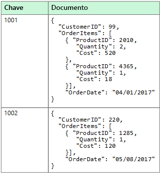
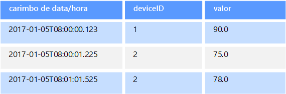
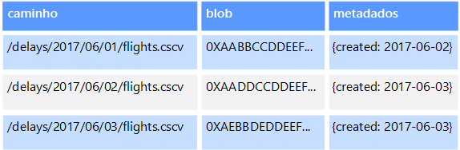
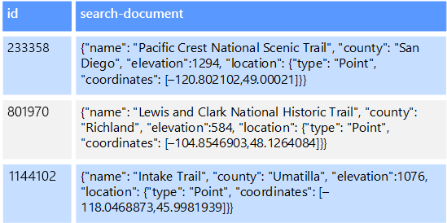

# Dados não relacionais e NoSQLNon-relational data and NoSQL

Um *banco de dados não relacional* é um banco de dados que não usa o esquema de tabela de linhas e colunas encontrado na maioria dos sistemas de banco de dados tradicionais.A *non-relational database* is a database that does not use the tabular schema of rows and columns found in most traditional database systems. Em vez disso, os bancos de dados não relacionais usam um modelo de armazenamento otimizado para os requisitos específicos do tipo de dados que está sendo armazenado.Instead, non-relational databases use a storage model that is optimized for the specific requirements of the type of data being stored. Por exemplo, os dados podem ser armazenados como pares chave/valor simples, como documentos JSON ou como um gráfico que consiste em bordas e vértices.For example, data may be stored as simple key/value pairs, as JSON documents, or as a graph consisting of edges and vertices. 

O que esses armazenamentos de dados têm em comum é que eles não usam um [modelo relacional](../relational-data/index.md).What all of these data stores have in common is that they don't use a [relational model](../relational-data/index.md). Além disso, eles tendem a ser mais específicos no tipo de dados ao qual dão suporte e no modo como os dados podem ser consultados.Also, they tend to be more specific in the type of data they support and how data can be queried. Por exemplo, os armazenamento de dados de série temporal são otimizados para consultas de sequências de dados baseadas em tempo, enquanto os armazenamentos de dados de gráficos são otimizados para exploração de relações ponderadas entre entidades.For example, time series data stores are optimized for queries over time-based sequences of data, while graph data stores are optimized for exploring weighted relationships between entities. Nenhum dos dois formatos será bem generalizado para a tarefa de gerenciamento de dados transacionais.Neither format would generalize well to the task of managing transactional data. 

O termo *NoSQL* refere-se a armazenamentos de dados que não usam o SQL para consultas, mas usam outras linguagens de programação e constructos para consultar os dados.The term *NoSQL* refers to data stores that do not use SQL for queries, and instead use other programming languages and constructs to query the data. Na prática, "NoSQL" significa "banco de dados não relacionais", mesmo que muitos desses bancos de dados deem suporte a consultas compatíveis com SQL.In practice, "NoSQL" means "non-relational database," even though many of these databases do support SQL-compatible queries. No entanto, a estratégia de execução de consulta subjacente é geralmente muito diferente da maneira como um RDBMS tradicional executa a mesma consulta SQL.However, the underlying query execution strategy is usually very different from the way a traditional RDBMS would execute the same SQL query.

As seções a seguir descrevem as principais categorias de banco de dados não relacional ou NoSQL.The following sections describe the major categories of non-relational or NoSQL database.

## Armazenamentos de dados de documentosDocument data stores
Um armazenamento de dados de documentos gerencia um conjunto de campos de cadeia de caracteres nomeadas e valores de dados de objeto em uma entidade conhecida como um *documento*.A document data store manages a set of named string fields and object data values in an entity referred to as a *document*. Normalmente, esses repositórios de dados armazenam dados na forma de documentos JSON.These data stores typically store data in the form of JSON documents. Cada valor de campo pode ser um item escalar, como um número ou um elemento composto, como uma lista ou uma coleção de pai-filho.Each field value could be a scalar item, such as a number, or a compound element, such as a list or a parent-child collection. Os dados nos campos de um documento podem ser codificados de várias maneiras, incluindo XML, YAML, JSON, BSON ou até mesmo armazenados como texto sem formatação.The data in the fields of a document can be encoded in a variety of ways, including XML, YAML, JSON, BSON, or even stored as plain text. Os campos nos documentos são expostos ao sistema de gerenciamento de armazenamento, permitindo que um aplicativo consulte e filtre dados utilizando os valores nesses campos.The fields within documents are exposed to the storage management system, enabling an application to query and filter data by using the values in these fields.  

Normalmente, um documento contém todos os dados de uma entidade.Typically, a document contains the entire data for an entity. Quais itens constituem uma entidade são específicos de aplicativos.What items constitute an entity are application specific. Por exemplo, uma entidade pode conter os detalhes de um cliente, uma ordem ou uma combinação de ambos.For example, an entity could contain the details of a customer, an order, or a combination of both. Um único documento pode conter informações que serão distribuídas em várias tabelas relacionais em um RDBMS.A single document might contain information that would be spread across several relational tables in a relational database management system (RDBMS). Um armazenamento de documentos não exige que todos os documentos tenham a mesma estrutura.A document store does not require that all documents have the same structure. Essa abordagem de forma livre oferece uma grande flexibilidade.This free-form approach provides a great deal of flexibility. Por exemplo, os aplicativos podem armazenar dados diferentes em documentos, em resposta a uma alteração nos requisitos de negócios.For example, applications can store different data in documents in response to a change in business requirements.  

  

O aplicativo pode recuperar documentos utilizando a chave de documento.The application can retrieve documents by using the document key. Esse é um identificador exclusivo para o documento, que frequentemente é com hash, para ajudar a distribuir os dados de forma uniforme.This is a unique identifier for the document, which is often hashed, to help distribute data evenly. Alguns bancos de dados de documentos criam a chave de documento automaticamente.Some document databases create the document key automatically. Outros permitem que você especifique um atributo do documento a ser usado como a chave.Others enable you to specify an attribute of the document to use as the key. O aplicativo também pode consultar documentos baseado no valor de um ou mais campos.The application can also query documents based on the value of one or more fields. Alguns bancos de dados de documentos fornecem suporte para indexação, de modo a facilitar a pesquisa rápida de documentos com base em um ou mais campos indexados.Some document databases support indexing to facilitate fast lookup of documents based on one or more indexed fields.  

Muitos bancos de dados de documentos fornecem suporte a atualizações in loco, permitindo que um aplicativo modifique os valores de campos específicos em um documento sem regravar o documento inteiro.Many document databases support in-place updates, enabling an application to modify the values of specific fields in a document without rewriting the entire document. As operações de leitura e gravação em vários campos em um único documento geralmente são atômicas.Read and write operations over multiple fields in a single document are usually atomic.

Serviço do Azure relevante:Relevant Azure service:  

- [Azure Cosmos DBAzure Cosmos DB](https://azure.microsoft.com/services/cosmos-db/)

## Armazenamentos de dados de colunasColumnar data stores
Um armazenamento de dados de colunas ou de família de colunas organiza os dados em colunas e linhas.A columnar or column-family data store organizes data into columns and rows. Em sua forma mais simples, um armazenamento de dados de família de colunas pode parecer muito semelhante a um banco de dados relacional, pelo menos conceitualmente.In its simplest form, a column-family data store can appear very similar to a relational database, at least conceptually. O poder real de um banco de dados de família de colunas está em sua abordagem desnormalizada para a estruturação de dados esparsos, que deriva da abordagem orientada por coluna para armazenar dados.The real power of a column-family database lies in its denormalized approach to structuring sparse data, which stems from the column-oriented approach to storing data.  

É possível pensar em um armazenamento de dados de família de colunas como contendo dados de tabela com linhas e colunas, mas as colunas são divididas em grupos conhecidos como famílias de colunas.You can think of a column-family data store as holding tabular data with rows and columns, but the columns are divided into groups known as column families. Cada família de colunas contém um conjunto de colunas que estão logicamente relacionadas e geralmente são recuperadas ou manipuladas como uma unidade.Each column family holds a set of columns that are logically related and are typically retrieved or manipulated as a unit. Outros dados acessados separadamente podem ser armazenados em famílias de colunas separadas.Other data that is accessed separately can be stored in separate column families. Dentro de uma família de colunas, novas colunas podem ser adicionadas dinamicamente e as linhas podem ser esparsas (ou seja, uma linha não precisa ter um valor para cada coluna).Within a column family, new columns can be added dynamically, and rows can be sparse (that is, a row doesn't need to have a value for every column). 

O diagrama a seguir mostra um exemplo com duas famílias de colunas, `Identity` e `Contact Info`.The following diagram shows an example with two column families, `Identity` and `Contact Info`. Os dados de uma única entidade têm a mesma chave de linha em cada família de colunas.The data for a single entity has the same row key in each column family. Essa estrutura, em que as linhas de determinado objeto em uma família de colunas podem variar dinamicamente, é um benefício importante da abordagem de família de colunas, que torna essa forma de armazenamento de dados altamente adequada para armazenar dados com esquemas variados.This structure, where the rows for any given object in a column family can vary dynamically, is an important benefit of the column-family approach, making this form of data store highly suited for storing data with varying schemas.

Ao contrário de um repositório de valor/chave ou um banco de dados de documentos, a maioria dos bancos de dados de família de colunas armazenam dados fisicamente em ordem de chave, em vez de computar um hash.Unlike a key/value store or a document database, most column-family databases physically store data in key order, rather than by computing a hash. A chave de linha é considerada o índice primário e permite o acesso baseado em chave por meio de uma chave específica ou um intervalo de chaves.The row key is considered the primary index and enables key-based access via a specific key or a range of keys. Algumas implementações permitem que você crie índices secundários em colunas específicas de uma família de colunas.Some implementations allow you to create secondary indexes over specific columns in a column family. Os índices secundários permitem recuperar dados por valor de colunas, em vez da chave de linha.Secondary indexes let you retrieve data by columns value, rather than row key.

Em disco, todas as colunas em uma família de colunas são armazenadas juntas no mesmo arquivo, com determinado número de linhas em cada arquivo.On disk, all of the columns within a column family are stored together in the same file, with a certain number of rows in each file. Com conjuntos de dados grandes, esse método cria um benefício de desempenho, reduzindo a quantidade de dados que precisam ser lidos do disco quando apenas algumas colunas são consultadas juntas por vez.With large data sets, this approach creates a performance benefit by reducing the amount of data that needs to be read from disk when only a few columns are queried together at a time. 

As operações de leitura e gravação de uma linha geralmente são atômicas em uma única família de colunas, embora algumas implementações forneçam atomicidade em toda a linha, abrangendo várias famílias de colunas.Read and write operations for a row are usually atomic within a single column family, although some implementations provide atomicity across the entire row, spanning multiple column families.

Serviço do Azure relevante:Relevant Azure service:  

- [HBase no HDInsightHBase in HDInsight](/azure/hdinsight/hdinsight-hbase-overview)

## Armazenamentos de dados de chave/valorKey/value data stores
Um armazenamento de valor/chave é essencialmente uma tabela de hash grande.A key/value store is essentially a large hash table. Você associa cada valor de dados a uma chave exclusiva e o armazenamento de valor/chave usa essa chave para armazenar os dados, utilizando uma função de hash apropriada.You associate each data value with a unique key, and the key/value store uses this key to store the data by using an appropriate hashing function. A função de hash é selecionada para fornecer uma distribuição uniforme de chaves de hash em todo o armazenamento de dados.The hashing function is selected to provide an even distribution of hashed keys across the data storage.

A maioria dos armazenamentos de valor/chave fornecem suporte apenas às operações de exclusão, inserção e consulta simples.Most key/value stores only support simple query, insert, and delete operations. Para modificar um valor (parcial ou completamente), um aplicativo deverá substituir os dados existentes para todo o valor.To modify a value (either partially or completely), an application must overwrite the existing data for the entire value. Na maioria das implementações, a leitura ou gravação de um único valor é uma operação atômica.In most implementations, reading or writing a single value is an atomic operation. Se o valor for grande, a gravação poderá demorar algum tempo.If the value is large, writing may take some time.

Um aplicativo pode armazenar dados arbitrários como um conjunto de valores, embora alguns armazenamentos de valor/chave imponham limites ao tamanho máximo de valores.An application can store arbitrary data as a set of values, although some key/value stores impose limits on the maximum size of values. Os valores armazenados são opacos para o software do sistema de armazenamento.The stored values are opaque to the storage system software. Quaisquer informações de esquema deverão ser fornecidas e interpretadas pelo aplicativo.Any schema information must be provided and interpreted by the application. Essencialmente, os valores são blobs e o armazenamento de valor/chave simplesmente recupera ou armazena o valor por chave.Essentially, values are blobs and the key/value store simply retrieves or stores the value by key.

Armazenamentos de chave/valor são altamente otimizados para aplicativos que realizam pesquisas simples usando o valor da chave ou por um intervalo de chaves, mas são menos adequados para sistemas que precisam consultar dados em tabelas diferentes de chaves/valores, como a união de dados em várias tabelas.Key/value stores are highly optimized for applications performing simple lookups using the value of the key, or by a range of keys, but are less suitable for systems that need to query data across different tables of keys/values, such as joining data across multiple tables. 

Os armazenamentos de chave/valor também não são otimizados para cenários em que a consulta ou a filtragem por valores não chave é importante, em vez de realizar pesquisas baseadas somente em chaves.Key/value stores are also not optimized for scenarios where querying or filtering by non-key values is important, rather than performing lookups based only on keys. Por exemplo, com um banco de dados relacional, você pode encontrar um registro usando uma cláusula WHERE para filtrar as colunas não chave, mas armazenamentos de chave/valores geralmente não têm esse tipo de funcionalidade de pesquisa de valores, ou se têm, isso necessita de um exame lento de todos os valores.For example, with a relational database, you can find a record by using a WHERE clause to filter the non-key columns, but key/values stores usually do not have this type of lookup capability for values, or if they do it requires a slow scan of all values.

Um armazenamento de valor/chave pode ser extremamente escalável, pois o armazenamento de dados pode facilmente distribuir dados em vários nós em computadores separadas.A single key/value store can be extremely scalable, as the data store can easily distribute data across multiple nodes on separate machines.

Serviços do Azure relevantes:Relevant Azure services:  
- [API de Tabela do Azure Cosmos DBAzure Cosmos DB Table API](/azure/cosmos-db/table-introduction)  
- [Cache Redis do AzureAzure Redis Cache](https://azure.microsoft.com/services/cache/)  
- [Armazenamento de Tabelas do AzureAzure Table Storage](https://azure.microsoft.com/services/storage/tables/)

## Armazenamentos de dados de gráficosGraph data stores
Um armazenamento de dados de gráficos armazena dois tipos de informações: nós e bordas.A graph data store manages two types of information, nodes and edges. Nós representam entidades e bordas especificam as relações entre essas entidades.Nodes represent entities, and edges specify the relationships between these entities. Ambos os nós e as bordas podem ter propriedades que fornecem informações sobre esse nó ou borda, semelhante às colunas em uma tabela.Both nodes and edges can have properties that provide information about that node or edge, similar to columns in a table. As bordas também podem ter uma direção indicando a natureza do relacionamento.Edges can also have a direction indicating the nature of the relationship.  

O objetivo de um armazenamento de dados de gráficos é permitir que um aplicativo execute com eficácia consultas que atravessam a rede de nós e bordas e analise as relações entre entidades.The purpose of a graph data store is to allow an application to efficiently perform queries that traverse the network of nodes and edges, and to analyze the relationships between entities. O diagrama a seguir mostra os dados de pessoal de uma organização estruturados como um gráfico.The following diagram shows an organization's personnel data structured as a graph. As entidades são funcionários e departamentos, e as bordas indicam os relacionamentos de relatórios e o departamento em que os funcionários trabalham.The entities are employees and departments, and the edges indicate reporting relationships and the department in which employees work. Neste gráfico, as setas nas bordas mostram a direção das relações.In this graph, the arrows on the edges show the direction of the relationships.

Essa estrutura facilita a realização de consultas como "Localizar todos os funcionários que se reportam direta ou indiretamente à Sarah" ou "Quem trabalha no mesmo departamento que John?"This structure makes it straightforward to perform queries such as "Find all employees who report directly or indirectly to Sarah" or "Who works in the same department as John?" Para gráficos grandes com muitas entidades e relacionamentos, você pode realizar análises muito complexas muito rapidamente.For large graphs with lots of entities and relationships, you can perform very complex analyses very quickly. Muitos bancos de dados de gráficos fornecem uma linguagem de consulta que você pode utilizar para percorrer uma rede de relacionamentos de forma eficiente.Many graph databases provide a query language that you can use to traverse a network of relationships efficiently.  

Serviço do Azure relevante:Relevant Azure service:  
- [API do Graph do Azure Cosmos DBAzure Cosmos DB Graph API](/azure/cosmos-db/graph-introduction)  

## Armazenamentos de dados de série temporalTime series data stores
Os dados de série temporal são um conjunto de valores organizados por tempo e um armazenamento de dados de série temporal é otimizado para esse tipo de dados.Time series data is a set of values organized by time, and a time series data store is optimized for this type of data. Os armazenamentos de dados de série temporal precisam dar suporte a um número muito alto de gravações, pois geralmente coletam grandes quantidades de dados em tempo real de uma grande variedade de fontes.Time series data stores must support a very high number of writes, as they typically collect large amounts of data in real time from a large number of sources. Os armazenamentos de dados de série temporal são otimizados para armazenar dados telemétricos.Time series data stores are optimized for storing telemetry data. Os cenários incluem sensores de IoT ou contadores de sistemas/aplicativos.Scenarios include IoT sensors or application/system counters. As atualizações são raras e as exclusões geralmente são feitas como operações em massa.Updates are rare, and deletes are often done as bulk operations.

Embora os registros gravados em um banco de dados de série temporal sejam geralmente pequenos, muitas vezes, há um grande número de registros e o tamanho total dos dados pode aumentar rapidamente.Although the records written to a time series database are generally small, there are often a large number of records, and total data size can grow rapidly. Os armazenamentos de dados de série temporal também manipulam dados fora de ordem e de chegada tardia, a indexação automática de pontos de dados e otimizações de consultas descritas em termos de janelas de tempo.Time series data stores also handle out-of-order and late-arriving data, automatic indexing of data points, and optimizations for queries described in terms of windows of time. Esse último recurso permite a execução de consultas em milhões de pontos de dados e em vários fluxos de dados com rapidez, para dar suporte a visualizações de série temporal, que é uma maneira comum pela qual os dados de séries temporal são consumidos.This last feature enables queries to run across millions of data points and multiple data streams quickly, in order to support time series visualizations, which is a common way that time series data is consumed. 

Para obter mais informações, consulte [Soluções de série temporal](../scenarios/time-series.md)For more information, see [Time series solutions](../scenarios/time-series.md)

Serviço do Azure relevante:Relevant Azure service:  
- [Azure Time Series InsightsAzure Time Series Insights](https://azure.microsoft.com/services/time-series-insights/)  
- [OpenTSDB com HBase no HDInsightOpenTSDB with HBase on HDInsight](/azure/hdinsight/hdinsight-hbase-overview)

## Armazenamentos de dados de objetosObject data stores
Os armazenamentos de dados de objetos são otimizados para armazenar e recuperar grandes objetos binários ou blobs como imagens, arquivos de texto, fluxos de áudio e vídeo, grandes documentos e objetos de dados de aplicativos e imagens de disco de máquina virtual.Object data stores are optimized for storing and retrieving large binary objects or blobs such as images, text files, video and audio streams, large application data objects and documents, and virtual machine disk images. Um objeto consiste nos dados armazenados, em alguns metadados e uma ID exclusiva para acessar o objeto.An object consists of the stored data, some metadata, and a unique ID for accessing the object. Os armazenamentos de objetos foram projetados para dar suporte a arquivos que são individualmente muito grandes, além de fornecer grandes quantidades de armazenamento total para gerenciar todos os arquivos.Object stores are designed to support files that are individually very large, as well provide large amounts of total storage to manage all files.  

Alguns armazenamentos de dados de objetos replicam determinado blob em vários nós de servidor, o que permite rápidas leituras paralelas.Some object data stores replicate a given blob across multiple server nodes, which enables fast parallel reads. Por sua vez, isso permite a consulta de expansão dos dados contidos em arquivos grandes, porque vários processos, normalmente em execução em servidores diferentes e cada um pode consultar o arquivo grande de dados simultaneamente.This in turn enables the scale-out querying of data contained in large files, because multiple processes, typically running on different servers, can each query the large data file simultaneously.

Um caso especial de armazenamentos de dados de objetos é o compartilhamento de arquivos de rede.One special case of object data stores is the network file share. O uso de compartilhamentos de arquivos permite que os arquivos sejam acessados em uma rede usando protocolos de rede padrão como o protocolo SMB.Using file shares enables files to be accessed across a network using standard networking protocols like server message block (SMB). Considerando mecanismos apropriados de segurança e controle de acesso simultâneo, o compartilhamento de dados dessa forma pode permitir que serviços distribuídos forneçam acesso a dados altamente escalonável para operações básicas de baixo nível, como solicitações de leitura e gravação simples.Given appropriate security and concurrent access control mechanisms, sharing data in this way can enable distributed services to provide highly scalable data access for basic, low level operations such as simple read and write requests.

Serviço do Azure relevante:Relevant Azure service:   

- [Armazenamento de Blobs do AzureAzure Blob Storage](https://azure.microsoft.com/services/storage/blobs/)  
- [Repositório Azure Data LakeAzure Data Lake Store](https://azure.microsoft.com/services/data-lake-store/)  
- [Armazenamento de Arquivos do AzureAzure File Storage](https://azure.microsoft.com/services/storage/files/)  

## Armazenamentos de dados de índice externoExternal index data stores

Os armazenamentos de dados de índice externo fornecem a capacidade de pesquisar informações mantidas em outros armazenamentos de dados e serviços.External index data stores provide the ability to search for information held in other data stores and services. Um índice externo atua como um índice secundário para qualquer armazenamento de dados e pode ser usado para indexar grandes volumes de dados e fornecer acesso quase em tempo real a esses índices.An external index acts as a secondary index for any data store, and can be used to index massive volumes of data and provide near real-time access to these indexes. 

Por exemplo, talvez você tenha arquivos de texto armazenados em um sistema de arquivos.For example, you might have text files stored in a file system. Encontrar um arquivo por seu arquivo de caminho é rápido, mas pesquisar com base no conteúdo do arquivo exige um exame de todos os arquivos, o que é lento.Finding a file by its file path is quick, but searching based on the contents of the file would require a scan of all of the files, which is slow. Um índice externo permite criar índices de pesquisa secundária e, em seguida, localizar rapidamente o caminho para os arquivos que correspondem aos critérios.An external index lets you create secondary search indexes and then quickly find the path to the files that match your criteria. Outro aplicativo de exemplo de um índice externo são armazenamentos de chave/valor que somente indexam pela chave.Another example application of an external index is with key/value stores that only index by the key. Você pode criar um índice secundário com base nos valores dos dados e pesquisar rapidamente a chave que identifica exclusivamente cada item correspondente.You can build a secondary index based on the values in the data, and quickly look up the key that uniquely identifies each matched item. 

Os índices são criados pela execução de um processo de indexação.The indexes are created by running an indexing process. Isso pode ser feito usando um modelo de pull, disparado pelo armazenamento de dados ou usando um modelo de push, iniciado pelo código do aplicativo.This can be performed using a pull model, triggered by the data store, or using a push model, initiated by application code. Os índices podem ser multidimensionais e dar suporte a pesquisas de texto livre em grandes volumes de dados de texto.Indexes can be multidimensional and may support free-text searches across large volumes of text data. 

Os armazenamentos de dados de índice externo costumam ser usados para dar suporte às pesquisas de texto completo e baseada na Web.External index data stores are often used to support full text and web based search. Nesses casos, a pesquisa pode ser exata ou difusa.In these cases, searching can be exact or fuzzy. Uma pesquisa difusa localiza documentos que correspondem um conjunto de termos e calcula a forma como eles correspondem.A fuzzy search finds documents that match a set of terms and calculates how closely they match. Alguns índices externos também dão suporte à análise linguística que pode retornar correspondências com base em sinônimos, expansões de gênero (por exemplo, correspondência de "cachorros" com "animais de estimação") e lematização (por exemplo, a pesquisa de "correr" também corresponde a "correu" e "correndo").Some external indexes also support linguistic analysis that can return matches based on synonyms, genre expansions (for example, matching "dogs" to "pets"), and stemming (for example, searching for "run" also matches "ran" and "running"). 

Serviço do Azure relevante:Relevant Azure service:  

- [Azure SearchAzure Search](https://azure.microsoft.com/services/search/)

## Requisitos típicosTypical requirements
Armazenamentos de dados não relacionais costumam usar uma arquitetura de armazenamento diferente da usada pelos bancos de dados relacionais.Non-relational data stores often use a different storage architecture from that used by relational databases. Especificamente, eles costumam não ter nenhum esquema fixo.Specifically, they tend towards having no fixed schema. Além disso, eles tendem a não dar suporte a transações ou restringir o escopo das transações e geralmente não incluem índices secundários por motivos de escalabilidade.Also, they tend not to support transactions, or else restrict the scope of transactions, and they generally don't include secondary indexes for scalability reasons.

Veja a seguir uma comparação dos requisitos de cada um dos armazenamentos de dados não relacionais:The following compares the requirements for each of the non-relational data stores:

| RequisitoRequirement | Dados de documentosDocument data | Dados de família de colunasColumn-family data | Dados de chave/valorKey/value data | Dados de gráficosGraph data | 
| --- | --- | --- | --- | --- | 
| NormalizaçãoNormalization | DesnormalizadoDenormalized | DesnormalizadoDenormalized | DesnormalizadoDenormalized | NormalizadoNormalized | 
| EsquemaSchema | Esquema na leituraSchema on read | Famílias de colunas definidas na gravação, esquema de coluna na leituraColumn families defined on write, column schema on read | Esquema na leituraSchema on read | Esquema na leituraSchema on read | 
| Consistência (entre transações simultâneas)Consistency (across concurrent transactions) | Consistência ajustável, garantias no nível do documentoTunable consistency, document-level guarantees | Garantias no nível da família de colunasColumn-family&ndash;level guarantees | Garantias no nível da chaveKey-level guarantees | Garantias no nível do gráficoGraph-level guarantees 
| Atomicidade (escopo de transação)Atomicity (transaction scope) | ColeçãoCollection | TabelaTable | TabelaTable | GrafoGraph | 
| Estratégia de BloqueioLocking Strategy | Otimista (livre de bloqueio)Optimistic (lock free) | Pessimista (bloqueios de linha)Pessimistic (row locks) | Otimista (Etag)Optimistic (ETag) | 
| Padrão de acessoAccess pattern | Acesso aleatórioRandom access | Agregações em dados altos/largosAggregates on tall/wide data | Acesso aleatórioRandom access | Acesso aleatórioRandom access |
| IndexaçãoIndexing | Índices primários e secundáriosPrimary and secondary indexes | Índices primários e secundáriosPrimary and secondary indexes | Somente índice primárioPrimary index only | Índices primários e secundáriosPrimary and secondary indexes | 
| Forma dos dadosData shape | DocumentoDocument | Tabela com famílias de colunas que contém colunasTabular with column families containing columns | Chave e valorKey and value | Gráfico que contém bordas e vérticesGraph containing edges and vertices | 
| EsparsosSparse | simYes | simYes | simYes | Não No | 
| Largo (grande quantidade de colunas/atributos)Wide (lots of columns/attributes) | simYes | simYes | NãoNo | Não No |  
| Tamanho do dadoDatum size | Pequeno (KBs) a médio (alguns MBs)Small (KBs) to medium (low MBs) | Médio (MBs) a grande (alguns GBs)Medium (MBs) to Large (low GBs) | Pequeno (KBs)Small (KBs) | Pequeno (KBs)Small (KBs) | 
| Escala máxima geralOverall Maximum Scale | Muito grande (PBs)Very Large (PBs) | Muito grande (PBs)Very Large (PBs) | Muito grande (PBs)Very Large (PBs) | Grande (TB)Large (TBs) | 

| RequisitoRequirement | Dados de série temporalTime series data | Dados de objetosObject data | Dados de índice externoExternal index data |
| --- | --- | --- | --- |
| NormalizaçãoNormalization | NormalizadoNormalized | DesnormalizadoDenormalized | DesnormalizadoDenormalized |
| EsquemaSchema | Esquema na leituraSchema on read | Esquema na leituraSchema on read | Esquema na gravaçãoSchema on write | 
| Consistência (entre transações simultâneas)Consistency (across concurrent transactions) | N/DN/A | N/DN/A | N/DN/A | 
| Atomicidade (escopo de transação)Atomicity (transaction scope) | N/DN/A | ObjetoObject | N/DN/A |
| Estratégia de BloqueioLocking Strategy | N/DN/A | Pessimista (bloqueios de blobs)Pessimistic (blob locks) | N/DN/A |
| Padrão de acessoAccess pattern | Acesso aleatório e agregaçãoRandom access and aggregation | Acesso sequencialSequential access | Acesso aleatórioRandom access | 
| IndexaçãoIndexing | Índices primários e secundáriosPrimary and secondary indexes | Somente índice primárioPrimary index only | N/DN/A |
| Forma dos dadosData shape | TabularTabular | Blob e metadadosBlob and metadata | DocumentoDocument |
| EsparsosSparse | Não No | N/DN/A | Não No | 
| Largo (grande quantidade de colunas/atributos)Wide (lots of columns/attributes) |  Não No | simYes | simYes |  
| Tamanho do dadoDatum size | Pequeno (KBs)Small (KBs) | Grande (GBs) a muito grandes (TBs)Large (GBs) to Very Large (TBs) | Pequeno (KBs)Small (KBs) |
| Escala máxima geralOverall Maximum Scale | Grande (alguns TBs)Large (low TBs)  | Muito grande (PBs)Very Large (PBs) | Grande (alguns TBs)Large (low TBs) | 

