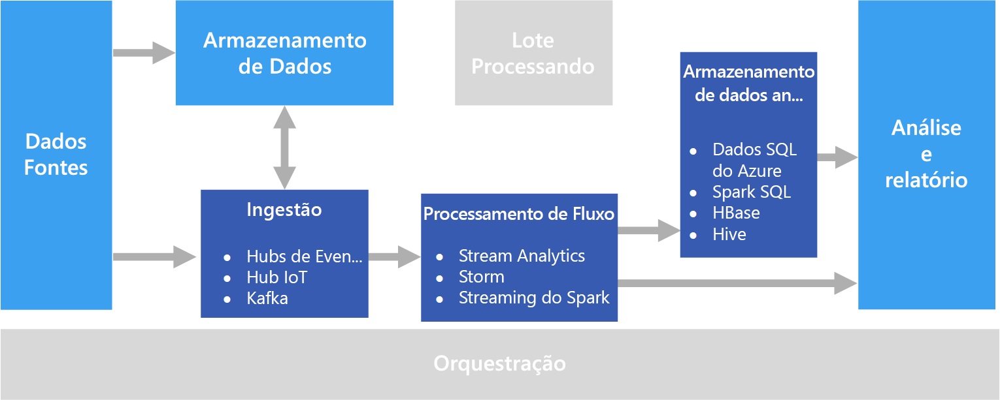

# Processamento em tempo real

O processamento em tempo real lida com fluxos de dados que são capturados em tempo real e processados com latência mínima para gerar relatórios em tempo real (ou quase em tempo real) ou respostas automatizadas. Por exemplo, uma solução de monitoramento de tráfego em tempo real pode usar dados de sensor para detectar grandes volumes de tráfego. Esses dados podem ser usados para atualizar um mapa dinamicamente para mostrar o congestionamento ou iniciar automaticamente faixas de ocupação alta ou outros sistemas de gerenciamento de tráfego.

O processamento em tempo real é definido como o processamento de fluxo não associado de dados de entrada, com requisitos de latência muito curta para o processamento &mdash; medido em milissegundos ou segundos. Normalmente, esses dados de entrada são recebidos em um formato não estruturado ou semiestruturado, como JSON, e têm os mesmos requisitos de processamento do [processamento em lotes](./batch-processing.md), mas com tempos de retorno mais curtos para dar suporte ao consumo em tempo real.

Os dados processados costumam ser gravados em um armazenamento de dados analíticos, otimizado para análise e visualização. Os dados processados também podem ser ingeridos diretamente na camada de análise e relatório para análise, business intelligence e visualização de painel em tempo real.

## Desafios

Um dos grandes desafios das soluções de processamento em tempo real é ingerir, processar e armazenar mensagens em tempo real, especialmente em grandes volumes. O processamento precisa ser feito de forma que não bloqueie o pipeline de ingestão. O armazenamento de dados precisa dar suporte a gravações de alto volume. Outro desafio é conseguir tomar decisões com base nos dados rapidamente, como a geração de alertas em tempo real ou apresentação dos dados em um painel em tempo real (ou quase em tempo real).

## Arquitetura

Uma arquitetura de processamento em tempo real contém os componentes lógicos a seguir.

- **Ingestão de mensagens em tempo real.** A arquitetura precisa incluir uma forma de capturar e armazenar mensagens em tempo real para serem consumidas por um consumidor de processamento de fluxo. Em casos simples, esse serviço pode ser implementado como um armazenamento de dados simples em que as novas mensagens são depositadas em uma pasta. Mas, em geral, a solução exige um agente de mensagens, como os Hubs de Eventos do Azure, que atua como um buffer para as mensagens. O agente de mensagens deve dar suporte ao processamento de expansão e à entrega confiável.

- **Processamento de fluxo.** Depois de capturar mensagens em tempo real, a solução precisa processá-las filtrando, agregando e preparando os dados para análise.

- **Armazenamento de dados analíticos.** Muitas soluções de Big Data foram projetadas para preparar dados para análise e então fornecer os dados processados em um formato estruturado que pode ser consultado com ferramentas analíticas. 

- **Análise e relatórios.** A meta da maioria das soluções de Big Data é gerar insights sobre os dados por meio de análise e relatórios. 

## Opções de tecnologia

As tecnologias a seguir são as opções recomendadas de soluções de processamento em tempo real do Azure.

### Ingestão de mensagens em tempo real

- **Hubs de Eventos do Azure**. Os Hubs de Eventos do Azure são uma solução de enfileiramento de mensagens para a ingestão de milhões de mensagens de eventos por segundo. Os dados de evento capturados podem ser processados por vários consumidores em paralelo.
- **Hub IoT do Azure**. O Hub IoT do Azure fornece comunicação bidirecional entre dispositivos conectados à Internet e uma fila de mensagens escalonável que pode manipular milhões de dispositivos conectados simultaneamente.
- **Apache Kafka**. O Kafka é um aplicativo de software livre de enfileiramento de mensagens e processamento de fluxo que pode ser dimensionado para manipular milhões de mensagens por segundo de vários produtores de mensagens e encaminhá-las para vários consumidores. O Kafka está disponível no Azure como um tipo de cluster HDInsight.

Para obter mais informações, consulte [Ingestão de mensagens em tempo real](../technology-choices/real-time-ingestion.md).

### Armazenamento de dados

- **Contêineres do Azure Storage Blob** ou **Azure Data Lake Store**. Os dados de entrada em tempo real normalmente são capturados em um agente de mensagens (veja acima), mas em alguns cenários, pode fazer sentido monitorar os novos arquivos de uma pasta e processá-los conforme eles são criados ou atualizados. Além disso, muitas soluções de processamento em tempo real combinam dados de streaming com os dados de referência estática, que podem ser armazenados em um repositório de arquivos. Por fim, o armazenamento de arquivos pode ser usado como um destino de saída para os dados capturados em tempo real para arquivamento ou para um processamento em lotes posterior em uma [arquitetura lambda](../big-data/index.md#lambda-architecture).

Para obter mais informações, consulte [Armazenamento de dados](../technology-choices/data-storage.md).

### Processamento de fluxo

- **Azure Stream Analytics**. O Azure Stream Analytics pode executar consultas perpétuas em um fluxo não associado de dados. Essas consultas consomem fluxos de dados de um armazenamento ou agentes de mensagens, filtram e agregam os dados com base em janelas temporais e gravam os resultados em coletores como armazenamento, bancos de dados ou diretamente em relatórios no Power BI.
- **Storm**. O Apache Storm é uma estrutura de software livre para processamento de fluxo que usa uma topologia de spouts e bolts para consumir, processar e gerar os resultados de fontes de dados de streaming em tempo real. Provisione o Storm em um cluster Azure HDInsight e implemente uma topologia em Java ou C#.
- **Spark Streaming**. O Apache Spark é uma plataforma distribuída de software livre para processamento geral de dados. O Spark fornece a API do Spark Streaming, na qual você pode escrever um código em qualquer linguagem Spark compatível, incluindo Java, Scala e Python. O Spark 2.0 introduziu a API de Streaming Estruturado do Spark, que fornece um modelo de programação simples e mais consistente. O Spark 2.0 está disponível em um cluster Azure HDInsight.

Para obter mais informações, consulte [Processamento de fluxo](../technology-choices/stream-processing.md).

### Armazenamento de dados analíticos

- **SQL Data Warehouse**, **HBase**, **Spark** ou **Hive**. Os dados processados em tempo real podem ser armazenados em um banco de dados relacional como o SQL Data Warehouse do Azure, um repositório NoSQL, como o HBase, ou como arquivos em um armazenamento distribuído no qual as tabelas do Spark ou Hive podem ser definidas e consultadas.

Para obter mais informações, consulte [Armazenamentos de dados analíticos](../technology-choices/analytical-data-stores.md).

### Análise e relatórios

- **Azure Analysis Services**, **Power BI** e **Microsoft Excel**. Os dados processados em tempo real que são armazenados em um armazenamento de dados analíticos podem ser usados para análise e relatórios históricos da mesma maneira que os dados processados em lotes. Além disso, o Power BI pode ser usado para publicar relatórios em tempo real (ou quase em tempo real) e visualizações de fontes de dados analíticos, em que a latência é suficientemente baixa, ou em alguns casos, diretamente na saída de processamento do fluxo.

Para obter mais informações, consulte [Análise e relatórios](../technology-choices/analysis-visualizations-reporting.md).

Em uma solução totalmente em tempo real, a maioria da orquestração de processamento é gerenciada pelos componentes de ingestão de mensagens e processamento de fluxo. No entanto, em uma arquitetura lambda que combina o processamento em lotes e o processamento em tempo real, talvez você precise usar uma estrutura de orquestração como o Azure Data Factory ou o Apache Oozie e Sqoop para gerenciar fluxos de trabalho em lotes para os dados capturados em tempo real.

