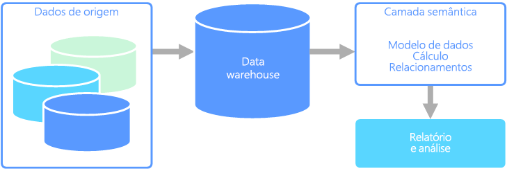

# Modelagem semânticaSemantic modeling

Um modelo de dados semântico é um modelo conceitual que descreve o significado dos elementos de dados que ele contém.A semantic data model is a conceptual model that describes the meaning of the data elements it contains. As empresas costumam ter seus próprios termos para coisas, às vezes, com sinônimos ou até mesmo significados diferentes para o mesmo termo.Organizations often have their own terms for things, sometimes with synonyms, or even different meanings for the same term. Por exemplo, um banco de dados de inventário pode acompanhar uma parte do equipamento com uma ID de ativo e um número de série, mas um banco de dados de vendas pode se referir ao número de série como a ID de ativo.For example, an inventory database might track a piece of equipment with an asset ID and a serial number, but a sales database might refer to the serial number as the asset ID. Não há nenhuma maneira simples para relacionar esses valores sem um modelo que descreve a relação.There is no simple way to relate these values without a model that describes the relationship. 

A modelagem semântica fornece um nível de abstração no esquema de banco de dados, de modo que os usuários não precisem conhecer as estruturas de dados subjacentes.Semantic modeling provides a level of abstraction over the database schema, so that users don't need to know the underlying data structures. Isso facilita para os usuários finais consultar dados sem executar agregações e junções no esquema subjacente.This makes it easier for end users to query data without performing aggregates and joins over the underlying schema. Além disso, normalmente, as colunas são renomeadas com nomes mais amigáveis, de modo que o contexto e o significado dos dados sejam mais óbvios.Also, usually columns are renamed to more user-friendly names, so that the context and meaning of the data are more obvious.

A modelagem semântica é predominantemente usada para cenários de leitura intensa, como análise e business intelligence (OLAP), ao contrário do processamento de dados transacionais de gravação mais intensa (OLTP).Semantic modeling is predominately used for read-heavy scenarios, such as analytics and business intelligence (OLAP), as opposed to more write-heavy transactional data processing (OLTP). Isso é principalmente devido à natureza de uma camada semântica típica:This is mostly due to the nature of a typical semantic layer:

- Os comportamentos de agregação são definidos para que as ferramentas de relatórios os exibam corretamente.Aggregation behaviors are set so that reporting tools display them properly.
- A lógica de negócios e os cálculos são definidos.Business logic and calculations are defined.
- Os cálculos orientados por tempo são incluídos.Time-oriented calculations are included.
- Os dados normalmente são integrados de várias fontes.Data is often integrated from multiple sources. 

Tradicionalmente, a camada semântica é colocada em um data warehouse por esses motivos.Traditionally, the semantic layer is placed over a data warehouse for these reasons.

Há dois tipos principais de modelos semânticos:There are two primary types of semantic models:

* **Tabular**.**Tabular**. Usa constructos de modelagem relacional (modelo, tabelas, colunas).Uses relational modeling constructs (model, tables, columns). Internamente, os metadados são herdados de constructos de modelagem OLAP (cubos, dimensões, medidas).Internally, metadata is inherited from OLAP modeling constructs (cubes, dimensions, measures). O código e o script usam metadados OLAP.Code and script use OLAP metadata.
* **Multidimensional**.**Multidimensional**. Usa constructos de modelagem OLAP tradicionais (cubos, dimensões, medidas).Uses traditional OLAP modeling constructs (cubes, dimensions, measures).

Serviço do Azure relevante:Relevant Azure service:
- [Azure Analysis ServicesAzure Analysis Services](https://azure.microsoft.com/services/analysis-services/)

## Caso de uso de exemploExample use case

Uma organização tem dados armazenados em um banco de dados grande.An organization has data stored in a large database. Ela deseja disponibilizar esses dados para usuários empresariais e clientes para criar seus próprios relatórios e fazer análises.It wants to make this data available to business users and customers to create their own reports and do some analysis. Uma opção é apenas fornecer a esses usuários o acesso direto ao banco de dados.One option is just to give those users direct access to the database. No entanto, há várias desvantagens ao fazer isso, incluindo o gerenciamento de segurança e controle de acesso.However, there are several drawbacks to doing this, including managing security and controlling access. Além disso, o design do banco de dados, incluindo os nomes de tabelas e colunas, pode ser de difícil compreensão para um usuário.Also, the design of the database, including the names of tables and columns, may be hard for a user to understand. Os usuários precisam saber quais tabelas consultar, como as tabelas devem ser unidas e outra lógica de negócios que precisa ser aplicada para obter os resultados corretos.Users would need to know which tables to query, how those tables should be joined, and other business logic that must be applied to get the correct results. Os usuários também precisam conhecer uma linguagem de consulta como SQL, até mesmo para começar.Users would also need to know a query language like SQL even to get started. Normalmente, isso leva ao relatório de vários usuários das mesmas métricas, mas com resultados diferentes.Typically this leads to multiple users reporting the same metrics but with different results.

Outra opção é encapsular todas as informações de que os usuários precisam em um modelo semântico.Another option is to encapsulate all of the information that users need into a semantic model. O modelo semântico pode ser consultado com mais facilidade por usuários com uma ferramenta de relatórios de sua escolha.The semantic model can be more easily queried by users with a reporting tool of their choice. Os dados fornecidos pelo modelo semântico são extraídos de um data warehouse, garantindo que todos os usuários vejam uma única versão da verdade.The data provided by the semantic model is pulled from a data warehouse, ensuring that all users see a single version of the truth. O modelo semântico também fornece nomes de tabela e coluna amigáveis, relações entre tabelas, descrições, cálculos e segurança em nível de linha.The semantic model also provides friendly table and column names, relationships between tables, descriptions, calculations, and row-level security.

## Características comuns da modelagem semânticaTypical traits of semantic modeling

A modelagem semântica e o processamento analítico tendem a ter as seguintes características:Semantic modeling and analytical processing tends to have the following traits:

| RequisitoRequirement | DESCRIÇÃODescription |
| --- | --- |
| NormalizaçãoNormalization | Altamente normalizadoHighly normalized |
| EsquemaSchema | Esquema na gravação, altamente impostoSchema on write, strongly enforced|
| Usa TransaçõesUses Transactions | Não No |
| Estratégia de BloqueioLocking Strategy | NenhumNone |
| AtualizávelUpdateable | Não (normalmente exige o recálculo de cubo)No (typically requires recomputing cube) |
| AcrescentávelAppendable | Não (normalmente exige o recálculo de cubo)No (typically requires recomputing cube) |
| Carga de trabalhoWorkload | Leituras intensas, somente leituraHeavy reads, read-only |
| IndexaçãoIndexing | Indexação multidimensionalMultidimensional indexing |
| Tamanho do dadoDatum size | De pequeno a médioSmall to medium sized |
| ModeloModel | MultidimensionalMultidimensional |
| Forma dos dados:Data shape:| Esquema de cubo ou estrela/floco de neveCube or star/snowflake schema |
| Flexibilidade de consultaQuery flexibility | Altamente flexívelHighly flexible |
| Escala:Scale: | Grande (dezenas a centenas de GBs)Large (10s-100s GBs) |

## Consulte tambémSee also

- [Data warehouseData warehousing](../scenarios/data-warehousing.md)
- [OLAP (processamento analítico online)Online analytical processing (OLAP)](../scenarios/online-analytical-processing.md)