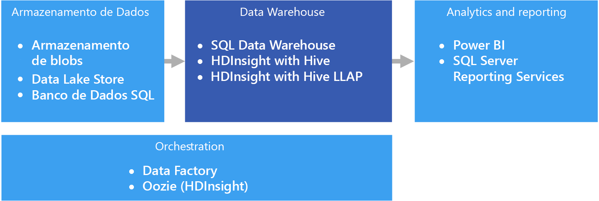

# Data warehouse e data marts

Um data warehouse é um repositório central, organizacional e relacional de dados integrados de uma ou mais fontes diferentes, em muitas ou todas as áreas de assunto. Data warehouses armazenam dados atuais e históricos e são usados para relatórios e análise dos dados de diferentes maneiras.

Para mover dados para um data warehouse, eles são extraídos periodicamente de várias fontes que contêm informações comerciais importantes. Conforme os dados são movidos, eles podem ser formatados, limpos, validados, resumidos e reorganizados. Como alternativa, os dados podem ser armazenados no nível mais baixo de detalhe, com exibições agregadas fornecidas no warehouse para relatórios. Em ambos os casos, o data warehouse se torna um espaço de armazenamento permanente de dados usados para relatórios, análise e tomada de decisões comerciais importantes usando ferramentas de BI (business intelligence).

## Data marts e armazenamentos de dados operacionais

O gerenciamento de dados em escala é complexo e é cada vez menos comum ter um único data warehouse que representa todos os dados em toda a empresa. Em vez disso, as organizações criam data warehouses menores e mais direcionados, chamados *data marts*, que expõem os dados desejados para fins de análise. Um processo de orquestração popula os data marts com os dados mantidos em um armazenamento de dados operacionais. O armazenamento de dados operacionais atua como um intermediário entre o sistema transacional de origem e o data mart. Os dados gerenciados pelo armazenamento de dados operacionais são uma versão limpa dos dados presentes no sistema transacional de origem e, normalmente, são um subconjunto dos dados históricos mantidos pelo data warehouse ou data mart.

## Quando usar esta solução

Escolha um data warehouse quando precisar transformar grandes quantidades de dados de sistemas operacionais em um formato que seja fácil de entender, atual e preciso. Os data warehouses não precisam seguir a mesma estrutura de dados concisa que pode estar sendo usada nos bancos de dados operacional/OLTP. Você pode usar nomes de coluna que fazem sentido para analistas e usuários de negócios, reestruturar o esquema para simplificar as relações de dados e consolidar várias tabelas em uma. Essas etapas ajudam a orientar os usuários que precisam criar relatórios ad hoc ou criar relatórios e analisar os dados em sistemas de BI, sem a ajuda de um DBA (administrador de banco de dados) ou desenvolvedor de dados.

Considere o uso de um data warehouse quando precisar manter dados históricos separados de sistemas de transação de origem por motivos de desempenho. Os data warehouses facilitam o acesso aos dados históricos em vários locais, fornecendo um local centralizado usando formatos, chaves, common data service e métodos de acesso comuns.

Os data warehouses são otimizados para acesso de leitura, o que resulta na geração mais rápida de relatórios comparado à execução de relatórios no sistema de transação de origem. Além disso, os data warehouses oferecem os seguintes benefícios:

- Todos os dados históricos de várias fontes podem ser armazenados e acessados em um data warehouse como a única fonte de verdade.
- Você pode melhorar a qualidade de dados limpando os dados conforme eles são importados para o data warehouse, fornecendo dados mais precisos, além de fornecer códigos e descrições consistentes.
- As ferramentas de relatórios não entram em conflito com os sistemas transacionais de origem para ciclos de processamento de consultas. Um data warehouse permite que o sistema transacional focalize predominantemente o tratamento de gravações, enquanto o data warehouse atende à maioria das solicitações de leitura.
- Um data warehouse pode ajudar a consolidar dados de diferentes softwares.
- As ferramentas de mineração de dados podem ajudá-lo a encontrar padrões ocultos usando metodologias automáticas em dados armazenados no warehouse.
- Os data warehouses facilitam o fornecimento de acesso seguro aos usuários autorizados, enquanto restringem o acesso a outras pessoas. Não é necessário conceder acesso aos usuários empresariais a dados de origem, removendo um vetor de ataque potencial contra um ou mais sistemas de transação de produção.
- Os data warehouses facilitam a criação de soluções de business intelligence com base nos dados, como [cubos OLAP](online-analytical-processing.md).

## Desafios

A configuração correta de um data warehouse para atender às necessidades de sua empresa pode trazem alguns dos seguintes desafios:

- Confirmar o tempo necessário para modelar corretamente os conceitos de negócios. Essa é uma etapa importante, pois os data warehouses são controlados por informações, em que o mapeamento de conceitos impulsiona o restante do projeto. Isso envolve a padronização de termos relacionados aos negócios e formatos comuns (como moeda e datas) e a reestruturação do esquema de uma maneira que faça sentido para usuários empresariais, mas que ainda garanta a precisão das relações e agregações de dados.

- Planejar e configurar a orquestração de dados. As considerações incluem como copiar dados do sistema transacional de origem para o data warehouse e quando mover dados históricos para fora dos armazenamentos de dados operacionais e para o warehouse.

- Manter ou melhorar a qualidade de dados, limpando os dados conforme eles são importados para o warehouse.

## Data warehouse no Azure

No Azure, você pode ter uma ou mais fontes de dados, seja ela de transações do cliente ou de vários aplicativos de negócios usados por vários departamentos. Tradicionalmente, esses dados são armazenados em um ou mais bancos de dados [OLTP](online-transaction-processing.md). Os dados podem ser persistidos em outros meios de armazenamento, como compartilhamentos de rede, Azure Storage Blobs ou um data lake. Os dados também podem ser armazenados pelo próprio data warehouse ou em um banco de dados relacional, como o Banco de Dados SQL do Azure. A finalidade da camada de armazenamento de dados analíticos é atender às consultas emitidas por ferramentas de relatórios ou de análise no data warehouse ou data mart. No Azure, essa funcionalidade de repositório analítico pode ser atendida com o SQL Data Warehouse do Azure ou o Azure HDInsight usando o Hive ou a Consulta Interativa. Além disso, você precisará de algum nível de orquestração para periodicamente mover ou copiar dados do armazenamento de dados para o data warehouse, que pode ser feito com o Azure Data Factory ou o Oozie no Azure HDInsight.

Há várias opções para a implementação de um data warehouse no Azure, dependendo de suas necessidades. As listas a seguir são divididas em duas categorias, [SMP](https://en.wikipedia.org/wiki/Symmetric_multiprocessing) (multiprocessamento simétrico) e [MPP](https://en.wikipedia.org/wiki/Massively_parallel) (processamento paralelo em massa).

SMP:

- [Banco de Dados SQL do Azure](/azure/sql-database/)
- [SQL Server em uma máquina virtual](/sql/sql-server/sql-server-technical-documentation)

MPP:

- [Data Warehouse do Azure](/azure/sql-data-warehouse/sql-data-warehouse-overview-what-is)
- [Apache Hive no HDInsight](/azure/hdinsight/hadoop/hdinsight-use-hive)
- [Consulta Interativa (Hive LLAP) no HDInsight](/azure/hdinsight/interactive-query/apache-interactive-query-get-started)

Como regra geral, warehouses baseados no SMP são mais adequados para conjuntos de dados pequenos a médios (até 4-100 TB), enquanto o MPP é frequentemente usado para Big Data. A delineação entre dados pequenos/médios e Big Data parcialmente está relacionada à definição e à infraestrutura de suporte de sua organização. (Consulte [Escolhendo um armazenamento de dados OLTP](online-transaction-processing.md#scalability-capabilities).)

Além dos tamanhos de dados, o tipo de padrão de carga de trabalho provavelmente é um fator determinante maior. Por exemplo, consultas complexas podem ser muito lentas para uma solução SMP e exigem uma solução MPP. Sistemas baseados em MPP têm a probabilidade de impor uma penalidade de desempenho com tamanhos de dados pequenos, devido à maneira como os trabalhos são distribuídos e consolidados em nós. Se os tamanhos de dados já excedem 1 TB e devem aumentar continuamente, considere a possibilidade de escolher uma solução MPP. No entanto, se os tamanhos de dados são menores que isso, mas as cargas de trabalho excedem os recursos disponíveis da solução SMP, o MPP também pode ser a melhor opção.

Os dados acessados ou armazenados pelo data warehouse podem ser recebidos de várias fontes de dados, incluindo um data lake, como o [Azure Data Lake Store](/azure/data-lake-store/). Para obter uma sessão de vídeo que compara os diferentes pontos fortes de serviços MPP que podem usar o Azure Data Lake, confira [Azure Data Lake e Data Warehouse do Azure: aplicando práticas modernas ao seu aplicativo](https://azure.microsoft.com/resources/videos/build-2016-azure-data-lake-and-azure-data-warehouse-applying-modern-practices-to-your-app/).

Sistemas SMP são caracterizados por uma única instância de um RDBMS que compartilha todos os recursos (CPU/Memória/Disco). Você pode escalar um sistema SMP verticalmente. Para o SQL Server em execução em uma VM, você pode dimensionar o tamanho da VM. Para o Banco de Dados SQL do Azure, você pode escalar verticalmente selecionando outra camada de serviço.

Sistemas MPP podem ser escalados horizontalmente pela adição de mais nós de computação (que têm seus próprios subsistemas de CPU, memória e E/S). Há limitações físicas para a escala vertical de um servidor e, nesse momento, a escala horizontal é preferível, dependendo da carga de trabalho. No entanto, as soluções MPP exigem um conjunto de qualificações diferente, devido a variações em consulta, modelagem, particionamento de dados e outros fatores exclusivos ao processamento paralelo.

Ao decidir qual solução SMP será usada, consulte [Uma análise mais aprofundada do Banco de Dados SQL do Azure e do SQL Server em VMs do Azure](/azure/sql-database/sql-database-paas-vs-sql-server-iaas#a-closer-look-at-azure-sql-database-and-sql-server-on-azure-vms).

O SQL Data Warehouse do Azure também pode ser usado para conjuntos de dados pequenos e médios, em que a carga de trabalho faz uso intensivo de computação e memória. Leia mais sobre os padrões e cenários comuns do SQL Data Warehouse:

- [Padrões e antipadrões do SQL Data Warehouse](https://blogs.msdn.microsoft.com/sqlcat/2017/09/05/azure-sql-data-warehouse-workload-patterns-and-anti-patterns/)

- [Padrões e estratégias de carregamento do SQL Data Warehouse](https://blogs.msdn.microsoft.com/sqlcat/2017/05/17/azure-sql-data-warehouse-loading-patterns-and-strategies/)

- [Migrando dados para o Azure SQL Data Warehouse](https://blogs.msdn.microsoft.com/sqlcat/2016/08/18/migrating-data-to-azure-sql-data-warehouse-in-practice/)

- [Padrões comuns de aplicativo ISV usando o SQL Data Warehouse do Azure](https://blogs.msdn.microsoft.com/sqlcat/2017/09/05/common-isv-application-patterns-using-azure-sql-data-warehouse/)

## Principais critérios de seleção

Para restringir as opções, comece respondendo a estas perguntas:

- Você deseja ter um serviço gerenciado em vez de gerenciar seus próprios servidores?

- Você está trabalhando com conjuntos de dados muito grandes ou consultas altamente complexas e de execução longa? Nesse caso, considere uma opção de MPP.

- Para um conjunto grande de dados, a fonte de dados é estruturada ou não estruturada? Os dados não estruturados podem precisar ser processados em um ambiente de Big Data como o Spark no HDInsight, Azure Databricks, Hive LLAP no HDInsight ou Azure Data Lake Analytics. Tudo isso pode servir como ELT (Extrair, Carregar, Transformar) e mecanismos de ETL. Eles podem gerar os dados processados em dados estruturados, facilitando seu carregamento no SQL Data Warehouse ou em uma das outras opções. Para dados estruturados, o SQL Data Warehouse tem um nível de desempenho chamado Otimizado para Computação, para cargas de trabalho de computação intensiva que exigem desempenho muito alto.

- Você deseja separar os dados históricos dos dados operacionais atuais? Nesse caso, escolha uma das opções em que a [orquestração](../technology-choices/pipeline-orchestration-data-movement.md) é necessária. Esses são warehouses autônomos otimizados para acesso de leitura intenso e são mais adequados como um armazenamento de dados históricos separado.

- Você precisa integrar dados de várias fontes, além de seu armazenamento de dados OLTP? Nesse caso, considere opções que integram várias fontes de dados com facilidade.

- Você tem um requisito de multilocação? Nesse caso, o SQL Data Warehouse não é ideal para esse requisito. Para obter mais informações, consulte [Padrões e antipadrões do SQL Data Warehouse](https://blogs.msdn.microsoft.com/sqlcat/2017/09/05/azure-sql-data-warehouse-workload-patterns-and-anti-patterns/).

- Você prefere um armazenamento de dados relacionais? Nesse caso, restrinja as opções àquelas com um armazenamento de dados relacionais, mas observe também que você pode usar uma ferramenta como o PolyBase para consultar armazenamentos de dados não relacionais, se necessário. No entanto, se você decidir usar o PolyBase, execute testes de desempenho nos conjuntos de dados não estruturados da carga de trabalho.

- Você tem requisitos de relatórios em tempo real? Caso precise de tempos de resposta de consulta rápida em grandes volumes de inserções singleton, restrinja as opções àquelas que podem dar suporte a relatórios em tempo real.

- Você precisa dar suporte a uma grande quantidade de usuários e conexões simultâneas? A capacidade de dar suporte a diversos usuários/conexões simultâneas depende de vários fatores.

  - Para o Banco de Dados SQL do Azure, veja os [limites de recursos documentados](/azure/sql-database/sql-database-resource-limits) de acordo com a camada de serviço.
  
  - O SQL Server permite um máximo de 32.767 conexões de usuário. Quando estiver em execução em uma VM, o desempenho dependerá do tamanho da VM e de outros fatores.

  - O SQL Data Warehouse tem limites de consultas e conexões simultâneas. Para obter mais informações, consulte [Simultaneidade e gerenciamento de carga de trabalho no SQL Data Warehouse](/azure/sql-data-warehouse/sql-data-warehouse-develop-concurrency). Considere o uso de serviços complementares, como o [Azure Analysis Services](/azure/analysis-services/analysis-services-overview) para superar os limites no SQL Data Warehouse.

- Que tipo de carga de trabalho você tem? Em geral, as soluções de warehouse baseadas em MPP são mais adequadas para cargas de trabalho analíticas, orientadas por lote. Se as cargas de trabalho são transacionais por natureza, com muitas operações pequenas de leitura/gravação ou várias operações linha por linha, considere o uso de uma das opções de SMP. Uma exceção a essas diretrizes é durante o uso do processamento de fluxo em um cluster HDInsight, como o Spark Streaming e o armazenamento dos dados em uma tabela do Hive.

## Matriz de Funcionalidades

As tabelas a seguir resumem as principais diferenças em funcionalidades.

### Funcionalidades gerais

<!-- markdownlint-disable MD033 -->

| | Banco de Dados SQL do Azure | SQL Server (VM) | SQL Data Warehouse | Apache Hive no HDInsight | Hive LLAP no HDInsight |
| --- | --- | --- | --- | --- | --- | -- |
| É um serviço gerenciado | SIM | Não  | SIM | Sim 1 | Sim 1 |
| Exige a orquestração de dados (armazena uma cópia dos dados/dados históricos) | Não  | Não  | sim | sim | SIM |
| É integrado com facilidade a várias fontes de dados | Não  | Não  | sim | sim | SIM |
| Dá suporte à pausa de computação | Não  | Não  | SIM | Não 2 | Não 2 |
| Armazenamento de dados relacionais | SIM | sim |  sim | Não | Não  |
| Relatórios em tempo real | SIM | sim | Não | Não  | SIM |
| Pontos de restauração de backup flexíveis | SIM | SIM | Não 3 | Sim 4 | Sim 4 |
| SMP/MPP | SMP | SMP | MPP | MPP | MPP |

<!-- markdownlint-enable MD033 -->

[1] Configuração manual e dimensionamento.

[2] Os clusters HDInsight poderão ser excluídos quando não forem necessários e, em seguida, recriados. Anexe um armazenamento de dados externo ao cluster para que os dados sejam retidos quando você excluir o cluster. Use o Azure Data Factory para automatizar o ciclo de vida do cluster por meio da criação de um cluster HDInsight sob demanda para processar a carga de trabalho. Em seguida, exclua-o quando o processamento for concluído.

[3] Com o SQL Data Warehouse, você pode restaurar um banco de dados para qualquer ponto de restauração disponível nos últimos sete dias. Os instantâneos iniciam a cada 4-8 horas e permanecem disponíveis por sete dias. Quando um instantâneo possui mais de sete dias, ele expira e seu ponto de restauração fica indisponível.

[4] Considere o uso de um [metastore externo do Hive](/azure/hdinsight/hdinsight-hadoop-provision-linux-clusters#use-hiveoozie-metastore) que pode ser copiado em backup e restaurado, conforme necessário. As opções de backup e restauração padrão que se aplicam ao Armazenamento de Blobs ou ao Data Lake Store podem ser usadas para os dados ou podem ser usadas soluções terceiros de backup e restauração do HDInsight, como o [Imanis Data](https://azure.microsoft.com/blog/imanis-data-cloud-migration-backup-for-your-big-data-applications-on-azure-hdinsight/), para obter maior flexibilidade e facilidade de uso.

### Funcionalidades de escalabilidade

<!-- markdownlint-disable MD033 -->

| | Banco de Dados SQL do Azure | SQL Server (VM) |  SQL Data Warehouse | Apache Hive no HDInsight | Hive LLAP no HDInsight |
| --- | --- | --- | --- | --- | --- | -- |
| Servidores regionais redundantes para alta disponibilidade  | SIM | sim | sim | Não | Não  |
| Dá suporte à expansão da consulta (consultas distribuídas)  | Não  | Não  | sim | sim | SIM |
| Dimensionamento dinâmico | SIM | Não  | Sim 1 | Não  | Não  |
| Dá suporte ao cache em memória de dados | SIM |  sim | Não  | sim | SIM |

[1] O SQL Data Warehouse permite escalar ou reduzir verticalmente ajustando o número de DWUs (unidades de data warehouse). Consulte [Gerenciar o poder de computação no SQL Data Warehouse do Azure](/azure/sql-data-warehouse/sql-data-warehouse-manage-compute-overview).

<!-- markdownlint-enable MD033 -->

### Funcionalidades de segurança

<!-- markdownlint-disable MD033 -->

|                         |           Banco de Dados SQL do Azure            |  SQL Server em uma máquina virtual  | SQL Data Warehouse |   Apache Hive no HDInsight    |    Hive LLAP no HDInsight     |
|-------------------------|-----------------------------------------|-----------------------------------|--------------------|-------------------------------|-------------------------------|
|     Autenticação      | SQL/Azure AD (Azure Active Directory) | SQL/Azure AD/Active Directory |   SQL/Azure AD   | local/Azure AD 1 | local/Azure AD 1 |
|      Autorização      |                   SIM                   |                sim                |        sim         |              SIM              |       Sim 1        |
|        Auditoria         |                   SIM                   |                sim                |        sim         |              SIM              |       Sim 1        |
| Criptografia de dados em repouso |            Sim 2             |         Sim 2          |  Sim 2  |       Sim 2        |       Sim 1        |
|   Segurança em nível de linha    |                   SIM                   |                sim                |        sim         |              Não                |       Sim 1        |
|   Dá suporte a firewalls    |                   SIM                   |                sim                |        sim         |              SIM              |       Sim 3        |
|  Mascaramento de dados dinâmicos   |                   SIM                   |                sim                |        sim         |              Não                |       Sim 1        |

<!-- markdownlint-enable MD033 -->

[1] Exige o uso de um [cluster HDInsight ingressado no domínio](/azure/hdinsight/domain-joined/apache-domain-joined-introduction).

[2] Exige o uso de TDE (Transparent Data Encryption) para criptografar e descriptografar os dados em repouso.

[3] Compatível quando [usado em uma Rede Virtual do Azure](/azure/hdinsight/hdinsight-extend-hadoop-virtual-network).

Leia mais sobre como proteger seu data warehouse:

- [Protegendo o Banco de Dados SQL](/azure/sql-database/sql-database-security-overview#connection-security)

- [Proteger um banco de dados no SQL Data Warehouse](/azure/sql-data-warehouse/sql-data-warehouse-overview-manage-security)

- [Estender o Azure HDInsight usando uma Rede Virtual do Azure](/azure/hdinsight/hdinsight-extend-hadoop-virtual-network)

- [Segurança do Hadoop em nível empresarial com clusters HDInsight ingressados no domínio](/azure/hdinsight/domain-joined/apache-domain-joined-introduction)
