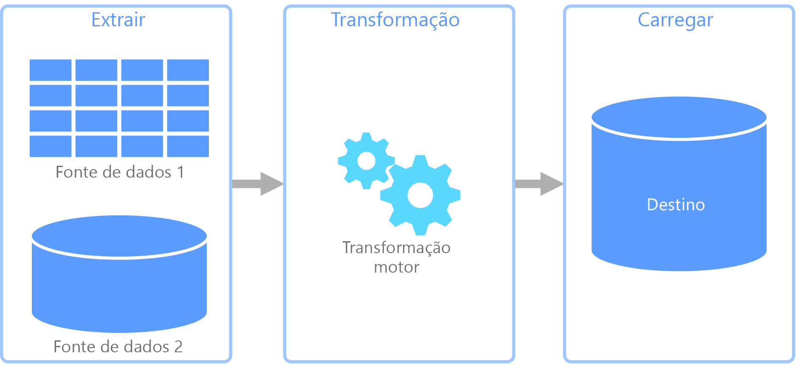
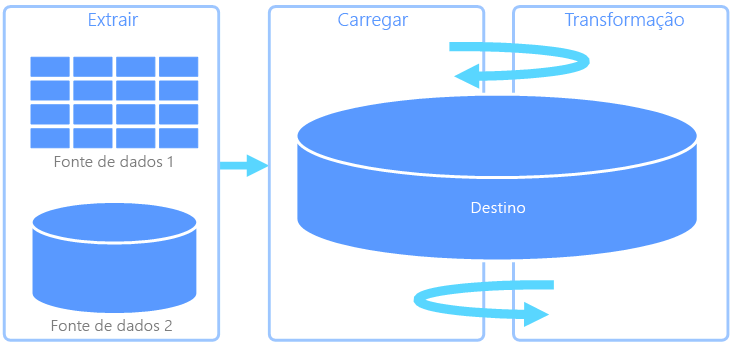
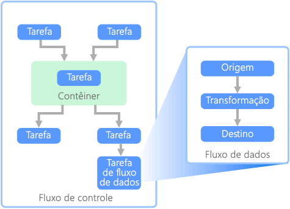

# ETL (extrair, transformar e carregar)

Um problema comum que as organizações enfrentam é como coletar dados de várias fontes, em vários formatos e movê-los para um ou mais armazenamentos de dados. O destino pode não ser o mesmo tipo de armazenamento de dados da origem e, geralmente, o formato é diferente ou os dados precisam ser formatados ou limpos antes de serem carregados em seu destino final.

Várias ferramentas, serviços e processos foram desenvolvidos ao longo dos anos para ajudar a solucionar esses desafios. Não importa o processo utilizado, há uma necessidade comum de coordenar o trabalho e aplicar um nível de transformação de dados ao pipeline de dados. As seções a seguir destacam os métodos comuns usados para executar essas tarefas.

## Processo de extração, transformação e carregamento (ETL)

O ETL (extração, transformação e carregamento) é um pipeline de dados usado para coletar dados de várias fontes, transformar os dados de acordo com as regras de negócio e carregá-los em um armazenamento de dados de destino. O trabalho de transformação no ETL ocorre em um mecanismo especializado e, geralmente, envolve o uso de tabelas de preparo para armazenar os dados temporariamente enquanto eles são transformados e, por fim, carregados em seu destino.

A transformação de dados ocorrida geralmente envolve diversas operações, como filtragem, classificação, agregação, junção de dados, limpeza de dados, eliminação de duplicação e validação de dados.

Com frequência, as três fases de ETL são executadas em paralelo para economizar tempo. Por exemplo, enquanto os dados estão sendo extraídos, um processo de transformação pode trabalhar nos dados já recebidos e prepará-los o para carregamento e um processo de carregamento pode começar a trabalhar com os dados preparados, em vez de aguardar a conclusão de todo o processo de extração.

Serviço do Azure relevante:

- [Azure Data Factory v2](https://azure.microsoft.com/services/data-factory/)

Outras ferramentas:

- [SQL Server Integration Services (SSIS)](/sql/integration-services/sql-server-integration-services)

## ELT (extração, carregamento e transformação)

O ELT (extração, carregamento e transformação) difere do ETL somente no local em que ocorre a transformação. No pipeline de ELT, a transformação ocorre no armazenamento de dados de destino. Em vez de usar um mecanismo de transformação separado, as funcionalidades de processamento do armazenamento de dados de destino são usadas para transformar os dados. Isso simplifica a arquitetura pela remoção do mecanismo de transformação do pipeline. Outro benefício dessa abordagem é que o dimensionamento do armazenamento de dados de destino também dimensiona o desempenho do pipeline ELT. No entanto, o ELT só funciona bem quando o sistema de destino é poderoso o suficiente para transformar os dados com eficiência.

Os casos típicos de uso do ELT se enquadram no âmbito do Big Data. Por exemplo, você pode começar com a extração de todos os dados de origem em arquivos simples em um armazenamento escalonável, como o HDFS (sistema de arquivos distribuído do Hadoop) ou o Azure Data Lake Store. Tecnologias, como o Spark, Hive ou PolyBase, podem então ser usadas para consultar os dados de origem. O ponto-chave do ELT é que o armazenamento de dados usado para executar a transformação é o mesmo armazenamento de dados no qual os dados são, em última análise, consumidos. Esse armazenamento de dados lê diretamente do armazenamento escalonável, em vez de carregar os dados em seu próprio armazenamento proprietário. Essa abordagem ignora a etapa de cópia de dados presente no ETL, que pode ser uma operação demorada para conjuntos grandes de dados.

Na prática, o armazenamento de dados de destino é um [data warehouse](./data-warehousing.md) que usa um cluster Hadoop (usando o Hive ou o Spark) ou um SQL Data Warehouse. Em geral, um esquema é sobreposto sobre os dados de arquivo simples no momento da consulta e armazenado como uma tabela, permitindo que os dados sejam consultados como qualquer outra tabela no armazenamento de dados. Elas são conhecidas como tabelas externas porque os dados não residem no armazenamento gerenciado pelo próprio armazenamento de dados, mas em algum armazenamento escalonável externo.

O armazenamento de dados somente gerencia o esquema dos dados e aplica o esquema na leitura. Por exemplo, um cluster Hadoop que usa o Hive descreverá uma tabela do Hive em que a fonte de dados é efetivamente um caminho para um conjunto de arquivos no HDFS. No SQL Data Warehouse, o PolyBase pode obter o mesmo resultado &mdash; criando uma tabela com os dados armazenados externamente ao próprio banco de dados. Quando os dados de origem são carregados, os dados presentes nas tabelas externas podem ser processados usando as funcionalidades do armazenamento de dados. Em cenários de Big Data, isso significa que o armazenamento de dados tem a capacidade de MPP (processamento paralelo maciço), que divide os dados em partes menores e distribui o processamento das partes entre vários computadores em paralelo.

Normalmente, a fase final do pipeline ELT é transformar os dados de origem em um formato final que é mais eficiente para os tipos de consultas que precisam de suporte. Por exemplo, os dados podem ser particionados. Além disso, o ELT pode usar formatos de armazenamento otimizados como o Parquet, que armazena dados orientados por linha em uma forma de coluna e fornece indexação otimizada.

Serviço do Azure relevante:

- [SQL Data Warehouse do Azure](/azure/sql-data-warehouse/sql-data-warehouse-overview-what-is)
- [HDInsight com Hive](/azure/hdinsight/hadoop/hdinsight-use-hive)
- [Azure Data Factory v2](https://azure.microsoft.com/services/data-factory/)
- [Oozie no HDInsight](/azure/hdinsight/hdinsight-use-oozie-linux-mac)

Outras ferramentas:

- [SQL Server Integration Services (SSIS)](/sql/integration-services/sql-server-integration-services)

## Fluxo de dados e fluxo de controle

No contexto de pipelines de dados, o fluxo de controle garante o processamento ordenado de um conjunto de tarefas. Para impor a ordem de processamento correta dessas tarefas, restrições de precedência são usadas. Considere essas restrições como conectores em um diagrama de fluxo de trabalho, conforme mostrado na imagem abaixo. Cada tarefa tem um resultado, como êxito, falha ou conclusão. Qualquer tarefa posterior não inicia o processamento até que seu predecessor tenha concluído com um desses resultados.

Os fluxos de controle executam fluxos de dados como uma tarefa. Em uma tarefa de fluxo de dados, os dados são extraídos de uma fonte, transformados ou carregados em um armazenamento de dados. A saída de uma tarefa de fluxo de dados pode ser a entrada para a próxima tarefa de fluxo de dados e os fluxos de dados podem ser executados em paralelo. Ao contrário de fluxos de controle, não é possível adicionar restrições entre tarefas em um fluxo de dados. No entanto, é possível adicionar um visualizador de dados para observar os dados conforme eles são processados por cada tarefa.

No diagrama acima, há várias tarefas dentro do fluxo de controle, cada uma sendo uma tarefa de fluxo de dados. Uma das tarefas é aninhada em um contêiner. Os contêineres podem ser usados para fornecer estrutura às tarefas, fornecendo uma unidade de trabalho. Um exemplo disso são elementos de repetição em uma coleção, como arquivos em uma pasta ou instruções de banco de dados.

Serviço do Azure relevante:

- [Azure Data Factory v2](https://azure.microsoft.com/services/data-factory/)

Outras ferramentas:

- [SQL Server Integration Services (SSIS)](/sql/integration-services/sql-server-integration-services)

## Opções de tecnologia

- [Armazenamentos de dados OLTP (Processamento de Transações Online)](./online-transaction-processing.md#oltp-in-azure)
- [Armazenamentos de dados OLAP (processamento analítico online)](./online-analytical-processing.md#olap-in-azure)
- [Data warehouses](./data-warehousing.md)
- [Orquestração de pipeline](../technology-choices/pipeline-orchestration-data-movement.md)

## Próximas etapas

As seguintes arquiteturas de referência mostram os pipelines ELT de ponta a ponta no Azure:

- [Enterprise BI no Azure com o SQL Data Warehouse](../../reference-architectures/data/enterprise-bi-sqldw.md)
- [Enterprise BI automatizada com o SQL Data Warehouse e Azure Data Factory](../../reference-architectures/data/enterprise-bi-adf.md)