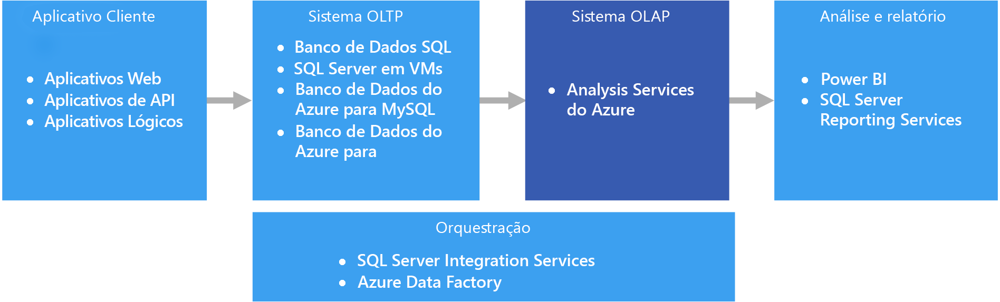
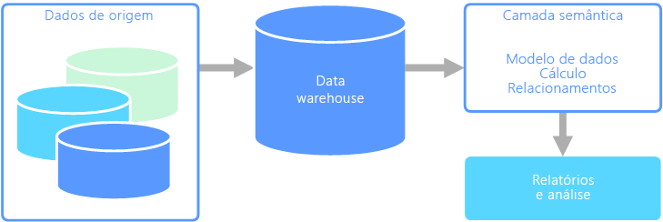

# OLAP (processamento analítico online)Online analytical processing (OLAP)

O OLAP (processamento analítico online) é uma tecnologia que organiza bancos de dados comerciais grandes e dá suporte à análise complexa.Online analytical processing (OLAP) is a technology that organizes large business databases and supports complex analysis. Ele pode ser usado para executar consultas analíticas complexas sem prejudicar sistemas transacionais.It can be used to perform complex analytical queries without negatively affecting transactional systems.

Os bancos de dados que uma empresa usa para armazenar todas as suas transações e registros são chamados bancos de dados [OLTP (processamento de transações online)](online-transaction-processing.md).The databases that a business uses to store all its transactions and records are called [online transaction processing (OLTP)](online-transaction-processing.md) databases. Esses bancos de dados geralmente têm registros que são inseridos individualmente.These databases usually have records that are entered one at a time. Muitas vezes, eles contêm uma grande quantidade de informações que são importantes para a organização.Often they contain a great deal of information that is valuable to the organization. No entanto, os bancos de dados que são usados para OLTP não foram projetados para análise.The databases that are used for OLTP, however, were not designed for analysis. Portanto, a recuperação de respostas com base nesses bancos de dados é cara em termos de tempo e esforço.Therefore, retrieving answers from these databases is costly in terms of time and effort. Os sistemas OLAP foram projetados para ajudar a extrair essas informações de business intelligence dos dados de uma maneira com alto desempenho.OLAP systems were designed to help extract this business intelligence information from the data in a highly performant way. Isso ocorre porque os bancos de dados OLAP são otimizados para cargas de trabalho com leitura intensa e com pouca gravação.This is because OLAP databases are optimized for heavy read, low write workloads.

 

## Modelagem semânticaSemantic modeling

Um modelo de dados semântico é um modelo conceitual que descreve o significado dos elementos de dados que ele contém.A semantic data model is a conceptual model that describes the meaning of the data elements it contains. As empresas costumam ter seus próprios termos para coisas, às vezes, com sinônimos ou até mesmo significados diferentes para o mesmo termo.Organizations often have their own terms for things, sometimes with synonyms, or even different meanings for the same term. Por exemplo, um banco de dados de inventário pode acompanhar uma parte do equipamento com uma ID de ativo e um número de série, mas um banco de dados de vendas pode se referir ao número de série como a ID de ativo.For example, an inventory database might track a piece of equipment with an asset ID and a serial number, but a sales database might refer to the serial number as the asset ID. Não há nenhuma maneira simples para relacionar esses valores sem um modelo que descreve a relação.There is no simple way to relate these values without a model that describes the relationship. 

A modelagem semântica fornece um nível de abstração no esquema de banco de dados, de modo que os usuários não precisem conhecer as estruturas de dados subjacentes.Semantic modeling provides a level of abstraction over the database schema, so that users don't need to know the underlying data structures. Isso facilita para os usuários finais consultar dados sem executar agregações e junções no esquema subjacente.This makes it easier for end users to query data without performing aggregates and joins over the underlying schema. Além disso, normalmente, as colunas são renomeadas com nomes mais amigáveis, de modo que o contexto e o significado dos dados sejam mais óbvios.Also, usually columns are renamed to more user-friendly names, so that the context and meaning of the data are more obvious.

A modelagem semântica é predominantemente usada para cenários de leitura intensa, como análise e business intelligence (OLAP), ao contrário do processamento de dados transacionais de gravação mais intensa (OLTP).Semantic modeling is predominately used for read-heavy scenarios, such as analytics and business intelligence (OLAP), as opposed to more write-heavy transactional data processing (OLTP). Isso é principalmente devido à natureza de uma camada semântica típica:This is mostly due to the nature of a typical semantic layer:

- Os comportamentos de agregação são definidos para que as ferramentas de relatórios os exibam corretamente.Aggregation behaviors are set so that reporting tools display them properly.
- A lógica de negócios e os cálculos são definidos.Business logic and calculations are defined.
- Os cálculos orientados por tempo são incluídos.Time-oriented calculations are included.
- Os dados normalmente são integrados de várias fontes.Data is often integrated from multiple sources. 

Tradicionalmente, a camada semântica é colocada em um data warehouse por esses motivos.Traditionally, the semantic layer is placed over a data warehouse for these reasons.

Há dois tipos principais de modelos semânticos:There are two primary types of semantic models:

* **Tabular**.**Tabular**. Usa constructos de modelagem relacional (modelo, tabelas, colunas).Uses relational modeling constructs (model, tables, columns). Internamente, os metadados são herdados de constructos de modelagem OLAP (cubos, dimensões, medidas).Internally, metadata is inherited from OLAP modeling constructs (cubes, dimensions, measures). O código e o script usam metadados OLAP.Code and script use OLAP metadata.
* **Multidimensional**.**Multidimensional**. Usa constructos de modelagem OLAP tradicionais (cubos, dimensões, medidas).Uses traditional OLAP modeling constructs (cubes, dimensions, measures).

Serviço do Azure relevante:Relevant Azure service:
- [Azure Analysis ServicesAzure Analysis Services](https://azure.microsoft.com/services/analysis-services/)

## Caso de uso de exemploExample use case

Uma organização tem dados armazenados em um banco de dados grande.An organization has data stored in a large database. Ela deseja disponibilizar esses dados para usuários empresariais e clientes para criar seus próprios relatórios e fazer análises.It wants to make this data available to business users and customers to create their own reports and do some analysis. Uma opção é apenas fornecer a esses usuários o acesso direto ao banco de dados.One option is just to give those users direct access to the database. No entanto, há várias desvantagens ao fazer isso, incluindo o gerenciamento de segurança e controle de acesso.However, there are several drawbacks to doing this, including managing security and controlling access. Além disso, o design do banco de dados, incluindo os nomes de tabelas e colunas, pode ser de difícil compreensão para um usuário.Also, the design of the database, including the names of tables and columns, may be hard for a user to understand. Os usuários precisam saber quais tabelas consultar, como as tabelas devem ser unidas e outra lógica de negócios que precisa ser aplicada para obter os resultados corretos.Users would need to know which tables to query, how those tables should be joined, and other business logic that must be applied to get the correct results. Os usuários também precisam conhecer uma linguagem de consulta como SQL, até mesmo para começar.Users would also need to know a query language like SQL even to get started. Normalmente, isso leva ao relatório de vários usuários das mesmas métricas, mas com resultados diferentes.Typically this leads to multiple users reporting the same metrics but with different results.

Outra opção é encapsular todas as informações de que os usuários precisam em um modelo semântico.Another option is to encapsulate all of the information that users need into a semantic model. O modelo semântico pode ser consultado com mais facilidade por usuários com uma ferramenta de relatórios de sua escolha.The semantic model can be more easily queried by users with a reporting tool of their choice. Os dados fornecidos pelo modelo semântico são extraídos de um data warehouse, garantindo que todos os usuários vejam uma única versão da verdade.The data provided by the semantic model is pulled from a data warehouse, ensuring that all users see a single version of the truth. O modelo semântico também fornece nomes de tabela e coluna amigáveis, relações entre tabelas, descrições, cálculos e segurança em nível de linha.The semantic model also provides friendly table and column names, relationships between tables, descriptions, calculations, and row-level security.

## Características comuns da modelagem semânticaTypical traits of semantic modeling

A modelagem semântica e o processamento analítico tendem a ter as seguintes características:Semantic modeling and analytical processing tends to have the following traits:

| RequisitoRequirement | DESCRIÇÃODescription |
| --- | --- |
| EsquemaSchema | Esquema na gravação, altamente impostoSchema on write, strongly enforced|
| Usa TransaçõesUses Transactions | Não No |
| Estratégia de BloqueioLocking Strategy | NenhumNone |
| AtualizávelUpdateable | Não (normalmente exige o recálculo de cubo)No (typically requires recomputing cube) |
| AcrescentávelAppendable | Não (normalmente exige o recálculo de cubo)No (typically requires recomputing cube) |
| Carga de trabalhoWorkload | Leituras intensas, somente leituraHeavy reads, read-only |
| IndexaçãoIndexing | Indexação multidimensionalMultidimensional indexing |
| Tamanho do dadoDatum size | De pequeno a médioSmall to medium sized |
| ModeloModel | MultidimensionalMultidimensional |
| Forma dos dados:Data shape:| Esquema de cubo ou estrela/floco de neveCube or star/snowflake schema |
| Flexibilidade de consultaQuery flexibility | Altamente flexívelHighly flexible |
| Escala:Scale: | Grande (dezenas a centenas de GBs)Large (10s-100s GBs) |

## Quando usar esta soluçãoWhen to use this solution

Considere o uso do OLAP nos seguintes cenários:Consider OLAP in the following scenarios:

- Você precisa executar consultas analíticas e ad hoc complexas rapidamente, sem prejudicar os sistemas OLTP.You need to execute complex analytical and ad hoc queries rapidly, without negatively affecting your OLTP systems. 
- Você deseja fornecer aos usuários empresariais uma maneira simples de gerar relatórios com base em seus dadosYou want to provide business users with a simple way to generate reports from your data
- Você deseja fornecer várias agregações que permitirão aos usuários obter resultados consistentes e rápidos.You want to provide a number of aggregations that will allow users to get fast, consistent results. 

O OLAP é especialmente útil para aplicação de cálculos de agregação em grandes quantidades de dados.OLAP is especially useful for applying aggregate calculations over large amounts of data. Os sistemas OLAP são otimizados para cenários com leitura intensa, como análise e business intelligence.OLAP systems are optimized for read-heavy scenarios, such as analytics and business intelligence. O OLAP permite aos usuários segmentar dados multidimensionais em fatias que podem ser exibidas em duas dimensões (como uma tabela dinâmica) ou filtrar os dados por valores específicos.OLAP allows users to segment multi-dimensional data into slices that can be viewed in two dimensions (such as a pivot table) or filter the data by specific values. Esse processo, às vezes, é chamado de "segmentar e analisar" os dados e pode ser feito independentemente se os dados são particionados em várias fontes de dados.This process is sometimes called "slicing and dicing" the data, and can be done regardless of whether the data is partitioned across several data sources. Isso ajuda os usuários a localizar tendências, identificar padrões e explorar os dados sem precisar saber os detalhes da análise de dados tradicional.This helps users to find trends, spot patterns, and explore the data without having to know the details of traditional data analysis.

Os modelos semânticos podem ajudar os usuários empresariais a abstrair complexidades de relações e facilitar a análise rápida dos dados.Semantic models can help business users abstract relationship complexities and make it easier to analyze data quickly.

## DesafiosChallenges

Para todos os benefícios oferecidos pelos sistemas OLAP, eles trazem alguns desafios:For all the benefits OLAP systems provide, they do produce a few challenges:

- Enquanto os dados em sistemas OLTP são atualizados constantemente por meio de transações que fluem de várias fontes, os armazenamentos de dados OLAP geralmente são atualizados em intervalos muito mais lentos, dependendo das necessidades de negócios.Whereas data in OLTP systems is constantly updated through transactions flowing in from various sources, OLAP data stores are typically refreshed at a much slower intervals, depending on business needs. Isso significa que os sistemas OLAP são mais adequados para decisões de negócios estratégicas, em vez de respostas imediatas a mudanças.This means OLAP systems are better suited for strategic business decisions, rather than immediate responses to changes. Além disso, um nível de limpeza de dados e orquestração precisa ser planejado para manter os armazenamentos de dados OLAP atualizados.Also, some level of data cleansing and orchestration needs to be planned to keep the OLAP data stores up-to-date.
- Ao contrário das tabelas relacionais e normalizadas tradicionais encontradas em sistemas OLTP, os modelos de dados OLAP tendem a ser multidimensionais.Unlike traditional, normalized, relational tables found in OLTP systems, OLAP data models tend to be multidimensional. Isso dificulta ou impossibilita o mapeamento direto para modelos de relação-entidade ou orientados a objetos, em que cada atributo é mapeado para uma coluna.This makes it difficult or impossible to directly map to entity-relationship or object-oriented models, where each attribute is mapped to one column. Em vez disso, os sistemas OLAP normalmente usam um esquema estrela ou floco de neve no lugar da normalização tradicional.Instead, OLAP systems typically use a star or snowflake schema in place of traditional normalization.

## OLAP no AzureOLAP in Azure

No Azure, os dados mantidos em sistemas OLTP, como o Banco de Dados SQL do Azure, são copiados para o sistema OLAP, como o [Azure Analysis Services](/azure/analysis-services/analysis-services-overview).In Azure, data held in OLTP systems such as Azure SQL Database is copied into the OLAP system, such as [Azure Analysis Services](/azure/analysis-services/analysis-services-overview). Ferramentas de exploração e visualização de dados como o [Power BI](https://powerbi.microsoft.com), Excel e opções de terceiros se conectam aos servidores do Analysis Services e fornecem aos usuários informações altamente interativas e visualmente ricas sobre os dados modelados.Data exploration and visualization tools like [Power BI](https://powerbi.microsoft.com), Excel, and third-party options connect to Analysis Services servers and provide users with highly interactive and visually rich insights into the modeled data. O fluxo de dados dos dados OLTP para o OLAP geralmente é orquestrado com o SQL Server Integration Services, que pode ser executado por meio do [Azure Data Factory](/azure/data-factory/concepts-integration-runtime).The flow of data from OLTP data to OLAP is typically orchestrated using SQL Server Integration Services, which can be executed using [Azure Data Factory](/azure/data-factory/concepts-integration-runtime).

No Azure, todos os seguintes armazenamentos de dados atenderão aos requisitos básicos do OLAP:In Azure, all of the following data stores will meet the core requirements for OLAP:

- [SQL Server com índices ColumnstoreSQL Server with Columnstore indexes](/sql/relational-databases/indexes/get-started-with-columnstore-for-real-time-operational-analytics)
- [Azure Analysis ServicesAzure Analysis Services](/azure/analysis-services/analysis-services-overview)
- [SQL Server Analysis Services (SSAS)SQL Server Analysis Services (SSAS)](/sql/analysis-services/analysis-services)

O SSAS (SQL Server Analysis Services) oferece a funcionalidade de OLAP e mineração de dados para aplicativos de business intelligence.SQL Server Analysis Services (SSAS) offers OLAP and data mining functionality for business intelligence applications. Você pode instalar o SSAS em servidores locais ou hospedá-lo em uma máquina virtual no Azure.You can either install SSAS on local servers, or host within a virtual machine in Azure. O Azure Analysis Services é um serviço totalmente gerenciado que fornece os mesmos recursos principais do SSAS.Azure Analysis Services is a fully managed service that provides the same major features as SSAS. O Azure Analysis Services dá suporte à conexão a [várias fontes de dados](/azure/analysis-services/analysis-services-datasource) na nuvem e locais em sua organização.Azure Analysis Services supports connecting to [various data sources](/azure/analysis-services/analysis-services-datasource) in the cloud and on-premises in your organization.

Índices Columnstore Clusterizados estão disponíveis no SQL Server 2014 e superior, bem como no Banco de Dados SQL do Azure e são ideais para cargas de trabalho OLAP.Clustered Columnstore indexes are available in SQL Server 2014 and above, as well as Azure SQL Database, and are ideal for OLAP workloads. No entanto, a partir do SQL Server 2016 (incluindo o Banco de Dados SQL do Azure), você pode aproveitar o HTAP (processamento transacional/de análise híbrido) com o uso de índices columnstore não clusterizados atualizáveis.However, beginning with SQL Server 2016 (including Azure SQL Database), you can take advantage of hybrid transactional/analytics processing (HTAP) through the use of updateable nonclustered columnstore indexes. O HTAP permite a execução do processamento OLTP e OLAP na mesma plataforma, o que elimina a necessidade de armazenar várias cópias dos dados e a necessidade de diferentes sistemas OLTP e OLAP.HTAP enables you to perform OLTP and OLAP processing on the same platform, which removes the need to store multiple copies of your data, and eliminates the need for distinct OLTP and OLAP systems. Para obter mais informações, consulte [Introdução ao Columnstore para análise operacional em tempo real](/sql/relational-databases/indexes/get-started-with-columnstore-for-real-time-operational-analytics).For more information, see [Get started with Columnstore for real-time operational analytics](/sql/relational-databases/indexes/get-started-with-columnstore-for-real-time-operational-analytics).

## Principais critérios de seleçãoKey selection criteria

Para restringir as opções, comece respondendo a estas perguntas:To narrow the choices, start by answering these questions:

- Você deseja ter um serviço gerenciado em vez de gerenciar seus próprios servidores?Do you want a managed service rather than managing your own servers?

- Você precisa de autenticação segura usando o Azure AD (Azure Active Directory)?Do you require secure authentication using Azure Active Directory (Azure AD)?

- Você deseja realizar a análise em tempo real?Do you want to conduct real-time analytics? Nesse caso, restrinja as opções àquelas que dão suporte à análise em tempo real.If so, narrow your options to those that support real-time analytics. 

    A *análise em tempo real*, neste contexto, se aplica a uma única fonte de dados, como um aplicativo ERP (planejamento de recursos empresariais), que executará uma carga de trabalho operacional e uma carga de trabalho de análise.*Real-time analytics* in this context applies to a single data source, such as an enterprise resource planning (ERP) application, that will run both an operational and an analytics workload. Caso precise integrar dados de várias fontes ou de desempenho extremo de análise usando dados pré-agregados, como cubos, você ainda poderá precisar de um data warehouse separado.If you need to integrate data from multiple sources, or require extreme analytics performance by using pre-aggregated data such as cubes, you might still require a separate data warehouse.

- Você precisa usar dados pré-agregados, por exemplo, para fornecer modelos semânticos que tornam a análise mais amigável aos negócios?Do you need to use pre-aggregated data, for example to provide semantic models that make analytics more business user friendly? Em caso afirmativo, escolha uma opção que dá suporte a cubos multidimensionais ou modelos semânticos de tabela.If yes, choose an option that supports multidimensional cubes or tabular semantic models. 

    O fornecimento de agregações pode ajudar os usuários a calcular agregações de dados com consistência.Providing aggregates can help users consistently calculate data aggregates. Os dados pré-agregados também podem fornecer um grande aumento de desempenho ao lidar com várias colunas em várias linhas.Pre-aggregated data can also provide a large performance boost when dealing with several columns across many rows. Os dados podem ser pré-agregados em cubos multidimensionais ou modelos semânticos de tabela.Data can be pre-aggregated in multidimensional cubes or tabular semantic models.

- Você precisa integrar dados de várias fontes, além de seu armazenamento de dados OLTP?Do you need to integrate data from several sources, beyond your OLTP data store? Nesse caso, considere opções que integram várias fontes de dados com facilidade.If so, consider options that easily integrate multiple data sources.

## Matriz de funcionalidadesCapability matrix

As tabelas a seguir resumem as principais diferenças em funcionalidades.The following tables summarize the key differences in capabilities.

### Funcionalidades geraisGeneral capabilities

| | Azure Analysis ServicesAzure Analysis Services | SQL Server Analysis ServicesSQL Server Analysis Services | SQL Server com Índices ColumnstoreSQL Server with Columnstore Indexes | Banco de dados SQL do Azure com Índices ColumnstoreAzure SQL Database with Columnstore Indexes |
| --- | --- | --- | --- | --- |
| É um serviço gerenciadoIs managed service | simYes | NãoNo | Não No | simYes |
| Dá suporte a cubos multidimensionaisSupports multidimensional cubes | Não No | simYes | NãoNo | Não No |
| Dá suporte a modelos semânticos de tabelaSupports tabular semantic models | simYes | simYes | NãoNo | Não No |
| É integrado com facilidade a várias fontes de dadosEasily integrate multiple data sources | simYes | simYes | Não 1No 1 | Não 1No 1 |
| Dá suporte à análise em tempo realSupports real-time analytics | Não No | Não No | simYes | simYes |
| Exige que o processo copie dados das origensRequires process to copy data from source(s) | simYes | simYes | NãoNo | Não No |
| Integração com o Azure ADAzure AD integration | simYes | Não No | Não 2No 2 | simYes |

[1] Embora o SQL Server e o Banco de Dados SQL do Azure não possa ser usado para consultar e integrar várias fontes de dados externas, você ainda poderá criar um pipeline que faz isso para você usando o [SSIS](/sql/integration-services/sql-server-integration-services) ou o [Azure Data Factory](/azure/data-factory/).[1] Although SQL Server and Azure SQL Database cannot be used to query from and integrate multiple external data sources, you can still build a pipeline that does this for you using [SSIS](/sql/integration-services/sql-server-integration-services) or [Azure Data Factory](/azure/data-factory/). O SQL Server hospedado em uma VM do Azure traz opções adicionais, como servidores vinculados e o [PolyBase](/sql/relational-databases/polybase/polybase-guide).SQL Server hosted in an Azure VM has additional options, such as linked servers and [PolyBase](/sql/relational-databases/polybase/polybase-guide). Para obter mais informações, consulte [Orquestração de pipeline, fluxo de controle e movimentação de dados](../technology-choices/pipeline-orchestration-data-movement.md).For more information, see [Pipeline orchestration, control flow, and data movement](../technology-choices/pipeline-orchestration-data-movement.md).

[2] Não há suporte para a conexão ao SQL Server em execução em uma Máquina Virtual do Azure com uma conta do Azure AD.[2] Connecting to SQL Server running on an Azure Virtual Machine is not supported using an Azure AD account. Use um conta de domínio do Active Directory.Use a domain Active Directory account instead.

### Funcionalidades de EscalabilidadeScalability Capabilities

|                                                  | Azure Analysis ServicesAzure Analysis Services | SQL Server Analysis ServicesSQL Server Analysis Services | SQL Server com Índices ColumnstoreSQL Server with Columnstore Indexes | Banco de dados SQL do Azure com Índices ColumnstoreAzure SQL Database with Columnstore Indexes |
|--------------------------------------------------|-------------------------|------------------------------|-------------------------------------|---------------------------------------------|
| Servidores regionais redundantes para alta disponibilidadeRedundant regional servers for high availability |           simYes           |              Não No              |                 simYes                 |                     simYes                     |
|             Dá suporte à expansão da consultaSupports query scale out             |           simYes           |              Não No              |                 simYes                 |                     Não No                      |
|          Escalabilidade dinâmica (escalar verticalmente)Dynamic scalability (scale up)          |           simYes           |              Não No              |                 simYes                 |                     Não No                      |

