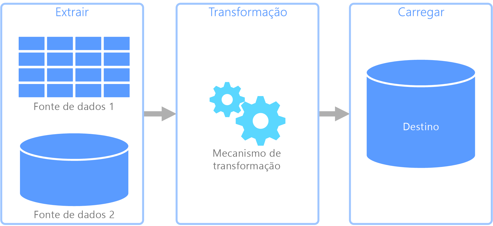

# ETL (extrair, transformar e carregar)Extract, transform, and load (ETL)

Um problema comum que as organizações enfrentam é como coletar dados de várias fontes, em vários formatos e movê-los para um ou mais armazenamentos de dados.A common problem that organizations face is how to gathering data from multiple sources, in multiple formats, and move it to one or more data stores. O destino pode não ser o mesmo tipo de armazenamento de dados da origem e, geralmente, o formato é diferente ou os dados precisam ser formatados ou limpos antes de serem carregados em seu destino final.The destination may not be the same type of data store as the source, and often the format is different, or the data needs to be shaped or cleaned before loading it into its final destination.

Várias ferramentas, serviços e processos foram desenvolvidos ao longo dos anos para ajudar a solucionar esses desafios.Various tools, services, and processes have been developed over the years to help address these challenges. Não importa o processo utilizado, há uma necessidade comum de coordenar o trabalho e aplicar um nível de transformação de dados ao pipeline de dados.No matter the process used, there is a common need to coordinate the work and apply some level of data transformation within the data pipeline. As seções a seguir destacam os métodos comuns usados para executar essas tarefas.The following sections highlight the common methods used to perform these tasks.

## ETL (extrair, transformar e carregar)Extract, transform, and load (ETL)

O ETL (extração, transformação e carregamento) é um pipeline de dados usado para coletar dados de várias fontes, transformar os dados de acordo com as regras de negócio e carregá-los em um armazenamento de dados de destino.Extract, transform, and load (ETL) is a data pipeline used to collect data from various sources, transform the data according to business rules, and load it into a destination data store. O trabalho de transformação no ETL ocorre em um mecanismo especializado e, geralmente, envolve o uso de tabelas de preparo para armazenar os dados temporariamente enquanto eles são transformados e, por fim, carregados em seu destino.The transformation work in ETL takes place in a specialized engine, and often involves using staging tables to temporarily hold data as it is being transformed and ultimately loaded to its destination.

A transformação de dados ocorrida geralmente envolve diversas operações, como filtragem, classificação, agregação, junção de dados, limpeza de dados, eliminação de duplicação e validação de dados.The data transformation that takes place usually involves various operations, such as filtering, sorting, aggregating, joining data, cleaning data, deduplicating, and validating data.

Com frequência, as três fases de ETL são executadas em paralelo para economizar tempo.Often, the three ETL phases are run in parallel to save time. Por exemplo, enquanto os dados estão sendo extraídos, um processo de transformação pode trabalhar nos dados já recebidos e prepará-los o para carregamento e um processo de carregamento pode começar a trabalhar com os dados preparados, em vez de aguardar a conclusão de todo o processo de extração.For example, while data is being extracted, a transformation process could be working on data already received and prepare it for loading, and a loading process can begin working on the prepared data, rather than waiting for the entire extraction process to complete.

Serviço do Azure relevante:Relevant Azure service:
- [Azure Data Factory v2Azure Data Factory v2](https://azure.microsoft.com/services/data-factory/)

Outras ferramentas:Other tools:
- [SQL Server Integration Services (SSIS)SQL Server Integration Services (SSIS)](/sql/integration-services/sql-server-integration-services)

## ELT (extração, carregamento e transformação)Extract, load, and transform (ELT)

O ELT (extração, carregamento e transformação) difere do ETL somente no local em que ocorre a transformação.Extract, load, and transform (ELT) differs from ETL solely in where the transformation takes place. No pipeline de ELT, a transformação ocorre no armazenamento de dados de destino.In the ELT pipeline, the transformation occurs in the target data store. Em vez de usar um mecanismo de transformação separado, as funcionalidades de processamento do armazenamento de dados de destino são usadas para transformar os dados.Instead of using a separate transformation engine, the processing capabilities of the target data store are used to transform data. Isso simplifica a arquitetura pela remoção do mecanismo de transformação do pipeline.This simplifies the architecture by removing the transformation engine from the pipeline. Outro benefício dessa abordagem é que o dimensionamento do armazenamento de dados de destino também dimensiona o desempenho do pipeline ELT.Another benefit to this approach is that scaling the target data store also scales the ELT pipeline performance. No entanto, o ELT só funciona bem quando o sistema de destino é poderoso o suficiente para transformar os dados com eficiência.However, ELT only works well when the target system is powerful enough to transform the data efficiently.

Os casos típicos de uso do ELT se enquadram no âmbito do Big Data.Typical use cases for ELT fall within the big data realm. Por exemplo, você pode começar com a extração de todos os dados de origem em arquivos simples em um armazenamento escalonável, como o HDFS (sistema de arquivos distribuído do Hadoop) ou o Azure Data Lake Store.For example, you might start by extracting all of the source data to flat files in scalable storage such as Hadoop distributed file system (HDFS) or Azure Data Lake Store. Tecnologias, como o Spark, Hive ou PolyBase, podem então ser usadas para consultar os dados de origem.Technologies such as Spark, Hive, or PolyBase can then be used to query the source data. O ponto-chave do ELT é que o armazenamento de dados usado para executar a transformação é o mesmo armazenamento de dados no qual os dados são, em última análise, consumidos.The key point with ELT is that the data store used to perform the transformation is the same data store where the data is ultimately consumed. Esse armazenamento de dados lê diretamente do armazenamento escalonável, em vez de carregar os dados em seu próprio armazenamento proprietário.This data store reads directly from the scalable storage, instead of loading the data into its own proprietary storage. Essa abordagem ignora a etapa de cópia de dados presente no ETL, que pode ser uma operação demorada para conjuntos grandes de dados.This approach skips the data copy step present in ETL, which can be a time consuming operation for large data sets.

Na prática, o armazenamento de dados de destino é um [data warehouse](./data-warehousing.md) que usa um cluster Hadoop (usando o Hive ou o Spark) ou um SQL Data Warehouse.In practice, the target data store is a [data warehouse](./data-warehousing.md) using either a Hadoop cluster (using Hive or Spark) or a SQL Data Warehouse. Em geral, um esquema é sobreposto sobre os dados de arquivo simples no momento da consulta e armazenado como uma tabela, permitindo que os dados sejam consultados como qualquer outra tabela no armazenamento de dados.In general, a schema is overlaid on the flat file data at query time and stored as a table, enabling the data to be queried like any other table in the data store. Elas são conhecidas como tabelas externas porque os dados não residem no armazenamento gerenciado pelo próprio armazenamento de dados, mas em algum armazenamento escalonável externo.These are referred to as external tables because the data does not reside in storage managed by the data store itself, but on some external scalable storage. 

O armazenamento de dados somente gerencia o esquema dos dados e aplica o esquema na leitura.The data store only manages the schema of the data and applies the schema on read. Por exemplo, um cluster Hadoop que usa o Hive descreverá uma tabela do Hive em que a fonte de dados é efetivamente um caminho para um conjunto de arquivos no HDFS.For example, a Hadoop cluster using Hive would describe a Hive table where the data source is effectively a path to a set of files in HDFS. No SQL Data Warehouse, o PolyBase pode obter o mesmo resultado &mdash; criando uma tabela com os dados armazenados externamente ao próprio banco de dados.In SQL Data Warehouse, PolyBase can achieve the same result &mdash; creating a table against data stored externally to the database itself. Quando os dados de origem são carregados, os dados presentes nas tabelas externas podem ser processados usando as funcionalidades do armazenamento de dados.Once the source data is loaded, the data present in the external tables can be processed using the capabilities of the data store. Em cenários de Big Data, isso significa que o armazenamento de dados tem a capacidade de MPP (processamento paralelo maciço), que divide os dados em partes menores e distribui o processamento das partes entre vários computadores em paralelo.In big data scenarios, this means the data store must be capable of massively parallel processing (MPP), which breaks the data into smaller chunks and distributes processing of the chunks across multiple machines in parallel.

Normalmente, a fase final do pipeline ELT é transformar os dados de origem em um formato final que é mais eficiente para os tipos de consultas que precisam de suporte.The final phase of the ELT pipeline is typically to transform the source data into a final format that is more efficient for the types of queries that need to be supported. Por exemplo, os dados podem ser particionados.For example, the data may be partitioned. Além disso, o ELT pode usar formatos de armazenamento otimizados como o Parquet, que armazena dados orientados por linha em uma forma de coluna e fornece indexação otimizada.Also, ELT might use optimized storage formats like Parquet, which stores row-oriented data in a columnar fashion and providess optimized indexing. 

Serviço do Azure relevante:Relevant Azure service:

- [SQL Data Warehouse do AzureAzure SQL Data Warehouse](/azure/sql-data-warehouse/sql-data-warehouse-overview-what-is)
- [HDInsight com HiveHDInsight with Hive](/azure/hdinsight/hadoop/hdinsight-use-hive)
- [Azure Data Factory v2Azure Data Factory v2](https://azure.microsoft.com/services/data-factory/)
- [Oozie no HDInsightOozie on HDInsight](/azure/hdinsight/hdinsight-use-oozie-linux-mac)

Outras ferramentas:Other tools:

- [SQL Server Integration Services (SSIS)SQL Server Integration Services (SSIS)](/sql/integration-services/sql-server-integration-services)

## Fluxo de dados e fluxo de controleData flow and control flow

No contexto de pipelines de dados, o fluxo de controle garante o processamento ordenado de um conjunto de tarefas.In the context of data pipelines, the control flow ensures orderly processing of a set of tasks. Para impor a ordem de processamento correta dessas tarefas, restrições de precedência são usadas.To enforce the correct processing order of these tasks, precedence constraints are used. Considere essas restrições como conectores em um diagrama de fluxo de trabalho, conforme mostrado na imagem abaixo.You can think of these constraints as connectors in a workflow diagram, as shown in the image below. Cada tarefa tem um resultado, como êxito, falha ou conclusão.Each task has an outcome, such as success, failure, or completion. Qualquer tarefa posterior não inicia o processamento até que seu predecessor tenha concluído com um desses resultados.Any subsequent task does not initiate processing until its predecessor has completed with one of these outcomes.

Os fluxos de controle executam fluxos de dados como uma tarefa.Control flows execute data flows as a task. Em uma tarefa de fluxo de dados, os dados são extraídos de uma fonte, transformados ou carregados em um armazenamento de dados.In a data flow task, data is extracted from a source, transformed, or loaded into a data store. A saída de uma tarefa de fluxo de dados pode ser a entrada para a próxima tarefa de fluxo de dados e os fluxos de dados podem ser executados em paralelo.The output of one data flow task can be the input to the next data flow task, and data flowss can run in parallel. Ao contrário de fluxos de controle, não é possível adicionar restrições entre tarefas em um fluxo de dados.Unlike control flows, you cannot add constraints between tasks in a data flow. No entanto, é possível adicionar um visualizador de dados para observar os dados conforme eles são processados por cada tarefa.You can, however, add a data viewer to observe the data as it is processed by each task.

No diagrama acima, há várias tarefas dentro do fluxo de controle, cada uma sendo uma tarefa de fluxo de dados.In the diagram above, there are several tasks within the control flow, one of which is a data flow task. Uma das tarefas é aninhada em um contêiner.One of the tasks is nested within a container. Os contêineres podem ser usados para fornecer estrutura às tarefas, fornecendo uma unidade de trabalho.Containers can be used to provide structure to tasks, providing a unit of work. Um exemplo disso são elementos de repetição em uma coleção, como arquivos em uma pasta ou instruções de banco de dados.One such example is for repeating elements within a collection, such as files in a folder or database statements.

Serviço do Azure relevante:Relevant Azure service:
- [Azure Data Factory v2Azure Data Factory v2](https://azure.microsoft.com/services/data-factory/)

Outras ferramentas:Other tools:
- [SQL Server Integration Services (SSIS)SQL Server Integration Services (SSIS)](/sql/integration-services/sql-server-integration-services)

## Opções de tecnologiaTechnology choices

- [Armazenamentos de dados OLTP (Processamento de Transações Online)Online Transaction Processing (OLTP) data stores](../technology-choices/oltp-data-stores.md)
- [Armazenamentos de dados OLAP (processamento analítico online)Online Analytical Processing (OLAP) data stores](../technology-choices/olap-data-stores.md)
- [Data warehousesData warehouses](../technology-choices/data-warehouses.md)
- [Orquestração de pipelinePipeline orchestration](../technology-choices/pipeline-orchestration-data-movement.md)
