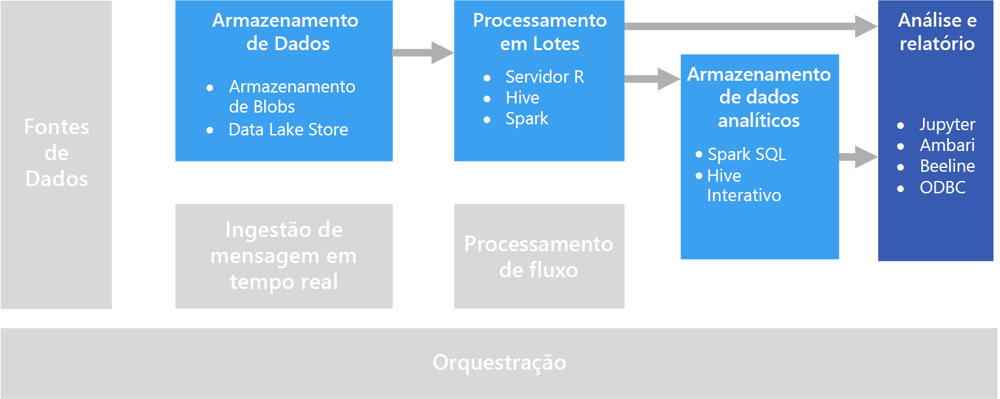

# Exploração interativa de dados

Em muitas soluções corporativas de BI (business intelligence), os relatórios e modelos semânticos são criados por especialistas em BI e gerenciados de forma centralizada. No entanto, cada vez mais as organizações desejam permitir que os usuários tomem decisões controladas por dados. Além disso, um número cada vez maior de organizações está contratando *cientistas de dados* ou *analistas de dados*, cujo trabalho é explorar os dados de forma interativa e aplicar modelos estatísticos e técnicas analíticas para encontrar tendências e padrões nos dados. A exploração interativa dos dados exige ferramentas e plataformas que fornecem processamento de baixa latência para visualizações de dados e consultas ad hoc.

## BI de autoatendimento

BI de autoatendimento é um nome atribuído a uma abordagem moderna de tomada de decisões de negócios em que os usuários são capacitados a encontrar, explorar e compartilhar insights de dados em toda a empresa. Para fazer isso, a solução de dados precisa dar suporte a vários requisitos:

- Descoberta de fontes de dados de negócios por meio de um catálogo de dados.
- Gerenciamento de dados mestre para garantir a consistência de definições e valores de entidade de dados.
- Ferramentas de visualização e modelagem interativa de dados para usuários empresariais.

Em uma solução de BI de autoatendimento, os usuários empresariais normalmente encontram e consomem fontes de dados que são relevantes para sua área específica da empresa e usam ferramentas intuitivas e aplicativos de produtividade para definir modelos de dados pessoais e relatórios que podem ser compartilhados com seus colegas.

Serviços do Azure relevantes:

- [Catálogo de Dados do Azure](/azure/data-catalog/data-catalog-what-is-data-catalog)
- [Microsoft Power BI](https://powerbi.microsoft.com/)

## Experimentação de ciência de dados

Quando uma organização exige a análise avançada e a modelagem preditiva, o trabalho de preparação inicial normalmente é realizado por cientistas de dados especializados. Um cientista de dados explora os dados e aplica técnicas analíticas estatísticas para encontrar relações entre *recursos* de dados e os *rótulos* previstos desejados. A exploração de dados geralmente é feita com linguagens de programação, como o Python ou o R, que dão suporte nativo à visualização e modelagem estatística. Os scripts usados para explorar os dados normalmente são hospedados em ambientes especializados, como o Jupyter Notebooks. Essas ferramentas permitem que os cientistas de dados explorem os dados de forma programática, enquanto documentam e compartilham os insights encontrados.

Serviços do Azure relevantes:

- [Azure Notebooks](https://notebooks.azure.com/)
- [Azure Machine Learning Studio](/azure/machine-learning/studio/what-is-ml-studio)
- [Serviços de Experimentação do Azure Machine Learning](/azure/machine-learning/preview/experimentation-service-configuration)
- [A Máquina Virtual de Ciência de Dados](/azure/machine-learning/data-science-virtual-machine/overview)

## Desafios

- **Conformidade de privacidade de dados**. Você precisa ter cuidado ao disponibilizar dados pessoais para os usuários para análise e relatórios de autoatendimento. Provavelmente, há considerações de conformidade, devido a políticas organizacionais e também a questões regulatórias.

- **Volume de dados**. Embora possa ser útil fornecer aos usuários o acesso à fonte de dados completa, isso poderá resultar em operações do Excel ou Power BI de execução muito longa ou consultas Spark SQL que usam muitos recursos de cluster.

- **Conhecimento do usuário**. Os usuários criar suas próprias consultas e agregações para informar decisões de negócios. Você tem certeza de que os usuários têm as competências analíticas e de consulta necessárias para obter resultados precisos?

- **Compartilhamento de resultados**. Poderá haver considerações de segurança se os usuários puderem criar e compartilhar relatórios ou visualizações de dados.

## Arquitetura

Embora a meta deste cenário seja dar suporte à análise interativa de dados, as tarefas de limpeza de dados, amostragem e estruturação envolvidas na ciência de dados geralmente incluem processos de execução longa. Isso torna uma arquitetura de [processamento em lotes](../big-data/batch-processing.md) apropriada.

## Opções de tecnologia

As tecnologias a seguir são opções recomendadas de exploração interativa de dados no Azure.

### Armazenamento de dados

- **Contêineres do Azure Storage Blob** ou **Azure Data Lake Store**. Os cientistas de dados geralmente trabalham com os dados brutos de origem, para garantir que tenham acesso a todos os possíveis recursos, exceções e erros nos dados. Em um cenário de Big Data, esses dados normalmente assumem a forma de arquivos em um armazenamento de dados.

Para obter mais informações, consulte [Armazenamento de dados](../technology-choices/data-storage.md).

### Processamento em lotes

- **R Server** ou **Spark**. A maioria dos cientistas de dados usa linguagens de programação com suporte forte a pacotes matemáticos e estatísticos, como o R ou o Python. Ao trabalhar com grandes volumes de dados, você pode reduzir a latência usando plataformas que permitem que essas linguagens usem o processamento distribuído. O R Server pode ser usado sozinho ou em conjunto com o Spark para escalar horizontalmente as funções de processamento do R e o Spark dá suporte nativo ao Python para funcionalidades de escala horizontal semelhantes nessa linguagem.
- **Hive**. O Hive é uma boa opção para transformar os dados usando uma semântica semelhante ao SQL. Os usuários podem criar e carregar tabelas usando instruções do HiveQL, que são semanticamente semelhantes ao SQL.

Para obter mais informações, consulte [Processamento em lotes](../technology-choices/batch-processing.md).

### Armazenamento de Dados Analíticos

- **Spark SQL**. O Spark SQL é uma API baseada no Spark que dá suporte à criação de dataframes e tabelas que podem ser consultados com a sintaxe SQL. Independentemente de os arquivos de dados a serem analisados serem arquivos de origem brutos ou novos arquivos que foram limpos e preparados por um processo em lote, os usuários podem definir tabelas do Spark SQL neles para a consulta posterior de uma análise.

- **Hive**. Além dos dados brutos de processamento em lotes com o Hive, você pode criar um banco de dados do Hive que contém tabelas e exibições do Hive com base nas pastas em que os dados estão armazenados, permitindo consultas interativas para análise e relatórios. O HDInsight inclui um tipo de cluster do Hive Interativo que usa o cache em memória para reduzir os tempos de resposta da consulta do Hive. Os usuários que estão familiarizados com a sintaxe semelhante ao SQL podem usar o Hive Interativo para explorar os dados.

Para obter mais informações, consulte [Armazenamentos de dados analíticos](../technology-choices/analytical-data-stores.md).

### Análise e relatórios

- **Jupyter**. O Jupyter Notebooks fornece uma interface baseada em navegador para executar o código em linguagens como o R, Python ou Scala. Ao usar o R Server ou o Spark para processar dados em lotes ou ao usar o Spark SQL para definir um esquema de tabelas para consulta, o Jupyter pode ser uma boa opção para consultar os dados. Ao usar o Spark, você pode usar a API de dataframe padrão do Spark ou a API do Spark SQL, bem como instruções inseridas do SQL, para consultar os dados e gerar visualizações.

- **Aprofundar-se**. Caso queira executar exploração de dados ad hoc, o [Apache Drill](https://drill.apache.org/) é um mecanismo de consulta SQL livre de esquema. Como ele não requer um esquema, é possível consultar dados de uma variedade de fontes de dados e o mecanismo automaticamente reconhecerá a estrutura dos dados.  Você pode usar a análise com o Armazenamento de Blobs do Azure por meio do [Plug-in de Armazenamento de Blobs do Azure](https://drill.apache.org/docs/azure-blob-storage-plugin/). Isso permite executar consultas em relação aos dados no Armazenamento de Blobs sem a necessidade de mover os dados.

- **Clientes do Hive Interativo**. Caso você use um cluster do Hive Interativo para consultar os dados, use a exibição do Hive no painel do cluster Ambari, a ferramenta de linha de comando Beeline ou qualquer ferramenta baseada em ODBC (usando o driver ODBC do Hive), como o Microsoft Excel ou o Power BI.

Para obter mais informações, consulte [Tecnologia de relatórios e análise de dados](../technology-choices/analysis-visualizations-reporting.md).
