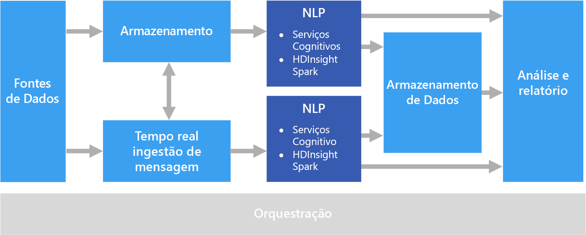

# Processamento de idioma natural

O NLP (processamento de idioma natural) é usado para tarefas, como análise de sentimento, detecção de tópico, detecção de idioma, extração de frases-chave e categorização de documentos.

## Quando usar esta solução

O NLP pode ser usado para classificar documentos, como a rotulagem de documentos como confidenciais ou spam. O resultado do NLP pode ser usado para processamento ou pesquisa posteriores. Outro uso do NLP é resumir o texto identificando as entidades presentes no documento. Essas entidades também podem ser usadas para marcar documentos com palavras-chave, o que permite a pesquisa e recuperação com base no conteúdo. As entidades podem ser combinadas em tópicos, com resumos que descrevem os tópicos importantes presentes em cada documento. Os tópicos detectados podem ser usados para categorizar os documentos para navegação ou enumerar documentos relacionados, considerando um tópico selecionado. Outro uso do NLP é pontuar um texto em relação ao sentimento, a fim de avaliar o caráter positivo ou negativo de um documento. Essas abordagens usam muitas técnicas do processamento de idioma natural, como:

- **Gerador de token**. Divisão do texto em palavras ou frases.
- **Lematização**. Normalização de palavras, de modo que diferentes formas sejam mapeadas para a palavra canônica com o mesmo significado. Por exemplo, "correndo" e "correu" mapeados para "correr".
- **Extração de entidade**. Identificação de sujeitos no texto.
- **Detecção de parte do discurso**. Identificação do texto como um verbo, substantivo, particípio, sintagma verbal e assim por diante.
- **Detecção de limites de sentenças**. Detecção de frases completas em parágrafos de texto.

Ao usar o NLP para extrair informações e insights de um texto de forma livre, o ponto de partida costuma ser os documentos brutos armazenados no armazenamento de objetos, como o Armazenamento do Azure ou o Azure Data Lake Store.

## Desafios

- Normalmente, o processamento de uma coleção de documentos de texto de forma livre apresenta um uso computacionalmente intensivo de recursos, além de ser demorado.
- Sem um formato de documento padronizado, pode ser difícil obter resultados consistentemente precisos usando o processamento de texto de forma livre para extrair fatos específicos de um documento. Por exemplo, considere uma representação de texto de uma fatura &mdash; pode ser difícil criar um processo que extraia corretamente a data e o número da fatura de faturas em qualquer quantidade de fornecedores.

## Arquitetura

Em uma solução NLP, o processamento de texto de forma livre é executado em documentos que contêm parágrafos de texto. A arquitetura geral pode ser uma arquitetura de [processamento em lotes](../big-data/batch-processing.md) ou de [processamento de fluxo em tempo real](../big-data/real-time-processing.md).

O processamento real varia de acordo com o resultado desejado, mas em termos do pipeline, o NLP pode ser aplicado em lotes ou em tempo real. Por exemplo, a análise de sentimento pode ser usada em blocos de texto para produzir uma pontuação de sentimento. Isso pode ser feito com a execução de um processo em lotes nos dados do armazenamento ou em tempo real usando partes menores de dados que fluem por meio de um serviço de mensagens.

## Opções de tecnologia

- [Processamento de idioma natural](../technology-choices/natural-language-processing.md)
