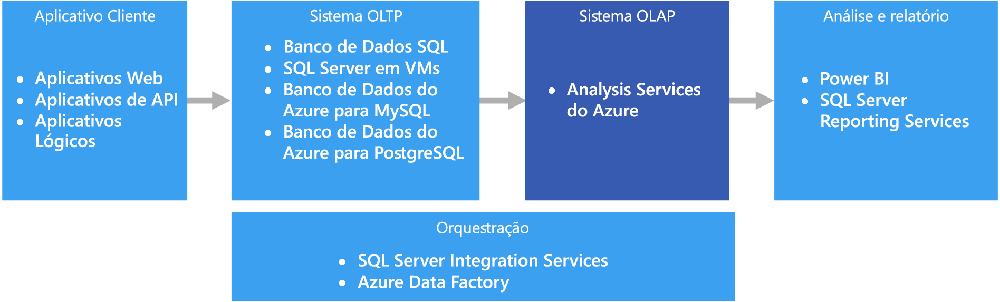

# OLAP (processamento analítico online)

O OLAP (processamento analítico online) é uma tecnologia que organiza bancos de dados comerciais grandes e dá suporte à análise complexa. Ele pode ser usado para executar consultas analíticas complexas sem prejudicar sistemas transacionais.

Os bancos de dados que uma empresa usa para armazenar todas as suas transações e registros são chamados bancos de dados [OLTP (processamento de transações online)](online-transaction-processing.md). Esses bancos de dados geralmente têm registros que são inseridos individualmente. Muitas vezes, eles contêm uma grande quantidade de informações que são importantes para a organização. No entanto, os bancos de dados que são usados para OLTP não foram projetados para análise. Portanto, a recuperação de respostas com base nesses bancos de dados é cara em termos de tempo e esforço. Os sistemas OLAP foram projetados para ajudar a extrair essas informações de business intelligence dos dados de uma maneira com alto desempenho. Isso ocorre porque os bancos de dados OLAP são otimizados para cargas de trabalho com leitura intensa e com pouca gravação.

 

## Quando usar esta solução

Considere o uso do OLAP nos seguintes cenários:

- Você precisa executar consultas analíticas e ad hoc complexas rapidamente, sem prejudicar os sistemas OLTP. 
- Você deseja fornecer aos usuários empresariais uma maneira simples de gerar relatórios com base em seus dados
- Você deseja fornecer várias agregações que permitirão aos usuários obter resultados consistentes e rápidos. 

O OLAP é especialmente útil para aplicação de cálculos de agregação em grandes quantidades de dados. Os sistemas OLAP são otimizados para cenários com leitura intensa, como análise e business intelligence. O OLAP permite aos usuários segmentar dados multidimensionais em fatias que podem ser exibidas em duas dimensões (como uma tabela dinâmica) ou filtrar os dados por valores específicos. Esse processo, às vezes, é chamado de "segmentar e analisar" os dados e pode ser feito independentemente se os dados são particionados em várias fontes de dados. Isso ajuda os usuários a localizar tendências, identificar padrões e explorar os dados sem precisar saber os detalhes da análise de dados tradicional.

Os [modelos semânticos](../concepts/semantic-modeling.md) podem ajudar os usuários empresariais a abstrair complexidades de relações e facilitar a análise rápida dos dados.

## Desafios

Para todos os benefícios oferecidos pelos sistemas OLAP, eles trazem alguns desafios:

- Enquanto os dados em sistemas OLTP são atualizados constantemente por meio de transações que fluem de várias fontes, os armazenamentos de dados OLAP geralmente são atualizados em intervalos muito mais lentos, dependendo das necessidades de negócios. Isso significa que os sistemas OLAP são mais adequados para decisões de negócios estratégicas, em vez de respostas imediatas a mudanças. Além disso, um nível de limpeza de dados e orquestração precisa ser planejado para manter os armazenamentos de dados OLAP atualizados.
- Ao contrário das tabelas relacionais e normalizadas tradicionais encontradas em sistemas OLTP, os modelos de dados OLAP tendem a ser multidimensionais. Isso dificulta ou impossibilita o mapeamento direto para modelos de relação-entidade ou orientados a objetos, em que cada atributo é mapeado para uma coluna. Em vez disso, os sistemas OLAP normalmente usam um esquema estrela ou floco de neve no lugar da normalização tradicional.

## OLAP no Azure

No Azure, os dados mantidos em sistemas OLTP, como o Banco de Dados SQL do Azure, são copiados para o sistema OLAP, como o [Azure Analysis Services](/azure/analysis-services/analysis-services-overview). Ferramentas de exploração e visualização de dados como o [Power BI](https://powerbi.microsoft.com), Excel e opções de terceiros se conectam aos servidores do Analysis Services e fornecem aos usuários informações altamente interativas e visualmente ricas sobre os dados modelados. O fluxo de dados dos dados OLTP para o OLAP geralmente é orquestrado com o SQL Server Integration Services, que pode ser executado por meio do [Azure Data Factory](/azure/data-factory/concepts-integration-runtime).

## Opções de tecnologia

- [Armazenamentos de dados OLAP (processamento analítico online)](../technology-choices/olap-data-stores.md)

