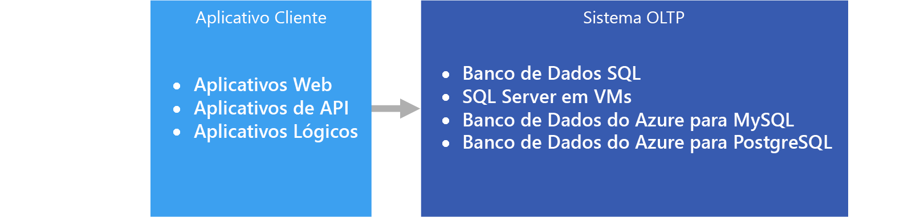

# OLTP (processamento de transações online)Online transaction processing (OLTP)

O gerenciamento de [dados transacionais](../concepts/transactional-data.md) com sistemas de computador é conhecido como OLTP (Processamento de Transações Online).The management of [transactional data](../concepts/transactional-data.md) using computer systems is referred to as Online Transaction Processing (OLTP). Os sistemas OLTP registram as interações de negócios conforme elas ocorrem na operação diária da organização e dão suporte à consulta desses dados para criar inferências.OLTP systems record business interactions as they occur in the day-to-day operation of the organization, and support querying of this data to make inferences.

## Quando usar esta soluçãoWhen to use this solution

Escolha o OLTP quando precisar processar e armazenar transações comerciais com eficiência, disponibilizando-as imediatamente para aplicativos cliente de uma maneira consistente.Choose OLTP when you need to efficiently process and store business transactions and immediately make them available to client applications in a consistent way. Use essa arquitetura quando um atraso tangível no processamento tiver um impacto negativo sobre as operações diárias da empresa.Use this architecture when any tangible delay in processing would have a negative impact on the day-to-day operations of the business.

Os sistemas OLTP foram projetados para processar e armazenar transações com eficiência, bem como consultar dados transacionais.OLTP systems are designed to efficiently process and store transactions, as well as query transactional data. A meta de processar e armazenar transações individuais com eficiência por um sistema OLTP é parcialmente realizada pela normalização de dados &mdash; ou seja, sua divisão em partes menores que são menos redundantes.The goal of efficiently processing and storing individual transactions by an OLTP system is partly accomplished by data normalization &mdash; that is, breaking the data up into smaller chunks that are less redundant. Isso dá suporte à eficiência, porque permite que o sistema OLTP processe grandes quantidades de transações de forma independente e evita o processamento extra necessário para manter a integridade dos dados na presença de dados redundantes.This supports efficiency because it enables the OLTP system to process large numbers of transactions independently, and avoids extra processing needed to maintain data integrity in the presence of redundant data.

## DesafiosChallenges
A implementação e o uso de um sistema OLTP pode apresentar alguns desafios:Implementing and using an OLTP system can create a few challenges:

- Os sistemas OLTP nem sempre são bons para manipular agregações em grandes volumes de dados, embora haja exceções, como uma solução bem planejada baseada no SQL Server.OLTP systems are not always good for handling aggregates over large amounts of data, although there are exceptions, such as a well-planned SQL Server-based solution. A análise dos dados, que se baseia em cálculos de agregação em milhões de transações individuais, faz uso muito intensivo de recursos de um sistema OLTP.Analytics against the data, that rely on aggregate calculations over millions of individual transactions, are very resource intensive for an OLTP system. Eles podem ser lentos para serem executados e podem causar lentidão, bloqueando outras transações no banco de dados.They can be slow to execute and can cause a slow-down by blocking other transactions in the database.
- Ao realizar a análise e os relatórios sobre dados altamente normalizados, as consultas tendem a ser complexas, pois a maioria das consultas precisa desnormalizar os dados usando junções.When conducting analytics and reporting on data that is highly normalized, the queries tend to be complex, because most queries need to de-normalize the data by using joins. Além disso, as convenções de nomenclatura para objetos de banco de dados em sistemas OLTP tendem a ser concisas e sucintas.Also, naming conventions for database objects in OLTP systems tend to be terse and succinct. O aumento da normalização, juntamente com convenções de nomenclatura concisas, dificulta a consulta dos sistemas OLTP por parte dos usuários empresariais, sem a ajuda de um DBA ou desenvolvedor de dados.The increased normalization coupled with terse naming conventions makes OLTP systems difficult for business users to query, without the help of a DBA or data developer.
- O armazenamento do histórico de transações por tempo indeterminado e o armazenamento de excesso de dados em uma tabela qualquer podem levar à redução do desempenho da consulta, dependendo da quantidade de transações armazenadas.Storing the history of transactions indefinitely and storing too much data in any one table can lead to slow query performance, depending on the number of transactions stored. A solução comum é manter uma janela de tempo relevante (como o ano fiscal atual) no sistema OLTP e descarregar dados históricos em outros sistemas, como um data mart ou [data warehouse](../technology-choices/data-warehouses.md).The common solution is to maintain a relevant window of time (such as the current fiscal year) in the OLTP system and offload historical data to other systems, such as a data mart or [data warehouse](../technology-choices/data-warehouses.md).

## OLTP no AzureOLTP in Azure

Aplicativos, como sites hospedados em [Aplicativos Web do Serviço de Aplicativo](/azure/app-service/app-service-web-overview), APIs REST em execução no Serviço de Aplicativo ou aplicativos móveis ou da área de trabalho, se comunicam com o sistema OLTP, normalmente por meio de um intermediário da API REST.Applications such as websites hosted in [App Service Web Apps](/azure/app-service/app-service-web-overview), REST APIs running in App Service, or mobile or desktop applications communicate with the OLTP system, typically via a REST API intermediary.

Na prática, a maioria das cargas de trabalho não é puramente OLTP.In practice, most workloads are not purely OLTP. Também há uma tendência de existir um [componente analítico](../scenarios/online-analytical-processing.md).There tends to be an [analytical component](../scenarios/online-analytical-processing.md) as well. Além disso, há uma demanda cada vez maior por relatórios em tempo real, como a execução de relatórios no sistema operacional.In addition, there is an increasing demand for real-time reporting, such as running reports against the operational system. Isso também é chamado de HTAP (Processamento Transacional e Analítico Híbrido).This is also referred to as HTAP (Hybrid Transactional and Analytical Processing). Para obter mais informações, consulte [Armazenamentos de dados OLAP (Processamento Analítico Online)](../technology-choices/olap-data-stores.md).For more information, see [Online Analytical Processing (OLAP) data stores](../technology-choices/olap-data-stores.md).

## Opções de tecnologiaTechnology choices

Armazenamento de dados:Data storage:

- [Banco de Dados SQL do AzureAzure SQL Database](/azure/sql-database/)
- [SQL Server em uma VM do AzureSQL Server in an Azure VM](/azure/virtual-machines/windows/sql/virtual-machines-windows-sql-server-iaas-overview?toc=%2Fazure%2Fvirtual-machines%2Fwindows%2Ftoc.json)
- [Banco de Dados do Azure para MySQLAzure Database for MySQL](/azure/mysql/)
- [Banco de Dados do Azure para PostgreSQLAzure Database for PostgreSQL](/azure/postgresql/)

Para obter mais informações, consulte [Escolhendo um armazenamento de dados OLTP](../technology-choices/oltp-data-stores.md)For more information, see [Choosing an OLTP data store](../technology-choices/oltp-data-stores.md)

Fontes de dados:Data sources:

- [Serviço de aplicativoApp service](/azure/app-service/)
- [Aplicativos MóveisMobile Apps](/azure/app-service-mobile/)

