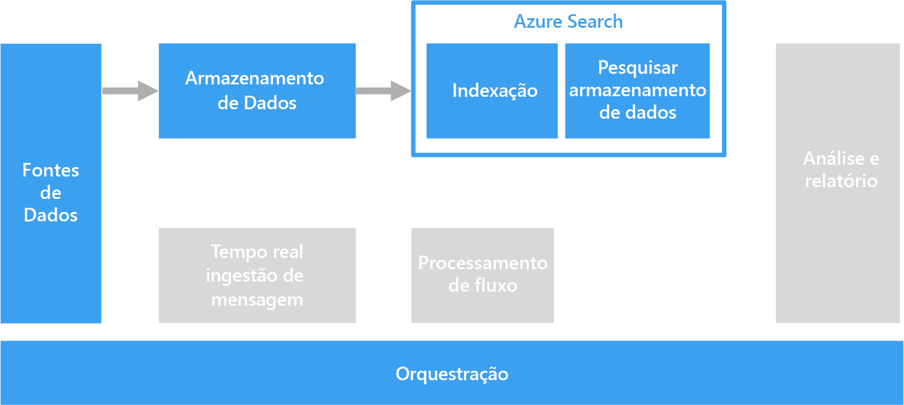

# Processando um texto de forma livre para pesquisa

Para dar suporte à pesquisa, o processamento de texto de forma livre pode ser executado em documentos que contêm parágrafos de texto.

A pesquisa de texto funciona pela construção de um índice especializado que é pré-calculado em uma coleção de documentos. Um aplicativo cliente envia uma consulta que contém os termos de pesquisa. A consulta retorna um conjunto de resultados, que consiste em uma lista de documentos classificados pela precisão de correspondência de cada documento aos critérios de pesquisa. O conjunto de resultados também pode incluir o contexto no qual o documento corresponde aos critérios, o que possibilita ao aplicativo realçar a frase correspondente no documento. 

O processamento de texto de forma livre pode produzir dados úteis e acionáveis com base em grandes quantidades de dados de texto com ruído. Os resultados podem dar a documentos não estruturados uma estrutura bem definida e que pode ser consultada.

## Desafios

- Normalmente, o processamento de uma coleção de documentos de texto de forma livre apresenta um uso computacionalmente intensivo, além de ser demorado.
- Para pesquisar um texto de forma livre com eficiência, o índice de pesquisa deve dar suporte à pesquisa difusa, com base em termos que têm uma construção semelhante. Por exemplo, os índices de pesquisa são criados com lematização e lematização linguística, de modo que as consultas de "correr" corresponderão a documentos que contêm "correu" e "correndo".

## Arquitetura

Na maioria dos cenários, os documentos de texto de origem são carregados em um armazenamento de objetos, como o Armazenamento do Azure ou o Azure Data Lake Store. Uma exceção é o uso da pesquisa de texto completo no SQL Server ou no Banco de Dados SQL do Azure. Nesse caso, os dados de documentos são carregados em tabelas gerenciadas pelo banco de dados. Depois de armazenados, os documentos são processados em um lote para criar o índice.

## Opções de tecnologia

Entre as opções para a criação de um índice de pesquisa estão o Azure Search, Elasticsearch e HDInsight com Solr. Cada uma dessas tecnologias pode popular um índice de pesquisa com base em uma coleção de documentos. O Azure Search fornece indexadores que podem popular automaticamente o índice de documentos que variam de texto sem formatação a formatos do Excel e PDF. No HDInsight, o Apache Solr pode indexar arquivos binários de muitos tipos, incluindo texto sem formatação, Word e PDF. Depois que o índice é construído, os clientes podem acessar a interface de pesquisa por meio de uma API REST. 

Se os dados de texto estiverem armazenados no SQL Server ou no Banco de Dados SQL do Azure, use a pesquisa de texto completo criada no banco de dados. O banco de dados popula o índice com base nos dados de texto, binários ou XML armazenados no mesmo banco de dados. Os clientes pesquisam por meio de consultas T-SQL. 

Para obter mais informações, consulte [Armazenamentos de dados de pesquisa](../technology-choices/search-options.md).
