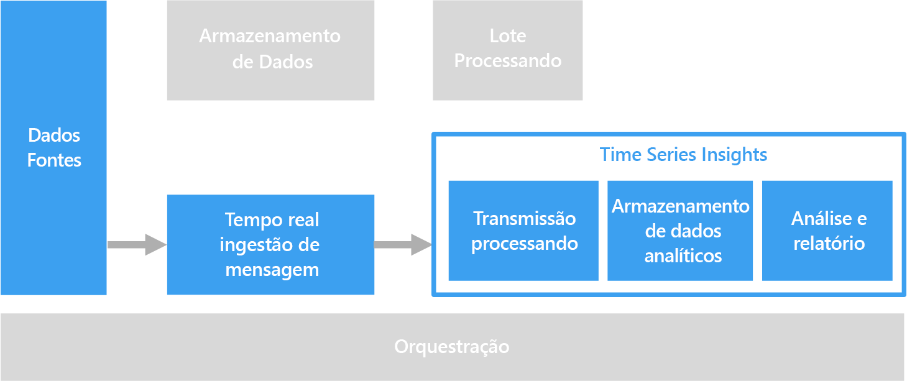

# Soluções de série temporal

Os dados de série temporal são um conjunto de valores organizados por tempo. Exemplos comuns de dados de série temporal incluem dados de sensor, preços de compra de ações, dados de fluxo de cliques e telemetria do aplicativo. Os dados de série temporal podem ser analisados quanto a tendências históricas, alertas em tempo real ou modelagem preditiva.

Dados de série temporal representam como um processo ou um ativo é alterado ao longo do tempo. Os dados têm um carimbo de data/hora, porém, o mais importante, o tempo é o eixo mais significativo para exibir ou analisar os dados. Os dados de série temporal normalmente são recebidos na ordem de tempo e geralmente são tratados como uma inserção, em vez de uma atualização do banco de dados. Por isso, a alteração é medida ao longo do tempo, permitindo que você olhe para trás e preveja uma alteração futura. Dessa forma, os dados de série temporal são mais bem visualizados com gráficos de dispersão ou de linhas.

Alguns exemplos de dados de série temporal são:

- Preços de compra de ações capturados ao longo do tempo para detectar tendências.
- Desempenho do servidor, como o uso da CPU, carga de E/S, uso de memória e consumo de largura de banda de rede.
- Telemetria de sensores em equipamentos industriais, que pode ser usada para detectar notificações de alerta de falha e gatilho de equipamentos pendentes.
- Dados telemétricos de veículos em tempo real, incluindo velocidade, frenagem e aceleração ao longo de uma janela de tempo para produzir uma pontuação de risco de agregação para o motorista.

Em cada um desses casos, você pode ver como o tempo é mais significativo como um eixo. A exibição dos eventos na ordem em que eles ocorrem é uma característica-chave dos dados de série temporal, pois há uma ordenação temporal natural. Isso é diferente dos dados capturados para pipelines de dados OLTP padrão, em que os dados podem ser inseridos em qualquer ordem e atualizados a qualquer momento.

## Quando usar esta solução

Escolha uma solução de série temporal quando precisar ingerir dados cujo valor estratégico é voltado para alterações em um período e basicamente, você inserir novos dados e raramente atualizar esses dados, caso você atualize-os. Use essas informações para detectar anomalias, visualizar tendências e comparar dados atuais com os dados históricos, entre outras coisas. Esse tipo de arquitetura também é mais adequado para modelagem preditiva e previsão de resultados, porque você tem o registro do histórico de alterações ao longo do tempo, que pode ser aplicado a qualquer quantidade de modelos de previsão.

O uso da série temporal oferece os seguintes benefícios:

- Representa claramente como um ativo ou processo é alterado ao longo do tempo.
- Ajuda a você a detectar rapidamente as alterações em uma variedade de fontes relacionadas, fazendo com que as anomalias e as tendências iminentes se destaquem com clareza.
- Mais adequado para modelagem preditiva e previsão.

### Internet das coisas (IoT)

Os dados coletados por dispositivos IoT são uma opção natural para o armazenamento e a análise de série temporal. Os dados de entrada são inseridos e raramente, ou nunca, atualizados. Os dados têm carimbo de data/hora e são inseridos na ordem em que foram recebidos. Esses dados normalmente são exibidos em ordem cronológica, permitindo aos usuários descobrir tendências, identificar anomalias e usar as informações para análise preditiva.

Para obter mais informações, consulte [Internet das Coisas](../big-data/index.md#internet-of-things-iot).

### Análise em tempo real

Os dados de série temporal costumam ser sensível ao tempo &mdash; ou seja, eles precisam ser tratados rapidamente, para identificar tendências em tempo real ou gerar alertas. Nesses cenários, qualquer atraso nos insights pode causar tempo de inatividade e impacto nos negócios. Além disso, muitas vezes, há uma necessidade de correlacionar dados de uma variedade de fontes diferentes, como sensores.

O ideal é que você tenha uma camada de processamento de fluxo que pode manipular os dados de entrada em tempo real e processar todos eles com alta granularidade e precisão. Isso nem sempre é possível, dependendo da arquitetura de streaming e dos componentes do buffer de fluxo e das camadas de processamento de fluxo. Talvez seja necessário sacrificar um pouco da precisão dos dados de série temporal reduzindo-os. Isso é feito pelo processamento de janelas de tempo deslizante (alguns segundos, por exemplo), permitindo que a camada de processamento faça cálculos em tempo hábil. Você também pode precisar reduzir e agregar os dados ao exibir longos períodos, como ampliar para exibir os dados capturados durante vários meses.

## Desafios

- Os dados de série temporal geralmente são um volume muito alto, especialmente em cenários de IoT. Armazenamento, indexação, consulta, análise e visualização de dados de série temporal podem ser um desafio.

- Pode ser um desafio encontrar a combinação certa de armazenamento de alta velocidade e operações de computação eficientes para manipular a análise em tempo real, ao mesmo tempo que minimiza o tempo de colocação no mercado e o investimento de custo geral.

## Arquitetura

Em muitos cenários que envolvem dados de série temporal, como IoT, os dados são capturados em tempo real. Dessa forma, uma arquitetura de [processamento em tempo real](../big-data/real-time-processing.md) é apropriada.

Os dados de uma ou mais fontes de dados são ingeridos na camada de fluxo de buffer pelo [Hub IoT](/azure/iot-hub/), [Hubs de Eventos](/azure/event-hubs/) ou [Kafka no HDInsight](/azure/hdinsight/kafka/apache-kafka-introduction). Em seguida, os dados são processados na camada de processamento de fluxo que, opcionalmente, pode entregar os dados processados para um serviço de aprendizado de máquina para análise preditiva. Os dados processados são armazenados em um armazenamento de dados analíticos, como o [HBase](/azure/hdinsight/hbase/apache-hbase-overview), [Azure Cosmos DB](/azure/cosmos-db/), Azure Data Lake ou Armazenamento de Blobs. Um aplicativo ou serviço de análise e relatórios, como o Power BI ou o OpenTSDB (se for armazenado no HBase) pode ser usado para exibir os dados de série temporal para análise.

Outra opção é usar o [Azure Time Series Insights](/azure/time-series-insights/). O Time Series Insights é um serviço totalmente gerenciado para dados de série temporal. Nessa arquitetura, o Time Series Insights executa as funções de processamento de fluxo, armazenamento de dados e análise e relatórios. Ele aceita os dados de streaming do Hub IoT ou dos Hubs de Eventos e armazena, processa, analisa e exibe os dados quase em tempo real. Ele não pré-agrega os dados, mas armazena os eventos brutos.

O Time Series Insights é esquema adaptável, o que significa que você não precisa fazer nenhuma preparação de dados para começar a obter insights. Isso permite que você explore, compare e correlacione uma variedade de fontes de dados diretamente. Ele também fornece filtros e agregações semelhantes ao SQL, a capacidade de construir, visualizar, comparar e sobrepor vários padrões de série temporal, mapas de calor e a capacidade de salvar e compartilhar consultas.

## Opções de tecnologia

- [Armazenamento de dados](../technology-choices/data-storage.md)
- [Análise, visualizações e relatórios](../technology-choices/analysis-visualizations-reporting.md)
- [Armazenamentos de Dados Analíticos](../technology-choices/analytical-data-stores.md)
- [Processamento de fluxo](../technology-choices/stream-processing.md)