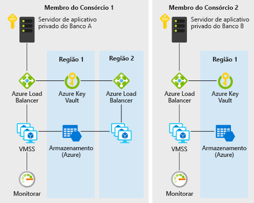

# Relação de confiança descentralizada entre bancos no AzureDecentralized trust between banks on Azure

Esse cenário de exemplo é útil para bancos ou outras instituições que desejam estabelecer um ambiente confiável para o compartilhamento sem recorrer a um banco de dados centralizado de informações.This example scenario is useful for banks or any other institutions that want to establish a trusted environment for information sharing without resorting to a centralized database. Para os fins desse exemplo, descreveremos o cenário no contexto de manutenção de informações de pontuação de crédito entre bancos. Porém, a arquitetura pode ser aplicada a qualquer cenário em que um consórcio de organizações deseje compartilhar informações validadas com outro sem recorrer ao uso de um sistema central executado por uma parte única.For the purpose of this example, we will describe the scenario in the context of maintaining credit score information between banks, but the architecture can be applied to any scenario where a consortium of organizations want to share validated information with one another without resorting to the use of a central system ran by one single party.

Tradicionalmente, os bancos em um sistema financeiro contam com fontes centralizadas, como centrais de crédito, para obter informações sobre a pontuação de crédito e o histórico de um indivíduo.Traditionally, banks within a financial system rely on centralized sources such as credit bureaus for information on an individual's credit score and history. Uma abordagem centralizada apresenta uma concentração de risco operacional e, às vezes, terceiros desnecessários.A centralized approach presents a concentration of operational risk and sometimes an unnecessary third party.

Com DLTs (tecnologia de razão distribuído), um consórcio de bancos pode estabelecer um sistema descentralizado que pode ser mais eficiente e menos suscetível a ataques e servir como uma nova plataforma, em que estruturas inovadoras podem ser implementadas para resolver desafios tradicionais referentes a privacidade, velocidade e custo.With DLTs (distributed ledger technology), a consortium of banks can establish a decentralized system that can be more efficient, less susceptible to attack, and serve as a new platform where innovative structures can be implemented to solve traditional challenges with privacy, speed, and cost.

Este exemplo mostrará como serviços do Azure, como conjuntos de dimensionamento de máquina virtual, Rede Virtual, Key Vault, Armazenamento, Balanceador de Carga e Monitor, podem ser rapidamente provisionados para a implantação de um blockchain de Ethereum PoA privado e eficiente em que os bancos membros possam estabelecer seus próprios nós.This example will show you how Azure services such as virtual machine scale sets, Virtual Network, Key Vault, Storage, Load Balancer, and Monitor can be quickly provisioned for the deployment of an efficient private Ethereum PoA blockchain where member banks can establish their own nodes.

## Casos de uso relevantesRelevant use cases

Outros casos de uso relevantes incluem:Other relevant use cases include:

- Movimentação de orçamentos alocados entre diferentes unidades de negócios de uma empresa multinacionalMovement of allocated budgets between different business units of a multinational corporation
- Pagamentos internacionaisCross-border payments
- Cenários de finanças de comércioTrade finance scenarios
- Sistemas de fidelidade que envolvem diferentes empresasLoyalty systems involving different companies
- Ecossistemas de cadeia de suprimentosSupply chain ecosystems

## ArquiteturaArchitecture

Esse cenário aborda os componentes back-end que são necessários para criar uma rede privada, escalonável, segura e monitorada de blockchain empresarial em um consórcio de dois ou mais membros.This scenario covers the back-end components that are necessary to create a scalable, secure, and monitored private, enterprise blockchain network within a consortium of two or more members. Detalhes de como esses componentes são provisionados (ou seja, em diferentes assinaturas e grupos de recursos), bem como os requisitos de conectividade (ou seja, VPN ou ExpressRoute) são deixados para sua consideração, com base nos requisitos de política de sua organização.Details of how these components are provisioned (that is, within different subscriptions and resource groups) as well as the connectivity requirements (that is, VPN or ExpressRoute) are left for your consideration based on your organization's policy requirements. Veja como os dados fluem:Here's how data flows:

1. O Banco A cria/atualiza um registro de crédito de um indivíduo, enviando uma transação para a rede de blockchain por meio de JSON-RPC.Bank A creates/updates an individual's credit record by sending a transaction to the blockchain network via JSON-RPC.
2. Os dados fluem do servidor de aplicativo privado do Banco A para o balanceador de carga do Azure e, subsequentemente, para uma VM de nó validação no conjunto de escala de máquina virtual.Data flows from Bank A's private application server to the Azure load balancer and subsequently to a validating node VM on the virtual machine scale set.
3. A rede Ethereum PoA cria um bloco em um horário predefinido (dois segundos para esse cenário).The Ethereum PoA network creates a block at a preset time (2 seconds for this scenario).
4. A transação é empacotada no bloco criado e validada em toda a rede de blockchain.The transaction is bundled into the created block and validated across the blockchain network.
5. O Banco B pode ler o registro de crédito criado pelo banco A comunicando-se com seu próprio nó da mesma forma, por meio de JSON-RPC.Bank B can read the credit record created by bank A by communicating with its own node similarly via JSON-RPC.

### ComponentesComponents

- As máquinas virtuais em conjuntos de dimensionamento de máquinas virtuais fornecem o recurso de computação sob demanda para hospedar os processos de validador para o blockchainVirtual machines within virtual machine scale sets provides the on-demand compute facility to host the validator processes for the blockchain
- O Cofre de Chaves é usado como o recurso de armazenamento seguro para as chaves privadas de cada validadorKey Vault is used as the secure storage facility for the private keys of each validator
- O Load Balancer distribui as solicitações de RPC, emparelhamento e Governança DAppLoad Balancer spreads the RPC, peering, and Governance DApp requests
- Armazenamento que hospeda informações de rede persistentes e leasing de coordenaçãoStorage hosting persistent network information and coordinating leasing
- O Operations Management Suite (um agrupamento de alguns serviços do Azure) fornece insight sobre nós disponíveis, transações por minuto e membros do consórcioOperations Management Suite (a bundling of a few Azure services) provides insight into available nodes, transactions per minute and consortium members

### AlternativasAlternatives

A abordagem de Ethereum PoA é escolhida para este exemplo porque é um ponto de entrada válido para um consórcio das organizações que desejam criar um ambiente em que informações possam ser facilmente trocadas e compartilhadas de maneira confiável, descentralizada e fácil de entender.The Ethereum PoA approach is chosen for this example because it is a good entry point for a consortium of organizations that want to create an environment where information can be exchanged and shared with one another easily in a trusted, decentralized, and easy to understand way. Os modelos de solução do Azure disponíveis também fornecem uma maneira rápida e conveniente não apenas para um líder do consórcio iniciar um blockchain Ethereum PoA, mas também para as organizações-membro do consórcio criarem seus próprios recursos do Azure em seu próprio grupo de recursos e uma assinatura para ingressar em uma rede existente.The available Azure solution templates also provide a fast and convenient way not just for a consortium leader to start an Ethereum PoA blockchain, but also for member organizations in the consortium to spin up their own Azure resources within their own resource group and subscription to join an existing network.

Para outros cenários estendidos ou diferentes, podem surgir preocupações como privacidade de transação.For other extended or different scenarios, concerns such as transaction privacy may arise. Por exemplo, em um cenário de transferência de valores mobiliários, os membros de um consórcio podem não querer que suas transações fiquem visíveis mesmo para outros membros.For example, in a securities transfer scenario, members in a consortium may not want their transactions to be visible even to other members. Existem alternativas para Ethereum PoA que abordam essas preocupações de sua própria maneira:Other alternatives to Ethereum PoA exist that addresses these concerns in their own way:

- CordaCorda
- QuorumQuorum
- HyperledgerHyperledger

## ConsideraçõesConsiderations

### DisponibilidadeAvailability

O [Azure Monitor][monitor] é usado para monitorar continuamente se há problemas na rede de blockchain e garantir a disponibilidade.[Azure Monitor][monitor] is used to continuously monitor the blockchain network for issues to ensure availability. Um link para um painel de monitoramento personalizado com base no Azure Monitor será enviado a você após a implantação bem-sucedida do modelo de solução de blockchain usado nesse cenário.A link to a custom monitoring dashboard based on Azure Monitor will be sent to you upon successful deployment of the blockchain solution template used in this scenario. O painel mostra nós que estão relatando pulsações nos últimos 30 minutos, bem como outras estatísticas úteis.The dashboard shows nodes that are reporting heartbeats in the past 30 minutes as well as other useful statistics.

Para ver outros tópicos sobre disponibilidade, consulte a [lista de verificação de disponibilidade][availability] no Azure Architecture Center.For other availability topics, see the [availability checklist][availability] in the Azure Architecture Center.

### EscalabilidadeScalability

Uma preocupação popular referente ao blockchain é o número de transações que ele pode incluir em um período de tempo predefinido.A popular concern for blockchain is the number of transactions that a blockchain can include within a preset amount of time. Esse cenário usa uma Prova de Autoridade em que tal escalabilidade pode ser gerenciada melhor do que a Prova de Trabalho.This scenario uses Proof-of-Authority where such scalability can be better managed than Proof-of-Work. Em redes com base em Prova de Autoridade, os participantes de consenso são conhecidos e gerenciados, tornando-as mais adequadas para o blockchain privado para um consórcio de organizações que conhecem umas às outras.In Proof-of-Authority&ndash;based networks, consensus participants are known and managed, making it more suitable for private blockchain for a consortium of organization that knows one another. Os parâmetros como tempo médio de bloco, transações por minuto e consumo de recursos de computação podem ser facilmente monitorados por meio do painel personalizado.Parameters such as average block time, transactions per minute and compute resource consumption can be easily monitored via the custom dashboard. Os recursos podem ser ajustados adequadamente com base nos requisitos de dimensionamento.Resources can then be adjusted accordingly based on scale requirements.

Para obter diretrizes gerais sobre como criar soluções escalonáveis, confira a [lista de verificação de escalabilidade] [ scalability] no Azure Architecture Center.For general guidance on designing scalable solutions, see the [scalability checklist][scalability] in the Azure Architecture Center.

### SegurançaSecurity

O [Azure Key Vault][vault] é usado para armazenar e gerenciar com facilidade as chaves privadas dos validadores.[Azure Key Vault][vault] is used to easily store and manage the private keys of validators. A implantação padrão neste exemplo cria uma rede de blockchain que é acessível pela internet.The default deployment in this example creates a blockchain network that is accessible via the internet. Para um cenário de produção em que uma rede privada é desejada, os membros podem ser conectados uns aos outros por meio de conexões de gateway VPN de VNet para VNet.For production scenario where a private network is desired, members can be connected to each other via VNet-to-VNet VPN gateway connections. As etapas para configurar uma VPN são incluídas na seção de recursos relacionados abaixo.The steps for configuring a VPN are included in the related resources section below.

Para obter orientação geral sobre como criar soluções seguras, confira a [Documentação de segurança do Azure][security].For general guidance on designing secure solutions, see the [Azure Security Documentation][security].

### ResiliênciaResiliency

O próprio blockchain Ethereum PoA pode fornecer alguma resiliência, pois os nós de validação podem ser implantados em regiões diferentes.The Ethereum PoA blockchain can itself provide some degree of resilience as the validator nodes can be deployed in different regions. O Azure tem opções para implantações em mais de 54 regiões em todo o mundo.Azure has options for deployments in over 54 regions worldwide. Um blockchain como o desse cenário fornece possibilidades novas e exclusivas de cooperação para aumentar a resiliência.A blockchain such as the one in this scenario provides unique and refreshing possibilities of cooperation to increase resilience. A resiliência da rede não é fornecida apenas para por um único participante centralizado, mas por todos os membros do consórcio.The resilience of the network is not just provided for by a single centralized party but all members of the consortium. Um blockchain com base em Prova de Autoridade permite que a resiliência de rede seja ainda mais planejada e deliberada.A proof-of-authority&ndash;based blockchain allows network resilience to be even more planned and deliberate.

Para obter diretrizes gerais sobre como criar soluções resilientes, confira [Projetando aplicativos resilientes para o Azure][resiliency].For general guidance on designing resilient solutions, see [Designing resilient applications for Azure][resiliency].

## PreçosPricing

Para explorar o custo de executar esse cenário, todos os serviços são pré-configurados na calculadora de custos.To explore the cost of running this scenario, all of the services are pre-configured in the cost calculator. Para ver como o preço seria alterado para seu uso específico, altere as variáveis apropriadas para que sejam correspondentes a seus requisitos de desempenho e disponibilidade esperados.To see how the pricing would change for your particular use case, change the appropriate variables to match your expected performance and availability requirements.

Fornecemos três perfis de custo de exemplo com base no número de instâncias de VM do conjunto de dimensionamento que executam seus aplicativos (as instâncias podem residir em regiões diferentes).We have provided three sample cost profiles based on the number of scale set VM instances that run your applications (the instances can reside in different regions).

- [Pequeno][small-pricing]: esse exemplo de preço refere-se a duas VMs por mês com o monitoramento desativado[Small][small-pricing]: this pricing example correlates to 2 VMs per month with monitoring turned off
- [Médio][medium-pricing]: esse exemplo de preço refere-se a sete VMs por mês com o monitoramento ativado[Medium][medium-pricing]: this pricing example correlates to 7 VMs per month with monitoring turned on
- [Grande][large-pricing]: esse exemplo de preço refere-se a 15 VMs por mês com o monitoramento ativado[Large][large-pricing]: this pricing example correlates to 15 VMs per month with monitoring turned on

Os preços acima são para um membro do consórcio iniciar ou ingressar em uma rede de blockchain.The above pricing is for one consortium member to start or join a blockchain network. Normalmente, em um consórcio em que haja várias empresas ou organizações envolvidas, cada membro receberá sua própria assinatura do Azure.Typically in a consortium where there are multiple companies or organizations involved, each member will get their own Azure subscription.

## Próximas etapasNext Steps

Para ver um exemplo desse cenário, implante o [aplicativo de demonstração de blockchain Ethereum PoA][deploy] no Azure.To see an example of this scenario, deploy the [Ethereum PoA blockchain demo application][deploy] on Azure. Em seguida, percorra o [LEIAME do código-fonte do cenário][source].Then review the [README of the scenario source code][source].

## Recursos relacionadosRelated resources

Para saber mais sobre como usar o modelo de solução de Prova de Autoridade de Ethereum para o Azure, examine este [guia de uso][guide].For more information on using the Ethereum Proof-of-Authority solution template for Azure, review this [usage guide][guide].

<!-- links -->
[small-pricing]: https://azure.com/e/4e429d721eb54adc9a1558fae3e67990
[medium-pricing]: https://azure.com/e/bb42cd77437744be8ed7064403bfe2ef
[large-pricing]: https://azure.com/e/e205b443de3e4adfadf4e09ffee30c56
[guide]: /azure/blockchain-workbench/ethereum-poa-deployment
[deploy]: https://portal.azure.com/?pub_source=email&pub_status=success#create/microsoft-azure-blockchain.azure-blockchain-ethereumethereum-poa-consortium
[source]: https://github.com/vitoc/creditscoreblockchain
[monitor]: /azure/monitoring-and-diagnostics/monitoring-overview-azure-monitor
[availability]: /azure/architecture/checklist/availability
[scalability]: /azure/architecture/checklist/scalability
[resiliency]: ../../resiliency/index.md
[security]: /azure/security/
[vault]: https://azure.microsoft.com/services/key-vault/
