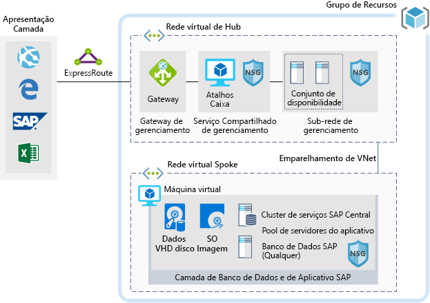

# Ambientes de desenvolvimento/teste para cargas de trabalho do SAP no AzureDev/test environments for SAP workloads on Azure

Este exemplo mostra como estabelecer um ambiente de desenvolvimento/teste do SAP NetWeaver em um ambiente Windows ou Linux no Azure.This example shows how to establish a dev/test environment for SAP NetWeaver in a Windows or Linux environment on Azure. O banco de dados usado é o AnyDB, o termo SAP para qualquer DBMS compatível (que não seja SAP HANA).The database used is AnyDB, the SAP term for any supported DBMS (that isn't SAP HANA). Como essa arquitetura foi projetada para ambientes que não são de produção, ele é implantado com somente uma máquina virtual (VM) e o seu tamanho pode ser alterado para acomodar as necessidades da sua organização.Because this architecture is designed for non-production environments, it's deployed with just a single virtual machine (VM) and it's size can be changed to accommodate your organization's needs.

Para casos de uso de produção veja as arquiteturas SAP de referência disponíveis abaixo:For production use cases review the SAP reference architectures available below:

- [SAP NetWeaver para AnyDB][sap-netweaver][SAP NetWeaver for AnyDB][sap-netweaver]
- [SAP S/4HANA][sap-hana][SAP S/4HANA][sap-hana]
- [SAP em instâncias grandes do Azure][sap-large][SAP on Azure large instances][sap-large]

## Casos de uso relevantesRelevant use cases

Outros casos de uso relevantes incluem:Other relevant use cases include:

- Cargas de trabalho do SAP não críticas e que não são de produção (área restrita, desenvolvimento, teste, garantia de qualidade)Non-critical SAP non-productive workloads (sandbox, development, test, quality assurance)
- Cargas de trabalho de negócios não críticas do SAPNon-critical SAP business workloads

## ArquiteturaArchitecture

Este cenário demonstra o provisionamento de um único banco de dados do sistema do SAP e o servidor de aplicativos SAP em uma única máquina virtual.This scenario demonstrates provisioning a single SAP system database and SAP application server on a single virtual machine. O fluxo de dados neste cenário ocorre da seguinte forma:The data flows through the scenario as follows:

1. Os clientes usam a interface do usuário do SAP ou outras ferramentas de cliente (Excel, um navegador da Web ou outro aplicativo Web) para acessar o sistema SAP com base no Azure.Customers use the SAP user interface or other client tools (Excel, a web browser, or other web application) to access the Azure-based SAP system.
2. A conectividade é fornecida por meio do uso do ExpressRoute estabelecido.Connectivity is provided through the use of an established ExpressRoute. A conexão do ExpressRoute é terminada no Azure no gateway do ExpressRoute.The ExpressRoute connection is terminated in Azure at the ExpressRoute gateway. O tráfego de rede é roteado pelo gateway do ExpressRoute para a sub-rede do gateway e desta para a sub-rede spoke da camada de aplicativo (confira a [topologia de rede hub-spoke][hub-spoke]) e por um Gateway de Segurança de Rede até a máquina virtual do aplicativo SAP.Network traffic routes through the ExpressRoute gateway to the gateway subnet, and from the gateway subnet to the application-tier spoke subnet (see the [hub-spoke network topology][hub-spoke]) and via a Network Security Gateway to the SAP application virtual machine.
3. Os servidores de gerenciamento de identidade oferecem serviços de autenticação.The identity management servers provide authentication services.
4. A caixa de atalhos oferece recursos de gerenciamento local.The jump box provides local management capabilities.

### ComponentesComponents

- As [Redes Virtuais](/azure/virtual-network/virtual-networks-overview) são a base das comunicações de rede no Azure.[Virtual Networks](/azure/virtual-network/virtual-networks-overview) are the basis of network communication within Azure.
- As [Máquinas Virtuais](/azure/virtual-machines/windows/overview) do Azure oferecem uma infraestrutura sob demanda, de alta capacidade de dimensionamento, virtualizada que usa um servidor Windows ou Linux.[Virtual Machine](/azure/virtual-machines/windows/overview) Azure Virtual Machines provides on-demand, high-scale, secure, virtualized infrastructure using Windows or Linux Server.
- O [ExpressRoute](/azure/expressroute/expressroute-introduction) permite que você estenda suas redes locais até a nuvem da Microsoft por meio de conexão privada facilitada por um provedor de conectividade.[ExpressRoute](/azure/expressroute/expressroute-introduction) lets you extend your on-premises networks into the Microsoft cloud over a private connection facilitated by a connectivity provider.
- [Grupo de segurança de rede](/azure/virtual-network/security-overview) permite limitar o tráfego de rede para recursos em uma rede virtual.[Network Security Group](/azure/virtual-network/security-overview) lets you limit network traffic to resources in a virtual network. Um grupo de segurança de rede contém uma lista de regras de segurança que permitem ou negam o tráfego de rede de entrada ou saída com base no endereço IP de origem ou destino, na porta e no protocolo.A network security group contains a list of security rules that allow or deny inbound or outbound network traffic based on source or destination IP address, port, and protocol.
- Os [Grupos de Recursos](/azure/azure-resource-manager/resource-group-overview#resource-groups) atuam como contêineres lógicos para recursos do Azure.[Resource Groups](/azure/azure-resource-manager/resource-group-overview#resource-groups) act as logical containers for Azure resources.

## ConsideraçõesConsiderations

### DisponibilidadeAvailability

A Microsoft oferece um contrato de nível de serviço (SLA) para instância de VM individuais.Microsoft offers a service level agreement (SLA) for single VM instances. Para saber mais informações sobre o contrato de nível de serviço do Microsoft Azure para máquinas virtuais consulte [SLA para máquinas virtuais](https://azure.microsoft.com/support/legal/sla/virtual-machines)For more information on Microsoft Azure Service Level Agreement for Virtual Machines [SLA For Virtual Machines](https://azure.microsoft.com/support/legal/sla/virtual-machines)

### EscalabilidadeScalability

Para obter diretrizes gerais sobre como criar soluções escalonáveis, confira a [lista de verificação de escalabilidade] [ scalability] no Azure Architecture Center.For general guidance on designing scalable solutions, see the [scalability checklist][scalability] in the Azure Architecture Center.

### SegurançaSecurity

Para obter orientação geral sobre como criar soluções seguras, confira a [Documentação de segurança do Azure][security].For general guidance on designing secure solutions, see the [Azure Security Documentation][security].

### ResiliênciaResiliency

Para obter diretrizes gerais sobre como criar soluções resilientes, confira [Projetando aplicativos resilientes para o Azure][resiliency].For general guidance on designing resilient solutions, see [Designing resilient applications for Azure][resiliency].

## PreçosPricing

Para ajudá-lo a explorar o custo da execução nesse cenário, todos os serviços são pré-configurados nos exemplos de calculadora de custos abaixo.To help you explore the cost of running this scenario, all of the services are pre-configured in the cost calculator examples below. Para ver como o preço seria alterado em seu caso de uso específico, altere as variáveis apropriadas de acordo com o tráfego esperado.To see how the pricing would change for your particular use case, change the appropriate variables to match your expected traffic.

Fornecemos quatro exemplos de perfis de custo com base na quantidade de tráfego que você espera receber:We have provided four sample cost profiles based on amount of traffic you expect to receive:

|TamanhoSize|SAPsSAPs|Tipo de VMVM Type|ArmazenamentoStorage|Calculadora de Preços do AzureAzure Pricing Calculator|
|----|----|-------|-------|---------------|
|PequenaSmall|80008000|D8s_v3D8s_v3|2xP20, 1xP102xP20, 1xP10|[PequenoSmall](https://azure.com/e/9d26b9612da9466bb7a800eab56e71d1)|
|MédiaMedium|1600016000|D16s_v3D16s_v3|3xP20, 1xP103xP20, 1xP10|[MédioMedium](https://azure.com/e/465bd07047d148baab032b2f461550cd)|
grandeLarge|3200032000|E32s_v3E32s_v3|3xP20, 1xP103xP20, 1xP10|[GrandeLarge](https://azure.com/e/ada2e849d68b41c3839cc976000c6931)|
Extra grandeExtra Large|6400064000|M64sM64s|4xP20, 1xP104xP20, 1xP10|[Extra grandeExtra Large](https://azure.com/e/975fb58a965c4fbbb54c5c9179c61cef)|

> [!NOTE]
> Esse preço é um guia que indica somente as VMs e os custos de armazenamento.This pricing is a guide that only indicates the VMs and storage costs. Isso exclui rede, armazenamento de backup e encargos de entrada/saída de dados.It excludes networking, backup storage, and data ingress/egress charges.

- [Pequeno](https://azure.com/e/9d26b9612da9466bb7a800eab56e71d1): um sistema pequeno é composto por uma VM do tipo D8s_v3 com 8x vCPUs, 32 GB de RAM e 200 GB de armazenamento temporário, além de dois discos de armazenamento premium de 512 GB e um de 128 GB.[Small](https://azure.com/e/9d26b9612da9466bb7a800eab56e71d1): A small system consists of VM type D8s_v3 with 8x vCPUs, 32 GB RAM and 200 GB temp storage, additionally two 512 GB and one 128 GB premium storage disks.
- [Médio](https://azure.com/e/465bd07047d148baab032b2f461550cd): um sistema médio é composto por uma VM do tipo D16s_v3 com 16x vCPUs, 64 GB de RAM e 400 GB de armazenamento temporário, além de três discos de armazenamento premium de 512 GB e um de 128 GB.[Medium](https://azure.com/e/465bd07047d148baab032b2f461550cd): A medium system consists of VM type D16s_v3 with 16x vCPUs, 64 GB RAM and 400 GB temp storage, additionally three 512 GB and one 128 GB premium storage disks.
- [Grande](https://azure.com/e/ada2e849d68b41c3839cc976000c6931): um sistema grande é composto por uma VM do tipo E32s_v3 com 32x vCPUs, 256 GB de RAM e 512 GB de armazenamento temporário, além de três discos de armazenamento premium de 512 GB e um de 128 GB.[Large](https://azure.com/e/ada2e849d68b41c3839cc976000c6931): A large system consists of VM type E32s_v3 with 32x vCPUs, 256 GB RAM and 512 GB temp storage, additionally three 512GB and one 128GB premium storage disks.
- [Extra grande](https://azure.com/e/975fb58a965c4fbbb54c5c9179c61cef): um sistema extragrande é composto por uma VM do tipo M64s com 64x vCPUs, 1024 GB de RAM e 2000 GB de armazenamento temporário, além de quatro discos de armazenamento premium de 512 GB e um de 128 GB.[Extra Large](https://azure.com/e/975fb58a965c4fbbb54c5c9179c61cef): An extra large system consists of a VM type M64s with 64x vCPUs, 1024 GB RAM and 2000 GB temp storage, additionally four 512 GB and one 128 GB premium storage disks.

## ImplantaçãoDeployment

Clique aqui para implantar a infraestrutura subjacente para esse cenário.Click here to deploy the underlying infrastructure for this scenario.

<!-- markdownlint-disable MD033 -->

<!-- markdownlint-enable MD033 -->

> [!NOTE]
> SAP e Oracle não são instalados durante essa implantação.SAP and Oracle are not installed during this deployment. Você deve implantar esses componentes separadamente.You will need to deploy these components separately.

<!-- links -->
[resiliency]: /azure/architecture/resiliency/
[security]: /azure/security/
[scalability]: /azure/architecture/checklist/scalability
[sap-netweaver]: /azure/architecture/reference-architectures/sap/sap-netweaver
[sap-hana]: /azure/architecture/reference-architectures/sap/sap-s4hana
[sap-large]: /azure/architecture/reference-architectures/sap/hana-large-instances
[hub-spoke]: /azure/architecture/reference-architectures/hybrid-networking/hub-spoke
