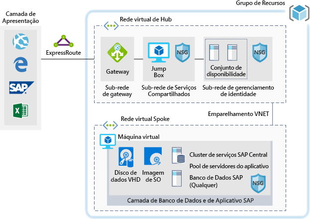

# SAP para cargas de trabalho de desenvolvimento/teste

Este exemplo fornece orientações sobre como executar uma implementação de desenvolvimento/teste do SAP NetWeaver em um ambiente Windows ou Linux no Azure. O banco de dados usado é o AnyDB, o termo SAP para qualquer DBMS compatível (que não seja SAP HANA). Como essa arquitetura foi projetada para ambientes que não são de produção, ele é implantado com somente uma máquina virtual (VM) e o seu tamanho pode ser alterado para acomodar as necessidades da sua organização.

Para casos de uso de produção veja as arquiteturas SAP de referência disponíveis abaixo:

* [SAP Netweaver para AnyDB][sap-netweaver]
* [SAP S/4Hana][sap-hana]
* [SAP em instâncias grandes do Azure][sap-large]

## Casos de uso relacionados

Considere este cenário para os casos de uso a seguir:

* Cargas de trabalho do SAP não críticas e que não são de produção (área restrita, desenvolvimento, teste, garantia de qualidade)
* Cargas de trabalho não críticas do SAP Business One

## Arquitetura

Este cenário cobre o provisionamento de um banco de dados do sistema SAP individual e um Servidor de Aplicativos do SAP em uma única máquina virtual, o fluxo de dados ocorre da seguinte forma neste cenário:

1. Os clientes da camada de apresentação utilizam a GUI do SAP ou alguma outra interface de usuário (Internet Explorer, Excel ou outro aplicativo Web) local para acessar o sistema SAP baseado no Azure.
2. A conectividade é fornecida através do Express Route estabelecido. O Express Route é terminado no Azure no gateway do Express Route. O tráfego de rede é roteado através do gateway do Express Route para a sub-rede do gateway e desta para a sub-rede spoke da camada de aplicativo (consulte o padrão [hub-spoke][hub-spoke] pattern) e através de um gateway de segurança de rede até a máquina virtual do aplicativo SAP.
3. Os servidores de gerenciamento de identidade oferecem serviços de autenticação.
4. A caixa de atalhos oferece recursos de gerenciamento local.

### Componentes

* [Grupos de recursos](/azure/azure-resource-manager/resource-group-overview#resource-groups) são contêineres lógicos para recursos do Azure.
* [Redes virtuais](/azure/virtual-network/virtual-networks-overview) são a base das comunicações de rede no Azure
* [Máquinas virtuais](/azure/virtual-machines/windows/overview) no Azure oferecem uma infraestrutura sob demanda, de alta capacidade de dimensionamento, virtualizada que usa um servidor Windows ou Linux
* [Express Route](/azure/expressroute/expressroute-introduction) permite estender as redes locais na nuvem da Microsoft para uma conexão privada facilitada por um provedor de conectividade.
* [Grupo de segurança de rede](/azure/virtual-network/security-overview) permite limitar o tráfego de rede para recursos em uma rede virtual. Um grupo de segurança de rede contém uma lista de regras de segurança que permitem ou negam o tráfego de rede de entrada ou saída com base no endereço IP de origem ou destino, na porta e no protocolo. 

## Considerações

### Disponibilidade

 A Microsoft oferece um contrato de nível de serviço (SLA) para instância de VM individuais. Para saber mais informações sobre o contrato de nível de serviço do Microsoft Azure para máquinas virtuais consulte [SLA para máquinas virtuais](https://azure.microsoft.com/support/legal/sla/virtual-machines)

### Escalabilidade

Para obter diretrizes gerais sobre como criar soluções escalonáveis, confira a [lista de verificação de escalabilidade] [ scalability] no Azure Architecture Center.

### Segurança

Para obter orientação geral sobre como criar soluções seguras, confira a [Documentação de segurança do Azure][security].

### Resiliência

Para obter diretrizes gerais sobre como criar soluções resilientes, confira [Projetando aplicativos resilientes para o Azure][resiliency].

## Preços

Explore o custo de executar esse cenário, todos os serviços são pré-configurados na calculadora de custos.  Para ver como o preço seria alterado para o seu uso específico altere as variáveis apropriadas para que eles sejam correspondentes ao tráfego esperada.

Fornecemos quatro exemplos de perfis de custo com base na quantidade de tráfego que você espera obter:

|Tamanho|SAPs|Tipo de VM|Armazenamento|Calculadora de Preços do Azure|
|----|----|-------|-------|---------------|
|Pequena|8000|D8s_v3|2xP20, 1xP10|[Pequeno](https://azure.com/e/9d26b9612da9466bb7a800eab56e71d1)|
|Média|16000|D16s_v3|3xP20, 1xP10|[Médio](https://azure.com/e/465bd07047d148baab032b2f461550cd)|
grande|32000|E32s_v3|3xP20, 1xP10|[Grande](https://azure.com/e/ada2e849d68b41c3839cc976000c6931)|
Extra grande|64000|M64s|4xP20, 1xP10|[Extra grande](https://azure.com/e/975fb58a965c4fbbb54c5c9179c61cef)|

Observação: o preço é um guia e indica apenas os custos de armazenamento e VMs (exclui cobranças de rede, armazenamento de backup e entrada/saída de dados).

* [Pequeno](https://azure.com/e/9d26b9612da9466bb7a800eab56e71d1): Um sistema pequeno é composto por uma VM do tipo D8s_v3 com 8x vCPUs, 32GB de RAM e 200 GB de armazenamento temporário, além de dois discos de armazenamento premium de 512 GB e um de 128 GB.
* [Médio](https://azure.com/e/465bd07047d148baab032b2f461550cd): Um sistema médio é composto por uma VM do tipo D16s_v3 com 16x vCPUs, 64 GB de RAM e 400 GB de armazenamento temporário, além de três discos de armazenamento premium de 512 GB e um de 128 GB.
* [Grande](https://azure.com/e/ada2e849d68b41c3839cc976000c6931): Um sistema grande é composto por uma VM do tipo E32s_v3 com 32x vCPUs, 256 GB de RAM e 512 GB de armazenamento temporário, além de três discos de armazenamento premium de 512 GB e um de 128 GB.
* [Extra grande](https://azure.com/e/975fb58a965c4fbbb54c5c9179c61cef): Um sistema grande é composto por uma VM do tipo M64s_v3 com 64x vCPUs, 1024 GB de RAM e 2000 GB de armazenamento temporário, além de quatro discos de armazenamento premium de 512 GB e um de 128 GB.

## Implantação

Para implantar uma infraestrutura semelhante àquela apresentada no cenário acima, use o botão de implantação

\* SAP não será instalado, você precisará fazer isso após a infraestrutura ter sido criada manualmente.

<!-- links -->
[reference architecture]:  /azure/architecture/reference-architectures/sap
[resiliency]: /azure/architecture/resiliency/
[security]: /azure/security/
[scalability]: /azure/architecture/checklist/scalability
[sap-netweaver]: /azure/architecture/reference-architectures/sap/sap-netweaver
[sap-hana]: /azure/architecture/reference-architectures/sap/sap-s4hana
[sap-large]: /azure/architecture/reference-architectures/sap/hana-large-instances
[hub-spoke]: /azure/architecture/reference-architectures/hybrid-networking/hub-spoke