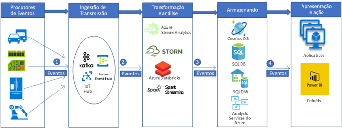

# Ingestão e processamento de dados de IoT automotivos em tempo real

Este cenário de exemplo cria um pipeline de ingestão e processamento de dados em tempo real para ingerir e processar mensagens de dispositivos de IoT (em sensores gerais) em uma plataforma de análise de Big Data no Azure. As plataformas de ingestão e processamento de telemática de veículos são fundamentais para a criação de soluções automotivas conectadas. Este cenário específico é motivado pelos sistemas de ingestão e processamento de telemática automotiva. No entanto, os padrões de design são relevantes para muitos setores que usam sensores para gerenciar e monitorar sistemas complexos em diversos setores como edifícios inteligentes, comunicações, fabricação, varejo e assistência médica.

Este exemplo demonstra um pipeline de ingestão e processamento de dados em tempo real para mensagens de dispositivos IoT instalados em veículos. Milhões de mensagens (ou eventos) são gerados por sensores e dispositivos IoT. Com a captura e a análise dessas mensagens, podemos decifrar informações valiosas e tomar as medidas apropriadas. Por exemplo, em automóveis equipados com dispositivos de telemática, se pudermos capturar as mensagens do dispositivo (IoT) em tempo real, poderemos monitorar a localização em tempo real de veículos, planejar rotas otimizadas, fornecer assistência a motoristas e dar suporte a setores ligados a telemática, como o de seguros de automóveis.

Para esta demonstração de exemplo, imagine uma montadora de carros que deseja criar um sistema de ingestão e processamento de mensagens em tempo real de dispositivos de telemática. As metas da empresa incluem:
* A ingestão e o armazenamento de dados em tempo real de sensores e dispositivos de veículos.
* A análise de mensagens para compreensão da localização do veículo e outras informações emitidas por meio de diferentes tipos de sensores (como os relacionados ao motor e ao meio-ambiente).
* O armazenamento dos dados pós-análise para outros processamentos de downstream e fornecimento de insights acionáveis (por exemplo, em cenários de acidente, as agências de seguros podem querer saber o que aconteceu durante um acidente etc.)

## Casos de uso relevantes

Outros casos de uso relevantes incluem:

* Alertas e lembretes de manutenção do veículo.
* Serviços baseados na localização para os passageiros do veículo (ou seja, o SOS).
* Veículos autônomos (autoguiados).

## Arquitetura

Em uma implementação típica de pipeline de processamento de Big Data, os dados fluem da esquerda para a direita. Neste pipeline de processamento de Big Data em tempo real, os dados fluem pela solução da seguinte maneira:

1. Os eventos gerados nas fontes de dados IoT são enviados para a camada de ingestão de fluxo pelo Azure HDInsight Kafka como um fluxo de mensagens. O HDInsight Kafka armazena os fluxos de dados em tópicos para um tempo configurável.
2. O Azure Databricks, consumidor do Kafka, recebe a mensagem em tempo real do tópico do Kafka, para processar os dados com base na lógica de negócios e depois poder enviar para armazenamento na camada de serviço.
3. Os serviços de armazenamento downstream, como o Azure Cosmos DB, o SQL Data Warehouse do Azure ou o Azure SQL DB se tornarão fontes de dados para a camada de apresentação e ação.
4. Os analistas de negócios podem usar o Microsoft Power BI para a análise dos dados armazenados. Outros aplicativos também podem ser integrados à camada de serviço. Por exemplo, é possível expor APIs com base nos dados da camada de serviço para usos de terceiros.

### Componentes
Os eventos gerados por dispositivos IoT (dados ou mensagens) são ingeridos, processados e armazenados para análise, apresentação e ação posteriores, usando os seguintes componentes do Azure:
* O [Apache Kafka no HDInsight](/azure/hdinsight/kafka/apache-kafka-introduction) fica na camada de ingestão. Os dados são gravados no tópico Kafka usando um API de produtor do Kafka.
* O [Azure Databricks](/services/databricks) está localizado na camada de transformação e análise. Os blocos de anotações do Databricks implementam uma API de consumidor Kafka para ler os dados do tópico Kafka.
* O [Azure Cosmos DB](/services/cosmos-db), o [Banco de Dados SQL do Azure](/azure/sql-database/sql-database-technical-overview) e o SQL Data Warehouse do Azure estão na camada de armazenamento do serviço, em que o Azure Databricks pode gravar os dados por meio de conectores de dados.
* O [SQL Data Warehouse do Azure](/azure/sql-data-warehouse/sql-data-warehouse-overview-what-is) é um sistema distribuído para armazenamento e análise de grandes conjuntos de dados. O uso que ele faz do MPP (processamento altamente paralelo) o torna adequado para a execução de análises de alto desempenho.
* [Power BI](https://docs.microsoft.com/power-bi) é um conjunto de ferramentas de análise de negócios para analisar dados e compartilhar informações. O Power BI pode consultar um modelo semântico armazenado no Analysis Services ou pode consultar diretamente o SQL Data Warehouse.
* O [Azure Active Directory (Azure AD)](/azure/active-directory) autentica os usuários, ao se conectar ao [Azure Databricks](https://azure.microsoft.com/services/databricks). Se criássemos um cubo no [Analysis Services](/azure/analysis-services) com base no modelo dos dados do SQL Data Warehouse do Azure, poderíamos usar o AAD para conexão ao servidor do Analysis Services por meio do Power BI. O Data Factory também pode usar o Azure AD para autenticação no SQL Data Warehouse por meio de uma entidade de serviço ou uma Identidade de Serviço Gerenciada (MSI).
* Os [Serviços de Aplicativos do Azure](/azure/app-service/app-service-web-overview), em especial o [Aplicativo API](/services/app-service/api), podem ser usados para expor dados a terceiros, com base nos dados armazenados na camada de serviço.

## Alternativas

Um pipeline de Big Data mais generalizado pode ser implementado usando outros componentes do Azure.
* Na camada de ingestão de fluxo, poderíamos usar o [Hub IoT](https://azure.microsoft.com/services/iot-hub) ou o [Hub de Eventos](https://azure.microsoft.com/services/event-hubs) em vez do [HDInsight Kafka](/azure/hdinsight/kafka/apache-kafka-introduction) para ingestão de dados.
* Na camada de análise e transformação, poderíamos usar o [HDInsight Storm](/azure/hdinsight/storm/apache-storm-overview), o [HDInsight Spark](/azure/hdinsight/spark/apache-spark-overview) ou o [Azure Stream Analytics](https://azure.microsoft.com/services/stream-analytics).
* O [Analysis Services](/azure/analysis-services) fornece um modelo semântico para seus dados. Ele também pode aumentar o desempenho do sistema ao analisar seus dados. É possível criar o modelo com base nos dados do Azure DW.

## Considerações

As tecnologias nesta arquitetura foram escolhidas com base na escala necessária para processamento dos eventos, no SLA dos serviços, no gerenciamento de custos e na facilidade de gerenciamento dos componentes.
* O [HDInsight Kafka](/azure/hdinsight/kafka/apache-kafka-introduction) gerenciado vem com um SLA integrado 99,9% com o Azure Managed Disks
* O [Azure Databricks](/azure/azure-databricks/what-is-azure-databricks) é otimizado desde o início para proporcionar desempenho e eficiência de custos na nuvem. O Databricks Runtime adiciona várias funcionalidades essenciais às cargas de trabalho do Apache Spark que podem aumentar o desempenho e reduzir os custos entre dez a 100 vezes quando em execução no Azure, incluindo:
* O Azure Databricks se integra totalmente aos bancos de dados do Azure e armazena: o [SQL Data Warehouse do Azure](/azure/sql-data-warehouse), o [Azure Cosmos DB](https://azure.microsoft.com/services/cosmos-db), o [Azure Data Lake Storage](https://azure.microsoft.com/services/storage/data-lake-storage) e o [Armazenamento de Blobs do Azure](https://azure.microsoft.com/services/storage/blobs)
    * Dimensionamento e término automáticos para clusters do Spark para minimização automática de custos.
    * Otimizações de desempenho, incluindo o armazenamento em cache, a indexação e a otimização de consulta avançada, que pode melhorar o desempenho entre dez a 100 vezes em comparação a implantações tradicionais do Apache Spark em ambientes locais ou na nuvem.
    * A integração com o Azure Active Directory permite que você execute soluções completas baseadas no Azure usando o Azure Databricks.
    * O acesso baseado em funções no Azure Databricks possibilita permissões refinadas de usuário para blocos de notas, clusters, trabalhos e dados.
    * Vem com SLAs de nível corporativo.
* O Azure Cosmos DB é o banco de dados multimodelo da Microsoft distribuído globalmente. Ele foi criado do zero com distribuição global e escala horizontal em sua essência. Oferece distribuição global pronta para uso em qualquer quantidade de regiões do Azure, dimensionando e replicando seus dados de forma transparente onde quer que os usuários estejam. Você pode dimensionar a taxa de transferência e o armazenamento de maneira elástica em todo o mundo e pagar apenas pela taxa de transferência e pelo armazenamento de que precisar.
* A arquitetura de processamento altamente paralelo do SQL Data Warehouse oferece alto desempenho e escalabilidade.
* O SQL Data Warehouse do Azure tem SLAs garantidos e práticas recomendadas para alcançar alta disponibilidade.
* Quando a atividade de análise estiver baixa, a empresa pode dimensionar o SQL Data Warehouse do Azure sob demanda, reduzindo ou até mesmo interrompendo a computação para reduzir os custos.
* O modelo de segurança do SQL Data Warehouse do Azure oferece segurança, autenticação e autorização de conexão por meio do Azure AD ou da autenticação do SQL Server e da criptografia.

## Preços

Examine os [preços do Azure Databricks](https://azure.microsoft.com/pricing/details/databricks), os [preços do Azure HDInsight](https://azure.microsoft.com/pricing/details/hdinsight) e uma [amostra de preços para um cenário de armazenamento de dados](https://azure.com/e/b798fb70c53e4dd19fdeacea4db78276) por meio da calculadora de preços do Azure. Ajuste os valores para ver como seus requisitos afetam os custos.
* O [Azure HDInsight](/azure/hdinsight) é um serviço de nuvem totalmente gerenciado que facilita e torna mais rápido e econômico processar enormes quantidades de dados
* O [Azure Databricks](https://azure.microsoft.com/services/databricks) oferece duas cargas de trabalho distintas em várias [Instâncias de VM](https://azure.microsoft.com/pricing/details/databricks/#instances) adaptadas ao seu fluxo de trabalho de análise de dados. A carga de trabalho de Engenharia de Dados facilita a criação e a execução de trabalhos pelos engenheiros de dados e a carga de trabalho de Análise de Dados facilita a exploração, a visualização, a manipulação e o compartilhamento interativos de dados e percepções pelos cientistas de dados.
* O [Azure Cosmos DB](https://azure.microsoft.com/services/cosmos-db) garante latências de milissegundo de um dígito no 99º percentil em qualquer parte do mundo, oferece [vários modelos de consistência bem definidos](/azure/cosmos-db/consistency-levels) para ajustar o desempenho e garante alta disponibilidade com funcionalidades de hospedagem múltipla, tudo com suporte de [contratos de nível de serviço](https://azure.microsoft.com/support/legal/sla/cosmos-db) (SLAs) abrangentes e líderes do setor.
* O [SQL Data Warehouse do Azure](https://azure.microsoft.com/pricing/details/sql-data-warehouse/gen2) possibilita o dimensionamento dos níveis de computação e armazenamento de forma independente. Os recursos de computação são cobrados por hora e você pode dimensioná-los ou interrompê-los sob demanda. Os recursos de armazenamento são cobrados por terabyte, assim seus custos aumentam à medida que você insere mais dados.
* O [Analysis Services](https://azure.microsoft.com/pricing/details/analysis-services) está disponível nas camadas desenvolvedor, básico e standard. As instâncias são cobradas com base em QPUs (unidades de processamento de consulta) e na memória disponível. Para manter os custos reduzidos, minimize o número de consultas executadas, a quantidade de dados processada e a frequência de execução.
* O [Power BI](https://powerbi.microsoft.com/pricing) tem diferentes opções de produto para diversos requisitos. O [Power BI Embedded](https://azure.microsoft.com/pricing/details/power-bi-embedded) fornece uma opção baseada no Azure para incorporar a funcionalidade do Power BI em seus aplicativos. Uma instância do Power BI Embedded está incluída no exemplo de preço acima.

## Próximas etapas

* Examine a arquitetura de referência de [análise em tempo real](https://azure.microsoft.com/solutions/architecture/real-time-analytics) que inclui o fluxo de pipeline de Big Data.
* Examine a arquitetura de referência de [análises avançadas em Big Data](https://azure.microsoft.com/solutions/architecture/advanced-analytics-on-big-data) para dar uma olhada em como os diferentes componentes do Azure podem ajudar a criar um pipeline de Big Data.
* Leia a documentação do Azure sobre [processamento em tempo real](/azure/architecture/data-guide/big-data/real-time-processing) para ter uma visão geral de como os diferentes componentes do Azure ajudam no processamento de fluxos de dados em tempo real.
* Encontre orientações abrangentes de arquitetura em pipelines de dados, data warehouse, processamento analítico online (OLAP) e Big Data no [Guia de arquitetura de dados do Azure](/azure/architecture/data-guide).
