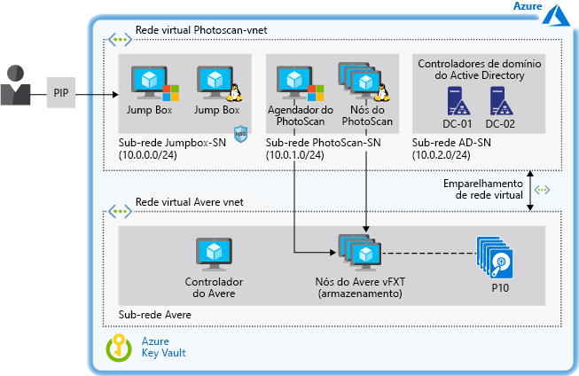

# Acelerar a modelagem baseada em imagem digital no Azure

Este cenário de exemplo oferece orientação de arquitetura e design para qualquer organização que queira fazer a modelagem baseada em imagem na IaaS (infraestrutura como serviço) do Azure. O cenário é projetado para executar software de fotogrametria em VMs (máquinas virtuais) do Azure usando um armazenamento de alto desempenho que agiliza o tempo de processamento. O ambiente pode ser escalado e reduzido verticalmente conforme a necessidade e dá suporte a terabytes de armazenamento sem prejudicar o desempenho.

## Casos de uso relevantes

Outros casos de uso relevantes incluem:

- Modelagem e medição de prédios, estruturas de engenharia e cenas de investigação de acidentes.
- Criação de efeitos visuais para filmes e jogos de computador.
- Uso de imagens digitais para gerar indiretamente medições de objetos de várias escalas, como no planejamento urbano e em outros usos.

## Arquitetura

Este exemplo descreve o uso do software de fotogrametria Agisoft PhotoScan com suporte do repositório do Avere vFXT. O PhotoScan foi escolhido pela sua popularidade em aplicativos de GIS (sistema de informações geográficas), documentação de herança cultural, desenvolvimento de jogos e produção de efeitos visuais. Ele é adequado tanto para fotogrametria aérea quanto de proximidade.

Os conceitos neste artigo se aplicam a qualquer carga de trabalho de HPC (computação de alto desempenho) com base em um agendador e nós de trabalho gerenciados como infraestrutura.  Para essa carga de trabalho, o Avere vFXT foi selecionado por conta de seu desempenho superior durante os testes de benchmark.  No entanto, o cenário distingue o armazenamento do processamento para que outras soluções de armazenamento possam ser usadas (confira as [alternativas](#alternatives) mais adiante neste documento).

Esta arquitetura também inclui os controladores de domínio do Active Directory para controlar o acesso aos recursos do Azure e fornecer resolução de nomes interna por meio de DNS (Sistema de Nomes de Domínio). Jump boxes fornecem acesso de administrador a VMs do Windows e do Linux que estejam executando a solução.

1. O usuário envia várias imagens ao PhotoScan.
2. O Agendador do PhotoScan é executado em uma VM do Windows que serve como o nó de cabeçalho e orienta o processamento das imagens do usuário.
3. O PhotoScan procura pontos comuns nas fotografias e constrói a geometria (malha) usando os nós de processamento do PhotoScan executados em VMs com GPUs (unidades de processamento gráfico).
4. O Avere vFXT fornece uma solução de armazenamento de alto desempenho no Azure com base em NFSv3 (Network File System versão 3) e composta por pelo menos quatro VMs.
5. O PhotoScan renderiza o modelo.

### Componentes

- [Agisoft PhotoScan](http://www.agisoft.com/): o Agendador do PhotoScan é executado em uma VM do Windows Server 2016 e os nós de processamento usam cinco VMs com GPUs que executam o CentOS Linux 7.5.
- O [Avere vFXT](/azure/avere-vfxt/avere-vfxt-overview) é um arquivo de solução de cache de arquivos que usa armazenamento de objeto e NAS (Network Attached Storage) para otimizar o armazenamento de grandes conjuntos de dados.  Ele inclui:
  - Controlador do Avere. Essa VM executa o script que instala o cluster do Avere vFXT e executa Ubuntu 18.04 LTS. A VM pode ser usada posteriormente para adicionar ou remover nós de cluster e também para acabar com o cluster.
  - Cluster do vFXT. Pelo menos três VMs são usadas, uma para cada um dos nós do Avere vFXT com base no sistema operacional Avere 5.0.2.1. Essas VMs formam o cluster do vFXT, que é anexado ao Armazenamento de Blobs do Azure.
- Os [controladores de domínio do Microsoft Active Directory](/windows/desktop/ad/active-directory-domain-services) dão ao host acesso aos recursos do domínio e fornecem resolução de nomes DNS. O Avere vFXT adiciona vários registros; por exemplo, cada registro em um cluster do vFXT aponta para o endereço IP de cada nó do Avere vFXT. Nessa configuração, todas as VMs usam o padrão round robin para acessar exportações do vFXT.
- [Outras VMs](/azure/virtual-machines/) servem como jump boxes usadas pelo administrador para acessar os nós de processamento e do agendador. A jumpbox do Windows é obrigatória para permitir que o administrador acesse o nó de cabeçalho por meio do protocolo de área de trabalho remota. A segunda jumpbox é opcional e executa o Linux para administrar nós de trabalho.
- Os [NSGs](/azure/virtual-network/manage-network-security-group) (Grupos de Segurança de Rede) limitam o acesso ao PIP (endereço IP público) e permitem as portas 3389 e 22 para acesso às VMs conectadas à sub-rede da Jumpbox.
- O [Emparelhamento VNET](/azure/virtual-network/virtual-network-peering-overview) conecta uma rede virtual do PhotoScan a uma rede virtual do Avere.
- O [Armazenamento de Blobs do Azure](/azure/storage/blobs/storage-blobs-introduction) funciona com o Avere vFXT como o arquivista principal para armazenar os dados confirmados que estão sendo processados. O Avere vFXT identifica os dados ativos armazenados no Blob do Azure e os coloca em camadas nas SSD (unidades de estado sólido) usadas para fazer o cache em seus nós de computação enquanto um trabalho do PhotoScan está em execução. Em caso de alterações, os dados são assincronamente confirmados novamente no arquivista principal.
- O [Azure Key Vault](/azure/key-vault/key-vault-overview) é usado para armazenar as senhas de administrador e o código de ativação do PhotoScan.

### Alternativas

- Para tirar proveito dos serviços do Azure para gerenciar um cluster de HPC, use ferramentas como o Azure CycleCloud ou o Lote do Azure em vez de gerenciar os recursos por meio de modelos ou scripts.
- Implante o sistema de arquivos virtuais paralelos BeeGFS como o armazenamento de back-end no Azure em vez do Avere vFXT. Use o [modelo do BeeGFS](https://github.com/paulomarquesc/beegfs-template) para implantar essa solução de ponta a ponta no Azure.
- Implante a solução de armazenamento de sua escolha, como GlusterFS, Lustre ou Espaços de Armazenamento Diretos do Windows. Para fazer isso, edite o [modelo do PhotoScan](https://github.com/paulomarquesc/photoscan-template) para trabalhar com a solução de armazenamento desejada.
- Implante os nós de trabalho com o sistema operacional Windows em vez do Linux, a opção padrão. Ao escolher nós do Windows, as opções de integração de armazenamento não serão executadas pelos modelos de implantação. Você deve integrar o ambiente a uma solução de armazenamento existente manualmente ou personalizar o modelo do PhotoScan para fornecer essa automação, conforme descrito no [repositório](https://github.com/paulomarquesc/photoscan-template/blob/master/docs/AverePostDeploymentSteps.md).

## Considerações

Esse cenário foi projetado especificamente para fornecer armazenamento de alto desempenho para uma carga de trabalho de HPC, seja implantada no Windows ou no Linux. Em geral, a configuração de armazenamento da carga de trabalho de HPC deve corresponder às práticas recomendadas pertinentes usadas para implantações locais.

As considerações sobre a implantação dependem dos aplicativos e serviços usados, mas algumas observações se aplicam:

- Ao criar aplicativos de alto desempenho, use o Armazenamento Premium do Azure e [otimize a camada de aplicativo](/azure/virtual-machines/windows/premium-storage-performance). Otimize o armazenamento para acesso frequente usando a [camada de acesso frequente](/azure/storage/blobs/storage-blob-storage-tiers) do Blob do Azure.
- Use uma [opção de replicação](/azure/storage/common/storage-redundancy) de armazenamento que atenda às necessidades de desempenho e disponibilidade. Neste exemplo, o Avere vFXT está configurado para alta disponibilidade por padrão, com LRS (armazenamento com redundância local). Para balanceamento de carga, todas as VMs nessa instalação usam o padrão round robin para acessar as exportações do vFXT.
- Se o armazenamento de back-end for consumido por clientes do Windows e do Linux, use servidores Samba para dar suporte a nós do Windows. Uma [versão](https://github.com/paulomarquesc/beegfs-template) deste cenário de exemplo com base em BeeGFS usa Samba para dar suporte ao nó agendador da carga de trabalho de HPC (PhotoScan) em execução no Windows. Um balanceador de carga é implantado para atuar como uma substituição inteligente do round robin de DNS.
- Execute aplicativos de HPC usando o tipo de VM mais adequado para sua carga de trabalho do [Windows](/azure/virtual-machines/windows/sizes-hpc) ou do [Linux](/azure/virtual-machines/linux/sizes?toc=%2fazure%2fvirtual-machines%2flinux%2ftoc.json).
- Para isolar a carga de trabalho de HPC dos recursos de armazenamento, implante cada uma em sua própria rede virtual e, em seguida, use o [emparelhamento](/azure/virtual-network/virtual-network-peering-overview) VNET para conectá-las. O emparelhamento cria uma conexão de baixa latência e alta largura de banda entre recursos em redes virtuais diferentes e roteia o tráfego pela infraestrutura de backbone da Microsoft somente por meio de endereços IP privados.

### Segurança

Este exemplo se concentra na implantação de uma solução de armazenamento de alto desempenho para uma carga de trabalho de HPC e não é uma solução de segurança. Envolva sua equipe de segurança em caso de alterações.

Para aumentar a segurança, a infraestrutura de exemplo permite que todas as VMs do Windows ingressem no domínio e usa o Active Directory para autenticação central. Ela também fornece serviços DNS personalizados para todas as VMs. Para ajudar a proteger o ambiente, o modelo utiliza [NSGs (Grupos de Segurança de Rede)](/azure/virtual-network/security-overview). Os NSGs oferecem regras de segurança e filtros de tráfego básicos.

Considere as seguintes opções para melhorar ainda mais a segurança no cenário:

- Use dispositivos de rede virtual, como Fortinet, Checkpoint e Juniper.
- Aplique [controle de acesso baseado em função](/azure/role-based-access-control/overview) aos grupos de recursos.
- Habilite o acesso [JIT](/azure/security-center/security-center-just-in-time) à VM se as jump boxes forem acessadas pela Internet.
- Use o [Azure Key Vault](/azure/key-vault/quick-create-portal) para armazenar as senhas usadas pelas contas de administrador.

## Preços

O custo de executar este cenário pode variar bastante, dependendo de vários fatores.  O número e o tamanho das VMs, a quantidade de armazenamento necessária e a quantidade de tempo exigida para concluir um trabalho determinarão seu custo.

O perfil de custo de exemplo a seguir na [Calculadora de preços do Azure](https://azure.com/e/42362ddfd2e245a28a8e78bc609c80f3) baseia-se em uma configuração típica para Avere vFXT e PhotoScan:

- 1 VM A1\_v2 Ubuntu para executar o controlador do Avere.
- 3 VMs D16s\_v3 Avere SO, uma para cada um dos nós do Avere vFXT que formam o cluster do vFXT.
- 5 VMs NC24\_v2 do Linux para fornecer as GPUs necessárias para os nós de processamento do PhotoScan.
- 1 VM D8s\_v3 CentOS para o nó do Agendador do PhotoScan.
- 1 CentOS DS2\_v2 usado como jumpbox do administrador.
- 2 VMs DS2\_v2 para os controladores de domínio do Active Directory.
- Discos gerenciados Premium.
- Armazenamento de Blobs de Uso Geral v2 (GPv2) com LRS e acesso frequente (somente contas de armazenamento GPv2 expõem o atributo Camada de Acesso).
- Rede virtual com suporte para transferência de dados de 10 TB.

Para obter detalhes sobre a arquitetura, confira o [livro eletrônico](https://azure.microsoft.com/en-us/resources/deploy-agisoft-photoscan-on-azure-with-azere-vfxt-for-azure-or-beegfs/). Para ver como o preço seria alterado para o seu caso de uso específico, escolha diferentes tamanhos de VM na calculadora de preços para corresponder à implantação estimada.

## Implantação

Para obter instruções passo a passo para implantar a arquitetura, incluindo todos os pré-requisitos para usar o Avere FxT ou o BeeGFS, faça o download do livro eletrônico: [Implantar Agisoft PhotoScan no Azure com Avere vFXT para Azure ou BeeGFS](https://azure.microsoft.com/en-us/resources/deploy-agisoft-photoscan-on-azure-with-azere-vfxt-for-azure-or-beegfs/).

## Recursos relacionados

Os recursos a seguir fornecerão mais informações sobre os componentes utilizados neste cenário, juntamente com abordagens alternativas para a computação em lote no Azure.

- Visão geral do [Avere vFXT para Azure](/azure/avere-vfxt/avere-vfxt-overview)
- Página inicial do [Agisoft PhotoScan](https://www.agisoft.com/)
- [Lista de verificação de desempenho e escalabilidade do Armazenamento do Azure](/azure/storage/common/storage-performance-checklist)
- [Sistemas de arquivos virtuais paralelos no Microsoft Azure: testes de desempenho de Lustre, GlusterFS e BeeGFS](https://azure.microsoft.com/mediahandler/files/resourcefiles/parallel-virtual-file-systems-on-microsoft-azure/Parallel_Virtual_File_Systems_on_Microsoft_Azure.pdf) (PDF)
- Um cenário de exemplo para [CAE (engenharia auxiliada por computador) no Azure](/azure/architecture/example-scenario/apps/hpc-saas)
- Página inicial de [HPC no Azure](https://azure.microsoft.com/en-us/solutions/high-performance-computing/)
- Visão geral do [Big Compute: HPC &amp; Lote do Microsoft](https://azure.microsoft.com/en-us/solutions/big-compute/)